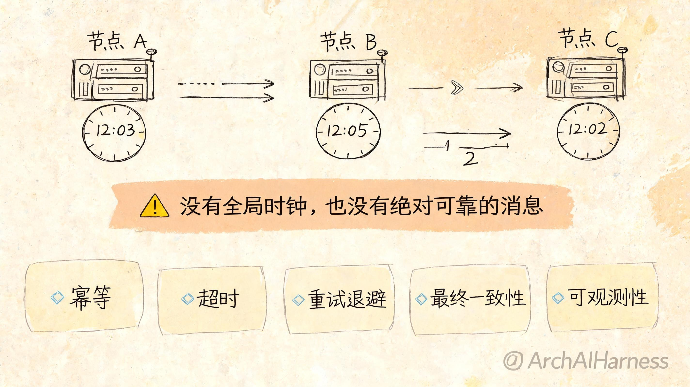
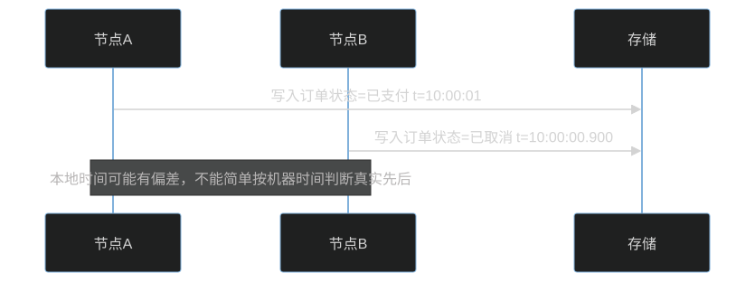

# 分布式系统的第一性原理：没有全局时钟，也没有绝对可靠的消息

单机系统里，很多假设默认成立：函数调用要么返回，要么抛错；内存里的状态是当前状态；时间顺序相对清晰。但一旦进入分布式系统，这些假设会迅速失效。

分布式系统的第一性原理可以概括为两句话：没有全局时钟，也没有绝对可靠的消息。

## 一、为什么没有全局时钟

不同机器有自己的本地时钟。即使使用 NTP 校准，也只能缩小误差，不能保证所有节点在任意时刻拥有完全一致的时间。

这会带来一个问题：如果两个节点几乎同时写入，谁先谁后并不总是显然的。

所以，分布式系统经常需要逻辑时钟、版本号、幂等键、事务日志或共识协议来补充时间的不可靠。

## 二、为什么没有绝对可靠的消息

网络消息可能丢失、延迟、重复、乱序。更麻烦的是，发送方很难判断一次失败到底发生在哪里。

例如：

1. 请求没有到达服务端。
2. 请求到达了，但服务端处理失败。
3. 服务端处理成功，但响应丢了。
4. 客户端超时了，但服务端稍后提交成功。

从客户端视角看，这些可能都表现为“超时”。

## 三、CAP 不是口号，而是故障下的取舍

CAP 讨论的是网络分区发生时，一致性和可用性之间的取舍。

真实系统不是简单选择 CP 或 AP，而是在不同业务场景下设置不同边界。例如支付扣款更偏一致性，内容浏览更偏可用性。

## 四、工程视角：可靠性来自设计，不来自祈祷

分布式系统要默认失败会发生，并提前设计恢复机制。

常见设计包括：

- 幂等：重复请求不会产生重复副作用。
- 重试：处理偶发失败，但必须配合退避和限流。
- 超时：避免无限等待。
- 熔断：阻止故障扩散。
- 补偿：失败后通过反向操作修复状态。
- 最终一致性：允许短暂不一致，但要求最终收敛。

## 五、常见误区

### 误区一：加重试就可靠了

没有幂等和退避的重试，可能把故障放大。

### 误区二：分布式事务能解决所有一致性问题

强一致性有成本。跨服务事务会增加耦合、延迟和失败复杂度。

### 误区三：消息队列保证不会丢消息就够了

即使消息不丢，也可能重复、乱序或消费失败。消费者仍要做幂等和状态校验。

## 六、实践建议

1. 所有跨服务调用都设置超时。
2. 所有可能重试的写操作都设计幂等键。
3. 对状态流转使用明确的状态机，而不是随意覆盖字段。
4. 把失败路径当成主流程设计。
5. 用日志、Trace 和事件记录还原分布式调用链。

## 结语

分布式系统难，不是因为机器多，而是因为时间、消息和状态都不再可靠。理解这一点，才能真正理解一致性、可用性、幂等、重试和故障恢复。
