# 分布式系统的第一性原理：没有全局时钟，也没有绝对可靠的消息

单机系统里，很多假设默认成立：函数调用要么返回，要么抛错；内存里的状态就是当前状态；时间顺序相对清晰；一次写入完成后，后续读取通常能看到结果。

但一旦进入分布式系统，这些假设会迅速失效。服务分布在不同机器、不同进程、不同网络链路上，状态被拆散，调用跨越网络，时间由各自本地时钟维护，故障也不再是简单的“成功”或“失败”。

分布式系统的第一性原理可以概括为两句话：没有全局时钟，也没有绝对可靠的消息。理解这两句话，才能真正理解为什么分布式系统需要一致性协议、幂等设计、重试策略、超时控制、补偿机制和可观测性。

## 一、为什么没有全局时钟

不同机器有自己的本地时钟。即使使用 NTP 校准，也只能缩小误差，不能保证所有节点在任意时刻拥有完全一致的时间。更重要的是，时钟同步只能让时间更接近，不能让所有事件天然拥有一个全局一致的先后顺序。

这会带来一个问题：如果两个节点几乎同时写入，谁先谁后并不总是显然的。

例如，一个订单状态在节点 A 上被标记为“已支付”，在节点 B 上几乎同时被标记为“已取消”。如果只看机器本地时间，可能会误以为时间戳更晚的事件一定更真实。但在分布式系统中，本地时间可能有偏差，网络消息也可能延迟到达。时间戳只能作为参考，不能天然代表事实顺序。

因此，分布式系统经常需要额外机制来表达顺序和因果关系：

1. 版本号：用递增版本判断状态是否被旧请求覆盖。
2. 逻辑时钟：关注事件之间的先后关系，而不是机器墙上时间。
3. 事务日志：把状态变化记录成可回放、可审计的事件序列。
4. 幂等键：让重复请求不会重复产生副作用。
5. 共识协议：在多个节点之间对同一个状态达成一致。

也就是说，分布式系统不能把“机器时间”直接当成“业务事实”。真正可靠的顺序，通常来自协议、日志、版本和状态机，而不是来自某台机器上的当前时间。

## 二、为什么没有绝对可靠的消息

网络消息可能丢失、延迟、重复、乱序。更麻烦的是，发送方很难判断一次失败到底发生在哪里。

例如：

1. 请求没有到达服务端。
2. 请求到达了，但服务端处理失败。
3. 服务端处理成功，但响应丢了。
4. 客户端超时了，但服务端稍后提交成功。
5. 客户端重试后，服务端收到两次相同请求。
6. 两条消息本来有先后关系，但到达顺序被网络打乱。

从客户端视角看，这些可能都表现为“超时”或“调用失败”。但它们背后的事实完全不同：有的没有产生副作用，有的已经产生副作用，有的产生了副作用但客户端不知道。

这就是分布式调用最难的地方：失败不是一个单点事件，而是一组不确定状态。客户端不知道服务端是否执行，服务端不知道客户端是否收到响应，中间网络也不会给出绝对可靠的证明。

所以，跨服务调用不能只依赖“调用成功/调用失败”两个结果。工程上通常要把请求设计成可重试、可去重、可追踪、可补偿：

- 可重试：偶发失败可以再次尝试。
- 可去重：重复请求不会重复扣款、重复创建订单或重复发货。
- 可追踪：每次请求都有 TraceId、请求 ID 或业务流水号。
- 可补偿：部分成功后，可以通过反向操作或后续任务修复状态。
- 可观测：日志、指标和链路追踪能还原调用过程。

这也是为什么分布式系统里，“超时”不是结束，而是状态未知的开始。

## 三、CAP 不是口号，而是故障下的取舍

CAP 讨论的是网络分区发生时，一致性和可用性之间的取舍。它不是说一个系统平时只能在 C、A、P 中选择两个，而是说：当网络分区已经发生，系统无法同时保证强一致性和完全可用性。

这里的三个词需要谨慎理解：

- 一致性：所有节点对同一份数据的读取结果像来自同一个最新副本。
- 可用性：每个非故障节点都能在有限时间内返回响应。
- 分区容忍性：网络断开、延迟严重或节点之间暂时无法通信时，系统仍要面对现实。

在分布式系统里，网络分区不是可以完全避免的异常，而是必须承认的现实。因此，当分区发生时，系统通常只能选择：

1. 偏一致性：拒绝部分请求，避免返回错误状态。
2. 偏可用性：继续响应请求，接受短暂不一致，之后再收敛。

真实系统不是简单贴一个 CP 或 AP 标签，而是在不同业务场景下设置不同边界。例如支付扣款、库存扣减、账户余额更偏一致性；内容浏览、点赞计数、推荐缓存更偏可用性。一个大型系统内部也可能同时存在偏 CP 和偏 AP 的模块。

因此，CAP 更像是一个故障设计提醒：不要在网络正常时宣称系统完美，而要在网络异常时明确系统愿意牺牲什么、保护什么。

## 四、工程视角：可靠性来自设计，不来自祈祷

分布式系统要默认失败会发生，并提前设计恢复机制。可靠性不是上线后祈祷网络稳定、机器不宕、下游不慢，而是在设计阶段就承认失败必然发生。

常见设计包括：

- 幂等：重复请求不会产生重复副作用。比如同一个支付流水号只能扣款一次。
- 重试：处理偶发失败，但必须配合退避、限流和最大次数，避免把故障放大。
- 超时：避免无限等待。没有超时，调用链会被慢请求拖死。
- 熔断：当下游持续失败时，主动停止调用，阻止故障扩散。
- 降级：核心路径优先，非核心能力可以暂时返回兜底结果。
- 隔离：线程池、连接池、队列和资源额度要隔离，避免一个下游拖垮全局。
- 补偿：失败后通过反向操作、状态修正或人工任务修复结果。
- 最终一致性：允许短暂不一致，但要求有明确的收敛路径。
- 对账：定期比对不同系统之间的状态，发现并修复遗漏。
- 可观测性：用日志、指标、Trace 和事件记录还原故障现场。

这些设计不是互相替代的关系，而是组合关系。一次可靠的跨服务写操作，通常同时需要幂等键、事务日志、状态机、重试、超时、补偿任务和链路追踪。

例如“创建订单并扣减库存”看起来是一件事，但在分布式系统里至少涉及订单服务、库存服务、支付服务、消息队列和数据库。任何一步都可能成功、失败、超时或重复执行。可靠性设计的目标，不是保证每一步永远成功，而是保证系统能识别异常、限制影响、恢复状态，并最终给出可解释的结果。

## 五、常见误区

### 误区一：加重试就可靠了

重试只能处理一部分偶发失败，不能解决所有问题。没有幂等、退避、限流和最大重试次数的重试，可能把故障放大。

例如下游服务已经很慢，上游继续高频重试，会让下游承受更多请求，导致排队更长、超时更多，最后形成雪崩。正确的重试应该回答几个问题：什么错误可以重试？重试几次？间隔如何退避？重复执行是否安全？失败后是否进入补偿或人工处理？

### 误区二：分布式事务能解决所有一致性问题

强一致性有成本。跨服务事务会增加耦合、延迟和失败复杂度。尤其是在服务自治、数据库拆分和网络不稳定的环境中，试图把所有操作都包进一个大事务，往往会让系统更脆弱。

很多业务并不需要全局强一致，而是需要清晰的状态机、可靠事件、补偿流程和最终一致。例如订单可以先进入“待支付”“支付中”“已支付”“库存确认中”等状态，通过事件和任务逐步推进，而不是要求所有服务在同一瞬间完成全部提交。

### 误区三：消息队列保证不会丢消息就够了

即使消息队列尽力保证消息不丢，也可能出现重复投递、乱序到达、消费失败、消费超时和下游写入失败。消息可靠只是链路的一部分，消费者仍要做幂等、状态校验和失败处理。

更准确地说，消息系统通常只能帮助传递事件，不能替业务自动保证正确性。业务必须定义：同一消息重复消费怎么办？旧状态消息晚到怎么办？消费成功但确认失败怎么办？下游写入失败后如何重试？这些问题都需要业务状态机和幂等设计配合解决。

## 六、实践建议

1. 所有跨服务调用都设置超时，避免调用链无限等待。
2. 所有可能重试的写操作都设计幂等键，避免重复副作用。
3. 对状态流转使用明确的状态机，而不是随意覆盖字段。
4. 对关键写操作记录事务日志或业务流水，方便恢复、审计和对账。
5. 区分“失败”和“未知”。超时不等于失败，可能是成功但响应丢失。
6. 把失败路径当成主流程设计，包括重试、补偿、降级、熔断和人工兜底。
7. 对跨服务事件设计唯一消息 ID、业务主键和消费幂等。
8. 对核心链路建立可观测性，用日志、Trace、指标和事件记录还原调用链。
9. 对不同业务选择不同一致性策略，不要把所有场景都强行做成全局强一致。
10. 定期做对账和异常修复，不要假设系统永远不会出现中间状态。

## 结语

分布式系统难，不是因为机器多，而是因为时间、消息和状态都不再天然可靠。没有全局时钟，所以不能轻易相信本地时间代表事实顺序；没有绝对可靠的消息，所以不能把一次超时简单理解成成功或失败；状态分散在多个服务和存储中，所以不能假设所有节点永远同步。

理解这一点，才能真正理解一致性、可用性、幂等、重试、补偿、最终一致性和故障恢复。分布式系统的核心能力，不是消灭所有失败，而是在失败必然发生时，让系统仍然可解释、可恢复、可收敛。
