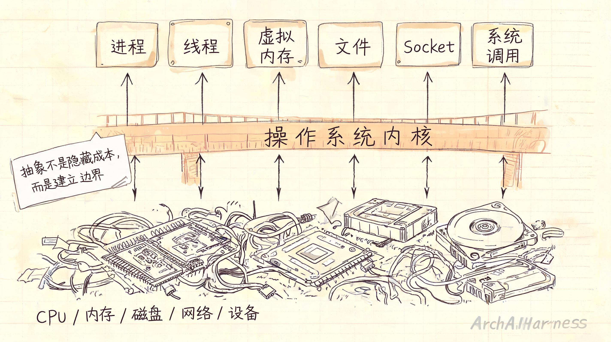

# 操作系统的本质不是管理硬件，而是制造可靠的抽象

很多教材会说，操作系统负责管理 CPU、内存、磁盘、设备和文件。这个定义没有错，但它没有说出操作系统最重要的价值。

操作系统真正厉害的地方，不只是管理硬件，而是把混乱、有限、危险的硬件资源，包装成稳定、可理解、可编程的抽象。



没有操作系统，程序面对的是 CPU 指令、物理内存地址、磁盘扇区、中断和设备寄存器。有了操作系统，程序看到的是进程、线程、虚拟内存、文件、Socket 和系统调用。



## 一、进程：让程序以为自己独占 CPU



现实中，一个 CPU 核心在同一时刻只能执行一条指令。但在操作系统中，多个程序看起来可以“同时运行”。这是进程和调度机制共同制造的抽象。

进程不是简单的“正在运行的程序”。更准确地说，进程是操作系统分配资源和调度执行的基本单位。它包含代码、数据、打开的文件、虚拟地址空间、权限信息、运行状态，以及一组用于恢复执行现场的上下文。

操作系统通过时间片、上下文切换和调度策略，让每个进程都获得一段执行时间。当时间片用完，系统保存当前进程的寄存器、程序计数器和运行状态，再切换到另一个进程。这个过程非常快，所以用户会感觉多个程序在同时运行。

这种抽象带来的好处是：应用程序不需要知道 CPU 正在被多少程序共享，也不需要自己协调所有程序的执行顺序。它只需要相信：我有一个可以持续向前执行的运行环境。

但进程抽象也有成本。上下文切换不是免费的，调度也不是绝对公平的。当系统负载升高、线程数量过多或锁竞争严重时，进程和线程切换会反过来成为性能问题。

## 二、虚拟内存：让程序以为自己独占内存



物理内存是有限的，而且所有程序共享。如果程序直接操作物理地址，安全和稳定性都会崩溃。一个程序写错地址，就可能覆盖另一个程序的数据，甚至破坏操作系统自身。

虚拟内存解决了这个问题。每个进程看到的是独立的虚拟地址空间，操作系统和硬件 MMU 负责把虚拟地址映射到物理地址。应用以为自己在使用一段连续的内存，底层却可能被映射到不同的物理页，也可能暂时不在内存中。

这带来几个关键收益：

1. 进程之间互相隔离，不能随意读写对方内存。
2. 程序可以使用连续地址空间，不必关心物理内存碎片。
3. 操作系统可以按需加载，只在真正访问时再分配或读取页面。
4. 操作系统可以通过页表权限保护内存，例如区分可读、可写、可执行。
5. 非法访问可以被及时拦截，转化为缺页异常、段错误或权限错误。

虚拟内存不是简单的“内存扩容技巧”。它真正重要的价值，是把物理内存重新包装成可隔离、可保护、可映射、可按需加载的运行空间。理解虚拟内存，也是在理解为什么一个普通进程不能随意破坏整个系统。

## 三、文件系统：让磁盘变成名字空间


磁盘本质上更接近块设备。它关心的是扇区、块地址、读写偏移和数据块内容；但程序员真正想使用的是路径、目录、文件名和文件内容。

文件系统的价值，就是在块设备提供的线性块地址空间之上，建立一套更适合人和程序理解的层次化名字空间：

```text
/home/app/config.yaml
/var/log/service.log
```

在这个抽象里，路径负责定位文件，目录项负责把名字关联到文件对象，inode 或类似元数据结构负责记录权限、大小、时间戳和数据块映射关系。文件内容最终可能分散存放在多个磁盘块上，但应用程序不需要直接处理这些块地址。

程序只需要通过路径打开文件，然后使用读取、写入和关闭等操作访问数据。至于路径如何解析、权限如何检查、文件内容落在哪些块上、写入是否先进入缓存、什么时候真正刷到磁盘，都由文件系统和操作系统共同处理。

## 四、系统调用：应用与内核的边界



应用程序运行在用户态，权限受到限制。它不能随意操作硬件，也不能直接修改内核数据结构。否则，一个普通程序就可能破坏其他进程的内存、绕过文件权限、抢占设备资源，甚至拖垮整个系统。

系统调用提供了应用进入内核能力范围的受控入口。比如读文件、写文件、创建进程、申请内存、发送网络数据，本质上都需要操作系统参与。应用程序通常通过标准库或运行库发起调用，最终触发系统调用，从用户态切换到内核态。

进入内核态之后，操作系统会检查参数是否合法、调用者是否有权限、资源是否可用，然后再决定是否执行真正的操作。如果检查通过，内核会操作文件系统、调度器、内存管理器或设备驱动；如果检查不通过，就返回错误。

系统调用的意义在于：应用可以申请能力，但最终由内核裁决。它既是能力边界，也是安全边界。没有系统调用，应用无法方便地使用硬件；没有边界检查，任何应用都可能成为破坏系统稳定性的入口。

## 五、工程视角



抽象不是免费的，也不是永远完美的。操作系统把硬件包装成稳定接口，但当系统压力上来时，被隐藏的底层细节会重新暴露出来。

常见表现包括：

- CPU 调度导致延迟抖动。程序没有变慢，但它迟迟拿不到 CPU 时间片。
- 内存不足导致频繁换页。代码看起来只是访问内存，实际却可能触发磁盘 IO。
- 文件系统缓存影响写入时机。`write` 返回成功，不一定代表数据已经真正落盘。
- 网络 IO 阻塞拖垮线程池。一个慢连接可能占住线程，影响后续请求处理。
- 锁竞争导致上下文切换增加。线程越多，不一定吞吐越高，反而可能把时间耗在等待和切换上。
- 文件描述符耗尽导致新连接失败。应用看到的是打开文件失败，底层问题可能是资源泄漏或并发上限设计不足。

这就是工程排查中经常遇到的“抽象泄漏”：平时你使用的是进程、文件、Socket 和线程池；出问题时，你必须回到底层理解 CPU、内存、IO、调度、缓存和资源限制。

优秀工程师不能只停留在抽象层使用 API，还要知道抽象背后的成本和失效模式。抽象帮助我们提高开发效率，但稳定性来自知道抽象什么时候会失效。

## 六、常见误区



### 误区一：进程和线程只是并发工具

进程和线程确实能帮助程序并发执行，但它们首先是资源组织和调度单位。进程强调地址空间、权限和资源隔离；线程强调同一进程内的执行流共享。并发只是表象，资源管理才是底层语义。

如果只把线程当成“多开几个任务”，很容易忽略线程栈、上下文切换、锁竞争、调度延迟和线程池容量。服务端程序里，线程不是越多越好，线程数量必须和 CPU、IO 类型、阻塞比例以及下游资源承载能力一起设计。

### 误区二：内存够大就不需要理解虚拟内存

虚拟内存不仅解决容量问题，还解决隔离、保护、映射和按需加载问题。即使机器内存很大，页表、缺页异常、内存映射文件、写时复制、堆外内存和内存权限仍然会影响程序行为。

例如，进程启动时并不一定立刻加载所有代码和数据；`mmap` 可以把文件映射到地址空间；`fork` 可以通过写时复制减少复制成本。这些机制都建立在虚拟内存之上。

### 误区三：文件写入成功就等于落盘成功

很多写入会先进入操作系统缓存，是否真正持久化取决于刷盘策略、文件系统、挂载参数和调用方式。`write` 成功通常只说明数据被内核接收，不一定说明已经安全写入物理介质。

如果业务要求强持久化，还需要理解 `fsync`、日志文件系统、数据库 WAL、磁盘缓存和掉电风险。否则，程序在正常测试中看起来没问题，遇到宕机或断电时才暴露数据丢失风险。

## 七、实践建议


1. 学操作系统时，把每个概念都问一遍：它制造了什么抽象？隐藏了什么复杂性？代价是什么？什么时候会失效？
2. 理解进程和线程时，不只看并发模型，还要关注调度、上下文切换、锁竞争、线程栈和资源隔离。
3. 理解内存时，不只看对象和变量，还要关注虚拟地址、页表、缺页异常、内存映射和权限保护。
4. 理解文件系统时，不只看路径和文件名，还要关注缓存、刷盘、元数据、文件描述符和持久化语义。
5. 排查性能问题时，关注 CPU、内存、磁盘 IO、网络 IO 和调度之间的相互影响，不要只盯应用代码。
6. 写服务端程序时，理解线程、阻塞 IO、文件描述符、Socket、内存映射和系统调用的成本。
7. 不要迷信抽象。抽象提高生产力，但工程稳定性来自理解抽象背后的边界。

## 结语

操作系统的价值，不只是把硬件管起来，而是把硬件重新组织成一组可靠抽象。进程让程序相信自己拥有持续执行的环境，虚拟内存让程序相信自己拥有独立地址空间，文件系统让程序通过名字访问数据，系统调用让应用在受控边界内申请内核能力。

理解操作系统，就是理解现代软件运行环境的基本契约：应用相信抽象，内核守住边界，硬件执行事实。真正的工程能力，往往来自知道这些抽象如何工作，也知道它们在压力、故障和资源不足时如何失效。
