# 算法不是刷题技巧，而是对数据流动成本的控制

很多人把数据结构与算法等同于刷题。刷题可以训练抽象能力、模式识别和反应速度，但如果只停留在题型记忆，就很难把算法能力迁移到工程实践中。

算法的本质不是技巧集合，而是对数据流动成本的控制。所谓成本，既包括时间复杂度，也包括空间复杂度、缓存友好性、数据库访问次数、网络调用次数、实现复杂度和维护成本。

工程里的算法能力，不是看到题目立刻套模板，而是在真实约束下判断：数据怎么来、怎么存、怎么查、怎么改、规模会变多大、瓶颈会出现在哪里。

## 一、数据结构是访问模式的选择

数组、链表、哈希表、树、堆、图并不是孤立知识点。它们分别服务于不同的数据访问模式。

例如，数组适合随机访问和顺序遍历，链表适合已定位节点附近的插入删除，哈希表适合快速查找，树适合有序范围查询，堆适合优先级调度，图适合表达复杂关系。

更具体地看：

- 数组：随机访问快，顺序遍历缓存友好，但中间插入删除成本高。
- 链表：局部插入删除方便，但随机访问差，而且节点分散，缓存不友好。
- 哈希表：平均查找很快，但不保序，且依赖哈希质量、负载因子和扩容策略。
- 树：适合有序查询和范围查询，但插入删除需要维护结构平衡。
- 堆：适合快速取最大值或最小值，常用于优先队列和调度问题。
- 图：适合表达关系网络，但成本取决于节点数、边数和遍历方式。

数据结构选型的核心问题不是“哪个结构更高级”，而是“我的数据会怎样被访问”。如果主要操作是按下标读取，数组通常更合适；如果主要操作是根据 key 查找，哈希表可能更合适；如果需要按区间查询，有序结构或索引才更有价值。

## 二、算法是成本权衡

算法复杂度描述的是输入规模增长时，成本如何增长。它不是精确计时器，而是增长趋势的语言。

常见复杂度可以粗略理解为：

- `O(1)`：成本基本不随输入规模变化。
- `O(log n)`：每次都能排除一大半可能性。
- `O(n)`：需要看一遍数据。
- `O(n log n)`：常见高效排序和分治成本。
- `O(n²)`：两层组合遍历，规模稍大就会变慢。

复杂度不是考试符号，而是工程预判工具。它帮助我们在数据量变大之前看到风险。

但复杂度也不能机械理解。小数据量下，一个简单的 `O(n)` 遍历可能比复杂索引更快，因为后者有更高常数成本和维护成本。某些 `O(1)` 哈希查找也可能因为哈希冲突、扩容、缓存不友好而表现不稳定。

真正的工程成本模型，至少要同时看这些维度：

1. CPU 时间：计算步骤有多少。
2. 内存占用：是否需要额外结构或缓存。
3. 缓存友好性：访问是否连续，是否频繁随机跳转。
4. IO 成本：是否频繁访问磁盘、数据库或外部存储。
5. 网络成本：是否增加远程调用次数和往返延迟。
6. 实现复杂度：代码是否容易写错。
7. 维护成本：团队是否能长期理解和演进。

所以，算法不是单纯追求最低时间复杂度，而是在多个成本之间做权衡。

## 三、工程视角：算法要结合约束

同一个问题，在不同约束下答案可能不同。

如果数据量很小，简单直观的 `O(n)` 可能比复杂的索引结构更好。如果读多写少，可以用缓存、索引和预计算换查询速度。如果写多读少，过多索引反而会拖慢写入。如果延迟非常敏感，减少一次网络调用或数据库访问，可能比把 CPU 计算从 `O(n)` 优化到 `O(log n)` 更有价值。

工程里的算法选择通常要同时考虑：

1. 数据规模：现在多大，未来会变多大。
2. 读写比例：读多、写多，还是读写都高。
3. 延迟要求：是离线任务、后台任务，还是用户请求链路。
4. 内存限制：能否用额外空间换时间。
5. 数据分布：是否有热点 key，是否长尾明显。
6. 一致性要求：缓存、索引和预计算是否允许短暂不一致。
7. 实现复杂度：是否容易引入边界错误。
8. 团队维护成本：复杂结构是否有人能长期维护。

比如排行榜可以用排序数组、堆、跳表、Redis Sorted Set 或数据库索引实现。选择哪一种，不取决于“哪种更高级”，而取决于数据规模、更新频率、查询模式、实时性要求和系统已有基础设施。

再比如订单查询，如果每次都全表扫描，复杂度当然很差；但如果数据量只有几百条，问题可能并不严重。真正需要优化时，可能不是写一个更复杂的内存算法，而是建立合适索引、减少数据库往返、增加缓存或改写查询模型。

## 四、常见误区

### 误区一：算法越复杂越好

工程上优先选择能解释、能维护、能满足性能要求的方案。复杂算法如果没有必要，就是负担。

复杂结构通常意味着更多边界条件、更多不变量和更高维护门槛。如果简单方案已经满足数据规模和延迟要求，过早引入复杂算法只会增加风险。

### 误区二：只看时间复杂度

空间复杂度、缓存局部性、网络开销、数据库访问次数都可能成为主要瓶颈。

例如，一个看似时间复杂度更优的方案，如果需要大量随机内存访问，可能比顺序扫描更慢；一个减少 CPU 计算的方案，如果增加了多次远程调用，也可能让整体延迟更高。

### 误区三：刷题能力等于工程算法能力

刷题训练的是抽象和反应，工程算法能力还要求理解业务约束、数据分布和运行环境。

工程中很少有人直接问“这题用动态规划还是贪心”。更多时候，问题会表现为接口慢、数据库压力高、内存飙升、缓存命中率低、消息堆积或批任务跑不完。算法能力需要从这些现象中识别数据流动成本。

### 误区四：优化越早越好

没有数据支撑的优化，容易优化错方向。真正可靠的优化应该先定位瓶颈，再设计方案，最后用压测或线上指标验证。

过早优化还可能牺牲可读性，让简单问题变复杂。好的工程实践通常是：先选择清晰方案，再为热点路径做有证据的优化。

## 五、实践建议

1. 遇到性能问题，先画出数据如何流动，而不是立刻套题解。
2. 先估算数据规模，再谈复杂度优化。
3. 判断读写比例，读多写少和写多读少的结构选择不同。
4. 对热点路径，关注数据库访问次数、网络调用次数和内存分配次数。
5. 区分 CPU、内存、IO、网络、数据库瓶颈，不要把所有问题都归结为算法慢。
6. 优先选择简单、稳定、可解释的结构。
7. 对复杂结构写清楚不变量，例如有序性、唯一性、堆性质、平衡条件。
8. 用压测和真实数据验证判断，不要只凭直觉优化。
9. 对缓存、索引、预计算等方案，明确一致性边界和失效策略。
10. 定期用真实流量和数据规模回看当初的算法假设。

## 结语

数据结构与算法不是刷题技巧，而是控制数据流动成本的方法。真正的算法能力，不是记住多少题解，而是在具体约束下做出清醒、可验证的选择。

如果说刷题训练的是“看到抽象问题的能力”，那么工程算法训练的是“在真实成本中做取舍的能力”。能看清数据如何访问、成本如何增长、瓶颈在哪里、方案如何验证，才是算法能力进入工程世界后的真正价值。
