# 算法不是刷题技巧，而是对数据流动成本的控制

很多人把数据结构与算法等同于刷题。刷题可以训练反应速度，但如果只停留在题型记忆，就很难把算法能力迁移到工程实践中。

算法的本质不是技巧集合，而是对数据流动成本的控制。所谓成本，既包括时间复杂度，也包括空间复杂度、缓存友好性、实现复杂度和维护成本。

## 一、数据结构是访问模式的选择

数组、链表、哈希表、树、堆、图并不是孤立知识点。它们分别服务于不同的数据访问模式。

例如，数组适合随机访问，链表适合局部插入删除，哈希表适合快速查找，树适合有序范围查询，图适合表达复杂关系。

数据结构选型的核心问题不是“哪个结构更高级”，而是“我的数据会怎样被访问”。

## 二、算法是成本权衡

算法复杂度描述的是输入规模增长时，成本如何增长。

常见复杂度可以粗略理解为：

- `O(1)`：成本基本不随输入规模变化。
- `O(log n)`：每次都能排除一大半可能性。
- `O(n)`：需要看一遍数据。
- `O(n log n)`：常见高效排序和分治成本。
- `O(n²)`：两层组合遍历，规模稍大就会变慢。

复杂度不是考试符号，而是工程预判工具。它帮助我们在数据量变大之前看到风险。

## 三、工程视角：算法要结合约束

同一个问题，在不同约束下答案可能不同。

如果数据量很小，简单直观的 `O(n)` 可能比复杂的索引结构更好。如果读多写少，可以用缓存和索引换查询速度。如果写多读少，过多索引反而会拖慢写入。

工程里的算法选择通常要同时考虑：

1. 数据规模。
2. 读写比例。
3. 延迟要求。
4. 内存限制。
5. 实现复杂度。
6. 团队维护成本。

## 四、常见误区

### 误区一：算法越复杂越好

工程上优先选择能解释、能维护、能满足性能要求的方案。复杂算法如果没有必要，就是负担。

### 误区二：只看时间复杂度

空间复杂度、缓存局部性、网络开销、数据库访问次数都可能成为主要瓶颈。

### 误区三：刷题能力等于工程算法能力

刷题训练的是抽象和反应，工程算法能力还要求理解业务约束、数据分布和运行环境。

## 五、实践建议

1. 遇到性能问题，先画出数据如何流动。
2. 先估算数据规模，再谈复杂度优化。
3. 对热点路径，关注数据库访问次数和内存分配次数。
4. 优先选择简单、稳定、可解释的结构。
5. 用压测验证判断，不要只凭直觉优化。

## 结语

数据结构与算法不是刷题技巧，而是控制数据流动成本的方法。真正的算法能力，不是记住多少题解，而是在具体约束下做出清醒、可验证的选择。
