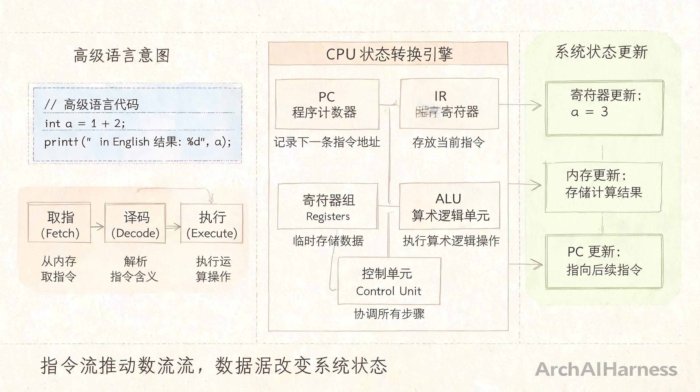

# CPU 不是“执行代码”的机器，而是“搬运、解释、调度状态”的机器

很多人学习计算机组成原理时，会把 CPU 理解成一个“执行代码”的黑盒。这个说法没有错，但太粗糙。CPU 并不直接理解高级语言，它面对的是指令、寄存器、内存地址和二进制状态。

高级语言代码只是人类表达意图的方式。真正进入 CPU 的，是编译器、解释器或虚拟机转化后的机器指令和运行时动作。每条指令都会读取某些状态、执行某种操作、再写回新的状态。

更准确地说，CPU 是一台按照指令流不断推动状态变化的机器。



## 一、一行代码背后的状态迁移

例如：

```c
int c = a + b;
```

这行代码在高级语言里看起来像一个表达式，但进入机器层面后，通常会被拆成一组更底层的动作。它不一定直接对应一条指令，可能涉及加载、计算和写回：

1. 从内存或寄存器中取出 `a`。
2. 从内存或寄存器中取出 `b`。
3. 把两个值送入算术逻辑单元。
4. 执行加法。
5. 把结果写回寄存器或内存。

CPU 真正处理的不是“变量”和“表达式”，而是指令、地址、寄存器和数据状态。变量名在机器层面通常已经消失，留下的是寄存器编号、内存地址、立即数和操作码。


```text
指令流推动数据流，数据流改变系统状态。
```

把程序理解成状态迁移，会更容易理解为什么同一段代码在不同编译器优化、不同 CPU 架构、不同缓存状态下可能表现出不同性能。

## 二、CPU 的核心动作

经典 CPU 工作过程可以抽象为取指、译码、执行，但真实流水中还会包含访存、写回和更新 PC 等阶段。


1. **取指**：根据程序计数器 PC，从内存或指令缓存中取出下一条指令。
2. **译码**：解释这条指令要做什么，需要哪些操作数，以及结果应该写到哪里。
3. **读取操作数**：从寄存器、立即数或内存地址中准备输入数据。
4. **执行**：由 ALU、控制单元、寄存器等部件协同完成计算、跳转或控制动作。
5. **访存**：如果是 Load/Store 指令，需要访问缓存或内存。
6. **写回**：把结果写回寄存器或内存。
7. **更新 PC**：决定下一条指令地址，是顺序执行、跳转还是分支。

程序计数器决定下一步执行哪里，指令寄存器保存当前指令，寄存器组保存高速临时状态，ALU 负责计算，控制单元负责调度内部部件。



这套机制的关键不是“聪明”，而是“机械、确定、可重复”。同样的初始状态和指令序列，在没有外部中断、并发竞争和未定义行为干扰的情况下，应当产生同样的结果。

## 三、为什么需要寄存器、缓存和流水线

如果 CPU 每次都直接访问内存，速度会被内存拖垮。现代 CPU 的计算速度远快于主存访问速度，真正限制程序性能的，往往不是算术运算本身，而是数据能不能及时送到 CPU 面前。

为了解决速度差异，计算机系统引入了多级存储结构：

```text
寄存器 → L1/L2/L3 Cache → 内存 → 磁盘
```



越靠近 CPU，速度越快，容量越小，成本越高。越远离 CPU，容量越大，速度越慢，访问代价越高。

缓存的意义是减少慢速访问。它利用两个重要事实：

1. **时间局部性**：刚访问过的数据，可能很快还会再访问。
2. **空间局部性**：访问某个地址后，附近地址也可能很快被访问。

这就是为什么数组顺序遍历通常比链表遍历更快。数组元素在内存中连续，CPU 可以提前加载附近数据；链表节点分散在内存中，每次跳转都可能造成缓存未命中。

流水线的意义是让多条指令的不同阶段并行推进。它不是让单条指令的逻辑更简单，而是提高单位时间内完成的指令数量。理想情况下，取指、译码、执行、访存、写回可以像工厂流水线一样同时处理不同指令。

但流水线也会被打断。比如分支预测失败时，CPU 之前预取和执行的路径可能是错的，需要清空部分流水线重新开始，这会造成性能损失。

## 四、工程视角

很多性能问题并不是“计算太复杂”，而是“数据搬运太昂贵”。例如：

- 频繁访问内存导致缓存未命中。
- 大对象复制增加内存带宽压力。
- 分支预测失败导致流水线清空。
- 随机访问破坏缓存局部性。
- 多线程锁竞争导致 CPU 核心空转等待。
- 伪共享让多个核心反复争抢同一缓存行。



这也是为什么数组顺序遍历通常比链表遍历更快：不是因为数组更高级，而是因为它更符合缓存局部性。

同样，减少不必要的大对象复制、避免频繁随机访问、降低锁竞争、让热点数据更紧凑，很多时候比单纯更换一条“更快”的语句更有效。

从工程角度看，CPU 并不是孤立地“算”。它一直在等待数据、搬运数据、预测分支、协调缓存、处理乱序执行和同步边界。性能优化也不是只看算法复杂度，还要看数据如何流动。

## 五、常见误区

### 误区一：CPU 直接执行高级语言

高级语言需要经过编译、解释或虚拟机转换，最终仍要落到机器指令或底层运行时动作上。CPU 不认识变量名、类名和函数名，它处理的是操作码、寄存器、地址和二进制数据。

### 误区二：算力只取决于主频

主频只是一个维度。缓存层级、指令集、流水线、分支预测、并行度、内存带宽、功耗墙都会影响实际性能。同样主频下，不同架构的实际表现可能差别很大。

### 误区三：内存访问是免费的

现代计算机中，内存访问成本远高于寄存器访问。很多性能优化，本质上是在减少不必要的数据搬运，提高缓存命中率，降低等待内存的时间。

### 误区四：多核一定带来线性提升

多核能提高并行能力，但并不保证性能线性增长。任务拆分、同步开销、锁竞争、缓存一致性和内存带宽都会限制扩展性。并发程序慢，有时不是核心不够，而是共享状态太多。

## 六、实践建议

1. 学计组时，不要只背硬件部件名称，要追踪“一条指令如何改变状态”。
2. 理解高级语言代码时，尝试思考它大致会变成加载、计算、写回和跳转。
3. 写性能敏感代码时，关注数据访问模式，而不只是算法复杂度。
4. 优先理解缓存局部性：顺序访问、紧凑数据结构、减少随机跳转通常更友好。
5. 避免不必要的大对象复制，减少内存带宽压力。
6. 理解分支预测和流水线，避免在热点路径制造大量不可预测分支。
7. 多线程优化时，不只看线程数量，还要看锁竞争、共享状态和缓存一致性。
8. 把 CPU 看成状态机，会更容易理解编译器、操作系统和并发问题。

## 结语

CPU 的本质不是神秘地“执行代码”，而是按照指令流持续推进状态变化。高级语言表达意图，编译器和运行时把意图转换成指令，CPU 再通过取指、译码、执行、访存和写回，不断改变寄存器、内存和程序计数器的状态。

理解这一点，计算机组成原理就不再是一堆硬件名词，而是一套关于程序如何落到物理机器上的解释体系。真正掌握 CPU，不是记住 ALU、寄存器和缓存这些名词，而是能看见数据如何流动、状态如何变化、性能瓶颈如何产生。
