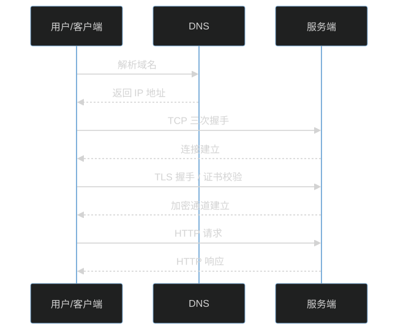

# 网络不是把数据发出去，而是在不可靠世界里构造可靠协作

很多人学习计算机网络时，会从 OSI 七层模型开始背。分层模型重要，但如果只背层次，很容易忽略网络的核心问题：网络面对的是一个天然不可靠的世界。

消息可能丢，包可能乱序，链路可能拥塞，节点可能宕机，DNS 可能解析失败，证书可能过期，服务可能超时。应用希望像调用本地函数一样调用远端服务，但网络实际提供的是有延迟、会抖动、可能失败的通信环境。

所以，网络的本质不是“把数据发出去”，而是在不可靠环境中构造尽可能可靠、可理解、可恢复的协作机制。



## 一、IP：尽力而为，不保证可靠

IP 协议负责把数据包从一个主机送往另一个主机。它提供寻址和路由能力，让一个数据包可以从源地址出发，经过多个网络设备，最终尽量到达目标地址。

但 IP 的承诺非常有限。它是无连接、尽力而为的网络层协议，不承诺数据一定到达，也不保证顺序、不保证不重复、不保证延迟稳定。

换句话说，IP 更像是在说：我会尽力把这个包往目标方向转发，但如果中间链路拥塞、路由变化、设备故障或 TTL 过期，包可能就丢了。

这种设计不是缺陷，而是取舍。网络核心保持简单，路由器只负责高效转发，不在每一跳上维护复杂的端到端状态。真正复杂的可靠性问题，被交给端系统和更高层协议处理。

这也是互联网能够大规模扩展的重要原因：网络核心尽量简单，端系统承担更多智能。

## 二、TCP：在不可靠 IP 之上构造可靠字节流

TCP 的价值在于，它在不可靠的 IP 网络之上，为应用提供可靠、有序、面向连接的字节流。应用写入的是一段连续数据，TCP 负责把它拆成报文段、编号、发送、确认、重传、排序，再交给接收方应用。


为了做到这一点，TCP 引入了：

1. 三次握手：在通信前建立连接，确认双方收发能力和初始序列号。
2. 序列号：标记每段数据在字节流中的位置，解决乱序问题。
3. 确认应答：接收方告诉发送方哪些数据已经收到。
4. 重传机制：数据丢失或确认超时后重新发送。
5. 滑动窗口：控制未确认数据量，提高吞吐，同时避免接收方被压垮。
6. 流量控制：根据接收方处理能力调节发送速度。
7. 拥塞控制：根据网络拥塞程度调节发送速度，避免网络整体崩溃。

应用看到的是稳定连接，底层做的是纠错、排序、重试和节奏控制。

但要注意：TCP 的可靠性只发生在“连接内字节流”这一层。它能尽力保证字节按顺序到达对端进程，但不能保证对端应用一定正确处理业务，也不能保证数据库提交成功，更不能保证一次 HTTP 请求在业务上一定成功。

所以，TCP 可靠不等于业务可靠。应用层仍然需要超时、重试、幂等、错误码和状态确认。

## 三、HTTP：把字节流变成应用语义

TCP 只负责可靠传输，并不理解业务语义。HTTP 定义了请求、响应、方法、状态码、Header 和 Body，让服务之间能够用统一格式表达意图和结果。

```text
GET /users/1
POST /orders
404 Not Found
500 Internal Server Error
```

HTTP 方法表达“想做什么”。例如 GET 通常表示读取资源，POST 通常表示提交或创建资源，PUT/PATCH 常用于更新资源，DELETE 表示删除资源。

状态码表达“结果如何”。2xx 通常表示成功，3xx 表示重定向，4xx 表示客户端请求有问题，5xx 表示服务端处理失败。Header 用来携带元信息，例如内容类型、认证信息、缓存策略、TraceId；Body 用来承载真正的数据内容。

HTTP 的价值是让服务之间能够用统一格式表达意图和结果。网络工程不是只有连通性，还包括语义清晰性。

但 HTTP 也不会自动解决所有业务问题。一次 POST 请求超时后，客户端并不知道服务端是否已经创建订单；一次 500 错误也可能发生在业务提交之前或之后。因此，应用层需要定义哪些请求可以重试、哪些请求必须带幂等键、哪些错误需要人工确认或补偿。

## 四、DNS 和 TLS：名字与信任

DNS 解决“名字到地址”的问题。用户访问的是域名，机器连接的是 IP 地址。域名背后可能经过本地缓存、递归解析、权威 DNS、CDN 调度和负载均衡策略，最终得到一个可连接的地址。

TLS 解决“信任、加密和完整性”的问题。它通过证书链确认对方身份，通过密钥协商建立加密通道，并保护通信内容不被轻易窃听或篡改。

一次 HTTPS 请求，背后通常包含：DNS 解析、TCP 握手、TLS 握手、HTTP 请求、服务端处理和响应返回。任何一个环节出问题，请求都可能失败。



常见问题包括：DNS 缓存污染或解析失败、域名解析过慢、TCP 建连超时、TLS 证书过期、证书链不完整、客户端和服务端 TLS 版本不兼容、服务端处理过慢等。

所以，当我们说“访问一个接口失败”时，失败点不一定在接口本身。它可能发生在名字解析、连接建立、身份校验、加密协商、网关转发、服务端处理或响应传输的任何一个阶段。

## 五、工程视角

真实系统中，请求失败很少只有一个原因。常见问题包括：

- DNS 解析慢或失败。
- TCP 建连超时。
- TLS 证书过期或握手失败。
- 服务端线程池耗尽。
- 网关限流。
- 负载均衡摘除不及时。
- 客户端没有设置超时。
- 重试策略放大故障。

因此，网络问题不能只看“通不通”，还要看解析、建连、加密、传输、应用处理和错误恢复。


排查一次慢请求时，最好把总耗时拆开看：DNS 耗时、TCP 建连耗时、TLS 握手耗时、首包时间、服务端处理时间、响应下载时间和客户端处理时间。

其中，首包时间尤其重要。它通常反映从请求发出到服务端开始返回响应之间的等待，包括网关转发、服务端排队、业务处理、数据库访问和下游调用。如果首包慢，问题往往不在下载带宽，而在服务端或中间链路。

工程上还要关注连接池、超时配置、重试策略和限流策略。连接池太小会排队，连接池太大可能压垮下游；超时太短会误杀正常请求，超时太长会拖死调用链；重试没有退避和幂等，会把局部故障放大成系统故障。

## 六、常见误区

### 误区一：网络分层只是考试知识

分层的意义不是为了背诵，而是为了分离职责和定位问题。IP 解决寻址和路由，TCP 解决可靠字节流，TLS 解决信任和加密，HTTP 解决应用语义。

当请求失败时，分层模型能帮助我们判断问题在哪一层：域名是否解析成功？连接是否建立？证书是否可信？请求是否到达服务端？服务端是否正确处理？响应是否完整返回？

### 误区二：TCP 可靠，所以应用不用处理失败

TCP 只能保证连接内字节流的可靠性，不能保证服务端一定成功处理业务。连接断开、请求超时、服务端 500、网关限流、数据库提交失败，都不是 TCP 能替应用解决的问题。

应用必须自己处理业务级失败，包括错误码识别、幂等控制、重试策略、状态查询和补偿流程。

### 误区三：重试总能提高成功率

重试确实可以提高偶发失败下的成功率，但没有退避、幂等和限流的重试，会把局部故障放大成系统故障。

如果下游已经因为高负载变慢，上游继续大量重试，会造成更多请求排队，让下游更慢，最终形成雪崩。正确的重试要有最大次数、指数退避、抖动、错误类型判断和幂等保障。

## 七、实践建议

1. 给所有网络调用设置超时，包括连接超时、读取超时和整体请求超时。
2. 对可重试写操作设计幂等键，避免重复创建、重复扣款或重复提交。
3. 区分 DNS 失败、连接失败、TLS 失败、读取超时、业务失败和限流失败。
4. 对关键链路记录 DNS、建连、TLS、首包、下载和总耗时。
5. 不要把网络当成本地函数调用，远程调用必须默认会慢、会失败、会重复。
6. 重试必须配合退避、最大次数、限流和熔断。
7. 维护连接池、线程池和下游并发上限，避免把资源耗尽。
8. 对证书过期、DNS 异常、错误率上升和超时率上升建立监控告警。
9. 对网关、负载均衡、服务端和客户端都保留 TraceId，方便串联链路。
10. 对核心接口明确错误语义，让调用方知道哪些错误可以重试，哪些错误必须停止。

## 结语

网络工程的难点不在“发送数据”，而在不可靠世界里构造可靠协作。IP 尽力转发，TCP 构造可靠字节流，TLS 建立信任和加密，HTTP 表达应用语义，而工程系统还要通过超时、重试、限流、熔断、幂等和可观测性来面对真实世界的不确定性。

理解这一点，才能真正理解协议、网关、重试、限流和可观测性。好的网络工程，不是假设链路永远可靠，而是在链路不可靠时仍然让系统可诊断、可恢复、可控制。
