# A2UI 技术全景：原理、设计与实现

> 基于 a2ui 官方源码 (v0.9.1 / v1.0-RC) 的深度梳理

---

## 目录

1. [项目概览](#1-项目概览)
2. [核心设计哲学](#2-核心设计哲学)
3. [协议版本体系](#3-协议版本体系)
4. [消息格式设计](#4-消息格式设计)
5. [组件系统](#5-组件系统)
6. [数据绑定机制](#6-数据绑定机制)
7. [函数目录与表达式引擎](#7-函数目录与表达式引擎)
8. [架构分层与核心类图](#8-架构分层与核心类图)
9. [web_core 内部实现](#9-web_core-内部实现)
10. [错误与事件系统](#10-错误与事件系统)
11. [主题与样式系统](#11-主题与样式系统)
12. [安全模型](#12-安全模型)
13. [客户端/服务端能力协商](#13-客户端服务端能力协商)
14. [渲染器实现对比](#14-渲染器实现对比)
15. [Agent SDK](#15-agent-sdk)
16. [端到端数据流](#16-端到端数据流)
17. [开发工具](#17-开发工具)
18. [示例应用](#18-示例应用)
19. [传输层](#19-传输层)
20. [MCP集成](#20-mcp集成)
21. [AG-UI / CopilotKit集成](#21-ag-ui--copilotkit集成)
22. [Monorepo结构与构建发布](#22-monorepo结构与构建发布)
23. [v0.9.1 → v1.0 演进](#23-v091--v10-演进)

---

## 1. 项目概览

**A2UI (Agent-to-User Interface)** 是一个开源的、跨平台的、流式优先的 UI 协议与库集合，让 AI Agent 能够"说 UI"。

- Agent 发送**声明式 JSON**描述 UI 的意图
- 客户端应用用自身**原生组件库**渲染
- 核心定位：**像数据一样安全，像代码一样表达力强**
- 许可证：Apache 2.0

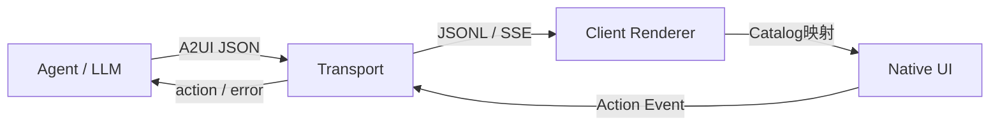

**协议状态**：v0.9.1 为当前生产版本，v1.0 为候选发布版本 (RC)。

**典型用例**：
- **动态数据收集**：Agent根据对话上下文生成定制表单（日期选择器、滑块、输入框）
- **远程子Agent**：编排Agent委托任务到远程专项Agent，后者返回UI payload在主聊天窗口渲染
- **自适应工作流**：企业Agent根据用户查询动态生成审批仪表板或数据可视化

---

## 2. 核心设计哲学

| 原则 | 说明 | 技术实现 |
|------|------|----------|
| **安全优先** | 声明式数据格式，不是可执行代码 | Agent 只能请求 Catalog 中预批准的组件，客户端掌握渲染权；FunctionCall 仅调用预注册函数，Zod验证参数 |
| **LLM友好** | 扁平组件列表+ID引用 | 不需要嵌套括号匹配，LLM可逐条增量输出 |
| **流式渲染** | 消息逐条到达即更新UI | JSONL格式，每行一个消息，客户端渐进式构建 |
| **框架无关** | 同一JSON多框架渲染 | web_core + GenericBinder 抽象层，Preact Signals可插拔 |
| **可扩展** | 自定义Catalog / Smart Wrapper | 开放注册模式，callableFrom边界控制(clientOnly/remoteOnly/clientOrRemote) |
| **渐进式降级** | 未知组件不会崩溃 | 渲染安全fallback（generic card + debug名称）或跳过，文本fallback兜底 |

---

## 3. 协议版本体系

| 版本 | 状态 | 核心特征 |
|------|------|----------|
| **v0.8** | Legacy | `beginRendering/surfaceUpdate/dataModelUpdate`，嵌套类型包装 `{Text: {text: {literalString}}}`，无FunctionCall |
| **v0.9** | Stable | `createSurface/updateComponents/updateDataModel`，扁平类型 `component: "Text"`，FunctionCall支持 |
| **v0.9.1** | **生产版本** | v0.9微调，surfaceId仅要求活跃唯一（非全局唯一），标准化 `application/a2ui+json` MIME类型 |
| **v1.0** | RC | 新增 `actionResponse/callFunction` 双向RPC，单消息UI创建，`surfaceProperties`替代`theme`，`@index()`系统函数 |

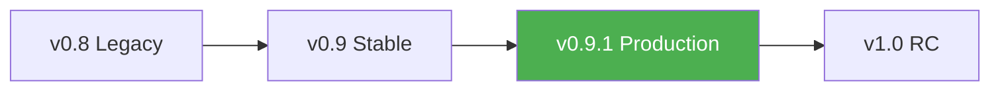

---

## 4. 消息格式设计

### 4.1 v0.9.1 服务端→客户端 (4种)

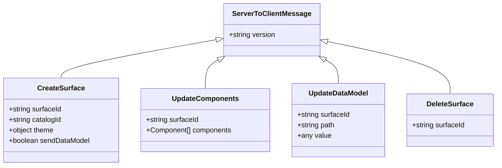

**Envelope约束**：每条消息必须包含**恰好一个**操作键 + `version`字段，否则抛出 `A2uiValidationError`。

**CreateSurface 示例**：
```json
{
  "version": "v0.9.1",
  "createSurface": {
    "surfaceId": "booking-form",
    "catalogId": "basic",
    "theme": { "primaryColor": "#00BFFF", "agentDisplayName": "Restaurant Bot" },
    "sendDataModel": true
  }
}
```

- `catalogId`：**必填**（v0.8可选默认basic catalog，v0.9必填）
- `theme`：任意JSON结构，由Catalog的themeSchema定义（basic catalog: primaryColor, iconUrl, agentDisplayName）
- `sendDataModel`：为true时客户端在每个action消息metadata中附带完整DataModel

**UpdateComponents 示例**（扁平列表 + ID引用）：
```json
{
  "version": "v0.9.1",
  "updateComponents": {
    "surfaceId": "booking-form",
    "components": [
      { "id": "root", "component": "column", "children": ["title", "form_row", "submit_btn"] },
      { "id": "title", "component": "text", "text": "Book a Table", "variant": "h2" },
      { "id": "form_row", "component": "row", "children": ["date_input", "guests_slider"] },
      { "id": "date_input", "component": "dateTimeInput", "label": "Date", "value": { "path": "/selectedDate" }, "enableDate": true },
      { "id": "submit_btn", "component": "button", "child": "btn_text", "action": { "event": { "name": "search" } }, "checks": [{ "condition": { "call": "required", "args": { "value": { "path": "/selectedDate" } } }, "message": "Please select a date" }] },
      { "id": "btn_text", "component": "text", "text": "Search" }
    ]
  }
}
```

**UpdateDataModel 示例**：
```json
{
  "version": "v0.9.1",
  "updateDataModel": {
    "surfaceId": "booking-form",
    "path": "/minDate",
    "value": "2025-01-01"
  }
}
```

- `path`：JSON Pointer（RFC 6901），默认`"/"`
- `value`：任意JSON类型；省略value → 删除键（v0.9.1）；设为null → 删除键（v1.0）
- Upsert语义：路径存在→更新，不存在→创建

### 4.2 v0.9.1 客户端→服务端 (2种)

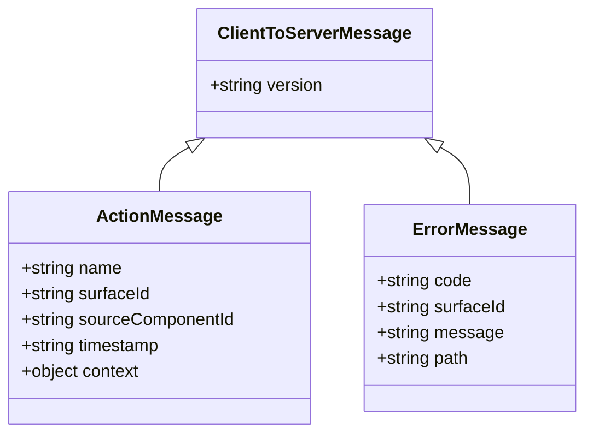

**Action 示例**：
```json
{
  "version": "v0.9.1",
  "action": {
    "name": "search",
    "surfaceId": "booking-form",
    "sourceComponentId": "submit_btn",
    "timestamp": "2025-06-15T10:30:00Z",
    "context": { "selectedDate": "2025-06-15", "guests": 4 }
  }
}
```

**Error 两种子类型**：
| code | 场景 | 字段 |
|------|------|------|
| `VALIDATION_FAILED` | Agent发送的JSON违反Catalog Schema | `surfaceId, path, message` |
| 其他任意code | 通用客户端错误 | `surfaceId, message` |

### 4.3 v1.0 新增消息类型

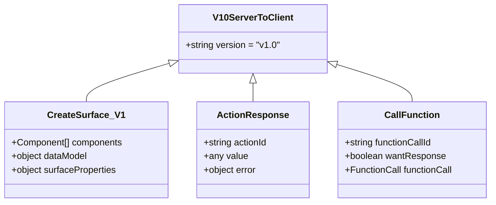

**v1.0客户端新增**：`functionResponse {functionCallId, call, value}`；`action`新增`wantResponse`和`actionId`字段；`error`新增`functionCallId`字段。

---

## 5. 组件系统

### 5.1 邻接表模型（核心架构决策）

UI树表示为**扁平组件列表 + ID引用**，而非嵌套JSON树。

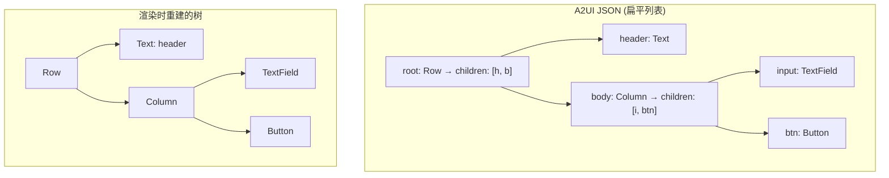

**为什么用扁平列表而非嵌套树？**

| 嵌套树的困难 | 扁平列表的优势 |
|---------------|----------------|
| LLM需要精确的括号匹配 | 逐条输出，无需括号平衡 |
| 嵌套深时单点更新成本高 | 更新时只替换单个组件 |
| 整棵树必须一次性完整 | 组件可任意顺序到达，缓冲到root出现即可渲染 |
| 重新渲染需要重建整棵树 | 属性替换触发局部更新 |

**增量更新操作**：
- **添加**：发送新ID的新组件定义
- **更新**：发送相同ID + 新properties（类型相同→更新，类型不同→删除+重建）
- **删除**：更新父组件的children列表排除该ID（组件本身不从map中移除，仅不再被引用）

### 5.2 Basic Catalog — 18种组件

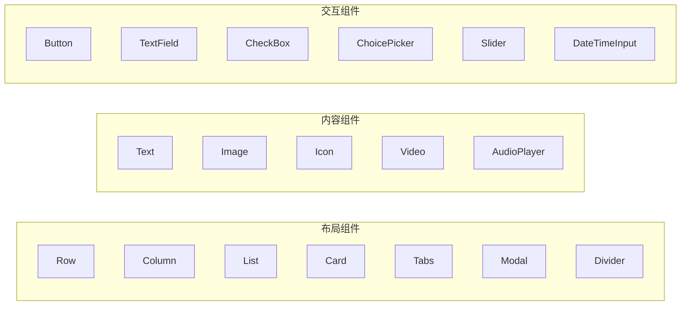

| 组件 | 类型 | 关键属性 | 说明 |
|------|------|----------|------|
| `Text` | 内容 | `text: DynamicString, variant(h1-h5/caption/body)` | 支持Markdown，v1.0缩减为caption+body |
| `Image` | 内容 | `url: DynamicString, fit(contain/cover/fill/none/scaleDown), variant(icon/avatar/smallFeature/mediumFeature/largeFeature/header)` | |
| `Icon` | 内容 | `name(~60枚举或{svgPath:"..."}), DynamicString` | v1.0 svgPath→path |
| `Video` | 内容 | `url: DynamicString` | v1.0新增posterUrl |
| `AudioPlayer` | 内容 | `url, description` | |
| `Row` | 布局 | `children: ChildList, justify(center/end/spaceAround/spaceBetween/spaceEvenly/start/stretch), align(start/center/end/stretch)` | 水平flexbox |
| `Column` | 布局 | `children: ChildList, justify, align` | 垂直flexbox |
| `List` | 布局 | `children, direction(vertical/horizontal), align` | 可滚动列表 |
| `Card` | 布局 | `child: ComponentId` | 单子容器 |
| `Tabs` | 布局 | `tabs: [{title: DynamicString, child: ComponentId}]` | 标签页 |
| `Modal` | 布局 | `trigger, content` | 对话框覆盖 |
| `Divider` | 布局 | `axis(horizontal/vertical)` | 分割线 |
| `Button` | 交互 | `child, variant(default/primary/borderless), action(Action), checks` | v1.0 disabled当checks失败 |
| `TextField` | 交互 | `label, value: DynamicString, variant(shortText/longText/number/obscured), validationRegexp, checks` | v1.0新增placeholder |
| `CheckBox` | 交互 | `label, value: DynamicBoolean, checks` | |
| `ChoicePicker` | 交互 | `variant(multipleSelection/mutuallyExclusive), options[{label,value}], value: DynamicStringList, displayStyle(checkbox/chips), filterable, checks` | v0.8叫MultipleChoice |
| `Slider` | 交互 | `min, max, value: DynamicNumber, checks` | v1.0新增steps |
| `DateTimeInput` | 交互 | `value: DynamicString, enableDate, enableTime, min, max, label, checks` | ISO 8601格式 |

所有组件共享属性：
- `weight: number` — flex弹性权重（类似CSS flex-grow），渲染器设为 `flex: weight`
- `accessibility: {label: DynamicString, description: DynamicString}` — 无障碍标签

### 5.3 ChildList — 静态子项 vs 动态模板

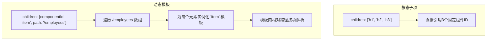

模板渲染中的路径解析示例：
```
/employees = [{name: "Alice", role: "Engineer"}, {name: "Bob", role: "Manager"}]

模板组件 item:
  text: {path: "name"}   → 第0项解析为 /employees/0/name = "Alice"
                         → 第1项解析为 /employees/1/name = "Bob"
  text: {path: "role"}   → 第0项解析为 /employees/0/role = "Engineer"
                         → 第1项解析为 /employees/1/role = "Manager"
```

在web_core内部，模板通过GenericBinder的STRUCTURAL分支处理：
- 订阅path对应的DataModel Signal
- 每次数组更新：创建 `DataContext.nested(path)`，为每个元素生成 `{id: componentId, basePath: nestedContext.nested(String(i)).path}`

---

## 6. 数据绑定机制

### 6.1 Dynamic类型系统

```mermaid
graph TD
    DYNAMIC["DynamicValue"] --> LIT["Literal<br/>string / number / boolean / array"]
    DYNAMIC --> BIND["DataBinding<br/>{path: '/user/name'}"]
    DYNAMIC --> FUNC["FunctionCall<br/>{call: 'formatCurrency', args: {...}}"]

    DS["DynamicString"] --> STR["string"]
    DS --> BIND2["DataBinding"]
    DS --> FUNC2["FunctionCall (returnType: string)"]

    DN["DynamicNumber"] --> NUM["number"]
    DN --> BIND3["DataBinding"]
    DN --> FUNC3["FunctionCall (returnType: number)"]

    DB["DynamicBoolean"] --> BOOL["boolean"]
    DB --> BIND4["DataBinding"]
    DB --> FUNC4["FunctionCall (returnType: boolean)"]

    DSL["DynamicStringList"] --> SLA["string[]"]
    DSL --> BIND5["DataBinding"]
    DSL --> FUNC5["FunctionCall (returnType: array)"]
```

v0.8对比：使用包装类型 `{literalString: "..."}`, `{literalBoolean: true}`, `{path: "..."}`（无FunctionCall）

### 6.2 JSON Pointer路径系统

| 路径类型 | 格式 | 示例 | 解析结果 |
|----------|------|------|----------|
| 绝对路径 | 以 `/` 开头 | `/user/name` | 从DataModel根开始 |
| 相对路径 | 无 `/` 前缀 | `name` | 在当前模板Scope内解析 → `/employees/0/name` |
| 根路径 | `/` 或空 | `/` | 整个DataModel |
| 自引用 | `.` | `.` | 等于当前dataContextPath |

**DataModel内部路径规范化**：
- 去除尾部 `/`（长度>1时）
- 解析segments：`/user/name` → `['user', 'name']`
- 数字段 → 数组索引

### 6.3 双向绑定流程

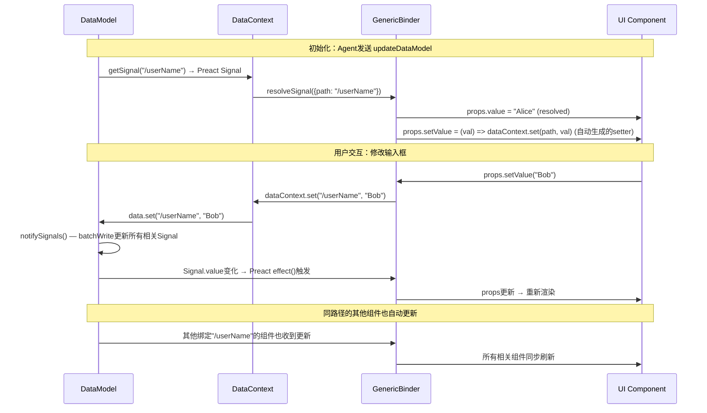

**关键规则**：
- 用户输入**立即**更新本地DataModel（响应式，同步保证无竞态）
- 更新**不自动**发送到服务端
- 仅在触发**Action**（如Button点击）时，DataModel随action消息发送
- `sendDataModel: true` 时，客户端在action metadata中附带完整DataModel

**双向绑定的Setter自动生成**：GenericBinder在解析OBJECT类型的属性时，遍历schema中所有DYNAMIC属性，若原始prop值是 `{path: "..."}` DataBinding，则自动生成 `setValue(val)` 方法，内部调用 `dataContext.set(path, val)`。

### 6.4 DataModel 内部实现

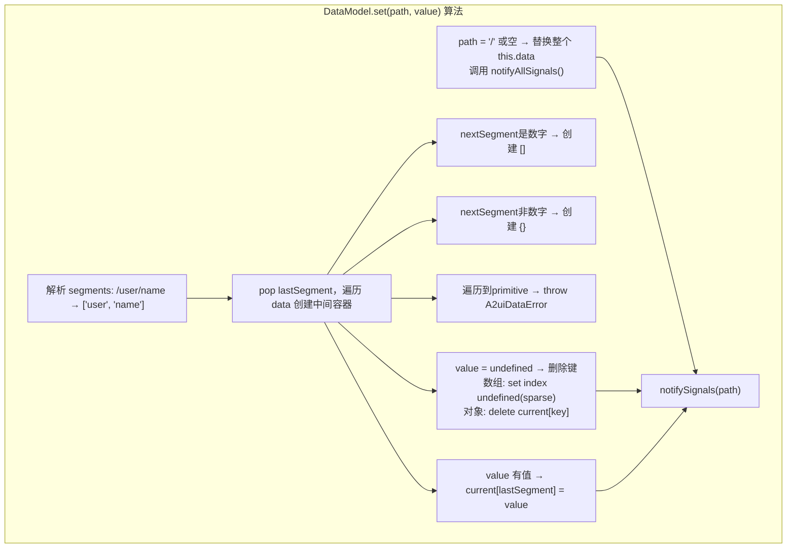

**Signal通知算法** (`notifySignals`，在 `batchWrite()` 中执行)：
1. 更新精确路径的 Signal
2. 向上遍历所有祖先路径的 Signal（`/user/name` → `/user`, `/`）
3. 向下遍历所有已注册后裔路径的 Signal
4. 每个 Signal 的值更新采用引用替换策略：
   - 数组 → `[...val]`（新数组引用）
   - 对象 → `{...val}`（新对象引用）
   - 原始值 → 直接设置
5. 新引用确保 Preact signal 的 `effect()` 能通过引用相等检测到变化

**DataModel.subscribe(path, onChange)**：
1. 获取 `getSignal(path)` 对应的Preact Signal
2. 创建 `effect()`：
   - **首次调用(sync)**：捕获currentValue但**不调用onChange**（`isSync`标志）
   - **后续调用**：调用 `onChange(val)`
3. 返回 `DataSubscription` 对象含 `value` getter 和 `unsubscribe()` 方法

---

## 7. 函数目录与表达式引擎

### 7.1 web_core函数目录 (25种实现)

协议Catalog定义14种基础函数，但web_core额外实现了算术/比较/字符串函数，总计**25种**：

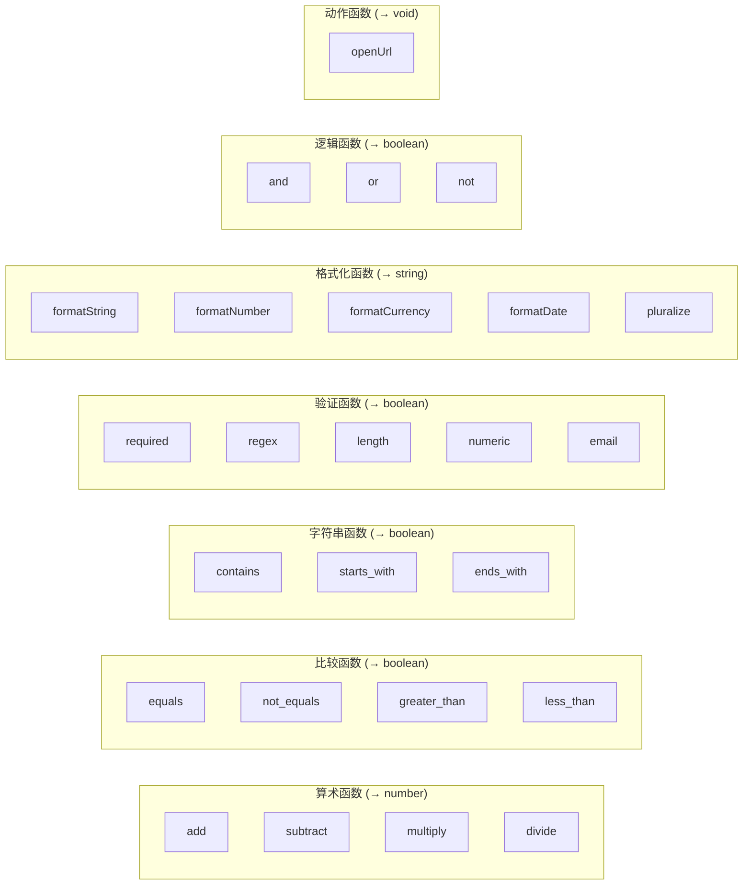

| # | 函数 | 返回类型 | 参数 | 实现细节 |
|---|------|----------|------|----------|
| 1 | `add` | number | `{a: coerce.number, b: coerce.number}` | `a + b` |
| 2 | `subtract` | number | `{a, b}` | `a - b` |
| 3 | `multiply` | number | `{a, b}` | `a * b` |
| 4 | `divide` | number | `{a, b}` | 无效→NaN，除零→Infinity |
| 5 | `equals` | boolean | `{a: any, b: any}` | 严格相等 `===` |
| 6 | `not_equals` | boolean | `{a, b}` | `!==` |
| 7 | `greater_than` | boolean | `{a: coerce.number, b: coerce.number}` | `>` |
| 8 | `less_than` | boolean | `{a, b}` | `<` |
| 9 | `contains` | boolean | `{string, substring}` | `string.includes(substring)` |
| 10 | `starts_with` | boolean | `{string, prefix}` | `string.startsWith(prefix)` |
| 11 | `ends_with` | boolean | `{string, suffix}` | `string.endsWith(suffix)` |
| 12 | `and` | boolean | `{values: array(minItems:2)}` | `values.every(v => !!v)` |
| 13 | `or` | boolean | `{values: array(minItems:2)}` | `values.some(v => !!v)` |
| 14 | `not` | boolean | `{value: any}` | `!value` |
| 15 | `required` | boolean | `{value: any}` | null/undefined/空字符串/空数组 → false |
| 16 | `regex` | boolean | `{value: string, pattern: string}` | `new RegExp(pattern).test(value)`；无效pattern抛A2uiExpressionError |
| 17 | `length` | boolean | `{value: any, min?: number, max?: number}` | 需提供min或max之一 |
| 18 | `numeric` | boolean | `{value: coerce.number, min?, max?}` | NaN检查 + 范围检查 |
| 19 | `email` | boolean | `{value: string}` | 基础正则验证 |
| 20 | `formatString` | any | `{value: coerce.string}` | 解析`${expression}`模板，返回**computed Signal**，使用ExpressionParser |
| 21 | `formatNumber` | string | `{value: coerce.number, decimals?, grouping: boolean.default(true)}` | `Intl.NumberFormat`缓存；locale-aware工厂 `createFormatNumberImplementation(locale?)` |
| 22 | `formatCurrency` | string | `{value, currency: string, decimals?, grouping}` | ISO 4217，`Intl.NumberFormat` style currency |
| 23 | `formatDate` | string | `{value: any, format: coerce.string}` | `date-fns`格式化；`'ISO'`→toISOString() |
| 24 | `pluralize` | string | `{value: coerce.number, zero/one/two/few/many/other?: string}` | `Intl.PluralRules`；locale-aware工厂 |
| 25 | `openUrl` | void | `{url: string}` | `window.open(url, '_blank', 'noopener,noreferrer')`；仅允许http/https协议 |

**Catalog.invoker — 函数调用安全机制**：
1. 查找函数名 → 找不到抛 `A2uiExpressionError`
2. **Zod验证参数**：`fn.schema.parse(rawArgs)` — 剔除无效/多余参数
3. ZodError → 包装为 `A2uiExpressionError` 含验证详情
4. 调用 `fn.execute(safeArgs, ctx, abortSignal)` 仅传入**已验证**的参数

### 7.2 Checks验证规则

```json
{
  "checks": [
    {
      "condition": { "call": "required", "args": { "value": { "path": "/email" } } },
      "message": "Email is required"
    },
    {
      "condition": { "call": "email", "args": { "value": { "path": "/email" } } },
      "message": "Invalid email format"
    }
  ]
}
```

渲染时 GenericBinder CHECKABLE分支自动计算：
- `isValid: boolean` — 所有condition为true
- `validationErrors: string[]` — 失败规则的message列表
- 注入到父路径的props中（不含`checks`键的层级）
- **Button**：`isValid === false` 时按钮自动disabled

### 7.3 ExpressionParser — 字符串插值引擎

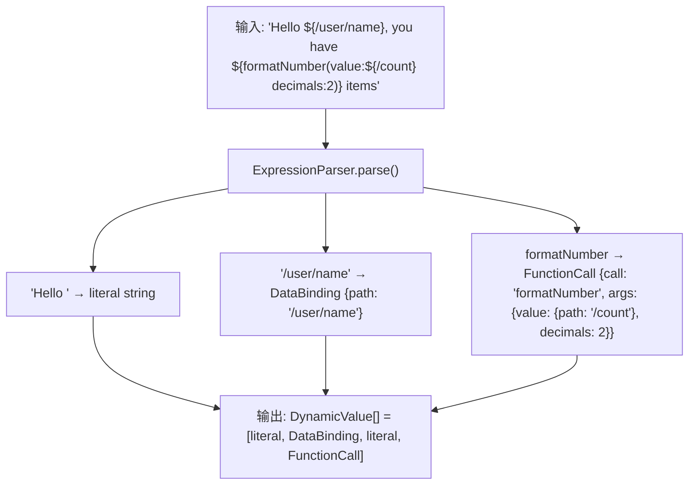

**ExpressionParser 语法**：
- `${path}` → DataBinding
- `${functionName(arg: value)}` → FunctionCall
- `${...}` 内可嵌套 `${...}`（递归，最大深度MAX_DEPTH=10）
- `\${` → 转义为字面 `${`
- 支持 `'string'`, `"string"` (含`\n\t\r\\`转义), `true`, `false`, `null`(→空字符串`''`), 数字字面量
- 标识符/路径：接受 `a-z, A-Z, 0-9, /, ., _, -`
- 函数调用语法：`funcName(arg1: expr1, arg2: expr2, ...)`

**Scanner与花括号平衡提取**：
- 遇到 `${` 时开始提取，跟踪 `braceBalance`
- `{` 递增，`}` 递减，到0停止
- 引号内字符跳过（处理转义`\\`）
- 未闭合花括号 → 抛 `A2uiExpressionError`

### 7.4 Action类型

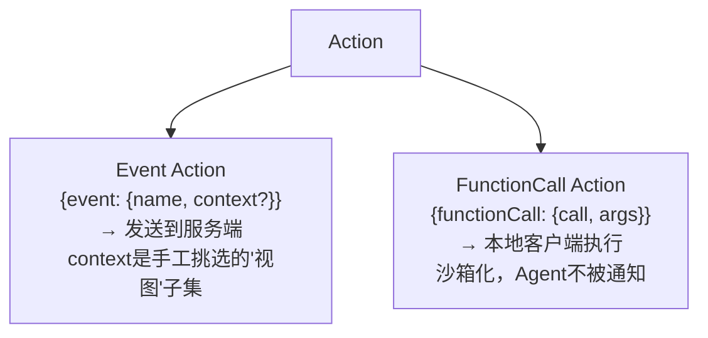

- **Event Action**：用户点击 → 构造action消息 → 通过Transport发送到Agent
- **FunctionCall Action**：用户点击 → 本地执行Catalog注册的函数（如 `openUrl`），不经过网络

**context vs DataModel**：context是Agent手工挑选的数据"视图"子集，简化Agent处理逻辑；DataModel是完整状态树。

---

## 8. 架构分层与核心类图

### 8.1 分层架构

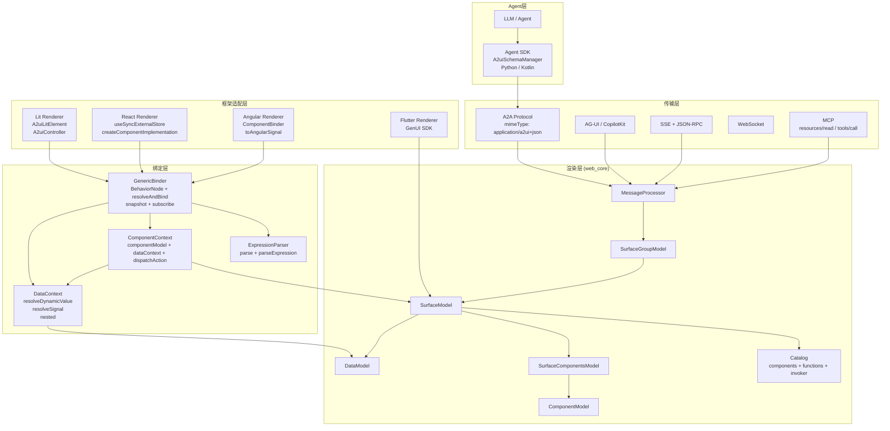

### 8.2 核心类关系图 (v0.9)

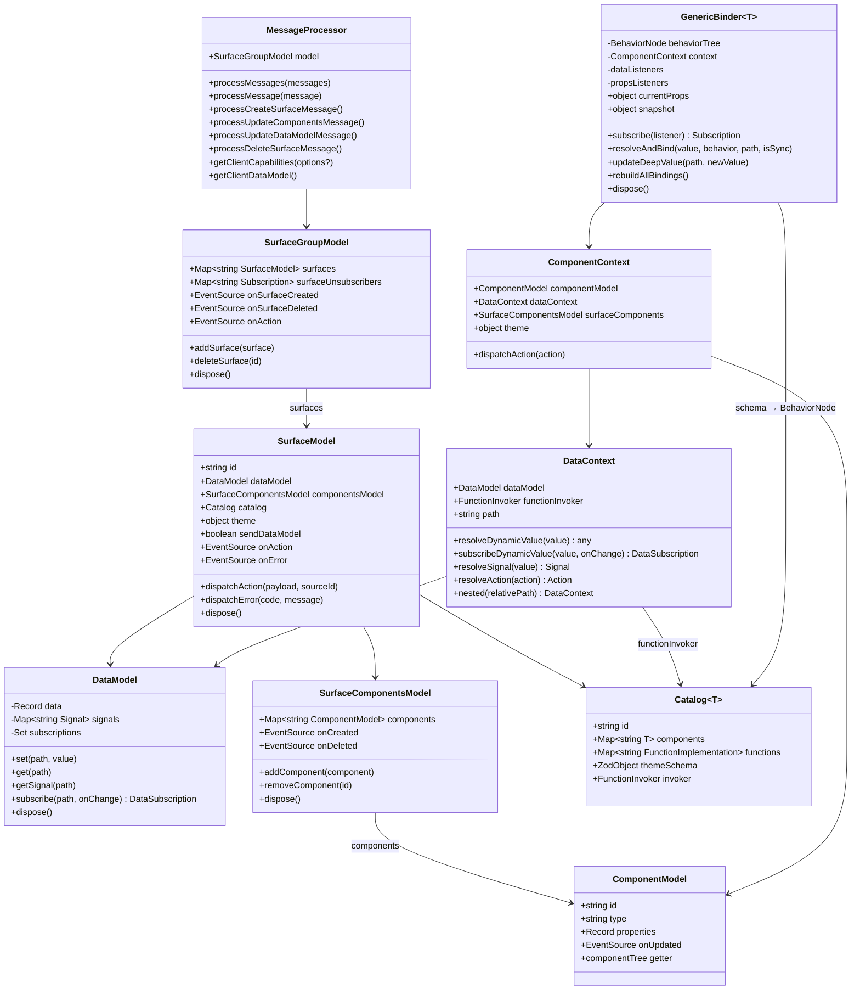

---

## 9. web_core 内部实现

### 9.1 MessageProcessor 处理流程

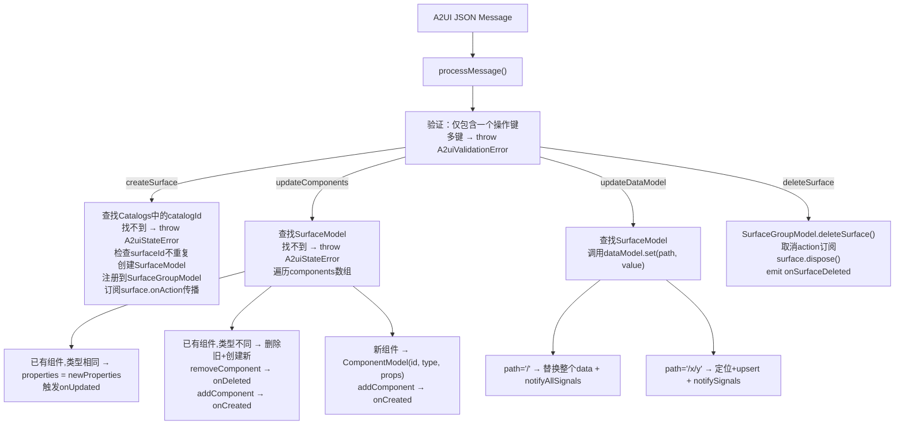

**SurfaceModel.dispatchAction 算法**：
1. 验证payload是含`event`属性的对象
2. 构造action候选：`{name, surfaceId, sourceComponentId, timestamp, context}`
3. Zod `A2uiClientActionSchema.safeParse()` 验证
4. 成功 → `_onAction.emit(validationResult.data)`（async，await所有监听器）
5. 失败 → console.error日志

**注意**：本地 `functionCall` action不经过dispatchAction — 由渲染器/binder直接处理。

### 9.2 GenericBinder — Schema驱动的响应式解析器

**核心创新**：不硬编码任何组件逻辑，通过扫描Zod Schema结构自动决定每个属性的解析行为。

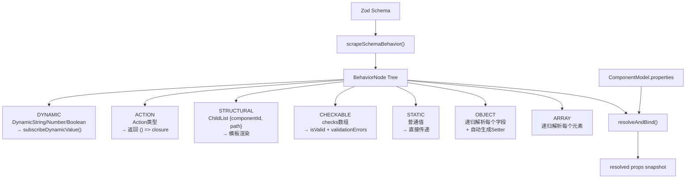

**BehaviorNode判定逻辑**：
```
1. 解包 ZodOptional/Nullable/Default → innerType
2. propertyName === 'checks' → CHECKABLE
3. ZodUnion 中有 ZodObject{event} → ACTION
4. ZodUnion 中有 ZodObject{path} 且无 componentId → DYNAMIC
5. ZodUnion 中有 ZodObject{componentId, path} → STRUCTURAL
6. ZodArray → ARRAY(递归element)
7. ZodObject → OBJECT(递归shape)
8. 其他 → STATIC
```

**OBJECT解析的额外功能 — 自动生成Setter**：
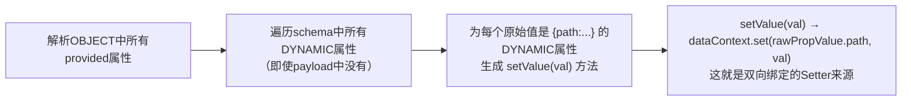

**ACTION解析 — 惰性求值**：
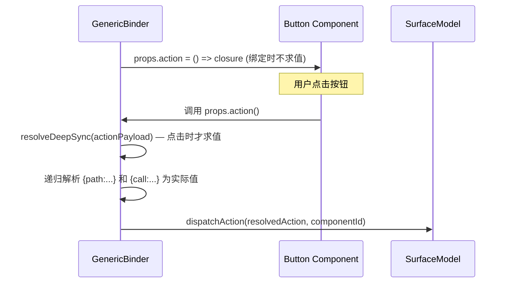

**CHECKABLE解析 — 验证规则响应式求值**：
```mermaid
graph TD
    CHECKS["checks数组"] --> RULES["ruleResults[]"]
    RULES --> R1["rule[0]: condition(DynamicBoolean)<br/>→ subscribeDynamicValue<br/>→ ruleResults[0].valid"]
    RULES --> R2["rule[1]: condition(DynamicBoolean)<br/>→ subscribeDynamicValue<br/>→ ruleResults[1].valid"]
    R1 --> ISVALID["isValid = all valid"]
    R2 --> ERRORS["validationErrors = failed messages"]
    ISVALID --> INJECT["注入到父路径(props不含checks的层级)<br/>props.isValid + props.validationErrors"]
    ERRORS --> INJECT
```

**GenericBinder生命周期**：
1. Constructor：scrapeSchema → behaviorTree，resolveInitialProps(isSync=true)
2. `connect()`（lazy）：订阅componentModel.onUpdated
3. `subscribe(listener)`：首个listener触发connect()
4. onUpdated触发 → `rebuildAllBindings()`：取消所有dataListeners，重新resolveAndBind
5. `dispose()`：取消所有订阅

**updateDeepValue — 不可变路径更新**：
使用 `cloneAndUpdate(obj, path, newValue)`：路径为空→返回newValue；数组→克隆+递归索引；对象→spread克隆+递归键。创建新对象树，确保引用变化检测。

### 9.3 Signal/Reactivity系统

```mermaid
graph TB
    subgraph "可插拔Signal抽象层"
        IMPL["SignalImplementations接口<br/>signal / computed / effect / batchWrite / isSignal / getValue / setValue / peekValue"]
        PREACT["PREACT_SIGNAL_IMPLEMENTATION<br/>@preact/signals-core"]
        ANGULAR["Angular Signals<br/>@angular/core (测试验证)"]
    end

    IMPL --> PREACT
    IMPL -.->|setSignalImplementation()可替换| ANGULAR

    subgraph "Preact Signal 操作"
        SIG["signal(initialValue)<br/>创建可写Signal"]
        COMP["computed(fn)<br/>创建计算Signal(只读)"]
        EFF["effect(fn)<br/>创建副作用，返回dispose函数"]
        BATCH["batchWrite(fn)<br/>批量写入，避免多次渲染"]
        PEEK["peekValue(sig)<br/>读取不订阅(用于初始化)"]
        GET["getValue(sig)<br/>读取并订阅(用于响应式)"]
    end
```

**Signal在A2UI中的三种使用模式**：

| 模式 | 用途 | 实现 |
|------|------|------|
| DataModel.getSignal(path) | 数据存储的响应式读取 | 每个路径一个Signal，set时通知 |
| DataContext.resolveSignal(value) | Dynamic*属性的响应式计算 | 字面量→静态Signal，DataBinding→getSignal，FunctionCall→computed+effect链 |
| GenericBinder.subscribe() | 组件属性的响应式订阅 | binder内部组合多个Signal → snapshot → 通知框架层 |

### 9.4 DataContext.resolveSignal() — Signal组合引擎

这是A2UI响应式系统的核心，处理FunctionCall的响应式计算：

```mermaid
flowchart TD
    VALUE["DynamicValue"] --> |Literal| LS["signal(value)<br/>静态Signal"]
    VALUE --> |DataBinding| DS["dataModel.getSignal(path)<br/>直接引用DataModel Signal"]
    VALUE --> |FunctionCall| FC["FunctionCall Signal组合"]

    FC --> STEP1["Step 1: 递归resolveSignal()每个arg<br/>→ argSignals: Record<string, Signal>"]
    STEP1 --> STEP2["Step 2: computed() → argsSig<br/>读取所有argSignal的值"]
    STEP2 --> STEP3["Step 3: signal(undefined) → resultSig<br/>输出Signal"]
    STEP3 --> STEP4["Step 4: effect() → stopper<br/>响应式重算引擎"]
    STEP4 --> STEP4A["读取argsSig值"]
    STEP4A --> STEP4B["AbortController取消前次计算<br/>unsubscribe前次内部effect"]
    STEP4B --> STEP4C["evaluateFunctionReactive(call, args, signal)"]
    STEP4C --> |返回Signal| STEP4D["内部effect() → pipe getValue(res) → setValue(resultSig)"]
    STEP4C --> |返回值| STEP4E["setValue(resultSig, res)"]
    STEP4D --> RESULT["resultSig.unsubscribe = composite cleanup<br/>停止outer+inner effect + abort + arg signal subscriptions"]
    STEP4E --> RESULT
```

**DataContext.resolveDynamicValue — 同步单次求值**：
- Literal → 直接返回
- DataBinding → resolvePath + dataModel.get(absolutePath)
- FunctionCall → 递归解析args + evaluateFunctionReactive + peekValue(若结果为Signal)

### 9.5 v0.8 A2uiMessageProcessor 内部实现

```mermaid
classDiagram
    class A2uiMessageProcessor {
        -Map surfaces
        -mapCtor / arrayCtor / setCtor / objCtor
        +processMessages(messages)
        +handleBeginRendering(message, surfaceId)
        +handleSurfaceUpdate(message, surfaceId)
        +handleDataModelUpdate(message, surfaceId)
        +rebuildComponentTree(surface)
        +buildNodeRecursive(baseComponentId, surface, visited, dataContextPath, idSuffix)
        +resolvePropertyValue(value, surface, visited, dataContextPath, idSuffix)
        +getData / setData
    }
```

**关键差异**：

| 方面 | v0.8 A2uiMessageProcessor | v0.9 MessageProcessor |
|------|---------------------------|----------------------|
| 架构 | 814行单一类，含所有逻辑 | 模块化：MessageProcessor + SurfaceModel + DataModel等 |
| 组件格式 | `{component: {Text: {text: {literalString}}}}`嵌套包装 | `{component: "Text", text: {path: "..."}}`扁平 |
| 数据格式 | `[{key, valueString/valueNumber/valueBoolean/valueMap}]`键值数组 | 直接JSON值 `{foo: "bar"}` |
| 渲染触发 | `beginRendering`显式信号 | root组件存在即渲染 |
| 模板扩展 | `{template: {dataBinding, componentId}}` + idSuffix(`:0:1`) | `{componentId, path}` + DataContext.nested() scoped paths |
| 循环检测 | visited Set（add→process→delete） | 无（扁平存储，树是隐式的） |
| 自定义容器 | 可插拔mapCtor/arrayCtor/setCtor/objCtor | 标准JS类型 |
| 函数调用 | 不支持 | FunctionCall完整支持 |

**buildNodeRecursive循环检测**：
- 使用 `Set<string>` 跟踪已访问的 `fullId = baseComponentId + idSuffix`
- 处理前添加，处理后删除（允许同一组件在不同分支出现）
- idSuffix构造：数组迭代 `:0:1`，Map迭代 `:someKey`

**resolvePropertyValue 5-case分发**：
1. String匹配组件ID → buildNodeRecursive
2. ComponentArrayReference (explicitList/template) → 构建子节点数组
3. Plain array → 递归解析每个item
4. Plain object → 递归解析每个property（特殊path键处理：strip `/item/` 前缀）
5. Primitive → 直接返回

**v0.8数据路径规范化**：
- Bracket + dot notation: `book[0].title` → `/book/0/title`
- 自动解析看起来像JSON的字符串值

---

## 10. 错误与事件系统

### 10.1 错误体系

```mermaid
classDiagram
    class A2uiError {
        +string code = UNKNOWN_ERROR
        +string name = constructor.name
        +captureStackTrace V8专用
    }
    class A2uiValidationError {
        +string code = VALIDATION_ERROR
        +any details
    }
    class A2uiDataError {
        +string code = DATA_ERROR
        +string path
    }
    class A2uiExpressionError {
        +string code = EXPRESSION_ERROR
        +string expression
        +any details
    }
    class A2uiStateError {
        +string code = STATE_ERROR
    }
    A2uiError <|-- A2uiValidationError
    A2uiError <|-- A2uiDataError
    A2uiError <|-- A2uiExpressionError
    A2uiError <|-- A2uiStateError
    Error <|-- A2uiError
```

| 错误类 | code | 触发场景 |
|--------|------|----------|
| `A2uiValidationError` | `VALIDATION_ERROR` | 消息含多个操作键、缺少必填字段 |
| `A2uiDataError` | `DATA_ERROR` | DataModel路径遍历到primitive、无效路径操作 |
| `A2uiExpressionError` | `EXPRESSION_ERROR` | ExpressionParser语法错误、FunctionCall找不到函数、Zod参数验证失败、regex无效pattern |
| `A2uiStateError` | `STATE_ERROR` | Surface不存在/重复、Catalog找不到、组件ID缺失/重复 |

**V8 Stack Trace处理**：
- 使用 `Error.captureStackTrace(this, this.constructor)` 确保stack从throw site开始而非constructor
- `this.name = this.constructor.name` 使子类在trace中有自己的名称

**DataContext错误分发**：
- ZodError → `A2uiExpressionError` 含验证message + issues
- A2uiExpressionError → 直接分发 `{code: 'EXPRESSION_ERROR', ...}`
- Generic Error → `{code: 'EXPRESSION_ERROR', message, expression, details: {stack}}`

### 10.2 事件系统

```mermaid
graph LR
    subgraph "设计模式：私有EventEmitter + 公开EventSource"
        EE["EventEmitter~T~<br/>private<br/>subscribe + emit + dispose"] --> ES["EventSource~T~<br/>public readonly<br/>仅subscribe"]
    end
```

**EventEmitter<T>实现**：
- `listeners: Set<EventListener<T>>` — O(1)添加/删除
- `subscribe(listener)` → 返回 `{unsubscribe: () => set.delete(listener)}`
- `emit(data)` — **async顺序交付**：`await listener(data)`逐个调用；每个listener独立try/catch，错误log到console但不中断交付
- `dispose()` — `listeners.clear()`清除所有

**EventSource<T>接口**（只读）：
- 仅暴露 `subscribe()` — 无emit、无dispose
- 模式：`private readonly _onCreated = new EventEmitter(); readonly onCreated: EventSource = this._onCreated;`

**Subscription接口**：
- `{unsubscribe(): void}` — 纯清理handle，无其他方法

---

## 11. 主题与样式系统

### 11.1 样式哲学

```mermaid
graph TD
    L1["1. Agent-provided<br/>语义提示(variant/usageHint)<br/>+ theme数据(primaryColor等)"] --> L2["2. Catalog Theming<br/>CSS变量默认值<br/>computeColorVariant"]
    L2 --> L3["3. Platform Theming<br/>开发者自定义覆盖<br/>CSS变量 / stylesheet"]
    L3 --> L4["4. Rendered Output"]
```

**核心原则**：**Agent描述what（组件和结构），Renderer决定how（颜色、字体、间距）**

### 11.2 CSS变量系统 (37个变量)

| 类别 | 变量 | 默认值 | 说明 |
|------|------|--------|------|
| **颜色** | `--a2ui-color-background` | `light-dark(#eee, #111)` | 背景色 |
| | `--a2ui-color-on-background` | `light-dark(#333, #eee)` | 背景上的文字 |
| | `--a2ui-color-surface` | `color-mix(in oklab, background 85%/95%, white)` | 卡片/容器背景 |
| | `--a2ui-color-on-surface` | `light-dark(#333, #eee)` | Surface上的文字 |
| | `--a2ui-color-primary` | `#17e` | 主色调 |
| | `--a2ui-color-primary-light` | `color-mix(in oklab, primary 85%, white)` | 主色浅色变体 |
| | `--a2ui-color-primary-dark` | `color-mix(in oklab, primary 85%, black)` | 主色深色变体 |
| | `--a2ui-color-primary-hover` | `light-dark(primary-dark, primary-light)` | 主色hover变体 |
| | `--a2ui-color-on-primary` | `#fff` | 主色上的文字 |
| | `--a2ui-color-secondary` | `light-dark(#ddd, #333)` | 辅助色 |
| | `--a2ui-color-secondary-light/dark/hover` | color-mix变体 | 辅助色变体 |
| | `--a2ui-color-on-secondary` | `light-dark(#333, #eee)` | 辅助色上的文字 |
| | `--a2ui-color-input` | `light-dark(#fff, #2a2a2a)` | 输入框背景 |
| | `--a2ui-color-on-input` | `light-dark(#333, #eee)` | 输入框文字 |
| **边框** | `--a2ui-border-radius` | `0.25rem` | 圆角 |
| | `--a2ui-color-border` | `light-dark(#ccc, #444)` | 边框色 |
| | `--a2ui-border-width` | `1px` | 边框宽 |
| | `--a2ui-border` | `1px solid var(--a2ui-color-border)` | 组合边框 |
| **间距** | `--a2ui-grid-base` | `0.5rem` | 基础网格 |
| | `--a2ui-spacing-xs/s/m/l/xl` | grid-base的分数/倍数 | 5级间距 |
| **字体** | `--a2ui-font-size` | `1rem` | 基础字号 |
| | `--a2ui-font-scale` | `1.2` | 字号缩放比 |
| | `--a2ui-font-size-xs/s/m/l/xl/2xl` | font-size的分数/倍数 | 6级字号 |
| | `--a2ui-font-family-title` | `inherit` | 标题字体 |
| | `--a2ui-font-family-monospace` | `monospace` | 等宽字体 |
| | `--a2ui-line-height-headings` | `1.2` | 标题行高 |
| | `--a2ui-line-height-body` | `1.5` | 正文行高 |

**computeColorVariant函数**：
- `light` 变体：`color-mix(in oklab, var(--colorVar) 85%, white)` 
- `dark` 变体：`color-mix(in oklab, var(--colorVar) 85%, black)`
- `hover` 变体：`light-dark(dark变体, light变体)` — light mode用dark变体，dark mode用light变体

**CSS关键技术**：
- `:where(:root)` 选择器 — **零特异性**，允许页面样式轻松覆盖
- `light-dark()` CSS函数 — 自动根据系统 `color-scheme` 偏好切换
- `color-mix(in oklab, ...)` — 计算颜色变体
- `adoptedStyleSheets` 注入 — 而非`<style>`标签，CSS变量穿透Shadow DOM

**暗色模式**：
- 默认跟随系统 `prefers-color-scheme`
- 强制模式：在祖先元素添加 `a2ui-light` 或 `a2ui-dark` 类名

**injectBasicCatalogStyles()**：
```typescript
// 创建CSSStyleSheet，replaceSync(DEFAULT_CSS)，缓存到模块级变量
// 检查document.adoptedStyleSheets避免重复注入
// 各渲染器(Lit/React/Angular)在basicCatalog构造时调用
```

---

## 12. 安全模型

### 12.1 两阶段验证（纵深防御）

```mermaid
sequenceDiagram
    participant Agent as Agent
    participant Transport as Transport
    participant Client as Client Renderer

    Note over Agent: 阶段1: Agent端预验证
    Agent->>Agent: 验证生成的JSON<br/>against Catalog Schema
    alt 验证失败
        Agent->>Agent: 修复/重新生成<br/>或fallback到文本
    else 验证成功
        Agent->>Transport: 发送A2UI JSON
    end

    Note over Client: 阶段2: Client端验证
    Transport->>Client: 接收A2UI JSON
    Client->>Client: 验证against本地Catalog定义
    alt 验证失败
        Client->>Agent: error VALIDATION_FAILED<br/>含path和message
        Agent->>Agent: 自纠正 + 重新发送
    else 验证成功
        Client->>Client: 正常渲染
    end
```

### 12.2 FunctionCall沙箱化执行

- Agent只能触发Catalog中**预注册**的函数
- Catalog.invoker对参数进行**Zod验证**，剔除无效/多余参数
- `openUrl`仅允许http/https协议，使用noopener+noreferrer防止反向tabnabbing

### 12.3 数据隔离与编排器路由

```mermaid
sequenceDiagram
    participant User as User
    participant Orch as Orchestrator
    participant Weather as Weather Agent
    participant Bank as Banking Agent

    User->>Orch: action {surfaceId: "weather-s1"}
    Orch->>Orch: 查找surfaceId → owner=Weather
    Orch->>Orch: strip a2uiClientDataModel<br/>仅保留Weather拥有的surface数据
    Orch->>Weather: 转发action + Weather的dataModel
    Note over Orch: 绝不泄露Bank的surface数据给Weather

    alt Orchestrator未strip
        Note over Weather,Bank: 安全风险：State Scraping<br/>恶意Weather Agent可读取<br/>Bank surface的银行数据
    end
```

**Surface Ownership模式**：
- 编排器维护 `surfaceId → owning_sub_agent` 映射（存储在Session State）
- `createSurface` → 记录所有权
- `action` → 查找surfaceId → 路由到正确子Agent
- 出站metadata拦截器：strip `a2uiClientDataModel.surfaces` 仅保留目标子Agent拥有的surface

**Smart Wrapper模式**：
- 开发者可将现有UI组件（包括安全iframe容器）注册为A2UI Catalog实现
- 在自定义组件逻辑中直接强制沙箱策略和"信任阶梯"
- 双重iframe隔离模式：Sandbox Proxy(same-origin) → Embedded App(sandboxed srcdoc,不含allow-same-origin)

### 12.4 渐进式降级

| 情况 | 处理 |
|------|------|
| Schema识别但renderer未实现的组件 | 渲染安全fallback（generic card + debug名称）或跳过 |
| 整个surface失败 | 文本fallback："This interface could not be displayed." |
| 新版本Agent发送旧版本Client不认识的组件 | Client忽略/placeholder；Agent收到VALIDATION_FAILED后自纠正 |
| Agent发送旧Client已删除的属性 | Client安全忽略 |

---

## 13. 客户端/服务端能力协商

### 13.1 Client Capabilities格式

```json
{
  "v0.9": {
    "supportedCatalogIds": ["basic", "https://example.com/my-catalog/v1/catalog.json"],
    "inlineCatalogs": [
      {
        "catalogId": "custom-v1",
        "components": { "MyWidget": { ... JSON Schema ... } },
        "functions": [
          { "name": "myFunction", "parameters": { ... JSON Schema ... }, "returnType": "string" }
        ],
        "theme": { "primaryColor": { "type": "string" } }
      }
    ]
  }
}
```

- `supportedCatalogIds`：**必填**，按偏好排序的Catalog URI数组
- `inlineCatalogs`：可选，仅在Server `acceptsInlineCatalogs: true` 时发送；包含完整Catalog定义

### 13.2 Server Capabilities格式

```json
{
  "v0.9": {
    "supportedCatalogIds": ["basic"],
    "acceptsInlineCatalogs": false
  }
}
```

- `supportedCatalogIds`：Agent能生成的Catalog（信息性）
- `acceptsInlineCatalogs`：默认false；为true时Agent接受Client内联Catalog

### 13.3 三步协商握手

```mermaid
sequenceDiagram
    participant Agent as Agent
    participant Client as Client

    Note over Agent,Client: Step 1 (Optional): Agent声明能力
    Agent->>Client: A2A AgentCard<br/>capabilities.extensions.params.supportedCatalogIds

    Note over Agent,Client: Step 2 (Required): Client声明能力
    Client->>Agent: 消息metadata<br/>a2uiClientCapabilities.v0.9.supportedCatalogIds<br/>（按偏好排序）

    Note over Agent,Client: Step 3: Agent选择Catalog
    Agent->>Agent: 从Client列表中选择最佳匹配
    Agent->>Client: createSurface {catalogId: "选择的ID"}
    Note over Agent: 选择锁定于Surface生命周期
```

**Client Capabilities生成（web_core内部）**：
- `MessageProcessor.getClientCapabilities(options?)` 方法
- 始终包含 `supportedCatalogIds`
- 若 `includeInlineCatalogs`：为每个Catalog调用 `generateInlineCatalog()` → Zod Schema → JSON Schema → 处理REF:标签 → 列出functions + returnType + themeSchema
- **REF:标签转换**：递归walk生成的JSON Schema，description以`REF:`开头的节点 → 变为 `$ref` 节点；格式 `REF:path|optionalDescription`

---

## 14. 渲染器实现对比

### 14.1 v0_8 vs v0_9 架构对比

| 方面 | v0_8 | v0_9 |
|------|------|------|
| 状态管理 | A2uiMessageProcessor重建整棵树 | SurfaceModel + DataModel增量更新 |
| 属性解析 | 手动resolveString/Number/Boolean | GenericBinder自动解析 |
| 响应式 | 全局version counter，所有组件重渲染 | Preact Signals，细粒度更新 |
| 双向绑定 | useState + useEffect同步外部状态(双状态模型) | props.setValue() 直接写DataModel(单源) |
| 验证 | 手动validationRegexp检查 | props.isValid + props.validationErrors |
| 组件格式 | `{component: {Text: {text: {literalString}}}}` | `{component: "Text", text: {path}}` |
| 函数调用 | 不支持 | FunctionCall完整支持 |
| 主题 | Theme Object + CSS class maps | CSS Custom Properties |
| 组件注册 | ComponentRegistry单例(string-keyed+lazy) | Catalog<T>(framework-agnostic) |

### 14.2 三大Web渲染器对比

| 方面 | React | Lit | Angular |
|------|-------|-----|---------|
| **Binder集成** | GenericBinder + useSyncExternalStore | GenericBinder + A2uiController(ReactiveController) | ComponentBinder (手动实现绑定逻辑) |
| **响应式桥梁** | binder.snapshot → useSyncExternalStore | binder.subscribe → host.requestUpdate() | Preact effect → Angular signal.set() → NgZone.run() |
| **组件实例化** | React FC + memo | unsafeStatic(tagName) + Custom Element | NgComponentOutlet动态实例化 |
| **Props访问** | `props.value` (直接) | `controller.props.value` (直接) | `props()['value'].value()` (Signal读取) |
| **双向绑定写入** | `props.setValue(val)` | `props.setValue(val)` | `props()['value'].onUpdate(val)` |
| **子组件渲染** | `buildChild(id, basePath)` → DeferredChild | `renderNode(childRef)` → renderA2uiNode | ComponentHostComponent递归 |
| **验证展示** | `props.isValid` / `props.validationErrors` | `props.isValid` / `props.validationErrors` | BoundProperty.isValid / validationErrors |
| **主题** | CSS Variables + style属性 | CSS Variables + :host Shadow DOM | CSS Variables + @HostBinding |
| **Markdown** | useMarkdown hook + MarkdownContext | MarkdownDirective + @lit/context | MarkdownRenderer injectable + dynamic import |
| **组件等待** | DeferredChild + onCreated/onDeleted + useSyncExternalStore | A2uiSurface + onCreated + slot="loading" | ComponentHostComponent + onCreated |
| **本地UI状态** | useState(filter/selectedTab/modalOpen) | @state accessor | Signal/useState |

### 14.3 React createComponentImplementation 详细流程

```mermaid
sequenceDiagram
    participant App as Application
    participant Factory as createComponentImplementation
    participant Binder as GenericBinder
    participant Store as useSyncExternalStore
    participant Render as MemoizedRender

    App->>Factory: createComponentImplementation(TextApi, TextRenderFC)
    Factory->>Factory: 提取Zod Schema → 推导Props类型<br/>ResolveA2uiProps<InferredComponentApiSchemaType<Api>>
    Factory->>Factory: 创建memo(RenderFC, customComparator)<br/>比较: props引用 + componentModelId + dataContextPath

    Note over Factory: 返回 ReactWrapper FC

    App->>Factory: 渲染 <ReactWrapper context={ctx} buildChild={fn} />
    Factory->>Factory: bindingRef = useRef(null)
    Factory->>Binder: new GenericBinder(context, api.schema)
    Binder->>Binder: scrapeSchemaBehavior → BehaviorNode
    Binder->>Binder: resolveInitialProps(isSync=true) → snapshot
    Factory->>Store: useSyncExternalStore(subscribe, getSnapshot)
    Store->>Render: props = resolved snapshot
    Render->>Render: <MemoizedRender props={props} />

    Note over Binder: DataModel中路径值变化

    Binder->>Store: binder.subscribe callback触发
    Store->>Store: getSnapshot() → 新snapshot引用
    Store->>Render: 仅当snapshot引用变化才重新渲染
```

**context变化时binder重建**：检查 `bindingRef.current.context !== context` → dispose旧binder → 创建新binder

**createBinderlessComponentImplementation**：零抽象直传，无GenericBinder/useSyncExternalStore/memo，组件自行管理信号订阅。适用于需要自定义响应式模式的组件（如ChoicePicker的filter用useState）。

### 14.4 Angular Signal桥梁机制

```mermaid
sequenceDiagram
    participant Preact as Preact Signal System
    participant Bridge as toAngularSignal()
    participant Angular as Angular Signal System
    participant Zone as NgZone
    participant CDR as Change Detection (OnPush)

    Preact->>Bridge: coreSignal.value 变化
    Bridge->>Preact: Preact effect() 检测到变化
    Bridge->>Bridge: getValue(coreSignal) → 新值
    Bridge->>Zone: ngZone.run(() => ...)
    Zone->>Angular: angularSignal.set(newValue)
    Angular->>CDR: OnPush组件markForCheck()
    CDR->>CDR: 下次检测周期重新渲染

    Note over Bridge: destroyRef.onDestroy →<br/>dispose Preact effect +<br/>coreSignal.unsubscribe?.()
```

**Angular ComponentBinder详细实现**：
- 对每个prop判断类型：isChildListTemplate、isBoundPath
- ChildList模板：`computed(() => array.map((_,i) => {id, basePath: nestedContext.nested(String(i)).path}))`
- 单子引用(child/trigger/content)：`computed(() => {id, basePath})`
- children数组：`computed(() => val.map(item → {id, basePath}))`
- 每个绑定 → `toAngularSignal(preactSig, destroyRef, ngZone)` → `BoundProperty {value: AngularSignal, raw, onUpdate, template?}`
- checks：为每个condition创建Preact Signal → computed isValid + validationErrors → toAngularSignal

**AngularCatalog**：
```typescript
interface AngularComponentImplementation extends ComponentApi {
  component: Type<CatalogComponentInstance>;  // Angular组件类
}
class AngularCatalog extends Catalog<AngularComponentImplementation> {}
class BasicCatalogBase extends AngularCatalog {
  constructor(options?) { /* 合并默认实现+自定义覆盖 */ }
}
```

### 14.5 Lit A2uiController实现

```mermaid
sequenceDiagram
    participant Host as A2uiLitElement (Host)
    participant Ctrl as A2uiController
    participant Binder as GenericBinder
    participant Signal as Preact Signal

    Host->>Ctrl: willUpdate: context变化<br/>removeController(old) + dispose<br/>createController() → new Ctrl
    Ctrl->>Binder: new GenericBinder(host.context, api.schema)
    Ctrl->>Host: host.addController(this)
    Ctrl->>Ctrl: hostConnected() → binder.subscribe(callback)
    Signal->>Ctrl: Signal变化 → callback触发
    Ctrl->>Ctrl: this.props = newProps
    Ctrl->>Host: host.requestUpdate() → Lit渲染周期
    Host->>Host: 渲染使用 controller.props
```

**renderA2uiNode**：
```typescript
const tag = unsafeStatic(implementation.tagName);
return html`<${tag} .context=${context}></${tag}>`;
```
动态Custom Element标签名，Catalog映射type→tagName。

---

## 15. Agent SDK

### 15.1 Python SDK

```mermaid
graph TB
    subgraph "a2ui_core包"
        TYPES["类型定义<br/>A2uiMessage / Component<br/>DataBinding / FunctionCall"]
        SCHEMA["JSON Schema验证<br/>server_to_client / catalog"]
        CATALOG["Catalog加载与解析<br/>BasicCatalog.get_config()"]
    end
    subgraph "a2ui_agent包"
        MANAGER["A2uiSchemaManager"]
        PROMPT["System Prompt生成<br/>generate_system_prompt()"]
        VALIDATE["LLM输出解析与验证<br/>parse_response()"]
        STREAM["A2uiStreamParser<br/>增量JSON解析"]
    end
    subgraph "ADK Agent Integration"
        ADK["LlmAgent<br/>model=Gemini"]
        TOOL["get_restaurants tool"]
        EXEC["AgentExecutor<br/>A2A集成"]
    end

    MANAGER --> PROMPT
    MANAGER --> CATALOG
    ADK --> MANAGER
    ADK --> TOOL
```

**A2uiSchemaManager关键API**：
```python
from a2ui_agent import A2uiSchemaManager
from a2ui.basic_catalog.provider import BasicCatalog

manager = A2uiSchemaManager(
    version="0.9.1",
    catalogs=[BasicCatalog.get_config(version="0.9.1", examples_path="examples/0.9.1")],
    schema_modifiers=[remove_strict_validation],
)

# 获取完整System Prompt
system_prompt = manager.generate_system_prompt(
    role_description="You are a restaurant finding assistant. Your final output MUST be a2ui JSON.",
    ui_description="Rules for which UI template to use...",
    include_schema=True,
    include_examples=True,
    validate_examples=True,
)

# 验证LLM输出
result = manager.parse_response(llm_output)
```

**System Prompt内容构成**：
1. A2UI协议概述与规则说明
2. 完整组件目录（18种组件的名称、属性、类型）
3. 完整函数目录（14种函数）
4. JSON Schema约束
5. 模板选择规则（UI_DESCRIPTION）
6. 生成示例与格式要求

### 15.2 Restaurant Finder Agent详细实现

```mermaid
flowchart TD
    subgraph "agent.py — RestaurantAgent"
        DUAL["双模式: text-only + UI(v0.8/v0.9)"]
        SM["_schema_managers: Dict per version"]
        RUN["_ui_runners: Dict per version"]
        PARSER["_parsers: OrderedDict<br/>A2uiStreamParser (max 1000)"]
        STREAM["stream()方法"]
    end

    subgraph "agent_executor.py — AgentExecutor"
        ACT["try_activate_a2ui_extension()"]
        ROUTE["Action路由:<br/>book_restaurant → USER_WANTS_TO_BOOK<br/>submit_booking → 提交确认<br/>unknown → generic query"]
        STATE["TaskState: completed(提交) / input_required(其他)"]
    end

    subgraph "tools.py — get_restaurants"
        TOOL["def get_restaurants(cuisine, location, tool_context, count=5)"]
        DATA["restaurant_data.json<br/>仅new york/ny地点"]
        URL["替换localhost为base_url"]
    end

    DUAL --> STREAM
    STREAM --> VALID["验证+重试(最多1次,共2次尝试)"]
    VALID --> SUCCESS["parse_response → selected_catalog.validator.validate()"]
    VALID --> FAIL["失败 → 重试带error message"]
    VALID --> MAXFAIL["超过max → 文本道歉"]
    SUCCESS --> PARTS["stream_response_to_parts / parse_response_to_parts"]
```

**__main__.py服务端设置**：
- `A2AStarletteApplication` + `DefaultRequestHandler`
- CORS允许 `http://localhost:\d+`
- `/static` 路由提供图片
- `uvicorn` 运行，默认端口10002

### 15.3 Kotlin SDK

类似Python SDK架构，提供Kotlin类型定义和目录管理，适用于Android/JVM Agent开发。

### 15.4 一致性测试

```mermaid
graph LR
    YAML["YAML测试套件<br/>agent_sdks/conformance/"] --> PY["Python SDK验证"]
    YAML --> KT["Kotlin SDK验证"]
    YAML --> WC["web_core验证"]
    PY --> REPORT["一致性报告"]
    KT --> REPORT
    WC --> REPORT
```

覆盖：消息格式、组件结构、数据绑定、Schema验证等。

---

## 16. 端到端数据流

### 16.1 Restaurant Finder 完整流程

```mermaid
sequenceDiagram
    participant User as 用户
    participant Client as Lit/React Client
    participant MP as MessageProcessor
    participant Transport as SSE/HTTP
    participant Agent as Python ADK Agent
    participant LLM as Gemini LLM

    Note over User,LLM: 餐厅搜索示例

    User->>Client: 打开页面
    Client->>Transport: HTTP连接 + clientCapabilities
    Transport->>Agent: 连接 + metadata
    Agent->>Agent: try_activate_a2ui_extension(context, agent_card)
    Agent->>LLM: 系统提示(A2uiSchemaManager生成) + 用户请求

    Note over Agent,LLM: Agent生成初始UI

    LLM->>Agent: A2UI JSON输出
    Agent->>Agent: A2uiStreamParser增量解析
    Agent->>Agent: validate → 重试(若失败)

    Agent->>Transport: JSONL流式发送
    Transport->>Client: JSONL流
    Client->>MP: processMessages()

    MP->>MP: processCreateSurface → SurfaceModel
    MP->>MP: processUpdateComponents → ComponentModels
    MP->>MP: processUpdateDataModel → DataModel.set()

    MP->>Client: Surface就绪
    Client->>User: 渲染搜索表单(渐进式)

    Note over User,Client: 用户交互

    User->>Client: 选择日期 + 人数
    Client->>Client: DataModel本地更新(同步,不发送Agent)
    User->>Client: 点击"Search"按钮
    Client->>Client: props.action() → resolveDeepSync()
    Client->>Transport: action消息 + sendDataModel metadata

    Transport->>Agent: action消息
    Agent->>Agent: action路由: "search" → 构造query
    Agent->>LLM: query + get_restaurants tool
    LLM->>Agent: 生成搜索结果A2UI

    Note over Agent,Client: Agent更新UI展示结果

    Agent->>Transport: updateComponents + updateDataModel
    Transport->>Client: JSONL流
    Client->>MP: processMessages()
    MP->>Client: 组件+数据更新 → Signal变化 → 重渲染
    Client->>User: 渲染餐厅结果卡片
```

### 16.2 消息处理→Signal更新→组件重渲染

```mermaid
flowchart TD
    MSG["Server: updateDataModel<br/>path: /restaurants<br/>value: [{name: 'Cafe', rating: 4.5}]"]
    --> PM["MessageProcessor.processUpdateDataModel"]
    --> DM_SET["DataModel.set('/restaurants', [...])"]
    --> NOTIFY["notifySignals()"]
    --> BATCH["batchWrite() {"]

    BATCH --> UP1["updateSignal('/restaurants')<br/>Signal.value = [...新数组引用]"]
    BATCH --> UP2["updateSignal('/')<br/>根Signal也更新"]
    BATCH --> UP3["updateSignal('/restaurants/0/name')<br/>后裔Signal更新"]

    BATCH --> EFFECT["Preact effect()触发"]
    --> DC_CB["DataContext subscribeDynamicValue回调"]
    --> GB_UP["GenericBinder.updateDeepValue<br/>cloneAndUpdate(currentProps, path, newValue)"]
    --> GB_NOTIFY["GenericBinder.notify()"]
    --> LISTENER["propsListeners收到新currentProps"]

    LISTENER --> REACT["React: useSyncExternalStore检测snapshot引用变化 → 重新渲染"]
    LISTENER --> LIT2["Lit: requestUpdate() → 重新渲染"]
    LISTENER --> ANG2["Angular: signal.set() → NgZone → CDR → 重新渲染"]
```

### 16.3 组件属性更新流

```mermaid
flowchart TD
    MSG2["Server: updateComponents<br/>component id='title', text='New Title'"]
    --> PM2["MessageProcessor.processUpdateComponents"]
    --> CM_SET["existing.properties = {text: 'New Title', ...}<br/>完整替换(not merge)<br/>触发 onUpdated"]
    --> GB_REBUILD["GenericBinder.rebuildAllBindings()"]
    --> UNSUB2["取消所有dataListeners订阅"]
    --> RESOLVE2["重新resolveAndBind()所有属性<br/>with new BehaviorNode tree"]
    --> NEWPROPS["新currentProps"]
    --> NOTIFY2["notify() → propsListeners"]
```

### 16.4 渐进式渲染

```mermaid
sequenceDiagram
    participant Agent as Agent
    participant Client as Client Renderer

    Agent->>Client: createSurface {surfaceId: "s1"}
    Client->>Client: SurfaceModel创建，无root组件
    Client->>Client: A2uiSurface: _hasRoot=false → 渲染slot="loading"

    Agent->>Client: updateComponents [title, form_row] (无root)
    Client->>Client: 组件存入map，但无法渲染(缺少root)

    Agent->>Client: updateComponents [root, date_input, submit_btn]
    Client->>Client: root组件到达
    Client->>Client: onCreated事件 → _hasRoot=true
    Client->>Client: 渲染root → 递归渲染所有子组件
    Client->>Client: date_input和submit_btn也已就绪 → 完整UI
```

**React DeferredChild等待机制**：
- 创建自定义externalStore：subscribe监听onCreated+onDeleted
- `getSnapshot`返回 `${comp.type}-${version}` 或 `missing-${version}`
- `useSyncExternalStore(store.subscribe, store.getSnapshot)`
- 组件未找到 → `<div>[Loading {id}...]</div>`
- 组件找到但Catalog无该类型 → `<div>Unknown component: {type}</div>`

---

## 17. 开发工具

### 17.1 工具矩阵

| 工具 | 技术栈 | 需要API Key | 端口 | 核心功能 |
|------|--------|-------------|------|----------|
| Composer | Next.js + CopilotKit + @a2ui/react | Gemini/OpenAI | 3001 | 自然语言→A2UI, 可视化编辑, Theater, Gallery |
| Editor | Vite + Lit + Gemini SDK | Gemini | 5173 | 文本/图片/手绘→A2UI |
| Inspector | Vite + Lit + @a2ui/lit | 不需要 | 5173 | 粘贴JSON即渲染 |
| build_catalog | Python CLI + jsonschema | 不需要 | - | 合并Catalog, $ref解析, Union合成 |

### 17.2 Composer内部架构

```mermaid
sequenceDiagram
    participant User as 用户
    participant UI as Composer UI
    participant Copilot as CopilotKit Agent
    participant LLM as Gemini/OpenAI

    User->>UI: 描述想要的Widget 或 Start Blank
    UI->>Copilot: 发送用户描述
    Copilot->>LLM: 系统提示(A2UI Schema per specVersion) + 用户请求
    LLM->>Copilot: 生成A2UI JSON
    Copilot->>UI: editWidget frontend tool {name, data(JSON), components(JSON)}
    UI->>UI: 保存Widget via WidgetsContext → localforage(IndexedDB)
    UI->>UI: 路由到 /widget/{id}

    Note over User,UI: 编辑页面

    UI->>UI: 可调整面板布局<br/>Code Editor | Data Panel | Preview | CopilotChat
    User->>UI: 修改JSON或继续对话
    UI->>Copilot: 发送修改请求
    Copilot->>LLM: 生成更新后的A2UI
    Copilot->>UI: editWidget更新
    UI->>UI: V09Viewer: MessageProcessor + A2uiSurface渲染Preview
```

**Composer Widget数据模型**：
```typescript
Widget = { id, name, description, createdAt, updatedAt, specVersion: '0.8'|'0.9', root, components, dataStates }
```

**Transcoder**：将v0.9消息转换为v0.8格式以兼容旧渲染器。

### 17.3 Editor内部架构

- `<a2ui-layout-editor>` Lit元素(867行)
- 分面板：控制面板(上传/手绘/文本) + 渲染面板(Surfaces/Messages模式)
- `A2UIClient` → HTTP POST `/a2ui` → Vite middleware(`gemini.ts`)
- 中间件：接收client capabilities或image+instructions → 先用`createImageParsePrompt`描述图片布局 → 再用`createA2UIPrompt`(含catalog+schema+指令)生成A2UI JSON
- 使用 `v0_8.Data.createSignalA2uiMessageProcessor()` 处理消息

### 17.4 build_catalog合并算法

```mermaid
flowchart TD
    INPUTS["多个输入<br/>本地文件路径 + HTTP(S) URL"]
    --> ASM["CatalogAssembler<br/>PEP 723 inline metadata<br/>requires-python >= 3.14"]
    --> REF["$ref解析<br/>本地: 相对路径<br/>远程: fetch URL<br/>拦截: basic_catalog → GitHub版本化URL"]
    --> CIRCULAR["循环依赖保护<br/>Max recursion depth = 50"]
    --> MERGE["合并components / functions"]
    --> WARN["碰撞检测 → 日志警告<br/>同名组件/函数合并时warn"]
    --> THEME_MERGE["主题合并<br/>primaryColor/iconUrl/agentDisplayName<br/>属性冲突检测"]
    --> UNION["合成 anyComponent<br/>oneOf + discriminator 'component'<br/>合成 anyFunction<br/>oneOf"]
    --> META["生成 $id / catalogId<br/>title / description<br/>基于output-name"]
    --> OUTPUT["freestanding Catalog JSON<br/>无外部$ref依赖"]
```

**CLI参数**：
```bash
uv run tools/build_catalog/assemble_catalog.py \
  component1.json component2.json \
  --output-name merged_catalog \
  --catalog-id "custom-uri" \
  --version 0.9 \
  --extend-basic-catalog \
  --instructions design_rules.md \
  --out-dir ./output \
  --verbose
```

---

## 18. 示例应用

### 18.1 Restaurant Finder

```mermaid
graph LR
    subgraph "Agent端"
        ADK["Python ADK Agent<br/>restaurant_finder"]
        GEMINI["Gemini LLM<br/>gemini-3-flash-preview"]
        ADK --> GEMINI
    end
    subgraph "Transport"
        SSE["SSE / HTTP<br/>A2AStarletteApplication<br/>uvicorn port 10002"]
    end
    subgraph "Client端"
        LIT_CLIENT["Lit Shell"]
        REACT_CLIENT["React Shell"]
        ANG_CLIENT["Angular Shell"]
        FLT_CLIENT["Flutter Shell<br/>flutter_genui"]
    end

    ADK --> SSE
    SSE --> LIT_CLIENT
    SSE --> REACT_CLIENT
    SSE --> ANG_CLIENT
    SSE --> FLT_CLIENT
```

**运行方式**：
```bash
export GEMINI_API_KEY="your_key"
yarn install
cd samples/client/lit && yarn demo:restaurant  # → http://localhost:5173
```

**手动方式**：
```bash
# Terminal 1: Agent
cd samples/agent/adk/restaurant_finder && uv run .
# Terminal 2: Client
cd samples/client/lit/shell && yarn dev
```

**尝试提示词**：
- "Book a table for 2" → 预订表单
- "Find Italian restaurants near me" → 动态搜索结果
- "What are your hours?" → 不同UI布局

### 18.2 示例矩阵

| 示例 | Agent | 渲染器 | E2E | 命令 |
|------|-------|--------|-----|------|
| Restaurant Finder | Python ADK | Lit | ✓ | `cd samples/client/lit && yarn demo:restaurant` |
| Restaurant Finder | Python ADK | React | ✓ | `cd samples/client/react && yarn dev` |
| Restaurant Finder | Python ADK | Angular | ✓ | `cd samples/client/angular && yarn start restaurant` |
| Restaurant Finder | Python ADK | Flutter | ✓ | flutter_genui |
| Component Gallery | 无 | Lit | - | `cd samples/client/lit && yarn start gallery` |
| Simple Chat | Dart | Flutter | ✓ | Flutter demo |

---

## 19. 传输层

```mermaid
graph TB
    subgraph "A2UI协议 (传输无关)"
        MSG["A2UI JSON Messages<br/>JSONL格式"]
    end

    subgraph "传输实现"
        A2A["A2A Protocol<br/>Stable<br/>DataPart + mimeType<br/>application/a2ui+json"]
        AGUI["AG-UI<br/>Stable<br/>CopilotKit标准传输"]
        SSE_JRPC["SSE + JSON-RPC<br/>可用<br/>Web流式"]
        WEBSOCKET["WebSocket<br/>可用<br/>双向实时"]
        MCP["MCP<br/>可用<br/>resources/read + tools/call"]
        REST["REST<br/>Planned<br/>简单但非流式"]
    end

    MSG --> A2A
    MSG --> AGUI
    MSG --> SSE_JRPC
    MSG --> WEBSOCKET
    MSG --> MCP
    MSG -.-> REST
```

**传输要求**：
- 可靠有序交付
- 消息帧机制（JSONL：每行一个JSON）
- Metadata支持（客户端能力协商、DataModel传递）
- 可选双向能力

**批量传输**：`server_to_client_list.json` 定义消息数组格式，单次网络包可包含多条A2UI消息；A2A传输中data字段是消息数组（非单个）。

---

## 20. MCP集成

### 20.1 A2UI over MCP — 两种交付方式

```mermaid
graph TD
    subgraph "Resource-based (静态UI)"
        RES["MCP resources/read<br/>a2ui://recipe-form<br/>MIME: application/a2ui+json"]
    end
    subgraph "Tool-based (动态UI)"
        TOOL["MCP tools/call<br/>返回 EmbeddedResource<br/>含 application/a2ui+json"]
    end
```

**目录协商over MCP**：
- **Option A (推荐)**：MCP `initialize` 方法中声明 `capabilities.a2ui.clientCapabilities`
- **Option B**：每条消息 `_meta` 字段声明（无状态服务器）

**用户Action over MCP**：
- Button点击 → client解析data bindings → 发送MCP `tools/call` method `"action"` args `{name, context}`
- 服务端通过 `@self.tool()` 装饰器处理

### 20.2 MCP Apps渲染A2UI

```mermaid
sequenceDiagram
    participant MCPApp as MCP App (sandboxed iframe)
    participant Host as Host Application
    participant Server as MCP Server

    MCPApp->>Host: window.parent.postMessage (JSON-RPC)<br/>请求A2UI数据
    Host->>Server: tools/call
    Server->>Host: application/a2ui+json resource
    Host->>MCPApp: 返回A2UI JSON
    MCPApp->>MCPApp: MessageProcessor处理 → 渲染A2UI surface

    Note over MCPApp: 用户交互

    MCPApp->>Host: A2UI event → JSON-RPC
    Host->>Server: tools/call action
    Server->>Host: 更新后的A2UI payload
    Host->>MCPApp: 新A2UI JSON
```

### 20.3 双重iframe隔离模式

```mermaid
graph TD
    HOST["Host Application"] --> PROXY["Sandbox Proxy (sandbox.html)<br/>Same-origin iframe<br/>验证host origin"]
    PROXY --> EMBEDDED["Embedded App (inner iframe)<br/>srcdoc with sandbox属性<br/>allow-scripts allow-forms<br/>allow-popups allow-modals<br/>不含 allow-same-origin"]

    Note["安全原理:<br/>allow-scripts + allow-same-origin = sandbox escape<br/>双重iframe阻止此攻击<br/>内层iframe有唯一origin<br/>无localStorage/cookie等"]
```

---

## 21. AG-UI / CopilotKit集成

### 21.1 三步设置

**Step 1: CopilotKit初始化**
```bash
npx copilotkit@latest init
```

**Step 2: 启用A2UI**

后端：
```typescript
const runtime = new CopilotRuntime({
  agents: { default: myAgent },
  a2ui: { injectA2UITool: true },  // 添加render_a2ui tool
  // 或指定Agent: a2ui: { injectA2UITool: true, agents: ["my-agent"] }
});
```

前端：
```tsx
<CopilotKitProvider runtimeUrl="/api/copilotkit" a2ui={{ theme: myCustomTheme }}>
```
A2UI渲染器自动激活。

**Step 3: 自定义组件 (BYOC)**

```typescript
export const myCatalog = createCatalog(myDefinitions, myRenderers, {
  catalogId: 'my-app-catalog',
  includeBasicCatalog: true,  // 与内置组件合并
});
```

### 21.2 BYOC三件套

```mermaid
graph LR
    DEF["1. Definitions<br/>Zod schemas + 自然语言描述<br/>Agent在system prompt中看到"]
    REND["2. Renderers<br/>类型化React组件<br/>用户看到的UI"]
    REG["3. Registration<br/>通过Provider传入catalog<br/>catalogId是稳定handle"]
    DEF --> REND --> REG
```

---

## 22. Monorepo结构与构建发布

### 22.1 Yarn Workspace配置

```json
{
  "name": "a2ui-workspace",
  "private": true,
  "packageManager": "yarn@4.13.0",
  "workspaces": [
    "renderers/*", "renderers/lit/*", "renderers/markdown/*", "renderers/react/*",
    "samples/client/angular", "samples/client/angular/projects/*",
    "samples/client/lit", "samples/client/lit/*", "samples/client/react/*",
    "samples/personalized_learning",
    "specification/*/eval", "specification/*/test",
    "tools/*",
    "!**/dist"
  ]
}
```

关键resolutions：`@a2ui/web_core/lit/angular/markdown-it: workspace:*`，TypeScript 5.9.3，Angular 21.2.5，Zod ^3.25.76

### 22.2 标准Script Target (5个)

| Target | 命令 | 说明 |
|--------|------|------|
| `build` | `wireit` 或 `tsc -b` | TypeScript编译 |
| `lint` / `lint:fix` | `eslint .` / `eslint . --fix` | ESLint flat config |
| `test` | `vitest` 或 `node --test` | 无测试的包须输出"Workspace has no tests."并exit 0 |
| `format` / `format:check` | `prettier --write .` / `prettier --check .` | Prettier格式化 |

根级聚合脚本：`build:all`, `test:all`, `lint:all`, `lint:fix:all`, `format:all`, `format:check:all`, `clean:all`

### 22.3 npm发布流程

```mermaid
flowchart TD
    STEP1["1. increment_version.mjs<br/>本地递增版本号 + 同步依赖方"] --> STEP2["2. PR合并"]
    STEP2 --> STEP3["3. publish_npm.mjs<br/>拓扑排序构建+测试+发布"]
    STEP3 --> STEP4["4. prepare-publish.mjs<br/>重写workspace:* → ^version<br/>strip ./dist/ 路径前缀<br/>移除scripts/wireit/devDeps"]
    STEP4 --> STEP5["5. upload_manifest.mjs<br/>生成npm manifest上传GCS"]
```

**publish:package命令**：build → strip workspace metadata → standalone dist package → publish `@a2ui/*` scoped packages `--access public`

---

## 23. v0.9.1 → v1.0 演进

### 23.1 新增特性总览

```mermaid
graph TB
    V091["v0.9.1"] --> V10["v1.0"]

    V10 --> RPC["双向RPC<br/>actionResponse + callFunction<br/>functionResponse"]
    V10 --> SINGLE["单消息UI创建<br/>createSurface含components+dataModel"]
    V10 --> SURF_PROP["surfaceProperties替代theme<br/>去掉primaryColor"]
    V10 --> INDEX["@index()系统函数<br/>模板迭代索引<br/>@前缀保留给系统"]
    V10 --> UAX31["UAX #31标识符规范<br/>组件/函数名约束"]
    V10 --> CALLABLE["callableFrom元数据<br/>clientOnly / remoteOnly / clientOrRemote"]
    V10 --> INSTRUCTIONS["instructions字段<br/>Catalog内嵌Markdown设计指南"]
    V10 --> NULL_DEL["null值删除<br/>替代v0.9.1的省略value"]
    V10 --> A2A_EXT["A2A Extension规范<br/>正式传输绑定定义"]
    V10 --> CATALOG_DEF["catalog_definition.json<br/>目录定义验证Schema"]
    V10 --> DYN_SIMP["Dynamic*类型简化<br/>FunctionCall不再需要allOf+returnType const"]
    V10 --> CALLID["CallId类型<br/>用于functionCallId和actionId"]
```

### 23.2 双向RPC流程 (v1.0)

```mermaid
sequenceDiagram
    participant Client as Client
    participant Agent as Agent

    Note over Client,Agent: actionResponse — Agent响应Client Action

    Client->>Agent: action {name: "submit", wantResponse: true, actionId: "form_773"}
    Agent->>Agent: 处理action
    Agent->>Client: actionResponse {actionId: "form_773", value: ["apple"]}
    Note over Client: 或错误
    Agent->>Client: actionResponse {actionId: "form_773", error: {code, message}}

    Note over Client,Agent: callFunction — Agent调用Client函数

    Agent->>Client: callFunction {functionCallId: "scr_001", wantResponse: true, call: "getScreenResolution", args: {screenIndex: 0}}
    Client->>Client: 检查callableFrom: clientOnly → 执行<br/>remoteOnly → 拒绝(INVALID_FUNCTION_CALL)
    Client->>Agent: functionResponse {functionCallId: "scr_001", value: [1920, 1080]}
```

### 23.3 版本差异对照表

| 方面 | v0.9.1 | v1.0 |
|------|---------|------|
| 服务端消息类型 | 4种 | 6种 (+actionResponse, callFunction) |
| 客户端消息类型 | 2种 | 3种 (+functionResponse) |
| 版本字符串 | `"v0.9"` 或 `"v0.9.1"` (enum) | `"v1.0"` (const) |
| UI创建 | 需要3条消息 | 1条消息(含components + dataModel) |
| 主题 | theme {primaryColor, iconUrl, agentDisplayName} | surfaceProperties {iconUrl, agentDisplayName} |
| DataModel删除 | 省略value字段 | value设为null |
| surfaceId唯一性 | 仅活跃期间唯一 | 全局生命周期唯一 |
| returnType | wire-level FunctionCall含returnType | 移至catalog定义 |
| Text variant | h1-h5 + caption + body (7种) | caption + body (2种) |
| Icon自定义 | svgPath属性 | path属性 |
| Video | url | url + posterUrl |
| TextField | label/value/variant | + placeholder |
| Slider | min/max/value | + steps |
| 函数callableFrom | 无 | clientOnly/remoteOnly/clientOrRemote |
| 系统函数 | 无 | @index(offset?) |
| 标识符约束 | 无特殊 | UAX #31 (`^[\p{XID_Start}_][\p{XID_Continue}]*$`) |
| Dynamic类型 | FunctionCall含allOf+returnType const | 简化，直接引用FunctionCall |
| A2A绑定 | 非正式 | 正式Extension规范 |
| catalog schema | 仅catalog.json | + catalog_definition.json |

---

> 本文档基于 a2ui 官方源码 (v0.9.1 / v1.0-RC) 深度分析生成，覆盖协议设计、内部实现、渲染器架构、SDK、安全模型、主题系统、错误体系、事件机制、MCP/AG-UI集成、Monorepo管理与示例应用的完整技术全景。