# AI 工程化不是接一个模型 API，而是把不确定输出纳入确定性工程体系

很多 AI 应用的第一步，是接入一个模型 API。这个动作很重要，但它远远不是 AI 工程化的全部。

AI 工程化真正要解决的问题是：如何把模型这种不确定、概率式、上下文敏感的输出，纳入一个可控、可测、可审计、可迭代的工程体系。

换句话说，AI 工程化不是让模型自由发挥，而是用工程边界承接模型能力。模型负责生成、理解和推理，系统负责输入治理、上下文组织、权限控制、输出校验、质量评估和运行审计。

## 一、模型输出为什么不确定

大模型生成结果会受到模型版本、提示词、上下文、温度参数、检索内容、工具返回和历史对话影响。同一个问题，在不同条件下可能得到不同答案。

工程化的目标不是消除所有不确定性，而是把不确定性限制在可管理范围内。

模型不确定性来自多个层面。模型版本变化会改变能力和偏好，提示词变化会改变任务边界，上下文变化会改变依据，采样参数会改变输出多样性，检索内容会改变事实来源，工具返回会改变执行路径。

因此，AI 系统不能只关心“这一次回答看起来不错”，还要关心“为什么这次不错、下次是否还会不错、变更后是否还能不错”。

## 二、提示词需要版本管理

提示词不是随手写的文案，而是影响系统行为的配置。它应该像代码一样管理版本。

需要记录：

- 提示词内容。
- 适用场景。
- 输入输出格式。
- 变更原因。
- 对评测指标的影响。

如果提示词没有版本管理，线上效果变化就很难追踪。

提示词还应该和模型版本、检索策略、工具版本一起记录。因为用户看到的最终效果，往往不是某一个提示词单独决定的，而是多种条件共同决定的。

## 三、评测集是 AI 应用的质量门禁

没有评测集，就无法判断一次优化到底是变好还是变差。

评测集应覆盖：

1. 常见问题。
2. 边界问题。
3. 高风险问题。
4. 反例和干扰信息。
5. 真实用户样本。

评测集的价值在于可重复。一次提示词优化、模型升级或检索策略调整，都应该能在同一批样本上回归比较。否则团队只能凭主观感觉判断效果，很容易被少数样例误导。

评测标准也要分层。事实型任务要看正确性和引用依据，结构化任务要看 schema 合规率，客服任务要看解决率和拒答质量，Agent 任务要看任务完成率、工具调用正确率和失败恢复能力。

## 四、工程视角

一个可运行的 AI 系统通常需要：

- 输入清洗。
- 提示词模板。
- RAG 或工具调用。
- 输出 schema 校验。
- 权限控制。
- 日志追踪。
- 评测集。
- 成本监控。
- 失败兜底。

这些能力决定了 AI 应用能否从 Demo 走向生产。

生产链路中，每一层都在给模型能力加边界。输入治理减少脏数据和攻击输入，上下文构造提供任务依据，模型调用完成生成，RAG 和工具补充外部能力，输出校验拦截格式错误和高风险结果，日志监控支持追踪和复盘。

失败兜底也很关键。模型调用失败、检索为空、工具异常、输出不合规、成本超限，都应该有明确处理路径。直接把错误暴露给用户，或者让模型继续编造，都不是可靠系统。

AI 应用的发布门禁不能只检查代码能否运行，还要检查行为是否退化。Prompt、模型、检索策略和工具逻辑任一变化，都可能改变最终输出，因此都应该触发评测集回归。

## 五、常见误区

### 误区一：接入模型 API 就是 AI 应用

API 只是能力入口。真正的应用还需要业务边界、质量控制和运行治理。

Demo 可以靠模型裸答，生产系统必须考虑权限、数据、日志、监控、评估和兜底。

### 误区二：效果好坏靠主观体验判断

主观体验容易被个别样例误导。必须建立可重复的评测集。

尤其是 AI 应用，单次体验可能很好，但边界问题、高风险问题和反例问题才真正决定系统可靠性。

### 误区三：模型越强，工程越简单

强模型能减少部分复杂度，但权限、数据、安全、评估和审计仍然需要工程体系支撑。

模型越强，能做的事情越多，越需要边界和审计。否则能力增强也会放大风险。

### 误区四：Prompt 写好就万事大吉

Prompt 能约束模型行为，但不能替代系统治理。它不能保证数据可信，不能替代权限校验，也不能替代输出校验和评测体系。

Prompt 是工程资产之一，而不是全部工程体系。

## 六、实践建议

1. 把提示词、评测集和模型版本一起管理。
2. 对结构化结果做 schema 校验。
3. 对高风险动作设置人工确认。
4. 记录每次调用的输入、上下文、输出和工具结果。
5. 为失败设计降级路径，而不是只展示模型错误。
6. 建立覆盖常见、边界、反例和高风险场景的评测集。
7. 对 Prompt、模型、检索和工具变更做回归评测。
8. 监控延迟、成本、错误率、拒答率和用户反馈。
9. 对敏感数据做脱敏、权限控制和访问审计。
10. 把 AI 应用当成长期运行系统，而不是一次性 Demo。

## 结语

AI 工程化不是把模型接进系统，而是把模型纳入系统秩序。人定义边界，AI 在边界内执行，体系负责审计和反馈，这才是 AI 应用可靠落地的基础。

可靠 AI 应用的关键，不是让模型每次都“看起来聪明”，而是让系统在模型不确定的前提下依然可控、可测、可追踪、可回滚、可持续迭代。
