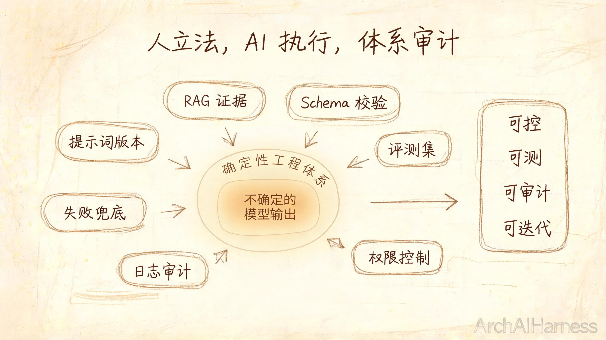

# AI 工程化不是接一个模型 API，而是把不确定输出纳入确定性工程体系

很多 AI 应用的第一步，是接入一个模型 API。这个动作很重要，但它远远不是 AI 工程化的全部。

AI 工程化真正要解决的问题是：如何把模型这种不确定、概率式、上下文敏感的输出，纳入一个可控、可测、可审计、可迭代的工程体系。

## 一、模型输出为什么不确定

大模型生成结果会受到模型版本、提示词、上下文、温度参数、检索内容、工具返回和历史对话影响。同一个问题，在不同条件下可能得到不同答案。

工程化的目标不是消除所有不确定性，而是把不确定性限制在可管理范围内。

## 二、提示词需要版本管理

提示词不是随手写的文案，而是影响系统行为的配置。它应该像代码一样管理版本。

需要记录：

- 提示词内容。
- 适用场景。
- 输入输出格式。
- 变更原因。
- 对评测指标的影响。

如果提示词没有版本管理，线上效果变化就很难追踪。

## 三、评测集是 AI 应用的质量门禁

没有评测集，就无法判断一次优化到底是变好还是变差。

评测集应覆盖：

1. 常见问题。
2. 边界问题。
3. 高风险问题。
4. 反例和干扰信息。
5. 真实用户样本。

## 四、工程视角

一个可运行的 AI 系统通常需要：

- 输入清洗。
- 提示词模板。
- RAG 或工具调用。
- 输出 schema 校验。
- 权限控制。
- 日志追踪。
- 评测集。
- 成本监控。
- 失败兜底。

这些能力决定了 AI 应用能否从 Demo 走向生产。

## 五、常见误区

### 误区一：接入模型 API 就是 AI 应用

API 只是能力入口。真正的应用还需要业务边界、质量控制和运行治理。

### 误区二：效果好坏靠主观体验判断

主观体验容易被个别样例误导。必须建立可重复的评测集。

### 误区三：模型越强，工程越简单

强模型能减少部分复杂度，但权限、数据、安全、评估和审计仍然需要工程体系支撑。

## 六、实践建议

1. 把提示词、评测集和模型版本一起管理。
2. 对结构化结果做 schema 校验。
3. 对高风险动作设置人工确认。
4. 记录每次调用的输入、上下文、输出和工具结果。
5. 为失败设计降级路径，而不是只展示模型错误。

## 结语

AI 工程化不是把模型接进系统，而是把模型纳入系统秩序。人定义边界，AI 在边界内执行，体系负责审计和反馈，这才是 AI 应用可靠落地的基础。
