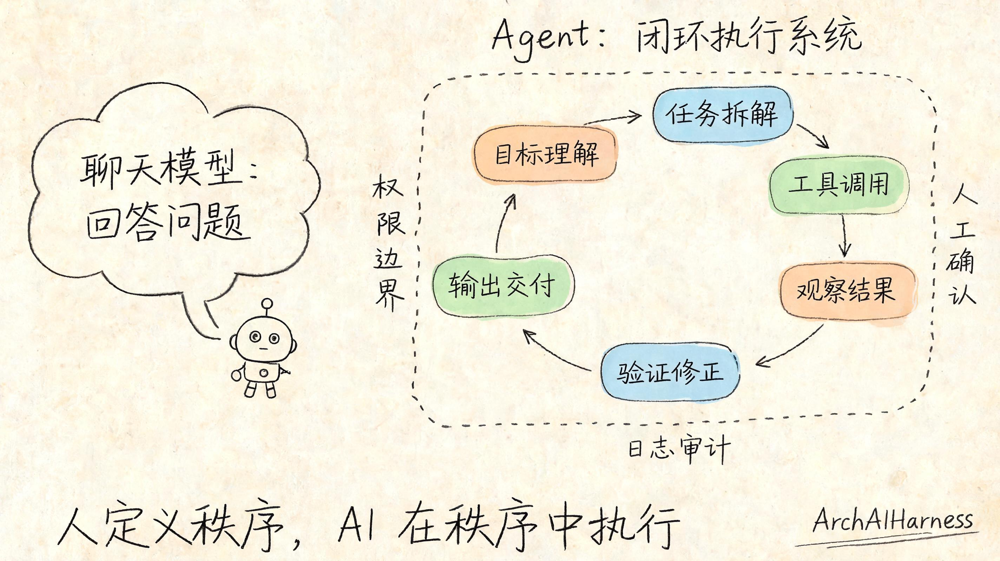

# Agent 不是会聊天的模型，而是围绕目标规划、调用工具、反馈修正的执行系统

很多人把 Agent 理解成“更会聊天的大模型”。这会低估 Agent 的本质。

Agent 的关键不在聊天，而在闭环执行：理解目标、拆解任务、调用工具、观察结果、修正计划，并在约束内推进任务完成。

这意味着 Agent 的核心问题不是“模型回答得像不像人”，而是“系统能不能围绕目标持续推进，并让每一步执行可验证、可回滚、可审计”。

## 一、Agent 的基本闭环

一个最小 Agent 系统至少包含目标、计划、工具、记忆、执行和反馈。

这个闭环让 Agent 不只是生成文本，而是能对外部环境产生可验证的影响。

目标定义了 Agent 要完成什么，计划负责把目标拆成步骤，工具让 Agent 能访问外部能力，观察结果让 Agent 知道执行是否成功，反馈修正让 Agent 能在失败后调整路径。

如果缺少工具调用，Agent 只是一个对话模型；如果缺少反馈验证，Agent 只是一个盲目执行器；如果缺少边界和审计，Agent 就可能变成风险来源。

## 二、工具调用是 Agent 的能力边界

大模型本身不能真正读取文件、访问数据库、调用浏览器或执行命令。它需要通过工具接口获得外部能力。

工具调用带来能力，也带来风险。一个没有权限边界的 Agent，可能误删文件、泄露信息或执行危险操作。

因此，Agent 工程的核心不是“给模型更多工具”，而是“给模型合适的工具、清晰的权限和可审计的过程”。

工具应该按风险分级。只读工具可以相对自动化，写入工具需要参数校验和权限检查，危险工具必须要求人工确认。比如读取文档和查看日志可以自动执行，但删除文件、修改远端仓库、发送消息、发起支付等动作必须有更严格的门禁。

工具描述也很重要。模型依赖工具说明理解什么时候该调用工具、参数怎么填、返回值代表什么。如果工具说明含糊，Agent 很容易误调用或把错误结果当成正确结果。

## 三、记忆不是越多越好

Agent 需要记忆上下文、偏好、任务状态和历史结果。但记忆不是无限堆积。

好的记忆系统要区分：

- 当前任务上下文。
- 长期偏好。
- 可复用知识。
- 操作日志。
- 敏感信息。

敏感信息不应随意进入长期记忆，可公开内容和私有资料也必须分层处理。

记忆的价值在于减少重复沟通、保持任务连续性、复用经验和支持审计。但记忆也可能带来污染：过时信息、错误结论、敏感资料和无关上下文都会影响后续决策。

因此，Agent 记忆需要有生命周期。当前任务上下文可以短期保留，长期偏好要经过确认，可复用知识要有来源，操作日志要可审计，敏感信息要受权限控制。

## 四、工程视角

Agent 系统真正难的是可靠性和治理：

1. 任务是否被正确拆解。
2. 工具参数是否安全。
3. 执行结果是否被验证。
4. 失败是否能重试或回滚。
5. 日志是否可审计。
6. 权限是否最小化。

这正是“人立法，AI 执行，体系审计”的工程含义。

可靠 Agent 不应该只相信自己的自述。执行之后必须观察外部结果，并用测试、检查、状态查询或人工确认来验证任务是否真正完成。

失败也要分类处理。参数错误可以重试，权限不足需要请求授权，外部系统异常可以等待或降级，危险操作失败后要考虑回滚。无限重试不是可靠性，而是缺少退出条件。

一个工程化 Agent 至少要记录：目标、计划、工具调用原因、工具输入、工具输出、验证方式、失败原因和最终结论。没有这些记录，就很难复盘和改进。

## 五、常见误区

### 误区一：Agent 越自主越好

自主性必须建立在边界内。没有边界的自主执行，是风险而不是能力。

好的 Agent 不是“想做什么都能做”，而是在明确权限、目标和退出条件内自主推进。

### 误区二：多轮对话就是 Agent

多轮对话只是交互形式。没有目标推进、工具调用和反馈修正，就不能算完整 Agent。

一个能连续聊天的模型不一定是 Agent，一个能按计划调用工具并验证结果的系统才更接近 Agent。

### 误区三：Agent 失败只是模型不够强

很多失败来自工具设计、权限控制、上下文污染、验证缺失和任务拆解不清。

强模型可以提升规划和推理能力，但不能替代工程边界。

### 误区四：给 Agent 更多工具就能更强

工具越多，选择空间越大，误调用风险也越高。低质量工具会让 Agent 产生更多错误路径。

工具应该少而精，能力边界清楚，参数严格，返回结构化。

## 六、实践建议

1. 为 Agent 明确目标、边界和退出条件。
2. 工具权限最小化，危险操作需要人工确认。
3. 每次工具调用都记录输入、输出和原因。
4. 对关键结果做自动验证，而不是相信模型自述。
5. 把可复用流程沉淀成规范和技能。
6. 区分只读、写入和危险工具，分别设置门禁。
7. 为失败场景设计重试、降级、回滚和人工接管。
8. 对长期记忆建立确认、来源和清理机制。
9. 给 Agent 明确“何时停止”，避免无限循环。
10. 用日志和评估集持续改进工具说明和任务流程。

## 结语

Agent 不是会聊天的模型，而是有目标、有工具、有反馈、有审计的执行系统。真正可靠的 Agent，不是靠模型自由发挥，而是在人定义的秩序中完成任务。

如果说大模型提供语言和推理能力，那么 Agent 工程要做的就是把这种能力放进目标、工具、权限、验证和审计构成的执行框架里。
