# MCP 的本质是给 AI 建立标准化的外部能力接口

大模型本身只能基于上下文生成文本。它不能天然访问文件系统、数据库、浏览器、业务 API 或内部工具。要让 AI 真正参与工程任务，就需要一种标准方式，把外部能力暴露给模型。

MCP 的价值就在这里：它为 AI 应用和外部工具之间建立标准化接口。

更准确地说，MCP 不是简单的插件机制，而是一套面向 AI 客户端、外部能力和治理边界的连接协议。它让模型能够发现工具、读取资源、使用提示模板，并在受控方式下调用外部系统。

## 一、为什么需要 MCP

没有统一协议时，每个工具都要为不同 Agent、不同客户端、不同模型重复适配。这样会造成接口碎片化、权限混乱和治理困难。

MCP 的目标是把外部能力抽象为可发现、可调用、可管理的资源和工具。

在没有标准协议的情况下，一个文件读取工具、数据库查询工具或浏览器工具，可能需要分别为不同客户端写多套适配。工具说明、参数格式、错误返回、权限控制和日志记录也会各做各的。

MCP 把这些能力放到统一边界里，使 AI 客户端可以用一致方式理解外部能力。它解决的不是“能不能接一个工具”，而是“工具能力如何被标准化描述、受控调用和长期治理”。

## 二、Tool、Resource、Prompt 的边界

MCP 中常见概念可以这样理解：

- **Tool**：可执行动作，例如查询数据库、调用接口、运行脚本。
- **Resource**：可读取信息，例如文件、文档、配置、数据记录。
- **Prompt**：可复用任务模板，例如代码审查提示、文档生成提示。

Tool 负责行动，Resource 负责信息，Prompt 负责意图结构化。

这三个概念的边界很重要。读取一份设计文档，通常更适合作为 Resource；执行一次部署脚本，应该是 Tool；复用一套代码审查指令，可以是 Prompt。

如果把所有能力都做成 Tool，模型可能会把“读取信息”和“执行动作”混在一起，增加误操作风险。如果 Resource 没有权限边界，模型可能读取到不该进入上下文的敏感资料。如果 Prompt 没有版本管理，不同客户端复用时可能出现行为漂移。

因此，MCP 的关键不是把能力暴露出去，而是把能力按用途、风险和生命周期分清楚。

## 三、标准化带来的治理能力

当工具能力被统一封装后，系统就可以更容易地做权限控制、审计和复用。

例如：

1. 哪些工具可被调用。
2. 哪些参数需要确认。
3. 哪些资源可被读取。
4. 调用日志如何记录。
5. 错误如何返回给模型。
6. 工具版本如何演进。

MCP 不只是“接工具”，更是把工具纳入治理体系。

一个好的 MCP 工具契约，应该让模型知道“什么时候用、怎么用、失败意味着什么”，也让系统知道“能否执行、如何审计、如何演进”。

参数 schema 是治理的关键。自由文本参数虽然灵活，但会增加不确定性；结构化参数能减少误调用，并便于做权限校验和审计。错误返回也要可预测，不能只返回一段含糊文本，否则模型难以判断是参数错误、权限错误、外部系统错误还是数据不存在。

## 四、工程视角

一个好的 MCP Server 应该具备：

- 清晰的工具描述。
- 严格的参数 schema。
- 可预测的错误返回。
- 最小权限访问。
- 操作日志。
- 对危险动作的确认机制。

MCP Server 本质上是 AI 与外部系统之间的工程边界。它不能只考虑“把函数暴露出去”，还要考虑调用者是否有权限、参数是否安全、结果是否可解释、失败是否可恢复。

工具描述要面向模型理解，而不是只面向人类阅读。描述中应包含工具能做什么、不能做什么、适用场景、输入参数含义、返回字段含义和典型错误。

对于危险动作，MCP Server 不应该把确认责任完全交给模型。删除、发送、支付、发布、迁移等动作，应该有显式确认机制和审计记录。

## 五、常见误区

### 误区一：MCP 只是插件协议

插件强调扩展能力，MCP 更强调标准化、上下文连接和治理边界。

如果只把 MCP 当插件，就容易忽略权限、参数 schema、错误返回和审计这些工程问题。

### 误区二：工具越多越好

工具越多，选择复杂度和风险越高。高质量工具比大量低质量工具更重要。

真正有价值的 MCP 工具，应该边界清晰、参数稳定、返回结构化，而不是把一堆模糊能力暴露给模型。

### 误区三：工具说明可以随便写

模型依赖工具说明理解能力边界。说明含糊会直接导致误调用。

工具说明应该像 API 契约一样严谨。描述不清楚，模型就可能在错误场景调用工具，或者用错误参数调用工具。

### 误区四：接入 MCP 就自动安全

MCP 提供标准化接口，但安全性取决于具体实现。没有权限控制、参数校验和日志审计，标准协议也可能被错误使用。

协议解决连接方式，工程治理解决可靠性和安全性。

## 六、实践建议

1. 每个工具只做一件清晰的事。
2. 参数 schema 要严格，不要放任自由文本。
3. 危险动作必须要求确认。
4. 工具返回要结构化，便于模型继续推理。
5. 所有调用都应可审计。
6. 区分 Tool、Resource、Prompt，不要把所有能力都做成工具。
7. 为资源读取建立权限和脱敏规则。
8. 为工具错误设计稳定错误码和错误信息。
9. 记录工具版本和调用结果，便于回归排查。
10. 让 MCP Server 成为能力边界，而不是能力泄洪口。

## 结语

MCP 的本质，是给 AI 建立标准化的外部能力接口。它让模型不再只会说，而能在受控边界内调用工具、读取资源、完成任务。

真正有价值的 MCP，不只是“模型能调用工具”，而是“工具能力被标准化描述、权限受控、过程可审计、错误可恢复、能力可演进”。
