# RAG 的价值不是“外挂知识库”，而是把生成问题改造成检索增强问题

RAG 经常被简单理解为“给大模型外挂一个知识库”。这个说法有一定直觉，但不够准确。

RAG 的核心价值，是把纯生成问题改造成检索增强问题：先从可信资料中找到相关证据，再让模型基于证据组织答案。

这意味着 RAG 不是“让模型记住更多”，而是把回答过程拉回到可追溯的信息链路中。它试图解决的问题不是模型参数里有没有知识，而是当前问题是否能从可信资料中找到足够证据。

## 一、RAG 的基本流程

一个典型 RAG 系统包括文档处理、切分、向量化、召回、重排、上下文构造和生成回答。

这里每一步都会影响最终效果。RAG 不是把文档塞给模型，而是一个完整的信息检索与生成系统。

文档处理决定资料是否干净，切分决定证据片段是否完整，向量化决定语义表达是否有效，召回决定候选证据是否覆盖问题，重排决定重要证据能否排到前面，上下文构造决定模型能否正确使用证据。

因此，RAG 的质量不是由向量库单独决定的，而是由“资料治理 + 检索链路 + 生成约束 + 评估反馈”共同决定的。

## 二、为什么切分很关键

文档切分太大，召回不精准；切分太小，上下文可能断裂。好的切分策略要保留语义完整性，也要控制片段长度。

常见切分依据包括：

- 标题层级。
- 段落边界。
- 代码块和表格。
- 业务对象。
- 问答粒度。

切分不是简单按字数截断。比如一份接口文档，如果把请求参数和响应示例切到不同 chunk，模型可能只召回其中一半，导致回答不完整。再比如一段代码和解释文字被拆开，模型可能只看到代码，却看不到设计意图。

好的 chunk 应该尽量做到：语义完整、长度适中、边界清晰、便于引用。如果文档结构清楚，可以按标题层级切分；如果内容是 FAQ，可以按问题粒度切分；如果是代码或表格，要尽量保持完整块。

Overlap 也要谨慎使用。适当重叠可以避免上下文断裂，但重叠过多会造成重复召回、噪声增加和存储浪费。

## 三、召回不是答案，重排才接近答案

向量召回找到的是“语义相近”的片段，不等于一定能回答问题。重排会进一步判断候选片段和问题之间的相关性，把更有用的证据排到前面。

召回阶段强调覆盖，宁可多取一些候选片段；重排阶段强调精准，把真正能回答问题的证据排到前面。没有重排时，模型可能被相似但无关的片段干扰。

还要注意，语义相似不等于事实相关。用户问“如何配置退款回调”，向量召回可能找到“支付回调”“订单回调”“退款申请”三个相近片段，但真正能回答问题的可能只有退款回调配置说明。

因此，RAG 系统不能只看“召回到了内容”，还要看“召回内容是否足以支持答案”。

## 四、工程视角

RAG 的难点不是调通 Demo，而是稳定回答真实问题。

需要关注：

1. 文档是否可信、更新是否及时。
2. Chunk 是否保留语义边界。
3. Embedding 模型是否适配领域语言。
4. 召回是否覆盖同义表达。
5. 生成答案是否引用来源。
6. 无答案时是否拒答。

RAG 的工程价值，来自“有证据就回答，无证据就拒答，证据冲突就说明冲突”。如果系统在没有证据时仍然强行生成答案，那么它只是把幻觉换了一种形式。

一个可靠的 RAG 系统应该保留召回片段、重排分数、最终引用和模型回答，便于排查错误。回答错了，要能定位是文档源错误、切分错误、召回错误、重排错误、上下文构造错误，还是模型没有遵守证据。

评估也不能只看最终回答。至少要分别评估召回命中率、证据相关性、答案正确率、引用准确性和拒答质量。

## 五、常见误区

### 误区一：有向量库就是 RAG

向量库只是存储和召回组件。没有文档治理、重排、上下文构造和评估，RAG 很难稳定。

真正的 RAG 是一个证据链系统，而不是一个向量数据库调用。

### 误区二：召回越多越好

召回过多会引入噪声，占用上下文窗口，反而降低答案质量。

更好的做法是先提高召回覆盖，再通过重排、过滤和上下文压缩提升证据质量。

### 误区三：RAG 可以完全消除幻觉

RAG 能降低幻觉，但如果召回错误、上下文冲突或提示词约束不足，模型仍可能编造。

所以 RAG 需要配合引用、拒答、校验和评估，而不是把所有责任交给模型。

### 误区四：文档越多效果越好

文档越多，不代表证据越好。如果文档重复、过期、冲突或质量差，RAG 会把这些问题放大。

文档治理是 RAG 的前提。没有可信资料源，就没有可靠答案。

## 六、实践建议

1. 先建立高质量文档源，再做向量化。
2. 为每个答案保留引用来源。
3. 对无证据问题明确拒答。
4. 建立问题集评估召回率和答案正确率。
5. 记录召回片段，便于排查错误答案。
6. 根据文档结构设计 chunk 策略，不要只按固定长度切分。
7. 为同义词、缩写和领域术语做召回补强。
8. 对证据冲突场景显式提示冲突来源。
9. 定期清理过期文档，避免旧资料污染答案。
10. 把 RAG 评估拆成检索评估和生成评估两部分。

## 结语

RAG 的目标不是让模型“记住更多”，而是让模型“基于证据回答”。它把大模型从纯生成拉回到可追溯的信息链路中，是大模型工程化的重要基础能力。

真正可靠的 RAG，不是向量库加模型，而是围绕证据构建的回答系统：资料可信、切分合理、召回准确、重排有效、引用清楚、无证据可拒答。
