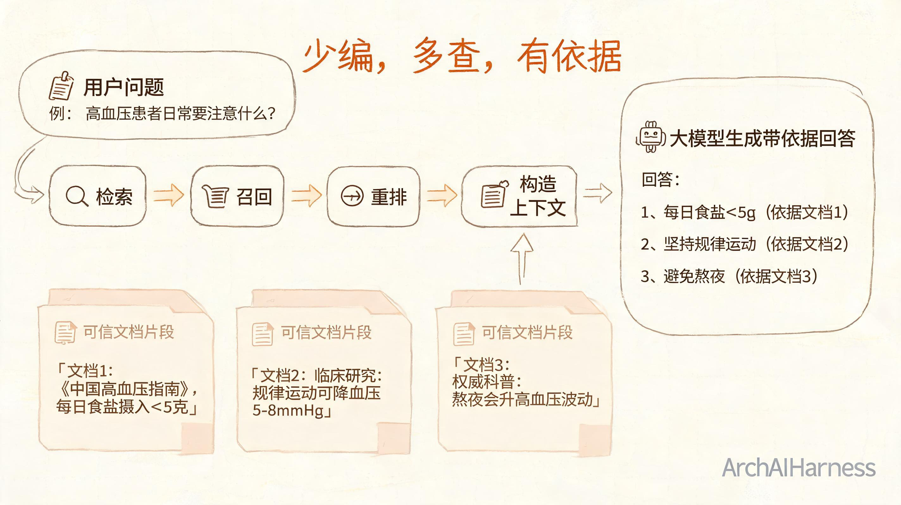

# RAG 的价值不是“外挂知识库”，而是把生成问题改造成检索增强问题

RAG 经常被简单理解为“给大模型外挂一个知识库”。这个说法有一定直觉，但不够准确。

RAG 的核心价值，是把纯生成问题改造成检索增强问题：先从可信资料中找到相关证据，再让模型基于证据组织答案。

## 一、RAG 的基本流程

一个典型 RAG 系统包括文档处理、切分、向量化、召回、重排、上下文构造和生成回答。

这里每一步都会影响最终效果。RAG 不是把文档塞给模型，而是一个完整的信息检索与生成系统。

## 二、为什么切分很关键

文档切分太大，召回不精准；切分太小，上下文可能断裂。好的切分策略要保留语义完整性，也要控制片段长度。

常见切分依据包括：

- 标题层级。
- 段落边界。
- 代码块和表格。
- 业务对象。
- 问答粒度。

## 三、召回不是答案，重排才接近答案

向量召回找到的是“语义相近”的片段，不等于一定能回答问题。重排会进一步判断候选片段和问题之间的相关性，把更有用的证据排到前面。

## 四、工程视角

RAG 的难点不是调通 Demo，而是稳定回答真实问题。

需要关注：

1. 文档是否可信、更新是否及时。
2. Chunk 是否保留语义边界。
3. Embedding 模型是否适配领域语言。
4. 召回是否覆盖同义表达。
5. 生成答案是否引用来源。
6. 无答案时是否拒答。

## 五、常见误区

### 误区一：有向量库就是 RAG

向量库只是存储和召回组件。没有文档治理、重排、上下文构造和评估，RAG 很难稳定。

### 误区二：召回越多越好

召回过多会引入噪声，占用上下文窗口，反而降低答案质量。

### 误区三：RAG 可以完全消除幻觉

RAG 能降低幻觉，但如果召回错误、上下文冲突或提示词约束不足，模型仍可能编造。

## 六、实践建议

1. 先建立高质量文档源，再做向量化。
2. 为每个答案保留引用来源。
3. 对无证据问题明确拒答。
4. 建立问题集评估召回率和答案正确率。
5. 记录召回片段，便于排查错误答案。

## 结语

RAG 的目标不是让模型“记住更多”，而是让模型“基于证据回答”。它把大模型从纯生成拉回到可追溯的信息链路中，是大模型工程化的重要基础能力。
