# 大语言模型不是知识库，而是基于上下文预测下一个 token 的概率机器

大语言模型很容易给人一种错觉：它像一个装满知识的数据库，用户提问，它查找答案。但这个理解并不准确。

大语言模型的基本机制，是在给定上下文的条件下，预测下一个 token 的概率分布。它不是按数据库索引检索事实，而是在语言模式、知识片段和上下文约束中生成最可能的续写。

这也是大模型既强大又不稳定的根源。它可以在大量语言模式中迁移能力，完成摘要、翻译、代码、推理、规划和对话；但它并不天然区分“我知道事实”和“我生成了一个看起来合理的说法”。

## 一、Token 是模型处理语言的基本单位

模型并不直接处理“字”或“词”，而是把文本切分成 token。一个 token 可能是一个字、一个词，也可能是词的一部分。

生成过程不是一次性写完整答案，而是一个 token 接一个 token 地生成。

当用户输入问题时，模型会把问题、系统提示词、历史对话、工具返回结果等内容一起放入上下文窗口。模型根据这些上下文计算下一个 token 的概率分布，然后选择一个 token 输出。输出的新 token 又会进入上下文，继续影响后续 token 的生成。

因此，大模型回答问题不是“查到了完整答案再返回”，而是“在当前上下文约束下不断生成后续文本”。这个机制解释了很多现象：同一个问题可能多次回答不同；提示词改变会影响结果；上下文里放入错误信息会诱导模型生成错误答案；长答案越往后越容易受前文累积影响。

上下文窗口决定模型一次能看到多少信息，但窗口变大并不等于理解变强。大窗口可以容纳更多材料，也会带来噪声、成本和注意力分散问题。真正重要的是把关键信息以清晰结构放进上下文，而不是简单堆材料。

这个循环说明了为什么大模型输出会受前文强烈影响：每一个新生成的 token 都会进入上下文，成为后续生成的条件。

## 二、预训练、指令微调和对齐

大模型通常经历几个阶段：

1. **预训练**：在大规模文本上学习语言规律和世界知识片段。
2. **指令微调**：学习按照人类指令回答问题。
3. **偏好对齐**：让输出更符合人类偏好和安全要求。

这些阶段让模型从“会续写文本”逐步变成“能按指令完成任务”。

预训练阶段的目标通常是预测下一个 token。模型在海量文本中学习语言结构、常识片段、代码模式、事实关联和表达风格。这个阶段让模型获得广泛能力，但它学到的是分布中的模式，不是经过验证的事实数据库。

指令微调阶段让模型学习“如何回应指令”。如果只有预训练，模型更像一个续写器；经过指令微调后，它更能理解用户想要摘要、解释、分类、写代码、改写还是制定计划。

偏好对齐阶段则进一步调整模型行为，让回答更有帮助、更安全、更符合人类偏好。但对齐并不等于事实校验。一个经过对齐的模型可能更礼貌、更有条理、更少输出危险内容，但仍然可能在事实细节上犯错。

所以，训练阶段提升的是模型生成能力、指令遵循能力和行为边界，不会把模型变成天然可信的事实源。

## 三、为什么会幻觉

幻觉不是偶然 bug，而是生成式机制的自然风险。模型的目标是生成看起来合理的文本，而不是天然验证事实。

当上下文不足、问题超出训练分布、事实需要精确检索或推理链过长时，模型可能生成流畅但错误的答案。

幻觉常见于几类场景：

- 用户要求精确事实，但上下文没有提供证据。
- 问题涉及最新信息，而模型训练数据已经过期。
- 问题包含错误前提，模型没有主动纠正。
- 任务要求引用来源，但模型没有真实检索能力。
- 推理链很长，中间步骤一旦偏离，后续会继续沿着错误方向生成。
- 用户提示词强烈诱导某个结论，模型顺从了错误假设。

这说明，幻觉不是靠“让模型更认真”就能完全解决。提示词可以降低风险，但不能替代证据、检索、工具调用、校验和人工审核。

在工程里，解决幻觉的核心不是要求模型“不要错”，而是把模型放进一个有证据、有约束、有校验、有回退的系统中。对于事实型任务，要让模型基于可追溯材料回答；对于计算型任务，要调用工具；对于结构化任务，要做 schema 校验；对于高风险任务，要有人审或规则兜底。

幻觉治理不是一句提示词，而是一组工程护栏：证据、工具、校验、拒答、人工审核和日志审计共同降低错误输出进入业务系统的概率。

## 四、工程视角

使用大模型时，不能把它当成绝对可信的数据源。更合理的做法是：

- 用上下文约束回答范围。
- 对事实问题引入检索或工具。
- 对关键输出做格式校验。
- 对高风险决策保留人工审核。
- 记录提示词、模型版本和输出结果。

大模型在工程系统中的定位，更像一个具备语言理解、生成、转换和推理能力的组件，而不是系统的全部。它需要和数据、权限、工具、工作流、监控、评估体系结合，才能稳定服务业务。

一个可靠的大模型应用通常包括：输入治理、上下文构造、模型调用、工具调用、结果校验、失败重试、日志追踪、评估集和安全策略。每个环节都在给概率生成加边界。

上下文构造尤其关键。好的上下文不是越长越好，而是目标清楚、证据明确、约束具体、输出格式稳定。比如让模型回答政策条款问题，最好提供被引用条款、要求只基于条款回答、要求标注依据，并在没有依据时明确回答“不足以判断”。

评估也很重要。大模型应用不能只凭几次对话体验判断效果，而要建立固定评测集，覆盖正常问题、边界问题、反例问题、恶意输入、格式要求和失败场景。模型版本、提示词、检索策略或工具逻辑变化后，都要重新评估。

## 五、常见误区

### 误区一：模型参数越大就越不会错

更大的模型通常能力更强，但并不消除幻觉，也不保证事实正确。参数规模提升的是表达、泛化和复杂任务处理能力，不是事实验证机制。

在事实精确性要求高的场景里，小模型加可靠检索和校验，可能比大模型裸答更可信。

### 误区二：上下文窗口越大越好

大窗口能容纳更多信息，但也可能引入噪声，增加成本，并降低关键信息密度。

如果上下文里混入互相矛盾、无关或过时的信息，模型可能被错误材料影响。相比堆长文本，更重要的是检索准确、材料去重、证据排序和结构化输入。

### 误区三：提示词能解决所有问题

提示词能改善行为，但不能替代数据治理、工具调用、评估体系和权限控制。

提示词适合表达任务目标、输出格式、角色边界和注意事项；但它不能保证事实真实，不能替代数据库查询，不能替代权限校验，也不能替代生产系统里的异常处理。

### 误区四：模型会说“我不知道”就足够安全

模型会表达不确定性是好事，但不能把安全建立在模型自觉上。模型可能在该拒绝时回答，也可能在该回答时过度拒绝。

工程系统需要通过权限、检索范围、工具能力、输出校验和人工审核来控制风险，而不是完全依赖模型自己判断边界。

## 六、实践建议

1. 把大模型视为生成与推理组件，而不是事实数据库。
2. 对事实型任务引入 RAG 或外部工具。
3. 对结构化输出使用 schema 校验。
4. 对关键场景建立评测集。
5. 对模型输出保留可追溯日志。
6. 上下文要短而准，优先放证据、约束和输出格式。
7. 对高风险回答设置人工审核、规则兜底或拒答策略。
8. 对模型版本、提示词版本、检索策略和工具调用结果做记录。
9. 不把权限判断、金额计算、合规结论完全交给模型裸答。
10. 用“模型能力 + 工具 + 数据 + 校验 + 审计”的系统思维设计大模型应用。

## 结语

大语言模型的强大来自概率生成与上下文迁移，但它不是天然可靠的知识库。理解 token、上下文、预训练和幻觉，才能把大模型能力用在合适的位置，并为它设计必要的工程护栏。

真正可靠的大模型应用，不是让模型单独承担所有判断，而是让模型在明确边界内完成生成、理解和推理，再由检索、工具、校验、权限和审计共同保证系统可信。
