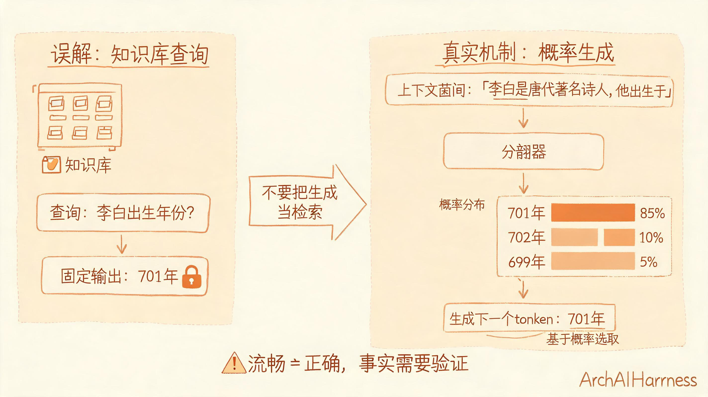

# 大语言模型不是知识库，而是基于上下文预测下一个 token 的概率机器

大语言模型很容易给人一种错觉：它像一个装满知识的数据库，用户提问，它查找答案。但这个理解并不准确。

大语言模型的基本机制，是在给定上下文的条件下，预测下一个 token 的概率分布。它不是按数据库索引检索事实，而是在语言模式、知识片段和上下文约束中生成最可能的续写。

## 一、Token 是模型处理语言的基本单位

模型并不直接处理“字”或“词”，而是把文本切分成 token。一个 token 可能是一个字、一个词，也可能是词的一部分。

生成过程不是一次性写完整答案，而是一个 token 接一个 token 地生成。

## 二、预训练、指令微调和对齐

大模型通常经历几个阶段：

1. **预训练**：在大规模文本上学习语言规律和世界知识片段。
2. **指令微调**：学习按照人类指令回答问题。
3. **偏好对齐**：让输出更符合人类偏好和安全要求。

这些阶段让模型从“会续写文本”逐步变成“能按指令完成任务”。

## 三、为什么会幻觉

幻觉不是偶然 bug，而是生成式机制的自然风险。模型的目标是生成看起来合理的文本，而不是天然验证事实。

当上下文不足、问题超出训练分布、事实需要精确检索或推理链过长时，模型可能生成流畅但错误的答案。

## 四、工程视角

使用大模型时，不能把它当成绝对可信的数据源。更合理的做法是：

- 用上下文约束回答范围。
- 对事实问题引入检索或工具。
- 对关键输出做格式校验。
- 对高风险决策保留人工审核。
- 记录提示词、模型版本和输出结果。

## 五、常见误区

### 误区一：模型参数越大就越不会错

更大的模型通常能力更强，但并不消除幻觉，也不保证事实正确。

### 误区二：上下文窗口越大越好

大窗口能容纳更多信息，但也可能引入噪声，增加成本，并降低关键信息密度。

### 误区三：提示词能解决所有问题

提示词能改善行为，但不能替代数据治理、工具调用、评估体系和权限控制。

## 六、实践建议

1. 把大模型视为生成与推理组件，而不是事实数据库。
2. 对事实型任务引入 RAG 或外部工具。
3. 对结构化输出使用 schema 校验。
4. 对关键场景建立评测集。
5. 对模型输出保留可追溯日志。

## 结语

大语言模型的强大来自概率生成与上下文迁移，但它不是天然可靠的知识库。理解 token、上下文、预训练和幻觉，才能把大模型能力用在合适的位置，并为它设计必要的工程护栏。
