# 机器学习不是让机器“理解”，而是从数据中拟合可泛化的规律

机器学习经常被描述成“让机器学会理解世界”。这个说法容易让人误解。更准确地说，机器学习是在给定数据分布下，通过训练过程拟合一个函数，让它能够在未见样本上做出尽量可靠的预测。

模型学到的不是绝对真理，而是数据中稳定出现的统计规律。

## 一、机器学习解决的是什么问题

传统程序是人写规则，机器执行规则。机器学习则是人准备数据、目标和约束，让模型从数据中寻找规律。

这个循环的关键不在“智能”，而在“通过损失函数不断修正模型参数”。

## 二、训练集、特征、标签和损失函数

机器学习的基本要素包括：

- **训练集**：模型学习的样本来源。
- **特征**：用于描述样本的信息。
- **标签**：希望模型预测的目标。
- **损失函数**：衡量预测结果和真实标签之间的差距。
- **优化器**：根据损失调整模型参数。

如果数据质量差、标签不稳定、特征与目标无关，再复杂的模型也难以产生可靠结果。

## 三、泛化比记忆更重要

模型在训练集上表现好，不代表真正有效。真正重要的是泛化能力：面对没见过的新样本，模型仍能做出合理预测。

过拟合就是模型把训练数据记得太死，学到了噪声而不是规律。

## 四、工程视角

机器学习项目的难点往往不在算法名称，而在数据闭环：

1. 数据从哪里来。
2. 标签是否可信。
3. 样本是否覆盖真实场景。
4. 训练集和线上分布是否一致。
5. 模型效果如何持续评估。
6. 错误预测如何反馈回训练流程。

没有数据闭环，模型只是一份离线实验结果。

## 五、常见误区

### 误区一：模型学到的是事实

模型学到的是数据分布下的相关性，不等于事实本身。

### 误区二：算法越复杂越好

复杂模型需要更多数据、更强算力和更严格评估。简单模型在很多业务场景中更稳定。

### 误区三：准确率高就够了

不同任务需要不同指标。分类任务可能关注召回率，排序任务可能关注 NDCG，风控任务可能关注误杀率和漏放率。

## 六、实践建议

1. 先定义清楚预测目标，再谈模型。
2. 把数据质量放在算法调参之前。
3. 一定要拆分训练集、验证集和测试集。
4. 关注线上分布漂移，而不只看离线指标。
5. 对模型输出保留置信度和解释线索。

## 结语

机器学习不是让机器获得人类式理解，而是在数据、目标和约束下拟合可泛化规律。理解这一点，才能避免把模型神化，也能更务实地把机器学习纳入工程体系。
