# 机器学习不是让机器“理解”，而是从数据中拟合可泛化的规律

机器学习经常被描述成“让机器学会理解世界”。这个说法容易让人误解。更准确地说，机器学习是在给定数据分布下，通过训练过程拟合一个函数，让它能够在未见样本上做出尽量可靠的预测。

模型学到的不是绝对真理，而是数据中稳定出现的统计规律。它不保证像人一样理解原因，也不天然知道事实是否正确。它只是根据已有样本、特征、标签和优化目标，学习输入到输出之间的映射关系。

因此，机器学习的核心问题不是“模型有没有智能”，而是：数据是否代表真实场景，目标是否定义清楚，训练过程是否能学到可泛化规律，评估指标是否能反映业务价值。

## 一、机器学习解决的是什么问题

传统程序是人写规则，机器执行规则。机器学习则是人准备数据、目标和约束，让模型从数据中寻找规律。

传统规则适合边界清晰、逻辑稳定的问题。例如税率计算、权限判断、订单状态校验，可以由工程师写出明确规则。但有些问题很难写出完整规则，例如识别垃圾邮件、预测用户是否流失、判断图片里有没有猫、给商品排序。

这类问题的共同点是：规则复杂、特征很多、边界模糊，但历史数据里存在可学习的模式。机器学习适合在这种场景中从样本里拟合规律。

这个循环的关键不在“智能”，而在“通过损失函数不断修正模型参数”。模型先根据当前参数做预测，再计算预测和真实标签之间的差距，最后通过优化算法调整参数，让下一次预测更接近目标。

所以，机器学习不是跳过规则，而是把一部分难以手写的规则，交给数据和优化过程来近似学习。

## 二、训练集、特征、标签和损失函数

机器学习的基本要素包括：

- **训练集**：模型学习的样本来源。
- **特征**：用于描述样本的信息。
- **标签**：希望模型预测的目标。
- **损失函数**：衡量预测结果和真实标签之间的差距。
- **优化器**：根据损失调整模型参数。

这些要素决定了模型能学到什么，也决定了模型会在哪些地方出错。

训练集决定模型见过什么。如果训练数据只覆盖少数场景，模型就很难在新场景中可靠工作。特征决定模型能看见什么，如果关键因素没有进入特征，模型再复杂也无法凭空推断。标签决定模型被要求学习什么，如果标签本身噪声很大、标准不一致，模型会把噪声也当成规律学习。

损失函数决定模型优化方向。分类任务可能使用交叉熵，回归任务可能使用均方误差，排序任务可能使用排序损失。损失函数并不等同于业务目标，如果损失函数和业务目标不一致，模型可能在离线指标上变好，但线上效果不一定变好。

如果数据质量差、标签不稳定、特征与目标无关，再复杂的模型也难以产生可靠结果。机器学习项目里，很多失败不是因为模型不够高级，而是因为数据、标签和目标定义不清楚。

## 三、泛化比记忆更重要

模型在训练集上表现好，不代表真正有效。真正重要的是泛化能力：面对没见过的新样本，模型仍能做出合理预测。

过拟合就是模型把训练数据记得太死，学到了噪声而不是规律。欠拟合则是模型能力不足，连训练数据里的主要规律都没学到。

为了评估泛化能力，通常要把数据拆成训练集、验证集和测试集。训练集用于学习参数，验证集用于选择模型和调参，测试集用于尽量客观地评估最终效果。

但这还不够。真实业务中，线上数据分布可能会变化。用户行为会变化，商品结构会变化，攻击方式会变化，季节和活动也会改变样本分布。这就是分布漂移。模型上线后如果不持续监控，就可能从“原来有效”变成“悄悄失效”。

因此，泛化不是一次离线评估就结束的事情，而是一个持续过程：训练、验证、上线、监控、采集错误样本、重新训练、再次评估。

这张图强调了机器学习项目的真实闭环：模型上线不是终点，线上错误样本和分布变化会反过来影响标签、特征和训练过程。

## 四、工程视角

机器学习项目的难点往往不在算法名称，而在数据闭环：

1. 数据从哪里来。
2. 标签是否可信。
3. 样本是否覆盖真实场景。
4. 训练集和线上分布是否一致。
5. 模型效果如何持续评估。
6. 错误预测如何反馈回训练流程。

没有数据闭环，模型只是一份离线实验结果。

工程上还要考虑模型如何进入真实系统。训练阶段关注的是数据、特征、损失、评估和收敛；上线阶段还要关注延迟、吞吐、稳定性、可解释性、回滚机制、版本管理和监控告警。

一个机器学习系统通常包括：数据采集、特征加工、训练任务、模型评估、模型注册、在线推理、日志采集、效果监控和再训练流程。任何一个环节不稳定，都会影响最终效果。

还要注意，模型输出通常是概率或分数，不是绝对判断。工程系统要决定阈值、兜底策略、人工审核路径和异常处理方式。比如风控模型给出高风险分数，系统还需要决定是拦截、二次验证、人工审核还是放行。

指标选择必须从任务目标倒推。不同场景下，“好模型”的定义不同：推荐系统关注排序质量，风控系统关注风险成本，增长场景关注转化和留存。

## 五、常见误区

### 误区一：模型学到的是事实

模型学到的是数据分布下的相关性，不等于事实本身。它可能捕捉到真实因果，也可能只是捕捉到历史数据里的偏差和偶然相关。

例如，一个招聘模型如果训练数据本身带有历史偏见，模型可能会把偏见当作规律。一个风控模型如果只见过旧攻击方式，面对新攻击时也可能失效。

### 误区二：算法越复杂越好

复杂模型需要更多数据、更强算力和更严格评估。简单模型在很多业务场景中更稳定。

如果数据量不大、特征清晰、业务要求可解释，线性模型、树模型或规则加模型的组合，可能比复杂深度模型更合适。模型越复杂，调试、解释、部署和监控成本也越高。

### 误区三：准确率高就够了

不同任务需要不同指标。分类任务可能关注召回率，排序任务可能关注 NDCG，风控任务可能关注误杀率和漏放率。

准确率在样本不均衡时尤其容易误导。比如 99% 的样本都是正常用户，一个永远预测“正常”的模型也可能有 99% 准确率，但它对发现风险毫无价值。

### 误区四：离线指标好就能直接上线

离线指标只说明模型在历史测试集上表现好，不代表线上一定有效。线上会遇到延迟限制、数据缺失、特征延迟、分布漂移、用户反馈变化和系统联动影响。

模型上线前需要灰度、A/B 实验、监控和回滚方案。上线后也要持续观察真实业务指标，而不是只看离线评估结果。

## 六、实践建议

1. 先定义清楚预测目标，再谈模型。
2. 把数据质量放在算法调参之前。
3. 一定要拆分训练集、验证集和测试集。
4. 关注线上分布漂移，而不只看离线指标。
5. 对模型输出保留置信度和解释线索。
6. 针对业务目标选择指标，不要只看准确率。
7. 建立错误样本回流机制，让模型能持续改进。
8. 上线前设计灰度、监控和回滚机制。
9. 对关键场景保留人工审核或规则兜底。
10. 记录数据版本、特征版本、模型版本和评估结果，保证可追溯。

## 结语

机器学习不是让机器获得人类式理解，而是在数据、目标和约束下拟合可泛化规律。理解这一点，才能避免把模型神化，也能更务实地把机器学习纳入工程体系。

真正可靠的机器学习能力，不只来自模型结构，还来自数据质量、目标定义、评估体系、工程闭环和持续监控。模型只是系统的一部分，数据闭环和工程治理决定它能否长期有效。
