# 深度学习的核心不是“深”，而是用多层表示压缩复杂模式

深度学习里的“深”，指的是模型由多层非线性变换组成。但真正重要的不是层数本身，而是多层结构带来的表示能力。

神经网络通过一层层变换，把原始输入逐步映射成更适合任务的中间表示。这个过程可以理解为：把复杂模式压缩成模型能够处理的结构。

传统机器学习经常依赖人工设计特征，而深度学习的重要变化在于：模型可以从大量数据中自动学习表示。它不只是学习输入到输出的映射，也在学习中间应该如何组织信息。

## 一、从输入到表示

以图像分类为例，模型并不是一开始就理解“猫”或“狗”。它可能先识别边缘、纹理、局部形状，再组合成更高层的语义特征。

这个过程可以理解为多层表示的逐步抽象：底层关注局部和简单模式，中间层组合局部结构，高层形成更接近任务目标的语义表示。

在文本任务中也类似。模型一开始处理的是 token 或子词表示，经过多层变换后，逐步形成上下文相关的语义表示。一个词在不同句子里的含义不同，深度模型的价值就在于能根据上下文动态调整表示。

深度网络的优势在于，它不完全依赖人工设计特征，而是可以从数据中学习表示。但这也意味着它高度依赖数据规模、数据质量、训练目标和模型结构。

## 二、反向传播：误差如何回到参数

训练神经网络时，模型先前向计算得到输出，再用损失函数衡量误差，然后通过反向传播计算每个参数对误差的影响，最后用优化器更新参数。

这套机制并不神秘，本质上是用梯度告诉模型：哪些参数应该往哪个方向调整。

更具体地说，前向传播负责从输入计算到输出，损失函数负责衡量输出和目标之间的差距，反向传播利用链式法则把误差从输出层一层层传回前面的层，优化器根据梯度更新参数。

如果学习率太大，训练可能震荡甚至发散；学习率太小，收敛会很慢。参数初始化、归一化、激活函数、优化器选择、批大小和正则化都会影响训练稳定性。

反向传播不是“让模型理解错误”，而是让模型根据误差信号调整数值参数。模型是否真正学到有用表示，取决于数据、目标、结构和训练过程是否共同指向正确方向。

训练闭环的重点在于误差如何变成参数更新。前向传播负责得到预测，损失函数负责度量偏差，反向传播和优化器负责把偏差转化成下一轮参数调整。

## 三、不同网络结构解决不同模式

不同网络结构适合不同类型的数据模式：

- CNN 擅长处理局部空间模式，常用于图像。
- RNN 曾用于序列建模，适合时间步依赖。
- Transformer 通过注意力机制处理长距离依赖，成为大模型基础结构。

CNN 的核心假设是局部相关性和权重共享。图像中相邻像素关系密切，同一个边缘检测器可以在不同位置复用，因此卷积结构非常适合图像和局部模式。

RNN 的核心思路是按时间步递归处理序列，把前面的状态传给后面的计算。它适合表达序列依赖，但长距离依赖和并行训练存在困难。

Transformer 的关键是注意力机制。它让模型在处理一个 token 时，可以直接关注上下文中其他 token，从而更好地建模长距离依赖，也更适合大规模并行训练。

结构选择不是追逐热点，而是匹配数据形态和任务约束。图像、文本、语音、推荐、时间序列和多模态任务，对模型结构、训练数据和推理成本的要求都不同。

## 四、工程视角

深度学习系统不只是模型文件，还包括：

1. 数据预处理。
2. 训练配置。
3. 模型评估。
4. 推理服务。
5. 版本管理。
6. 资源成本控制。

同一个模型，训练时关注收敛和泛化，推理时关注延迟、吞吐、显存和稳定性。

训练阶段要关注数据加载效率、显存占用、梯度稳定性、训练速度、验证集表现和过拟合风险。推理阶段则要关注模型大小、响应延迟、并发吞吐、批处理策略、量化压缩、缓存策略和故障兜底。

深度学习工程里，实验管理非常重要。一次实验不仅是模型代码，还包括数据版本、预处理逻辑、模型结构、超参数、随机种子、训练环境、评估指标和产出模型。没有记录，结果就难以复现；难以复现，就难以迭代。

在生产系统中，还要考虑模型漂移和数据漂移。训练时表现好的模型，上线后可能因为用户行为变化、输入分布变化或业务规则变化而效果下降。因此，深度学习系统也需要持续监控和再训练机制。

训练关注能否学到有效表示，推理关注能否稳定、快速、低成本地服务真实请求。很多深度学习工程问题，恰恰出现在从训练到推理的切换处。

## 五、常见误区

### 误区一：层数越深越好

更深的模型可能更强，也可能更难训练、更慢、更容易过拟合。层数增加会带来更强表示能力，也会带来更高计算成本、更大显存占用和更复杂的优化问题。

好的模型不是层数最多，而是在任务效果、训练成本、推理成本和维护复杂度之间取得平衡。

### 误区二：神经网络完全不可解释

深度模型确实复杂，但可以通过特征可视化、注意力分析、消融实验和错误样本分析获得部分解释。

解释不是非黑即白。我们未必能完全解释每个参数的意义，但可以分析模型依赖哪些输入、在哪些样本上失败、移除哪些特征会影响效果、哪些层学到了什么类型表示。

### 误区三：有 GPU 就能做好深度学习

算力只是条件之一。数据、目标、评估和工程闭环同样重要。

没有高质量数据，GPU 只会更快地拟合噪声；没有正确指标，训练越久可能离业务目标越远；没有工程闭环，模型只能停留在实验室结果。

### 误区四：训练效果好就说明模型可上线

训练效果好不代表可上线。上线还要考虑推理延迟、显存成本、输入异常、版本回滚、监控告警、数据漂移和安全边界。

很多模型不是输在训练指标，而是输在工程化：太慢、太贵、不稳定、不可监控、不可回滚。

## 六、实践建议

1. 先用简单模型建立基线，再逐步增加复杂度。
2. 关注验证集表现，而不只看训练损失。
3. 记录每次实验的数据版本、参数、代码版本和指标。
4. 对推理场景提前评估延迟、吞吐、显存和成本。
5. 用错误样本分析指导下一轮数据改进。
6. 关注过拟合、欠拟合、梯度不稳定和数据泄漏。
7. 对模型上线设计灰度、监控、回滚和再训练机制。
8. 不要只追求更大模型，也要评估部署成本和维护成本。
9. 对关键业务输出保留解释线索、日志和人工兜底。
10. 把模型训练、评估、部署和监控看成一个完整系统，而不是孤立脚本。

## 结语

深度学习的核心不是模型有多深，而是能否学到有效表示。表示质量决定模型能否从复杂输入中提取稳定规律，也决定它能否在真实任务中可靠工作。

真正落地的深度学习系统，不只是训练出一个指标更高的模型，而是把表示学习能力放进可复现、可评估、可部署、可监控的工程闭环里。
