# 深度学习的核心不是“深”，而是用多层表示压缩复杂模式

深度学习里的“深”，指的是模型由多层非线性变换组成。但真正重要的不是层数本身，而是多层结构带来的表示能力。

神经网络通过一层层变换，把原始输入逐步映射成更适合任务的中间表示。这个过程可以理解为：把复杂模式压缩成模型能够处理的结构。

## 一、从输入到表示

以图像分类为例，模型并不是一开始就理解“猫”或“狗”。它可能先识别边缘、纹理、局部形状，再组合成更高层的语义特征。

深度网络的优势在于，它不完全依赖人工设计特征，而是可以从数据中学习表示。

## 二、反向传播：误差如何回到参数

训练神经网络时，模型先前向计算得到输出，再用损失函数衡量误差，然后通过反向传播计算每个参数对误差的影响，最后用优化器更新参数。

这套机制并不神秘，本质上是用梯度告诉模型：哪些参数应该往哪个方向调整。

## 三、不同网络结构解决不同模式

- CNN 擅长处理局部空间模式，常用于图像。
- RNN 曾用于序列建模，适合时间步依赖。
- Transformer 通过注意力机制处理长距离依赖，成为大模型基础结构。

结构选择不是追逐热点，而是匹配数据形态和任务约束。

## 四、工程视角

深度学习系统不只是模型文件，还包括：

1. 数据预处理。
2. 训练配置。
3. 模型评估。
4. 推理服务。
5. 版本管理。
6. 资源成本控制。

同一个模型，训练时关注收敛和泛化，推理时关注延迟、吞吐、显存和稳定性。

## 五、常见误区

### 误区一：层数越深越好

更深的模型可能更强，也可能更难训练、更慢、更容易过拟合。

### 误区二：神经网络完全不可解释

深度模型确实复杂，但可以通过特征可视化、注意力分析、消融实验和错误样本分析获得部分解释。

### 误区三：有 GPU 就能做好深度学习

算力只是条件之一。数据、目标、评估和工程闭环同样重要。

## 六、实践建议

1. 先用简单模型建立基线。
2. 关注验证集表现，而不只看训练损失。
3. 记录每次实验的数据版本、参数和指标。
4. 对推理场景提前评估延迟和成本。
5. 用错误样本分析指导下一轮数据改进。

## 结语

深度学习的核心不是模型有多深，而是能否学到有效表示。表示质量决定模型能否从复杂输入中提取稳定规律，也决定它能否在真实任务中可靠工作。
