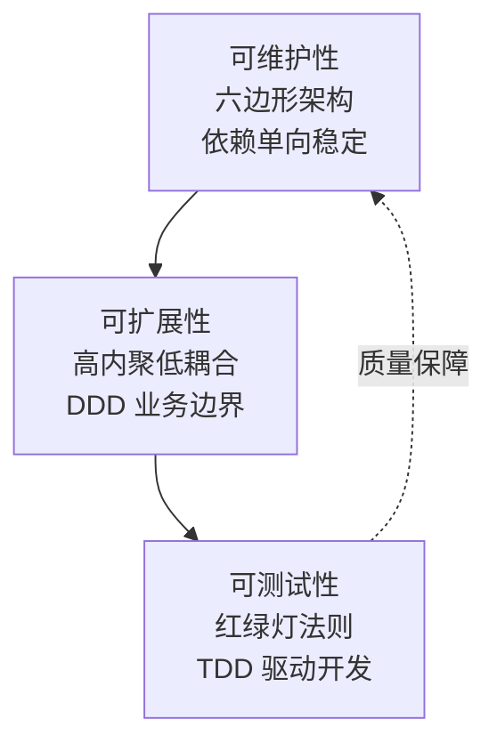
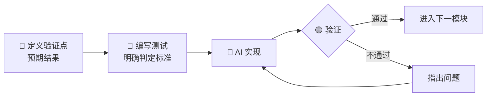
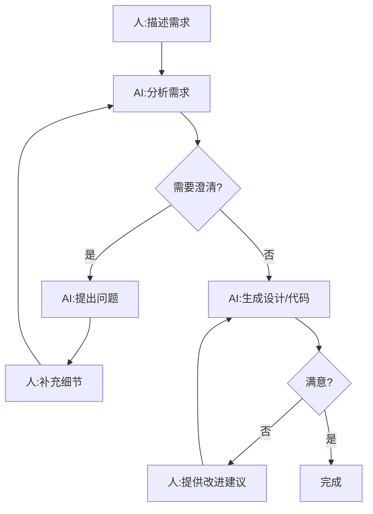
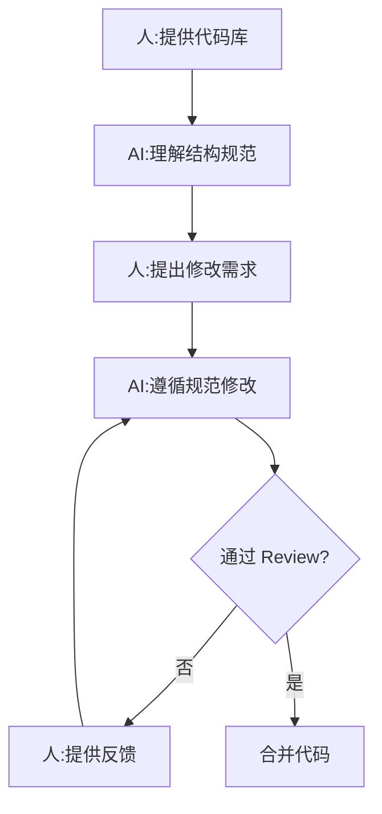
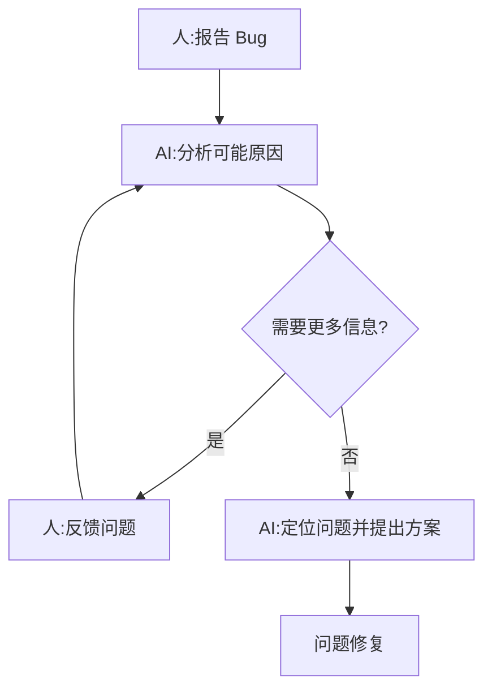

# 人机协同开发流程 (Human-AI Collaborative Engineering)

> AI 时代的开发心法 —— 在 AI 编码能力突飞猛进的当下,如何让人类始终掌握主导权?

## 核心定义

人机协同开发(在本体系中亦称 **Vibe Coding**),是一套以「**AI 增强人类、而非替代人类**」为核心理念的编程实践方法论。

它的本质不是「让 AI 写更多代码」,而是 **让人在更高的抽象层级上掌控全局,把重复性的实现工作交给 AI**。

## 三大核心目标



### 1. 可维护性 —— 六边形架构

**领域(Domain)位于核心,零框架依赖**。外层依赖内层,禁止逆向。端口(Port)是领域与外界的契约。

### 2. 可扩展性 —— DDD 业务边界

按业务职责划分**限界上下文(Bounded Context)**,聚合内通过聚合根修改,聚合间通过 ID 引用,不直接耦合。

### 3. 可测试性 —— TDD 与红绿灯

测试金字塔:Unit > Integration > E2E。先写测试,再写实现,**红 → 绿 → 重构** 循环。

## 协同三要素

```text
强大的大模型  +  Agent 限界锁定能力  +  人的驾驭能力  =  可控的人机协同
```

| 要素 | 关键能力 |
| --- | --- |
| **强大的大模型** | 理解复杂业务、多轮上下文、代码生成与重构 |
| **Agent 限界锁定** | 明确能力边界、专注特定任务、红绿灯反馈 |
| **人的驾驭能力** | 清晰表达需求、审查 AI 代码、把控架构决策 |

> ⚠️ **没有人类的驾驭,大模型再强,Agent 再聪明,产出的代码也只是失控的字符堆砌。**

## 四大工作原则

### 原则一:渐进式披露

**不要把复杂、模糊的需求一次性抛给 AI**,也不要幻想 AI 能从零到一独立完成。

#### 从零到一搭建业务

```text
脑暴探索  →  需求文档  →  方案设计  →  实施计划  →  分步执行  →  人工验证
```

#### 已有项目迭代

```text
AI 梳理现有规则  →  人确认文档  →  描述新需求  →  共同探索方案
                                                ↓
                                  分步实施  →  人验证  →  更新文档
```

> 📌 **核心要点**:始终维护两份文档
> - `readme.md` —— 面向**维护人员**,说明项目结构、功能、规范
> - `AGENTS.md` —— 面向 **AI**,界定可做、不可做、该如何做

### 原则二:需求精准描述

**不使用泛化、模糊的语言**,避免 AI 因信息不足产生理解偏差。

推荐采用 **DDD 思想**进行需求拆解:

| 场景 | 拆解方式 |
| --- | --- |
| **全新功能** | 划分领域边界 → 明确模块职责 → 梳理业务流程 → 定义关键规则 |
| **现有迭代** | 明确当前表现 → 确定期望结果 → 界定范围 → 分析影响 |

> ⚠️ **不要这样说**:「优化一下这个功能」
> ✅ **应该这样说**:「在订单详情页,当订单状态为『已完成』时,隐藏取消按钮」

### 原则三:人工主动验证

**不盲目信任 AI 的直接输出**,人必须始终承担最终验证、把关、纠偏的责任。

#### 红绿灯验证



| 信号 | 含义 | 动作 |
| --- | --- | --- |
| 🟢 绿灯 | 功能达标 | 进入下一模块 |
| 🟡 黄灯 | 有瑕疵 | 修复后继续 |
| 🔴 红灯 | 功能缺失 | 必须修复 |

### 原则四:善用技能与版本管理

#### 角色定位转变

```text
传统开发  →  侧重「解决问题」
新时代开发 →  侧重「发现问题、清晰描述问题、完成最终验证与决策」
```

#### Git 协作要点

- **高频小步提交**:每个有意义的变更独立提交
- **AI 生成提交信息**:比人工总结更准确、规范
- **AI 通过 Git 历史理解项目演进**:减少上下文膨胀

## 三大实践模式

### 模式一:需求驱动开发



### 模式二:代码协作



### 模式三:调试共创



## AGENTS.md —— AI 的行为规范

`AGENTS.md` 是面向 AI 的「**项目宪法**」,界定能力边界与行为准则。

### 标准模板

```markdown
# AGENTS.md

## 项目概述
[项目名称、技术栈、核心功能]

## 架构约束
- 遵循六边形架构,Domain 层零框架依赖
- 依赖方向:外层 → 内层,禁止逆向

## 模块划分
| 模块 | 职责 | 边界 |
|---|---|---|
| domain | 核心业务逻辑 | 无框架代码 |
| application | 用例编排 | 调用 domain |
| infrastructure | 外部适配 | 实现 port 接口 |

## 代码规范
- 类命名:[类型] + [业务含义]
- 方法命名:动词 + 名词,清晰表达意图
- 禁止:魔法数字、未解释的硬编码

## 验证规则
[功能点1]:预期结果、验证方式
[功能点2]:预期结果、验证方式

## 禁止事项
- 不引入未讨论的依赖
- 不修改跨模块边界逻辑
- 不跳过代码审查直接提交
```

### 控制 AGENTS.md 体积

> ⚠️ **重要警告**:不要让 AGENTS.md 无限膨胀,会影响 AI 上下文长度与理解效率。

**正确做法**:按结构化方式拆分为多份文档,在总文档中引用,让 AI 以**渐进式披露**的方式按需读取。

```text
AGENTS.md           ← 总览 + 索引
├── docs/agents/architecture.md
├── docs/agents/domain-rules.md
├── docs/agents/api-conventions.md
└── docs/agents/testing-strategy.md
```

## 技能(Skills)系统

强制 AI 遵循特定工作流程的机制。匹配任务时,必须加载执行对应技能。

| 技能 | 用途 | 触发条件 |
| --- | --- | --- |
| `brainstorming` | 需求探索 | 任务模糊、从零搭建、业务边界不清晰 |
| `writing-plans` | 方案规划 | 需求明确但实现路径复杂 |
| `test-driven-development` | 测试驱动 | 功能实现、重构、Bug 修复 |
| `systematic-debugging` | 系统调试 | 遇到 Bug、异常、测试失败 |
| `verification-before-completion` | 完成验证 | 代码实现后、提交前 |
| `requesting-code-review` | 审查协作 | 重要功能、多人协作 |

### 典型技能组合

```text
新功能开发: brainstorming → writing-plans → test-driven-development → verification-before-completion
Bug 修复:   systematic-debugging → test-driven-development → verification-before-completion
```

## 六大常见陷阱

| 陷阱 | 表现 | 后果 | 正确做法 |
| --- | --- | --- | --- |
| 一次性丢需求 | 把完整功能一次描述给 AI | AI 理解偏差,输出偏离 | 渐进式披露 |
| 盲目信任 AI | 不审查直接接受 | 引入 Bug、架构破坏 | 人工验证每个节点 |
| 跳过文档维护 | 不更新 readme/AGENTS | 上下文膨胀,理解断层 | 每次迭代同步文档 |
| 模糊需求 | 「优化一下这个」 | AI 自由发挥,不可控 | 明确具体指向 |
| 忽略 Git 提交 | 大功能一次性提交 | AI 无法理解演进历史 | 小步高频提交 |
| 不使用技能 | 直接让 AI 写代码 | 流程混乱,质量不稳 | 匹配技能系统执行 |

## 项目落地 Checklist

### 项目启动

- [ ] 创建 `AGENTS.md`,明确架构约束
- [ ] 创建 `readme.md`,说明项目结构
- [ ] 确认使用的模型和 Token 限制

### 需求沟通

- [ ] 需求已明确边界
- [ ] 已使用 brainstorming 探索
- [ ] 已使用 writing-plans 制定计划
- [ ] 验证规则已定义(红绿灯)

### 代码实现

- [ ] 先写测试,后实现
- [ ] 测试通过后再下一模块
- [ ] 遵循 AGENTS.md 中的架构约束
- [ ] 命名清晰,无魔法数字

### 提交前

- [ ] 所有测试通过
- [ ] Lint 检查通过
- [ ] 代码已审查
- [ ] 文档已更新
- [ ] Git 提交信息规范

## 量化效果

```text
传统开发                  人机协同
─────────                ─────────
编码时间 100%      →     编码时间 30-50%
后期发现问题       →     过程中发现问题
文档同步成本高     →     AI 辅助更新文档
```

> 📊 基于多个团队实践的定性总结。实际效果因项目复杂度、团队成熟度而异。

## 总结

人机协同开发的核心价值:

| 核心目标 | 达成方式 | 理论支撑 |
| --- | --- | --- |
| **可维护性** | 六边形架构,依赖单向稳定 | Alistair Cockburn《六边形架构》 |
| **可扩展性** | DDD 划分业务边界,高内聚低耦合 | Eric Evans《领域驱动设计》 |
| **可测试性** | 红绿灯法则,TDD 驱动,质量可控 | Kent Beck《测试驱动开发》 |

### 成功关键

- **人的主动引导**:发现问题、清晰描述、验证决策
- **AI 的规范执行**:遵循技能系统、主动验证
- **工具的支撑**:OpenCode + Git + 测试框架

> ✨ **持续学习,渐进式提升。让 AI 成为你的编码伙伴,而非替代者。**

> **延伸阅读**
> - [架构设计哲学](../0x01_哲学理念/0x01_架构设计哲学.md) —— 法层的本源
> - [团队协作开发指南](./0xA3_团队协作开发指南.md) —— 扩展到团队级
> - [代码质量评估体系](./0xA4_代码质量评估体系.md) —— 质量度量的标尺
