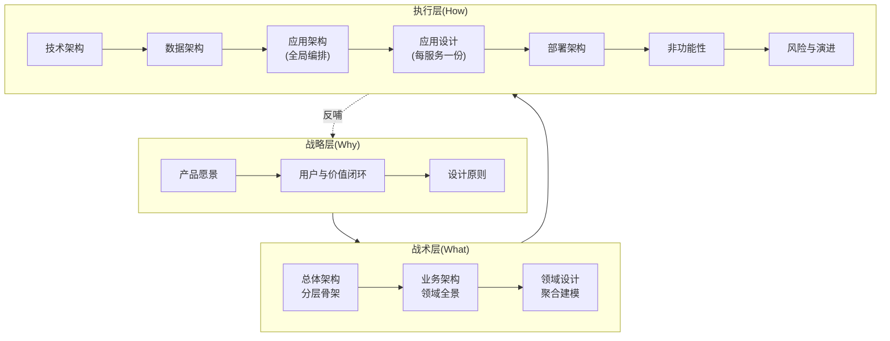
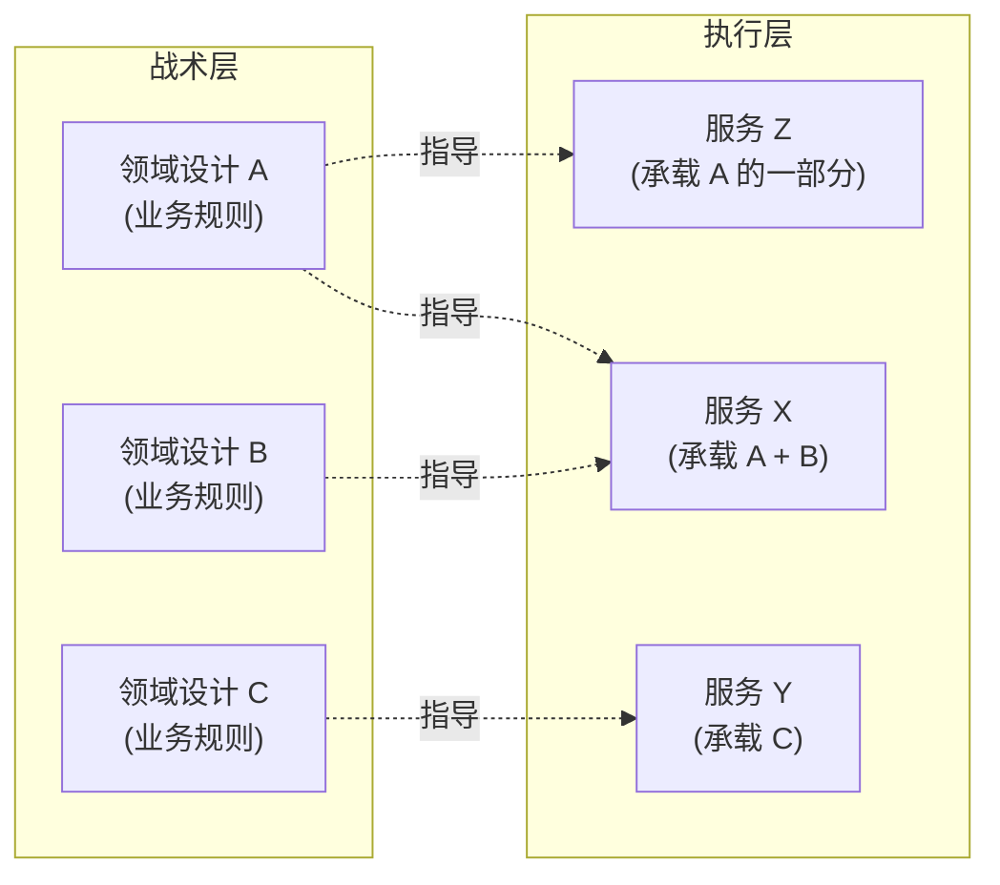

# 架构设计 SOP

> 把"怎么写一份架构设计"变成一条流水线:**3 层思考 · 2 套固定模板(领域 + 应用) · N 份可复用文档**。

## 立场

不堆砌方法论名词,只回答四件事:

> **从哪开始 · 按什么顺序写 · 每份文档要写什么 · 怎么保证不返工**

| 关键词 | 含义 |
| --- | --- |
| **业务先行** | 先理清"为什么做",再决定"怎么做" |
| **自顶向下** | 战略 → 战术 → 执行,逐层细化 |
| **图表先行** | 表格 + mermaid,先把结构画出来,再写文字 |
| **演进留口** | MVP 够用 + 扩展点留好,不追求一步到位 |

## 一图看懂



> 📐 **铁律**:每跨一层,粒度细化一个数量级,但**核心决策不能反向**。下层只能"实现"上层,不能"覆盖"上层。

## Part 1 · 思考路径(HOW to think)

> 9 步思维链,对应文档骨架的产出顺序。每步只问一个核心问题。

### Step 1:**定方向** — 我们为什么做这件事?

**输出**:战略概述文档(产品愿景、用户、价值闭环)

| 思考点 | 问自己 |
| --- | --- |
| 价值锚点 | 不做这个,谁会受影响? |
| 用户细分 | C / B / 平台三方各得到什么? |
| 业务闭环 | 价值如何从产生到回流? |

> 💡 一句话能说清"我们要解决谁的什么问题、用什么方式",才算 Step 1 通过。

### Step 2:**搭骨架** — 系统由哪些层次组成?

**输出**:总体架构文档(系统定位 / 身份体系 / 分层架构)

| 思考点 | 问自己 |
| --- | --- |
| 身份分层 | 用户、租户、运营是不是清晰隔离? |
| 分层职责 | 每层的"输入 / 输出 / 不做什么"是否明确? |
| 数据流向 | 一个请求从终端到 DB,经过哪些层? |

> 💡 画出分层架构图,**禁止跨层调用**(MVP 阶段允许虚线"直连"作为临时妥协,但必须在路线图里写明何时回正)。

### Step 3:**定能力** — 平台要对外提供哪些共享能力?

**输出**:总体架构文档(服务层详解 / 核心能力矩阵)

| 思考点 | 问自己 |
| --- | --- |
| 能力清单 | 每个能力一句话说清职责,统一编号 |
| 复用边界 | 这个能力会被几个业务复用?只用一次就不要做成共享 |
| 能力供给方 | 谁建设、谁运维、谁负责 SLA |

### Step 4:**定原则** — 哪些约束贯穿全设计?

**输出**:总体架构文档 + 业务架构文档(设计原则章节)

> 在落入具体业务前,先抽象出 **5 类原则**:

| 类型 | 例子 |
| --- | --- |
| 领域划分原则 | 按业务能力划分、限界上下文清晰、分层管理依赖 |
| 聚合建模原则 | 小聚合优先、聚合根唯一入口、ID 引用、不变式显式 |
| 身份上下文原则 | 用户与租户分离、注册与授权分离 |
| 跨域协作原则 | 事件驱动、防腐层、最终一致 |
| 安全合规原则 | RBAC + PBAC、敏感数据脱敏、关键操作审计 |

> 💡 **原则是因,实现是果**。原则定不准,后续每个决策都会摇摆。

### Step 5:**划领域** — 业务域如何拆分?

**输出**:业务架构文档(领域全景、上下文映射)

| 思考点 | 问自己 |
| --- | --- |
| 业务能力 | 每个域对应一个独立的业务能力 |
| 依赖方向 | 上层依赖下层,**绝不反向** |
| 协作方式 | 同步还是异步?共享内核还是防腐层? |

> 💡 用 **上下文映射表**(U/D、ACL、OHS、SK、SW)显式声明每条边的协作方式,避免隐式耦合。

### Step 6:**建模型** — 每个领域内部怎么组织?

**输出**:每个业务域一份领域设计文档

> 见 **Part 3 · 领域建模 10 节模板**。

### Step 7:**选工具** — 落地用什么技术?

**输出**:技术架构文档 + 数据架构文档

| 思考点 | 问自己 |
| --- | --- |
| 复用 vs 自研 | 有成熟方案就不要重造轮子 |
| 团队成本 | 团队熟悉吗?学习曲线多陡? |
| 演进成本 | MVP 用得动、3 年后还顶得住吗? |

> ⚠️ **反模式警告**:不要先选技术再倒推业务需求。技术为业务服务。

### Step 8:**落部署** — 怎么跑起来?

**输出**:应用架构文档 + 应用设计文档(每服务一份) + 部署架构文档 + 非功能性文档

| 思考点 | 问自己 |
| --- | --- |
| 服务粒度 | MVP 用单体模块化,成熟期再拆 |
| 服务内部 | 每个服务的 DDD 分层、UseCase、契约是否清晰?(应用设计 8 节) |
| 隔离级别 | 网络 / 进程 / 数据三种隔离怎么选 |
| 弹性能力 | 流量翻 10 倍,系统能扛吗? |

### Step 9:**看未来** — 风险与演进?

**输出**:风险登记文档 + 演进规划文档

| 思考点 | 问自己 |
| --- | --- |
| 已知风险 | 列清单,标注概率 × 影响 |
| 扩展点 | 每个架构决策都要有 Plan B |
| 演进路径 | MVP → 成长期 → 成熟期 的形态转换 |

## Part 2 · 文档骨架(WHAT to write)

> 架构设计文档按"战略 / 战术 / 执行"三层组织,每份文档承担一类职责。本节给出**每份文档的必填章节**,文件命名与编号约定见末尾"参考实现"。

### 文档矩阵

| 层级 | 文档 | 职责 | 关键产出 |
| --- | --- | --- | --- |
| 战略 | 总体概述 | 回答"为什么做、为谁做" | 价值闭环图 + 设计原则 |
| 战术 | 总体架构 | 描述系统骨架 | 分层架构图 + 身份体系 + 技术全景 |
| 战术 | 业务架构 | 描述领域全景 | 业务能力矩阵 + 上下文映射 |
| 战术 | 领域设计 | 单域深挖(每域一份) | 见 Part 3 · 10 节模板 |
| 执行 | 技术架构 | 技术选型理由 | 组件选型表 + ADR |
| 执行 | 数据架构 | 数据治理 | 分片 / 隔离 / 缓存 / 同步策略 |
| 执行 | 应用架构 | 全局服务编排 | 服务清单 + 调用关系 + API 网关 |
| 执行 | **应用设计**(每服务一份) | 单服务内部组织 | DDD 分层 + UseCase + 契约 |
| 执行 | 部署架构 | 物理拓扑 | 环境矩阵 + 编排配置 |
| 执行 | 非功能性 | 质量指标 | 性能 / 可用性 / 安全的量化目标 |
| 执行 | 风险与应对 | 风险登记 | 类型 / 概率 / 影响 / 应对 |
| 执行 | 演进规划 | 路线图 | 阶段目标 + 触发条件 |

### 每份文档的章节模板

#### 战略概述

| 章节 | 必填内容 | 输出形式 |
| --- | --- | --- |
| 产品愿景 | 一句话回答"我们要做什么、为谁" | 文字 |
| 战略定位 | 各方角色的差异化价值 | 对照表 |
| 背景说明 | 业务痛点 + 解决方案 + 建设目标 | 表格 |
| 目标用户与核心需求 | 用户角色 / 典型场景 / 痛点 / 价值主张 | 表格 |
| 核心业务流程 | 一张闭环图说清"价值环" | mermaid flowchart |
| 设计原则 | 5~8 条贯穿全设计的强约束 | 表格 |
| 目标读者 | 各角色关注点 | 表格 |
| 适用范围 | 包含 / 不包含的系统 | 表格 |
| 术语定义 | 业务关键词的精准定义 | 表格 |
| 监管合规 | 行业法规与对应措施 | 表格 |

> 🎯 **关键动作**:用一张闭环图把"价值如何流动"画清楚。后续设计偏离了,回来看这张图。

#### 总体架构

| 章节 | 必填内容 |
| --- | --- |
| 系统定位 | 核心价值、目标用户、市场定位 |
| **身份体系** | 多身份(如用户 / 业务主体 / 运营)分离的关系图 |
| 整体架构 | **分层架构图**(终端 → 接入 → 应用 → 服务 → 领域 → 基础设施 等典型分层) |
| 入口层 | 各类终端清单 |
| 服务层详解 | 共享能力清单 |
| 基础设施层详解 | 云原生 / 存储 / 网络 / 中间件 / 可观测性 |
| 技术全景图 | 关键技术要求 + 技术选型表 |
| 核心能力矩阵 | 能力 → 来源 → 说明 → 支撑场景 |
| SLA 分解 | 每类服务的可用性、响应时间、隔离要求 |
| 扩展点设计 | 当前实现 + 扩展方向 |
| 产品路线图 | 分阶段目标 |
| 架构约束与非功能指标 | 性能 / 可用性 / 安全约束 |
| **关键决策记录(ADR)** | ID / 决策 / 日期 / 决策人 / 上下文 / 结论 |
| 附录 | 关键概念解释、数据模型、访问控制等深度内容 |

> 🎯 **关键动作**:先定身份模型,再画分层架构图,最后用 ADR 锁定关键决策。

#### 业务架构

| 章节 | 必填内容 |
| --- | --- |
| 设计原则 | 5 类:领域划分 / 聚合建模 / 身份上下文 / 跨域协作 / 安全合规 |
| 业务能力矩阵 | 业务域 → 核心功能 → 关键指标 |
| 领域架构 | **分层依赖**(如基础支撑 / 交易支撑 / 业务场景 三层) |
| **上下文映射** | U/D、ACL、OHS、SK、SW 关系类型与协作方式 |
| 业务域说明 | 每域的依赖关系与边界说明 |

> 🎯 **关键动作**:用分层管理依赖方向,**禁止反向依赖**。

#### 领域设计(每域一份)

> 见 **Part 3 · 领域建模 10 节模板**(固定结构)。

#### 执行层文档(简表)

| 文档 | 核心内容 |
| --- | --- |
| 技术架构 | 按总体架构的技术全景细化每个组件的选型理由 |
| 数据架构 | 数据分片、租户隔离、缓存策略、数据同步 |
| 应用架构 | 服务清单、调用关系、API 网关路由 |
| **应用设计**(每服务一份) | 见 **Part 4 · 应用设计 8 节模板** |
| 部署架构 | 环境拓扑、容器编排、节点亲和性 |
| 非功能性 | 性能 / 可用性 / 安全 / 可观测性具体指标 |
| 风险与应对 | 风险登记表(类型 / 概率 / 影响 / 应对) |
| 演进规划 | 路线图,每阶段的架构形态 |

### 参考实现:文件命名与编号约定

> 以下为**推荐实践**,非方法论本体。团队可按自身规范调整。

```text
0x01_总体概述.md         (战略层)
0x10_总体架构设计.md      (战术层 · 分层骨架)
0x20_业务架构设计.md      (战术层 · 领域全景)
0x2X_XX域领域设计.md      (战术层 · 单域,每域一份)
0x30_技术架构设计.md      (执行层 · 技术选型)
0x40_数据架构设计.md      (执行层 · 数据治理)
0x50_应用架构设计.md      (执行层 · 全局服务编排)
0x5X_XX服务应用设计.md    (执行层 · 单服务,每服务一份)
0x60_部署架构设计.md      (执行层 · 物理拓扑)
0x70_非功能性设计.md      (执行层 · SLA/性能/安全)
0x80_风险与应对措施.md    (执行层 · 风险登记)
0x90_架构演进规划.md      (执行层 · 路线图)
0xF1_附录.md              (参考资料)
```

**约定理由**:
- 编号留间隔(0x10/0x20),方便插入子文档(0x11/0x21)
- 战术层 0x2X 段保留给"每域一份"领域设计,易于横向扩展
- 执行层 0x5X 段保留给"每服务一份"应用设计,与领域设计形成对称
- 0xFX 段保留给附录与参考资料,与正文区分

## Part 3 · 领域建模 10 节模板(HOW to model)

> 每份领域设计文档**固定使用以下 10 节结构**。结构强约束 = 团队对齐 + AI 可生成。

### 📑 章节顺序与产出

| # | 章节 | 核心问题 | 必填产出 |
| --- | --- | --- | --- |
| 1 | **子域划分** | 这个域内部分几个子域? | 表格 + mermaid 子域关系图 + 建模决策说明 |
| 2 | **聚合识别** | 每个子域内有哪些聚合? | 聚合 / 聚合根 / 包含实体 / 一致性边界 表格 |
| 3 | **聚合详细类图** | 聚合内的结构长什么样? | 每个聚合一张 mermaid classDiagram |
| 4 | **值对象清单** | 域内有哪些不可变值对象? | 值对象 / 类型 / 枚举值 / 说明 表格 |
| 5 | **聚合不变式** | 业务规则护栏有哪些? | 聚合 / 不变式 / 说明 表格(必须显式枚举) |
| 6 | **聚合间引用** | 跨聚合如何关联? | 引用方 / 被引用方 / 引用方式(ID 引用) 表格 |
| 7 | **状态机** | 关键实体有哪些状态流转? | 每个状态机一张 mermaid stateDiagram |
| 8 | **领域服务** | 哪些操作需要协调多个聚合? | 服务名 / 方法 / 职责 / 涉及聚合 表格 |
| 9 | **领域事件** | 状态变更后通知谁? | 事件名(过去时) / 触发聚合 / 触发时机 / 主要消费方 / 事件载荷 表格 |
| 10 | **仓储接口** | 数据如何持久化? | 每聚合一个仓储,只暴露聚合根方法 |

### 🔒 10 条强约束

| # | 约束 | 反例 |
| --- | --- | --- |
| 1 | 子域内识别聚合,**聚合根唯一入口** | 外部直接访问聚合内实体 |
| 2 | 聚合间用 **ID 引用**,不用对象引用 | `Order` 持有 `User` 对象 |
| 3 | **小聚合优先**,只在事务一致性要求下合并 | 把"订单 + 商品 + 库存"塞进一个聚合 |
| 4 | 值对象**不可变**,变更通过替换实现 | Setter 修改值对象字段 |
| 5 | 显式声明**不变式**,由聚合根强制保障 | 不变式散落在 Service 里 |
| 6 | 仓储**只暴露聚合根** | Repository 暴露内部实体 |
| 7 | 跨聚合协作走**领域事件 + 领域服务** | 聚合直接调用其他仓储 |
| 8 | 事件名用**过去时**(`OrderCreated`) | `CreateOrderEvent` |
| 9 | 状态机**显式建模**,禁止隐式状态判断 | 散落的 `if (status == "X")` |
| 10 | 敏感数据在聚合内提供**脱敏方法** | `getPhone()` 返回明文 |

### 🎨 mermaid 图表速查

| 场景 | 图表类型 | 用法 |
| --- | --- | --- |
| 子域 / 业务域关系 | `graph LR / TD` | 体现依赖方向 |
| 聚合详细结构 | `classDiagram` | 聚合根 / 实体 / 值对象 + 关系 |
| 状态流转 | `stateDiagram-v2` | 实体生命周期 |
| 跨域协作流程 | `sequenceDiagram` | 多服务时序协作 |
| 数据模型 | `erDiagram` | 多租户表关系 |
| 业务闭环 | `flowchart TD` | 价值流动、用户旅程 |

## Part 4 · 应用设计 8 节模板(HOW to build a service)

> 每个微服务**固定使用以下 8 节结构**,与 Part 3 领域建模形成对照:
> - 领域设计(Part 3)按**业务域**切分,关注"业务规则"
> - 应用设计(Part 4)按**微服务**切分,关注"工程落地"

> 📌 **领域 ↔ 服务 是多对多关系**:一个服务可承载多个领域(如基础服务聚合用户域 + 租户域),一个领域也可拆到多个服务(如订单域拆为下单服务 + 履约服务)。应用设计在「领域承载」章节明确声明本服务覆盖的领域范围。

### 📑 章节顺序与产出

| # | 章节 | 核心问题 | 必填产出 |
| --- | --- | --- | --- |
| 1 | **服务定位** | 这个服务做什么、不做什么? | 职责清单 + 归属团队 + SLA 目标 |
| 2 | **领域承载** | 本服务覆盖哪些领域 / 聚合? | 领域 → 聚合清单(标注与其他服务的边界) |
| 3 | **DDD 分层** | 代码结构怎么组织? | bootstrap / interfaces / application / domain / infrastructure / common 各层职责说明 |
| 4 | **UseCase 编排** | 关键用例怎么实现? | 用例 → 应用服务 → 领域服务 / 聚合调用 → 事务边界 |
| 5 | **接口契约** | 对外怎么暴露? | REST/RPC API + 消息订阅 / 发布 + 错误码 + 版本策略 |
| 6 | **依赖关系** | 与谁交互、如何交互? | 上下游服务清单 + 同步 / 异步 / 事件 协作方式 |
| 7 | **数据视图** | 数据如何存取? | 主从库划分 + 缓存策略 + 跨服务数据获取方式(查询 / 事件投影) |
| 8 | **可观测性** | 怎么知道服务健康? | 关键埋点 + 链路追踪点 + 健康检查 + 告警阈值 |

### 🔒 强约束

| # | 约束 | 反例 |
| --- | --- | --- |
| 1 | **服务定位明确**,职责单一 | 一个服务塞 10 个不相关的业务 |
| 2 | **领域承载显式声明**,跨服务边界不模糊 | 多个服务都声称负责"订单",边界不清 |
| 3 | **分层依赖单向**,domain 零框架依赖 | application 跨过 domain 直调 infrastructure |
| 4 | UseCase **事务边界显式标注**(本地事务 / 分布式事务 / 最终一致) | 一个 UseCase 横跨多个聚合不说明事务策略 |
| 5 | 对外契约**版本化**,变更走废弃流程 | 直接修改线上接口签名 |
| 6 | 异步依赖**幂等处理** | 消费方收到重复消息直接重复执行 |
| 7 | 跨服务**禁止直连他人数据库** | 通过 JDBC 跨服务读取库表 |
| 8 | 关键路径**必埋点 + 必告警** | 核心接口失败无监控,事故才发现 |

### 与领域设计的协作



> 💡 应用设计的「领域承载」章节就是这张图在单服务视角的具体描述。

## Part 5 · 贯穿全程的方法论特征

| 特征 | 体现 |
| --- | --- |
| **DDD 全栈** | 子域→聚合→实体→值对象,限界上下文 + 上下文映射 |
| **多租户优先** | 多身份分离、租户上下文透传、策略引擎统一拦截、隔离能力可演进 |
| **契约驱动** | 服务层共享能力 + 接口契约前置,编译期或工具链保证一致 |
| **事件驱动** | 领域事件解耦跨域协作,异步通信优先于同步 RPC |
| **图表先行** | 每节配 mermaid,先画后写 |
| **表格化表达** | 决策、原则、清单、对比全部表格化 |
| **可扩展插槽** | ADR 留扩展点 + 抽象基类支持垂直业务可插拔 |
| **演进式架构** | 隔离方式从逻辑 → 读写分离 → 物理 逐级演进,不一步到位 |

## Part 6 · 检查清单(Self-Review)

> 写完一份架构设计,逐条对照。任何一条 ❌ 都不允许进入下一步。

### 战略层

- [ ] 战略概述有一张清晰的价值闭环 mermaid 图
- [ ] 设计原则 ≤ 8 条,每条都能在后续找到对应实现
- [ ] 术语表覆盖跨团队沟通的关键词

### 战术层

- [ ] 分层架构图清晰,每层职责无歧义
- [ ] 身份体系图区分了不同主体(用户 / 业务主体 / 运营)
- [ ] 每个跨域调用都在上下文映射表里能找到对应的关系类型
- [ ] 业务域依赖方向单向,没有反向依赖

### 领域层(每域逐一检查)

- [ ] 10 节齐全
- [ ] 每个聚合都有 classDiagram
- [ ] 每个聚合都有 ≥ 1 条显式不变式
- [ ] 跨聚合**没有对象引用**,只有 ID 引用
- [ ] 所有状态变更都有对应的领域事件(过去时命名)
- [ ] 仓储只暴露聚合根

### 执行层

- [ ] 技术架构:每个技术选型都有"为什么是它、为什么不是别的"
- [ ] 数据架构:分片 / 隔离 / 缓存 / 同步 策略齐全,且标注触发条件
- [ ] 应用架构:服务清单与调用关系图清晰,网关路由有版本策略
- [ ] **应用设计:每个微服务一份,8 节齐全,领域承载范围明确**
- [ ] 部署架构:环境拓扑区分 dev / staging / prod,标注资源规格
- [ ] 非功能性:指标可量化(P99 < 200ms,不是"快")
- [ ] 风险与应对:登记表覆盖技术 / 业务 / 合规三类
- [ ] 演进规划:路线图有明确的触发条件(如 QPS > X 升级)

## Part 7 · 反模式警告

| 反模式 | 症状 | 纠正 |
| --- | --- | --- |
| **技术驱动** | 文档前几节都在讲微服务、容器、服务网格 | 回到 Step 1,先讲业务价值 |
| **大聚合** | 一个聚合根 30+ 字段、5+ 子实体 | 拆分,只保留事务一致的部分 |
| **隐式耦合** | 聚合 A 的 Service 里直接 new B / 直连其他仓储 | 改成领域事件 + ID 引用 |
| **状态散落** | `if (status == "X" && type == "Y" && ...)` 满代码飞 | 建状态机,集中收口 |
| **文档与代码割裂** | 类图画了 5 个聚合,代码只有 3 个 | 文档与代码同步评审,PR 必须同步更新 |
| **一步到位** | MVP 阶段就上全套云原生 + 分布式数据治理 | 按演进路径分阶段引入 |
| **决策不留档** | 半年后没人记得为什么这么选 | 每个关键决策写 ADR(ID / 决策 / 上下文 / 结论) |

## 一句话总结

> **战略定方向 · 战术搭骨架 · 业务划领域 · 领域建模型 · 应用落服务 · 执行配工具**
>
> 9 步走通,3 层文档齐备,**领域 10 节 + 应用 8 节** 两套模板复用 —— 架构设计就有了流水线。

> **延伸阅读**
>
> - [架构设计哲学](../0x01_哲学理念/0x01_架构设计哲学.md) —— SOP 背后的"道"
> - [架构设计入门指南](./0xA1_架构设计入门指南.md) —— 与本 SOP 互补的"心法"
> - [DDD + 多租户架构模式](../0xB0_实践模式/0xB1_DDD多租户架构模式.md) —— 10 节模板背后的工程模式
> - [团队协作开发指南](./0xA3_团队协作开发指南.md) —— DDD + TDD + SDD 怎么协同
