# OpenCode K8S 集群部署指南

> **阅读对象**:AI 平台工程师、Kubernetes 运维工程师、Agent 平台架构师
> **前置阅读**:[人机协同开发流程](./0xA2_人机协同开发流程.md) · [团队协作落地手册](./0xA3_团队协作落地手册.md)

## 1. 背景与目标

### 1.1 方案目标

解决 OpenCode 1.14.50 在 K8s 多 Pod 部署时，会话跨 Pod 访问返回 404 的问题。核心通过全局插件、MySQL、Kafka、本地 SQLite 协同，实现会话全局统一、跨 Pod 同步，不修改 OpenCode 内核。

### 1.2 核心问题

| 序号 | 问题 | 说明 |
|------|------|------|
| 1 | 多实例一致性问题 | OpenCode 官方单进程客户端模式，K8s 多 Pod 部署存在多实例一致性风险 |
| 2 | 会话跨 Pod 404/400 | `POST /sessions` 在 Pod-A 创建，`POST /sessions/{id}/messages` 路由至 Pod-B 返回 404。解决方案：Ingress 开启会话粘连 |
| 3 | SQLite 不落盘 | 通过 `OPENCODE_DB=:memory:` 环境变量让 SQLite 使用内存模式，不写文件，避免 Pod 间文件锁冲突 |
| 4 | OpenCode 原生事件 API 不支持跨 Pod | `/global/event` 是单进程内事件流，各 Pod 只能订阅自己内核的事件。解决方案：自研消息总线服务（给前端用），通过 SSE 推送给前端集群全局消息 |
| 5 | 前端无法获取集群全局消息 | 前端连接 `/global/event` 只能收到当前 Pod 的事件。解决方案：前端连接消息总线服务的 SSE 接口 |
| 6 | 同步会话上下文 | 解决 404 不够，跨 Pod 会话还存在上下文丢失问题，处理消息前需完成历史消息同步 |

### 1.3 核心约束
- **不改 opencode 内核**：通过全局插件监听事件，透明实现数据同步
- **只通过 plugins 扩展**：插件代码通过 ConfigMap 统一挂载
- **MySQL 全局主库**：持久化所有会话数据
- **Kafka 事件广播**：跨 Pod 实时同步
- **SQLite 内存模式**：`OPENCODE_DB=:memory:` 让 SQLite 不落盘，各 Pod 本地缓存通过 Kafka 同步恢复
- **智能体配置（Skills）**：配置在 workdir 的 `.opencode/` 目录下，通过 NFS + PVC 挂载
- **消息同步插件**：配置在 OpenCode 全局配置目录 `~/.config/opencode/`，通过 NFS + PVC 挂载（**只有全局插件才能在 `opencode serve` 模式下生效**）
- **OpenCode 启动方式**：`opencode serve --host 0.0.0.0 --port 4096`

### 1.4 预期收益
- **会话全局统一**：MySQL 作为全局主库，所有 Pod 共享同一份会话数据
- **跨 Pod 无 404**：任意 Pod 都可通过 Kafka 同步获取完整会话
- **弹性扩展**：K8s HPA 动态调整实例数，新 Pod 启动时自动同步历史数据
- **快速构建智能体**：不修改内核，通过 plugins/skills/agents 快速搭建 AI 应用

## 2. 架构设计

### 2.1 技术选型
- **OpenCode**：1.14.50
- **部署环境**：Kubernetes
- **数据库**：MySQL（全局主库）、SQLite（各 Pod 本地库）
- **消息队列**：Kafka（事件广播）

### 2.2 整体架构

#### 2.2.1 架构设计决策

| 决策项 | 选择 | 原因 |
|-----|------|-----|
| 本地存储 | SQLite 内存模式 | 不写文件，Pod 重启后数据丢失，由 MySQL 持久化兜底 |
| 事件总线 | Kafka | 所有事件统一走 Kafka 生产/消费，解决跨 Pod 事件同步 |
| 前端消息 | Message Bus | 解决 `/global/event` 单进程无法获取集群全局消息的问题 |
| 会话路由 | Ingress Cookie 粘链 | 确保用户请求路由到同一 Pod |

#### 2.2.2 整体架构图

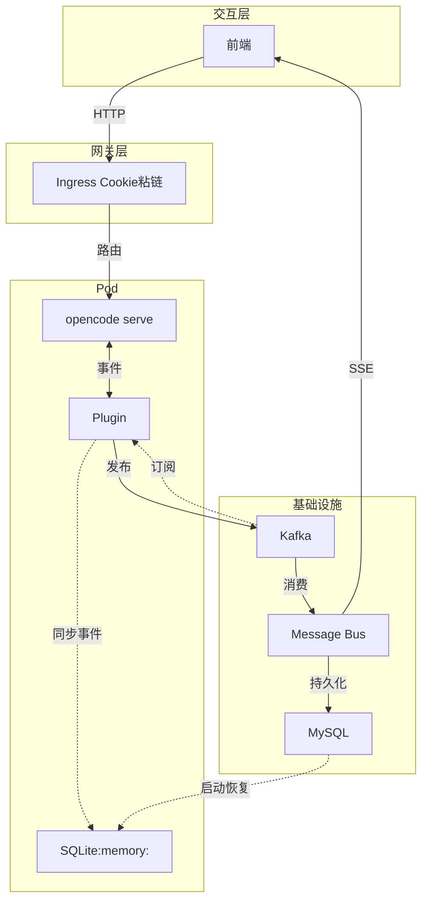

#### 2.2.3 分层说明

| 层级 | 组件 | 说明 |
|-----|------|-----|
| 交互层 | 前端 | 连接 Message Bus SSE 接口，获取集群全局事件 |
| 网关层 | Ingress | Cookie 粘链，确保会话路由到同一 Pod |
| 服务层 | OpenCode 服务 | opencode serve + Plugin + SQLite（内存模式） |
| 基础设施 | MySQL | 全局持久化主库 |
| 基础设施 | Kafka | 事件总线，所有事件统一生产/消费 |

#### 2.2.4 核心设计说明

**(1) OpenCode 事件系统**

| 组件 | 源码位置 | 说明 |
|-----|---------|------|
| SyncEvent | `packages/opencode/src/sync/index.ts` | 事件发布/订阅系统 |
| projector | 各模块定义 | 将事件写入本地 SQLite |
| Bus.subscribeAll() | `packages/opencode/src/plugin/index.ts` | 订阅所有事件，Plugin 通过 hook["event"] 接收 |
| GlobalBus | `packages/opencode/src/bus/global.ts` | 本地 EventEmitter，不跨 Pod |
| event-v2-bridge | `packages/opencode/src/event-v2-bridge.ts` | EventV2 → SyncEvent 桥接（内部使用） |

**(2) 事件流转链路（Pod 内）**

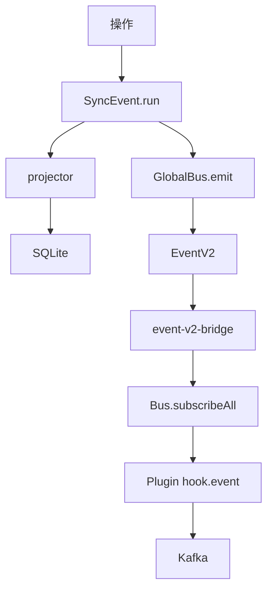

**(3) 跨 Pod 同步流程**

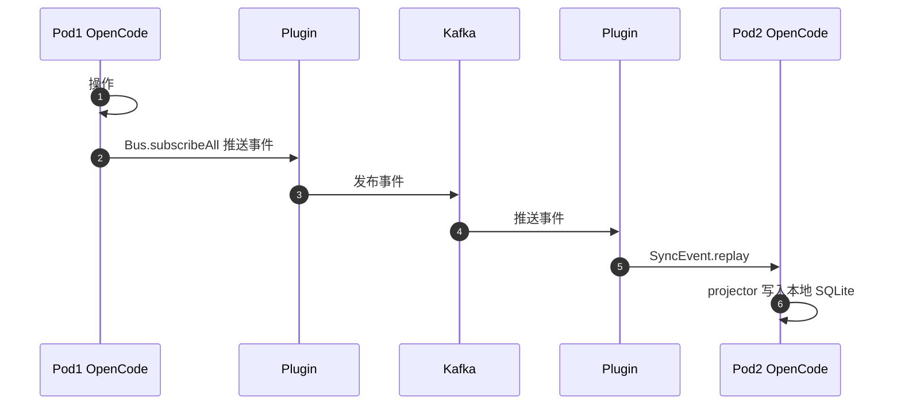

**(4) `/global/event` 局限性**

| 问题 | 说明 |
|-----|------|
| 作用域 | `/global/event` 是**单进程内**的事件流 |
| 跨 Pod | 前端连接 Pod-A 只能收到 Pod-A 的事件 |
| 解决方案 | Message Bus 消费 Kafka，SSE 推送给前端 |

**(5) Plugin 监听方式（源码查证）**

> **配置依据：** `packages/opencode/src/plugin/index.ts`
> ```typescript
> yield* bus.subscribeAll().pipe(
>   Stream.runForEach((input) =>
>     Effect.sync(() => {
>       for (const hook of hooks) {
>         void hook["event"]?.({ event: input })  // Plugin 通过 hook["event"] 接收
>       }
>     }),
>   ),
> )
> ```

| 功能 | 说明 |
|-----|------|
| 监听 | 通过 `Bus.subscribeAll()` 订阅，Plugin 通过 `hook["event"]` 回调接收 |
| 发布 | 将事件发布到 Kafka |
| 消费 | 消费 Kafka 事件，调用 `SyncEvent.replay()` 重放到本地 SQLite |

### 2.3 组件分工

| 组件 | 职责 | 说明 |
|------|------|------|
| OpenCode Pod | 运行 OpenCode，端口 4096 | 本地 SQLite **内存模式**（`OPENCODE_DB=:memory:`），不写文件 |
| Plugin | 监听本 Pod 内核事件，发送到消息总线 | 事件同步 |
| Message Bus | **消息总线服务**（给前端用） | 接收所有 Pod 事件，通过 SSE 推送给**前端**，解决 `/global/event` 单进程无法获取集群全局消息的问题 |
| MySQL | 全局会话主库 | **持久化所有会话数据**，Pod 启动时从中恢复 |
| Kafka | 事件消息队列 | 解耦各 Pod 事件消费 |
| Nginx Ingress | L7 Cookie 粘链 | 优先路由同一用户请求至同一 Pod |

### 2.4 网络架构

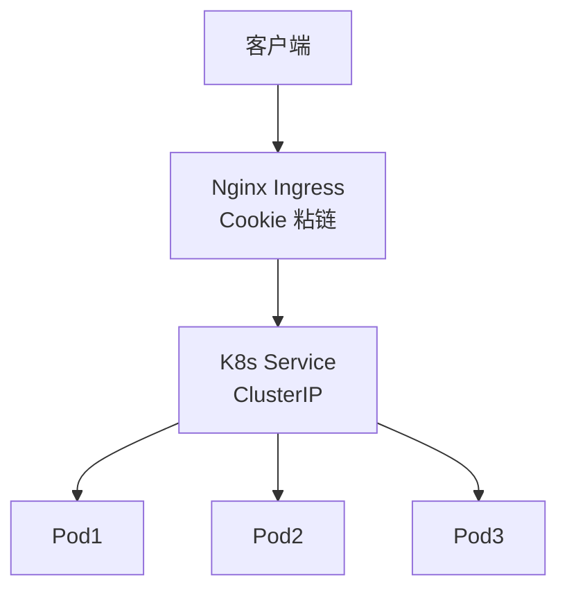

**说明：**
- Ingress 层实现会话粘连（基于 Cookie，确保同一会话请求路由到同一 Pod）
- Svc 不启用 IPVS，保持简单路由（会话粘性由 Ingress 层保证）
- Pod 为最小调度单元（每个 Pod 运行独立 opencode 实例 + 本地 SQLite + 全局插件）

## 3. 数据存储设计

> **说明：** OpenCode SQLite 表结构为**内核内置**，以下仅作参考。

### 3.1 SQLite 本地会话表（内置）

| 表名 | 源码位置 | 说明 |
|-----|---------|------|
| `session` | `packages/opencode/src/session/session.sql.ts` | 会话主表 |
| `message` | 同上 | 消息表 |
| `part` | 同上 | 消息内容片段 |
| `todo` | 同上 | 待办事项 |
| `session_message` | 同上 | 会话消息关联 |
| `event_sequence` | `packages/opencode/src/sync/event.sql.ts` | 事件序列号 |
| `event` | 同上 | 事件详情 |

**核心表结构（仅作参考）：**

```sql
-- 会话表（session）
CREATE TABLE session (
    id TEXT PRIMARY KEY,
    project_id TEXT NOT NULL,
    title TEXT NOT NULL,
    version TEXT NOT NULL,
    cost REAL DEFAULT 0,
    tokens_input INTEGER DEFAULT 0,
    tokens_output INTEGER DEFAULT 0,
    tokens_reasoning INTEGER DEFAULT 0,
    tokens_cache_read INTEGER DEFAULT 0,
    tokens_cache_write INTEGER DEFAULT 0,
    time_created INTEGER NOT NULL,
    time_updated INTEGER NOT NULL,
    time_compacting INTEGER,
    time_archived INTEGER
);

-- 消息表（message）
CREATE TABLE message (
    id TEXT PRIMARY KEY,
    session_id TEXT NOT NULL,
    time_created INTEGER NOT NULL,
    time_updated INTEGER NOT NULL,
    data TEXT NOT NULL  -- JSON 格式
);

-- 事件序列表（event_sequence）
CREATE TABLE event_sequence (
    aggregate_id TEXT PRIMARY KEY,
    seq INTEGER NOT NULL,
    owner_id TEXT
);

-- 事件表（event）
CREATE TABLE event (
    id TEXT PRIMARY KEY,
    aggregate_id TEXT NOT NULL,
    seq INTEGER NOT NULL,
    type TEXT NOT NULL,
    data TEXT NOT NULL  -- JSON 格式
);
```

### 3.2 MySQL 全局会话表

> **用途：** 持久化所有会话数据，支持 Pod 启动时全量恢复本地 SQLite。

```sql
-- 会话主表（session）
CREATE TABLE session (
    id VARCHAR(36) PRIMARY KEY COMMENT '会话ID',
    project_id VARCHAR(36) NOT NULL COMMENT '项目ID',
    workspace_id VARCHAR(36) COMMENT '工作空间ID',
    parent_id VARCHAR(36) COMMENT '父会话ID',
    slug VARCHAR(255) NOT NULL COMMENT '会话 slug',
    directory VARCHAR(1024) NOT NULL COMMENT '工作目录',
    path VARCHAR(1024) COMMENT '子路径',
    title VARCHAR(255) NOT NULL COMMENT '会话标题',
    version VARCHAR(50) NOT NULL COMMENT 'OpenCode 版本',
    share_url VARCHAR(512) COMMENT '分享链接',
    summary_additions INT COMMENT '变更增加行数',
    summary_deletions INT COMMENT '变更删除行数',
    summary_files INT COMMENT '变更文件数',
    summary_diffs JSON COMMENT '文件 diff',
    cost DECIMAL(10,6) DEFAULT 0 COMMENT '费用',
    tokens_input BIGINT DEFAULT 0 COMMENT '输入 token 数',
    tokens_output BIGINT DEFAULT 0 COMMENT '输出 token 数',
    tokens_reasoning BIGINT DEFAULT 0 COMMENT '推理 token 数',
    tokens_cache_read BIGINT DEFAULT 0 COMMENT '缓存读取 token',
    tokens_cache_write BIGINT DEFAULT 0 COMMENT '缓存写入 token',
    agent VARCHAR(100) COMMENT 'Agent 类型',
    model JSON COMMENT '模型信息',
    permission JSON COMMENT '权限规则',
    revert JSON COMMENT '回滚信息',
    time_created BIGINT NOT NULL COMMENT '创建时间戳',
    time_updated BIGINT NOT NULL COMMENT '更新时间戳',
    time_compacting BIGINT COMMENT '压缩时间戳',
    time_archived BIGINT COMMENT '归档时间戳',
    INDEX idx_project (project_id),
    INDEX idx_workspace (workspace_id),
    INDEX idx_parent (parent_id),
    INDEX idx_updated (time_updated)
) ENGINE=InnoDB DEFAULT CHARSET=utf8mb4;

-- 消息表（message）
CREATE TABLE message (
    id VARCHAR(36) PRIMARY KEY COMMENT '消息ID',
    session_id VARCHAR(36) NOT NULL COMMENT '会话ID',
    time_created BIGINT NOT NULL COMMENT '创建时间戳',
    time_updated BIGINT NOT NULL COMMENT '更新时间戳',
    data JSON NOT NULL COMMENT '消息数据',
    INDEX idx_session_time (session_id, time_created, id)
) ENGINE=InnoDB DEFAULT CHARSET=utf8mb4;

-- 消息片段表（part）
CREATE TABLE part (
    id VARCHAR(36) PRIMARY KEY COMMENT '片段ID',
    message_id VARCHAR(36) NOT NULL COMMENT '消息ID',
    session_id VARCHAR(36) NOT NULL COMMENT '会话ID',
    time_created BIGINT NOT NULL COMMENT '创建时间戳',
    time_updated BIGINT NOT NULL COMMENT '更新时间戳',
    data JSON NOT NULL COMMENT '片段数据',
    INDEX idx_message (message_id, id),
    INDEX idx_session (session_id)
) ENGINE=InnoDB DEFAULT CHARSET=utf8mb4;

-- 事件序列表（event_sequence）
CREATE TABLE event_sequence (
    aggregate_id VARCHAR(36) PRIMARY KEY COMMENT '聚合ID（如 session_id）',
    seq BIGINT NOT NULL COMMENT '序列号',
    owner_id VARCHAR(36) COMMENT '所有者ID'
) ENGINE=InnoDB DEFAULT CHARSET=utf8mb4;

-- 事件表（event）
CREATE TABLE event (
    id VARCHAR(36) PRIMARY KEY COMMENT '事件ID',
    aggregate_id VARCHAR(36) NOT NULL COMMENT '聚合ID',
    seq BIGINT NOT NULL COMMENT '序列号',
    type VARCHAR(100) NOT NULL COMMENT '事件类型',
    data JSON NOT NULL COMMENT '事件数据',
    INDEX idx_aggregate (aggregate_id),
    INDEX idx_type (type)
) ENGINE=InnoDB DEFAULT CHARSET=utf8mb4;

-- 待办表（todo）
CREATE TABLE todo (
    session_id VARCHAR(36) NOT NULL COMMENT '会话ID',
    position INT NOT NULL COMMENT '位置',
    content TEXT NOT NULL COMMENT '待办内容',
    status VARCHAR(20) NOT NULL COMMENT '状态',
    priority VARCHAR(20) NOT NULL COMMENT '优先级',
    time_created BIGINT NOT NULL COMMENT '创建时间戳',
    time_updated BIGINT NOT NULL COMMENT '更新时间戳',
    PRIMARY KEY (session_id, position),
    INDEX idx_session (session_id)
) ENGINE=InnoDB DEFAULT CHARSET=utf8mb4;

-- 会话消息关联表（session_message）
CREATE TABLE session_message (
    id VARCHAR(36) PRIMARY KEY COMMENT 'ID',
    session_id VARCHAR(36) NOT NULL COMMENT '会话ID',
    type VARCHAR(50) NOT NULL COMMENT '消息类型',
    time_created BIGINT NOT NULL COMMENT '创建时间戳',
    time_updated BIGINT NOT NULL COMMENT '更新时间戳',
    data JSON NOT NULL COMMENT '消息数据',
    INDEX idx_session (session_id),
    INDEX idx_session_type (session_id, type)
) ENGINE=InnoDB DEFAULT CHARSET=utf8mb4;
```

**恢复流程：** Pod 启动 → 从 MySQL 读取 `event` 表 → 按 session 分组构建 SerializedEvent[] → 调用 `SyncEvent.replayAll()` 按 session 逐个恢复到本地 SQLite

> **说明：** `SyncEvent.replayAll()` 要求事件数组必须属于同一 aggregateID（session），且序列连续。

### 3.3 存储路径

| 路径 | 说明 | 持久化方式 |
|------|------|-----------|
| `~/.config/opencode/opencode.db` | SQLite 本地会话库（**内存模式**） | `OPENCODE_DB=:memory:` 环境变量配置，不写文件 |
| `~/.config/opencode/plugins/` | 全局插件目录 | ConfigMap 挂载 |
| `./.opencode/` | 项目级配置 | ConfigMap 挂载 |

### 3.4 SQLite 内存模式配置

**配置依据（源码查证）：**

`packages/core/src/flag/flag.ts`：
```typescript
OPENCODE_DB: process.env["OPENCODE_DB"]
```

`packages/opencode/src/storage/db.ts`：
```typescript
if (Flag.OPENCODE_DB === ":memory:" || path.isAbsolute(Flag.OPENCODE_DB)) 
    return Flag.OPENCODE_DB  // 使用内存 SQLite
```

**配置说明：**
- `OPENCODE_DB=:memory:` 启用内存模式，SQLite 数据**不落盘**
- Pod 重启后本地数据丢失，由 MySQL 持久化兜底
- Pod 启动时从 MySQL 全量恢复会话数据

## 4. 核心流程

### 4.1 会话创建流程

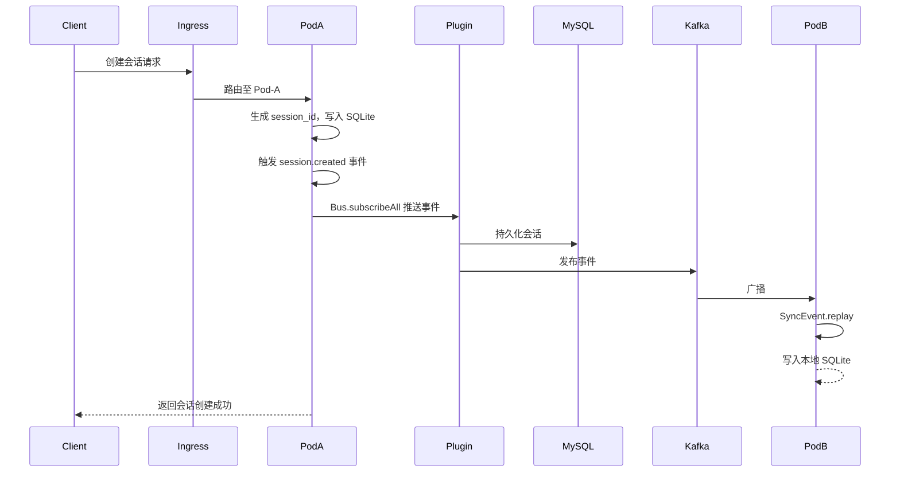

**详细步骤：**

1. 客户端发起创建会话请求，经 Ingress 路由至某 Pod（记为 Pod-A）
2. Pod-A 内核生成唯一 `session_id`，写入本地 SQLite 的 `session` 表
3. 内核触发事件，Bus.subscribeAll() 推送事件给 Plugin
4. Plugin 将会话数据持久化到 MySQL（幂等）
5. Plugin 将事件发布到 Kafka
6. 其他 Pod 的 Plugin 消费 Kafka，调用 `SyncEvent.replay()` 写入本地 SQLite

### 4.2 会话更新流程

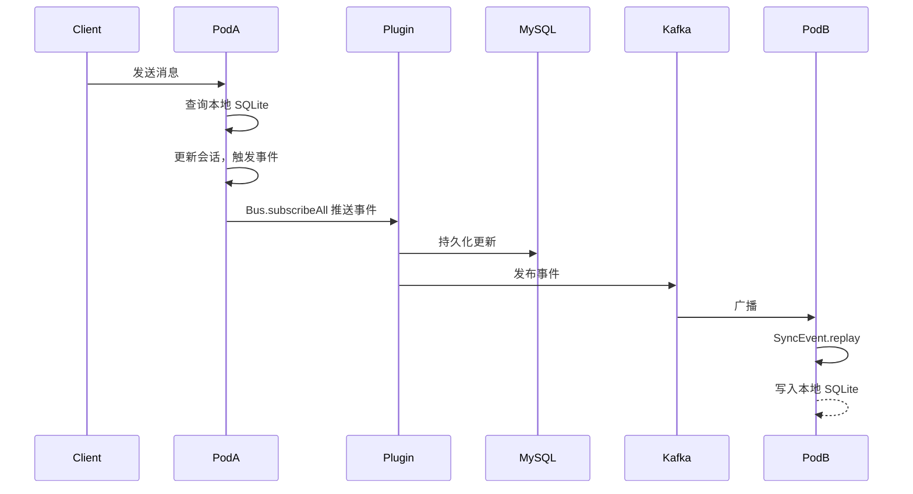

**详细步骤：**

1. 客户端发送消息，请求路由至某 Pod
2. Pod 内核查询本地 SQLite，正常处理
3. 内核更新会话，触发事件，Bus.subscribeAll() 推送事件给 Plugin
4. Plugin 更新 MySQL（幂等），发布到 Kafka
5. 其他 Pod 的 Plugin 消费 Kafka，调用 `SyncEvent.replay()` 同步本地 SQLite

### 4.3 会话跨 Pod 访问流程

**场景：** Ingress 粘链异常，路由至未创建会话的 Pod

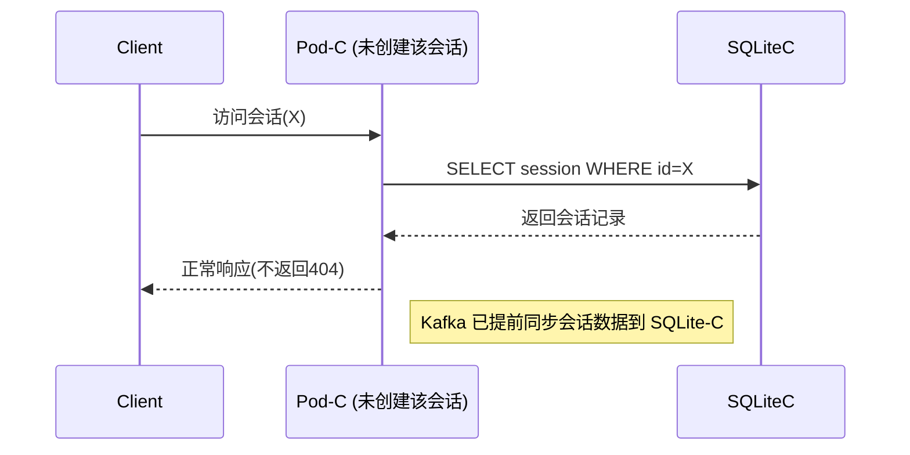

**结果：** 所有 Pod 本地 SQLite 均存在该会话记录，跨 Pod 访问不返回 404。

### 4.4 会话销毁流程

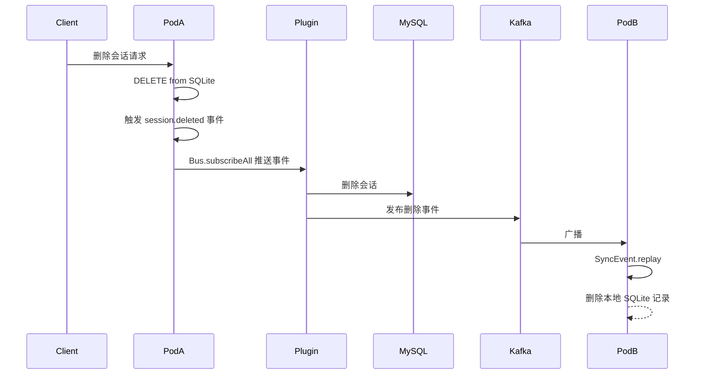

**详细步骤：**

1. 客户端删除会话，请求路由至某 Pod
2. 内核删除本地 SQLite 记录，触发事件，Bus.subscribeAll() 推送事件给 Plugin
3. Plugin 删除 MySQL 记录，发布到 Kafka
4. 其他 Pod 的 Plugin 消费 Kafka，调用 `SyncEvent.replay()` 删除本地 SQLite 记录

## 5. 全局插件核心逻辑

### 5.1 插件路径

`~/.config/opencode/plugins/session-sync/`（K8s 中通过 ConfigMap 统一挂载）

### 5.2 插件核心能力

> **配置依据（源码查证）：**
> 
> `packages/opencode/src/plugin/index.ts` - Plugin 加载逻辑：
> ```typescript
> yield* bus.subscribeAll().pipe(
>   Stream.runForEach((input) =>
>     Effect.sync(() => {
>       for (const hook of hooks) {
>         void hook["event"]?.({ event: input })  // V1 插件通过此方式监听
>       }
>     }),
>   ),
> )
> ```

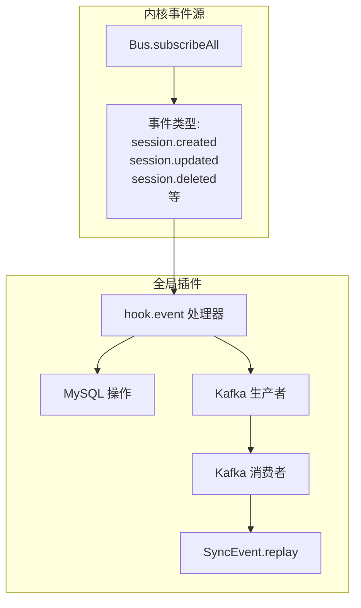

**插件核心能力：**

| 能力 | 说明 | 源码依据 |
|------|------|---------|
| 事件监听 | 通过 `Bus.subscribeAll()` 监听所有事件，Plugin 的 `hook["event"]` 接收 | `packages/opencode/src/plugin/index.ts` |
| MySQL 操作 | 事件触发后执行全局主库增/删/改操作（幂等） | 插件自定义实现 |
| Kafka 广播 | 操作完成后发送事件至 Kafka Topic 广播 | 插件自定义实现 |
| 消费同步 | 消费 Kafka 事件，调用 `SyncEvent.replay()` 同步本地 SQLite | `packages/opencode/src/sync/index.ts` |

### 5.3 插件关键约束

- **仅操作 MySQL 和本地 SQLite**：不调用 OpenCode SDK 的 createSession 接口（避免生成新 session_id）
- **幂等操作**：所有写入操作均先查后写，避免重复数据
- **只读本地 SQLite**：不修改内核只读库，通过事件触发间接同步

### 5.4 插件配置

```yaml
# 插件配置 config.yaml
plugin:
  name: session-sync
  version: "1.0.0"
  
mysql:
  host: ${MYSQL_HOST}
  port: ${MYSQL_PORT}
  database: opencode
  username: ${MYSQL_USER}
  password: ${MYSQL_PASSWORD}
  pool:
    min: 2
    max: 10

kafka:
  brokers:
    - ${KAFKA_BROKER_1}
    - ${KAFKA_BROKER_2}
  topic: opencode-session-events
  consumer:
    group_id: opencode-sync-group
    auto_offset_reset: earliest
  producer:
    acks: all
    retries: 3

sync:
  batch_size: 100
  flush_interval_ms: 1000
  retry_times: 3
  retry_delay_ms: 1000
```

### 5.5 新 Pod 启动同步流程

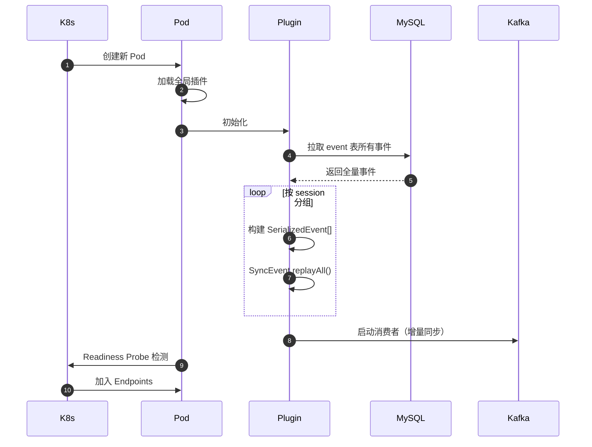

**新 Pod 启动同步流程：**

> **重要：** 由于 SQLite 使用内存模式（`OPENCODE_DB=:memory:`），Pod 重启后本地数据完全丢失，必须从 MySQL 完整恢复所有会话和消息。

1. **K8s Controller 创建新 Pod**
2. **加载全局插件**：ConfigMap 挂载插件代码到 `~/.config/opencode/plugins/session-sync/`
3. **Plugin 初始化**：连接 MySQL 和 Kafka
4. **MySQL 全量拉取**（核心步骤）：
   - 从 MySQL 全量拉取 `event` 表所有事件
   - 按 `aggregate_id`（session_id）分组，构建 `SerializedEvent[]`
   - 对每个 session 调用 `SyncEvent.replayAll()` 恢复到本地 SQLite
5. **Kafka 增量同步**：消费增量事件，通过 `SyncEvent.replay()` 更新本地 SQLite
6. **Readiness Probe 检测**：验证本地 SQLite 数据完整性
7. **加入 Service Endpoints**：开始接受流量


## 6. 扩缩容机制

### 6.1 扩容策略

> **注意：** 由于 SQLite 内存模式，扩容时新 Pod 必须从 MySQL 完整恢复数据，**启动时间会较长**。建议设置较大的 `initialDelaySeconds`。

```yaml
apiVersion: autoscaling/v2
kind: HorizontalPodAutoscaler
metadata:
  name: opencode-agent-hpa
  namespace: opencode-cluster
spec:
  scaleTargetRef:
    apiVersion: apps/v1
    kind: Deployment
    name: opencode-agent
  minReplicas: 2
  maxReplicas: 10
  metrics:
  - type: Resource
    resource:
      name: cpu
      target:
        type: Utilization
        averageUtilization: 70
  - type: Resource
    resource:
      name: memory
      target:
        type: Utilization
        averageUtilization: 80
  behavior:
    scaleUp:
      stabilizationWindowSeconds: 60
      policies:
      - type: Percent
        value: 100
        periodSeconds: 60
    scaleDown:
      stabilizationWindowSeconds: 300
      policies:
      - type: Percent
        value: 10
        periodSeconds: 60
```

**扩缩容触发条件：**
- CPU 使用率 > 70% 持续 60s → 扩容
- Memory 使用率 > 80% 持续 60s → 扩容
- 扩容步进：每次增加 50%-100% 实例
- 缩容步进：每次减少 10% 实例

**新 Pod 就绪流程（内存模式）：**
1. K8s Controller 创建新 Pod
2. 加载全局插件，连接 MySQL 和 Kafka
3. **MySQL 全量恢复**（必须）：
   - 从 MySQL 拉取 `event` 表所有事件
   - 按 session 分组，调用 `SyncEvent.replayAll()` 恢复
4. **Kafka 增量同步**：消费增量事件更新本地库
5. Readiness Probe 检测就绪（建议 initialDelaySeconds >= 60s）
6. 加入 Service endpoints 接受流量

### 6.2 缩容策略

**优雅下线流程：**

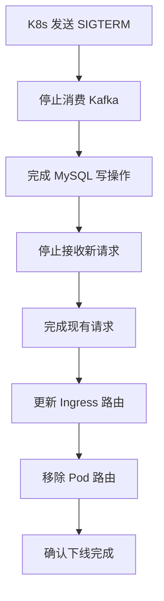

**会话数据保障：**
- 会话数据已同步到 MySQL 全局主库
- 其他 Pod 通过 Kafka 广播已同步该会话
- 客户端重连后由 Ingress 路由到其他 Pod，Kafka 增量同步恢复

### 6.3 扩缩容限制
- 最小实例数：2（保障高可用）
- 最大实例数：10（资源上限）
- 缩容冷却期：5 分钟（防止抖动）
- 扩容冷却期：1 分钟（防止抖动）
- 单次扩缩容比例限制：50%-100%
- 新 Pod 启动同步超时：120s（超时则探针失败，不加入 Endpoints）

## 7. 高可用设计

### 7.1 故障处理

**Pod 故障检测与恢复：**
- Liveness Probe：每 10s 检测 `/health` 端点，3 次失败触发重启
- Readiness Probe：每 5s 检测本地 SQLite 可读性，失败移除 endpoints
- Pod Disruption Budget：保证至少 50% Pod 可用

**故障恢复场景：**

| 场景 | 处理方式 |
|------|---------|
| Pod Crash | K8s 重启 Pod，全局插件重新连接 Kafka 从上次位点继续消费 |
| Kafka 连接断开 | 全局插件自动重连（指数退避），重连后从 MySQL 拉取增量数据 |
| MySQL 连接断开 | 全局插件缓存事件到本地队列，MySQL 恢复后重放 |
| Ingress 粘链失效 | 路由到任意 Pod，Kafka 已同步本地 SQLite，返回正常响应 |

### 7.2 灾备方案

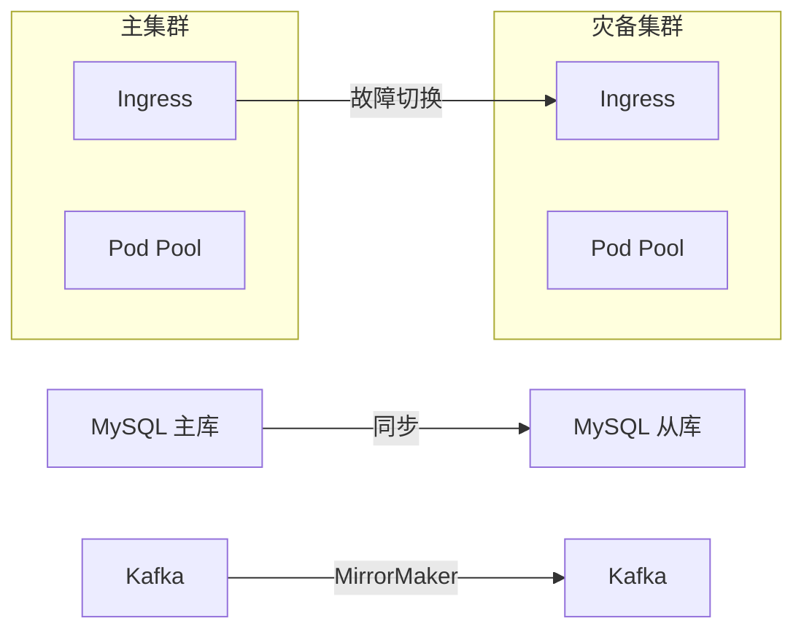

**灾备机制：**
- MySQL 主从异步复制
- Kafka MirrorMaker 跨集群同步事件
- 故障时切换 Ingress DNS 解析到灾备集群
- 灾备集群 Pod 启动时从 MySQL 从库拉取全量数据

## 8. 部署清单

### 8.1 K8s 资源清单

#### 8.1.1 Namespace
```yaml
apiVersion: v1
kind: Namespace
metadata:
  name: opencode-cluster
  labels:
    app: opencode-agent
```

#### 8.1.2 MySQL 配置

```yaml
apiVersion: v1
kind: ConfigMap
metadata:
  name: mysql-config
  namespace: opencode-cluster
data:
  MYSQL_HOST: "mysql.opencode-cluster.svc.cluster.local"
  MYSQL_PORT: "3306"
  MYSQL_DATABASE: "opencode"
---
apiVersion: v1
kind: Secret
metadata:
  name: mysql-secret
  namespace: opencode-cluster
type: Opaque
stringData:
  MYSQL_USER: "opencode"
  MYSQL_PASSWORD: "<your-mysql-password>"
```

> 生产环境不建议把真实密钥直接写入仓库。请接入 External Secrets、Vault、云厂商 KMS 或等价密钥管理系统。

#### 8.1.3 Kafka 配置

```yaml
apiVersion: v1
kind: ConfigMap
metadata:
  name: kafka-config
  namespace: opencode-cluster
data:
  KAFKA_BROKERS: "kafka-0.kafka-headless.opencode-cluster.svc.cluster.local:9092,kafka-1.kafka-headless.opencode-cluster.svc.cluster.local:9092,kafka-2.kafka-headless.opencode-cluster.svc.cluster.local:9092"
  KAFKA_TOPIC: "opencode-session-events"
  KAFKA_CONSUMER_GROUP: "opencode-sync-group"
---
# Kafka Topic 定义
apiVersion: kafka.strimzi.io/v1beta2
kind: KafkaTopic
metadata:
  name: opencode-session-events
  namespace: opencode-cluster
  labels:
    strimzi.io/cluster: kafka
spec:
  partitions: 12  # >= Pod 数 * 2
  replicas: 2
  config:
    retention.ms: 604800000  # 7 天
    cleanup.policy: delete
```

#### 8.1.4 全局插件 ConfigMap
```yaml
apiVersion: v1
kind: ConfigMap
metadata:
  name: opencode-plugin-session-sync
  namespace: opencode-cluster
data:
  config.yaml: |
    plugin:
      name: session-sync
      version: "1.0.0"
      
    mysql:
      host: ${MYSQL_HOST}
      port: ${MYSQL_PORT}
      database: opencode
      username: ${MYSQL_USER}
      password: ${MYSQL_PASSWORD}
      
    kafka:
      brokers:
        - ${KAFKA_BROKER_1}
        - ${KAFKA_BROKER_2}
      topic: opencode-session-events
      consumer:
        group_id: opencode-sync-group
        auto_offset_reset: earliest
        enable_auto_commit: false
      producer:
        acks: all
        retries: 3
  "index.js": |
    // 全局插件入口 - 会话同步插件
    // Plugin 通过 hook["event"] 接收内核事件（参见 packages/opencode/src/plugin/index.ts）
    
    class SessionSyncPlugin {
      constructor() {
        this.mysql = null;
        this.kafka = null;
      }
      
      // OpenCode Plugin 生命周期钩子 - onInit
      async onInit(config) {
        this.mysql = this.initMySQL(config.mysql);
        this.kafka = this.initKafka(config.kafka);
        
        // 启动 Kafka 消费者
        await this.startKafkaConsumer();
      }
      
      // 事件处理入口 - OpenCode 内核通过 hook["event"] 调用
      async event({ event }) {
        // event 包含: type, data, timestamp 等字段
        switch (event.type) {
          case 'session.created':
            await this.handleSessionCreated(event.data);
            break;
          case 'session.updated':
            await this.handleSessionUpdated(event.data);
            break;
          case 'session.deleted':
            await this.handleSessionDeleted(event.data);
            break;
          case 'message.added':
            await this.handleMessageAdded(event.data);
            break;
        }
      }
      
      async handleSessionCreated(session) {
        // MySQL 写入（幂等）
        await this.mysql.upsert('session', session);
        // Kafka 广播
        await this.kafka.send('opencode-session-events', {
          type: 'session.created',
          session_id: session.id,
          data: session,
          timestamp: Date.now()
        });
      }
      // ... 其他事件处理
    }
    
    module.exports = new SessionSyncPlugin();
```

#### 8.1.5 OpenCode 配置
```yaml
apiVersion: v1
kind: ConfigMap
metadata:
  name: opencode-agent-config
  namespace: opencode-cluster
data:
  OPENCODE_WEB_PORT: "4096"
  OPENCODE_LOG_LEVEL: "info"
  OPENCODE_PLUGINS_DIR: "/app/.opencode/plugins"
  OPENCODE_DB: ":memory:"  # SQLite 内存模式，不写文件
---
apiVersion: v1
kind: Secret
metadata:
  name: opencode-agent-secret
  namespace: opencode-cluster
type: Opaque
stringData:
  API_KEY: "<your-model-api-key>"
  API_BASE_URL: "https://api.openai.com/v1"
```

#### 8.1.6 Deployment（完整版）
```yaml
apiVersion: apps/v1
kind: Deployment
metadata:
  name: opencode-agent
  namespace: opencode-cluster
spec:
  replicas: 3
  selector:
    matchLabels:
      app: opencode-agent
  template:
    metadata:
      labels:
        app: opencode-agent
    spec:
      containers:
      - name: opencode-agent
        image: node:20-alpine
        command: ["sh", "-c"]
        args:
          - |
            npm install -g opencode-ai@1.14.50 &&
            mkdir -p ~/.config/opencode/plugins/session-sync &&
            cp /plugin-config/* ~/.config/opencode/plugins/session-sync/ &&
            opencode serve --host 0.0.0.0 --port 4096
        ports:
        - containerPort: 4096
          name: http
        envFrom:
        - configMapRef:
            name: opencode-agent-config
        - configMapRef:
            name: mysql-config
        - configMapRef:
            name: kafka-config
        - secretRef:
            name: opencode-agent-secret
        - secretRef:
            name: mysql-secret
        env:
        - name: KAFKA_BROKER_1
          valueFrom:
            configMapKeyRef:
              name: kafka-config
              key: KAFKA_BROKER_1
        - name: KAFKA_BROKER_2
          valueFrom:
            configMapKeyRef:
              name: kafka-config
              key: KAFKA_BROKER_2
        resources:
          requests:
            cpu: "500m"
            memory: "1Gi"
          limits:
            cpu: "2000m"
            memory: "4Gi"
        volumeMounts:
        - name: plugin-config
          mountPath: /plugin-config
        - name: sqlite-storage
          mountPath: /root/.config/opencode
        livenessProbe:
          httpGet:
            path: /health
            port: 4096
          initialDelaySeconds: 60   # 内存模式需要较长启动时间
          periodSeconds: 10
          failureThreshold: 3
        readinessProbe:
          httpGet:
            path: /health
            port: 4096
          initialDelaySeconds: 60   # 等待 MySQL 全量恢复完成
          periodSeconds: 5
          successThreshold: 1
          failureThreshold: 3
        lifecycle:
          preStop:
            exec:
              command: ["/bin/sh", "-c", "sleep 30"]
      volumes:
      - name: plugin-config
        configMap:
          name: opencode-plugin-session-sync
      - name: sqlite-storage
        emptyDir: {}
```

#### 8.1.7 Service
```yaml
apiVersion: v1
kind: Service
metadata:
  name: opencode-agent-svc
  namespace: opencode-cluster
spec:
  type: ClusterIP
  selector:
    app: opencode-agent
  ports:
  - port: 4096
    targetPort: 4096
    protocol: TCP
    name: http
```

#### 8.1.8 Ingress
```yaml
apiVersion: networking.k8s.io/v1
kind: Ingress
metadata:
  name: opencode-agent-ingress
  namespace: opencode-cluster
  annotations:
    nginx.ingress.kubernetes.io/affinity: "cookie"
    nginx.ingress.kubernetes.io/session-cookie-name: "OPENCODE_SESSION"
    nginx.ingress.kubernetes.io/session-cookie-expires: "86400"
    nginx.ingress.kubernetes.io/session-cookie-max-age: "86400"
    nginx.ingress.kubernetes.io/proxy-body-size: "100m"
    nginx.ingress.kubernetes.io/proxy-read-timeout: "120"
    nginx.ingress.kubernetes.io/proxy-write-timeout: "120"
    nginx.ingress.kubernetes.io/proxy-next-upstream: "error timeout http_502 http_503 http_504"
spec:
  ingressClassName: nginx
  rules:
  - host: opencode.example.com
    http:
      paths:
      - path: /
        pathType: Prefix
        backend:
          service:
            name: opencode-agent-svc
            port:
              number: 4096
```

#### 8.1.9 HPA
```yaml
apiVersion: autoscaling/v2
kind: HorizontalPodAutoscaler
metadata:
  name: opencode-agent-hpa
  namespace: opencode-cluster
spec:
  scaleTargetRef:
    apiVersion: apps/v1
    kind: Deployment
    name: opencode-agent
  minReplicas: 2
  maxReplicas: 10
  metrics:
  - type: Resource
    resource:
      name: cpu
      target:
        type: Utilization
        averageUtilization: 70
  - type: Resource
    resource:
      name: memory
      target:
        type: Utilization
        averageUtilization: 80
  behavior:
    scaleUp:
      stabilizationWindowSeconds: 60
      policies:
      - type: Percent
        value: 100
        periodSeconds: 60
    scaleDown:
      stabilizationWindowSeconds: 300
      policies:
      - type: Percent
        value: 10
        periodSeconds: 60
```

#### 8.1.10 PodDisruptionBudget
```yaml
apiVersion: policy/v1
kind: PodDisruptionBudget
metadata:
  name: opencode-agent-pdb
  namespace: opencode-cluster
spec:
  minAvailable: 50%
  selector:
    matchLabels:
      app: opencode-agent
```

### 8.2 配置参数汇总

#### 8.2.1 OpenCode 参数
| 参数 | 默认值 | 说明 |
|------|--------|------|
| `OPENCODE_WEB_PORT` | 4096 | Web 服务端口 |
| `OPENCODE_LOG_LEVEL` | info | 日志级别 |
| `OPENCODE_PLUGINS_DIR` | /app/.opencode/plugins | 插件目录 |
| `OPENCODE_DB` | `opencode.db` | SQLite 路径，设为 `:memory:` 启用内存模式（不写文件） |

#### 8.2.2 MySQL 参数
| 参数 | 默认值 | 说明 |
|------|--------|------|
| `MYSQL_HOST` | mysql.opencode-cluster.svc.cluster.local | MySQL 服务地址 |
| `MYSQL_PORT` | 3306 | MySQL 端口 |
| `MYSQL_DATABASE` | opencode | 数据库名 |
| `MYSQL_USER` | opencode | 用户名 |
| `MYSQL_PASSWORD` | - | 密码（Secret） |

#### 8.2.3 Kafka 参数
| 参数 | 默认值 | 说明 |
|------|--------|------|
| `KAFKA_BROKERS` | - | Kafka Broker 列表 |
| `KAFKA_TOPIC` | opencode-session-events | 事件 Topic |
| `KAFKA_CONSUMER_GROUP` | opencode-sync-group | 消费者组 |
| `KAFKA_PARTITIONS` | 12 | 分区数（>= Pod数*2） |
| `KAFKA_REPLICAS` | 2 | 副本数 |
| `KAFKA_RETENTION_DAYS` | 7 | 消息保留天数 |

#### 8.2.4 HPA 参数
| 参数 | 默认值 | 说明 |
|------|--------|------|
| `HPA_MIN_REPLICAS` | 2 | 最小实例数 |
| `HPA_MAX_REPLICAS` | 10 | 最大实例数 |
| `CPU_THRESHOLD` | 70% | CPU 扩容阈值 |
| `MEMORY_THRESHOLD` | 80% | 内存扩容阈值 |
| `SCALE_UP_STABILIZATION` | 60s | 扩容冷却期 |
| `SCALE_DOWN_STABILIZATION` | 300s | 缩容冷却期 |

#### 8.2.5 Ingress 参数
| 参数 | 默认值 | 说明 |
|------|--------|------|
| `SESSION_COOKIE_NAME` | OPENCODE_SESSION | Cookie 名称 |
| `SESSION_COOKIE_TTL` | 86400 | Cookie 有效期(秒) |
| `PROXY_READ_TIMEOUT` | 120 | 读超时(秒) |
| `PROXY_WRITE_TIMEOUT` | 120 | 写超时(秒) |

## 9. 监控与运维

### 9.1 监控指标

| 指标类别 | 指标名称 | 说明 | 告警阈值 |
|---------|---------|------|---------|
| 基础设施 | Pod CPU 使用率 | 容器 CPU 消耗 | > 80% |
| 基础设施 | Pod Memory 使用率 | 容器内存消耗 | > 85% |
| 基础设施 | Pod 重启次数 | 异常重启统计 | > 3 次/小时 |
| 网络 | Ingress QPS | 请求吞吐量 | > 1000 req/s |
| 网络 | Ingress 延迟 P99 | 请求响应延迟 | > 5s |
| 网络 | WebSocket 连接数 | 长连接数量 | > 500/ Pod |
| 应用 | 会话数量 | 在线会话统计 | < 1 或 > 1000 |
| 应用 | 会话创建速率 | 新会话创建频率 | > 100/min |
| **MySQL** | MySQL 连接数 | DB 连接池使用 | > 80% |
| **MySQL** | MySQL QPS | 数据库请求量 | > 5000/s |
| **Kafka** | Consumer Lag | 消费延迟 | > 1000 条 |
| **Kafka** | Topic 消息积压 | 积压消息数 | > 10000 |
| **插件** | 同步成功率 | MySQL/Kafka 操作成功率 | < 99% |
| **插件** | 同步延迟 | 事件从产生到同步完成 | > 5s |

### 9.2 日志方案

**日志收集架构：**
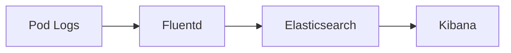

**关键日志关键字：**

| 关键字 | 含义 | 级别 |
|--------|------|------|
| `session.created` | 会话创建事件 | INFO |
| `session.updated` | 会话更新事件 | INFO |
| `session.deleted` | 会话删除事件 | INFO |
| `mysql.upsert` | MySQL 写入操作 | DEBUG |
| `mysql.error` | MySQL 操作失败 | ERROR |
| `kafka.send` | Kafka 发送消息 | DEBUG |
| `kafka.consume` | Kafka 消费消息 | DEBUG |
| `kafka.error` | Kafka 操作失败 | ERROR |
| `sync.complete` | 同步完成 | INFO |
| `sync.fail` | 同步失败 | ERROR |
| `sqlitedb.write` | SQLite 本地写入 | DEBUG |

### 9.3 告警策略

| 告警名称 | 条件 | 级别 | 处理措施 |
|---------|------|------|---------|
| PodHighCPU | CPU > 80% 持续 5min | Warning | 检查扩容触发 |
| PodHighMemory | Memory > 85% 持续 5min | Warning | 检查扩容触发 |
| PodRestartStorm | 重启 > 3次/小时 | Critical | 检查 Pod 异常 |
| IngressHighLatency | P99 > 5s | Warning | 检查网络/服务状态 |
| MySQLConnectionError | MySQL 连接失败 | Critical | 检查 MySQL 服务 |
| KafkaConsumerLag | Consumer Lag > 1000 | Warning | 检查 Kafka 消费能力 |
| KafkaConnectionError | Kafka 连接失败 | Critical | 检查 Kafka 服务 |
| SyncFailureRate | 同步失败率 > 1% | Warning | 检查 MySQL/Kafka 状态 |
| SyncTimeout | 同步延迟 > 5s | Warning | 检查网络/服务状态 |
| SessionDataInconsistent | MySQL 与 SQLite 不一致 | Critical | 检查插件同步逻辑 |
| HPAMaxReplicas | 达到最大实例数 | Warning | 评估扩容上限 |

## 10. 已知问题与限制

### 10.1 已知坑点

#### 坑点1：SQLite 多写锁问题
- **问题描述**：内核使用 SQLite 作为本地会话数据库，多 Pod 同时写入会产生锁冲突
- **影响程度**：高
- **复现条件**：多个 Pod 同时处理写操作（如创建会话、快照保存）
- **规避方案**：通过 Ingress Cookie 粘链 + Kafka 广播同步，确保同一会话操作路由到同一 Pod

#### 坑点2：Session Sticky 失效
- **问题描述**：Ingress cookie 过期或 Kubernetes endpoints 更新延迟导致会话漂移
- **影响程度**：中
- **复现条件**：高负载扩缩容场景
- **规避方案**：
  - 设置较长 Cookie TTL（24h）
  - 客户端心跳保活
  - Kafka 广播同步兜底（漂移后请求到其他 Pod，本地 SQLite 已有数据）

#### 坑点3：Kafka 消费位点丢失
- **问题描述**：新 Pod 启动时 Kafka Consumer 从 earliest 消费，但历史消息可能被清理
- **影响程度**：中
- **复现条件**：Kafka 消息保留期到期，新 Pod 启动
- **规避方案**：混合模式（MySQL 全量拉取 + Kafka 增量同步）

#### 坑点4：Kafka 分区数不足
- **问题描述**：扩容时新 Pod 无法消费（消费者组 Rebalance 失败）
- **影响程度**：高
- **复现条件**：扩容时分区数 < Pod 数
- **规避方案**：分区数 = Pod数 × 2（本方案设为 12）

#### 坑点5：插件启动顺序
- **问题描述**：全局插件启动慢于 OpenCode 内核，内核事件丢失
- **影响程度**：中
- **复现条件**：Pod 刚启动时快速创建会话
- **规避方案**：
  - Readiness Probe 延迟 10s
  - 插件内部设置事件缓冲队列
  - 从 MySQL 全量同步时补充丢失事件

#### 坑点6：MySQL 单点故障
- **问题描述**：MySQL 主库宕机，全局同步中断
- **影响程度**：高
- **复现条件**：MySQL 服务不可用
- **规避方案**：
  - MySQL 主从高可用部署
  - 插件本地缓存事件，MySQL 恢复后重放
  - 短期降级：只依赖 Ingress 粘链保证会话路由

### 10.2 规避方案汇总

| 问题 | 规避方案 | 实施成本 |
|------|---------|---------|
| SQLite 多写锁 | Ingress Cookie 粘链 + Kafka 广播同步 | 低 |
| Session Sticky 失效 | 长 TTL + 心跳保活 + Kafka 兜底同步 | 低 |
| Kafka 消费位点丢失 | 混合模式（MySQL 全量 + Kafka 增量） | 中 |
| Kafka 分区数不足 | 分区数 = Pod数 × 2 | 低 |
| 插件启动顺序 | Readiness Probe + 缓冲队列 | 低 |
| MySQL 单点故障 | 主从高可用 + 本地事件缓存 | 中 |

### 10.3 未来改进方向

- [ ] 迁移到分布式数据库（PostgreSQL / TiDB）替代 MySQL 单机
- [ ] 引入 Redis 实现分布式 Session 管理
- [ ] 插件支持集群模式选举（避免重复消费）
- [ ] 会话数据分片存储（按 user_id 哈希分区）

## 11. 附录

### A. MySQL DDL 完整脚本

```sql
-- 创建数据库
CREATE DATABASE IF NOT EXISTS opencode DEFAULT CHARSET=utf8mb4;

-- 创建用户
CREATE USER IF NOT EXISTS 'opencode'@'%' IDENTIFIED BY '<your-mysql-password>';
GRANT ALL PRIVILEGES ON opencode.* TO 'opencode'@'%';
FLUSH PRIVILEGES;

-- 全局会话表
CREATE TABLE IF NOT EXISTS session (
    id VARCHAR(36) PRIMARY KEY COMMENT '会话ID（内核生成）',
    project_id VARCHAR(36) NOT NULL COMMENT '项目ID',
    workspace_id VARCHAR(36) COMMENT '工作空间ID',
    parent_id VARCHAR(36) COMMENT '父会话ID',
    slug VARCHAR(255) NOT NULL COMMENT '会话 slug',
    directory VARCHAR(1024) NOT NULL COMMENT '工作目录',
    path VARCHAR(1024) COMMENT '子路径',
    title VARCHAR(255) NOT NULL COMMENT '会话标题',
    version VARCHAR(50) NOT NULL COMMENT 'OpenCode 版本',
    cost DECIMAL(10,6) DEFAULT 0 COMMENT '费用',
    tokens_input BIGINT DEFAULT 0 COMMENT '输入 token 数',
    tokens_output BIGINT DEFAULT 0 COMMENT '输出 token 数',
    time_created BIGINT NOT NULL COMMENT '创建时间戳',
    time_updated BIGINT NOT NULL COMMENT '更新时间戳',
    INDEX idx_project (project_id),
    INDEX idx_workspace (workspace_id),
    INDEX idx_parent (parent_id)
) ENGINE=InnoDB DEFAULT CHARSET=utf8mb4 COMMENT='OpenCode全局会话主表';

-- 全局消息表
CREATE TABLE IF NOT EXISTS message (
    id VARCHAR(36) PRIMARY KEY COMMENT '消息ID',
    session_id VARCHAR(36) NOT NULL COMMENT '会话ID',
    time_created BIGINT NOT NULL COMMENT '创建时间戳',
    time_updated BIGINT NOT NULL COMMENT '更新时间戳',
    data JSON NOT NULL COMMENT '消息数据（JSON格式）',
    INDEX idx_session_time (session_id, time_created, id)
) ENGINE=InnoDB DEFAULT CHARSET=utf8mb4 COMMENT='OpenCode全局消息表';

-- 事件序列表
CREATE TABLE IF NOT EXISTS event_sequence (
    aggregate_id VARCHAR(36) PRIMARY KEY COMMENT '聚合ID（如 session_id）',
    seq BIGINT NOT NULL COMMENT '序列号',
    owner_id VARCHAR(36) COMMENT '所有者ID'
) ENGINE=InnoDB DEFAULT CHARSET=utf8mb4;

-- 事件表
CREATE TABLE IF NOT EXISTS event (
    id VARCHAR(36) PRIMARY KEY COMMENT '事件ID',
    aggregate_id VARCHAR(36) NOT NULL COMMENT '聚合ID',
    seq BIGINT NOT NULL COMMENT '序列号',
    type VARCHAR(100) NOT NULL COMMENT '事件类型',
    data JSON NOT NULL COMMENT '事件数据',
    INDEX idx_aggregate (aggregate_id),
    INDEX idx_type (type)
) ENGINE=InnoDB DEFAULT CHARSET=utf8mb4;

-- 消息片段表
CREATE TABLE IF NOT EXISTS part (
    id VARCHAR(36) PRIMARY KEY COMMENT '片段ID',
    message_id VARCHAR(36) NOT NULL COMMENT '消息ID',
    session_id VARCHAR(36) NOT NULL COMMENT '会话ID',
    time_created BIGINT NOT NULL COMMENT '创建时间戳',
    time_updated BIGINT NOT NULL COMMENT '更新时间戳',
    data JSON NOT NULL COMMENT '片段数据',
    INDEX idx_message (message_id, id),
    INDEX idx_session (session_id)
) ENGINE=InnoDB DEFAULT CHARSET=utf8mb4;

-- 待办表
CREATE TABLE IF NOT EXISTS todo (
    session_id VARCHAR(36) NOT NULL COMMENT '会话ID',
    position INT NOT NULL COMMENT '位置',
    content TEXT NOT NULL COMMENT '待办内容',
    status VARCHAR(20) NOT NULL COMMENT '状态',
    priority VARCHAR(20) NOT NULL COMMENT '优先级',
    time_created BIGINT NOT NULL COMMENT '创建时间戳',
    time_updated BIGINT NOT NULL COMMENT '更新时间戳',
    PRIMARY KEY (session_id, position),
    INDEX idx_session (session_id)
) ENGINE=InnoDB DEFAULT CHARSET=utf8mb4;

-- 会话消息关联表
CREATE TABLE IF NOT EXISTS session_message (
    id VARCHAR(36) PRIMARY KEY COMMENT 'ID',
    session_id VARCHAR(36) NOT NULL COMMENT '会话ID',
    type VARCHAR(50) NOT NULL COMMENT '消息类型',
    time_created BIGINT NOT NULL COMMENT '创建时间戳',
    time_updated BIGINT NOT NULL COMMENT '更新时间戳',
    data JSON NOT NULL COMMENT '消息数据',
    INDEX idx_session (session_id),
    INDEX idx_session_type (session_id, type)
) ENGINE=InnoDB DEFAULT CHARSET=utf8mb4;
```

### B. 全局插件伪代码

```javascript
// ~/.config/opencode/plugins/session-sync/index.js
// 全局插件：会话同步插件
// Plugin 通过 hook["event"] 接收内核事件（参见 packages/opencode/src/plugin/index.ts）

const mysql = require('mysql2/promise');
const kafka = require('kafkajs');

class SessionSyncPlugin {
    constructor() {
        this.mysqlPool = null;
        this.kafka = null;
        this.consumer = null;
        this.producer = null;
        this.bufferQueue = []; // 事件缓冲队列
    }

    // ============ 生命周期钩子 ============
    
    async onInit(config) {
        // 1. 初始化 MySQL 连接池
        await this.initMySQL();
        
        // 2. 初始化 Kafka 生产者/消费者
        await this.initKafka();
        
        // 3. 启动 Kafka 消费者（后台）
        this.startKafkaConsumer();
        
        // 4. 新 Pod 启动时：混合同步模式
        if (this.isColdStart()) {
            await this.hybridSync();
        }
    }

    // ============ 事件处理入口 ============
    // OpenCode 内核通过 hook["event"] 调用此方法
    async event({ event }) {
        // 事件缓冲队列（防止插件启动时事件丢失）
        if (this.isBuffering) {
            this.bufferQueue.push(event);
            return;
        }
        await this.handleLocalEvent(event);
    }

    async handleLocalEvent(event) {
        switch (event.type) {
            case 'session.created':
                await this.handleSessionCreated(event.data);
                break;
            case 'session.updated':
                await this.handleSessionUpdated(event.data);
                break;
            case 'session.deleted':
                await this.handleSessionDeleted(event.data);
                break;
            case 'message.added':
                await this.handleMessageAdded(event.data);
                break;
        }
    }

    // 刷新缓冲队列
    async flushBuffer() {
        this.isBuffering = false;
        for (const event of this.bufferQueue) {
            await this.handleLocalEvent(event);
        }
        this.bufferQueue = [];
    }

    // ============ MySQL 操作 ============
    
    async initMySQL() {
        this.mysqlPool = mysql.createPool({
            host: process.env.MYSQL_HOST,
            port: process.env.MYSQL_PORT,
            database: process.env.MYSQL_DATABASE,
            user: process.env.MYSQL_USER,
            password: process.env.MYSQL_PASSWORD,
            waitForConnections: true,
            connectionLimit: 10
        });
    }

    // 写入/更新会话（幂等）
    async upsertSession(session) {
        const sql = `
            INSERT INTO session 
                (id, project_id, workspace_id, parent_id, slug, directory, path, title, version, cost, tokens_input, tokens_output, time_created, time_updated)
            VALUES (?, ?, ?, ?, ?, ?, ?, ?, ?, ?, ?, ?, ?, ?)
            ON DUPLICATE KEY UPDATE
                title = VALUES(title),
                time_updated = VALUES(time_updated),
                cost = VALUES(cost),
                tokens_input = VALUES(tokens_input),
                tokens_output = VALUES(tokens_output)
        `;
        await this.mysqlPool.execute(sql, [
            session.id, session.project_id, session.workspace_id, session.parent_id,
            session.slug, session.directory, session.path, session.title, session.version,
            session.cost || 0, session.tokens_input || 0, session.tokens_output || 0,
            session.time_created, session.time_updated
        ]);
    }

    // 写入消息（幂等）
    async upsertMessage(message) {
        const sql = `
            INSERT INTO message 
                (id, session_id, time_created, time_updated, data)
            VALUES (?, ?, ?, ?, ?)
            ON DUPLICATE KEY UPDATE
                data = VALUES(data)
        `;
        await this.mysqlPool.execute(sql, [
            message.id, message.session_id,
            message.time_created, message.time_updated,
            JSON.stringify(message.data)
        ]);
    }

    // 删除会话
    async deleteSession(sessionId) {
        await this.mysqlPool.execute(
            'DELETE FROM session WHERE id = ?',
            [sessionId]
        );
    }

    // ============ Kafka 操作 ============
    
    async initKafka() {
        this.kafka = new kafka.Kafka({
            clientId: `opencode-${process.env.POD_NAME}`,
            brokers: process.env.KAFKA_BROKERS.split(',')
        });
        this.producer = this.kafka.producer();
        this.consumer = this.kafka.consumer({ 
            groupId: process.env.KAFKA_CONSUMER_GROUP,
            fromBeginning: false
        });
        await this.producer.connect();
        await this.consumer.connect();
    }

    // 广播事件
    async broadcastEvent(event) {
        await this.producer.send({
            topic: process.env.KAFKA_TOPIC,
            messages: [{
                key: event.session_id,
                value: JSON.stringify({
                    ...event,
                    source_pod: process.env.POD_NAME,
                    timestamp: Date.now()
                })
            }]
        });
    }

    // 消费事件
    async startKafkaConsumer() {
        await this.consumer.subscribe({ 
            topic: process.env.KAFKA_TOPIC, 
            fromBeginning: false 
        });

        await this.consumer.run({
            eachMessage: async ({ topic, partition, message }) => {
                const event = JSON.parse(message.value.toString());
                await this.handleRemoteEvent(event);
            }
        });
    }

    // ============ 事件处理 ============
    
    async handleSessionCreated(session) {
        try {
            // 1. 写入 MySQL
            await this.upsertSession(session);
            
            // 2. 广播到 Kafka
            await this.broadcastEvent({
                type: 'session.created',
                session_id: session.id,
                data: session
            });
        } catch (error) {
            console.error('[SessionSync] Failed to handle session.created:', error);
        }
    }

    async handleSessionUpdated(session) {
        try {
            await this.upsertSession(session);
            await this.broadcastEvent({
                type: 'session.updated',
                session_id: session.id,
                data: session
            });
        } catch (error) {
            console.error('[SessionSync] Failed to handle session.updated:', error);
        }
    }

    async handleSessionDeleted(sessionId) {
        try {
            await this.deleteSession(sessionId);
            await this.broadcastEvent({
                type: 'session.deleted',
                session_id: sessionId
            });
        } catch (error) {
            console.error('[SessionSync] Failed to handle session.deleted:', error);
        }
    }

    async handleMessageAdded(message) {
        try {
            // 1. 写入 MySQL
            await this.upsertMessage(message);
            
            // 2. 广播到 Kafka
            await this.broadcastEvent({
                type: 'message.added',
                session_id: message.session_id,
                data: message
            });
        } catch (error) {
            console.error('[SessionSync] Failed to handle message.added:', error);
        }
    }

    // ============ 远程事件处理（Kafka 消费者） ============
    
    async handleRemoteEvent(event) {
        // 忽略自己发出的事件
        if (event.source_pod === process.env.POD_NAME) return;

        // 通过 SyncEvent.replay() 同步到本地 SQLite
        await this.syncToLocalSQLite(event);
    }

    async syncToLocalSQLite(event) {
        // 调用 OpenCode 内核的 SyncEvent.replay() 同步事件
        const { SyncEvent } = require('@opencode-ai/core');
        
        switch (event.type) {
            case 'session.created':
            case 'session.updated':
                await SyncEvent.replay(event.data);
                break;
            case 'session.deleted':
                await SyncEvent.replay({ type: 'session.deleted', id: event.session_id });
                break;
            case 'message.added':
                await SyncEvent.replay(event.data);
                break;
        }
    }

    // ============ 混合同步模式（新 Pod 启动） ============
    
    async hybridSync() {
        console.log('[SessionSync] Starting hybrid sync...');
        
        // 从 MySQL 拉取所有事件，按 session 分组
        const { SyncEvent } = require('@opencode-ai/core');
        const events = await this.fetchAllEvents();
        const eventsBySession = new Map();
        
        for (const event of events) {
            const aggregateID = event.aggregate_id;
            if (!eventsBySession.has(aggregateID)) {
                eventsBySession.set(aggregateID, []);
            }
            eventsBySession.get(aggregateID).push(event);
        }
        
        // 按 session 逐个恢复
        for (const [sessionID, sessionEvents] of eventsBySession) {
            // 按 seq 排序
            sessionEvents.sort((a, b) => a.seq - b.seq);
            await SyncEvent.replayAll(sessionEvents);
        }
        
        console.log(`[SessionSync] Hybrid sync complete: ${eventsBySession.size} sessions`);
    }

    async fetchAllEvents() {
        const [rows] = await this.mysqlPool.execute(
            'SELECT * FROM event ORDER BY aggregate_id, seq'
        );
        return rows;
    }

    // ============ 工具方法 ============
    
    isColdStart() {
        // 检查是否是新 Pod（可通过 readinessProbe 标记）
        return process.env.POD_COLD_START === 'true';
    }

    async onDestroy() {
        await this.mysqlPool.end();
        await this.producer.disconnect();
        await this.consumer.disconnect();
    }
}

module.exports = new SessionSyncPlugin();
```

### C. 参考资料
- [Kubernetes Ingress NGINX 官方文档](https://kubernetes.github.io/ingress-nginx/)
- [Horizontal Pod Autoscaler 官方文档](https://kubernetes.io/docs/tasks/run-application/horizontal-pod-autoscale/)
- [Strimzi Kafka Operator 官方文档](https://strimzi.io/)
- [opencode 官方文档](https://opencode.ai/docs)
- [kafka.js 官方文档](https://kafka.js.org/)
- [better-sqlite3 npm](https://www.npmjs.com/package/better-sqlite3)

### D. 术语表

| 术语 | 说明 |
|------|------|
| HPA | Horizontal Pod Autoscaler，水平 Pod 自动扩缩容 |
| Consumer Lag | Kafka 消费者滞后消息数 |
| Session Sticky | 基于 Cookie 的会话粘性负载均衡 |
| 全局插件 | 监听内核事件、执行业务逻辑的插件 |
| 混合模式 | MySQL 全量拉取 + Kafka 增量同步的新 Pod 启动策略 |
| 幂等操作 | 多次执行结果一致的操作用于避免重复数据 |