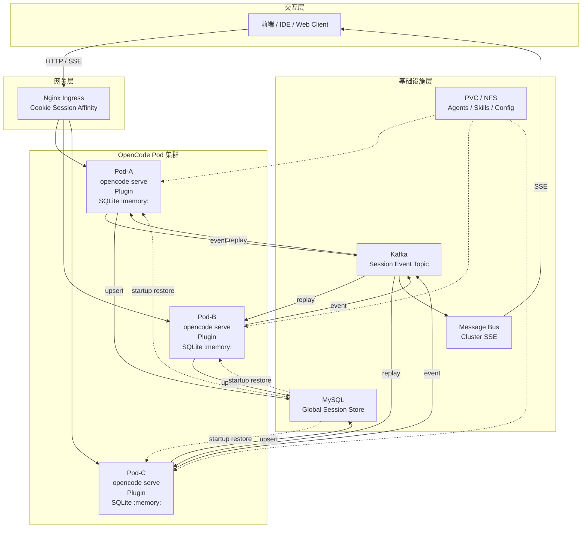
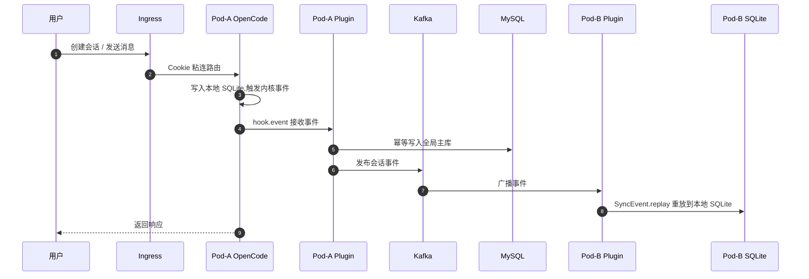
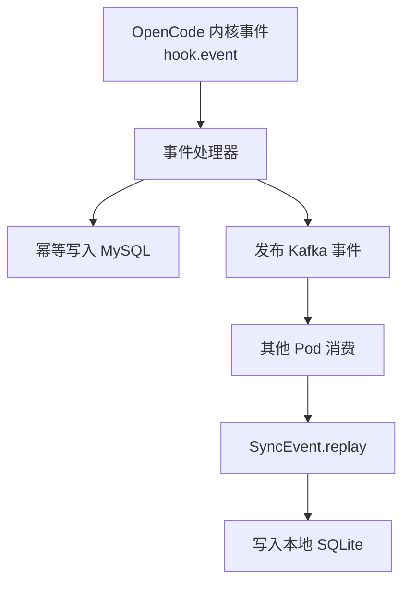
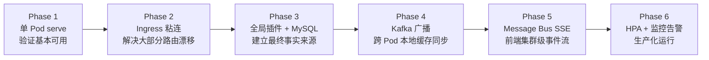

# OpenCode K8S 集群部署指南

> **阅读对象**:AI 平台工程师、Kubernetes 运维工程师、Agent 平台架构师
> **前置阅读**:[人机协同开发流程](./0xA2_人机协同开发流程.md) · [团队协作落地手册](./0xA3_团队协作落地手册.md)

## 目标与问题

OpenCode 默认更适合单进程客户端或单实例服务模式。直接把 `opencode serve` 横向扩容到 Kubernetes 多 Pod 后,最典型的问题是:**会话在 Pod-A 创建,后续消息被路由到 Pod-B 时返回 404 / 400**。

本指南给出一套不修改 OpenCode 内核的集群化部署方案:

- 通过 **Ingress Cookie 粘连** 降低同一会话漂移概率
- 通过 **全局插件**监听 OpenCode 内核事件
- 通过 **MySQL** 作为全局会话主库
- 通过 **Kafka** 广播会话事件,让每个 Pod 重放到本地 SQLite
- 通过 **SQLite 内存模式** 避免多 Pod 文件锁与共享卷一致性问题
- 通过 **Message Bus + SSE** 向前端提供集群级事件流

## 核心约束

| 约束 | 说明 |
| --- | --- |
| 不改 OpenCode 内核 | 只通过插件、配置、基础设施编排实现集群化 |
| 全局插件优先 | `opencode serve` 场景下,消息同步逻辑应挂载到全局配置目录 |
| SQLite 不共享文件 | 使用 `OPENCODE_DB=:memory:` 或等价内存配置,避免共享卷锁竞争 |
| MySQL 承担最终持久化 | Pod 本地数据可丢,但全局主库必须可恢复 |
| Kafka 只做事件广播 | 不替代主库,只负责跨 Pod 实时同步 |
| 前端不依赖 `/global/event` | 原生全局事件流是单进程作用域,集群级事件应由 Message Bus 提供 |

## 架构总览



## 关键设计决策

| 决策项 | 推荐方案 | 原因 |
| --- | --- | --- |
| 会话路由 | Ingress Cookie 粘连 | 同一用户尽量落到同一 Pod,降低本地缓存未命中的概率 |
| 本地存储 | SQLite 内存模式 | Pod 本地只作为可重建缓存,避免共享 SQLite 文件锁 |
| 全局主库 | MySQL | 作为会话、消息、事件的最终事实来源 |
| 事件同步 | Kafka | 负责跨 Pod 广播与异步重放 |
| 前端事件 | Message Bus SSE | 规避 `/global/event` 单进程作用域 |
| 插件部署 | 全局配置目录挂载 | 保证 `opencode serve` 模式下插件能被加载 |
| Skills / Agents | 工作目录 PVC 挂载 | 作为平台级能力包统一下发 |

## 事件同步链路



这条链路有两个兜底:

1. **路由兜底**:Ingress 粘连让多数请求回到创建会话的 Pod
2. **数据兜底**:即使粘连失效,其他 Pod 也已通过 Kafka 或启动恢复拥有本地副本

## 存储模型

### 本地 SQLite

OpenCode 内核会把会话、消息、事件序列写入本地 SQLite。本方案中,SQLite 只承担 **Pod 内快速缓存**:

- 不作为最终事实来源
- 不跨 Pod 共享文件
- Pod 重启后允许丢失
- 由 MySQL 全量恢复 + Kafka 增量同步重建

推荐配置:

```yaml
env:
  - name: OPENCODE_DB
    value: ":memory:"
```

### 全局 MySQL

MySQL 保存全局会话主数据,最小表集合包括:

| 表 | 说明 |
| --- | --- |
| `session` | 会话主表 |
| `message` | 消息主表 |
| `part` | 消息片段 |
| `session_message` | 会话与消息顺序关系 |
| `event` | 原始事件日志 |
| `event_sequence` | 聚合根事件序列 |

表结构不建议强耦合 OpenCode 内部实现版本。更稳妥的做法是:

- 保存必要查询字段(如 `session_id`、`project_id`、`time_created`)
- 原始事件以 JSON 形式完整留存
- 通过事件重放恢复本地 SQLite
- 每次升级 OpenCode 后回归验证事件结构

### Kafka Topic

推荐一个主 Topic 承载会话事件:

```yaml
apiVersion: kafka.strimzi.io/v1beta2
kind: KafkaTopic
metadata:
  name: opencode-session-events
spec:
  partitions: 12
  replicas: 2
  config:
    retention.ms: 604800000
    cleanup.policy: delete
```

分区建议:

```text
partitions >= max_pod_replicas * 2
```

这样 HPA 扩容时,新 Pod 更容易分配到可消费分区,降低消费者组 Rebalance 后的空转概率。

## 全局插件职责

插件不负责生成新的会话 ID,也不主动调用 OpenCode 创建接口。它只做三件事:



关键约束:

| 约束 | 目的 |
| --- | --- |
| 事件处理必须幂等 | Kafka 重投、Pod 重启、消费者 Rebalance 都可能导致重复消费 |
| Kafka offset 手动提交 | 确保写入 MySQL / SQLite 成功后再确认消息 |
| 启动时先全量恢复 | 避免历史事件超过 Kafka 保留期后新 Pod 无数据 |
| 插件失败不阻塞主请求 | 允许短时间退化到 Ingress 粘连模式 |

插件配置示意:

```yaml
plugin:
  name: session-sync
  version: "1.0.0"

mysql:
  host: ${MYSQL_HOST}
  port: ${MYSQL_PORT}
  database: opencode
  username: ${MYSQL_USER}
  password: ${MYSQL_PASSWORD}

kafka:
  brokers: ${KAFKA_BROKERS}
  topic: opencode-session-events
  consumer:
    group_id: opencode-sync-group
    auto_offset_reset: earliest
    enable_auto_commit: false
```

## Kubernetes 清单骨架

### Namespace

```yaml
apiVersion: v1
kind: Namespace
metadata:
  name: opencode-cluster
```

### ConfigMap 与 Secret

```yaml
apiVersion: v1
kind: ConfigMap
metadata:
  name: opencode-agent-config
  namespace: opencode-cluster
data:
  OPENCODE_WEB_PORT: "4096"
  OPENCODE_LOG_LEVEL: "info"
  OPENCODE_DB: ":memory:"
  KAFKA_TOPIC: "opencode-session-events"
---
apiVersion: v1
kind: Secret
metadata:
  name: opencode-agent-secret
  namespace: opencode-cluster
type: Opaque
stringData:
  API_KEY: "<your-model-api-key>"
  MYSQL_PASSWORD: "<your-mysql-password>"
```

> Secret 示例使用占位符。生产环境应接入 External Secrets、Vault、云厂商 KMS 或等价密钥管理系统。

### Deployment

```yaml
apiVersion: apps/v1
kind: Deployment
metadata:
  name: opencode-agent
  namespace: opencode-cluster
spec:
  replicas: 3
  selector:
    matchLabels:
      app: opencode-agent
  template:
    metadata:
      labels:
        app: opencode-agent
    spec:
      containers:
        - name: opencode-agent
          image: node:20-alpine
          command: ["sh", "-c"]
          args:
            - |
              npm install -g opencode-ai@1.14.50 &&
              mkdir -p ~/.config/opencode/plugins/session-sync &&
              cp /plugin-config/* ~/.config/opencode/plugins/session-sync/ &&
              opencode serve --host 0.0.0.0 --port 4096
          ports:
            - containerPort: 4096
              name: http
          envFrom:
            - configMapRef:
                name: opencode-agent-config
            - secretRef:
                name: opencode-agent-secret
          resources:
            requests:
              cpu: "500m"
              memory: "1Gi"
            limits:
              cpu: "2000m"
              memory: "4Gi"
          readinessProbe:
            httpGet:
              path: /health
              port: 4096
            initialDelaySeconds: 60
            periodSeconds: 5
          livenessProbe:
            httpGet:
              path: /health
              port: 4096
            initialDelaySeconds: 60
            periodSeconds: 10
          lifecycle:
            preStop:
              exec:
                command: ["/bin/sh", "-c", "sleep 30"]
          volumeMounts:
            - name: plugin-config
              mountPath: /plugin-config
            - name: opencode-workdir
              mountPath: /workspace
      volumes:
        - name: plugin-config
          configMap:
            name: opencode-plugin-session-sync
        - name: opencode-workdir
          persistentVolumeClaim:
            claimName: opencode-workdir-pvc
```

### Service 与 Ingress

```yaml
apiVersion: v1
kind: Service
metadata:
  name: opencode-agent-svc
  namespace: opencode-cluster
spec:
  type: ClusterIP
  selector:
    app: opencode-agent
  ports:
    - port: 4096
      targetPort: 4096
      protocol: TCP
      name: http
---
apiVersion: networking.k8s.io/v1
kind: Ingress
metadata:
  name: opencode-agent-ingress
  namespace: opencode-cluster
  annotations:
    nginx.ingress.kubernetes.io/affinity: "cookie"
    nginx.ingress.kubernetes.io/session-cookie-name: "OPENCODE_SESSION"
    nginx.ingress.kubernetes.io/session-cookie-max-age: "86400"
    nginx.ingress.kubernetes.io/proxy-read-timeout: "120"
    nginx.ingress.kubernetes.io/proxy-write-timeout: "120"
spec:
  ingressClassName: nginx
  rules:
    - host: opencode.example.com
      http:
        paths:
          - path: /
            pathType: Prefix
            backend:
              service:
                name: opencode-agent-svc
                port:
                  number: 4096
```

### HPA 与 PDB

```yaml
apiVersion: autoscaling/v2
kind: HorizontalPodAutoscaler
metadata:
  name: opencode-agent-hpa
  namespace: opencode-cluster
spec:
  scaleTargetRef:
    apiVersion: apps/v1
    kind: Deployment
    name: opencode-agent
  minReplicas: 2
  maxReplicas: 10
  metrics:
    - type: Resource
      resource:
        name: cpu
        target:
          type: Utilization
          averageUtilization: 70
---
apiVersion: policy/v1
kind: PodDisruptionBudget
metadata:
  name: opencode-agent-pdb
  namespace: opencode-cluster
spec:
  minAvailable: 50%
  selector:
    matchLabels:
      app: opencode-agent
```

## 验证路径

| 验证项 | 操作 | 预期结果 |
| --- | --- | --- |
| 单 Pod 创建会话 | 创建 session 后发送消息 | 正常返回,SQLite / MySQL 都有记录 |
| 跨 Pod 访问 | 强制把后续请求路由到其他 Pod | 不返回 404,本地 SQLite 可查到会话 |
| Pod 重启恢复 | 删除某 Pod 后等待新 Pod Ready | 新 Pod 从 MySQL 全量恢复,再消费 Kafka 增量 |
| Kafka 重投 | 模拟消费者异常重启 | 幂等写入,不产生重复消息 |
| Ingress 粘连 | 连续请求观察 upstream Pod | 同一 Cookie 尽量命中同一 Pod |
| HPA 扩容 | 压测触发扩容 | 新 Pod 可恢复历史会话并消费新事件 |

## 监控与告警

| 类别 | 指标 | 建议阈值 |
| --- | --- | --- |
| Pod | 重启次数 | > 3 次 / 小时告警 |
| OpenCode | 请求错误率 | 5 分钟内 > 5% 告警 |
| 会话 | 跨 Pod 404 / 400 数量 | 出现即告警 |
| Kafka | Consumer Lag | 持续增长 5 分钟告警 |
| Kafka | Rebalance 次数 | 高频 Rebalance 告警 |
| MySQL | 写入延迟 | P95 > 200ms 告警 |
| 插件 | 事件处理失败数 | 出现连续失败告警 |
| SSE | 连接数 / 断连率 | 突增或异常下降告警 |

## 常见坑点

| 问题 | 原因 | 规避方案 |
| --- | --- | --- |
| SQLite 多写锁 | 多 Pod 共享同一 SQLite 文件 | 使用内存模式,不要共享 SQLite 文件 |
| Session Sticky 失效 | Cookie 过期、扩缩容、Ingress 重建 | 粘连只是优化,Kafka 同步才是兜底 |
| Kafka 历史事件过期 | 新 Pod 从 earliest 也读不到已清理消息 | 启动时先从 MySQL 全量恢复 |
| Kafka 分区数不足 | 分区数小于 Pod 数 | `partitions >= max_pod_replicas * 2` |
| 插件启动慢于内核 | Pod Ready 过早,事件可能丢失 | 延迟 Readiness,插件内部缓冲,启动后全量补偿 |
| MySQL 单点故障 | 全局主库不可用 | 主从 / 托管高可用,插件本地缓存失败事件 |
| `/global/event` 不跨 Pod | 原生事件流仅当前进程可见 | 前端连接 Message Bus SSE |

## 落地路径建议



## 适用场景速查

| 场景 | 推荐度 | 说明 |
| --- | --- | --- |
| 多人共享的 OpenCode Web 服务 | ⭐⭐⭐⭐⭐ | 本方案正是为多 Pod 会话一致性设计 |
| 企业内部 AI Agent 平台 | ⭐⭐⭐⭐⭐ | Skills / Agents / Plugins 可统一下发 |
| 临时 Demo 环境 | ⭐⭐ | 单 Pod 更简单,不必引入 Kafka / MySQL |
| 强一致事务系统 | ⭐ | OpenCode 会话同步不是强事务模型 |
| 无状态 API 服务 | ⭐ | 不需要 SQLite / 会话事件同步这套复杂度 |

> **延伸阅读**
> - [人机协同开发流程](./0xA2_人机协同开发流程.md) —— OpenCode 集群作为团队 AI 协作底座
> - [团队协作落地手册](./0xA3_团队协作落地手册.md) —— Agents / Skills / Plugins 的团队化治理
> - [企业 SSO 接入设计模式](../0xB0_实践模式/0xB2_企业SSO接入设计模式.md) —— 将 OpenCode 控制台接入企业身份体系
