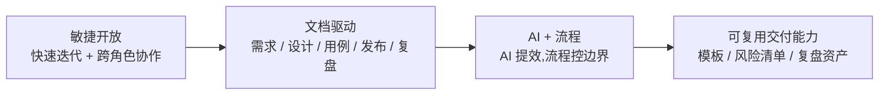
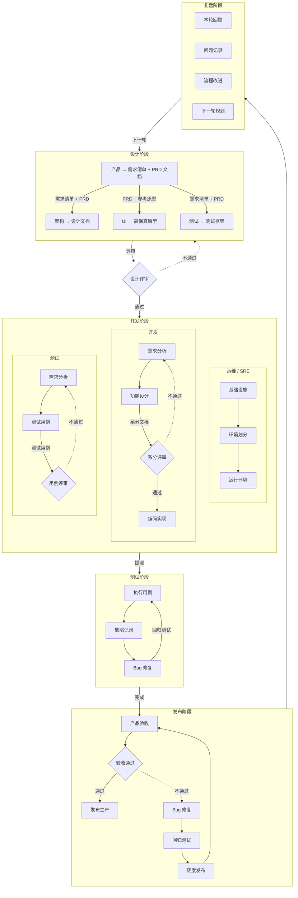
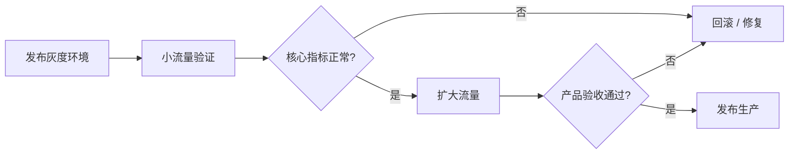

# 端到端研发交付 SOP

> **阅读对象**:研发负责人、项目经理、产品经理、架构师、测试负责人、运维/SRE
> **前置阅读**:[团队协作落地手册](./0xA3_团队协作落地手册.md) · [架构设计 SOP](./0xA5_架构设计SOP.md)

## 核心理念

本 SOP 的核心不是把团队变慢,而是把交付过程从「口头协作」升级为「文档驱动的敏捷协作」。

- **敏捷开放**:小步快跑、持续反馈、跨角色透明协作,避免大而全的一次性瀑布交付
- **文档驱动**:每个阶段都以明确产物作为协作接口,让需求、设计、测试、发布不靠口头记忆传递
- **AI + 流程**:AI 参与拆解、设计、编码、测试、复盘,但必须在 SOP 门禁内工作,由文档约束上下文,由人负责判断
- **可复用交付能力**:一次交付结束后,流程、模板、风险清单、复盘结论进入下一轮资产沉淀

## 适用范围

本文定义一套从需求进入到生产发布、再到复盘改进的标准研发交付流程。它适用于:

- 中大型业务功能从 0 到 1 的端到端交付
- 多角色协作场景:产品、架构、UI、开发、测试、运维/SRE
- 需要评审、提测、灰度、验收、复盘的正式项目
- 需要沉淀为团队 SOP、培训材料、项目启动模板的研发组织

不适合以下场景:

- 1-2 天内完成的小修小补
- 无需跨角色协作的纯技术 spike
- 紧急线上故障止血流程(应使用专门的 Incident SOP)

## 流程总览

这张图里的每个阶段产物,都不是为了“写文档而写文档”,而是为了让团队和 AI 共享同一份上下文:

| 阶段产物 | 对人的价值 | 对 AI 的价值 |
| --- | --- | --- |
| 需求清单 / PRD | 对齐业务目标和范围边界 | 提供需求拆解、验收条件、边界识别的输入 |
| 架构设计文档 | 对齐系统边界、接口契约、技术取舍 | 提供代码生成、影响分析、风险识别的约束 |
| 系分文档 | 对齐开发实现路径 | 提供任务拆分、测试补全、Code Review 的上下文 |
| 测试用例 | 对齐质量标准和验收口径 | 提供自动化测试、边界场景生成的依据 |
| 发布清单 / 回滚方案 | 对齐上线步骤和风险兜底 | 提供发布检查、变更摘要、应急步骤的素材 |
| 复盘纪要 | 对齐问题根因和改进行动 | 提供下一轮流程优化和知识沉淀的语料 |

因此,本 SOP 追求的不是“重文档、慢交付”,而是**用文档把协作显性化,用 AI 把显性化的协作加速**。

## 阶段 1:设计阶段

### 目标

设计阶段的目标是把模糊需求转化为可评审、可拆解、可开发、可测试的交付输入。设计评审通过前,不应进入正式开发。

### 角色职责

| 角色 | 输入 | 输出 |
| --- | --- | --- |
| 产品 | 业务需求、用户调研、运营目标 | 需求清单、PRD 文档、验收口径 |
| 架构 | PRD、需求清单、现有系统边界 | 架构设计文档、系统边界、风险清单 |
| UI | PRD、原型参考、交互目标 | 高保真原型、交互说明 |
| 测试 | PRD、需求清单、历史缺陷 | 测试框架、测试范围、风险点 |

### 关键产物

| 产物 | 负责人 | 最低标准 |
| --- | --- | --- |
| 需求清单 | 产品 | 每条需求有业务目标、优先级、验收标准 |
| PRD | 产品 | 无明显歧义,包含主流程、异常流程、权限边界 |
| 架构设计文档 | 架构 | 包含模块边界、数据流、接口契约、风险与取舍 |
| 高保真原型 | UI | 覆盖关键页面、关键状态、关键交互 |
| 测试框架 | 测试 | 明确测试范围、测试类型、环境依赖 |

### 设计评审门禁

设计评审必须回答以下问题:

- 业务目标是否清晰?
- 范围边界是否清晰?
- 主流程和异常流程是否完整?
- 数据模型和系统边界是否合理?
- 关键技术风险是否识别?
- 验收标准是否可测试?
- 是否存在跨团队依赖?

设计评审通过后,开发、测试、运维可以并行启动。

## 阶段 2:开发阶段

### 目标

开发阶段的目标是把设计文档转化为可运行、可测试、可部署的系统增量。开发不是单纯编码,而是包括需求理解、系统分析、方案评审、环境准备、用例准备的并行协同。

### 角色职责

| 角色 | 输入 | 输出 |
| --- | --- | --- |
| 运维 / SRE | 架构设计、容量预估、部署约束 | 基础设施、环境划分、运行环境 |
| 开发 | PRD、原型、架构设计 | 需求分析、功能设计、系分文档、代码实现 |
| 测试 | PRD、原型、架构设计 | 测试分析、测试用例、用例评审结论 |

### 系分评审

系分评审用于确认开发对需求和架构的理解没有偏差。评审前,开发必须提交系统分析或功能设计说明。

最低要求:

- 需求拆解完整
- 接口、数据、状态流清晰
- 异常场景有处理策略
- 技术风险有应对方案
- 与架构设计不冲突

必须参会:架构、开发负责人、关键模块开发。

### 用例评审

用例评审用于确认测试覆盖完整且验收标准一致。

最低要求:

- 主流程覆盖完整
- 异常流程覆盖完整
- 权限、边界、兼容性、性能风险有覆盖
- 用例优先级清晰
- 验收口径与 PRD 一致

必须参会:产品、测试负责人、关键开发。

## 阶段 3:测试阶段

### 目标

测试阶段的目标不是简单找 Bug,而是验证系统增量是否满足业务目标、设计约束和上线质量门槛。

### 角色职责

| 角色 | 输入 | 输出 |
| --- | --- | --- |
| 测试 | 提测版本、测试用例、验收标准 | 测试报告、缺陷记录、质量结论 |
| 开发 | 缺陷记录、日志、复现路径 | Bug 修复、风险说明、回归支持 |
| 产品 | 测试报告、演示环境 | 验收意见、范围确认 |

### 提测准入

进入测试阶段前必须满足:

- 核心功能开发完成
- 本地自测通过
- 单元测试 / 集成测试达到团队约定标准
- 数据库变更、配置变更、接口变更已记录
- 部署脚本或环境配置可复现
- 已知风险已同步测试

### 测试完成标准

测试阶段完成至少满足:

- P0 / P1 缺陷全部关闭
- P2 缺陷有明确处理结论
- 核心链路回归通过
- 关键异常流程通过
- 测试报告已输出
- 产品确认可进入验收或灰度

## 阶段 4:发布阶段

### 目标

发布阶段的目标是把测试通过的系统增量安全、可观测、可回滚地交付到生产环境。

### 角色职责

| 角色 | 输入 | 输出 |
| --- | --- | --- |
| 运维 / SRE | 发布包、部署说明、回滚方案 | 灰度环境、生产发布、监控告警 |
| 开发 | 发布包、变更说明、回滚脚本 | 发布支持、线上问题修复 |
| 测试 | 测试报告、回归用例 | 回归测试结论 |
| 产品 | 验收标准、灰度反馈 | 产品验收结论 |

### 发布准入

发布前必须具备:

- 测试报告通过
- 产品验收通过或明确允许灰度
- 发布清单完整
- 数据库变更可回滚或可补偿
- 配置变更已确认
- 监控指标与告警已配置
- 回滚方案已演练或至少可执行
- 影响范围和通知对象已确认

### 灰度发布

灰度发布建议采用小流量、可观测、可回退策略:

灰度期间重点观察:

- 错误率
- 响应时间
- 资源使用率
- 核心业务转化指标
- 用户反馈
- 日志异常

## 阶段 5:复盘阶段

### 目标

复盘阶段的目标是把一次交付中的经验、问题、风险沉淀为团队资产,并转化为下一轮流程改进。

### 角色职责

| 角色 | 输入 | 输出 |
| --- | --- | --- |
| 全体参与者 | 本轮交付过程、问题记录、质量数据 | 复盘结论、改进项、下一轮规划 |
| 项目负责人 | 里程碑、延期点、风险记录 | 复盘主持、行动项跟踪 |
| 技术负责人 | 技术风险、缺陷分布、架构偏差 | 技术改进建议 |
| 测试负责人 | 缺陷数据、漏测点、回归效率 | 测试改进建议 |

### 复盘输出

每次复盘至少输出:

- 本轮目标是否达成
- 做得好的实践
- 暴露的问题
- 根因分析
- 可执行改进项
- 负责人和完成时间
- 下一轮规划输入

## 阶段门禁清单

| 门禁 | 进入条件 | 退出条件 |
| --- | --- | --- |
| 设计评审 | PRD、原型、初步架构、测试框架齐备 | 范围、方案、验收标准达成一致 |
| 系分评审 | 开发完成需求分析和功能设计 | 实现方案可开发、风险可控 |
| 用例评审 | 测试完成用例设计 | 测试覆盖范围被产品/研发认可 |
| 提测 | 开发完成编码和自测 | 测试可独立部署和验证 |
| 测试完成 | 用例执行完毕,缺陷收敛 | 质量结论允许进入发布 |
| 发布评审 | 发布清单、回滚方案、监控齐备 | 允许灰度或生产发布 |
| 产品验收 | 灰度验证完成 | 业务验收通过 |
| 复盘 | 发布完成或项目阶段结束 | 改进项进入下一轮计划 |

## RACI 职责矩阵

| 活动 | 产品 | 架构 | UI | 开发 | 测试 | 运维/SRE |
| --- | --- | --- | --- | --- | --- | --- |
| 需求清单 | A/R | C | C | C | C | I |
| PRD | A/R | C | C | C | C | I |
| 架构设计 | C | A/R | I | C | C | C |
| 高保真原型 | C | I | A/R | C | C | I |
| 测试框架 | C | C | I | C | A/R | I |
| 设计评审 | A/R | A/R | R | C | C | I |
| 系分评审 | C | A | I | A/R | C | C |
| 用例评审 | A | C | I | C | A/R | I |
| 编码实现 | I | C | I | A/R | I | C |
| 测试执行 | C | I | I | C | A/R | I |
| 灰度发布 | A | C | I | R | R | A/R |
| 生产发布 | I | C | I | R | C | A/R |
| 项目复盘 | A/R | R | C | R | R | R |

> R = Responsible(执行),A = Accountable(负责),C = Consulted(协商),I = Informed(知会)。

## 标准产物清单

| 阶段 | 必备产物 | 可选产物 |
| --- | --- | --- |
| 设计 | 需求清单、PRD、架构设计、原型、测试框架 | 竞品分析、容量评估、风险清单 |
| 开发 | 系分文档、接口文档、代码、配置变更记录 | 技术 Spike 记录、性能基线 |
| 测试 | 测试用例、缺陷记录、测试报告 | 自动化测试报告、压测报告 |
| 发布 | 发布清单、回滚方案、变更通知 | 灰度策略、应急预案 |
| 复盘 | 复盘纪要、改进项列表 | 指标看板、质量趋势分析 |

## 落地建议

### 1. 先固化门禁,再追求自动化

团队初期最重要的是把设计评审、系分评审、用例评审、发布评审这些关键门禁跑起来。等流程稳定后,再把检查项接入 CI/CD、项目管理工具和自动化报表。

### 2. 小项目可以裁剪,不能跳过风险判断

小项目可以合并评审、简化文档,但不能跳过以下问题:

- 需求是否明确?
- 谁验收?
- 怎么回滚?
- 谁负责线上问题?
- 是否需要通知用户或上下游?

### 3. SOP 要有负责人

流程没人负责就会退化成形式主义。建议由研发负责人或项目管理角色维护 SOP,每次复盘后更新流程模板。

### 4. AI 协作要嵌入流程,不是替代流程

AI 可以参与需求拆解、架构草案、代码生成、测试用例生成、复盘总结,但每个阶段的门禁仍然需要人负责确认。AI 负责提效,人负责判断。

落地时应让 AI 围绕文档工作:

| 阶段 | AI 可做 | 文档约束 |
| --- | --- | --- |
| 需求 | 拆分用户故事、识别歧义、生成验收条件 | PRD + 需求清单 |
| 设计 | 生成架构草案、接口草案、风险清单 | 架构设计文档 |
| 开发 | 生成代码、补测试、修复缺陷 | 系分文档 + 代码规范 |
| 测试 | 生成测试用例、补边界场景 | 测试框架 + 用例模板 |
| 发布 | 生成发布清单、回滚步骤 | 发布单 + 运维规范 |
| 复盘 | 汇总问题、提炼改进项 | 复盘纪要 + 指标数据 |

这就是「敏捷开放 → 文档驱动」的关键转向:团队保持快速协作,但把协作上下文沉淀到文档中,让 AI 能读懂、能接力、能复用。

## 与其他文档的关系

- [团队协作落地手册](./0xA3_团队协作落地手册.md):解释 DDD / TDD / SDD 如何协作,偏方法论
- [架构设计 SOP](./0xA5_架构设计SOP.md):解释架构设计阶段如何产出高质量设计文档
- 本文:定义端到端研发交付流程,偏标准操作规程
