# 架构设计文档模板

> **阅读对象**:架构师、技术负责人、研发负责人、AI 架构设计 Agent
> **前置阅读**:[架构设计 SOP](./0xA5_架构设计SOP.md) · [架构设计验收清单](./0xA9_架构设计验收清单.md)

这是一份可直接复制使用的架构设计文档模板,覆盖总体概述、总体架构、业务架构、技术架构、数据架构、应用架构、部署架构、非功能性设计、风险应对与演进规划。

| 版本   | 日期         | 说明   |
| ---- | ---------- | ---- |
| v1.0 | 2026-XX-XX | 首次创建 |

***

## 一、总体概述

### 1.1 产品愿景

*产品愿景：描述产品的长远目标、核心价值和差异化优势，根据项目实际情况增删*

*如：*

| 维度   | 说明            |
| ---- | ------------- |
| 长远目标 | 成为XX领域的领先平台   |
| 核心价值 | 解决XX问题，创造XX价值 |
| 差异化  | XX、XX、XX      |
| 成功标准 | XX指标达到XX水平    |

### 1.2 背景说明

*背景说明：介绍业务痛点、解决方案、建设目标，根据项目实际情况增删*

*如：*

| 内容   | 说明            |
| ---- | ------------- |
| 业务痛点 | 现有系统/流程存在什么问题 |
| 解决方案 | 本项目如何解决这些问题   |
| 建设目标 | 上线后要达到的效果     |

### 1.3 设计原则

*设计原则：阐述架构设计的核心价值观与决策流程，根据项目实际情况增删*

*如：*

**核心价值观**

| 原则   | 说明            |
| ---- | ------------- |
| 模块闭环 | 限界上下文边界，职责单一  |
| 可演进  | 最小MVP起步，预留扩展点 |
| 简单复用 | 不过度设计，优先成熟方案  |

**决策流程**

| 流程 | 说明 |
|------|------|
| 先思后定 | 业务理解 → 技术选型 → 架构模式 → 人确认决策 |
| 上谋下行 | 顶层规划约束底层执行 |
| 以行验知 | 落地成果验证规划合理性 |

> 注:决策流程详见 [架构设计验收清单](./0xA9_架构设计验收清单.md) 中的人 AI 协作边界

### 1.4 目标读者

*目标读者：明确文档的服务对象，根据项目实际情况增删*

*如：*

| 角色   | 关注点            |
| ---- | -------------- |
| 开发人员 | 服务划分、接口契约、数据模型 |
| 测试人员 | 核心流程、性能指标、边界条件 |
| 管理人员 | 里程碑、技术风险、资源投入  |
| 运维人员 | 部署结构、监控告警、应急流程 |

### 1.5 适用范围

*适用范围：明确本文档覆盖的系统范围，根据项目实际情况增删*

*如：*

| 系统  | 说明               |
| --- | ---------------- |
| 系统A | 平台运营管理：租户管理、运营监控 |
| 系统B | 租户业务服务：健康档案、检测记录 |

### 1.6 术语定义

*术语定义：统一文档中的专业术语，根据项目实际情况增删*

*如：*

| 术语 | 定义     |
| -- | ------ |
| XX | XX 的定义 |
| YY | YY 的定义 |

### 1.7 监管合规

*监管合规：描述系统需满足的法规、行业标准、安全认证等要求，根据项目实际情况增删*

*如：*

| 合规要求 | 标准/法规    | 影响范围 | 措施         |
| ---- | -------- | ---- | ---------- |
| 数据安全 | 等保三级     | 全局   | 加密、审计、权限控制 |
| 隐私保护 | GDPR/个保法 | 个人信息 | 数据脱敏、同意授权  |
| 行业规范 | 医疗/金融XX  | 业务数据 | XX         |
| 安全认证 | ISO27001 | 运维   | 安全加固、渗透测试  |

***

## 二、总体架构

*总体架构：从顶层视角展示系统全貌，自上而下做架构设计，包括系统定位、整体架构、核心能力、技术全景*

### 2.1 系统定位

*系统定位：明确系统的核心价值、目标用户、市场定位，根据项目实际情况增删*

*如：*

| 维度   | 说明            |
| ---- | ------------- |
| 核心价值 | 解决什么问题，创造什么价值 |
| 目标用户 | 服务哪些用户群体      |
| 市场定位 | 在市场中的位置       |

### 2.2 整体架构

*整体架构：自上而下分层展示系统全貌，根据项目实际情况增删*

*如：整体架构图（C4-Container层级）*

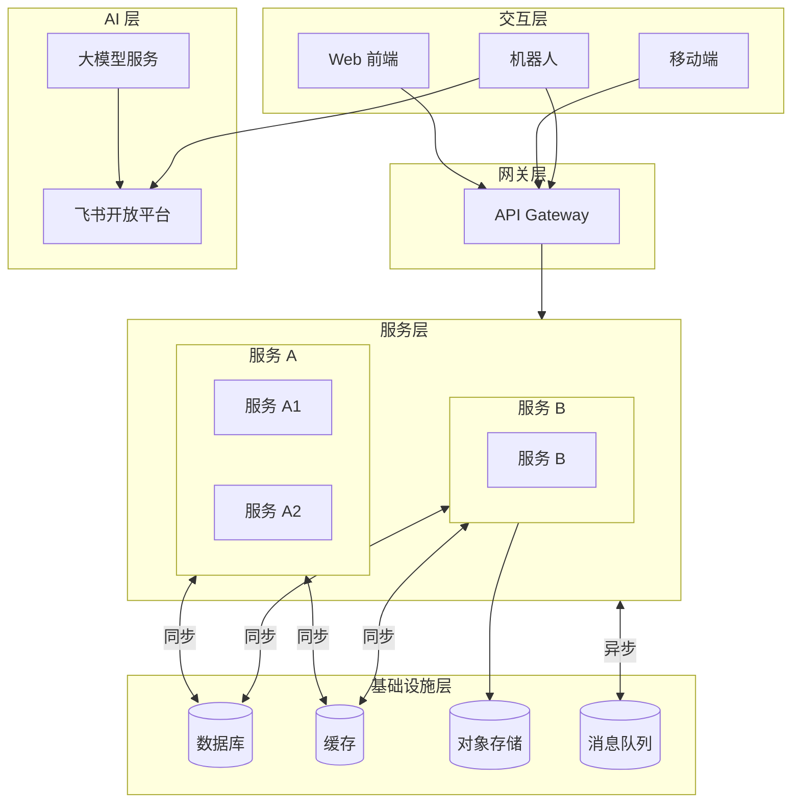

*如：分层说明*

| 层级       | 组件类型                 | 说明             |
| -------- | -------------------- | -------------- |
| 交互层      | Web/App/机器人          | 多端入口           |
| 网关层      | API Gateway          | 统一入口、认证、路由     |
| 服务层      | 微服务/应用服务             | 业务逻辑           |
| 基础设施层    | DB/缓存/对象存储/消息队列      | 持久化 + 异步       |
| AI层      | 大模型服务                | AI能力           |

> **BFF说明**：当存在多端（Web/App/小程序等）且接口数据需求差异大时，引入BFF层做聚合裁剪；MVP阶段可省略，直接由网关路由至服务（模板插图中未体现，详见设计示例）

### 2.3 核心能力矩阵

*核心能力矩阵：系统提供的核心能力与用户场景的对应关系，根据项目实际情况增删*

*如：*

| 核心能力 | 能力说明 | 支撑场景 |
| ---- | ---- | ---- |
| XX管理 | XX   | XX   |
| XX认证 | XX   | XX   |
| XX档案 | XX   | XX   |
| XX记录 | XX   | XX   |
| XX辅助 | XX   | XX   |
| XX报表 | XX   | XX   |

### 2.4 技术全景图

*技术全景图：技术栈总览，根据项目实际情况增删*

*如：*

| 类别   | 技术选型                        | 说明       |
| ---- | --------------------------- | -------- |
| 前端   | Vue 3 / React               | Web框架    |
| 后端   | Java / Node.js / Go         | 根据团队能力选择 |
| 网关   | Spring Cloud Gateway / Kong | 统一入口     |
| 数据库  | MySQL / PostgreSQL          | 关系型存储    |
| 缓存   | Redis                       | 会话/热点数据  |
| 消息队列 | Kafka / RabbitMQ            | 异步通信     |
| 对象存储 | OSS / S3                    | 文件存储     |
| AI   | 大模型API                      | AI能力     |

### 2.5 架构约束与非功能指标

*架构约束：定义架构设计的边界条件和技术约束，根据项目实际情况增删*

*如：*

| 类型  | 约束项    | 指标要求           |
| --- | ------ | -------------- |
| 性能  | 接口响应时间 | P99 < 200ms    |
| 性能  | 并发能力   | 支持 N QPS       |
| 可用性 | SLA    | 99.9%          |
| 可用性 | RTO    | < 30分钟         |
| 安全  | 认证方式   | JWT / OAuth2.0 |
| 安全  | 数据加密   | HTTPS + 字段加密   |

#### 2.5.1 SLA分解

*SLA分解：将整体SLA分解到各服务，根据项目实际情况增删*

*如：*

| 服务    | 可用性目标  | 响应时间        | 隔离要求 |
| ----- | ------ | ----------- | ---- |
| 网关服务  | 99.95% | P99 < 50ms  | 独立部署 |
| 核心服务A | 99.9%  | P99 < 100ms | 高优先级 |
| 辅助服务B | 99.5%  | P99 < 500ms | 可共享  |

#### 2.5.2 扩展点设计

*扩展点设计：预留架构扩展点，支持未来功能扩展，根据项目实际情况增删*

*如：*

| 扩展点  | 位置  | 当前实现   | 扩展方向       |
| ---- | --- | ------ | ---------- |
| 插件机制 | 网关层 | 无      | 未来支持插件加载   |
| 事件总线 | 服务层 | Kafka  | 未来支持多消息中间件 |
| 存储抽象 | 数据层 | MySQL  | 未来支持多数据库   |
| AI能力 | 应用层 | 大模型API | 未来支持多AI供应商 |

### 2.6 关键决策记录（ADR）

*本章记录架构设计过程中的关键决策，后续验收需确认每条ADR已由人确认*

*如：ADR记录表*

| ID      | 决策 | 日期         | 决策人 | 上下文 | 结论 |
| ------- | -- | ---------- | --- | --- | -- |
| ADR-001 | XX | YYYY-MM-DD | 负责人 | XX  | XX |

*如：ADR模板*

```
# ADR-XXX: 决策标题

## 日期
[YYYY-MM-DD]

## 上下文
描述做出此决策的情况和约束条件。

## 决策
描述选择的方案。

## 结论
描述由此产生的影响。
```

***

## 三、业务架构

*业务架构：由业务架构师负责，描述业务能力、领域边界、核心流程、链路设计*

### 3.1 设计原则

*业务设计原则：描述业务设计的指导原则，根据项目实际情况增删*

*如：*

| 设计原则    | 说明          |
| ------- | ----------- |
| 业务按领域划分 | 领域边界清晰，职责单一 |
| 业务流程标准化 | 核心流程统一规范    |
| 业务链路可追溯 | 跨域流程可追踪     |

### 3.2 业务能力地图

*业务能力地图：展示业务能力矩阵，从能力视角描述系统能做什么，根据项目实际情况增删*

#### 3.2.1 业务能力矩阵

*如：*

| 业务域 | 核心职责 | 核心功能 | 关键指标 |
| --- | ---- | ---- | ---- |
| XX域 | 负责XX全生命周期 | XX功能说明 | N    |
| XX域 | 负责XX全生命周期 | XX功能说明 | N    |
| XX域 | 负责XX全生命周期 | XX功能说明 | N    |

#### 3.2.2 领域架构

*领域架构：展示整体业务结构，从业务系统视角绘制，根据项目实际情况增删*

*如：业务领域架构图*

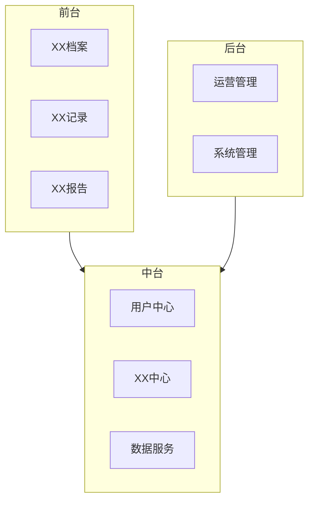

*如：业务域说明*

| 业务域 | 职责 | 包含能力 |
| --- | -- | ---- |
| XX域 | XX | XX能力 |
| XX域 | XX | XX能力 |
| XX域 | XX | XX能力 |

### 3.3 业务限界

*业务限界：明确各领域职责、限界上下文边界及核心领域模型，根据项目实际情况增删*

#### 3.3.1 限界上下文定义

*限界上下文边界定义*

| 限界上下文 | 职责   | 边界说明           |
| ----- | ---- | -------------- |
| XX上下文 | XX职责 | 与YY上下文通过XX接口交互 |
| YY上下文 | YY职责 | -              |

#### 3.3.2 上下文映射关系

*如：上下文映射关系图*

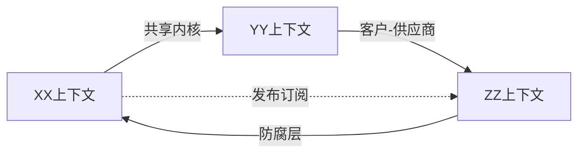

*如：映射关系说明*

| 关系类型   | 说明          | 适用场景   |
| ------ | ----------- | ------ |
| 共享内核   | 两个上下文共享部分模型 | 团队紧密协作 |
| 客户-供应商 | 上游提供接口，下游消费 | 服务调用   |
| 防腐层    | 隔离外部系统影响    | 外部集成   |

#### 3.3.3 领域模型

*核心领域模型*

| 领域模型  | 类型  | 核心属性         | 关键行为                 |
| ----- | --- | ------------ | -------------------- |
| XX聚合根 | 聚合根 | attr1, attr2 | method1(), method2() |
| XX实体  | 实体  | attr1, attr2 | -                    |
| XX值对象 | 值对象 | attr1        | -                    |

#### 3.3.4 业务规则

*如：业务规则定义*

| 规则编号   | 规则描述       | 约束类型 | 影响范围  |
| ------ | ---------- | ---- | ----- |
| BR-001 | XX条件必须满足YY | 业务约束 | XX上下文 |
| BR-002 | XX操作必须记录YY | 审计约束 | 全局    |

### 3.4 核心流程

*核心流程：描述单个业务域内的核心流程，包含业务用例、流程图、前置条件，根据项目实际情况增删*

#### 3.4.1 用例设计

*如：业务用例定义*

| 用例ID   | 用例名称 | 参与者 | 描述 |
| ------ | ---- | --- | -- |
| UC-001 | XX   | 角色A | XX |
| UC-002 | XX   | 角色B | XX |

#### 3.4.2 流程图

*如：流程A：XX流程*

| 用例   | UC-001                |
| ---- | --------------------- |
| 前置条件 | XX                    |
| 后置条件 | XX                    |
| 基本流程 | 1. XX → 2. XX → 3. XX |
| 异常流程 | 2a. XX条件 → 2b. XX     |

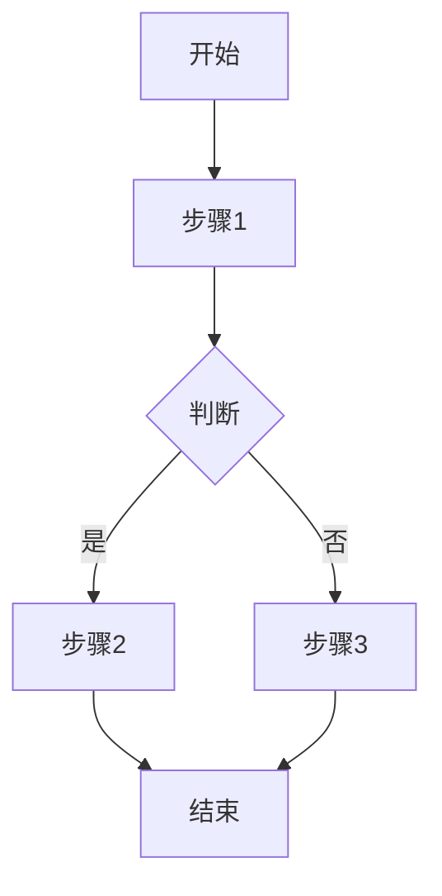

### 3.5 链路设计

*链路设计：描述跨多个业务域的端到端链路，根据项目实际情况增删*

#### 3.5.1 链路定义

*如：链路说明*

| 链路名称 | 起点   | 终点   | 涉及业务域     |
| ---- | ---- | ---- | --------- |
| XX链路 | 业务域A | 业务域C | A → B → C |

*如：链路环节定义*

| 环节  | 业务域  | 说明 |
| --- | ---- | -- |
| 环节1 | 业务域A | XX |
| 环节2 | 业务域B | XX |
| 环节3 | 业务域C | XX |

#### 3.5.2 时序设计

*如：链路时序图*

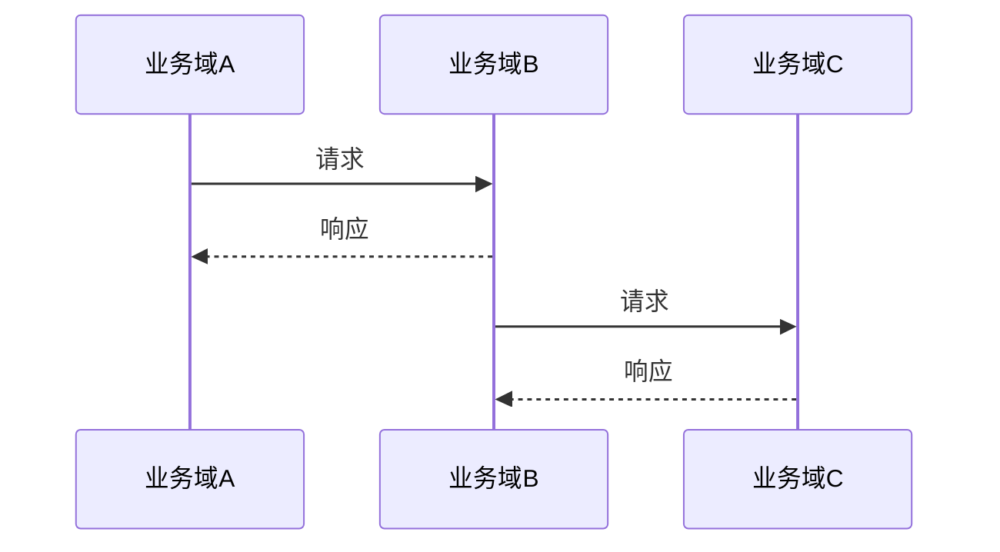

#### 3.5.3 领域事件设计

*领域事件设计：定义跨限界上下文的异步事件，根据项目实际情况增删*

*如：领域事件列表*

| 事件名称            | 触发条件 | 生产者  | 消费者    | 说明      |
| --------------- | ---- | ---- | ------ | ------- |
| XXCreatedEvent  | 创建XX | 上下文A | 上下文B/C | XX创建后通知 |
| XXUpdatedEvent  | 更新XX | 上下文A | 上下文B   | XX变更后通知 |
| XXDisabledEvent | 禁用XX | 上下文A | 上下文B   | 级联禁用    |

*如：领域事件 Schema*

```json
{
  "eventId": "uuid",
  "eventType": "XXCreatedEvent",
  "occurredAt": "2024-01-01T00:00:00Z",
  "aggregateId": "xx-id",
  "payload": {
    "field1": "value1",
    "field2": "value2"
  }
}
```

*如：事件流关系图*

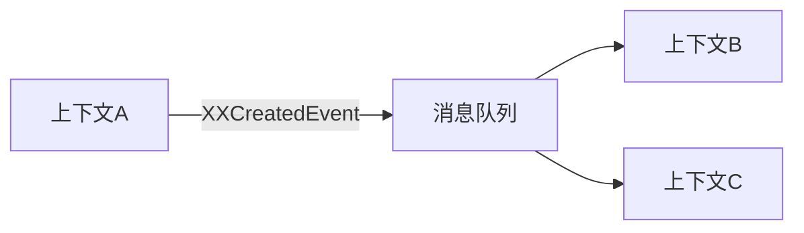

***

## 四、技术架构

*技术架构：约束技术实现和服务划分，作为总纲指导应用架构和部署架构*

### 4.1 技术设计原则

*技术设计原则：描述技术设计的指导原则，根据项目实际情况增删*

*如：*

| 设计原则   | 说明           |
| ------ | ------------ |
| 技术选型务实 | 优先团队熟悉的技术    |
| 服务边界清晰 | 服务职责单一，依赖最小化 |
| 开发规范统一 | 编码、接口、文档标准化  |

### 4.2 架构模式选型

*架构模式：根据业务复杂度与AI赋能程度选择架构形态，AI时代小团队可支撑更大系统规模*

#### 4.2.1 架构形态对比

| 形态    | 演进阶段 | AI赋能 | 服务数 | 数据模式       | 适用场景        |
| ----- | ---- | ---- | --- | ---------- | ----------- |
| 模块化单体 | MVP  | 弱    | 1   | 共享库+租户标识   | 快速验证、业务单一   |
| 渐进拆分  | 成长期  | 中    | 2-4 | 共享库+Hint路由 | 业务增长、边界清晰   |
| 微服务   | 成熟期  | 强    | ≥5  | 独立库        | 大客户、高可用、高隔离 |

#### 4.2.2 架构模式决策树

> **AI时代假设**：AI可赋能代码生成、测试、部署、运维，小团队可支撑更大系统

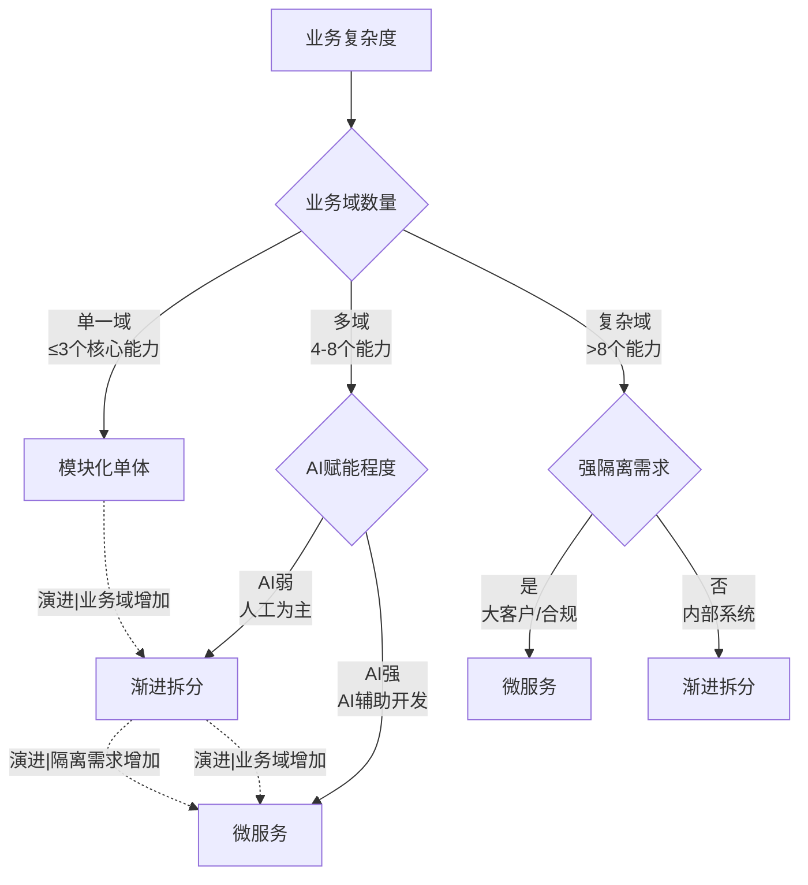

#### 4.2.3 架构模式说明

*如：*

##### 模块化单体

| 维度   | 说明                        |
| ---- | ------------------------- |
| 特征   | 单一部署单元，内部模块化拆分            |
| 优势   | 快速交付、简化运维、调试方便            |
| 约束   | 模块间禁止直接跨层调用，通过接口交互        |
| 演进触发 | 业务域增加（>3个核心能力）或构建时间>10min |

##### 渐进拆分

| 维度   | 说明                        |
| ---- | ------------------------- |
| 特征   | 单体内部模块逐步独立为服务             |
| 优势   | 风险可控、按需拆分、AI辅助迁移          |
| 约束   | 优先拆分边界清晰、独立域的服务           |
| 演进触发 | 某模块变更频繁 或 独立扩缩容需求 或 团队>3人 |

##### 微服务

| 维度   | 说明                       |
| ---- | ------------------------ |
| 特征   | 服务独立部署，数据自治              |
| 优势   | 技术异构、独立扩展、AI驱动自动化运维      |
| 约束   | 服务数由业务边界和AI运维能力决定，避免服务过细 |
| 演进触发 | 大客户需求 或 强隔离要求 或 多团队协作    |

#### 4.2.4 服务通信模式

*服务通信模式：描述服务间同步/异步通信方式，可与任意架构形态组合*

| 模式   | 说明      | 适用场景      | 技术选型            |
| ---- | ------- | --------- | --------------- |
| 同步调用 | 请求-响应模式 | 实时交互、强一致性 | REST/gRPC/Feign |
| 异步消息 | 发布-订阅模式 | 解耦、削峰填谷   | Kafka/RabbitMQ  |
| 事件驱动 | 事件触发响应  | 跨域协同、最终一致 | 事件溯源/CQRS       |

> **事件驱动说明**：事件驱动是一种通信模式，可与任意架构形态（单体/微服务）组合使用，实现服务间松耦合

#### 4.2.5 技术栈对应关系

*如：*

| 架构形态  | Java 技术栈                 | Node.js 技术栈       |
| ----- | ------------------------ | ----------------- |
| 模块化单体 | Spring Boot 单模块          | Hono 单服务          |
| 渐进拆分  | Spring Cloud 多模块         | 独立 Hono 服务        |
| 微服务   | Spring Cloud 微服务 + Feign | 独立 Hono 服务 + 消息队列 |

### 4.3 技术选型约束

*技术选型约束：约束技术栈选择原则，根据项目实际情况增删*

*如：*

| 类别   | 选择原则    | 约束说明          |
| ---- | ------- | ------------- |
| 后端语言 | 主流、团队熟悉 | 禁止使用团队不熟悉的技术栈 |
| 前端框架 | 生态成熟    | Vue 或 React   |
| 数据存储 | 按需选择    | 关系型/缓存/对象存储   |
| 消息队列 | 异步解耦    | 按业务需求引入       |

### 4.4 服务划分原则

*服务划分原则：约束服务拆分边界，根据项目实际情况增删*

*如：*

| 原则    | 说明          |
| ----- | ----------- |
| 单一职责  | 每个服务聚焦特定业务域 |
| 数据自治  | 服务仅管理自身核心数据 |
| 依赖最小化 | 仅依赖核心必要服务   |

### 4.5 技术开发规范

*技术开发规范：约束开发规范、接口规范等，根据项目实际情况增删*

*如：*

**接口规范**

| 规范      | 说明             |
| ------- | -------------- |
| RESTful | 统一资源路径、HTTP 方法 |
| 版本管理    | URL 中包含版本号     |
| 错误码     | 统一错误码规范        |

**API设计原则**

| 原则  | 说明                             |
| --- | ------------------------------ |
| 幂等性 | GET/DELETE 天然幂等，POST/PUT 需业务保证 |
| 限流  | 全局限流 + 服务级限流                   |
| 超时  | 默认超时 30s，可配置                   |
| 重试  | 最多重试 3 次，指数退避                  |

**开发规范**

| 规范   | 说明          |
| ---- | ----------- |
| 命名规范 | 类/方法/变量命名规则 |
| 代码审查 | PR 必须经过审查   |
| 文档规范 | 接口必须文档化     |

### 4.6 技术栈版本管理

*技术栈版本管理：定义技术组件的版本策略和升级计划，根据项目实际情况增删*

*如：*

| 组件          | 当前版本  | 目标版本     | 升级策略  | 计划时间 |
| ----------- | ----- | -------- | ----- | ---- |
| JDK         | 17    | 21       | 跟随LTS | Q3   |
| Spring Boot | 3.2.x | 3.4.x    | 滚动升级  | Q2   |
| Node.js     | 18.x  | 20.x LTS | 跟随LTS | Q3   |

### 4.7 技术债务与风险

*技术债务与风险：记录已知技术债务和选型风险，根据项目实际情况增删*

#### 4.7.1 技术债务

*如：*

| 债务项   | 描述       | 影响   | 修复成本 | 优先级 |
| ----- | -------- | ---- | ---- | --- |
| 遗留代码  | XX模块未重构  | 难以扩展 | 中    | P2  |
| 技术过时的 | XX依赖停止维护 | 安全风险 | 高    | P1  |

#### 4.7.2 技术选型风险

*如：*

| 风险项   | 描述         | 概率 | 影响 | 缓解措施  |
| ----- | ---------- | -- | -- | ----- |
| 供应商锁定 | XX组件替换成本高  | 中  | 中  | 抽象接口  |
| 人才稀缺  | XX技术团队不熟悉  | 高  | 中  | 培训+招聘 |
| 版本断层  | XX升级可能破坏兼容 | 低  | 高  | 充分测试  |

***

## 五、数据架构

*数据架构：数据结构设计、存储选型、物理模型、隔离、一致性、安全、备份*

### 5.1 数据设计原则

*数据设计原则：描述数据设计指导原则，根据项目实际情况增删*

*如：*

| 设计原则      | 说明          |
| --------- | ----------- |
| 数据按租户隔离   | 平台级与租户级数据分离 |
| 数据按生命周期管理 | 归档、清理策略     |
| 数据按敏感性分级  | 敏感数据加密存储    |

### 5.2 存储技术选型

*存储技术选型：基于数据结构选择存储技术，根据项目实际情况增删*

*如：*

| 类型     | 选型    | 说明      |
| ------ | ----- | ------- |
| 关系型数据库 | MySQL | 业务数据    |
| 缓存     | Redis | 热点数据、会话 |
| 对象存储   | OSS   | 文件、图片   |

### 5.3 物理模型设计

*物理模型设计：基于存储选型落地物理格式定义，根据项目实际情况增删*

*如：*

| 表/模型 | 存储类型  | 说明     |
| ---- | ----- | ------ |
| XX表  | MySQL | XX业务数据 |
| XX缓存 | Redis | XX热点数据 |

### 5.4 多租户隔离

*多租户隔离：租户数据隔离策略，根据项目实际情况增删*

*如：*

| 隔离级别 | 方案         | 适用场景    |
| ---- | ---------- | ------- |
| 逻辑隔离 | 共享库 + 租户标识 | 初期、通用场景 |
| 物理隔离 | 独立库        | 高合规、高安全 |

### 5.5 事务一致性

*事务一致性：分布式事务处理方案，根据项目实际情况增删*

*如：*

| 场景    | 方案    | 说明     |
| ----- | ----- | ------ |
| 分布式事务 | 最终一致性 | 补偿机制   |
| 幂等设计  | 唯一键   | 防止重复提交 |

### 5.6 数据安全防护

*数据安全防护：数据加密、访问控制等，根据项目实际情况增删*

*如：*

| 安全措施 | 说明        |
| ---- | --------- |
| 传输加密 | HTTPS/TLS |
| 存储加密 | 敏感字段加密    |
| 访问控制 | 租户数据权限    |

### 5.7 备份恢复策略

*备份恢复策略：数据备份与恢复方案，根据项目实际情况增删*

*如：*

| 策略   | 说明   |
| ---- | ---- |
| 全量备份 | 每日全量 |
| 增量备份 | 实时增量 |
| 恢复演练 | 定期验证 |

### 5.8 数据治理

*数据治理：数据标准、元数据管理、数据质量管理，根据项目实际情况增删*

#### 5.8.1 数据标准

*如：数据命名规范*

| 对象  | 命名规则           | 示例                      |
| --- | -------------- | ----------------------- |
| 表名  | 小写下划线分隔，tb\_前缀 | tb\_member\_info        |
| 字段名 | 小写下划线分隔        | member\_id, created\_at |
| 索引名 | idx\_表名\_字段    | idx\_member\_mobile     |
| 主键  | pk\_表名         | pk\_member              |

#### 5.8.2 元数据管理

*如：*

| 维度     | 说明               |
| ------ | ---------------- |
| 表级元数据  | 表名、注释、创建时间、更新时间  |
| 字段级元数据 | 字段名、类型、长度、默认值、注释 |
| 数据血缘   | 上游来源、下游消费、ETL链路  |

#### 5.8.3 数据质量

*如：数据质量规则*

| 规则  | 说明       | 监控指标      |
| --- | -------- | --------- |
| 完整性 | 非空约束、空值率 | 空值率<1%    |
| 唯一性 | 主键唯一、无重复 | 重复率=0     |
| 一致性 | 关联数据一致   | 跨表一致率>99% |
| 时效性 | 数据更新及时   | 延迟<5min   |

### 5.9 数据生命周期

*数据生命周期：数据从产生到销毁的完整周期管理，根据项目实际情况增删*

*如：数据分层策略*

| 层级  | 温度 | 存储介质   | 保留周期    | 说明   |
| --- | -- | ------ | ------- | ---- |
| 热数据 | 热  | SSD/内存 | 0-7天    | 频繁访问 |
| 温数据 | 温  | 普通磁盘   | 8-90天   | 低频访问 |
| 冷数据 | 冷  | 对象存储   | 91-365天 | 归档保留 |
| 冻结  | 冻结 | 低成本存储  | >1年     | 合规要求 |

*如：归档策略*

| 类型   | 触发条件  | 归档方式    | 说明   |
| ---- | ----- | ------- | ---- |
| 自动归档 | 超过保留期 | 压缩后转冷存储 | 节省成本 |
| 手动归档 | 业务需要  | 导出指定数据  | 按需执行 |
| 销毁   | 超生命周期 | 安全擦除    | 不可恢复 |

***

## 六、应用架构

*应用架构：服务细化落地，结合业务架构、技术架构、数据架构*

### 6.1 设计原则

*设计原则：聚焦领域技术落地，微服务分而治之，DDD高内聚低耦合*

*如：*

| 设计原则      | 说明           |
| --------- | ------------ |
| 服务分而治之    | 微服务架构，独立部署   |
| DDD高内聚低耦合 | 限界上下文划分，职责单一 |
| 接口契约驱动    | 服务间通过接口交互    |

### 6.2 XX服务设计

*服务设计：每个服务包含职责边界、领域模型、应用逻辑、接口契约*

#### 6.2.1 服务职责边界

*如：*

| 服务   | 职责   | 边界说明               |
| ---- | ---- | ------------------ |
| XX服务 | XX职责 | 负责XX，与YY服务通过XX接口交互 |

#### 6.2.2 领域模型设计

*如：*

| 领域模型  | 类型  | 说明     |
| ----- | --- | ------ |
| XX聚合根 | 聚合根 | XX聚合的根 |
| XX实体  | 实体  | 有唯一标识  |
| XX值对象 | 值对象 | 不可变    |

#### 6.2.3 应用逻辑设计

*如：*

| 用例   | 说明       |
| ---- | -------- |
| XX用例 | 描述XX业务流程 |

#### 6.2.4 接口契约设计

*如：*

| 接口      | 请求        | 响应         | 说明   |
| ------- | --------- | ---------- | ---- |
| /api/xx | XXRequest | XXResponse | XX接口 |

### 6.3 服务间依赖

*服务间依赖：描述服务间依赖关系*

*如：*


---

## 七、部署架构

*部署架构：计算架构、容器编排、部署策略、网络架构、服务治理、高可用设计*

### 7.1 计算架构

*计算架构：基础设施选型、资源配置、环境划分，根据项目实际情况增删*

*如：*

| 维度      | 选择        | 说明             |
| ------- | --------- | -------------- |
| 基础设施类型  | 容器（K8s）   | 云原生、弹性扩展、快速迭代    |
| 资源配置    | 见下表       | 按服务类型差异化配置     |
| 环境划分    | dev/staging/prod | 隔离部署、独立运维        |

*资源配置示例*

| 服务类型   | CPU  | 内存    | 存储    | 副本数  |
| ------ | ---- | ----- | ----- | ---- |
| 微服务   | 0.5~2核 | 512M~2G | 不持久化 | 2~3   |
| 有状态服务  | 1~4核  | 1~4G   | 20~100G | 2    |
| 前端/BFF | 0.25~1核 | 256M~512M | 不持久化 | 2    |

### 7.2 容器编排

*容器编排：K8s 集群架构、命名空间划分、资源配额，根据项目实际情况增删*

*如：*

#### 7.2.1 集群架构

| 组件     | 规格              | 说明        |
| ------ | --------------- | --------- |
| K8s 版本  | 1.28+            | 跟进 LTS 版本  |
| Master  | 3 节点（高可用）       | 控制面高可用     |
| Worker  | 按需扩展            | 计算面弹性扩缩    |
| 网络插件   | Calico/Cilium     | CNI 插件     |
| 存储插件   | CSI（云盘/NFS）      | 动态存储供给     |

#### 7.2.2 命名空间划分

| 命名空间     | 用途        | 隔离策略            |
| -------- | --------- | ---------------- |
| dev      | 开发环境     | 独立集群或命名空间隔离   |
| staging  | 预发布环境    | 与生产环境配置一致     |
| prod     | 生产环境     | 生产级配置、高可用      |
| infra    | 基础设施组件   | 监控、日志、服务网格控制面 |

#### 7.2.3 资源配额

| 类型       | 策略              | 说明       |
| -------- | --------------- | -------- |
| ResourceQuota | 命名空间级 CPU/内存上限   | 防止资源超售   |
| LimitRange   | Pod/Container 默认限制   | 防止单个容器耗尽资源 |
| NetworkPolicy | Pod 间网络访问控制      | 最小权限原则   |

### 7.3 部署策略

*部署策略：发布方式、扩缩容、回滚机制，根据项目实际情况增删*

*如：*

| 类型     | 方案             | 说明              |
| ------ | -------------- | --------------- |
| 发布方式   | 滚动发布（RollingUpdate） | 默认策略，蓝绿/金丝雀按需引入 |
| 扩缩容    | K8s HPA         | 基于 CPU/内存/自定义指标   |
| 健康检查   | Liveness/Readiness Probe | 故障自愈、滚动安全       |
| 回滚机制   | K8s Revision 历史   | 一键回滚到上一版本        |

### 7.4 网络架构

*网络架构：VPC/安全域划分、流量走向、访问控制策略，根据项目实际情况增删*

*如：*

| 区域      | 说明           | 访问控制        |
| ------- | ------------ | ----------- |
| 边缘网络    | CDN、SLB、WAF    | 外网入口，最小暴露   |
| 入口网关    | API Gateway     | 认证、限流、路由    |
| 业务命名空间  | K8s Namespace   | 东西向流量隔离     |
| 基础设施网络  | DB/Redis/Kafka   | 不对外暴露，仅 K8s 内 |

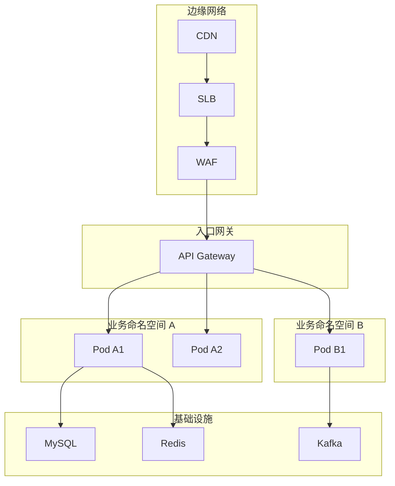

### 7.5 服务治理

*服务治理：服务发现、流量管理、可观测性，根据项目实际情况增删*

*如：*

| 类型     | 方案              | 说明           |
| ------ | --------------- | ------------ |
| 服务注册发现 | K8s Service + DNS | Pod 自动注册/注销  |
| 流量管理   | K8s Service + Ingress | 负载均衡、灰度发布   |
| 链路追踪   | OpenTelemetry + Jaeger | 端到端追踪        |
| 指标监控   | Prometheus + Grafana | metrics 可视化   |
| 日志收集   | Promtail + Loki     | 日志聚合         |
| 告警通知   | AlertManager + 飞书  | 实时告警         |

### 7.6 高可用设计

*高可用设计：服务无单点、多可用区部署、业务容灾，根据项目实际情况增删*

*如：*

| 目标     | 方案                            |
| ------ | ----------------------------- |
| 计算高可用  | K8s HPA/VPA，多副本分散 AZ          |
| 网络高可用  | SLB 多可用区、K8s Ingress 流量策略   |
| 数据库高可用 | MySQL MGR/RDS 主从自动切换          |
| 缓存高可用  | Redis Cluster / 主从 + Sentinel |
| 消息高可用  | Kafka 副本因子 3，ISR 机制           |
| 存储高可用  | PV/PVC + 云盘快照                 |
| 故障自愈   | K8s Liveness/Readiness Probe  |

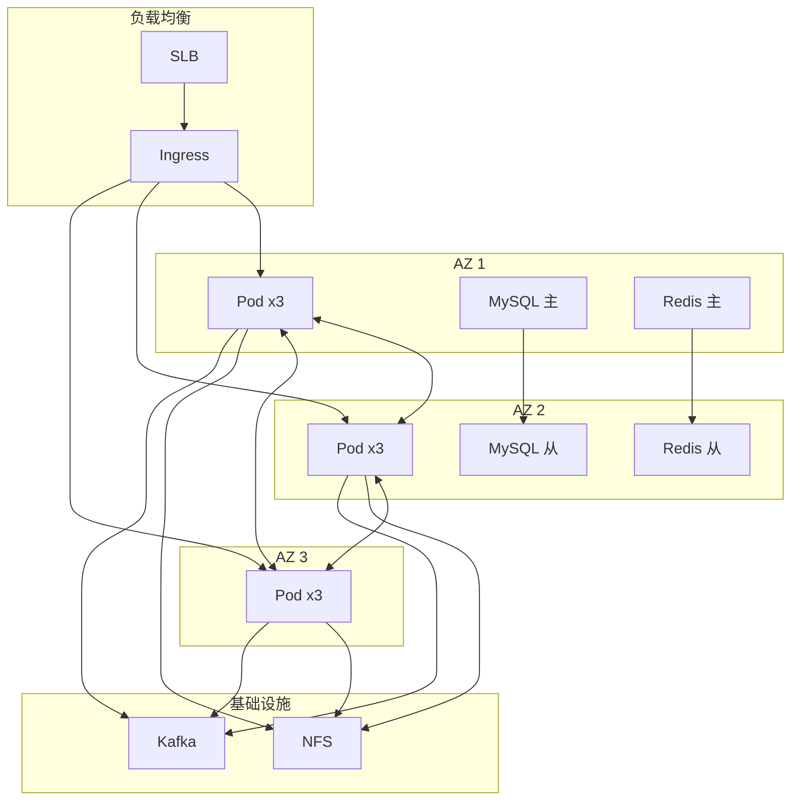

***

## 八、非功能性设计

*非功能性设计：可靠性、安全、可观测性、性能、成本*

### 8.1 可靠性设计

*可靠性设计：SLA/SLO、容灾、故障恢复，根据项目实际情况增删*

*如：*

| 指标   | 目标      | 说明             |
| ---- | ------- | -------------- |
| SLA  | 99.95%  | 年度停机 < 4.38 小时 |
| RTO  | < 30 分钟 | 恢复时间目标         |
| RPO  | < 5 分钟  | 恢复点目标          |
| MTTR | < 1 小时  | 平均恢复时间         |

*如：*

| 场景           | 方案             |
| ------------ | -------------- |
| 服务故障         | K8s 自动重启、多副本漂移 |
| AZ 故障        | 跨 AZ 部署、流量切换   |
| 数据库故障        | MySQL MGR 自动选主 |
| 缓存故障         | Redis 哨兵自动切换   |
| 整体 Region 故障 | 异地容灾、流量切换      |

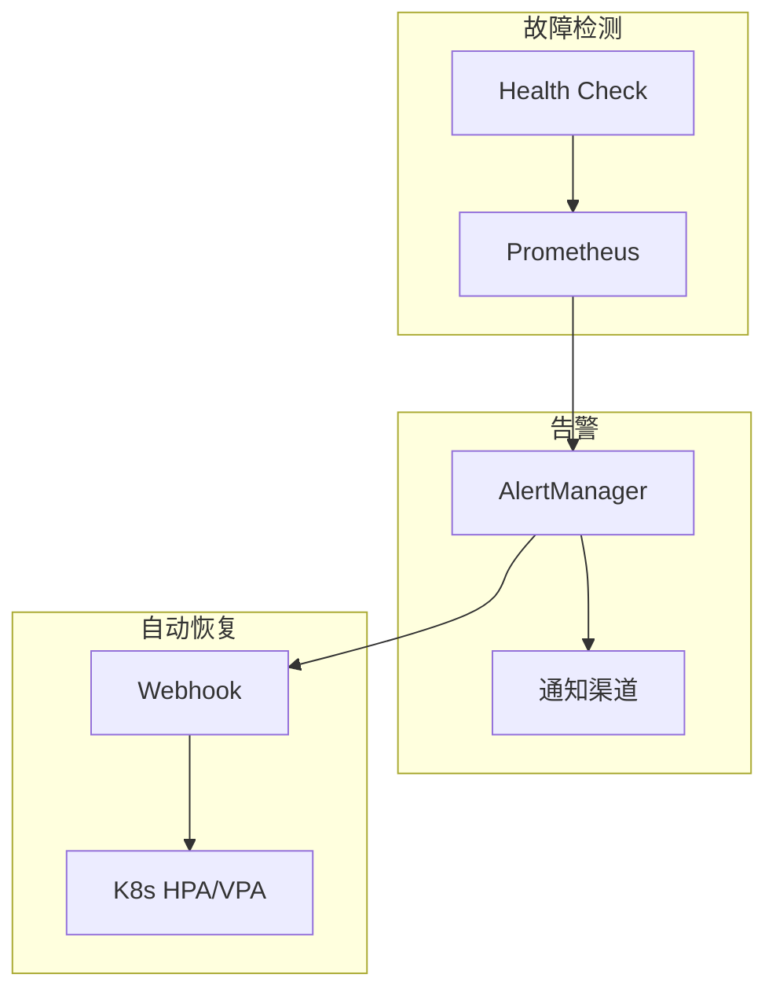

### 8.2 安全性设计

*安全性设计：身份认证、授权控制、数据加密，根据项目实际情况增删*

*如：*

| 层次   | 措施                  | 说明         |
| ---- | ------------------- | ---------- |
| 身份认证 | JWT Token           | 统一身份认证     |
| 授权控制 | PBAC / RBAC         | 基于策略/角色的访问控制 |
| 数据传输 | HTTPS + TLS 1.3     | 全链路加密      |
| 数据存储 | 字段级加密 + 脱敏        | 敏感数据保护     |
| 日志审计 | 操作日志 + 审计          | 完整审计链      |

### 8.3 可观测性设计

*可观测性设计：指标、日志、链路追踪，详见 7.5 服务治理，本节仅补充告警规则示例*

*如：*

| 级别   | 触发条件              | 通知方式   | 处理要求    |
| ---- | ----------------- | ------ | ------- |
| P1   | 服务不可用 > 5min      | 立即通知   | 紧急响应    |
| P2   | 错误率 > 5% 或延迟 > 1s | 30min 内  | 尽快处理    |
| P3   | 资源使用 > 80%        | 工作时间通知 | 计划处理    |

### 8.4 性能设计

*性能设计：响应时间、并发、弹性伸缩，根据项目实际情况增删*

*如：*

| 指标       | 目标      | 说明           |
| -------- | ------- | ------------ |
| 接口响应 P99 | < 200ms | 核心接口 99 分位   |
| 并发能力     | N QPS   | 支持 N 并发请求    |
| 弹性伸缩     | < 60s   | 从 0 到 N 副本时间 |

*如：*

| 策略   | 方案                |
| ---- | ----------------- |
| 水平扩展 | K8s HPA 基于 CPU/内存 |
| 垂直扩展 | VPA 基于资源使用率       |
| 缩容策略 | 冷却时间 + 最小副本数      |
| 预热   | 定时扩副本 + 探针预热      |

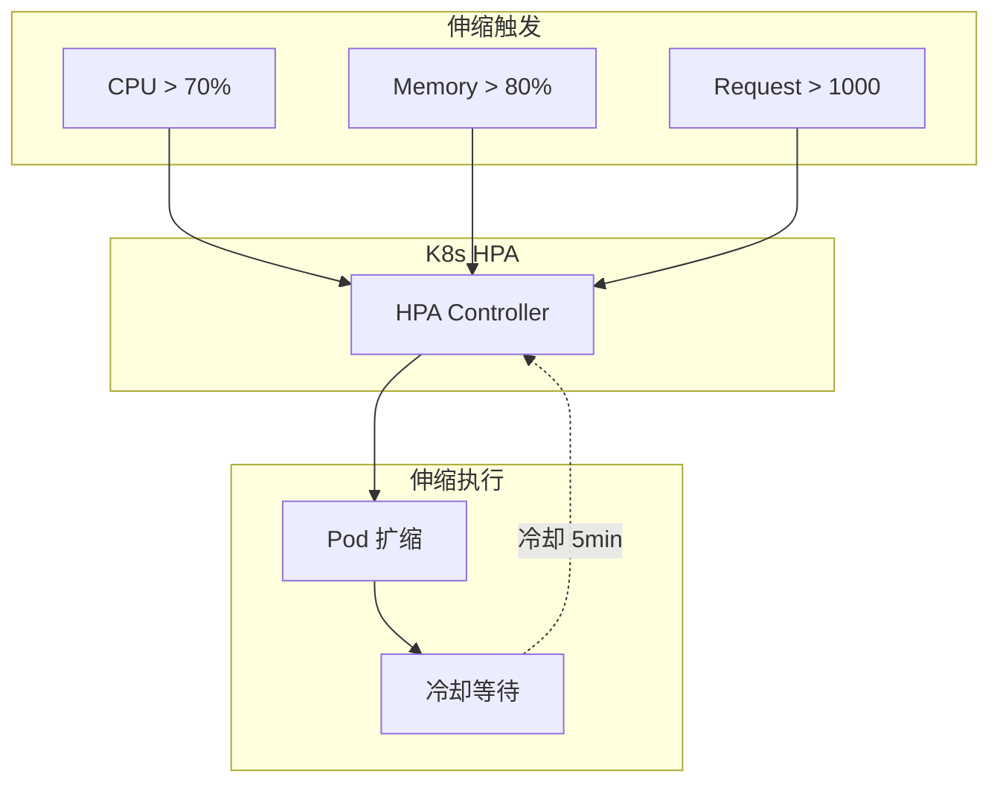

### 8.5 可维护性设计

*可维护性设计：架构可演进性、代码可读性、文档完整性，根据项目实际情况增删*

*如：*

| 维度     | 目标           | 措施                |
| ------ | ------------ | ----------------- |
| 架构可演进性 | 低耦合、高内聚     | 领域驱动设计、服务边界清晰    |
| 代码可读性 | 新人 1 周内可上手  | 统一编码规范、代码审查、单元测试 |
| 文档完整性 | 代码即文档        | API 文档化、架构图更新、CHANGELOG |
| 故障可追溯性 | 5min 内定位问题   | 日志规范、链路追踪、指标面板   |

### 8.6 成本优化

*成本优化：资源利用率、按需付费，根据项目实际情况增删*

*如：*

| 策略      | 方案                             |
| ------- | ------------------------------ |
| 资源配额    | K8s ResourceQuota + LimitRange |
| 弹性伸缩    | 按需扩缩，峰值时扩容，闲时缩容                |
| Spot 实例 | 非核心组件使用 Spot/ preemptible      |
| 存储分层    | 热数据 SSD，温数据 HDD，冷数据归档          |
| 预留资源    | 核心组件购买预留实例                     |

***

## 九、风险与应对

*风险与应对：风险矩阵、失效模式分析、业务连续性、事件响应*

### 9.1 风险矩阵

*失效模式分析：识别组件失效模式、影响、应对措施，根据项目实际情况增删*

*如：*

| 组件          | 失效模式 | 影响    | 严重度 | 概率 | 检测          | 应对措施               |
| ----------- | ---- | ----- | --- | -- | ----------- | ------------------ |
| API Gateway | 响应超时 | 服务不可用 | 高   | 中  | 健康检查        | 多副本 + SLB          |
| MySQL       | 主从切换 | 写入失败  | 高   | 低  | 主从延迟监控      | MGR 自动选主           |
| Redis       | 节点宕机 | 缓存穿透  | 中   | 中  | 哨兵监控        | Redis Cluster 故障转移 |
| Kafka       | 消息积压 | 消费延迟  | 中   | 低  | Lag 监控      | 消费者扩容              |
| Pod         | OOM  | 服务重启  | 中   | 高  | Liveness 检查 | 资源限制 + HPA         |
| 网络分区        | 服务断连 | 调用超时  | 高   | 低  | 网络监控        | 熔断 + 重试            |

### 9.2 失效模式分析（FMEA）

*风险矩阵：根据概率和影响评估风险等级，根据项目实际情况增删*

*如：*

| 风险          | 概率 | 影响 | 等级 | 缓解措施          |
| ----------- | -- | -- | -- | ------------- |
| 微服务拆分过细     | 中  | 中  | 中  | 服务合并、Api Join |
| 分布式事务一致性    | 中  | 高  | 高  | 可靠消息 + 最终一致   |
| 级联故障        | 低  | 高  | 中  | 熔断降级、隔离舱      |
| 租户数据泄露      | 低  | 极高 | 高  | 严格 RBAC、审计日志  |
| Region 级别故障 | 极低 | 极高 | 中  | 异地容灾          |
| 密钥泄露        | 低  | 极高 | 高  | Vault 集中管理、轮换 |

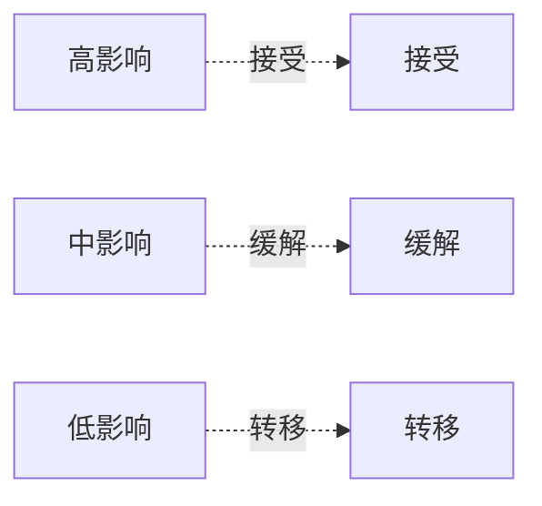

### 9.3 业务连续性（BCP/DR）

*业务连续性：RTO/RPO、切换流程、演练计划，根据项目实际情况增删*

*如：*

| 指标   | 目标      | 说明       |
| ---- | ------- | -------- |
| RTO  | < 30 分钟 | 恢复时间目标   |
| RPO  | < 5 分钟  | 恢复点目标    |
| MTTD | < 5 分钟  | 平均故障检测时间 |
| MTTR | < 30 分钟 | 平均恢复时间   |

*如：*

| 场景        | 切换流程          | 负责人      |
| --------- | ------------- | -------- |
| 单 Pod 故障  | K8s 自动重启      | 自动       |
| AZ 故障     | SLB 切到健康 AZ   | 运维       |
| 数据库故障     | MGR 自动选主      | 自动       |
| Region 故障 | DNS 切换 + 流量切换 | 运维 + SRE |

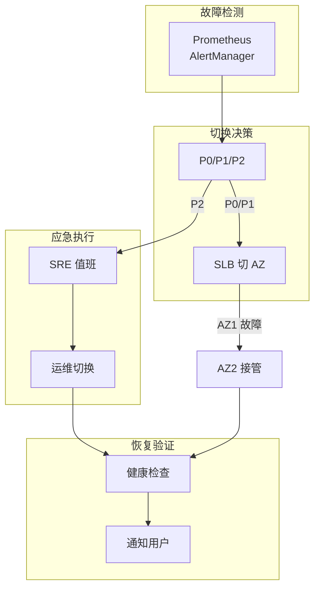

### 9.4 事件响应

*事件响应：响应流程、升级机制、复盘改进，根据项目实际情况增删*

*如：*

| 级别 | 定义     | 响应时间  | 升级条件     | 通知      |
| -- | ------ | ----- | -------- | ------- |
| P0 | 核心业务中断 | 5 分钟  | 10 分钟未恢复 | 电话 + 短信 |
| P1 | 重要功能受损 | 15 分钟 | 30 分钟未恢复 | 钉钉 + 邮件 |
| P2 | 非核心异常  | 1 小时  | 4 小时未恢复  | 邮件      |

*如：*

| 阶段 | 操作       | 说明      |
| -- | -------- | ------- |
| 发现 | 告警触发     | 自动/用户反馈 |
| 响应 | 值班接单     | P0 电话通知 |
| 止血 | 熔断/回滚    | 快速止血    |
| 定位 | 日志/链路追踪  | 根因分析    |
| 修复 | 代码/配置变更  | 灰度发布    |
| 复盘 | 48h 内复盘会 | 改进措施    |

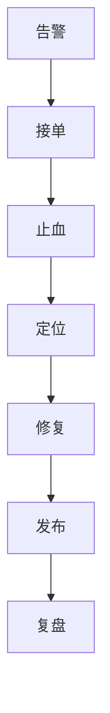

***

## 十、架构演进规划

*架构演进规划：演进阶段、迁移策略、触发条件、扩展边界*

### 10.1 演进阶段

*演进阶段：架构随业务发展渐进演进，根据项目实际情况增删*

*如：*

| 阶段  | 架构形态         | 特征        | 适用场景 |
| --- | ------------ | --------- | ---- |
| MVP | 单体/模块化       | 快速交付、团队小  | 初期验证 |
| 成长期 | 模块解耦 + 读写分离  | 服务拆分、独立部署 | 业务增长 |
| 成熟期 | 微服务化 + 多租户隔离 | 高可用、弹性扩展  | 大型客户 |

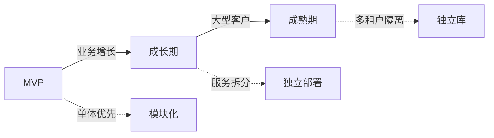

**真实演进案例**：

| 时间      | 服务数 | 决策         | 原因              |
| ------- | --- | ---------- | --------------- |
| 第 1 个月  | 1   | 单体不拆分      | MVP 快速验证，团队 3 人 |
| 第 3 个月  | 2   | 拆分用户服务     | 认证独立，用户相关需求多    |
| 第 6 个月  | 4   | 拆租户+健康档案服务 | 业务域清晰，团队 6 人    |
| 第 12 个月 | 8   | 微服务化 + 多租户 | 大客户需求，团队 15 人   |

### 10.2 迁移策略

*迁移策略：新旧系统过渡、渐进替换，根据项目实际情况增删*

*如：*

| 策略            | 说明               | 适用场景    |
| ------------- | ---------------- | ------- |
| Strangler Fig | 边拦截请求边迁移，逐步替换旧模块 | 单体拆分微服务 |
| 插件式替换         | 新模块作为插件接入，流量逐步切换 | 技术栈升级   |
| 特征开关          | 通过开关控制新旧功能，灰度验证  | 功能重构    |

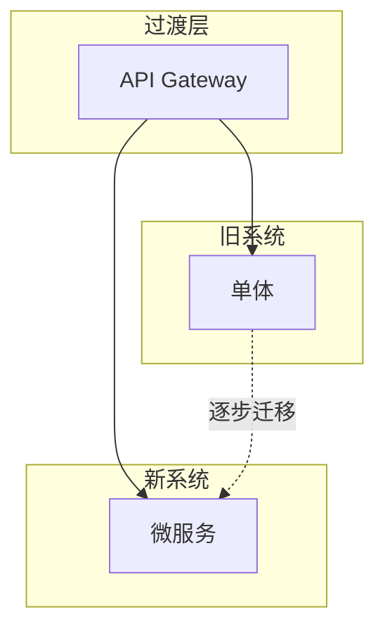

### 10.3 演进触发

*演进触发：识别何时需要演进，根据项目实际情况增删*

*如：*

| 触发条件   | 指标           | 应对          |
| ------ | ------------ | ----------- |
| 团队规模增长 | > 5 人/服务     | 服务拆分，独立团队   |
| 代码腐化   | 构建时间 > 10min | 重构/拆分       |
| 租户数据增长 | 单库 > 100 万行  | Hint 路由/独立库 |
| 性能瓶颈   | P99 > 500ms  | 读写分离/缓存     |
| 技术债积累  | 依赖版本停止维护     | 升级/替换       |

### 10.4 扩展边界

*扩展边界：何时拆服务、何时合服务，根据项目实际情况增删*

*如：*

| 决策  | 条件                 | 行动                   |
| --- | ------------------ | -------------------- |
| 拆服务 | 独立域变更频率高、团队 > 3 人  | 按 Bounded Context 拆分 |
| 拆服务 | 资源需求差异大（CPU/内存/IO） | 独立服务 + 独立扩缩          |
| 合服务 | 跨域调用频繁、数据一致性强      | Api Join / 合并服务      |
| 合服务 | 服务间依赖过深、部署复杂       | 合并减少网络跳数             |

### 10.5 演进验收

*演进验收：定义每个阶段的验收标准/成功条件，根据项目实际情况增删*

*如：*

| 阶段  | 验收指标                                              |
| --- | --------------------------------------------------- |
| MVP | 功能完成、核心链路跑通、单元测试覆盖率 > 50%                          |
| 成长期 | 性能 P99 < 200ms、监控告警完善、自动化部署                         |
| 成熟期 | SLA 99.9%、多AZ容灾、安全审计通过、业务连续性演练通过                 |
