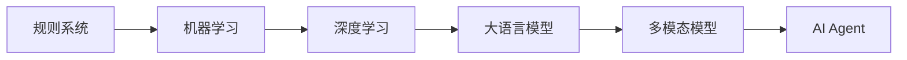
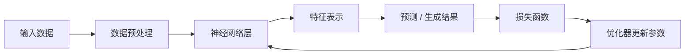
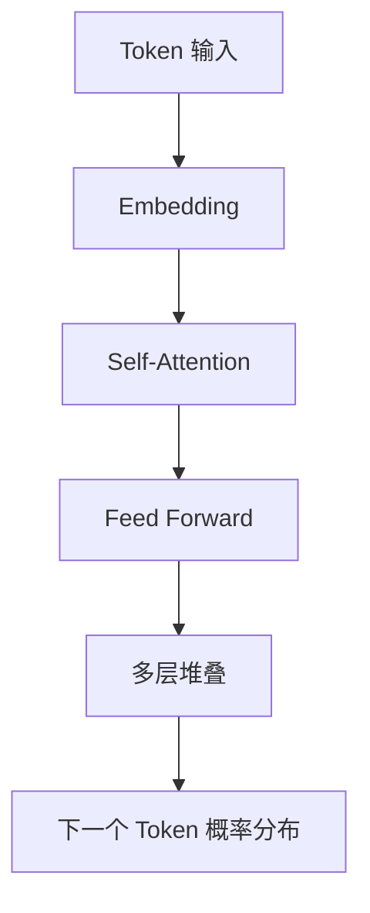
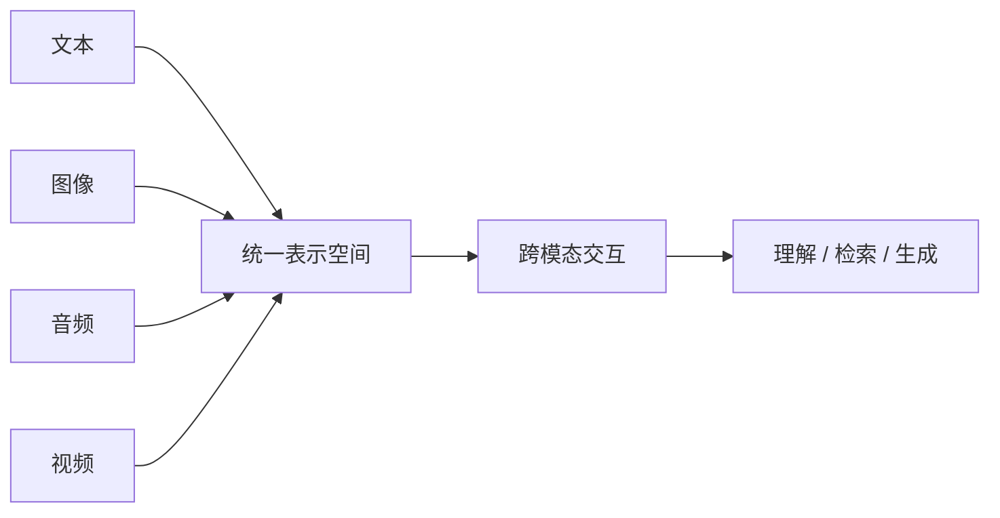
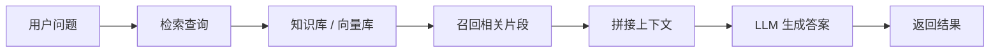
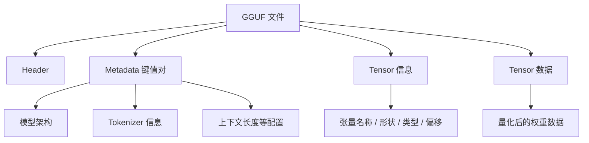
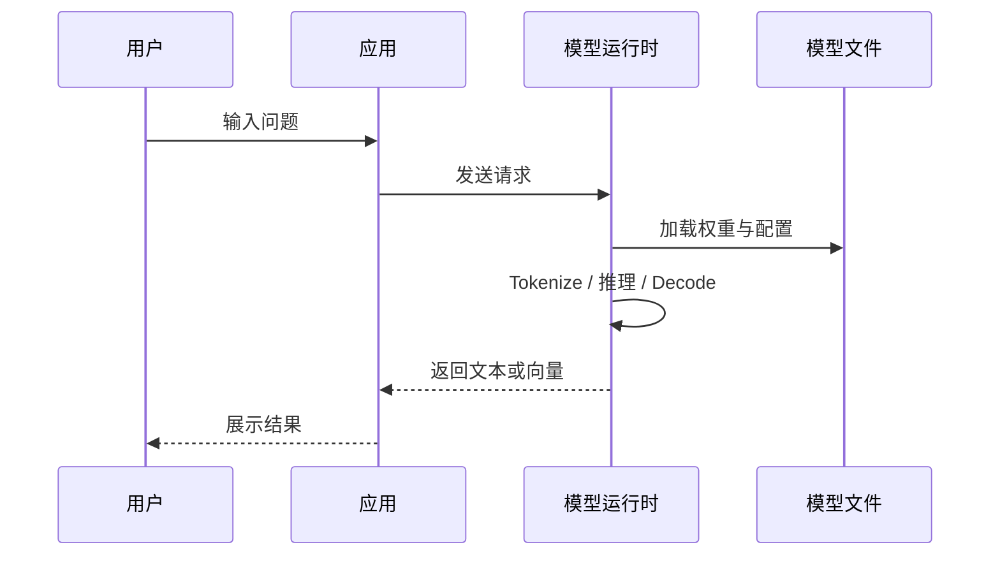
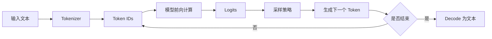
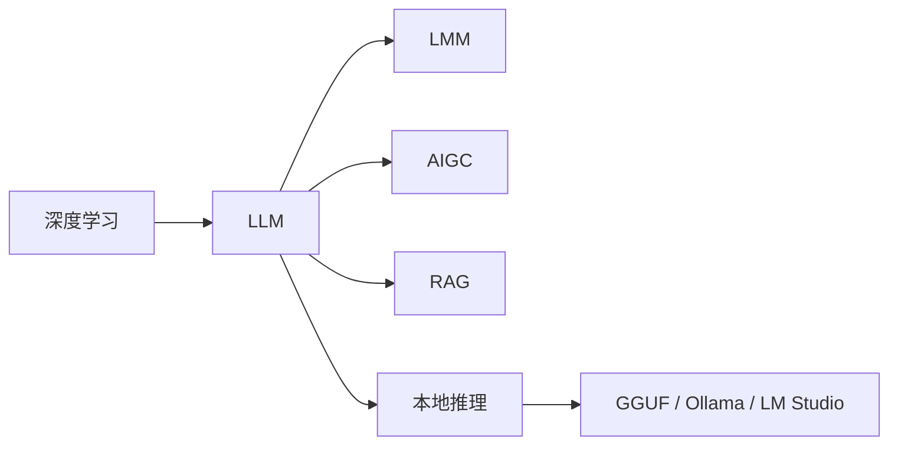

# AI 与大模型基础认知

> **阅读对象**:AI 初学者、AI 应用开发者、技术负责人
> **关联阅读**:[本地大模型运行实践指南](../0xD0_实践指南/本地大模型运行实践指南.md)、[Agent Skills 实践指南](../0xD0_实践指南/AgentSkills实践指南.md)

本文用于建立 AI、深度学习、大语言模型、多模态模型、AIGC、RAG、GGUF 与本地模型运行的基础认知。

## 1. AI 的研究与发展

人工智能的发展大致经历了规则系统、机器学习、深度学习、大模型与智能体几个阶段。

每一阶段的核心变化是:系统从“人写规则”逐步走向“模型从数据中学习规律”,再进一步走向“模型结合工具和流程完成任务”。

## 2. 什么是深度学习

深度学习是机器学习的一个分支。它通过构建多层神经网络,让计算机自动从大量数据中学习特征和模式,用于分类、预测、生成等任务。

### 2.1 工作原理

### 2.2 优势

- 能够自动学习复杂模式,减少人工特征工程。
- 能处理图像、文本、语音、视频等多类型数据。
- 在计算机视觉、自然语言处理、语音识别等任务上表现突出。
- 具备较强泛化能力,能适应多种任务和场景。

### 2.3 挑战

- 需要大量数据和计算资源。
- 模型结构复杂,可解释性弱。
- 容易过拟合。
- 训练数据可能带来偏见、隐私和安全问题。

### 2.4 应用领域

| 领域 | 典型任务 |
| --- | --- |
| 计算机视觉 | 图像识别、目标检测、图像分割、视频理解 |
| 自然语言处理 | 机器翻译、文本分类、问答、摘要、生成 |
| 语音技术 | 语音识别、语音合成 |
| 医疗 | 医学影像分析、疾病预测、药物研发 |
| 金融 | 风险评估、欺诈检测、市场预测 |

## 3. 什么是 LLM

LLM 是 Large Language Model,即大型语言模型。它是一种基于深度学习的自然语言处理模型,通常拥有大量参数,能够理解和生成自然语言。

### 3.1 定义与特点

| 特点 | 说明 |
| --- | --- |
| 规模庞大 | 参数数量可达数十亿、数百亿甚至更高 |
| 数据驱动 | 基于大规模文本数据训练 |
| 语言理解与生成 | 能理解上下文并生成连贯文本 |
| 泛化能力强 | 可迁移到问答、翻译、摘要、代码生成等任务 |

### 3.2 技术原理

#### Transformer 架构

多数 LLM 基于 Transformer 架构。其核心是自注意力机制,能够并行处理序列,捕捉长距离依赖关系。

#### 预训练

模型在大规模无监督文本上学习语言规律,常见目标包括预测下一个 token、掩码语言建模等。

#### 微调

在预训练模型基础上,使用少量特定任务数据进一步训练,让模型适应具体场景。

### 3.3 面临的挑战

- **性能与效率平衡**:模型越大,训练和推理成本越高。
- **可解释性问题**:模型生成结果难以完全解释。
- **数据质量和偏见**:训练数据中的偏差会影响输出。
- **伦理和安全问题**:可能生成虚假信息、恶意内容或泄露隐私。

### 3.4 应用场景

- 智能聊天机器人
- 内容创作
- 智能翻译
- 知识问答
- 文本摘要
- 代码生成

## 4. 什么是 LMM

LMM 通常指 Large Multimodal Model,即大规模多模态模型。它能够处理和融合文本、图像、音频、视频、传感器数据等多种模态。

### 4.1 典型类型

| 类型 | 说明 |
| --- | --- |
| 联合嵌入模型 | 将不同模态映射到同一向量空间 |
| 注意力机制模型 | 自动关注不同模态中的关键区域或片段 |
| 多模态 Transformer | 在 Transformer 中融合跨模态交互 |

### 4.2 核心原理

多模态模型通常包含三步:

1. 将不同模态转换为向量或张量表示。
2. 通过注意力或对齐机制学习模态间关系。
3. 根据任务输出理解、检索或生成结果。

### 4.3 应用场景

- 多模态问答
- 图文检索
- 图片理解
- 视频理解
- 多模态情感分析
- 医疗影像辅助分析
- 多模态内容生成

## 5. 什么是 AIGC

AIGC 是 AI Generated Content,即人工智能生成内容。它利用 AI 自动生成文本、图像、音频、视频等内容。

### 5.1 关键技术

| 技术 | 说明 |
| --- | --- |
| Transformer | 文本生成和多模态生成的核心架构之一 |
| 生成对抗网络 | 常用于图像生成等任务 |
| 扩散模型 | 当前图像、视频生成的重要技术路线 |
| 强化学习 | 用于对话优化、策略优化与偏好对齐 |

### 5.2 应用领域

- 文本创作:新闻、文案、故事、摘要
- 图像创作:海报、插画、草图、视觉设计
- 音视频创作:音乐、短视频、配音、动画
- 智能客服:自动回答与知识辅助
- 教育培训:个性化学习资料和练习题生成

### 5.3 发展趋势

- 多模态融合
- 与行业流程深度结合
- 从内容生成走向任务执行
- 从单次生成走向智能体协作

## 6. 什么是 RAG

RAG 是 Retrieval-Augmented Generation,即检索增强生成。它将外部知识检索与语言模型生成结合,让模型在回答问题时参考可靠资料。

### 6.1 核心流程

### 6.2 优势

- 减少幻觉,提高事实准确性。
- 能接入企业私有知识。
- 降低对模型参数内置知识的依赖。
- 更适合知识问答、客服、文档助手等场景。

### 6.3 应用场景

- 企业知识库问答
- 产品手册问答
- 法律、医疗、金融等专业检索问答
- 内容创作素材检索
- 智能客服

## 7. 模型由哪些部分组成

不同模型的结构不同,但通常可以拆成以下部分:

| 部分 | 说明 |
| --- | --- |
| 数据输入 | 原始数据、预处理、tokenization |
| 模型架构 | 层、模块、连接方式和拓扑结构 |
| 参数 | 权重、偏置等可学习参数 |
| 超参数 | 学习率、层数、上下文长度、batch size 等 |
| 损失函数 | 衡量预测与目标之间的差异 |
| 优化算法 | 根据梯度更新参数 |
| 输出 | 分类、预测、文本、向量或其他生成结果 |
| 评估指标 | 准确率、召回率、F1、困惑度等 |

训练阶段关注参数学习;推理阶段关注如何用已训练参数产生结果。

## 8. 什么是 GGUF

GGUF 是一种面向大语言模型的二进制模型文件格式,常用于 llama.cpp 生态和本地推理场景。

### 8.1 组成结构

### 8.2 特点

- **高效存储和加载**:二进制格式适合快速读取和内存映射。
- **单文件部署**:元数据和权重集中在一个文件中。
- **可扩展**:通过键值元数据支持新字段。
- **兼容性好**:被 llama.cpp、LM Studio、Ollama 等工具生态支持。
- **支持量化**:适合在消费级硬件或边缘设备上运行。

## 9. 模型是如何运行起来的

### 9.1 模型交互逻辑

### 9.2 推理过程

推理不是一次性“想出完整答案”,而是不断预测下一个 token,直到达到停止条件。

## 10. 如何本地部署运行模型

### 10.1 使用软件或平台

| 工具 | 说明 |
| --- | --- |
| Ollama | CLI 友好,适合本地常驻服务和 API 集成 |
| LM Studio | GUI 友好,适合模型下载、加载和参数调试 |
| Hugging Face | 模型仓库与模型分发平台 |

### 10.2 使用工具库

| 技术 | 语言 | 场景 |
| --- | --- | --- |
| llama.cpp | C / C++ | GGUF 本地推理、轻量部署 |
| vLLM | Python | 高吞吐服务化推理 |

如果只是本地学习和验证,优先使用 LM Studio 或 Ollama。若要构建生产级服务,再评估 vLLM、TensorRT-LLM、llama.cpp server 等专用推理框架。

## 11. 总结

AI 大模型体系可以从以下链路理解:

- 深度学习提供基础方法。
- LLM 提供语言理解与生成能力。
- LMM 扩展到多模态输入输出。
- AIGC 强调内容生成。
- RAG 强调外部知识增强。
- GGUF、Ollama、LM Studio 等工具让模型可以在本地运行和调试。
