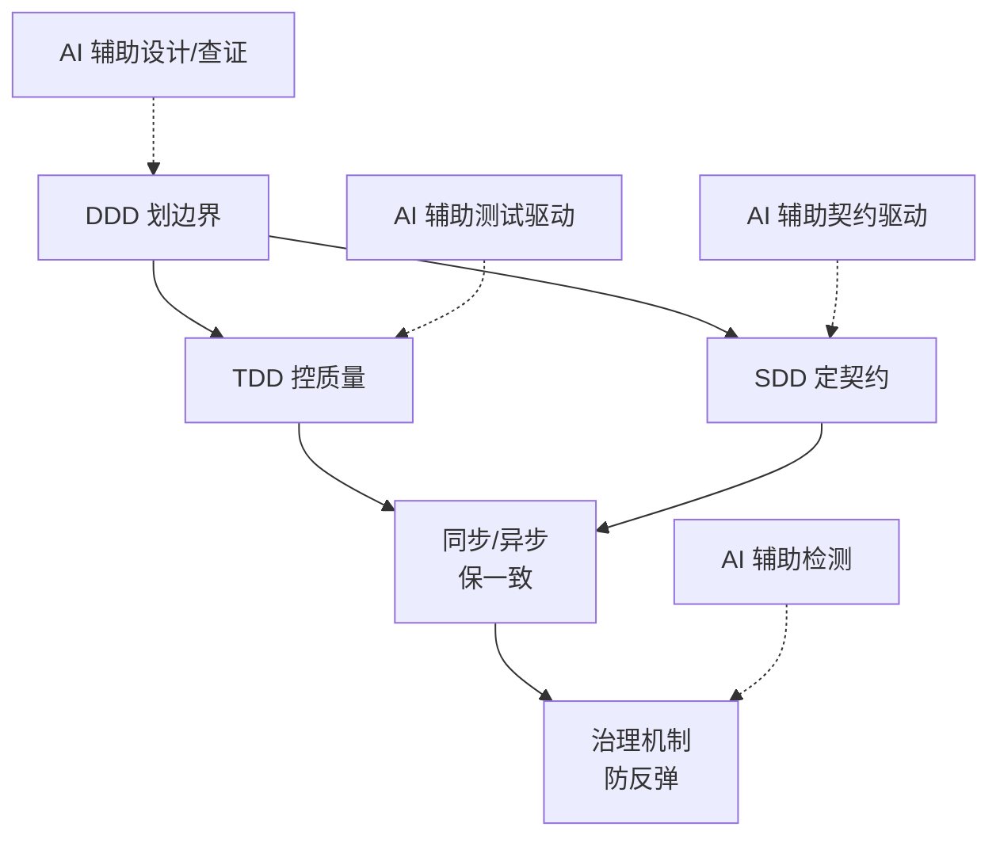
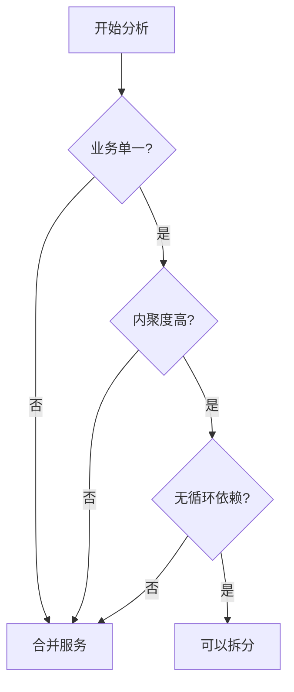
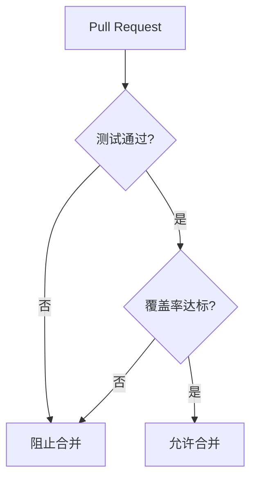
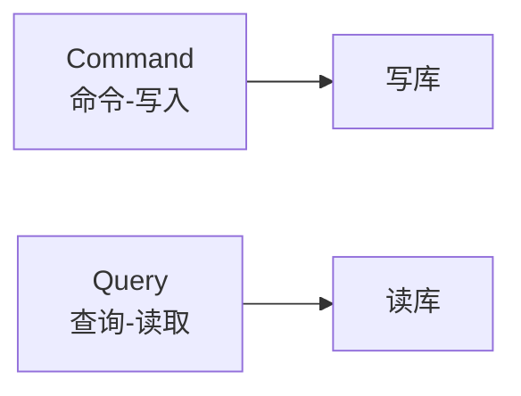
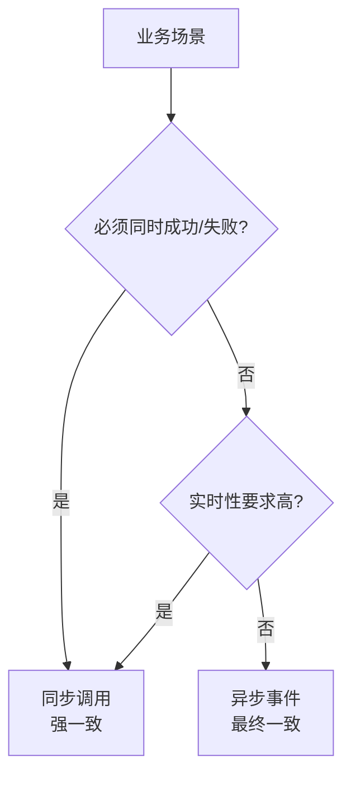
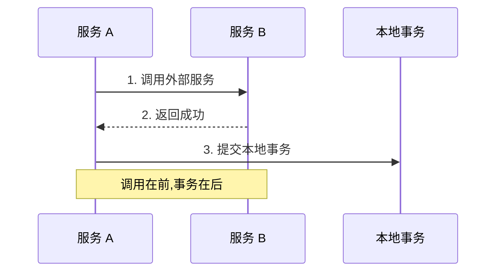
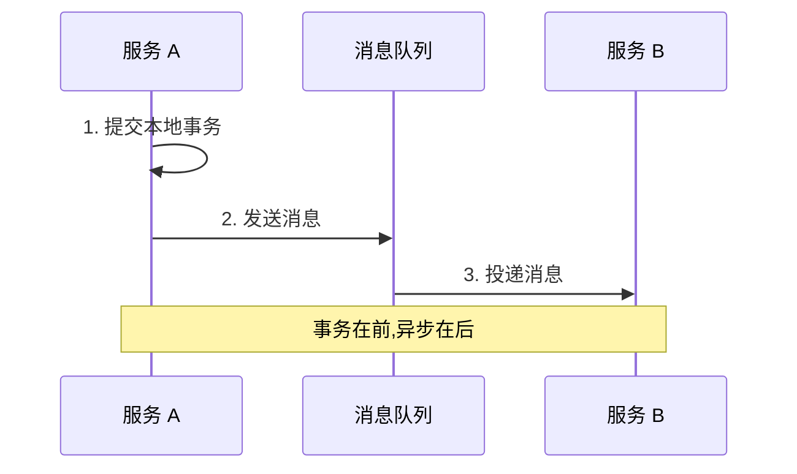
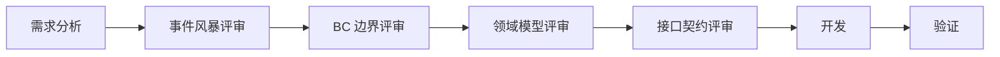
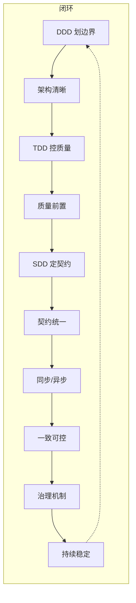

# 团队协作开发指南

> **DDD 划边界 · TDD 控质量 · SDD 定契约 · AI 全程辅助**
>
> 一套强约束、可落地、高协作效率的企业级开发指南。

## 设计立场

本手册不追求名词堆砌,只追求五件事:

> **架构不乱 · 质量可控 · 协作高效 · 变更可控 · 问题可追溯**

## 总体结构



### 五层职责

| 层级 | 职责 | 目标 |
| --- | --- | --- |
| **DDD 架构层** | 拆边界、建模型 | 高内聚、低耦合 |
| **TDD 开发层** | 先测后写、质量前置 | Bug 前置发现 |
| **SDD 协作层** | 先契约后逻辑 | 协作前置、减少返工 |
| **一致性层** | 同步/异步选择 | 业务决定、技术实现 |
| **治理层** | 质量 + 流程 + 服务 | 指南不走样 |

### AI 的贯穿角色

| 层面 | AI 角色 |
| --- | --- |
| DDD | 辅助设计、查证方案 |
| TDD | 辅助测试驱动、生成测试用例 |
| SDD | 辅助契约驱动、生成接口定义 |
| 治理 | 快速检测、预警 |

## 一、DDD 架构层

### 核心命题

> **DDD 不是炫技,是把业务拆清楚、边界划清楚、责任分清楚。**

**核心动作**:拆聚合 · 划限界上下文 · 建立领域模型 · 统一语言 · 事件驱动

**本质**:高内聚 · 低耦合 · 责任单一 · 边界清晰

> 💡 UL、BC、EDD 不是要单独学的名词,是 DDD 落地后的**自然结果**。吃透 DDD,自然懂这些概念。

### 服务边界决策

解决最大的两个坑:**拆太碎** / **拆太大**。



| 决策 | 触发条件 |
| --- | --- |
| ✅ **拆分** | 业务单一 + 内聚度高 + 无循环依赖 |
| ❌ **合并** | 职责混乱 + 耦合重 + 变更互相影响 |

### AI 辅助 DDD

- **设计阶段**:AI 辅助划分 BC、分析依赖
- **查证阶段**:AI 检测循环依赖、校验模型合理性
- **价值**:减少人为主观武断

## 二、TDD 开发层

### 核心命题

> **质量不是靠后期测试,是靠开发过程约束出来的。**

**核心动作**:先写测试用例 → 再写代码 → 红绿灯验证 → 重构优化

**本质**:质量前置 · Bug 前置发现 · 代码可测 · 逻辑清晰

> ⚠️ 传统思维是「先代码后测试」,这套指南**必须扭转**,否则 TDD 形同虚设。

### 红绿灯法则

```text
🔴 RED      →  先写一个失败的测试
🟢 GREEN    →  写最少的代码让测试通过
🔵 REFACTOR →  在测试保护下重构优化
```

### 落地约束

| 场景 | TDD 要求 | 原因 |
| --- | --- | --- |
| 核心链路 | **强制 TDD** | 质量前置、Bug 前置发现 |
| 查询 / 配置类 | 可选 TDD | 业务简单、变更少 |

### CI/CD 质量门禁



> 🔒 **铁律**:无测试不合并,测试不过不发布。

### AI 辅助 TDD

- **编写代码**:AI 生成实现代码
- **编写测试**:AI 生成测试用例、覆盖边界场景
- **价值**:降低人工成本、提升效率

## 三、SDD 协作层

### 核心命题

> **团队协作最大的成本是接口扯皮;契约先行,先对齐再开发。**

**核心动作**:先定义接口契约 → 对齐参数/格式/版本 → 再编排业务逻辑

**本质**:协作前置 · 并行开发 · 减少返工 · 契约统一

> ⚠️ SDD **不是写文档,是写标准**。没有统一标准,SDD 就是空话。

### SDD 流程


### 统一规范

| 规范项 | 要求 |
| --- | --- |
| URL 命名 | 统一规范,语义清晰 |
| 版本控制 | `v1`/`v2`/`v3` 明确 |
| Header | 区分必选 / 可选 |
| 请求 / 响应格式 | JSON Schema 标准化 |
| 错误码 | 全局统一错误码体系 |

### CQRS 分离

**查询(Query)与命令(Command)分离,语义清晰、扩展性强**:



### AI 辅助 SDD

- **编写契约**:AI 生成 OpenAPI、接口定义
- **校验契约**:AI 检查一致性、版本兼容性
- **价值**:减少人工审核成本

## 四、一致性层

### 核心命题

> **强一致是业务约束,不是技术约束。技术只负责提供同步/异步能力,并严格遵守事务顺序。**

### 一致性决策树



### 同步调用规范

**适用场景**:同域、同聚合、Feign 调用

| 要素 | 说明 |
| --- | --- |
| 场景 | 业务必须同时成功/失败、实时结果、短链路 |
| 调用对象 | 同 BC、同聚合、查询为主、少量写 |
| 事务顺序 | **调用在前 → 事务在后**(先确认外部成功,再本地事务) |
| 铁律 | **禁止跨 BC 同步链式调用** |



### 异步事件规范

**适用场景**:跨域、消息队列

| 要素 | 说明 |
| --- | --- |
| 场景 | 跨 BC、非实时、可短暂不一致 |
| 兜底机制 | 幂等 + 重试 |
| 事务顺序 | **事务在前 → 异步在后**(本地事务成功再发消息) |
| 约束 | 跨域一律异步,最终一致兜底 |



## 五、治理层

> 目的:**保障指南不走样**

### 质量治理

| 内容 | 说明 |
| --- | --- |
| 自动化测试 | 功能测试、单元测试 |
| 回归测试 | 防止引入新问题 |
| 覆盖率检测 | 保证测试质量 |
| 代码扫描 | 规范、安全 |
| 安全扫描 | 漏洞检测 |

### 流程治理

| 评审类型 | 作用 |
| --- | --- |
| 事件风暴评审 | 事件建模、领域梳理 |
| BC 边界评审 | 限界上下文划分 |
| 领域模型评审 | 实体、聚合、值对象 |
| 接口契约评审 | API 规范、版本兼容性 |



### 服务治理

| 类别 | 内容 |
| --- | --- |
| 基础设施 | 注册发现、配置中心 |
| 稳定性 | 熔断降级、限流、灰度 |
| 可观测性 | 链路追踪、监控告警 |

## 闭环视图



## 落地路径

### 按团队规模适配

| 团队规模 | 落地方式 | 核心动作 |
| --- | --- | --- |
| **小团队(3-5 人)** | AI 全程辅助执行 | 降低对经验的依赖 |
| **中型团队(5-15 人)** | AI + 评审结合 | 平衡效率与质量 |
| **大型团队(15+ 人)** | AI 辅助 + 流程治理 | 确保规模化协作 |

### 小团队适配性

| 痛点 | AI 如何解决 |
| --- | --- |
| 人力不足 | AI 生成测试用例、接口定义、代码实现 |
| 经验欠缺 | AI 辅助边界划分、依赖分析、循环检测 |
| 规范难统一 | AI 自动校验契约一致性、版本兼容性 |
| 质量难保证 | AI 实时预警、代码扫描、覆盖率分析 |

## 风险与对策

| 阶段 | 风险 | 对策 |
| --- | --- | --- |
| DDD | 边界划分主观性强 | AI 辅助校验 + 团队评审 |
| TDD | 开发习惯难改 | 先从核心链路试点,逐步推广 |
| SDD | 契约标准化需要团队共识 | 制定 API 规范文档,AI 强制校验 |
| 一致性 | 跨 BC 同步链式调用易被忽略 | 代码扫描 + 架构门禁强制检查 |

### 三大核心难点

1. **文化转变** —— TDD 需要从「先代码后测试」转变为「先测试后代码」,这是最大障碍
2. **BC 边界划分** —— 没有标准答案,高度依赖业务理解和经验
3. **SDD 标准化** —— 需要团队统一规范,否则形同虚设

## 可行性分析

### 核心价值

| 维度 | 价值 | 保障 |
| --- | --- | --- |
| 架构 | 边界清晰、责任明确、高内聚低耦合 | DDD + AI 辅助设计 |
| 质量 | 质量前置、Bug 少、可测性强 | TDD + AI 辅助执行 |
| 协作 | 契约先行、减少返工、并行开发 | SDD + AI 辅助执行 |
| 一致性 | 同步/异步合理选择、数据可靠 | 事务顺序约束 |
| 治理 | 流程规范、问题可追溯、持续改进 | 质量门禁 + 流程治理 + AI 检测 |

### 落地优势

| 方面 | 优势 | 落地可行性 |
| --- | --- | --- |
| 结构完整 | DDD + TDD + SDD 覆盖架构、开发、协作全链路 | 高 |
| 约束明确 | 有 CI/CD 卡点、跨 BC 同步限制、契约校验等具体门禁 | 高 |
| AI 定位清晰 | DDD 辅助设计,TDD/SDD 辅助执行,治理辅助检测 | 中高 |
| 一致性规则明确 | 同步调用强调事务顺序,异步事件强调最终一致 | 高 |
| 团队规模适配 | 小团队降经验门槛,大团队稳协作边界 | 高 |

### 改进建议

| 问题 | 建议 |
| --- | --- |
| TDD 推广难 | 增加「可选 TDD」场景说明,先从核心链路和高风险模块试点 |
| DDD 边界主观 | 引入事件风暴、用例地图、依赖图,让 AI 辅助边界评审 |
| SDD 标准难统一 | 由 AI 生成 OpenAPI / AsyncAPI 草案,再由团队评审固化规范 |
| 一致性易出错 | 建立代码扫描规则 + 架构门禁,双重检查跨 BC 同步链路 |
| 治理易形式化 | 将门禁接入 CI/CD、Code Review、质量报告,减少人工口头提醒 |

### 结论

这套协作方式的可行性较高,尤其适合**小团队 + AI**快速建立工程纪律:小团队用 AI 弥补经验和人力不足,中型团队用 AI + 评审平衡效率和质量,大型团队用 AI + 流程治理保障规模化协作。

核心判断:只要把 DDD / TDD / SDD 从口号变成门禁,再把 AI 放进门禁内执行,团队就能在不牺牲交付速度的前提下提升架构稳定性和质量可控性。

## 一句话总结

> **以 DDD 划边界、TDD 控质量、SDD 定契约、同步/异步保一致、AI 全程辅助、治理防反弹** ——
> 形成一套强约束、可落地、高协作效率的企业级开发指南。

> **延伸阅读**
> - [人机协同开发流程](./人机协同开发流程.md) —— TDD 与 AI 的深度结合
> - [代码质量评估体系](./代码质量评估体系.md) —— 治理层的量化标尺
> - [DDD + 多租户模式](../0xC0_实践模式/DDD多租户架构模式.md) —— 框架核心实现
