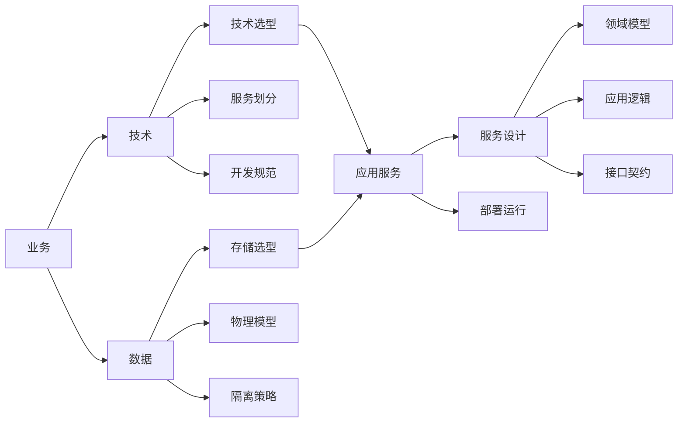
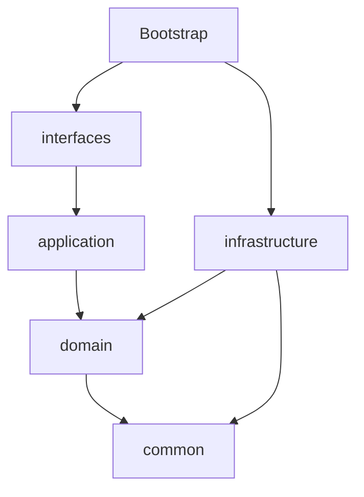
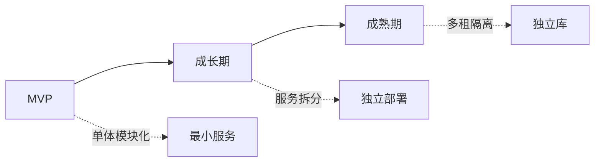
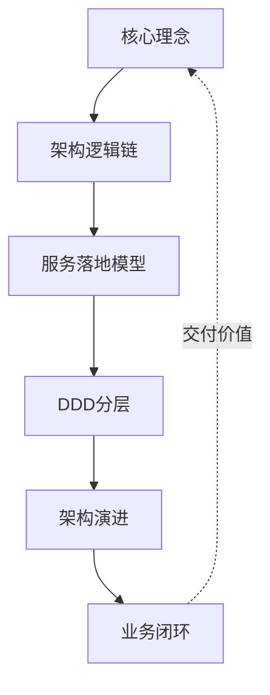

# 架构设计入门指南

> 把哲学落地成可操作的设计步骤

## 一句话核心

> **先因后果,由虚入实** —— 从抽象到具体,从业务到技术,从约束到实现。

| 关键词 | 含义 |
| --- | --- |
| **因果链** | 设计原则是因,具体实现是果 |
| **业务驱动** | 业务定目标,技术 + 数据被驱动 |
| **分而治之** | 大系统拆小服务,职责单一 |
| **渐进演进** | 不追求一步到位,预留扩展点 |

> 💡 **实践启示**:先定目标(业务),再选工具(技术 + 数据),最后落地(应用 + 部署)。

## 架构逻辑链 —— 业务驱动一切



**逻辑解读**:

- 业务是**起点**,业务目标驱动技术和数据
- 技术 + 数据**并行展开**,各自被业务驱动
- 技术 + 数据**汇合到应用服务**,落地为具体服务
- 应用服务**部署运行**,微服务协同形成业务闭环

> ⚠️ **反模式警告**:如果设计时先考虑技术选型而不是业务目标,容易陷入「技术炫技」陷阱。

## 服务设计四步法


| 步骤 | 关键产出 |
| --- | --- |
| 1️⃣ 职责边界 | 这个服务做什么、不做什么 |
| 2️⃣ 领域模型 | 核心实体、值对象、聚合根 |
| 3️⃣ 应用逻辑 | UseCase 编排、事务边界 |
| 4️⃣ 接口契约 | API 定义、Schema、版本策略 |

**核心路径**:职责边界(因) → 领域模型(规则) → 应用逻辑(流程) → 接口契约(契约)

## DDD 分层依赖



### 依赖规则

| 上层 | 可依赖 | 禁止依赖 |
| --- | --- | --- |
| interfaces | application | infrastructure 直接调用 |
| application | domain | infrastructure 实现细节 |
| domain | common | 任何上层、任何框架 |
| infrastructure | domain, common | application, interfaces |
| common | (无) | 任何业务层 |

> 🔒 **核心铁律**:`domain` 层零框架依赖,这是架构可演进的根基。

## 服务演进路径



| 阶段 | 形态 | 关键动作 |
| --- | --- | --- |
| **MVP** | 单体模块化 | 用模块隔离业务域,但部署在一起 |
| **成长期** | 服务拆分 | 关键模块独立部署,但共享基础设施 |
| **成熟期** | 多租隔离 | 独立库、独立部署、独立租户上下文 |

> 🎯 **演进原则**:不追求一步到位,**预留扩展点,按需演进**。

## 架构设计闭环



| 层次 | 作用 | 说明 |
| --- | --- | --- |
| **因** | 核心理念 | 设计原则是因,业务目标驱动 |
| **路径** | 架构逻辑链 | 业务 → 技术 + 数据 → 应用服务 → 部署运行 |
| **执行** | 服务落地 + DDD | 职责边界 → 领域模型 → 应用逻辑 → 接口契约 |
| **时** | 架构演进 | MVP → 扩展 → 成熟,按需演进 |
| **果** | 业务闭环 | 交付价值,回到核心理念迭代 |

> **理念(因) → 路径 → 执行 → 时 → 业务闭环(果) → 回到核心理念迭代**

## 架构设计六步法

实际设计中,按以下顺序推进:

```text
1. 梳理业务架构    →  确定业务目标和边界
2. 展开技术+数据   →  并行设计技术选型和数据架构
3. 落地应用架构    →  服务拆分、DDD 分层
4. 完成部署架构    →  定义运行环境
5. 补充非功能性    →  定义质量目标(性能、可靠性、安全)
6. 识别风险+演进   →  评估风险,规划演进路径
```

## 交互设计:简约但不简单

> **核心认知**:把复杂留给系统,把简约留给用户。

### 两种路径对比

| 路径 | 做法 | 结果 |
| --- | --- | --- |
| ✅ 正确 | 复杂流程 → 简约交互 | 一气呵成,操作高效 |
| ❌ 错误 | 复杂流程 → 简单交互 | 链路冗长,操作疲劳 |

### 五大理论基础

| 法则 | 含义 | 实践启示 |
| --- | --- | --- |
| **复杂度守恒定律** | 系统有不可减少的复杂度,应由系统承担而非用户 | 把复杂留给自己,把简约留给用户 |
| **不要让我思考** | 好的设计无需用户思考 | 每个问题只出现一次,消除歧义 |
| **认知负荷最小化** | 减少用户的记忆和理解负担 | 可见即所得,信息就近呈现 |
| **一致性原则** | 遵循用户已建立的认知习惯 | 与主流产品保持一致,减少学习成本 |
| **选择过载** | 选项越多,决策越慢 | 默认值优先,减少可选路径 |

### 设计警示

- ❌ 关注堆砌输入验证,而非流程本身
- ❌ 拆分操作来追求单步简单,而非简化流程
- ❌ 过度的引导和提示,反而增加认知负担
- ❌ 用「拆分」掩盖「复杂」,而不是把「复杂」内化为「简约」

> ✨ **核心认知**:好的交互设计是让用户「不知不觉」完成任务,而不是「一步一步」完成任务。

## 架构设计正反对照表

| 核心理念(正) | 设计警示(反) |
| --- | --- |
| **因果链**:原则是因,实现是果 | 因果颠倒:先选技术再定业务 → 项目难交付 |
| **业务驱动**:业务定目标,技术 + 数据被驱动 | 技术驱动:业务架构缺失直接写代码 → 代码腐化 |
| **分而治之**:大系统拆小服务,职责单一 | 职责混乱:接口契约设计随意 → 服务耦合 |
| **渐进演进**:不追求一步到位,预留扩展点 | 一步到位:不考虑演进直接上微服务 → 运维复杂 |

> 🎯 **核心认知**:架构设计是「**选择**」的艺术。选错方向,越努力越失败。

## 一句话总结

> **业务是起点 · 技术 + 数据是工具 · 应用服务是落地 · 部署运行是价值交付**

记住这条链,架构设计就有了主心骨。

> **延伸阅读**
> - [架构设计哲学](../0x01_哲学理念/架构设计哲学.md) —— 入门指南背后的「道」
> - [人机协同开发流程](./人机协同开发流程.md) —— AI 时代如何落地这套架构
> - [DDD + 多租户模式](../0xC0_实践模式/DDD多租户架构模式.md) —— 框架核心模式提炼
