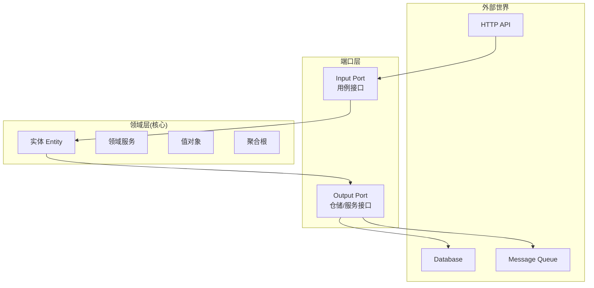
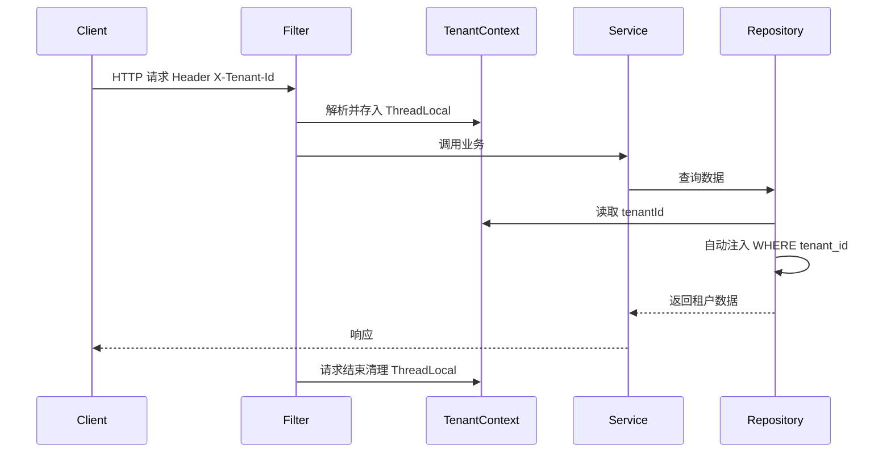

# DDD + 多租户架构模式

> ArchAIHarness 框架的核心实现模式提炼。
>
> 把 DDD 分层与多租户基础设施融合,作为人机协同开发的稳定底座。

## 模式定位

| 维度 | 说明 |
| --- | --- |
| **解决什么** | 多租户 SaaS / 业务中台 / 企业级 DDD 系统的标准化底座 |
| **何时使用** | 业务边界清晰、需要租户隔离、追求长期可演进 |
| **何时不用** | 简单 CRUD、单租户工具、原型验证 |

## 六边形 + DDD 分层



### 五大铁律

| 铁律 | 说明 |
| --- | --- |
| 1️⃣ Domain 零框架依赖 | 不依赖 Spring、JPA、任何 Web 框架 |
| 2️⃣ 依赖方向单一 | 外层 → 内层,禁止逆向 |
| 3️⃣ 端口是契约 | Port 接口在 Domain 层,实现在 Infrastructure 层 |
| 4️⃣ 聚合根唯一入口 | 聚合内对象只通过聚合根修改 |
| 5️⃣ 聚合间 ID 引用 | 聚合之间不直接持有对方对象,只持有 ID |

## 标准目录结构

```text
my-service/
├── interfaces/             # 接口层(REST/RPC)
│   ├── controller/
│   ├── dto/
│   └── advice/             # 全局异常处理
│
├── application/            # 应用层
│   ├── usecase/            # 用例(命令)
│   ├── query/              # 查询(CQRS)
│   └── assembler/          # DTO ↔ Domain 转换
│
├── domain/                 # 领域层(核心)
│   ├── model/
│   │   ├── aggregate/      # 聚合根
│   │   ├── entity/         # 实体
│   │   └── valueobject/    # 值对象
│   ├── service/            # 领域服务
│   ├── repository/         # 仓储接口(Port)
│   └── event/              # 领域事件
│
├── infrastructure/         # 基础设施层
│   ├── persistence/        # 仓储实现
│   ├── messaging/          # 消息适配
│   ├── tenant/             # 多租户上下文
│   └── client/             # 外部服务调用
│
├── common/                 # 通用模块
│
└── bootstrap/              # 启动模块
    └── Application.java
```

## 多租户基础架构

### 核心问题

> 一套代码、一个部署,服务 N 个租户。如何保证:
>
> - 租户数据**隔离**?
> - 租户上下文**自动透传**?
> - 业务代码**无感知**?

### 三层隔离策略

| 隔离层级 | 实现方式 | 适用场景 |
| --- | --- | --- |
| **独立库** | 每租户一个 Database | 大客户、强合规 |
| **独立 Schema** | 同库不同 Schema | 中等规模租户 |
| **共享表** | 行级 `tenant_id` 过滤 | 大量小租户 |

> 框架支持**三种模式动态切换**,业务代码统一无感。

### 租户上下文透传



### 异步场景下的租户上下文

```text
@Async / 线程池 / 消息消费 → 主动透传 tenantId
                          ↓
                  使用 TaskDecorator 包装
                          ↓
                  自动复制 ThreadLocal
```

> ⚠️ **常见坑**:`@Async` 方法不会自动继承 `ThreadLocal`,必须用 `TaskDecorator` 包装。

## DDD 与多租户的融合

### 聚合根自动携带 tenantId

```text
@AggregateRoot
public class Order {
    private OrderId id;
    private TenantId tenantId;   // ← 聚合根强制包含
    private OrderStatus status;
    private List<OrderItem> items;
}
```

### 仓储接口的租户透明

```text
// Domain 层:接口无 tenantId 参数
public interface OrderRepository {
    Optional<Order> findById(OrderId id);
    void save(Order order);
}

// Infrastructure 层:实现自动注入
public class OrderRepositoryImpl implements OrderRepository {
    public Optional<Order> findById(OrderId id) {
        // 自动从 TenantContext 读取 tenantId
        return mapper.selectByIdAndTenant(id, TenantContext.current());
    }
}
```

## CQRS 模式应用

### 命令侧(Command)

```text
Controller → UseCase → Domain Service → Aggregate → Repository
                                              ↓
                                       发布 Domain Event
```

- 严格走 DDD 完整链路
- 强一致性保障
- 发布领域事件供下游订阅

### 查询侧(Query)

```text
Controller → QueryService → 直接查询 ReadModel
                            (读库 / Elasticsearch / Redis)
```

- 不经过 Domain 层
- 高性能、灵活组合
- 可针对查询场景独立优化

## 一致性模式

### 同域同步

> 同一个 BC 内、同一个聚合内,使用同步调用 + 本地事务

```text
LocalTx { changeOrder() + decrementInventory() }
```

### 跨域异步

> 跨 BC、跨聚合,**事务在前 → 异步在后**

```text
LocalTx { changeOrder() + saveOutboxEvent() }
              ↓
        Outbox Worker → MessageQueue → 下游消费
```

> 🔒 **铁律**:跨 BC 一律异步,通过**幂等 + 重试 + 死信队列**兜底。

## Agent 边界 (agents.md)

框架内置 `agents.md`,作为 AI Agent 的行为约束:

```text
# agents.md(框架内置)

## 架构约束(不可违反)
- Domain 层禁止依赖 Spring、JPA、任何框架注解
- Application 层禁止直接依赖 Infrastructure
- Repository 接口必须在 Domain 层,实现必须在 Infrastructure 层
- 跨 BC 调用必须异步,禁止同步链式调用
- 聚合根必须携带 tenantId

## 编码约束
- 金额必须使用 BigDecimal
- 异常必须记录日志或重新抛出,禁止吞没
- 外部服务调用必须配置超时和 fallback
- 线程池必须使用 ThreadPoolExecutor,禁止 Executors

## 生成模式
- 新增 Aggregate: 在 domain/model/aggregate/ 下,自动生成 Repository 接口
- 新增 UseCase: 在 application/usecase/ 下,自动注入 Repository
- 新增 API: 在 interfaces/controller/ 下,自动生成 DTO 和 Assembler
```

> 💡 **AI 在框架内编码时,自动遵守这些约束**,产出可直接合入主干。

## 适用场景速查

| 场景 | 推荐度 | 关键原因 |
| --- | --- | --- |
| 🏢 多租户 SaaS 平台 | ⭐⭐⭐⭐⭐ | 内置租户隔离与上下文透传 |
| 🧩 业务中台 | ⭐⭐⭐⭐⭐ | DDD 限界上下文与中台业务域天然映射 |
| 🏦 金融 / 政企系统 | ⭐⭐⭐⭐⭐ | 强业务领域 + 严格合规 |
| ☁️ 云原生微服务 | ⭐⭐⭐⭐ | 与 Spring Cloud 深度契合 |
| 🛒 标准电商 | ⭐⭐⭐⭐ | DDD 模式 + 跨域异步成熟 |
| 📝 简单 CRUD | ⭐⭐ | 杀鸡用牛刀,不建议 |
| 🧪 原型验证 | ⭐ | 框架启动成本大于收益 |

## 与主流方案的对比

| 维度 | 传统 Spring | 纯 DDD | **ArchAIHarness** |
| --- | --- | --- | --- |
| 业务边界 | 模糊 | 清晰 | **清晰 + AI 自动约束** |
| 多租户 | 自行处理 | 不涉及 | **内置基础设施** |
| AI 协同 | 无 | 无 | **agents.md 强约束** |
| 学习成本 | 低 | 高 | **中(框架收敛复杂度)** |
| 长期可演进 | 弱 | 强 | **强 + 工程化保障** |

## 落地路径建议

```text
Phase 1  →  采用框架脚手架启动新服务
            体验 DDD 分层 + 多租户基础设施

Phase 2  →  引入 agents.md 约束 AI 编码
            体验「人架构、AI 编码」工作流

Phase 3  →  接入 mcp-sdk
            实现框架与 AI Agent 深度通信

Phase 4  →  按需引入 skill-market 技能包
            扩展领域专属 AI 能力
```

> **延伸阅读**
> - [架构设计入门指南](../0xA0_实践方法/0xA1_架构设计入门指南.md) —— DDD 分层背后的设计逻辑
> - [团队协作开发指南](../0xA0_实践方法/0xA3_团队协作开发指南.md) —— DDD/TDD/SDD 三位一体
> - [人机协同开发流程](../0xA0_实践方法/0xA2_人机协同开发流程.md) —— 在框架内驾驭 AI
