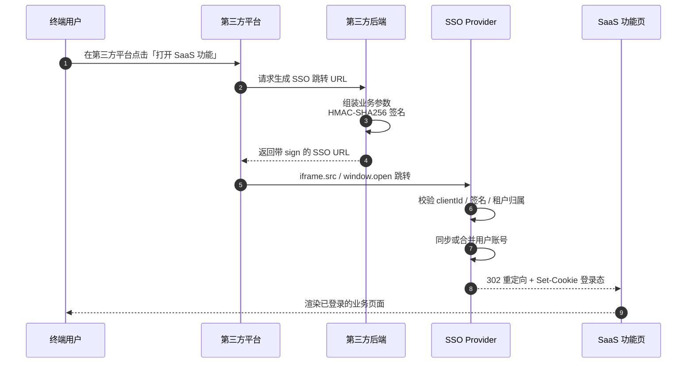
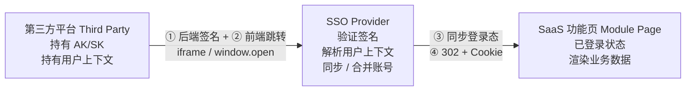
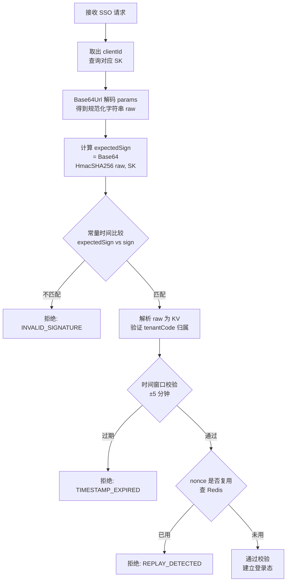
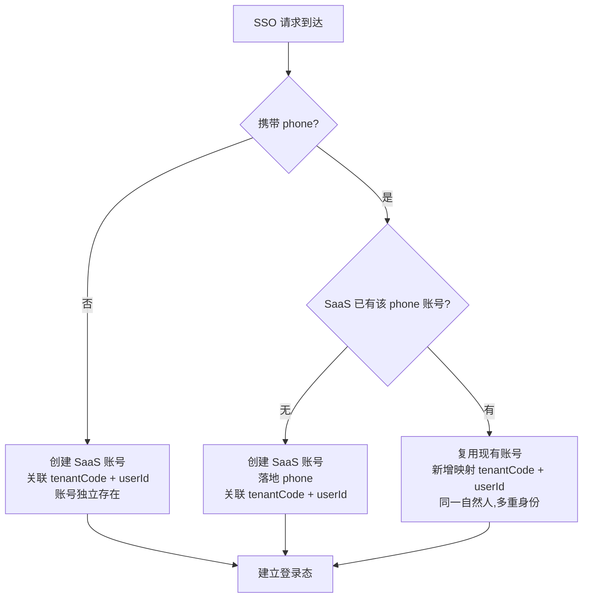
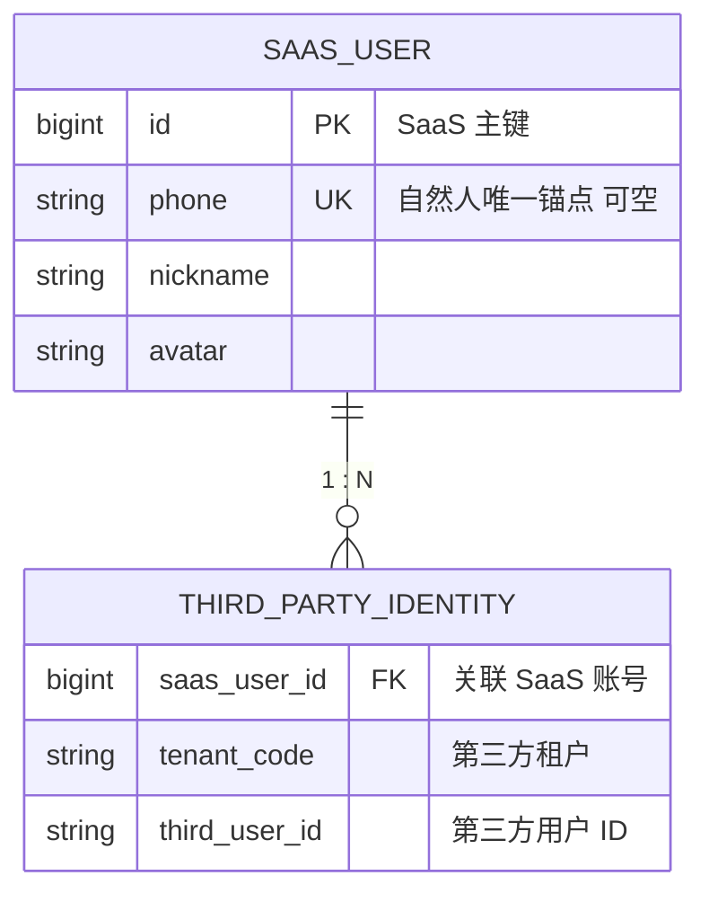
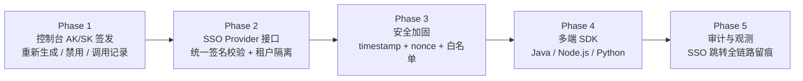

# 企业 SSO 接入设计模式

> **阅读对象**:平台架构师、SaaS 集成工程师、身份认证模块负责人
> **前置阅读**:[架构设计哲学](../0x01_哲学理念/0x01_架构设计哲学.md) · [DDD 多租户架构模式](./0xB1_DDD多租户架构模式.md)

## 模式定位

**问题域**:第三方业务平台需要将其用户无缝引流到企业 SaaS 平台的指定功能页,用户体验上**一次登录、跨域通行**,工程上要满足:

- 第三方平台用户身份**单向可信传递**到企业 SaaS
- 跨域跳转(`iframe` / `window.open`)能携带完整登录态
- 用户在企业 SaaS 侧能与本地账号体系**自动合并**或**独立隔离**
- 凭证不可重放、不可伪造,且不依赖企业 SaaS 的会话存储

**本模式给出的答案**:基于 **AK/SK + HMAC 签名 + 跳转式登录态注入** 的轻量 SSO Provider 协议,无需 SAML/OIDC 的重量级元数据交换,**单接口、单跳转**即完成接入。

适用边界:
- ✅ B2B SaaS 提供给企业客户的"嵌入式入口"
- ✅ 内部多产品矩阵之间的"主站—子站"单点登录
- ❌ 跨组织、跨信任域的开放身份联邦(用 OIDC/SAML)
- ❌ 第一方原生 App / 移动端登录态(用 OAuth 2.0 Device Flow)

## 设计目标与约束

| 目标 | 约束 |
| --- | --- |
| 接入成本极低 | 一个 `GET` 接口,5 分钟出 Demo |
| 凭证不可伪造 | HMAC-SHA256 签名,密钥不出第三方后端 |
| 用户身份可合并 | 通过共同标识(手机号)在 SaaS 侧识别同一自然人 |
| 多租户隔离 | 第三方平台 = 独立租户,用户数据天然隔绝 |
| 无状态可水平扩展 | 鉴权过程不依赖 Session,Cookie 由 SaaS 域名签发 |

## 协议时序



## 核心模型



四个关键角色:

- **第三方平台**:SSO 发起方,持有 SSO Provider 签发的 AK/SK
- **SSO Provider**:协议的服务端实现,通常部署在 SaaS 的 API 网关层(参见 [gateway](https://github.com/ArchAIHarness/gateway))
- **SaaS 功能页**:用户最终落地的业务页面,通过 Cookie 识别登录态
- **租户域**:每个第三方平台对应一个独立租户,通过 `tenantCode` 隔离数据

> 📎 **责任边界**:本协议假设接入方已持有合法 AK/SK,**不约束 AK/SK 的生成形态**(长度、字符集、随机源、轮换周期、多环境隔离等)。这些属于上位的「凭证体系」职责,后续单独成篇,与本协议解耦演进 —— 哪怕未来 AK/SK 升级为国密、动态短期 token、或公私钥对,本协议的签名与跳转流程仍然成立,只需在签名章节替换算法即可。

## 协议设计

### 接口契约

```text
GET /api/v1/auth/sso/login
    ?clientId={AK}
    &params={base64url(sorted-kv-string)}
    &sign={base64(HmacSHA256(sorted-kv-string, SK))}
    &redirectUri={业务页绝对 URL}
```

**为什么是 `GET` 而不是 `POST`**:
SSO 跳转的发起方是浏览器(`iframe.src` / `window.open`),浏览器原生只支持 `GET` 触发导航。改 `POST` 需要在第三方页面引入隐藏表单,反而增加接入成本。

**为什么 `params` 要 Base64Url 编码**:
浏览器对 URL Query 中的 `+` `/` `=` `空格` 等字符行为不一致,直接拼接易被截断或转义。Base64Url(RFC 4648 §5)用 `-` 和 `_` 代替 `+` 和 `/`,天然 URL 安全。

**为什么签名独立于 `params` 传输**:
签名作用域只覆盖**业务参数**,不覆盖 `redirectUri` —— 后者由第三方按业务场景动态决定(不同入口跳不同页),如果纳入签名,第三方每次都要重新签,运营成本极高。`redirectUri` 的合法性由 SSO Provider 侧的**白名单校验**保证。


### 业务参数集

| 参数 | 必填 | 说明 | 用途 |
| :--: | :--: | --- | --- |
| `tenantCode` | ✅ | 第三方平台对应的租户编码 | 数据隔离 + 落地页域名拼装 |
| `userId` | ✅ | 第三方平台用户唯一标识 | SaaS 侧账号映射主键 |
| `phone` | ⭕ | 用户手机号(强烈建议传) | **跨域用户合并的唯一关键** |
| `nickname` | ⭕ | 用户昵称 | 首次同步时落地 |
| `avatar` | ⭕ | 头像 URL | 首次同步时落地 |

> ⚠️ **设计要点**:`phone` 看似可选,实际是「同一自然人在两个平台被识别为同一账号」的**唯一锚点**。若缺失,SaaS 侧将为该用户创建独立账号,用户后续直接登录 SaaS 时将看不到来自第三方平台的数据 —— 这是绝大多数 SSO 落地翻车的元凶。

### 签名算法

**步骤 1:参数规范化**

```text
1. 剔除值为 null / 空字符串的字段
2. 按字段名 ASCII 升序排列
3. 拼接为 key1=value1&key2=value2&...
   (注意:value 不做 URL 编码,保持原值参与签名)
```

**步骤 2:HMAC 签名**

```text
sign = Base64(HmacSHA256(规范化字符串, SK))
```

**步骤 3:参数封装传输**

```text
params = Base64Url(规范化字符串)   // URL Query 安全
sign   = Base64(签名字节)          // 服务端 verify 时同样 Base64 解码
```

**为什么是 HMAC-SHA256 而不是 RSA**:

| 维度 | HMAC-SHA256 | RSA-SHA256 |
| --- | --- | --- |
| 性能 | 微秒级 | 毫秒级(慢 1000 倍) |
| 密钥管理 | 对称,SK 双方持有 | 非对称,第三方持私钥 |
| 适用场景 | 同信任域内已建立信任 | 跨信任域、不可信第三方 |
| 接入成本 | SK 直接 HMAC | 需要 PKI 管理 |

**SSO Provider 与第三方是已建立信任的双向商务关系**(SK 通过线下/控制台签发,不在网络中流转),HMAC 是最优解。RSA 适合开放联邦(谁都能注册成 Provider 的场景)。

### 签名校验(服务端)



> ⚠️ 比较签名**必须用常量时间比较**(如 `MessageDigest.isEqual`),`String.equals` 早退会泄露时序信息,可被旁路攻击。

## 用户身份合并策略

第三方用户进入 SaaS 后,SaaS 需要决定:**这是新建账号、合并到现有账号、还是直接复用?**



**数据模型**(简化):



> 索引约束:`UNIQUE(tenant_code, third_user_id)` —— 保证一个第三方用户最多绑定到 SaaS 一个账号。


## 接入参考实现(Java)

### 业务参数 DTO

```java
@Data
@Builder
public class SsoParams {

    /** 租户编码 */
    private String tenantCode;

    /** 第三方用户 ID */
    private String userId;

    /** 用户手机号(强烈建议) */
    private String phone;

    /** 用户昵称 */
    private String nickname;

    /** 用户头像 URL */
    private String avatar;

    /**
     * 按字段名 ASCII 升序,拼接为签名前规范化字符串
     * 注意:null / 空字符串字段不参与签名
     */
    public String toSignString() {
        Map<String, String> sorted = new TreeMap<>();
        for (Field f : this.getClass().getDeclaredFields()) {
            f.setAccessible(true);
            try {
                Object v = f.get(this);
                if (v != null && !v.toString().isBlank()) {
                    sorted.put(f.getName(), v.toString());
                }
            } catch (IllegalAccessException e) {
                throw new IllegalStateException("Read field failed: " + f.getName(), e);
            }
        }
        return sorted.entrySet().stream()
                .map(e -> e.getKey() + "=" + e.getValue())
                .collect(Collectors.joining("&"));
    }
}
```

### 签名与 URL 装配

```java
public final class SsoSigner {

    private static final String ALGO = "HmacSHA256";

    public static String sign(String raw, String secret) {
        try {
            Mac mac = Mac.getInstance(ALGO);
            mac.init(new SecretKeySpec(secret.getBytes(UTF_8), ALGO));
            return Base64.getEncoder().encodeToString(mac.doFinal(raw.getBytes(UTF_8)));
        } catch (GeneralSecurityException e) {
            throw new IllegalStateException("HMAC sign failed", e);
        }
    }

    public static String buildLoginUrl(String endpoint,
                                       String clientId,
                                       String clientSecret,
                                       SsoParams params,
                                       String redirectUri) {
        String raw = params.toSignString();
        String paramsEncoded = Base64.getUrlEncoder()
                .withoutPadding()
                .encodeToString(raw.getBytes(UTF_8));
        String sign = sign(raw, clientSecret);

        return UriComponentsBuilder.fromUriString(endpoint)
                .path("/api/v1/auth/sso/login")
                .queryParam("clientId", clientId)
                .queryParam("params", paramsEncoded)
                .queryParam("sign", sign)
                .queryParam("redirectUri", redirectUri)
                .build()
                .toUriString();
    }
}
```

### 服务端校验(伪代码)

```java
public SsoIdentity verify(SsoRequest req) {
    ClientSecret secret = secretRepository.findByClientId(req.getClientId())
            .orElseThrow(() -> new SsoException("UNKNOWN_CLIENT"));

    String raw = new String(Base64.getUrlDecoder().decode(req.getParams()), UTF_8);

    String expected = SsoSigner.sign(raw, secret.getSk());
    if (!MessageDigest.isEqual(expected.getBytes(UTF_8),
                                req.getSign().getBytes(UTF_8))) {
        throw new SsoException("INVALID_SIGNATURE");
    }

    SsoParams params = SsoParams.fromKvString(raw);

    // 租户归属校验:防止 A 平台冒用 B 平台的 tenantCode
    if (!secret.ownsTenant(params.getTenantCode())) {
        throw new SsoException("TENANT_NOT_OWNED");
    }

    // 落地 URL 白名单校验
    if (!redirectUriPolicy.allows(req.getRedirectUri(), params.getTenantCode())) {
        throw new SsoException("REDIRECT_URI_NOT_ALLOWED");
    }

    return SsoIdentity.from(params);
}
```


## 安全加固清单

| 风险 | 攻击面 | 防御措施 |
| --- | --- | --- |
| **签名伪造** | 攻击者猜 SK | 32 字节高强度随机 SK,HMAC-SHA256 |
| **重放攻击** | 截获完整 URL 重复发起 | `params` 中加入 `timestamp` + 服务端 ±5 分钟窗口 + Redis nonce 缓存 |
| **任意跳转(Open Redirect)** | `redirectUri` 指向钓鱼站 | 按租户维度配置 `redirectUri` 域名白名单 |
| **SK 泄露** | 第三方前端误把 SK 打包到 JS | 协议规定 SK **只能在第三方后端**使用,签名 URL 由后端生成后再交给前端 |
| **租户越权** | A 平台 clientId 携带 B 平台 tenantCode | 服务端校验 `clientId ↔ tenantCode` 归属关系 |
| **时序旁路** | 通过签名比较耗时差异推断 | `MessageDigest.isEqual` 常量时间比较 |
| **Cookie 劫持** | XSS 偷 SaaS 域名 Cookie | Cookie `HttpOnly` + `Secure` + `SameSite=Lax` |

## 适用场景速查

| 场景 | 推荐度 | 关键原因 |
| --- | --- | --- |
| 🏢 B2B SaaS 提供给客户嵌入入口 | ⭐⭐⭐⭐⭐ | 接入成本最低,体验最佳 |
| 🧩 集团内多产品矩阵互通 | ⭐⭐⭐⭐⭐ | 同信任域,HMAC 足够 |
| 📊 控制台对接数据看板 | ⭐⭐⭐⭐⭐ | iframe 嵌入天然契合 |
| 🌐 跨组织开放联邦 | ⭐⭐ | 用 OIDC / SAML 更合适 |
| 📱 原生 App 登录 | ⭐ | 用 OAuth 2.0 PKCE Flow |
| 🤝 政企级强合规身份 | ⭐⭐ | 用 SAML + CA 数字签名 |

## 与主流方案的对比

| 维度 | 本模式(HMAC SSO) | OAuth 2.0 Code Flow | SAML 2.0 | OIDC |
| --- | --- | --- | --- | --- |
| 协议复杂度 | **极低**(1 接口) | 中(多次跳转) | 高(XML + 元数据) | 中 |
| 接入工时 | **小时级** | 天级 | 周级 | 天级 |
| 信任模型 | 同信任域对称密钥 | 跨域非对称 | 跨域 CA 信任链 | 跨域非对称 |
| 用户体验 | **一次跳转完成** | 多次跳转 + 同意页 | 多次跳转 + 元数据交换 | 多次跳转 |
| 标准化程度 | 自定义 | RFC 6749 | OASIS 标准 | OpenID 标准 |
| 生态兼容 | 私有 | 广泛 | 企业级广泛 | 广泛 |
| **最佳场景** | **嵌入式 SaaS 入口** | 三方授权登录 | 政企单点登录 | 现代联邦身份 |

> 💡 **本模式不是 OAuth/SAML 的替代品**,而是「同信任域内嵌入式入口」这一具体场景的轻量化最优解。当业务跨越信任域,请回归标准协议。

## 落地路径建议



> **延伸阅读**
> - [DDD + 多租户架构模式](./0xB1_DDD多租户架构模式.md) —— `tenantCode` 在领域模型中的落地
> - [ArchAIHarness Gateway](https://github.com/ArchAIHarness/gateway) —— 反应式网关与 SSO Provider 同源
> - [架构设计入门指南](../0xA0_实践方法/0xA1_架构设计入门指南.md) —— "接口契约先行"在身份认证场景的应用
