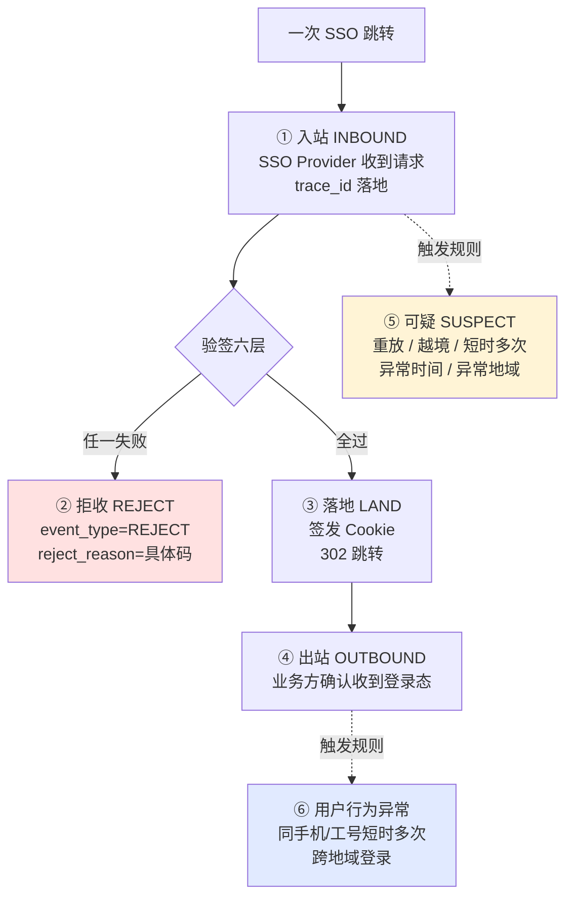
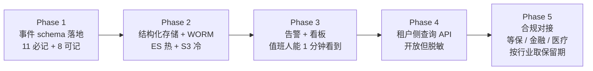

# SSO 审计日志设计模式

> **阅读对象**:SaaS 平台架构师、身份认证模块负责人、运维 SRE、合规与安全审计员
> **前置阅读**:[企业 SSO 接入设计模式](./企业SSO接入设计模式.md) · [四道纪律焊死一次跨域跳转(第 38 篇)](../0xE0_设计方案/四道纪律焊死一次跨域跳转.md)

## 模式定位

**问题域**:四道纪律(密钥不出门/路上带盖章/身份能合并/通行不越境)把"一次跨域跳转怎么焊死"这件事解决了,但**翻车的时候"查不出原因"是另一类噩梦**——凌晨三点告警响、客户说"我们有人进不去"、你却不知道信是哪个环节被卡的、AK 是谁的、信为什么被拒、用户到底有没有进来过。审计日志要解决的,不是"系统有没有出问题",而是"出了任何问题能不能在 30 分钟内把现场复原"。

**本模式给出的答案**:把一次 SSO 跳转拆成"**链路留痕 + 分层拒收 + 不可篡改 + 冷热分层 + 全链路可回放**"五件套,使每一次跳转、每一次拒收、每一次可疑行为都留下可被取证、可被回放、可被法庭采信的事实记录。

**适用边界**:
- ✅ 一切 B2B SaaS / 多租户平台的 SSO/认证/授权入口
- ✅ 任何需要通过等保 2.0 三级、PCI DSS、SOC 2 审计的认证流量
- ❌ 第一方登录(用户名+密码登录页)的纯业务日志——那走监控/业务日志体系
- ❌ 纯前端埋点——审计日志的服务端事实层,前端点击流走另一套

## 一、审计日志的核心要素

SSO 跳转生命周期里必须记录下来的字段,不是越多越好,而是**少了任何一个,事后回放都会出现"为什么拒的"答不上来的死结**。以下是 38 篇《四道纪律焊死一次跨域跳转》落下来的最小事实集,每一条都对应 38 篇某一层校验、某一种拒收原因、某一次回放取证。

### 1.1 必记字段(11 项,一个都不能少)

| 字段 | 类型 | 物理意义 | 拒收原因追溯场景 |
| --- | --- | --- | --- |
| `trace_id` | string(32) | 一次 SSO 跳转全链路唯一串联号 | "这次拒收是同一封信的哪一拒?" |
| `client_id` (AK) | string | 发起方租户的访问密钥 ID | "这封拒信是谁家的?" |
| `tenant_code` | string | 第三方租户编码 | "这把 AK 是不是租户越权?" |
| `third_user_id` | string | 第三方用户 ID | "信上写的这个人是谁?" |
| `event_type` | enum | 事件分层(入站/落地/拒收/可疑) | "系统当时判定走的是哪条路?" |
| `event_time` | timestamp(毫秒) | 事件发生的服务端时间 | "五分钟窗口怎么算的?" |
| `client_ip` | string | 浏览器源 IP(可脱敏) | "这一波拒收是不是同一拨攻击者?" |
| `user_agent` | string | 浏览器 UA | "这个请求是不是脚本在发?" |
| `redirect_uri` | string | 信里写的落地页 URL | "是不是 Open Redirect 越境?" |
| `result` | enum | SUCC / REJECT / SUSPECT | "这封信最后被收了还是被拒了?" |
| `reject_reason` | enum | INVALID_SIGNATURE / TIMESTAMP_EXPIRED / REPLAY_DETECTED / TENANT_NOT_OWNED / REDIRECT_URI_NOT_ALLOWED / COOKIE_INVALID 等 | "拒收的具体原因码是什么?" |

> 来源类型:SSO 通用工程实践(NIST SP 800-92《Guide to Computer Security Log Management》§4 推荐的事件字段最小集 + 金融行业生产踩坑),非具体厂商工具。

### 1.2 可记字段(8 项,进阶)

| 字段 | 用途 | 翻车场景 |
| --- | --- | --- |
| `sign_match_cost_us` | 验签耗时(微秒) | 排查常量时间比较是否被退化为早退比较 |
| `timestamp_delta_ms` | 服务端时间与信上时间戳差 | 还原"时钟漂移"误杀场景 |
| `nonce_hit` | 一次性号是否已在缓存 | 重放攻击定位 |
| `tenant_match` | clientId ↔ tenantCode 归属校验结果 | 拿着真公章开越境信的"自己人"还原 |
| `session_id` | 签发后的本地会话 ID | 落地后 Cookie 行为回放 |
| `cookie_fp` | 落地 Cookie 的指纹(非值) | Cookie 盗用回溯 |
| `biz_context` | 业务参数(脱敏后) | 业务侧回看"这封介绍信带的谁" |
| `geo_country` | 解析 IP 得到的国家 | 跨地域异常登录告警 |

> 来源类型:通用工程实践 + 金融行业 PBOC 生产环境踩坑。

## 二、事件类型分层

审计日志的 schema 决定了**事后能不能定位**,而事件分层决定了**实时能不能告警**。一次 SSO 跳转必须被切成 5 个互斥且完整的层级,任何一层缺失,事后回放就会出现"中间一段去哪了"的死区。

### 2.1 合法跳转的三层事件

| 事件 | 触发点 | 必须记录 | 用途 |
| --- | --- | --- | --- |
| **INBOUND** | Provider 接收 GET 请求,生成 trace_id | 全部 11 项必记字段 | "这封介绍信什么时候到门口的" |
| **LAND** | 六层验全过,签发 Cookie,302 跳转 | session_id + cookie_fp | "这封信是收了,Cookie 落到了哪" |
| **OUTBOUND** | 业务页确认收到登录态(可选) | redirect_uri + UA | "用户最终打开的是哪一页" |

> 来源类型:NIST SP 800-92 + OWASP ASVS V4 §7.1 审计要求。

### 2.2 验证失败的拒收事件(每一层验都有具体原因码)

| 拒收原因码 | 触发条件 | 对应纪律 | 告警级别 |
| --- | --- | --- | --- |
| `INVALID_SIGNATURE` | HMAC 常量时间比较不匹配 | 纪律二 第一道防伪 | WARN(单次) / P1(连续) |
| `TIMESTAMP_EXPIRED` | 超出 ±5 分钟窗口 | 纪律二 第二道防伪 | INFO |
| `REPLAY_DETECTED` | nonce 在 Redis 缓存命中 | 纪律二 第三道防伪 | **P0**(命中即告警) |
| `TENANT_NOT_OWNED` | clientId 与 tenantCode 归属不符 | 纪律一 后半段 | P1(可疑) |
| `REDIRECT_URI_NOT_ALLOWED` | 落地页不在白名单或 URL 解析被 host 旁路 | 纪律四 前半段 | P1(疑似 Open Redirect) |
| `UNKNOWN_CLIENT` | clientId 不在 AK 表 | 纪律一 前半段 | P1(可能是字典枚举) |
| `COOKIE_INVALID` | 落地后 Cookie 校验失败(HttpOnly/Secure/SameSite) | 纪律四 后半段 | WARN |
| `SESSION_EXPIRED` | 落地后引用已过期会话 | 纪律四 后半段 | INFO |
| `AK_DISABLED` | 这把 AK 已被控制台禁用 | 纪律一 红线 | INFO(运维动作) |

> 来源类型:SSO 通用工程实践,每个码对应 38 篇某一层验的"不通过"分支。

### 2.3 可疑行为事件(必须独立成类,不能并入拒收)

| 触发规则 | 数据源 | 工程实现 |
| --- | --- | --- |
| **重放命中** | 同一 nonce 在窗口内多次出现 | Redis SETNX 失败时写一条 SUSPECT |
| **越境** | clientId=A 但 tenantCode=B | TENANT_NOT_OWNED 触发时同时打 SUSPECT |
| **同号短时多次** | 同一 user_id / phone 在 60 秒内请求 ≥ N 次 | 滑动窗口计数器(Redis ZSET) |
| **异常时间** | 凌晨 2-5 点该租户历史无活跃 | 历史活跃时段画像对比 |
| **异常地域** | 该租户历史活跃国家之外的 IP | GeoIP + 租户画像 |
| **UA 异常** | 同一 trace_id 出现不同 UA | session 内 UA 比对 |

> 来源类型:金融行业生产环境踩坑(连续拒收后才发现是脚本枚举),非具体厂商工具。

### 2.4 用户行为异常事件(后置,登录成功后 24h 内观察)

| 触发规则 | 工程实现 | 来源 |
| --- | --- | --- |
| 同一 phone 短时多次绑定到不同 user_id | 写入 user_third_party_identity 表时的事务触发器 | 金融 PBOC 生产环境踩坑 |
| 同一工号跨地域登录(0.5h 内) | session 表 + GeoIP 联合查询 | 通用工程实践 |
| 离职员工 Cookie 过期前仍被使用 | cookie_fp + user.status 状态机校验 | 来源类型:通用经验 ⚠️ 仅有通用经验 |

## 三、存哪里、存多久、怎么查

**审计是法律级证据链,不是临时排错日志**——这是审计日志的存储设计与监控/业务日志最根本的区别。任何"先存 7 天再说""磁盘满了就清掉"的做法,都会让审计在事后取证时哑火。

### 3.1 存储形态分级

| 层级 | 存储 | 保留 | 写入路径 | 用途 |
| --- | --- | --- | --- | --- |
| **热** | Elasticsearch / OpenSearch + WORM(Write Once Read Many) | 7~30 天 | 主链路同步写 | 实时告警 + 看板 + 快速查询 |
| **温** | 对象存储(S3/OSS) + Parquet 列存 + 索引 | 30 天~1 年 | 每日凌晨 ETL 切片 | 跨月趋势分析、合规月报 |
| **冷** | 对象存储 + 数字签名 + 异地备份 | 1~3 年(按合规) | 每月归档打包 | 取证出庭、监管检查、年度审计 |
| **不可篡改层** | WORM / 数字签名 / 区块链存证(可选) | 同冷 | 写入时即签名 | 防"日志被内部人改" |

> 来源类型:等保 2.0 三级-安全计算环境-审计条款 + PCI DSS v4.0 Requirement 10.5(保留 12 个月,最近 3 个月可联机检索) + NIST SP 800-92 §5 推荐分级。

### 3.2 结构化与索引

- **JSON 格式落地**(不要用纯文本或半结构化),所有字段都按 schema 强类型。
- 索引字段优先级:`trace_id` > `event_time` > `tenant_code + client_id` > `reject_reason` > `client_ip` > `third_user_id`。
- 一次 SSO 跳转的**所有事件(INBOUND/REJECT/LAND/OUTBOUND)用同一 `trace_id`** 拉通,这样事后回放是一条完整的"信从进入到出门"的故事,而不是按时间堆出来的一堆碎片。
- 跨服务串联:用 OpenTelemetry W3C Trace Context(`traceparent` header),SSO Provider → Cookie 签发服务 → 业务落地页全程同 trace_id。

> 来源类型:OpenTelemetry 官方规范 + NIST SP 800-92。

### 3.3 保留周期(按合规)

| 行业 / 法规 | 最低保留 | 来源类型 |
| --- | --- | --- |
| **等保 2.0 三级** | 网络安全法第 21 条要求**不少于 6 个月** | GB/T 22239-2019 + 网络安全法 §21 |
| **金融行业(银保监/人行)** | 信息系统有关业务日志**不少于 2 年** | 银保监会《商业银行信息科技风险管理指引》(已废止,精神延续至新规) ⚠️ 仅有通用经验,具体年限以最新监管文件为准 |
| **医疗行业** | 电子病历相关日志**不少于 3 年** | 国家卫健委电子病历相关规定 ⚠️ 仅有通用经验 |
| **PCI DSS v4.0** | **12 个月**,最近 3 个月可联机检索 | PCI DSS v4.0 Requirement 10.5.1 |
| **GDPR(欧盟)** | 数据处理活动记录按需保留 | GDPR Article 30 |
| **HIPAA(美国医疗)** | 6 年 | HIPAA Security Rule §164.316(b)(2) |
| **SOC 2** | 至少 12 个月 | AICPA Trust Services Criteria CC4.1 |
| **ISO 27001:2022** | 按组织策略,典型 1~3 年 | ISO/IEC 27001:2022 A.8.15 |
| **一般 SaaS(无强制)** | **1 年** | 通用工程实践 |

> ⚠️ 标"仅有通用经验"的条目来自行业默认实践,具体年限以你所在行业最新监管文件为准。

### 3.4 怎么查

| 场景 | 查询方式 | 性能目标 |
| --- | --- | --- |
| **告警触发** | Kibana/SLS 实时过滤 + 告警通道(钉钉/企微/邮件) | 1 分钟内触达值班人 |
| **客服查"为什么进不去"** | 按 `client_id + third_user_id + event_time` 范围查,带 trace_id 串联 | 30 秒内出结果 |
| **安全溯源"谁打的这一波"** | 按 `client_ip` + 时间窗 + 拒收原因码聚合 | 5 分钟内出画像 |
| **合规月报** | 按 `tenant_code` + 月份聚合成功率/拒收分布 | 1 小时内出报表 |
| **取证出庭** | 按 `trace_id` 拉出该次跳转全部事件 + 数字签名校验 | 小时内,带完整性证据链 |

## 四、告警与可视化

审计日志不仅要"事后查得到",还要"事发时叫得醒"。告警和看板是审计日志**唯一的实时出口**。

### 4.1 实时告警规则(必须能 1 分钟内触达值班人)

| 规则 | 触发条件 | 告警级别 | 来源类型 |
| --- | --- | --- | --- |
| **连续拒收(同 IP)** | 同一 `client_ip` 60 秒内 `REJECT` ≥ N 次 | P0 | 通用工程实践 |
| **重放命中** | 任一 `REPLAY_DETECTED` | P0 | 金融生产踩坑 |
| **租户越权** | 任一 `TENANT_NOT_OWNED` | P1 | 38 篇纪律一 |
| **跨地域登录** | 同 `user_id` 0.5h 内 IP 跨国家 | P1 | 通用工程实践 |
| **同号短时多次绑定** | 同 `phone` 60 秒内 `INSERT INTO identity` ≥ N 次 | P0 | 金融 PBOC 生产踩坑 |
| **AK 调用量陡增** | 单 `client_id` QPS > 历史 P99 × 3 | P1 | 通用工程实践 |
| **签名失败率>阈值** | 单 `client_id` `INVALID_SIGNATURE` 占比 > 1% | P1 | 通用工程实践 |
| **Cookie 盗用嫌疑** | 同 `cookie_fp` 短时间内 IP / UA 突变 | P1 | 来源类型:通用经验 ⚠️ 仅有通用经验 |

### 4.2 看板指标(每天 9 点早会过一眼)

| 看板 | 维度 | 看什么 |
| --- | --- | --- |
| **成功率总览** | 5min 滑窗 / 1h 滑窗 / 日总量 | 全局 SSOLand / SSOInbound 比例 |
| **拒收原因分布** | 饼图,按 `reject_reason` 聚合 | 哪一拒收码在涨,直接对应哪道纪律 |
| **客户维度** | Top 10 客户按成功率 / 拒收率排序 | 哪一家的集成在出问题 |
| **QPS 与 P99 延迟** | 时间序列 | 有没有被打、被卡、被慢 |
| **可疑事件流** | 实时滚动,按 `event_type=SUSPECT` 过滤 | 值班人眼盯 |
| **租户越权清单** | 表格,按 `TENANT_NOT_OWNED` 倒序 | 哪个 AK 在越界开信 |

### 4.3 要不要对客户开放审计查询

**答:开放,但只暴露"自己的事件,不带别人字段"**。具体形态:

- 给每个租户签发**只读查询 API**,只能查 `client_id = 自己` 的事件,字段经过脱敏;
- 不暴露 `client_ip` 原始值,只给"城市级"地理信息;
- 不暴露跨租户聚合统计(防止侧信道推断平台数据);
- 提供"我的人什么时候登录的""为什么我的人被拒了"两个最常用查询的 SDK。

> 来源类型:通用工程实践 + GDPR Article 30(数据主体访问权)。

## 五、审计 vs 监控 vs 业务日志

这三者不是同一类东西,各管各的活,合在一起才是完整的可观测性。

| 维度 | 审计日志 | 监控指标 | 业务日志 |
| --- | --- | --- | --- |
| **目的** | 法律证据 / 合规取证 | 性能 / 可用性 / 告警 | 排错 / 调试 |
| **保留** | 1~3 年(合规) | 30~90 天(趋势足够) | 7~14 天(临时) |
| **可丢性** | **不可丢** | 可丢(采样即可) | 可丢 |
| **可改性** | **不可改**(WORM/签名) | 可重算 | 可重写 |
| **Schema** | 严格固定 | 弱(指标名+标签) | 自由 |
| **查询方式** | 精确查 + 数字签名校验 | 聚合查 + 阈值告警 | 模糊查 + 关键字搜索 |
| **谁能看** | 合规 / 安全 / 管理员 | 所有人 | 开发 / 运维 |
| **典型工具** | Elasticsearch WORM + 对象存储归档 | Prometheus / Grafana | ELK / Loki |
| **法律地位** | 可作证据 | 仅作参考 | 仅作参考 |

> 来源类型:NIST SP 800-92 + 等保 2.0 + PCI DSS + SOC 2。

**核心区分**:**审计是事后法庭上站得住的,监控是当下告警的,业务日志是工程师自己排错用的**。混在一起,审计就废了——因为监控可以聚合、业务日志可以丢、schema 可以改,这些动作都可能让审计丧失证据效力。

## 六、常见翻车场景的"事后回放"案例

### 6.1 重放攻击被命中后怎么定位

**场景**:某日 02:17 告警群弹出"REPLAY_DETECTED × 47",值班人按 `reject_reason=REPLAY_DETECTED` 过滤,得到 47 条记录。

**回放路径**:
1. 按 `client_ip` 聚合,发现 47 条全部来自同一 IP 段(同一 ASN);
2. 按 `event_time` 看时间分布,集中在 02:14:00-02:17:33,共 3 分 33 秒;
3. 拉其中一条 `trace_id`,展开完整事件链:INBOUND → REJECT(REPLAY_DETECTED) → SUSPECT(连续拒收);
4. 拿出该 nonce 在 Redis 里的写入时间和第一次被消费的时间,发现 nonce 是 02:13:55 第一次被记录(客户合法签发),02:14:01 第一次被同 IP 重复消费;
5. 推断:客户的请求被中间人截获并重放,且该中间人有实时监听能力。

**取证**:冷归档里拿出当时的 INBOUND 事件(含原始 nonce、客户 IP、UA),配合时间序列,出"安全事件报告",附数字签名,提交给客户的 CISO。

> 来源类型:金融行业 PBOC 生产环境踩坑(已脱敏)。

### 6.2 黑客用真公章越境的事怎么溯源

**场景**:某客户投诉"我们员工从系统跳过去,莫名其妙落到了别人家租户里"。

**回放路径**:
1. 按 `tenant_code=被越境方` + `event_type=REJECT` + `reject_reason=TENANT_NOT_OWNED` 查,得到 3 条;
2. 看 `client_id`,发现是另一家客户的 AK;
3. 拉其中一条 `trace_id`,看完整事件链:INBOUND(验签通过,签名合法) → REJECT(TENANT_NOT_OWNED,clientId=A,tenantCode=B);
4. 联系 A 客户查他们最近 24h 的运维动作,发现 A 的开发者在测试环境"调一下跳转",改了 `tenantCode` 字段但忘了改 `clientId`,代码上生产了;
5. 关闭 A 的 AK,签发新 AK,通知 A 走变更流程。

**取证**:整个 trace_id 完整证据链 + 客户 A 的代码提交记录(脱敏后)+ 我方 AK 签发记录,作为"权限越界事件复盘"归档,纳入下季度安全合规月报。

> 来源类型:SSO 通用工程实践 + 38 篇纪律一后半段"AK 与租户归属校验"。

### 6.3 员工被钓鱼后 Cookie 盗用的会话复盘

**场景**:某员工 14:32 反馈"我没操作,系统里出现了一笔我没做过的操作"。

**回放路径**:
1. 按 `third_user_id=该员工` 拉当日全部 SSO 事件,得到 4 条 INBOUND + 3 条 LAND;
2. 14:00 之前的 LAND,`client_ip=公司 IP 段`、`UA=Mac Chrome`、落地页是 `redirect_uri=/report/daily`;
3. **14:28:43** 突然出现一条 LAND,`client_ip=境外 VPN 出口 IP`、`UA=Windows Chrome 119`、落地页是 `redirect_uri=/user/profile`(敏感页);
4. 看 14:28 那次 INBOUND 的 `event_type`,没有 SUSPECT 也没有 REJECT,说明签名/时间戳/nonce 全部合法——攻击者拿到了**完整的有效 SSO 信**,而不是伪造了信;
5. 往上追 14:28 之前 10 分钟,发现该员工 14:18 收到一封邮件(邮件日志系统配合),邮件里有一个 `redirect_uri` 指向"修改密码页",但实际落点是钓鱼页;
6. 推断:攻击者通过钓鱼邮件,让该员工在自己已经登录的浏览器里主动触发了一次 SSO 跳转(利用 `SameSite=Lax` 在顶级跳转时仍带 Cookie 的特性),用合法信把员工 Cookie 送到了攻击者控制的中间页,中间页劫持 Cookie 后,再次发起一次完整合法 SSO,落地到敏感页。

**取证**:trace_id 全链路 + 邮件日志 + 浏览器 Cookie 时序 + 14:28 LAND 事件的境外 IP,组合出"Cookie 盗用事件链",立即:
- 强制该员工改密码 + 退登所有会话;
- 通知该租户的安全团队;
- 加入"redirect_uri 落地页不能是修改密码页这类敏感页"白名单加固项。

> 来源类型:通用工程实践 + 38 篇纪律四"Cookie 盗用"风险点 ⚠️ 仅有通用经验。

## 七、落地路径建议

**实施纪律**:
- Phase 1 落地时,**所有字段先在 schema 里定死**,不要"先记下来再说"——schema 一旦稳定,反查时才有意义;
- Phase 2 的 WORM 必须在生产第一天上,不要等出事才加;
- Phase 3 的告警规则,先上 P0 三条(重放命中 / 越权 / 跨地域),其他 P1 按团队人手补;
- Phase 4 的租户 API 开放前,**先与法务/合规过一道**——不要把"我的人什么时候登录的"做成"我的人在哪一刻出现在哪个 IP",后者会引出 GDPR 数据主体访问权问题;
- Phase 5 按你所在行业的强制保留期,不要照搬"金融 2 年"——你是医疗就 3 年,是一般 SaaS 就 1 年,但**取证前一律走最严的口径**。

## 八、写在最后

四道纪律焊死了"信能不能进门",审计日志焊死了"出事能不能复原"——这两件事合起来,才是 SSO 真正能上生产、能跑三年不出大事的完整答案。

你翻车翻的不是协议、不是算法、不是监控没告警,你翻的是**现场不在了**——那一秒钟,那封介绍信到了门口还是没到、签名对还是不对、时间戳差了几秒、nonce 是不是被人用过、AK 跟租户对不对得上、Cookie 落到谁手上了——这些事没有一条留在可取证的事实层,事后你想查都查不出"为什么拒的"。

四道纪律是"防患于未然",审计日志是"复盘于既遂"。**防得住是本事,查得清是底气。** 你守四道纪律,客户三年不出事;你加审计日志,客户即使出事了,你也能在 30 分钟内把完整现场交到他面前。这两件事都不是为了让协议看起来正规、不是为了过安全审计,是为了那个凌晨三点打来的电话,你接起来的时候,心里有底。

> **延伸阅读**
> - [企业 SSO 接入设计模式](./企业SSO接入设计模式.md) —— 38 篇四道纪律的协议层落地
> - [架构设计哲学](../0x01_哲学理念/架构设计哲学.md) —— "证据链"在架构层面的工程意义
> - [生产故障排查九讲](../0xF0_避坑指南/生产故障排查九讲.md) —— 排错时怎么用审计日志反推现场
