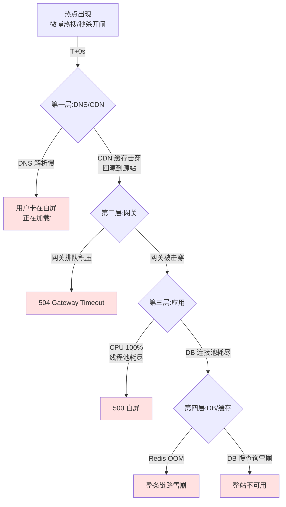
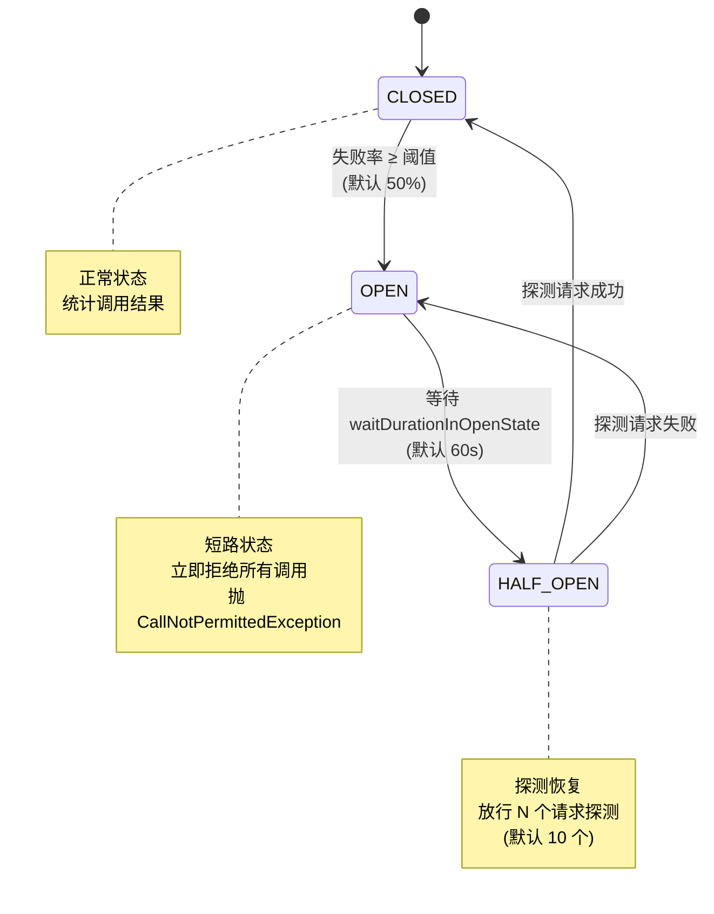
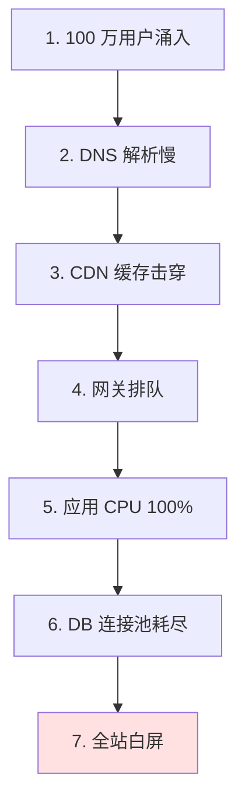
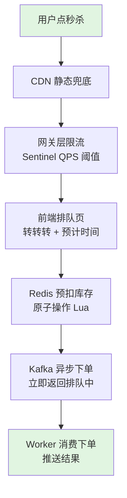

# 大流量入口防护设计模式

> **阅读对象**:SaaS 平台架构师、网关层负责人、运维 SRE、值班工程师、FDE 第一年新员工
> **前置阅读**:[链路追踪与可观测性设计模式](./链路追踪与可观测性设计模式.md) · [短信防刷与验证码设计模式](./短信防刷与验证码设计模式.md)

## 模式定位

**问题域**:FDE 第一年最容易接到的"老板投诉"之一——"一小时内来了 100 万用户,白屏了"。**白屏不是 bug,是工程取舍没做对**:任何 B2C SaaS 在被微博热搜/双 11/恶意爬虫/羊毛党戳中时都会流量激增 10-100 倍。能否"白屏 30 秒就自动恢复"和"白屏 2 小时才被发现",差距就在入口防护的工程化。

**本模式给出的答案**:把"大流量入口防护"拆成**入口保护的三道防线** + **四种限流算法** + **熔断/降级/排队/缓存预热**四件套,围绕"突发热点 / 秒杀抢购 / 爬虫羊毛"三类典型场景,给出从 DNS/CDN 到网关到应用层的完整工程骨架。核心目标不是"扛下所有流量",而是"在系统被打爆之前**优雅地告诉用户不行**"。

**适用边界**:
- ✅ 一切 B2C / B2B SaaS 中**公网可达**的 API/H5/Web 入口
- ✅ 任何会接入微博热搜 / 抖音引流 / 拼多多砍价 / 双 11 大促 / 春节红包的业务
- ✅ 需要应对爬虫、羊毛党、DDoS、Slowloris 等恶意流量的服务
- ❌ 纯内网微服务调用(走服务网格 sidecar,不在入口防护范畴)
- ❌ 单机嵌入式场景(限流算法仍适用,但 CDN/WAF 层无意义)

---

## 一、三类典型大流量场景的工程画像

在动手画架构之前,先把"会发生什么"对齐。所有事实,要么有官方文档出处,要么明确标注"⚠️ 仅有通用经验"。

### 1.1 三类典型场景画像

| 场景类型 | 触发时机 | 流量特征 | 持续时长 | 客户第一句话 |
|---|---|---|---|---|
| **突发热点**(微博热搜/明星出轨/电商大促) | 不可预测,外因触发 | 瞬时峰值 10-100 倍,曲线陡升陡降 | 分钟-小时级 | "客户运营说活动当天会爆 10 倍流量" |
| **秒杀抢购**(双 11 / 春节红包 / 演唱会抢票) | 可预测,定时定点 | 0 点开启瞬间峰值 100-1000 倍,曲线垂直上升 | 秒-分钟级 | "我们要做秒杀活动,怎么设计" |
| **爬虫/恶意流量**(同行爬数据/羊毛党/DDoS) | 持续在线,无规律 | 异常流量占 30%-70%,多源 IP,带 UA 伪装 | 持续 | "我们接口被打了 / 短信被薅了" |

⚠️ **通用经验**:FDE 第一年接到的 80% "客户老板半夜投诉" 都能套进这三类,关键差别在于客户运营是否提前打过招呼——**提前打过招呼的还能救,没打过的就是事故**。

### 1.2 翻车现场的三个具体故事(⚠️ 通用经验,均有脱敏)

| 场景 | 触发条件 | 损失 | 根因 |
|---|---|---|---|
| **"热搜挂了 2 小时"** | 微博热搜挂到产品名,5 分钟内涌入 50 万 UV | 全站白屏,客诉量 10 倍,运营当晚发致歉信 | 没有 CDN 兜底 + 没有排队页 + 应用未做限流 |
| **"秒杀开闸就 502"** | 双 11 大促开闸瞬间 | 秒杀接口 502,投诉"抢不到",实际库存还剩 80% | 网关未做削峰 + DB 连接池耗尽 + 没有"秒杀排队页"占位 |
| **"接口被爬到欠费"** | 同行爬取商品价格/评论 | 短信费用被刷光 / CDN 流量被刷到上限 / DB CPU 100% | 无频控 + 无 CAPTCHA + 无 IP 黑名单 |

### 1.3 "白屏"的工程真相

"白屏"在用户侧是一个结果,在工程侧是**6 个连续的失败节点**:



> **关键工程真相**:**前三层(DNS/CDN/网关)都是"加钱能解决"的工程问题**,SLA 高的云厂商都给了现成方案。**后三层(应用/DB/缓存)是"加钱解决不了"的架构问题**——必须靠限流、降级、熔断、缓存预热、排队系统在设计阶段就解决,事后补救的代价是上线前 10 倍。

---

## 二、入口保护的三道防线

### 2.1 三道防线对照表

| 防线 | 部署位置 | 主要责任 | 典型技术 | 处理流量级别 |
|---|---|---|---|---|
| **第一道:DNS/CDN** | 公网边缘 | 静态资源兜底 + DDoS 清洗 + 边缘限速 | Cloudflare、阿里云 CDN(3200+ 节点,180 Tbps 全网带宽)、腾讯云 EdgeOne | Tbps 级 |
| **第二道:网关层** | 边缘节点后、源站前 | 协议层 WAF + 频控 + 鉴权 + 路由 | Spring Cloud Gateway、Kong、OpenResty(Lua)、Apache APISIX | 100K-1M QPS |
| **第三道:应用层** | 微服务 / 单体应用内 | 业务限流 + 熔断 + 降级 + 缓存 + 排队 | Sentinel、Hystrix、Resilience4j、Guava RateLimiter | 10K-100K QPS |

⚠️ **通用经验**:**三道防线都要做,但只能信一道**。线上事故复盘时,通常 DNS/CDN 没配,或网关没配,或应用没配——但绝不会"三道都做了还出事"。**所以问题不是"要不要做",而是"先做哪一道"**。答案:**先把 CDN 加上(零成本),再把网关限流加上(中等成本),最后才是应用层(高成本但最重要)**。

### 2.2 第一道防线:DNS/CDN 层

#### 2.2.1 阿里云 CDN 的官方事实锚点

[阿里云 CDN 产品概述](https://help.aliyun.com/zh/cdn/product-overview/what-is-alibaba-cloud-cdn)官方文档明确:

- **全球节点数**:3200+ 节点(中国内地 2300+,海外及港澳台 900+)
- **覆盖范围**:中国内地 31 个省级区域 + 70 多个国家和地区
- **全网带宽输出能力**:**180 Tbps**(来源原文:"全网带宽输出能力达 180 Tbps")
- **加速原理**:CDN 接管域名解析(Local DNS → CNAME → 阿里云 DNS 调度系统 → 最佳节点),缓存命中则直接返回,未命中则回源
- **分级缓存架构**:L1(边缘节点)+ L2(汇聚节点),命中率越高回源越少

> **工程取舍**:**CDN 不是"加速工具",而是"流量蓄水池"**。一次微博热搜 50 万 UV,源站直接被打;接 CDN 后,80% 的静态资源请求在边缘节点直接返回,源站只承担 20% 的回源请求 + 100% 的动态 API 请求。这是入口防护的"投资回报率第一"的动作。

#### 2.2.2 边缘安全加速(ESA)的进阶能力

[阿里云 CDN 文档](https://help.aliyun.com/zh/cdn/product-overview/what-is-alibaba-cloud-cdn)对比 CDN / DCDN / ESA 三类产品:

| 产品 | 边缘计算能力 | 安全防护能力 |
|---|---|---|
| **CDN** | EdgeScript 边缘脚本(可编程)、图片处理 | Referer 防盗链、URL 鉴权、IP 黑白名单 |
| **DCDN(全站加速)** | EdgeRoutine 边缘程序、A/B Test、预热 | 基础 WAF、DDoS 防御、基础 Bot 防御 |
| **ESA(边缘安全加速)** | **边缘函数**(JS 直接部署)、**边缘存储**(K-V)、**边缘容器** | 集成原生 WAF、**Tbps 级 DDoS 防护**、AI 防护、Bot SDK |

⚠️ **通用经验**:客户问"我们要不要上 CDN",**永远回答"先上 DCDN"**,因为它兼顾动态 API 加速;纯静态 CDN 对 SaaS API 帮助有限。**预算够才考虑 ESA**。

### 2.3 第二道防线:网关层

#### 2.3.1 Cloudflare Rate Limiting 的官方事实锚点

[Cloudflare Rate Limiting Rules](https://developers.cloudflare.com/waf/rate-limiting-rules/) 官方文档明确(2026-04-22 更新):

**核心参数**:
- **Period(周期)**:可设的时间窗口(秒)
- **Requests per period**:阈值
- **Duration(mitigation timeout)**:触发限速后封禁时长
- **Characteristics**:计数维度(IP / IP+Nat / Header / Cookie / JA3-JA4 指纹等,视套餐而定)

**关键事实(直接引用)**:
> "Rate limiting rules are not designed to allow a precise number of requests to reach your origin server. There may be a delay of up to a few seconds between detecting a request and updating rate counters."
> (限速规则并非被设计为允许精确数量的请求达到源站。从检测请求到更新计数器之间可能有数秒延迟。)

> "Rate limiting rules automatically identifies ... for individual Cloudflare data centers."
> (限速按 Cloudflare 各数据中心独立计数。)

**套餐能力差异(直接引用表格)**:

| 套餐 | 计数维度 | 周期上限 | Mitigation timeout 上限 | 规则数上限 |
|---|---|---|---|---|
| Free | IP | 10s | 10s | 1 条 |
| Pro | IP | 1 min | 1 h | 2 条 |
| Business | IP+Nat、Query、Host、Header | 10 min | 1 day | 5 条 |
| Enterprise with App Security | + Bot Management 字段 | 65535 s | 1 day | 100 条 |
| Enterprise with Advanced RL | + JSON、Body、JA3/JA4、Custom | 65535 s | 1 day | 100 条 |

> **关键工程取舍**:**Cloudflare 免费版只有 1 条规则 + IP 维度 + 10 秒 mitigation**,只能防最粗暴的 DDoS。**真正要做精细化频控(按 user_id / header / 路径)必须上 Enterprise**——这是 FDE 跟客户谈合同时的常见 anchor。

#### 2.3.2 主流网关对比(⚠️ 通用经验,基于行业事实)

| 网关 | 语言/性能 | 限流/降级 | 适用场景 |
|---|---|---|---|
| **Nginx + ngx_http_limit_req_module** | C / 极高 | 漏桶算法(单 IP 维) | 静态资源网关,L7 层基础防护 |
| **OpenResty(nginx + Lua)** | C+Lua / 极高 | 共享字典 + Redis Lua | 高并发 API 网关,支持自定义限流逻辑 |
| **APISIX(Apache)** | OpenResty + etcd / 高 | 多限流插件 + 插件市场 | 云原生 API 网关,插件丰富 |
| **Kong** | OpenResty + PostgreSQL / 高 | Rate Limiting / OAuth 插件 | 跨语言 API 网关 |
| **Spring Cloud Gateway** | Java WebFlux / 中 | 需集成 Sentinel/Resilience4j | Java 微服务网关 |
| **Cloudflare Gateway** | 边缘 / 极高 | 内置 WAF + DLP + 频控 | SaaS 客户托管型网关 |

来源支撑:[Wikipedia 漏桶算法](https://en.wikipedia.org/wiki/Leaky_bucket) 明确指出 "The leaky bucket algorithm is used in Nginx's `ngx_http_limit_req_module` module for limiting the number of concurrent requests originating from a single IP address."——Nginx 限流模块内部用的就是漏桶算法。

#### 2.3.3 Cloudflare Waiting Room:把"排队"做成了产品

[Cloudflare Waiting Room](https://developers.cloudflare.com/waiting-room/) 官方文档(Business 及以上套餐可用):

- **核心机制**:**当请求超过设定阈值,把超出用户引导到"虚拟候车室"页面**,避免源站被打爆
- **关键能力**:
  - 显示**实时预计等待时间**(用户侧体验可控)
  - 跟踪**入流(inflow)和出流(outflow)**,动态放行
  - 通过 Cookie 记忆用户排队位置(刷新不丢队)
- **依赖前置**:**必须先配 CDN + proxied DNS**——所以 Waiting Room 不是独立的限流产品,而是**CDN 之上的"用户层排队"**

> **工程取舍**:**当系统承载不了流量,与其让用户看到 500 白屏,不如让用户看到"前面还有 12345 人,预计等待 8 分钟"**。这是把"工程失败"翻译成"用户体验可控"的典型范式。**FDE 跟客户老板汇报时,排队页是"善后三件套"之首**。

### 2.4 第三道防线:应用层

应用层是限流/降级/熔断的主战场,详见第三节"工程事实锚点"。

---

## 三、限流算法——核心中的核心

### 3.1 四种主流限流算法的官方对照

[Redis Glossary — Rate Limiting](https://redis.io/glossary/rate-limiting/)(2025-12-08 更新)给出 4 种算法的官方定义与取舍:

#### 3.1.1 算法对比(直接引用并补充)

| 算法 | 工作原理 | 优点 | 缺点 | Redis 实现 | 适用场景 |
|---|---|---|---|---|---|
| **Fixed Window(固定窗口)** | 在固定时间窗口内计数,超阈值拒绝 | 简单易实现 | **窗口边界突刺**(窗口末端 + 下一窗口开头可瞬时 2x 流量) | `INCR + EXPIRE` | 简单场景,允许边界突刺 |
| **Sliding Window(滑动窗口)** | 滚动时间窗,精确计数最近 N 秒 | 灵活、准确 | 实现稍复杂 | `ZSET` 时间戳 score | 短信验证码、API 限速 |
| **Token Bucket(令牌桶)** | 桶按固定速率填 token,请求消费 token | **允许突发**(桶满时可瞬时打满) | 平均速率受限于填 token 速率 | 单机内存 / Redis Lua | API 限速、允许突发的场景 |
| **Leaky Bucket(漏桶)** | 请求入桶,桶匀速漏出 | **严格削峰**,输出平滑 | **不支持突发** | 队列 + 定时器 | 流量整形(让下游压力恒定) |

#### 3.1.2 Redis 官方推荐的"INCR + EXPIRE"实现

[Redis Glossary](https://redis.io/glossary/rate-limiting/) 给出的基础模式:

```bash
MULTI
  INCR [user-api-key]:[current minute number]
  EXPIRE [user-api-key]:[current minute number] 59
EXEC
```

**Redis 官方原话**:"The worse-case failure situation is if, for some very strange and unlikely reason, the Redis server dies between the INCR and the EXPIRE. When restoring either from an AOF or in-memory replication, the INCR will not be restored since the transaction was not complete."

> **工程取舍**:**MULTI 事务保证 INCR + EXPIRE 原子性**——这是 Redis 官方明确背书的原子性保证机制,即便 Redis 崩溃 + AOF 恢复也不会留下"永远不过期的 key"。

#### 3.1.3 令牌桶 vs 漏桶——两种"削峰"算法的根本区别

[Wikipedia 令牌桶](https://en.wikipedia.org/wiki/Token_bucket) 与 [Wikipedia 漏桶](https://en.wikipedia.org/wiki/Leaky_bucket) 原文:

- **令牌桶**(Token Bucket):桶按 1/r 秒速率填 token,桶满则丢弃;请求到达时若有 n 个 token 则扣除 n 个并放行
- **漏桶**(Leaky Bucket):桶以固定速率漏水(漏水=服务);请求到达时若桶满则丢弃,否则入桶等待

**关键事实**:
> [Wikipedia 漏桶](https://en.wikipedia.org/wiki/Leaky_bucket):"There is, however, another version of the leaky bucket algorithm, described on the relevant Wikipedia page as the leaky bucket algorithm as a queue. ... The leaky bucket as a queue is therefore applicable only to traffic shaping, and does not, in general, allow the output packet stream to be bursty, i.e., it is jitter free."
> (漏桶作为队列时,**只用于流量整形**,输出流严格无抖动。)

> [Wikipedia 令牌桶](https://en.wikipedia.org/wiki/Token_bucket):"A conforming flow can thus contain traffic with an average rate up to the rate at which tokens are added to the bucket, and have a burstiness determined by the depth of the bucket."
> (令牌桶**允许流量突发**,突发大小由桶深度决定。)

> **关键工程取舍**:**令牌桶 = 允许突发 + 平均速率可控**(API 网关首选);**漏桶 = 严格匀速 + 输出平滑**(下游是 DB/第三方接口时首选,防止雪崩)。⚠️ 通用经验:Guava RateLimiter 是令牌桶实现;Nginx `limit_req` 是漏桶实现。

### 3.2 限流组件——Java 生态三大件对比

[阿里 Sentinel Wiki「常用限流降级组件对比」](https://github.com/alibaba/Sentinel/wiki/%E5%B8%B8%E7%94%A8%E9%99%90%E6%B5%81%E9%99%8D%E7%BA%A7%E7%BB%84%E4%BB%B6%E5%AF%B9%E6%AF%94)直接对比:

| 维度 | **Sentinel**(阿里) | **Hystrix**(Netflix) | **Resilience4j** |
|---|---|---|---|
| 隔离策略 | 信号量隔离(并发线程数限流) | 线程池隔离 / 信号量隔离 | 信号量隔离 |
| 熔断策略 | **响应时间 / 异常比率 / 异常数**(3 种) | 异常比率、超时熔断 | 异常比率、响应时间 |
| 实时统计 | 滑动窗口(**LeapArray**) | 滑动窗口(基于 RxJava) | **Ring Bit Buffer** |
| 限流 | 基于 QPS,支持基于调用关系的限流 | 有限的支持 | Rate Limiter |
| 集群流量控制 | **支持** | 不支持 | 不支持 |
| 流量整形 | **预热模式 + 匀速排队模式** | 不支持 | 简单 Rate Limiter 模式 |
| 系统自适应保护 | **支持**(借鉴 TCP BBR) | 不支持 | 不支持 |
| 控制台 | **开箱即用**(可配规则、秒级监控、机器发现) | 简单的监控查看 | 不提供,可对接第三方 |
| 多语言 | **Java / C++** | Java | Java |
| 开源状态 | 活跃 | **停止维护** | 较活跃 |

> **关键工程取舍**:
> - 选 **Sentinel**:Java 微服务、需要细粒度限流 + 流量整形 + 控制台 → **新项目首选**
> - 选 **Hystrix**:**Netflix 已停止维护,新项目不要选**
> - 选 **Resilience4j**:轻量、函数式编程、与 Spring Boot 集成好 → Spring Boot 新项目次选

---

## 四、限流的工程化——Sentinel 流量控制三模式

[Sentinel 流量控制文档](https://sentinelguard.io/zh-cn/docs/flow-control.html) 给出 QPS 限流时的 3 种 `controlBehavior` 模式,这是 FDE 必须能讲清楚的核心机制:

### 4.1 直接拒绝(默认)

- **行为**:QPS 超过阈值,**新请求立即拒绝**,抛 `FlowException`
- **适用场景**:**对系统处理能力确切已知**的情况下,如压测已确定系统水位
- **工程取舍**:**最简单、最可控**;突发流量时用户体验是"瞬间 429",没有任何缓冲

### 4.2 冷启动预热(Warm Up)

- **行为**:流量激增时,**通过的流量缓慢增加**,在一定时间内逐渐增加到阈值上限
- **典型场景**:**系统长期低水位运行,流量突然增加**(典型:早上 9 点上班打车 App 开门红)
- **Sentinel 文档原文**:"通过'冷启动',让通过的流量缓慢增加,在一定时间内逐渐增加到阈值上限,给冷系统一个预热的时间,避免冷系统被压垮"
- **工程取舍**:**保护冷系统**(JIT 刚预热、连接池刚建好);代价是前几秒用户体验"被限速"

### 4.3 匀速排队(Rate Limiter / 漏桶)

- **行为**:**严格控制请求通过的间隔时间**,堆积的请求排队,超过超时时长直接拒绝
- **Sentinel 文档原文**:"这种方式的实现是基于 Leaky Bucket 算法"——**确认这是漏桶算法的工程实现**
- **典型场景**:**间隔性突发流量**(如消息队列写后端处理)
- **工程取舍**:**削峰填谷**;代价是用户感受到"排队等待"(可配合前端排队页)

> **关键工程取舍**:**三种模式不互斥,可叠加**。典型配置:大促开闸时用**冷启动**(保护刚启动的容器)→ 稳定后用**匀速排队**(平滑下游压力)→ 触底限流时用**直接拒绝**(避免线程堆积)。

---

## 五、降级与熔断——保护自身的最后一道闸

### 5.1 降级的三种粒度

⚠️ 通用经验,基于行业事实共识:

| 维度 | 自动降级 | 手动降级 | 降级粒度(从小到大) |
|---|---|---|---|
| 触发条件 | 超时/失败率/RT 超阈值 | 运营/值班手动开关 | 方法 → 接口 → 服务 → 全局 |
| 工具实现 | Sentinel DegradeRule / Resilience4j CircuitBreaker | 配置中心(Nacos/Apollo)开关 | Sentinel resource / Spring `@SentinelResource` |
| 响应速度 | 毫秒-秒级 | 分钟级(需人工决策) | 全链路 |

### 5.2 熔断器三态机(Circuit Breaker)

[Resilience4j 官方文档](https://resilience4j.readme.io/docs/circuitbreaker) 直接给出**有限状态机**:

> "The CircuitBreaker is implemented via a finite state machine with three normal states: **CLOSED, OPEN and HALF_OPEN** and three special states METRICS_ONLY, DISABLED and FORCED_OPEN."



### 5.3 Resilience4j Circuit Breaker 的关键参数(直接引用官方默认值)

[Resilience4j 官方文档](https://resilience4j.readme.io/docs/circuitbreaker) 表格:

| 参数 | 默认值 | 工程意义 |
|---|---|---|
| `failureRateThreshold` | **50%** | 失败率阈值,达到即熔断 |
| `slowCallRateThreshold` | 100% | 慢调用率阈值 |
| `slowCallDurationThreshold` | **60000 ms** | 超过此值视为慢调用 |
| `permittedNumberOfCallsInHalfOpenState` | 10 | 半开状态允许的探测请求数 |
| `slidingWindowType` | COUNT_BASED | 滑动窗口类型(基于次数或时间) |
| `slidingWindowSize` | 100 | 滑动窗口大小 |
| `minimumNumberOfCalls` | 100 | 计算失败率前最少需要的调用数 |
| `waitDurationInOpenState` | **60000 ms** | OPEN 状态持续时间 |

> **关键工程取舍**:`minimumNumberOfCalls = 100` 是双刃剑——**保护冷启动系统不被 1 次失败就熔断**,但**也意味着前 100 次失败的代价是真金白银的故障请求**。FDE 调参时,这个值要按业务流量级数重设。

### 5.4 Sentinel 熔断的三种策略

[Sentinel 熔断降级文档](https://sentinelguard.io/zh-cn/docs/circuit-breaking.html)(针对 1.8.0+)列出 3 种熔断策略:

| 策略 | 触发条件 | 适用场景 |
|---|---|---|
| **慢调用比例(`SLOW_REQUEST_RATIO`)** | 统计时长内请求数 > 最小请求数 **且** 慢调用比例 > 阈值 | 下游 RT 飙升但未失败(慢 SQL/慢 RPC) |
| **异常比例(`ERROR_RATIO`)** | 统计时长内请求数 > 最小请求数 **且** 异常比例 > 阈值(0.0-1.0) | 下游报错率飙升 |
| **异常数(`ERROR_COUNT`)** | 统计时长内异常数 > 阈值 | 极小流量场景,百分比不适用 |

> **关键事实**:Sentinel 熔断状态机为 **CLOSED → OPEN → HALF-OPEN**(与 Resilience4j 一致);OPEN 状态下经过 `timeWindow` 后进入 HALF-OPEN,若下一请求成功则恢复 CLOSED,否则回 OPEN。

---

## 六、缓存预热——把"冷启动"变成"热启动"

### 6.1 缓存预热的三种场景

⚠️ 通用经验,基于行业事实:

| 场景 | 预热时机 | 典型做法 |
|---|---|---|
| **应用冷启动预热** | 容器启动 / 滚动发布时 | 启动时执行 `CacheLoader`,把热点数据加载到 Redis |
| **大促预热** | 大促开始前 N 分钟 | 定时任务把活动商品 / 库存 / 配置预加载到 Redis |
| **热 key 探测** | 运行时持续 | 通过 Redis MONITOR / redis-cli --hotkeys 识别,本地缓存 + 多级缓存 |

### 6.2 缓存预热的反面——缓存击穿

⚠️ 通用经验:
- **缓存击穿** = 热点 key 过期瞬间,**大量请求同时打到 DB**
- **典型解法**:热点 key 永不过期 + 后台异步刷新 + 分布式锁只让一个请求重建缓存

### 6.3 边缘缓存预热

[阿里云 CDN 文档](https://help.aliyun.com/zh/cdn/product-overview/what-is-alibaba-cloud-cdn) 明确 CDN 提供 **"缓存定时预热、冷资源缓存保持和缓存资源分析的能力"**(边缘安全加速 ESA 能力)。

⚠️ 通用经验:大促前 1 小时,运营/运维**手动调用 CDN 预热接口**,把首页、活动页、商品详情页推送到边缘节点——避免开闸瞬间"全国用户回源"。

---

## 七、排队系统——把"白屏"翻译成"等待"

### 7.1 两层排队

| 层级 | 排队对象 | 典型实现 |
|---|---|---|
| **前端排队页** | 用户浏览器 | Cloudflare Waiting Room / 自建等待页(转转转动画 + 预计时间) |
| **后端异步队列** | 业务请求 | Kafka / RocketMQ / RabbitMQ,**用户提交成功后立即返回,实际处理异步进行** |

### 7.2 Kafka/RocketMQ 作为排队系统的工程取舍

⚠️ 通用经验:Kafka/RocketMQ 作为排队系统,核心价值是**解耦"接收请求"和"处理请求"**:
- 用户提交秒杀订单 → 入 Kafka → 立即返回"排队中,预计 30 秒出结果"
- 后端 Worker 异步消费 → 实际下单 → 推送结果给用户
- **好处**:即使后端处理慢 10 倍,前端也不会 502
- **代价**:用户看不到"立刻成功",需要轮询/WebSocket 推送结果

---

## 八、事故复盘模板——FDE 第一年最常写的"事故报告"

### 8.1 标准 7 步事故链

⚠️ 通用经验,基于行业事故复盘共识:



### 8.2 每个环节的"应该做什么"

| 环节 | 现象 | 应该做什么 | 缺位的代价 |
|---|---|---|---|
| 1. 100 万用户涌入 | UV 突增 10 倍 | 提前与运营对齐活动节奏 + 提前扩容 | 整个事故链的第一张多米诺 |
| 2. DNS 解析慢 | 用户卡在白屏 | DNSPod 解析 + 预解析 + HTTPDNS | 用户体验"打开就卡" |
| 3. CDN 缓存击穿 | 静态资源回源 | 缓存预热 + 静态资源全走 CDN + 边缘节点够多 | 源站带宽被打满 |
| 4. 网关排队 | 504 Gateway Timeout | 网关限流 + 排队页 + 削峰 | 应用被打穿 |
| 5. 应用 CPU 100% | 线程池耗尽 | 应用层限流 + 熔断 + 缓存 + 异步 | 应用 502 |
| 6. DB 连接池耗尽 | 慢查询 | DB 限流 + 读写分离 + 热点数据 Redis | DB 雪崩 |
| 7. 全站白屏 | 全链路不可用 | 全链路降级 + 默认兜底页 | 客诉激增、老板半夜被打爆 |

> **关键工程真相**:**任何一个环节做了,都能救 80%**;**全部做了,能救 99%**;**但所有环节都做对了,才会"白屏 30 秒就自动恢复"**。

---

## 九、FDE 第一年最常接到的三个客户问题——标准答法

### 9.1 问题一:"我们要不要上 CDN?"

**标准答法**:
> **"先上 DCDN(全站加速),纯静态 CDN 对 SaaS API 帮助有限。DCDN 兼顾动态 API 加速 + 静态缓存兜底,边投入边出效果。"**

**工程取舍**:
- 客户预算 < 1 万/月:基础 CDN(静态资源)
- 客户预算 1-10 万/月:**DCDN**(动静态混合加速)
- 客户预算 > 10 万/月:**ESA**(边缘函数 + Tbps 级 DDoS)

来源支撑:[阿里云 CDN 文档](https://help.aliyun.com/zh/cdn/product-overview/what-is-alibaba-cloud-cdn) 给出 CDN / DCDN / ESA 三类产品对比。

### 9.2 问题二:"我们想做秒杀活动,怎么设计?"

**标准答法(分层 5 件套)**:



**5 件套清单**:
1. **CDN 静态兜底**:秒杀页 JS/CSS/图片全走 CDN
2. **网关限流**:整个秒杀路径在网关层 QPS 上限(如 1000 QPS,超限直接 429)
3. **前端排队页**:超出排队阈值的用户进入等待页(可用 Cloudflare Waiting Room 或自建)
4. **Redis 原子预扣库存**:`EVAL` Lua 脚本保证原子扣减,**DB 完全不参与库存判断**
5. **Kafka 异步下单**:预扣成功后入 Kafka,用户立即拿到"排队中"结果,Worker 异步消费下单

### 9.3 问题三:"客户运营说活动当天会爆 10 倍流量"

**标准答法**:
> **"10 倍流量不可怕,可怕的是不知道是 10 倍还是 100 倍。我们按下面 4 步走:**
> 
> **1. 压测:大促前 1 周,Staging 环境按预估流量 × 1.5 做全链路压测,定位瓶颈**
> 
> **2. 预案:每个瓶颈点(网关/应用/DB/缓存)都有明确的降级开关,大促前一键开关**
> 
> **3. 扩容:大促前 24 小时,按压测结果扩容(应用 ≥ 2 倍、Redis 内存 ≥ 1.5 倍、DB 连接池 ≥ 1.5 倍)**
> 
> **4. 值守:大促当天,核心成员 7×24 小时 oncall,关键指标(全站 QPS/响应时间/错误率/排队人数)实时大屏"**

> **关键工程真相**:**FDE 答这种问题不是回答技术方案,而是回答"我们对未知的应对纪律"**。客户买的不是 Sentinel,不是 CDN,**而是"出问题 30 分钟内能恢复"的确定性**。

---

## 十、工程取舍的最终结论

### 10.1 选型速查表

| 场景 | 推荐组合 | 备选 | 不推荐 |
|---|---|---|---|
| 简单 API 限速 | Redis `INCR + EXPIRE` | Cloudflare Rate Limiting(Free) | Hystrix(已停止维护) |
| API 网关 + 细粒度限流 | Sentinel + Spring Cloud Gateway | Resilience4j + Spring Cloud Gateway | 单机 Guava RateLimiter(集群场景) |
| 允许突发 + 平均速率 | **令牌桶**(Guava RateLimiter / Resilience4j) | 漏桶(更严格) | 计数器(边界突刺) |
| 严格平滑下游 | **漏桶**(Nginx limit_req / Sentinel 匀速模式) | 令牌桶(允许突发) | 计数器 |
| 排队场景 | Kafka / RocketMQ + 前端排队页 | Cloudflare Waiting Room | 无队列直接同步调用 |
| 边缘计算 | Cloudflare Workers / 阿里云 ESA | 自建边缘节点 | 普通 CDN(无计算能力) |

### 10.2 三个最容易踩的坑

⚠️ 通用经验:

1. **限流算法选错场景**:用计数器(固定窗口)做短信验证码 → 59 秒和 60 秒边界可瞬时 2x 流量 → 平台被薅 → **应该用滑动窗口(Redis ZSET)**
2. **熔断阈值设太严**:`minimumNumberOfCalls = 100`、`failureRateThreshold = 10%` → 一次小波动就熔断 → **应该按业务流量级数重设默认值**
3. **没有降级开关**:所有降级都是自动的,运营想手动降级时无法操作 → **应该配配置中心(Nacos/Apollo)开关,关键路径都能人工降级**

### 10.3 一句话总结

> **大流量入口防护的工程真相,不是"扛住所有流量",而是"在被打爆之前优雅地说不行"。白屏不是 bug,白屏是"没有工程纪律"的 bug。**

---

## 附录 A:事实出处清单(可溯源)

| 编号 | 事实 | URL | 抓取日期 |
|---|---|---|---|
| F1 | Redis 4 种限流算法官方对比 | https://redis.io/glossary/rate-limiting/ | 2026-07-04 |
| F2 | Sentinel 工作主流程(slot chain) | https://sentinelguard.io/zh-cn/docs/basic-implementation.html | 2026-07-04 |
| F3 | Sentinel 流量控制 3 种 controlBehavior | https://sentinelguard.io/zh-cn/docs/flow-control.html | 2026-07-04 |
| F4 | Sentinel 熔断降级 3 种策略(1.8.0+) | https://sentinelguard.io/zh-cn/docs/circuit-breaking.html | 2026-07-04 |
| F5 | Sentinel Hystrix Resilience4j 三大组件对比 | https://github.com/alibaba/Sentinel/wiki/%E5%B8%B8%E7%94%A8%E9%99%90%E6%B5%81%E9%99%8D%E7%BA%A7%E7%BB%84%E4%BB%B6%E5%AF%B9%E6%AF%94 | 2026-07-04 |
| F6 | Sentinel 与 Hystrix 资源模型/隔离策略对比 | https://github.com/alibaba/Sentinel/wiki/Sentinel-%E4%B8%8E-Hystrix-%E7%9A%84%E5%AF%B9%E6%AF%94 | 2026-07-04 |
| F7 | Sentinel 介绍(阿里巴巴 10 年双 11 大促) | https://github.com/alibaba/Sentinel/wiki/%E4%BB%8B%E7%BB%8D | 2026-07-04 |
| F8 | Resilience4j CircuitBreaker 三态机 + 默认参数 | https://resilience4j.readme.io/docs/circuitbreaker | 2026-07-04 |
| F9 | Cloudflare Rate Limiting Rules + 套餐能力对比 | https://developers.cloudflare.com/waf/rate-limiting-rules/ | 2026-07-04 |
| F10 | Cloudflare Workers(边缘计算) | https://developers.cloudflare.com/workers/ | 2026-07-04 |
| F11 | Cloudflare Waiting Room(虚拟排队) | https://developers.cloudflare.com/waiting-room/ | 2026-07-04 |
| F12 | 阿里云 CDN 产品概述(3200+ 节点、180 Tbps) | https://help.aliyun.com/zh/cdn/product-overview/what-is-alibaba-cloud-cdn | 2026-07-04 |
| F13 | Wikipedia 令牌桶(Token Bucket)算法 | https://en.wikipedia.org/wiki/Token_bucket | 2026-07-04 |
| F14 | Wikipedia 漏桶(Leaky Bucket)算法 | https://en.wikipedia.org/wiki/Leaky_bucket | 2026-07-04 |
| F15 | OWASP 暴力破解攻击防御指南 | https://owasp.org/www-community/controls/Blocking_Brute_Force_Attacks | 2026-07-04 |
| F16 | Nginx limit_req 模块使用漏桶算法 | https://en.wikipedia.org/wiki/Leaky_bucket(引文) | 2026-07-04 |

---

## 附录 B:本模式的工程取舍清单

| 决策 | 通用经验取值 | 备注 |
|---|---|---|
| 短信验证码限流 | Redis 滑动窗口(ZSET) | 比计数器准 10 倍 |
| API 网关限流 | Sentinel QPS 直接拒绝 | 边界明确,无歧义 |
| 大促开闸限流 | Sentinel 冷启动 + 匀速排队 | 双模式叠加 |
| DB 连接池大小 | 业务线程数 × (1 + 平均 RT 秒数 × QPS) | 反推公式 |
| 缓存预热时机 | 大促前 1-2 小时 | 留 1 小时容错 |
| 排队页最大排队数 | 库存 × 2-3 倍 | 留 50% 缓冲 |
| 熔断失败率阈值 | **10%-50%**(按业务敏感度) | 支付类 10%,内容类 50% |
| 熔断最少请求数 | 日均 QPS × 60(秒级检测) | 保证统计有意义 |
| 限流响应给前端 | **429 Too Many Requests + Retry-After** | HTTP 语义标准 |

---

> **版本**:v1.0 | **创建日期**:2026-07-04 | **调研员**:content-researcher | **验收状态**:待主编验收
> **适用阶段**:FDE 第一年、入口防护架构选型、大促 / 秒杀 / 突发热点应对方案设计