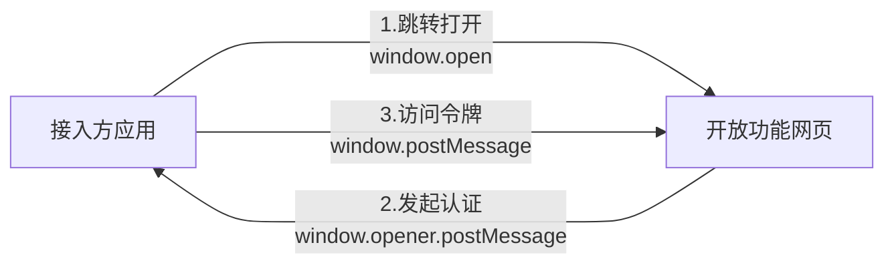
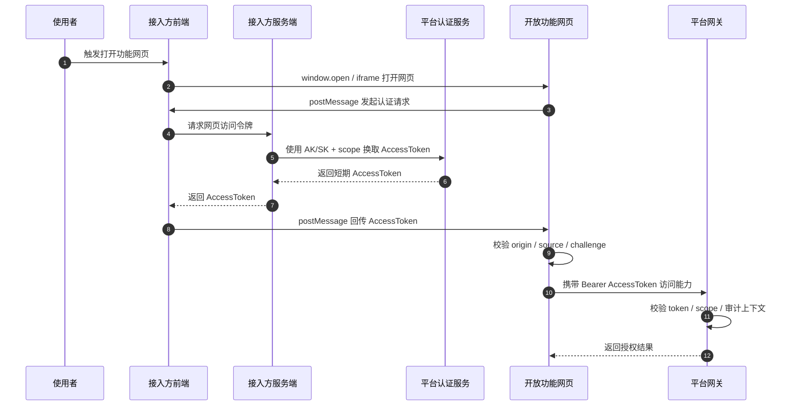
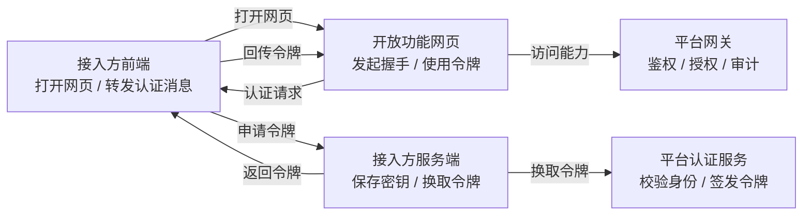
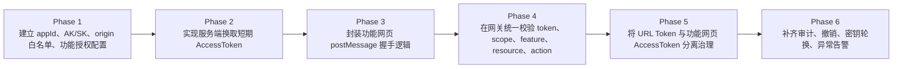

# 开放功能网页接入认证模式

> **阅读对象**:平台架构师、开放平台负责人、前端架构师、认证与网关负责人
> **前置阅读**:[架构设计哲学](../0x01_哲学理念/架构设计哲学.md) · [架构设计入门指南](../0xA0_实践方法/架构设计入门指南.md) · [企业 SSO 接入设计模式](./企业SSO接入设计模式.md)

## 模式定位

**问题域**:平台把功能以网页形式开放出去后,不能只解决“怎么打开”,还要解决“打开之后凭什么访问”。这里有几个边界必须先说清楚:

- 网页能被打开,不代表已经被授权
- 接入方可以持有 AK/SK,但 AK/SK 不能进入浏览器
- 开放功能网页需要访问平台能力,但不能默认信任打开它的页面
- 平台可以开放能力,但最终权限不能交给前端自觉

**本模式给出的答案**:用 **服务端换令牌 + 功能网页 `postMessage` 握手 + 平台网关统一鉴权** 来完成开放功能网页接入认证。

一句话定义:

> 外部系统负责打开网页并通过服务端换取短期令牌,开放功能网页通过 `postMessage` 拿到令牌,再由平台网关统一判断它能不能访问对应能力。

这个模式解决的是“开放功能网页如何安全拿到短期访问授权”,不是解决完整登录体系。它的关键价值是:

- **密钥不进浏览器**:AK/SK 只在接入方服务端使用
- **授权跨窗口传递**:网页之间只通过 `postMessage` 传递短期令牌
- **权限网关兜底**:能不能访问,最终由平台网关按 token 和 scope 判断

适用边界:

- 适用:接入方通过 `window.open` 打开开放功能网页
- 适用:接入方通过 `iframe` 嵌入开放功能网页
- 适用:开放功能网页需要访问平台接口
- 有条件适用:资源直达场景可以使用独立 URL Token
- 不适用:完整单点登录,应使用独立 SSO 或标准身份协议
- 不适用:跨组织身份联邦,应使用 OIDC / SAML
- 不适用:纯服务端接口调用,应使用 AK/SK 签名或 Client Credentials

## 设计目标与约束

| 目标 | 约束 |
| --- | --- |
| 接入简单 | 接入方只负责打开网页、响应认证请求、提供短期令牌 |
| 密钥安全 | AK/SK 只能在接入方服务端使用,不能进入浏览器 |
| 来源可信 | 功能网页和接入方前端必须做 origin 校验 |
| 权限最小 | AccessToken 按 app、tenant、feature、resource、action 收敛 |
| 链路可审计 | 打开、握手、换令牌、访问接口都要能追踪 |
| 令牌分层 | 功能网页 AccessToken 与 URL Token 分开治理 |

这几个约束里最重要的是密钥边界。只要 AK/SK 进了浏览器,后面所有鉴权设计都只是补救。

## 协议时序



上图是最小闭环。真实落地时,接入方应用内部还要拆成前端和服务端,平台侧也要拆成认证服务和网关。



## 核心模型



关键角色说明:

| 角色 | 做什么 | 不做什么 |
| --- | --- | --- |
| 接入方前端 | 打开网页、接收认证请求、回传令牌 | 不保存 AK/SK,不自造权限 |
| 接入方服务端 | 保存 AK/SK,向平台认证服务换令牌 | 不把密钥下发到浏览器 |
| 平台认证服务 | 校验接入方身份,签发短期 AccessToken | 不信任前端声明的任意 scope |
| 开放功能网页 | 发起握手,接收令牌,访问平台能力 | 不直接接触 AK/SK |
| 平台网关 | 校验 token、scope、上下文、审计 | 不放行无授权请求 |

这里的信任不是靠“谁说自己可信”,而是靠三层约束叠起来:

| 信任问题 | 解决方式 |
| --- | --- |
| 怎么确认接入方可信 | 接入方服务端持有 AK/SK,由平台认证服务校验 |
| 怎么确认网页消息可信 | `postMessage` 必须校验 origin、source、type、challenge |
| 怎么确认访问动作可信 | 平台网关按 token、scope、资源上下文做最终判断 |

这也是本模式的闭环:密钥证明接入方,握手证明消息来源,网关证明访问权限。任何一层缺失,都不能算完整接入。

## 协议设计

### 打开网页

接入方前端负责打开开放功能网页。打开只是进入页面,不是完成认证。

建议打开参数:

| 参数 | 必填 | 说明 |
| --- | --- | --- |
| `appId` | 是 | 接入方应用标识 |
| `featureCode` | 是 | 开放功能网页标识 |
| `tenantId` | 按需 | 授权上下文标识 |
| `resourceId` | 按需 | 资源标识 |
| `state` | 建议 | 一次性状态值,用于链路关联 |

注意事项:

- 打开 URL 只放非敏感上下文
- 不要在打开 URL 中携带 AK、SK、RefreshToken
- 不要把功能网页 AccessToken 默认塞进 URL
- 如果需要资源直达令牌,必须和功能网页 AccessToken 分开设计

### 发起认证

开放功能网页加载后,主动向 opener 或 parent 发起认证请求。

```json
{
  "type": "OPEN_FEATURE_AUTH_REQUEST",
  "appId": "app_xxx",
  "featureCode": "feature_xxx",
  "tenantId": "tenant_xxx",
  "resourceId": "resource_xxx",
  "challenge": "random_nonce",
  "issuedAt": 1780000000000
}
```

注意事项:

- 每次认证请求都要生成新的 `challenge`
- `challenge` 只绑定当前页面实例,不能复用
- 认证请求需要带上功能和上下文,方便接入方服务端申请最小 scope
- 功能网页不能假设 opener 或 parent 天然可信

### 服务端换令牌

接入方前端收到认证请求后,调用接入方服务端申请访问令牌。接入方服务端再使用 AK/SK 向平台认证服务换取短期 AccessToken。

```plain
POST /auth/token
Content-Type: application/json

{
  "id": "{AccessID}",
  "secret": "{AccessSecret}",
  "scope": [
    "tenant:tenant_xxx",
    "feature:feature_xxx",
    "resource:resource_xxx",
    "action:read"
  ]
}
```

平台认证服务至少校验这些内容:

| 校验项 | 说明 |
| --- | --- |
| AccessID 是否存在 | 确认接入方身份 |
| AccessSecret 是否匹配 | 确认请求来自可信服务端 |
| 应用状态是否有效 | 禁用、冻结、过期应用不得换令牌 |
| scope 是否被允许 | 接入方只能申请已授权范围 |
| 上下文和资源是否匹配 | 防止跨边界访问 |

注意事项:

- AK/SK 只能存在于接入方服务端
- AccessToken 应使用短有效期
- scope 要按当前网页实际需要申请,不要一次性申请全部能力
- 平台认证服务不能只校验密钥,还要校验授权范围

### 返回令牌

接入方前端拿到 AccessToken 后,通过 `postMessage` 回传给开放功能网页。

```json
{
  "type": "OPEN_FEATURE_AUTH_RESPONSE",
  "tokenType": "Bearer",
  "accessToken": "eyJ...",
  "expireIn": 7200,
  "scope": [
    "tenant:tenant_xxx",
    "feature:feature_xxx",
    "resource:resource_xxx",
    "action:read"
  ],
  "challenge": "random_nonce"
}
```

注意事项:

- 回传时必须带回原始 `challenge`
- 发送消息必须指定精确 `targetOrigin`
- 禁止使用 `postMessage(message, "*")` 发送令牌
- 不要回传 AK/SK、RefreshToken 或长期凭证

### 访问平台能力

开放功能网页拿到 AccessToken 后,通过平台网关访问平台能力。

```plain
GET /open-api/resource
Authorization: Bearer {AccessToken}
```

网关需要从 token 中还原上下文:

| 上下文 | 用途 |
| --- | --- |
| `appId` | 标识接入方 |
| `tenantId` | 数据与权限边界 |
| `featureCode` | 当前功能网页范围 |
| `resourceId` | 资源级访问边界 |
| `actions` | 允许动作集合 |
| `expireAt` | 过期判断 |
| `traceId` | 链路审计 |

注意事项:

- 功能网页只负责携带 token,最终授权以平台网关为准
- 平台接口不能绕过统一鉴权
- token 过期后重新走换令牌流程
- 认证失败要给出明确失败态,不能静默降级

### 异常闭环

开放功能网页接入最容易漏掉的不是成功链路,而是失败链路。失败链路如果不收口,就会出现页面空白、重复认证、错误降级、越权重试等问题。

| 异常场景 | 处理原则 |
| --- | --- |
| opener / parent 不存在 | 展示不可接入状态,不继续请求平台能力 |
| origin 不在白名单 | 拒绝接收消息,记录安全事件 |
| challenge 不匹配 | 视为重放或伪造,丢弃令牌 |
| 换令牌失败 | 返回明确错误,不在前端兜底生成令牌 |
| token 过期 | 重新发起认证请求,不要静默复用旧 token |
| scope 不足 | 网关返回无权限,功能网页按无权限态展示 |
| 网关鉴权失败 | 终止能力访问,记录 traceId 方便排查 |

失败时只允许两种结果:重新走认证链路,或者明确拒绝访问。不要让页面进入“看起来能用,实际权限不清楚”的中间状态。

## 交互设计

### postMessage 发送规则

```plain
targetWindow.postMessage(message, targetOrigin)
```

禁止:

```plain
targetWindow.postMessage(message, "*")
```

### postMessage 接收规则

| 校验项 | 说明 |
| --- | --- |
| `event.origin` | 必须在登记的 origin 白名单中 |
| `event.source` | 必须为当前 opener 或 parent |
| `message.type` | 必须为约定的认证响应类型 |
| `challenge` | 必须与功能网页本次请求一致 |
| `accessToken` | 必须存在、格式正确、未过期 |
| `scope` | 必须覆盖当前功能网页所需范围 |

### Token 类型区分

| 类型 | 用途 | 传递方式 | 权限范围 |
| --- | --- | --- | --- |
| 功能网页 AccessToken | 功能网页访问平台能力 | postMessage 握手 | feature / resource / action |
| URL Token | 资源直达访问 | URL query 或签名 URL | 单资源 / 短期 / 只读优先 |

URL Token 不是本模式的核心认证通道,只能作为资源直达场景的兼容机制。两类令牌必须分离治理,不要把资源直达令牌扩大成平台能力访问令牌。

## 配置清单

| 配置 | 说明 |
| --- | --- |
| `appId` | 接入方唯一标识 |
| `accessId` | 换令牌身份 |
| `accessSecret` | 换令牌密钥,只展示一次,支持轮换 |
| `allowedOrigins` | 允许参与 postMessage 的来源 |
| `enabledFeatures` | 允许打开的功能网页 |
| `allowedScopes` | 允许申请的权限范围 |
| `tokenPolicy` | AccessToken 的 TTL、刷新、撤销策略 |
| `resourceTokenPolicy` | URL Token 的资源范围、TTL、只读策略 |
| `auditPolicy` | 打开、握手、换令牌、访问接口的审计要求 |

## 安全加固清单

| 风险 | 典型成因 | 防御措施 |
| --- | --- | --- |
| 密钥泄露 | AK/SK 进入浏览器 | 密钥只在服务端保存和使用 |
| 消息劫持 | `targetOrigin` 使用 `*` | 发送与接收均校验精确 origin |
| 消息伪造 | 功能网页不校验来源 | 校验 `event.origin` 和 `event.source` |
| 消息重放 | 旧认证响应被重复使用 | challenge 一次性绑定页面实例 |
| 权限放大 | scope 粒度过粗 | token 绑定 tenant / feature / resource / action |
| 令牌泄露 | token 出现在 URL 或日志 | 核心 AccessToken 不走 URL,日志脱敏 |
| 长期滥用 | token 有效期过长 | 短 TTL + 可撤销 + 可审计 |
| 前端窃取 | 页面存在 XSS | CSP、输出编码、依赖治理、内存存储 |

## 反模式警告

| 反模式 | 后果 |
| --- | --- |
| 前端直接保存 AK/SK | 密钥泄露后平台能力被冒用 |
| `postMessage(..., "*")` | 令牌可能被错误页面接收 |
| 功能网页不校验 origin | 任意页面可伪造认证响应 |
| 一个 token 覆盖全部功能 | 令牌泄露后形成大范围越权 |
| 功能网页 AccessToken 放入 URL | 容易进入历史记录、日志、Referer |
| URL Token 与功能网页 AccessToken 混用 | 资源直达权限被扩大成平台能力权限 |
| token 长期持久化在浏览器 | XSS 或浏览器扩展可长期窃取 |

## 落地路径建议



## 验收标准

这个模式不能只看“页面能不能打开”,要按安全闭环验收。

| 验收项 | 通过标准 |
| --- | --- |
| 密钥边界 | 浏览器端找不到 AK/SK、RefreshToken、长期凭证 |
| 来源校验 | 非白名单 origin 无法完成认证响应 |
| 重放防护 | 旧 challenge 或错误 challenge 无法复用令牌 |
| 权限收敛 | 超出 feature、resource、action 的访问被网关拒绝 |
| 令牌分层 | URL Token 不能访问功能网页接口 |
| 过期处理 | AccessToken 过期后必须重新认证或明确拒绝 |
| 审计追踪 | 打开、换令牌、访问接口都能通过 traceId 串起来 |
| 失败状态 | 认证失败、无权限、网关拒绝都有明确页面状态 |

只要有一项做不到,就说明这个接入只是“能跑”,还没有达到“可信接入”。

## 一句话总结

> **开放功能网页接入认证模式的本质,是用服务端换令牌守住密钥边界,用 postMessage 握手解决跨域页面授权,用平台网关收敛最终权限。**
