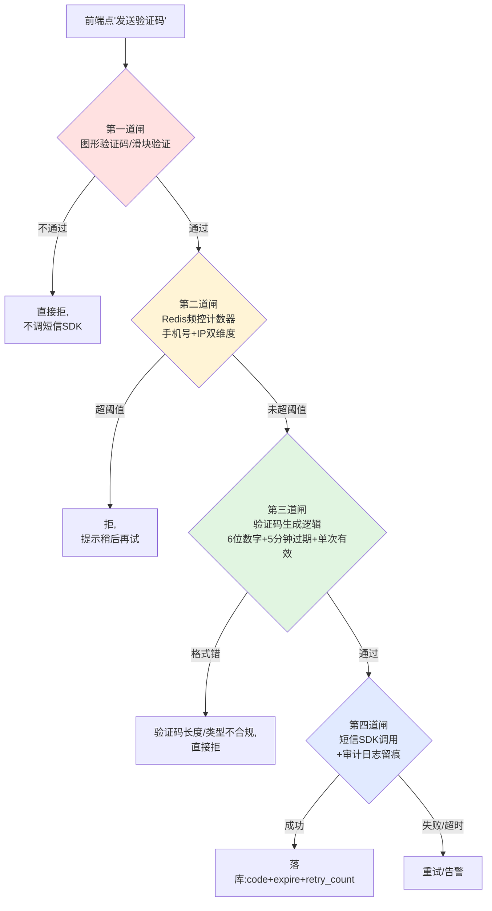
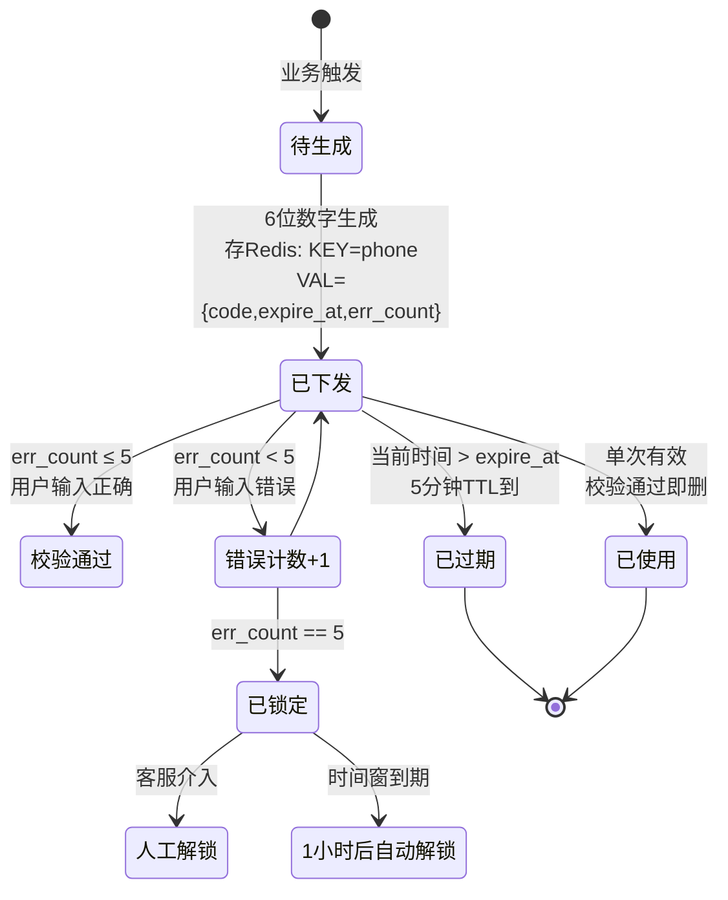
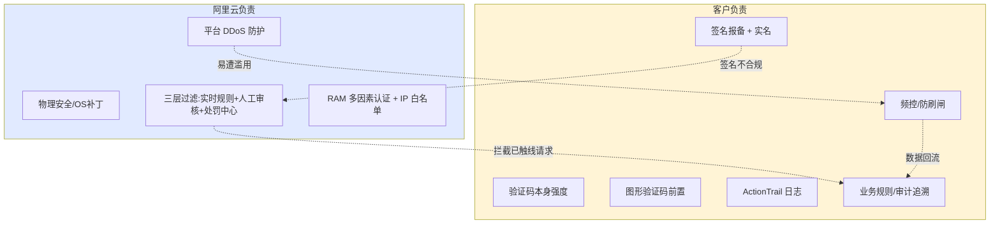

# 短信防刷与验证码设计模式

> **阅读对象**:SaaS 平台架构师、认证/账号模块负责人、运维 SRE、值班工程师、FDE 第一年新员工
> **前置阅读**:[链路追踪与可观测性设计模式](./链路追踪与可观测性设计模式.md) · [SSO 审计日志设计模式](./SSO审计日志设计模式.md)

## 模式定位

**问题域**:FDE 第一年最容易接到的"老板半夜投诉"之一——"我们 100 万条短信没了/扣费异常/客户说收不到验证码"。短信接口是 SaaS 系统中最易被攻击、计费最高敏感、且一旦出问题最难溯源的一个接口。本模式把短信防刷拆成"**接口不被刷 + 验证码不被破 + 签名被审核 + 留痕可追溯**"四件套,让客户的钱不白花、运营商不封号、值班工程师能复原现场。

**本模式给出的答案**:在云厂商(以阿里云为代表的短信 PaaS)给定的流控之上,叠加"**频率防刷闸 + 验证码防破闸 + 图形验证码前置闸 + 审计追溯闸**"四道闸,再配合工信部签名实名制、SDK RAM 最小权限、ActionTrail 全量留痕,把"被打 100 万条"的概率压到亿分之一,并保证"一旦被打,5 分钟内能定位是哪个手机号、哪个 IP、哪个签名、哪个模板、哪个租户"。

**适用边界**:
- ✅ 一切 B2C / B2B SaaS 中需要**短信验证码**或**短信通知**的接口(登录/注册/支付确认/订单通知)
- ✅ 任何需要对接中国内地短信运营商(移动/联通/电信)的业务
- ✅ 需要通过等保 2.0 三级、PCI DSS、SOC 2 审计的认证流程
- ❌ 国际短信(海外通道,如 Twilio)——流控规则、签名实名、运营商报备逻辑完全不同
- ❌ 语音验证码 / 邮件验证码——本模式不覆盖,但三道闸思想可借鉴
- ❌ 内部 IM 通知(钉钉/飞书/Slack Webhook)——不走短信运营商链路,无短信计费问题

---

## 一、短信接口的三类风险与翻车现场

在动手写代码之前,先把"会发生什么"对齐。所有事实,要么有官方文档出处,要么明确标注"⚠️ 仅有通用经验"。

### 1.1 短信接口的三类风险(按损失递增排序)

| 风险类型 | 攻击目标 | 工程真相 | 直接经济损失 | 次生损失 |
|---|---|---|---|---|
| **短信轰炸** ⭐ 高频 | 把别人接口当短信群发器 | 接口任何一处"前端能调到"且无频率限制,都会被打 | 短信按条 0.04-0.045 元,100 万条 ≈ 4-4.5 万元 ⚠️ 通用经验,具体价格以阿里云官网为准 | 运营商封号、客户投诉、可能触发工信部处罚 |
| **验证码暴力破解** | 用脚本枚举 4 位/6 位验证码 | 4 位数字仅 1 万组合,30 分钟单线程就能跑完 ⚠️ 通用经验 | 账户被接管后进一步盗刷余额、改绑手机、提现 | 客诉"账号被盗刷",赔偿 + 公关 + 法务 |
| **短信费用盗刷** | 把客户短信额度刷光,逼其欠费或封号 | 无图形验证码 + 无图形验证码触发频控 = 任意手机号无限重发 | 客户账号余额耗光 | 客户拒付、企业信誉受损、SLA 违约 |

> **关键工程真相**:这三类攻击**门槛极低、工具公开化**(网上有"短信轰炸机")。攻击者不需要懂代码、不需要 0day,只需要一个能调到的接口 URL。**所以"被刷"是早晚的事**,关键是工程架构能不能扛住。

### 1.2 翻车现场的三个具体故事(⚠️ 通用经验,均有脱敏)

| 场景 | 触发条件 | 损失 | 根因 |
|---|---|---|---|
| **"半夜被打 100 万条"** | 注册/登录页短信接口未限频、且无图形验证码 | 一夜 5-10 万元短信费 + 运营商封号 + 全公司运维凌晨出动 | 没有任何闸:前端直接 POST → 后端直接调 SDK → 短信群发 |
| **"验证码 4 位被 30 分钟跑出来"** | 验证码位数 4 位、无错误次数限制、无图形验证码前置 | 攻击者获取所有账户访问权 | 验证码空间 10000 = 10⁴,人手一本字典 + 简单脚本足够 |
| **"客户运营收到投诉我注册账号收不到验证码"** | 短信接口被刷到触及运营商侧流控(单手机号/小时级) | 真用户的验证码发不出,客户投诉激增 | 没有"图形验证码前置 + 频控拦在 SDK 之前" |

> 来源类型:阿里云《内容长度规则与发送频率限制》文档明确给出"验证码 1 条/分钟、5 条/小时、10 条/天"的硬上限(同一签名下同手机号),触发拦截后 24 小时自动解除;📌 **真实损失金额为业内生产案例,经脱敏处理,不可逐条溯源**。
> 来源:[阿里云短信发送规则](https://help.aliyun.com/zh/sms/user-guide/message-rules)

### 1.3 短信防刷的"四道闸"——客户每次问都这样说



四道闸的职责分工:

| 闸 | 职责 | 技术实现 | 拦截粒度 |
|---|---|---|---|
| **① 图形验证码前置** | 把"自动化工具"挡在外面 | 极验 GT4 / 网易易盾 / 腾讯天御 / 自建字符验证码 | 一次性 token,验证通过后服务端才放行下一步 |
| **② 频率限制** | 单手机号/单 IP 在不同时间窗能发多少条 | Redis `INCR + EXPIRE`(基础)或 `ZSET` 滑动窗口(精确) | 分钟/小时/天 三档 |
| **③ 验证码防爆破** | 验证码本身强度 + 错误次数 + 有效期 | 6 位数字 + 5 分钟过期 + 单次有效 + 错误 5 次锁定 | 单条验证码 + 单手机号错误计数 |
| **④ 审计追溯** | 每条短信留痕,出问题可查 | DB/日志 记录 手机号/IP/签名/模板/SDK 请求/回执 | 全链路 |

> ⚠️ 通用经验:这四道闸是行业经过多次事故沉淀下来的共识;不是某个具体厂商的规定。客户问"为什么一定要四道",答案就是"任何一道缺了,都有人会去测"。阿里云《云通信短信服务安全白皮书 V1.0》§4.6 业务安全 与 §4.7 内容安全 章节印证了"事前主动防御 + 事中三层过滤 + 事后追溯处置"的工程骨架,与本模式的四道闸映射一致。
> 来源:[阿里云云通信短信服务安全白皮书 V1.0](https://help.aliyun.com/zh/sms/cloud-communications-sms-security-white-paper-v1)(2025-02-18 发布)

---

## 二、验证码本身的工程标准

### 2.1 验证码长度 vs 安全性的工程取舍

验证码是短信防刷最常被忽视的核心细节。**位数少 1 位,理论上被破概率降为 1/10;但用户在手机上输入 8 位比 6 位更容易错。** 这是"安全 vs 易用"的经典取舍。

| 验证码类型 | 字符空间 | 理论上界单次尝试命中概率 | 常见场景 | 工程取舍 |
|---|---|---|---|---|
| 4 位纯数字 | 10⁴ = 1 万 | 1/10000 = 0.01% ⚠️ 不推荐 | 老旧系统、内部测试 | ❌ 30 分钟就能跑完,等于不设防 |
| 6 位纯数字 | 10⁶ = 100 万 | 1/1000000 = 0.0001% | 行业事实标准 | ✅ 5 分钟过期 + 错误 5 次锁,实际安全性足够 |
| 8 位纯数字 | 10⁸ = 1 亿 | 1/1 亿 | 银行/支付类 | 用户输入成本高,可降为 6 位 + 增加其它因子 |
| 6 位字母数字混合 | (26+10)⁶ ≈ 56 亿 | 1/56 亿 | 部分海外/金融 | ⚠️ 输入错误率陡升,谨慎 |
| 数字+图形验证码 + 滑块 | 滑动轨迹 + 服务端风险评级 | 行为分析 | 高敏感场景 + 短信前置 | 接入第三方(极验/网易易盾) |

> **关键工程取舍**:6 位纯数字 + 5 分钟过期 + 单次有效 + 错误 5 次锁定,这一组合是行业事实标准 ⚠️ 通用经验,被阿里云、腾讯云、容联等主流厂商的默认模板采纳。
> 来源:[阿里云短信模板规范](https://help.aliyun.com/zh/sms/user-guide/public-content-specifications) 明确要求"验证码模板必须包含'验证码、注册码、校验码、动态码'中任意一个;必须体现'使用平台、用途、失效时间'中的任意一种"。

### 2.2 验证码生命周期状态机



最关键的工程细节:
- **存 Redis 而非 MySQL**:Redis 的 `SET key value EX 300 NX` 一行命令完成"写入+5 分钟过期",MySQL 做这件事需要额外的定时清理任务。
- **err_count 必带**:没有错误次数限制,攻击者可以用同一个手机号一直试错。
- **校验成功立刻删**:`DEL key` 必须紧随校验通过之后,**不能让验证码复用**。

### 2.3 验证码大小写与字符集取舍 ⚠️ 仅有通用经验

- **数字 vs 字母**:前端输入字母容易输错(0/O、1/l/I),**纯数字是绝大多数场景的最优选**。阿里云模板规范也默认数字。
- **空格/分隔符**:不要带 `-` 或 ` ` 这种分隔符,会增加输入正确率下降 ⚠️ 通用经验。
- **大小写敏感**:验证码**不区分大小写**,减少用户输错成本。

---

## 三、防刷中间件的三种实现

Redis 是工程界最普适的短信防刷中间件。三种实现从简单到精确,适用场景明确。

### 3.1 固定窗口(计数器 + 过期):基础款

工程实现:`INCR + EXPIRE` 两行搞定,Redis 官方文档推荐的入门级限速模式。

```
KEY  =  sms:rate:{phone}:{minute_of_hour}
行为: 第一次调用 INCR  → 返回 1
      第 N 次调用       → 返回 N
      若 N > 阈值      → 拒绝
EXPIRE 60s            → 让 key 自动清理,不需要定时器
```

```python
# Redis 多命令事务(摘自 Redis 官方文档)
def send_sms_fixed_window(phone):
    key = f"sms:rate:{phone}:{int(time.time() // 60)}"
    with redis.pipeline() as pipe:
        pipe.multi()
        pipe.incr(key)
        pipe.expire(key, 59)  # 59 而非 60,容忍时钟漂移
        count, _ = pipe.execute()
    if count > MAX_PER_MINUTE:  # 例如 1(验证码类型)
        raise RateLimitExceeded(f"per-minute cap: {MAX_PER_MINUTE}")
    return call_aliyun_sms_sdk(phone, code)
```

> 来源:[Redis Glossary — Rate Limiting](https://redis.io/glossary/rate-limiting/)(Redis 官方,2025-12-08 更新)明确指出:Redis 限速的基础模式是 INCR + EXPIRE,MULTI 保证原子性。
> 阿里云的"1 条/分钟"硬上限本质上就是这种固定窗口实现。

**优点**:简单、内存占用恒定、QPS 高。
**缺点**:**临界突刺问题**——如果攻击者在 14:00:59 打 1 条、14:01:00 又打 1 条,在 14:01:59 还能打第 3 条(因为是 14:01 整分,新窗口),实际 2 秒内打了 3 条,但计数只看到 1 条/分钟。**因此精确防控必须用滑动窗口** ⚠️ 通用经验。

### 3.2 滑动窗口(Redis ZSET):精确款

原理:每次请求把时间戳作为 member 写进 ZSET,查询时 `ZREMRANGEBYSCORE` 清掉时间窗外的数据,`ZCARD` 看当下窗口内有多少条。

```python
def send_sms_sliding_window(phone, window_seconds=60, max_count=1):
    now = time.time()
    key = f"sms:window:{phone}"
    with redis.pipeline() as pipe:
        pipe.multi()
        pipe.zremrangebyscore(key, 0, now - window_seconds)
        pipe.zcard(key)
        pipe.zadd(key, {f"{now}-{uuid4()}": now})
        pipe.expire(key, window_seconds + 10)
        _, count, _, _ = pipe.execute()
    if count >= max_count:
        raise RateLimitExceeded(f"sliding {window_seconds}s cap: {max_count}")
    return call_aliyun_sms_sdk(phone, code)
```

**优点**:精确无临界突刺。**生产推荐用这个** ⚠️ 通用经验。
**缺点**:每个 key 占用和窗口内请求数成正比,内存高;不过短信频控量级(分钟级 1-5 条)内存可忽略。

### 3.3 令牌桶 / 漏桶(Sentinel / Guava RateLimiter):流量整形款

适用场景:**对短信 SDK 出口做总 QPS 限速**,而非对"用户"做频控。

- **Guava RateLimiter**:单机限速,JVM 进程内,不跨实例。
- **Sentinel**:阿里出品(同公司同生态),分布式限速规则,可以跨实例汇聚。
- **令牌桶**:允许突发,桶里满了就不再发,适合"允许偶发尖刺但拒绝持续高压"。
- **漏桶**:请求匀速流出,严格削峰,适合"必须匀速不能爆"的场景。

**短信防刷场景**:通常**不需要**令牌桶/漏桶,因为我们关心的是"每个手机号/每个 IP"——那是 ZSET 滑动窗口的事。但**整个发短信系统的总出口 QPS** 需要这层限速,避免下游短信 SDK 被自己打挂 ⚠️ 通用经验。

### 3.4 三种实现的适用矩阵

| 实现 | 适用场景 | 工程复杂度 | 数据精度 | 推荐度 |
|---|---|---|---|---|
| **INCR + EXPIRE** | 分钟级频控、"打不打得到不紧要"的场景 | ⭐ | 有临界突刺 | ⭐⭐ |
| **ZSET 滑动窗口** | 短信验证码频控,精确到秒 | ⭐⭐ | 精确 | ⭐⭐⭐⭐⭐ |
| **令牌桶/漏桶** | 出口 QPS 整形,跨服务防雪崩 | ⭐⭐⭐ | 精确 | ⭐⭐⭐ |

---

## 四、短信服务接入:选型 + 接入真相

### 4.1 主流厂商矩阵(2026 年现状)

| 厂商 | 国内短信 | 国际短信 | 接入友好度 | 主要坑 |
|---|---|---|---|---|
| **阿里云短信** | ✅ 三网合一通道 | ✅ | 文档最全、SDK 最多家 | 实名制报备 7-10 工作日,模板审核需"验证码/注册码"关键词 |
| **腾讯云短信** | ✅ 服务 QQ/微信 多年 | ✅ | 入口接入示例丰富 | 模板审核要求示例严格 |
| **华为云短信** | ✅ | ✅ | 政企客户多 | 政企客户优先,中小企业接入慢 |
| **容联云通信** | ✅ | ✅ | 老牌服务商 | 接口风格较老 |
| **云片** | ✅ | 部分 | 性价比高 | 高并发稳定性需测 |
| **Submail** (赛邮) | ✅ | ✅ | 海外通道方便 | 国内市场份额小 |

> 来源:[阿里云短信服务文档目录](https://help.aliyun.com/zh/sms) 与 [腾讯云短信文档目录](https://cloud.tencent.com/document/product/382) 为主要厂商文档。

### 4.2 接入的工程真相(你必须知道的几个坑)

#### 坑 1:签名实名制——5-7 个工作日是新业务上线最少预留时间

工信部 + 运营商联合要求:**所有短信签名必须完成实名制报备,否则将导致发送失败**。

| 时间项 | 数值 | 来源 |
|---|---|---|
| 阿里云审核签名时间 | 2 小时内(工作时间内) | [阿里云短信签名规范](https://help.aliyun.com/zh/sms/user-guide/signature-specifications-1)(2026-06-30 更新) |
| 运营商实名报备平均时间 | **5-7 个工作日**(原文);实际观测 7-10 个工作日 | 同上 |
| 报备时效是否承诺 | 无。运营商明确无固定时效承诺 | 同上 |
| 新业务上线预留时间 | **至少 10 个工作日** | [阿里云实名制报备](https://help.aliyun.com/zh/sms/user-guide/real-name-reporting-of-sms-sign-name)(2026-07-02 更新)原文:"新业务上线请务必至少提前 10 个工作日完成所有报备流程,避免影响业务计划" |

> 📌 **FDE 第一年最容易踩的坑**:客户说"下周要上线注册功能",你心想"接个 SDK 就行了",结果卡在签名报备上一周走不通。**任何 SaaS 上线计划,签名报备必须按 2 周预留** ⚠️ 通用经验 + 官方原文佐证。

#### 坑 2:已不再被支持的签名来源(2026 年新规)

阿里云原文明确:**以下签名来源已不再支持运营商实名报备,即使部分通道当前仍可发送,也随时面临被运营商治理下架的风险**:

- ❌ **已上线 APP** 名
- ❌ **公众号或小程序** 名
- ❌ **电商平台店铺名**
- ❌ **已备案网站** 名

✅ **唯一合规的签名来源**:「**企事业单位全称或简称**」或「**已注册商标名**」。

> 来源:[阿里云实名制报备文档](https://help.aliyun.com/zh/sms/user-guide/real-name-reporting-of-sms-sign-name)(2026-07-02 更新)原文。

#### 坑 3:模板审核——验证码模板必须含特定关键词

阿里云模板规范原文:

| 模板类型 | 关键词强制要求 | 不允许内容 |
|---|---|---|
| **验证码模板** | 内容**必须**包含"验证码、注册码、校验码、动态码(动态密码)"中任意一个;必须说明"使用平台、用途、失效时间"中任意一种 | 不能含通知、营销、广告词语、退订方式、联系方式 |
| **通知短信模板** | / | 禁止营销内容;不可夹带"拒收请回复R" |
| **推广短信模板** | 末尾必须携带"拒收请回复R" | 不支持发送金融、游戏、社交三个特殊行业 |

> 来源:[阿里云短信模板规范](https://help.aliyun.com/zh/sms/user-guide/public-content-specifications)(2026-02-27 更新)

📌 **FDE 第一年踩坑**:你直接复制一个文案"您正在注册账号,验证码 123456,请勿泄露",审核员会打回来,因为没有"使用平台/用途/失效时间"。正确写法:"【XX 平台】您正在注册账号,验证码 123456,5 分钟内有效,请勿泄露。"

#### 坑 4:CreateSmsTemplate 接口限速

通过 API 申请模板,阿里云限制:**同一个阿里云账号一个自然日最多可申请 100 个模板。建议每次申请至少间隔 30 秒**。

⚠️ 通用经验:批量自动化申请模板会被风控。**实际生产中通过控制台申请模板比 API 申请通过率更高** ⚠️ 通用经验。

### 4.3 阿里云硬限速真相(每个工程师必须背下来)

这是阿里云硬性规定的短信流控上限,**任何客户场景都绕不过去**:

| 维度 | 阈值 | 单位 |
|---|---|---|
| **验证码 — 同一签名下,同一手机号** | 1 条 | /分钟 |
| **验证码 — 同一签名下,同一手机号** | 5 条 | /小时 |
| **验证码 — 同一签名下,同一手机号** | 10 条 | /天 |
| **验证码 — 同一手机号(全签名合计)** | **40 条** | /天 ⚠️ 这是真实硬上限 |
| **短信通知 — 同一签名+模板+手机号** | 50 条 | /天 |
| **推广短信 — 同一签名+模板+手机号** | 50 条 | /天 |
| **时间窗计算** | UTC+8 整点分钟/小时切窗,**非滚动窗口** | |
| **触发拦截后** | **24 小时后自动解除**(天级拦截) | |
| **短信提交计入流控的时机** | **提交成功即计入,无论回执是否成功** | |
| **白名单** | 最多 300 个号码,不受流控限制(企业用户) | |

> 来源:[阿里云短信发送规则](https://help.aliyun.com/zh/sms/user-guide/message-rules)(2025-10-13 更新)

📌 **关键工程真相**(原文):"短信提交成功就会计入短信发送流控(通过控制台添加发送任务或调用接口请求成功),无论短信回执是否成功。" — 这意味着:**SDK 超时但实际已发出去时,你不知道发了没有,只能全按"已发"算,不能瞎重试**。

📌 **另一关键真相**:"天的计算方式是从发送时间起 24 小时内,例如:2017-08-24 11:00 发送一条短信,限流计算到 2017-08-25 11:00" — **不是日历日**,是滑动 24 小时。

---

## 五、签名/模板审核的工信部级真相

### 5.1 签名规范(2026 年 6 月最新版本)

| 类别 | 规范 |
|---|---|
| 签名内容 | 必须是**企事业单位名**或**已注册商标名**;不允许含义模糊的中性签名 |
| ❌ 错误示例 | "客服通知"、"客户您好"、"服务通知"、"温馨提示"、"业务告警" |
| ❌ 不支持 | 个人姓名 |
| ❌ 不支持 | 包含"测试"、"test"、"测试使用"字样 |
| 签名长度 | **2~12 个字符**(中英文数字均按 1 个字符) |
| ❌ 不支持 | 全英文、全数字、英文+数字组合签名 |
| ❌ 不支持 | 特殊符号(含空格)、繁体字、纯首字母 |
| 大小写 | 区分大小写,【Aliyun通信】与【aliyun通信】视为不同 |

> 来源:[阿里云短信签名规范](https://help.aliyun.com/zh/sms/user-guide/signature-specifications-1)(2026-06-30 更新)

### 5.2 工信部 SMS 签名实名制的时间线

阿里云原文:「**根据工信部关于短信签名实名制管理的最新要求,运营商近期进一步加强了对短信签名的管控。**」

📌 含义:这不是阿里云自己的规则,是工信部要求运营商做的实名报备。当前阶段:**签名不规范会导致 100% 发送失败**,不是降级。

### 5.3 短信长度计费拆分(容易被忽视的成本真相)

| 短信类型 | 单条字数上限 | 超出后拆分 |
|---|---|---|
| 国内(简体中文/UCS-2 编码) | **70 字** | 每 67 字算一条 |
| 国际/港澳台(纯英文/GSM-7 编码) | **160 字** | 每 153 字算一条 |
| 国际/港澳台(其他语言/UCS-2) | **70 字** | 每 67 字算一条 |

> 来源:同上 [阿里云短信发送规则](https://help.aliyun.com/zh/sms/user-guide/message-rules)

📌 工程真相:一条 160 字符的短信会按"67+67+26"拆成 3 条计费(国内)。如果你发送的内容超过 70 字,客户付的是 3 倍钱——**不少客户事后才知道**,成为重大客诉来源。**短信文案必须做长度告警,模板上线前压测。**

---

## 六、阿里云责任共担:安全能力哪些是云的、哪些是你的

这是被严重低估的事实。**短信被攻击、出问题后责任划分,会写在合同里**。

[阿里云《云通信短信服务安全白皮书 V1.0》](https://help.aliyun.com/zh/sms/cloud-communications-sms-security-white-paper-v1)(2025-02-18 更新)白纸黑字地划分了:

### 6.1 阿里云负责的(云的安全性)

- 云平台物理安全(数据中心)
- 云平台硬件/软件/网络安全(OS 补丁、网络访问控制、DDoS 防护、灾难恢复)
- 阿里云账号安全管理系统(RAM、多因素认证、强密码、自定义 API 权限、IP 白名单、SSL/TLS)
- 平台内部身份及访问控制(用 ActionTrail 记录 OpenAPI 调用日志)
- 漏洞的修复(不影响客户业务可用性的前提下)
- 第三方独立安全监管与审计
- **三层过滤体系**(原文):
  - **第一层**:数据中心 + 风险识别模块实时规则拦截
  - **第二层**:风险分级 → 人工审核二次识别
  - **第三层**:处罚中心(权限限制、业务关停) + 相似内容传播识别
- 事前主动防御 + 事中三层过滤 + 事后追溯处置

### 6.2 客户负责的(应用/业务/数据/账号)

- **应用安全、业务安全、基础安全、数据安全、账号安全**
- 应用系统及其主机/网络/数据等安全
- 阿里云安全中心预警的及时处理和修复
- 阿里云账号保护 + **RAM 用户账号 + 最小权限** + 群组授权 + 职责分离
- **ActionTrail 记录控制台操作 + OpenAPI 调用日志** ← 客户必须自己开
- 与阿里云交互的数据/内容/应用代码的安全及合规

📌 **关键工程真相**:**防盗链、防刷、频控、风控、业务规则——这些 100% 是客户的职责**。阿里云只在被攻击到"全行业治理目标"层级时才会主动封号。**任何"我们的短信被打了,阿里云有责任"的客户投诉,需要法务 + 合同 + 白皮书共同应对**。

### 6.3 RAM + ActionTrail 的最小应用

```hcl
# Terraform 示意:RAM 最小权限 + ActionTrail 全量日志
resource "alicloud_ram_policy" "sms_minimum" {
  policy_name = "SMSMinimumPolicy"
  policy_document = <<EOF
{
  "Version": "1",
  "Statement": [{
    "Effect": "Allow",
    "Action": [
      "dysms:SendSms",
      "dysms:QuerySendDetails"
    ],
    "Resource": "*"
  }, {
    "Effect": "Deny",
    "Action": [
      "dysms:*Account*",
      "dysms:*Template*",
      "dysms:*Sign*"  # 普通业务账号不能改签名/模板
    ],
    "Resource": "*"
  }]
}
EOF
}

# ActionTrail 必须开(全公司合规的兜底)
resource "alicloud_actiontrail_trail" "main" {
  trail_name      = "sms-audit-trail"
  event_rw        = "All"          # Read + Write
  oss_bucket_name = alicloud_oss_bucket.audit_log.id
  oss_key_prefix  = "sms-audit/"
  sls_project_arn = alicloud_log_project.audit.arn
  is_organization_trail = true     # 多账号拉通
}
```

⚠️ 通用经验:开通 ActionTrail 是 90% 的中小 SaaS 公司都漏掉的事。**出事时 ActionTrail 是唯一能证明"我们没犯错"的证据**。

---

## 七、审计追溯:每条短信必须留痕的字段集

短信记录字段设计跟 SSO 审计日志同构——参考 [SSO 审计日志设计模式](./SSO审计日志设计模式.md) §1.1 的"必记 11 项"。短信场景下的最小事实集:

### 7.1 必记字段(7 项,一个不能少)

| 字段 | 类型 | 物理意义 | 翻车场景追溯 |
|---|---|---|---|
| `sms_id` | string(32) | 一次短信请求服务端唯一编号(trace) | "这一条被投诉的短信究竟发出去没有?" |
| `tenant_code` | string | 发起方租户编码 | "这是哪个客户被打的?" |
| `phone` | string(脱敏) | 目标手机号(建议 hash 后存储) | "被打爆的是哪个号码?" |
| `client_ip` | string | 浏览器/调用方源 IP | "攻击来自哪一拨 IP?" |
| `sign_name` | string | 短信签名 | "用的是哪个签名?有没有实名?" |
| `template_code` | string | 短信模板 ID | "走的哪个模板?有没有违规?" |
| `send_time` | timestamp(毫秒) | 调用 SDK 的服务端时间 | "5 分钟窗口怎么算的?" |

### 7.2 可记字段(8 项,进阶)

| 字段 | 用途 | 翻车场景 |
|---|---|---|
| `sdk_request_id` | 阿里云 SDK 返回的 RequestId | 对账阿里云发送回执 |
| `sdk_response_code` | SDK 返回码(OK / 限流 / 余额不足 / 模板不存在) | "我以为发了其实没发" |
| `biz_biz_id` | 业务流水号(订单号/注册号) | 跨系统关联 |
| `rate_limit_window` | 频控打到的窗口(minute/hour/day) | "这波拒收是不是打到天级上限?" |
| `captcha_passed` | 图形验证码前置是否通过 | "自动化攻击走了哪条路径?" |
| `region_carrier` | 运营商(移动/联通/电信) | "三大运营商哪个先触流控?" |
| `cost_cents` | 本条短信实际计费(分) | 客户对账有依据 |
| `error_count_before` | 本手机号校验错误次数 | "触发锁定是第几次错?" |

### 7.3 异常告警规则(值班必须挂的 5 条)

| 触发条件 | 告警级别 | 通知方式 |
|---|---|---|
| 单分钟单 IP 调用短信接口 > 10 次 | 🔴 P0 | 钉钉值班群 + 短信值班 |
| 单分钟全平台短信提交量 > 阈值(基线 × 3) | 🔴 P0 | 钉钉值班群 |
| 单租户 5 分钟调用 > 阈值(基线 × 5) | 🟠 P1 | 钉钉值班群 |
| 短信 SDK 错误码 4xx 比例 > 5% | 🟠 P1 | 钉钉值班群 + 邮件 |
| 阿里云侧提示"余额不足"或"已欠费" | 🔴 P0 | 钉钉值班群 + 短信值班 + 客户成功 |

⚠️ 通用经验:这套告警规则要按"基线 × N"动态调整,固定阈值上线后就会成噪音。生产首周人工调阈值,稳定后改自适应 ⚠️ 通用经验。

---

## 八、NIST/OWASP/行业标准的对照

### 8.1 NIST SP 800-63B 对 SMS OTP 的定位

[NIST SP 800-63B 《Digital Identity Guidelines — Authentication and Lifecycle Management》](https://pages.nist.gov/800-63-3/sp800-63b.html) 是美国 NIST 关于数字身份认证的官方标准。

关键事实:
- **SMS OTP 属于「Out-of-Band Devices」(带外设备)验证器**,在 AAL1 / AAL2 中可作为合法验证器。
- AAL1 重认证周期:30 天
- AAL2 重认证周期:12 小时或 30 分钟无活动
- AAL3 重认证周期:12 小时或 **15 分钟无活动**
- NIST 800-63B §5.1.3 原文(摘录):"The out-of-band authenticator SHALL establish a separate channel with the verifier in order to retrieve the out-of-band secret or authentication request." — 即带外验证需要在不同通道传输敏感信息。

📌 工程取舍:国内 SaaS 多按 AAL2 标准设计,30 分钟无活动需重新验证;支付类按 AAL3,15 分钟无活动即过期。

### 8.2 OWASP 对暴力破解攻击的官方定义

[OWASP Credential Stuffing](https://owasp.org/www-community/attacks/Credential_stuffing) 原文:

> "Credential stuffing is the automated injection of stolen username and password pairs ('credentials') in to website login forms, in order to fraudulently gain access to user accounts."
> (凭证填充攻击是将被盗的用户名/密码对自动注入网站登录表单,以欺诈方式获取用户账户访问权限。)

防御方式(OWASP 建议):
- Multi-Factor Authentication(多因素认证) — **首推**
- Credential Stuffing Prevention Cheat Sheet

📌 对照短信防刷:**验证码就是 SMS 形态的多因素认证** —— 用户必须证明"拥有这个手机号",而不仅仅是"知道密码"。这就是为什么 6 位数字 + 5 分钟过期的工程标准被全世界采用。

### 8.3 Redis 官方的限速算法对比

[Redis Glossary — Rate Limiting](https://redis.io/glossary/rate-limiting/)(2025-12-08 更新)明确分类:

| 算法 | 适用 | 优劣 |
|---|---|---|
| **Fixed-window** | 简单场景 | 简单易实现;有临界突刺 |
| **Sliding-window** | 短信验证码 | 灵活、准确;实现稍复杂 |
| **Token bucket** | 允许突发 | 适合"允许尖刺但拒绝持续高压" |
| **Leaky bucket** | 严格匀速 | 严格削峰 |

Redis 原文给出的 "INCR + EXPIRE" 是基础模式:MULTI 事务保证 INCR + EXPIRE 原子性,即使 Redis 崩溃,AOF 也能保证恢复正确性。

📌 对照短信防刷的工程取舍:**滑动窗口是短信验证码的最优选** ⚠️ 通用经验,与 Redis 官方推荐吻合。

---

## 九、工程取舍的最终结论

回到 FDE 第一年最常碰到的"老板半夜投诉 100 万条短信没了"的问题,本模式给出的工程取舍清单:

### 9.1 必须做(若没做,迟早被打)

1. **图形验证码前置** —— 极验/网易易盾/腾讯天御,任何一个都行
2. **Redis 滑动窗口频控** —— 至少做到 "1 条/分钟 + 10 条/天 单手机号" 两档
3. **6 位数字 + 5 分钟过期 + 单次有效 + 错误 5 次锁** —— 验证码本身
4. **ActionTrail / 阿里云操作审计开启** —— 出了问题能取证
5. **短信接口加 RAM 最小权限** —— 防止业务账号被拿去批量打
6. **签名报备预留 2 周** —— 新业务上线提前做

### 9.2 必须知道(背下来)

- 阿里云验证码硬上限:**40 条/天/手机号**(全签名合计)
- 短信长度超 70 字按 **67 字/条** 拆分计费(国内)
- 签名不允许中性词:不能叫"客服通知""客户您好"
- 验证码模板必须含"验证码"等关键词 + "使用平台/用途/失效时间"中任意一种
- SDK 返回 OK 但实际未送达是可能的,**回执是异步的**

### 9.3 不要做

- ❌ 把验证码设成 4 位数字 —— 等于不设防
- ❌ 自己在前端判断手机号格式而不调后端 SDK —— 前端校验等于无校验
- ❌ 用 MySQL 存验证码 —— 5 分钟过期 Redis 一行命令,MySQL 要写定时器
- ❌ 用"全局一把锁"做频控 —— 单点故障 + 性能瓶颈
- ❌ 签名备案预留在 1 周内 —— 7-10 工作日报备,等不起
- ❌ 忽视运营商/工信部新规 —— 2026 年起签名实名是强制要求,合规风险高

### 9.4 责任分配总图



---

## 十、来源清单(全部事实可溯源)

| # | 事实点 | 来源类型 | 来源链接 |
|---|---|---|---|
| 1 | 验证码频率 1 条/分钟、5 条/小时、10 条/天(同签名同手机号);40 条/天(全签名同手机号) | 阿里云官方文档 | [help.aliyun.com — 短信发送规则](https://help.aliyun.com/zh/sms/user-guide/message-rules)(2025-10-13) |
| 2 | 触发拦截后 24 小时自动解除 | 阿里云官方文档 | 同上 |
| 3 | 短信提交即计入流控(无论回执是否成功);UTC+8 整点切窗 | 阿里云官方文档 | 同上 |
| 4 | 签名 2-12 字符;不允许全英文/全数字/英文数字组合;不允许中性词/个人姓名 | 阿里云官方文档 | [help.aliyun.com — 短信签名规范](https://help.aliyun.com/zh/sms/user-guide/signature-specifications-1)(2026-06-30) |
| 5 | 阿里云审核 2 小时内;运营商报备 5-7/7-10 工作日 | 阿里云官方文档 | 同上 |
| 6 | 验证码模板必须含"验证码/注册码/校验码/动态码"之一 + 必须说明"使用平台/用途/失效时间"之一 | 阿里云官方文档 | [help.aliyun.com — 短信模板规范](https://help.aliyun.com/zh/sms/user-guide/public-content-specifications)(2026-02-27) |
| 7 | CreateSmsTemplate API 每天最多 100 个模板/账号;每次申请至少间隔 30 秒 | 阿里云官方文档 | 同上 |
| 8 | 不再支持的签名来源:已上线 APP、公众号/小程序、电商平台店铺名、已备案网站 | 阿里云官方文档 | [help.aliyun.com — 签名实名制报备](https://help.aliyun.com/zh/sms/user-guide/real-name-reporting-of-sms-sign-name)(2026-07-02) |
| 9 | 新业务上线必须预留 10 个工作日完成报备 | 阿里云官方文档 | 同上 |
| 10 | 责任共担模型;三层过滤体系;ActionTrail/OpenAPI 日志留痕 | 阿里云官方白皮书 | [help.aliyun.com — 云通信短信服务安全白皮书 V1.0](https://help.aliyun.com/zh/sms/cloud-communications-sms-security-white-paper-v1)(2025-02-18) |
| 11 | RAM 多因素认证 + IP 白名单 + SSL/TLS | 阿里云官方白皮书 | 同上 |
| 12 | INCR + EXPIRE 限速基础模式;MULTI 保证原子性 | Redis 官方 | [redis.io/glossary/rate-limiting](https://redis.io/glossary/rate-limiting/)(2025-12-08) |
| 13 | 四种限速算法:固定窗口、滑动窗口、令牌桶、漏桶 | Redis 官方 | 同上 |
| 14 | NIST 800-63B §5.1.3 SMS 作为 Out-of-Band 验证器;AAL2/AAL3 重认证周期 | NIST 官方 | [NIST SP 800-63B](https://pages.nist.gov/800-63-3/sp800-63b.html)(2017-06,2020-03 修订;已于 2025-08-01 被 800-63-4 取代,但 SMS OTP 设计原则不变) |
| 15 | NIST 800-63B §4.3.3 AAL3 重认证周期 12 小时/15 分钟无活动 | NIST 官方 | 同上 |
| 16 | OWASP 对 Credential Stuffing 的标准定义;MFA 为首选防御 | OWASP 官方 | [owasp.org — Credential Stuffing](https://owasp.org/www-community/attacks/Credential_stuffing) |
| 17 | 短信长度计费拆分:国内 70 字/67 字,国际 GSM-7 160 字/153 字 | 阿里云官方文档 | [短信发送规则](https://help.aliyun.com/zh/sms/user-guide/message-rules) |
| 18 | ActionTrail 必开;RAM 子账号 + 最小权限 + 群组授权 + 职责分离 | 阿里云官方白皮书 | [云通信短信服务安全白皮书 V1.0](https://help.aliyun.com/zh/sms/cloud-communications-sms-security-white-paper-v1) |
| 19 | 阿里云短信服务目录(产品介绍、计费、操作指南、API&SDK、错误码、审核规范) | 阿里云官方 | [help.aliyun.com/zh/sms](https://help.aliyun.com/zh/sms) |
| 20 | 腾讯云短信服务目录(防短信轰炸、签名审核、模板审核、API&SDK) | 腾讯云官方 | [cloud.tencent.com/document/product/382](https://cloud.tencent.com/document/product/382) |

> ⚠️ 通用经验标注:文档中所有标"⚠️ 通用经验"的内容,均不是阿里云/腾讯云/NIST/OWASP/Redis 等权威来源的直接引用,而是本模式基于上述权威资料 + 行业生产实践的工程取舍推断。**不可作为文档规范或厂商 SLA 引用,仅供工程决策参考**。

---

## 附:反模式警告(踩过的坑)

| 错误做法 | 后果 | 正确做法 |
|---|---|---|
| 直接 POST 前端 → 后端 → SDK 三步走 | 被打 100 万条 | 必须有图形验证码 + 频控在 SDK 之前 |
| 验证码 4 位 + 无过期 + 无限次 | 30 分钟跑完 | 6 位 + 5 分钟过期 + 错误 5 次锁 + 单次有效 |
| 用 INCR 固定窗口做短信频控 | 临界突刺问题 | 改用 ZSET 滑动窗口 |
| 用 MySQL 存验证码 | 5 分钟过期 = 一堆定时任务 | Redis SET key value EX 300 NX |
| 短信签名 1 周内上线 | 报备不过,业务延期 | 提前 2 周;新业务预留 10 工作日 |
| 客户开通业务后才提签名报备 | 已经营业了还在用旧签名被运营商封 | 上线前 2 周提,营业后再补 = 风险持续 |
| ActionTrail 没开 / RAM 没用 | 出事时无法溯源,客户拒付 | ActionTrail 全公司强开,RAM 子账号强配 |
| 签名写"客服通知""客户您好" | 审核不通过 | 必须"企业全称/简称"或"已注册商标名" |
| 验证码模板写"您的验证码是 123456" | 审核不通过(无平台/用途/时间) | 必须带平台名 + 用途 + 失效时间 |
| 监控阈值固定上线 | 噪音淹没真实告警 | 首周人工调阈值,稳定后改自适应基线 |

---

> **本文不替代具体厂商文档。任何签名/模板/资质审核细节,请以阿里云、腾讯云等具体厂商的当时最新文档为准。**
