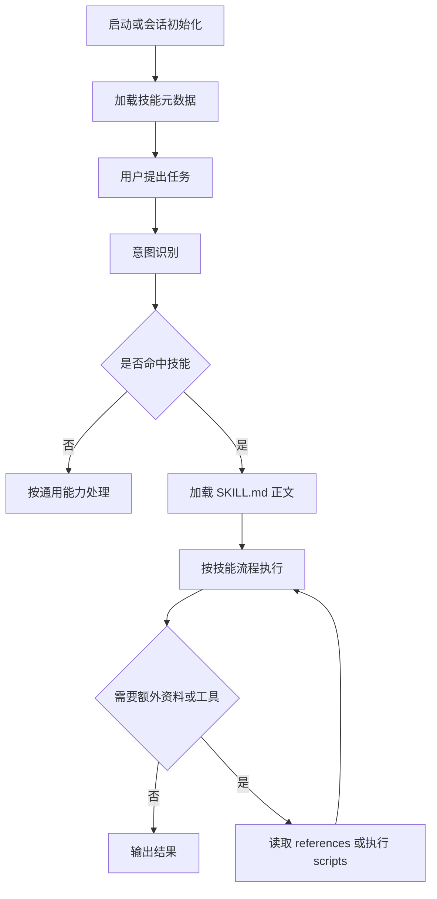
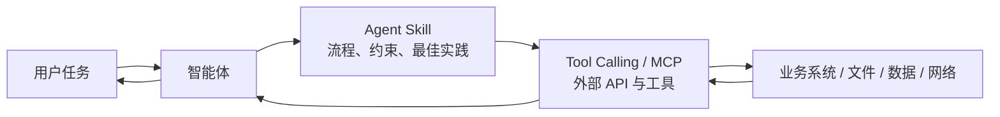
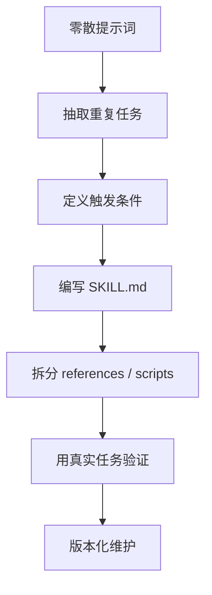

# Agent Skills 实践指南

> **阅读对象**:AI Agent 开发者、AI 工程化实践者、技术负责人
> **关联阅读**:[OpenCode 全体系深度解析](./OpenCode全体系深度解析.md)、[代码质量评估体系](../0xA0_实践方法/代码质量评估体系.md)

Agent Skills 是一种面向智能体的模块化能力封装方式:把特定任务的指令、流程、脚本、参考资料与示例沉淀为标准目录,由智能体按需发现、按需加载、按流程执行。

它的核心价值不是“让模型变聪明”,而是把复杂任务变成可复用、可审计、可渐进加载的工程资产。

## 1. Agent Skills 解决什么问题

大模型落地到复杂任务时,常见问题有三类:

| 痛点 | 表现 | Agent Skills 的作用 |
| --- | --- | --- |
| 上下文爆炸 | 所有规则都塞进系统提示词,Token 成本高、注意力分散 | 只加载技能元数据,命中后再加载完整技能 |
| 能力复用难 | 零散提示词难以跨项目、跨模型复用 | 用标准目录固化任务能力 |
| 执行不可靠 | 通用模型缺少领域流程与最佳实践 | 用技能流程约束模型行为 |

传统提示词更像“一次性说明”;Agent Skills 更像“可安装的能力模块”。

## 2. 标准目录结构

一个技能通常由 `SKILL.md` 和可选资源目录组成:

```text
skill-name/
├── SKILL.md
├── scripts/
├── references/
├── examples/
└── assets/
```

| 路径 | 是否必需 | 作用 |
| --- | --- | --- |
| `SKILL.md` | 必需 | 技能元数据与执行指令 |
| `scripts/` | 可选 | 可执行脚本、自动化工具 |
| `references/` | 可选 | 长参考资料、规范、API 文档 |
| `examples/` | 可选 | 输入输出示例、样例工程 |
| `assets/` | 可选 | 图片、模板、静态资源 |

## 3. SKILL.md 说明书

`SKILL.md` 是技能的入口文件,一般包含 frontmatter 与正文两部分。

```markdown
---
name: skill-name
description: Use when specific trigger conditions appear
---

# Skill Name

## 核心指令

1. 明确任务入口与触发条件。
2. 定义执行流程。
3. 必要时调用 scripts/ 下的脚本。

## 严格约束

1. 不满足前置条件时先澄清。
2. 不跳过校验步骤。
3. 输出必须符合约定格式。

## 参考资料

- 需要深入资料时读取 references/example.md。
```

实践中要特别注意:

- `name` 使用稳定、可搜索、可复用的英文命名。
- `description` 要描述**什么时候使用**,而不是把完整流程塞进去。
- 正文要写清楚执行步骤、边界条件、失败处理与验证方式。
- 长资料不要全部塞进 `SKILL.md`,放到 `references/` 按需读取。

## 4. 渐进式披露

Agent Skills 的核心机制是**渐进式披露**:智能体不是一次性加载所有技能内容,而是分阶段加载。



这套机制通常分为三层加载:

| 阶段 | 加载内容 | 目的 |
| --- | --- | --- |
| 元数据阶段 | 技能名、描述等轻量信息 | 让智能体知道有哪些能力可用 |
| 技能阶段 | 命中的 `SKILL.md` | 获取完整流程与约束 |
| 资源阶段 | `references/`、`scripts/`、`examples/` | 只在需要时加载重资料或执行工具 |

它解决的是“无限任务”与“有限上下文”之间的矛盾:用户问题可以无限多,但模型每次推理只需要与当前任务强相关的能力上下文。

## 5. Tool Calling、MCP 与 Agent Skills

Tool Calling、MCP 与 Agent Skills 经常被放在一起比较,但它们不是同一维度的东西。

| 机制 | 主要解决的问题 | 更像什么 |
| --- | --- | --- |
| Tool Calling | 让模型调用外部函数/API | 单个工具接口 |
| MCP | 用统一协议接入外部工具与上下文 | 工具与资源协议层 |
| Agent Skills | 让模型按特定流程完成专业任务 | 任务能力说明书 |

更直观地说:

- Tool Calling / MCP 解决“模型如何感知或改变外部世界”。
- Agent Skills 解决“模型应该按什么流程做事”。



因此,更合理的工程实践不是二选一,而是组合使用:

1. 用 Agent Skills 定义任务流程与执行纪律。
2. 用 Tool Calling 或 MCP 提供外部能力。
3. 让智能体在技能约束下选择和调用工具。

## 6. Agent Skills 的工程化价值

### 6.1 降低上下文成本

如果把所有规则都放进系统提示词,模型每次推理都要携带完整上下文。技能化之后,系统只需要先暴露轻量元数据,命中后再加载具体能力。

### 6.2 固化最佳实践

优秀工程经验不能只停留在个人提示词里。技能可以把经验沉淀为团队资产,让不同智能体、不同项目复用同一套流程。

### 6.3 提升执行稳定性

复杂任务往往不是“会不会写代码”的问题,而是是否遵循正确流程。技能通过步骤、约束、检查清单和脚本,降低模型自由发挥带来的不确定性。

### 6.4 便于审计和演进

技能是文件,可以版本管理、代码评审、测试、回滚。相比临时提示词,它更适合团队协作和长期维护。

## 7. 技能设计原则

| 原则 | 说明 |
| --- | --- |
| 触发清晰 | `description` 明确使用场景,避免过宽或过窄 |
| 流程明确 | 正文按步骤描述怎么做,不要只讲理念 |
| 资源分层 | 长资料放 `references/`,工具放 `scripts/` |
| 可验证 | 定义完成标准、检查命令或验收清单 |
| 可复用 | 避免写死某个项目的路径、账号、环境 |
| 可维护 | 技能要能被 review、测试、迭代 |

## 8. 常见反模式

| 反模式 | 问题 | 改进方式 |
| --- | --- | --- |
| 把技能写成长提示词合集 | 没有按需加载,仍然上下文膨胀 | 拆分技能与参考资料 |
| `description` 写完整流程 | 智能体可能只看描述不读正文 | 描述只写触发条件 |
| 技能没有验证步骤 | 执行结果不可审计 | 增加检查清单和验证命令 |
| 技能绑定具体项目秘密 | 难复用且有安全风险 | 使用变量、示例配置和占位符 |
| 脚本无输入输出约定 | 工具调用不可控 | 明确参数、输出格式和失败行为 |

## 9. 从提示词到技能的迁移路径



迁移时可以按以下步骤执行:

1. 找出团队中被反复复制的提示词或操作手册。
2. 判断它是否有稳定触发条件和稳定执行流程。
3. 把触发条件写进 `description`。
4. 把执行流程写进 `SKILL.md` 正文。
5. 把长资料、脚本、模板拆到独立目录。
6. 用真实任务验证技能是否能稳定触发、正确执行。
7. 纳入版本管理与团队 review。

## 10. 适合技能化的场景

- 代码质量评审
- 架构设计评审
- 故障排查流程
- 安全审计流程
- 文档生成与格式转换
- API 接入流程
- 项目初始化规范
- 测试策略与验收清单

不适合技能化的场景:

- 一次性任务
- 没有稳定流程的探索性讨论
- 完全依赖实时业务上下文且无法抽象的操作
- 可以用简单脚本直接解决的纯机械任务

## 11. 总结

Agent Skills 的本质是把智能体能力工程化。

它不替代模型、不替代工具、不替代 MCP,而是在模型与工具之间补上“流程、纪律、经验与边界”。

真正有价值的 Skills 不是“提示词写得更长”,而是让智能体在面对复杂任务时:

1. 知道什么时候该用某项能力。
2. 知道该按什么流程执行。
3. 知道什么时候读取资料或调用工具。
4. 知道如何验证结果是否可靠。

这也是 AI Agent 从“能回答”走向“能稳定做事”的关键一步。
