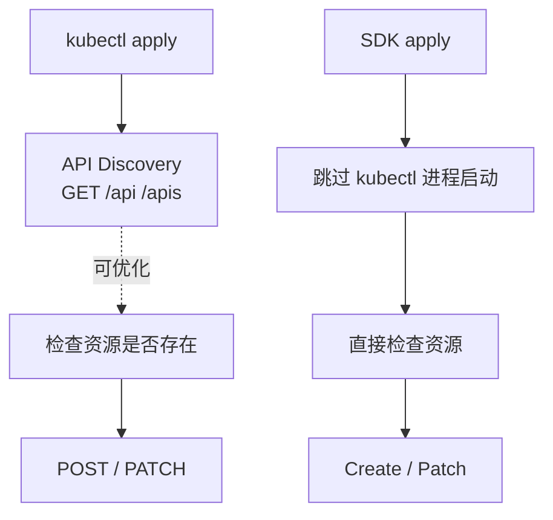
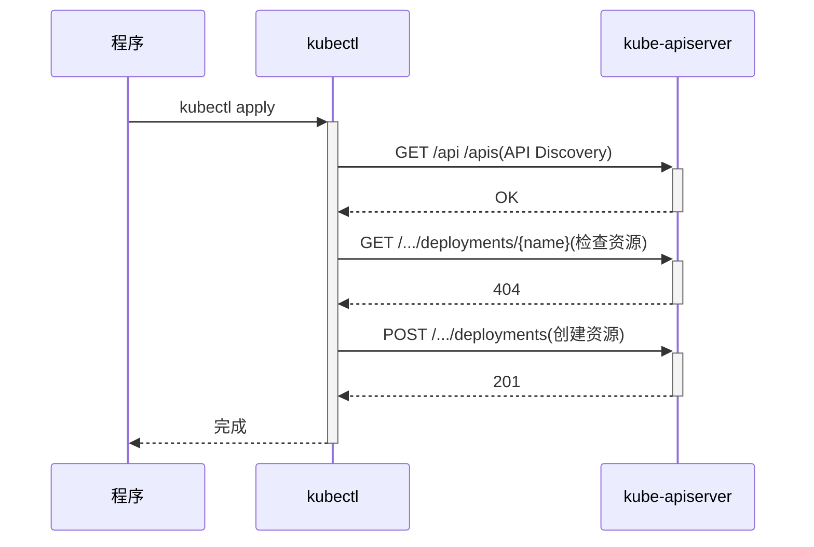
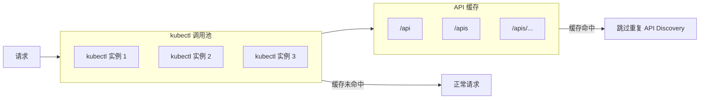

# kubectl apply 执行流程与优化指南

> **阅读对象**:平台工程师、SRE、后端工程师、Kubernetes 工具开发者
> **关联阅读**:[Kubernetes 底层工作原理](./Kubernetes底层工作原理.md)、[生产故障排查九讲](../0xF0_避坑指南/生产故障排查九讲.md)

本文解释 `kubectl apply` 的执行链路、API Discovery 开销来源,以及从 CLI 调用迁移到 Kubernetes SDK 的优化思路。

## 执行链路概览





## 三阶段拆解

| 阶段 | 请求 | 说明 |
| --- | --- | --- |
| API Discovery | `GET /api`、`GET /apis`、遍历 group/version/resource | `kubectl` 启动时自动探测资源能力 |
| 检查资源 | `GET /.../{resource}/{name}` | 判断创建还是更新 |
| 执行操作 | `POST` / `PATCH` | 真正创建或更新资源 |

## 为什么频繁 `kubectl apply` 会放大 QPS

`kubectl` 是独立 CLI 进程。业务程序如果通过 `spawn/exec` 高频调用 `kubectl`,每次调用都会经历进程启动、配置加载、API Discovery、资源检查与最终写入。

虽然 `kubectl` 自身有本地缓存,但在高并发短进程场景下,缓存命中并不稳定,也无法消除进程创建与上下文切换成本。批量创建/销毁容器时,这个开销会被放大成 kube-apiserver 的瞬时 QPS 波动。

## 优化方案一:kubectl 连接池 + 缓存

### 原理



### 示例

```javascript
class KubectlPool {
  constructor(poolSize = 5) {
    this.pool = []
    this.cache = new Map()
    this.init(poolSize)
  }

  async init(size) {
    for (let i = 0; i < size; i += 1) {
      const proc = spawn('kubectl', ['get', 'api'])
      this.pool.push(proc)
    }
    await this.warmupCache()
  }

  async warmupCache() {
    const result = await this.exec('kubectl get api -o json')
    this.cache.set('api_discovery', result)
  }

  async apply(yaml) {
    const cachedApi = this.cache.get('api_discovery')
    if (cachedApi) {
      return this.execWithPool('kubectl apply -f -', yaml)
    }
    return this.exec('kubectl apply -f -', yaml)
  }
}
```

### 缓存策略

| 缓存内容 | 过期时间 | 说明 |
| --- | --- | --- |
| `/api` | 1 小时 | 核心 API 变化少 |
| `/apis` | 1 小时 | 扩展 API 变化少 |
| 具体 API 响应 | 30 分钟 | 按资源类型缓存 |

### 适用场景

- 历史系统改动成本高
- 必须保留 `kubectl` 行为兼容性
- 调用量中等,只需要缓解重复 Discovery

## 优化方案二:使用 Kubernetes SDK

### 优势

| 维度 | `kubectl` | SDK |
| --- | --- | --- |
| API Discovery | CLI 启动时可能触发大量探测 | 直接调用目标 API |
| 运行依赖 | 需要安装并配置 `kubectl` | 语言内依赖 |
| 性能 | 进程启动 + Discovery 开销 | 复用客户端实例 |
| 控制粒度 | 低 | 高 |
| 错误处理 | 文本输出解析 | 结构化异常 |

### 安装

```bash
npm install @kubernetes/client-node
```

### 创建资源示例

```javascript
const k8s = require('@kubernetes/client-node')

const kc = new k8s.KubeConfig()
kc.loadFromCluster()

const appsApi = kc.makeApiClient(k8s.AppsV1Api)
const coreApi = kc.makeApiClient(k8s.CoreV1Api)
const networkingApi = kc.makeApiClient(k8s.NetworkingV1Api)

const deployment = {
  apiVersion: 'apps/v1',
  kind: 'Deployment',
  metadata: { name: 'my-app', namespace: 'default' },
  spec: {
    replicas: 3,
    selector: { matchLabels: { app: 'my-app' } },
    template: {
      metadata: { labels: { app: 'my-app' } },
      spec: { containers: [{ name: 'app', image: 'nginx:alpine' }] },
    },
  },
}

async function createResources() {
  await appsApi.createNamespacedDeployment('default', deployment)
  await coreApi.createNamespacedService('default', {
    apiVersion: 'v1',
    kind: 'Service',
    metadata: { name: 'my-service', namespace: 'default' },
    spec: { selector: { app: 'my-app' }, ports: [{ port: 80, targetPort: 80 }] },
  })
  await networkingApi.createNamespacedIngress('default', {
    apiVersion: 'networking.k8s.io/v1',
    kind: 'Ingress',
    metadata: { name: 'my-ingress', namespace: 'default' },
    spec: { rules: [{ host: 'example.com', http: { paths: [] } }] },
  })
}
```

### apply 语义示例

```javascript
async function applyDeployment(appsApi, deployment) {
  const name = deployment.metadata.name
  const namespace = deployment.metadata.namespace

  try {
    await appsApi.patchNamespacedDeployment(
      name,
      namespace,
      deployment,
      undefined,
      undefined,
      undefined,
      undefined,
      undefined,
      { headers: { 'Content-Type': 'application/apply-patch+yaml' } },
    )
  } catch (err) {
    if (err.response && err.response.statusCode === 404) {
      await appsApi.createNamespacedDeployment(namespace, deployment)
      return
    }
    throw err
  }
}
```

## 方案对比

| 指标 | kubectl 连接池 | Kubernetes SDK |
| --- | --- | --- |
| API Discovery 请求 | 首次后可接近 0 | 始终避免 CLI Discovery |
| 实现复杂度 | 中 | 低到中 |
| 代码改动 | 中 | 中到大 |
| 外部依赖 | `kubectl` | SDK 包 |
| 长期维护性 | 一般 | 高 |
| 错误处理 | 文本解析 | 结构化异常 |

## 推荐策略

- **小型项目 / 快速兼容**:可先做 `kubectl` 调用池与缓存,降低改造风险。
- **长期维护 / 高频调用**:优先使用官方 SDK,复用 API 客户端实例,避免 CLI 进程与 Discovery 抖动。
- **生产平台型系统**:不要在核心链路中高频 `spawn/exec kubectl`,应通过 SDK 或 Operator 模式与 API Server 通信。

## 实践检查清单

- [ ] API 客户端是否复用,而不是每次请求都新建
- [ ] 是否避免在热路径中 `spawn/exec kubectl`
- [ ] 是否区分资源不存在、权限不足、网络失败等错误
- [ ] 是否限制批量操作并发度
- [ ] 是否监控 kube-apiserver QPS、延迟与错误码
