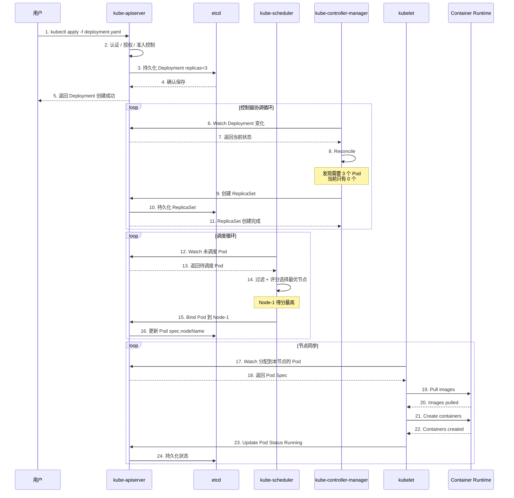
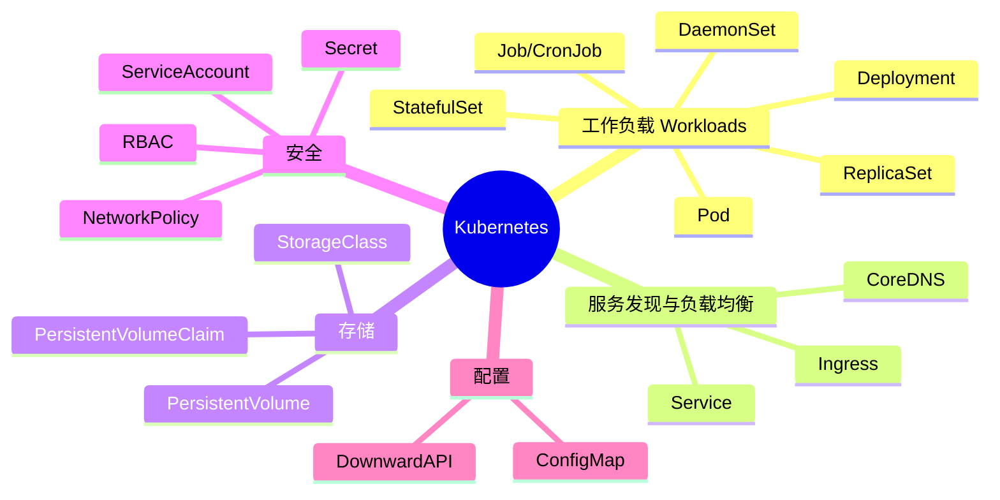
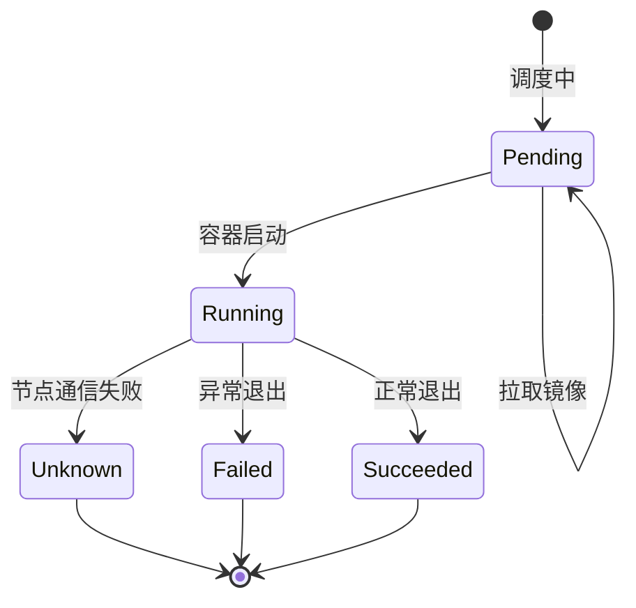
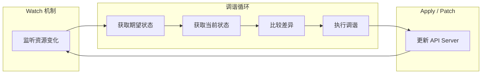

# Kubernetes 底层工作原理

> **阅读对象**:平台工程师、后端工程师、SRE、Kubernetes 学习者
> **关联阅读**:[kubectl apply 执行流程与优化指南](./KubectlApply执行流程与优化指南.md)、[Kubernetes 本地开发环境部署指南](./Kubernetes本地开发环境部署指南.md)、[Kubernetes 实践避坑指南](../0xF0_避坑指南/Kubernetes实践避坑指南.md)

本文从控制平面、节点组件、网络、存储、安全与控制器调谐循环几个维度,解释 Kubernetes 的底层运行机制。

## 架构总览

```mermaid
flowchart TB
    subgraph Client["客户端层"]
        kubectl[kubectl CLI]
        dashboard[Kubernetes Dashboard]
        apiClient[其他 API 客户端]
    end

    subgraph ControlPlane["Control Plane 控制平面"]
        subgraph etcdCluster["etcd 集群"]
            etcd1[etcd-1]
            etcd2[etcd-2]
            etcd3[etcd-3]
        end

        kubeAPIServer[kube-apiserver<br/>API 服务器<br/>认证 / 授权 / 准入控制]
        kubeScheduler[kube-scheduler<br/>调度器<br/>过滤 / 评分 / 绑定]
        kubeControllerManager[kube-controller-manager<br/>控制器管理器<br/>Node / Deployment / Endpoint / ServiceAccount]
        cloudControllerManager[cloud-controller-manager<br/>云控制器管理器<br/>Node / Route / Service]
    end

    subgraph Node["Node 节点层"]
        subgraph Node1["Node-1"]
            kubelet1[kubelet<br/>CRI / CSI / CNI / cAdvisor]
            kubeProxy1[kube-proxy<br/>iptables / ipvs]
            containerRuntime1[containerd / runc<br/>容器实例]
        end

        subgraph Node2["Node-2"]
            kubelet2[kubelet]
            kubeProxy2[kube-proxy]
            containerRuntime2[containerd / runc<br/>容器实例]
        end
    end

    subgraph Network["网络层 CNI"]
        CNI[CNI 插件<br/>Calico / Flannel / Cilium / Weave]
        Ingress[Ingress Controller]
        CoreDNS[CoreDNS<br/>服务发现]
    end

    subgraph Storage["存储层 CSI"]
        CSI[CSI 插件<br/>持久卷管理]
    end

    subgraph Security["安全层"]
        RBAC[RBAC<br/>角色访问控制]
        NetworkPolicy[NetworkPolicy<br/>网络策略]
        PodSecurity[Pod Security Admission]
    end

    subgraph WatchLoop["控制器同步循环"]
        desired[Desired State<br/>期望状态]
        current[Current State<br/>当前状态]
        diff[差异检测]
        action[调谐动作]
        desired --> diff
        current --> diff
        diff --> action
        action --> current
    end

    kubectl -->|HTTPS / REST| kubeAPIServer
    dashboard -->|HTTPS / REST| kubeAPIServer
    apiClient -->|HTTPS / REST| kubeAPIServer

    kubeAPIServer -->|读写| etcd1
    kubeAPIServer -->|读写| etcd2
    kubeAPIServer -->|读写| etcd3
    etcd1 <--> etcd2
    etcd2 <--> etcd3
    etcd3 <--> etcd1

    kubeScheduler -->|Watch / Patch| kubeAPIServer
    kubeControllerManager -->|Watch / Patch| kubeAPIServer
    cloudControllerManager -->|Cloud API| kubeAPIServer

    kubeAPIServer -->|Notify| kubeScheduler
    kubeAPIServer -->|Notify| kubeControllerManager

    kubeScheduler -->|Bind Pod| kubeAPIServer
    kubeAPIServer -->|Pod Spec| kubelet1
    kubeAPIServer -->|Pod Spec| kubelet2

    kubelet1 -->|CRI| containerRuntime1
    kubelet2 -->|CRI| containerRuntime2

    kubelet1 -->|CNI| CNI
    kubelet2 -->|CNI| CNI

    kubelet1 -->|CSI| CSI
    kubelet2 -->|CSI| CSI

    kubeProxy1 -->|iptables / ipvs| NetworkPolicy
    kubeProxy2 -->|iptables / ipvs| NetworkPolicy

    containerRuntime1 -->|DNS 查询| CoreDNS
    containerRuntime2 -->|DNS 查询| CoreDNS

    CoreDNS -->|服务注册| kubeAPIServer
```

## 核心工作流程

## 关键组件职责

| 组件 | 职责 | 关键词 |
| --- | --- | --- |
| `kube-apiserver` | 集群唯一入口,负责认证、授权、准入控制与资源读写 | REST API、etcd 交互 |
| `etcd` | 保存集群期望状态与当前状态 | Raft、一致性、Watch |
| `kube-scheduler` | 为未调度 Pod 选择节点 | 过滤、评分、亲和性、污点容忍 |
| `kubelet` | 节点代理,负责容器生命周期与状态上报 | CRI、CSI、CNI、cAdvisor |
| `kube-proxy` | 实现 Service 转发规则 | iptables、ipvs |
| `kube-controller-manager` | 运行控制器集合,持续调谐资源状态 | Reconcile、Desired State |

## 核心概念

## Pod 生命周期

## 控制器协调模式

## 实践要点

1. **API Server 是唯一入口**:所有组件都通过 API Server 读写状态,不要绕过它直接操作 etcd。
2. **etcd 保存状态,不执行业务逻辑**:逻辑由控制器、调度器、kubelet 等组件通过 Watch + Reconcile 完成。
3. **调度只负责绑定节点**:真正创建容器的是目标节点上的 kubelet。
4. **控制器不是一次性任务**:控制器持续比较期望状态与当前状态,直到系统收敛。
5. **网络与存储依赖插件体系**:CNI 负责网络,CSI 负责存储,CRI 负责容器运行时。
