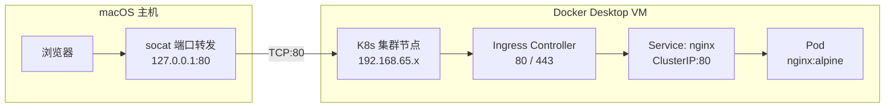

# Kubernetes 本地开发环境部署指南

> **阅读对象**:平台工程师、后端工程师、Kubernetes 学习者
> **适用环境**:macOS + Docker Desktop Kubernetes
> **关联阅读**:[Kubernetes 底层工作原理](./Kubernetes底层工作原理.md)、[Kubernetes 实践避坑指南](../0xF0_避坑指南/Kubernetes实践避坑指南.md)

本文给出一套基于 Docker Desktop Kubernetes、Ingress NGINX 与 `socat` 的本地开发环境搭建方案,用于在 macOS 上模拟通过域名访问集群内服务。

## 访问链路



## 环境要求

| 工具 | 建议版本 | 说明 |
| --- | --- | --- |
| macOS | 13+ | 本文以 macOS 为主 |
| Docker Desktop | 4.51+ | 启用内置 Kubernetes |
| kubectl | 与集群版本兼容 | Docker Desktop 通常自带配置 |
| Helm | 3.x | 安装 Ingress NGINX |

## 1. 启用 Kubernetes

1. 打开 Docker Desktop。
2. 进入 **Settings → Kubernetes**。
3. 选择 **Kubeadm**(单节点)或 **Kind**(多节点)。
4. 点击 **Create** 并等待集群创建完成。

验证节点:

```bash
kubectl get nodes
```

期望看到至少一个 `Ready` 节点。

## 2. 部署 Ingress NGINX

使用 `hostNetwork` + `hostPort` 暴露 80/443:

```bash
helm repo add ingress-nginx https://kubernetes.github.io/ingress-nginx
helm repo update

helm install ingress-nginx ingress-nginx/ingress-nginx \
  --namespace ingress \
  --create-namespace \
  --set controller.hostNetwork=true \
  --set controller.hostPort.enabled=true \
  --set controller.hostPort.http=80 \
  --set controller.hostPort.https=443

kubectl wait --for=condition=ready pod \
  -l app.kubernetes.io/component=controller \
  -n ingress \
  --timeout=60s
```

## 3. 配置端口转发

Docker Desktop 的 Kubernetes 运行在虚拟机内,macOS 通常无法直接访问节点 IP。可使用 `socat` 将本机端口转发到 Docker Desktop VM 内的节点端口。

获取节点 IP:

```bash
kubectl get nodes -o jsonpath='{.items[0].status.addresses[?(@.type=="InternalIP")].address}'
```

示例输出:

```text
192.168.65.3
```

启动 `socat` 容器:

```bash
docker run -d \
  --name socat \
  --restart=always \
  -p 80:80 \
  socat TCP-LISTEN:80,fork TCP:192.168.65.3:80
```

访问链路:

```text
浏览器 → 127.0.0.1:80 → socat → K8s 节点:80 → Ingress → Service → Pod
```

停止转发:

```bash
docker stop socat && docker rm socat
```

## 4. 部署示例服务

创建命名空间:

```bash
kubectl create namespace demo
```

创建 `nginx.yaml`:

```yaml
apiVersion: v1
kind: Service
metadata:
  name: nginx
  namespace: demo
spec:
  selector:
    app: nginx
  ports:
    - port: 80
      targetPort: 80
  type: ClusterIP
---
apiVersion: apps/v1
kind: Deployment
metadata:
  name: nginx
  namespace: demo
spec:
  replicas: 1
  selector:
    matchLabels:
      app: nginx
  template:
    metadata:
      labels:
        app: nginx
    spec:
      containers:
        - name: nginx
          image: nginx:alpine
          ports:
            - containerPort: 80
```

应用资源:

```bash
kubectl apply -f nginx.yaml
```

创建 `nginx-ingress.yaml`:

```yaml
apiVersion: networking.k8s.io/v1
kind: Ingress
metadata:
  name: nginx
  namespace: demo
  annotations:
    nginx.ingress.kubernetes.io/rewrite-target: /
spec:
  ingressClassName: nginx
  rules:
    - host: nginx.local
      http:
        paths:
          - path: /
            pathType: Prefix
            backend:
              service:
                name: nginx
                port:
                  number: 80
```

应用 Ingress:

```bash
kubectl apply -f nginx-ingress.yaml
```

配置 hosts:

```bash
echo "127.0.0.1 nginx.local" | sudo tee -a /etc/hosts
```

访问:

```text
http://nginx.local
```

## 5. 常用命令

```bash
kubectl get pods -A
kubectl get svc -A
kubectl get ingress -A
kubectl logs -n ingress -l app.kubernetes.io/component=controller --tail=50
kubectl describe ingress nginx -n demo
```

清理示例资源:

```bash
kubectl delete namespace demo
helm uninstall ingress-nginx -n ingress
kubectl delete namespace ingress
```

## 6. 常见问题

### 6.1 socat 端口被占用

查看 80 端口占用:

```bash
lsof -i :80
```

处理方式:

- 停止占用 80 端口的进程
- 或将 `socat` 改为其他端口,例如 `-p 8080:80`

### 6.2 Ingress 返回 404

常见原因:

- `host` 与浏览器访问域名不一致
- `ingressClassName` 与 Ingress Controller 不一致
- Service 名称或端口错误
- Pod 标签与 Service selector 不匹配

排查命令:

```bash
kubectl describe ingress nginx -n demo
kubectl get endpoints nginx -n demo
kubectl logs -n ingress -l app.kubernetes.io/component=controller --tail=100
```

### 6.3 需要重启或重置 Kubernetes

在 Docker Desktop 中进入 **Settings → Kubernetes → Reset Kubernetes Cluster**。

重置后需要重新部署:

1. Ingress NGINX
2. `socat` 端口转发
3. 示例业务资源

## 7. 实践建议

- 本地环境只用于开发验证,不要把 Docker Desktop 集群当成生产环境。
- Ingress、Service、Pod 的链路要分段验证,不要只看浏览器返回。
- 出现 404 时优先检查 Ingress 规则与 Service Endpoints。
- 出现连接失败时优先检查 `socat`、节点 IP 与 Ingress Controller 是否就绪。
