# OpenCode 全体系深度解析

> **阅读对象**:AI 平台工程师、Agent 开发者、OpenCode 使用者
> **前置阅读**:[人机协同开发流程](../0xA0_实践方法/人机协同开发流程.md) · [OpenCode K8S 集群部署指南](./OpenCodeK8S集群部署指南.md)
>
> 本文约 8000 字,预计阅读时间 25 分钟。

---

## 前言

当 AI 智能体从极客玩物逐步成为办公标配，我们终于不用再在「功能强大但配置复杂」和「上手简单但能力有限」之间艰难抉择。

**OpenCode** 的出现，打破了这个困局。

它是一套轻量化、高灵活、配置驱动的开源智能体运行基座。不是玩具，不是 Demo，而是能真正落地的生产级方案——既能支撑新手 5 分钟搭建第一个智能体，也能承载企业级多智能体集群的长期稳定运行。

---

## 一、OpenCode 底层核心工作原理

### 本章要点

| 核心概念 | 一句话说明 |
|---------|-----------|
| 统一接入层 | 所有外部交互的单一入口，流量可控、事件可追溯 |
| 内核调度 | 规则解析、流程管控、资源调度、行为校验 |
| 独立会话 | 隔离记忆、上下文不串扰、多轮对话无缝衔接 |
| 决策与执行分离 | 模型只思考，工具才执行，从根源规避随机性问题 |

### 1.1 分层解耦的整体架构

OpenCode 整体采用**分层解耦**的设计思路，每个环节分工明确，不会出现功能混杂、流程混乱的情况。这是它运行稳定、不容易出问题的核心原因。

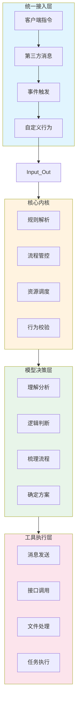

### 1.2 统一接入层：流量的智能闸口

整套框架的入口统一收敛，所有外部交互行为都会汇总到**统一接入层**。不管是：

- 📱 各类客户端指令
- 💬 第三方平台消息推送
- ⚡ 事件触发请求
- 🔧 自定义交互行为

都会经过统一调度，有序进入系统内部处理流程。统一入口的好处：**流量可控、事件可追溯**，后续做消息分发、任务分流、多终端适配都会非常顺畅。

### 1.3 核心内核：全局调度的枢纽

内核不参与具体业务逻辑，只负责四件事：

| 职责 | 说明 |
|------|------|
| 规则解析 | 解读角色约束、技能定义、插件配置 |
| 流程管控 | 控制执行顺序、跳转逻辑、异常处理 |
| 资源调度 | 分配计算资源、加载必要模块 |
| 行为校验 | 确保输出符合预设规范 |

### 1.4 独立会话机制：智能体稳定运行的关键

当一条新的交互请求进入系统后，内核会第一时间创建或绑定独立会话空间。每一段独立对话、每一次独立任务，都拥有**专属的会话上下文**。

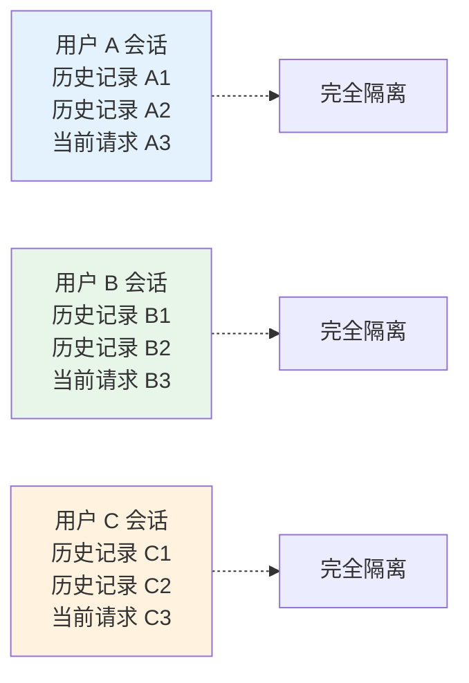

**关键优势**：
- 不同用户、不同场景、不同服务方向的会话**完全隔离**
- 不会发生记忆串扰、上下文错乱
- 长周期多轮对话、连续任务跟进、复杂步骤协作，都能完整衔接

### 1.5 决策与执行分离：核心设计理念

这是 OpenCode 与很多同类工具的**本质区别**：

| 传统模式（问题） | OpenCode 模式（解决方案） |
|-----------------|-------------------------|
| 模型直接生成最终回复 | 模型只负责思考和决策 |
| 模型随意调用接口 | 所有执行必须通过标准化工具 |
| 模型自由发挥 | 决策与执行完全解耦 |

**大模型只做四件事**：
1. 理解分析
2. 逻辑判断
3. 梳理流程
4. 确定执行方案

**禁止模型直接做的事**：
- ❌ 生成最终反馈内容
- ❌ 私自完成交互闭环
- ❌ 直接发送消息
- ❌ 擅自调用接口

这套机制从根源上规避了：
- 模型随意自由发挥
- 无规则兜底回复
- 擅自中断业务流程
- 内层直接消费消息导致链路断裂

---

## 二、OpenCode 模型运行与调度机制

### 本章要点

| 核心能力 | 一句话说明 |
|---------|-----------|
| 全品类模型兼容 | 公有/私有/本地开源，一键切换，业务逻辑零改动 |
| 智能提示词组装 | 模块化自动拼接，动态优化 token 消耗 |
| 双层行为约束 | 前置注入 + 后置校验，确保输出稳定规范 |

### 2.1 全品类模型兼容

OpenCode 底层封装了**统一的模型调用接口**，兼容性极强：

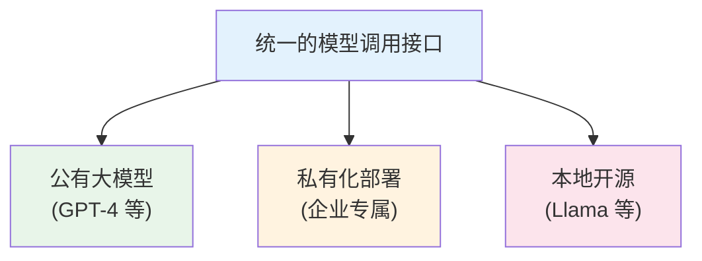

**灵活切换**：仅需修改连接参数，零改动业务逻辑：

```yaml
# 切换前：使用 OpenAI
model:
  provider: openai
  model: gpt-4
  api_key: xxx

# 切换后：使用本地模型
model:
  provider: ollama
  model: llama3
  base_url: http://localhost:11434
```

### 2.2 智能提示词组装模式

传统方式的痛点：手动编写大量冗长提示词，内容杂乱、难以维护。

OpenCode 的解决方案：**模块化自动拼接**。

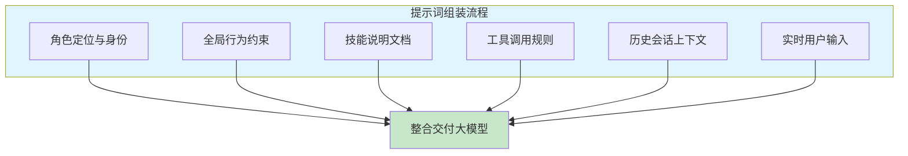

**动态优化**：系统自动根据上下文长度调整内容，合理控制 token 消耗，避免冗余浪费。

### 2.3 双层行为约束体系

大模型天然具备随机性，没有限制容易出现：

- 🚫 跳步执行
- 🚫 省略关键流程
- 🚫 直接文本回复
- 🚫 绕过工具调用

OpenCode 的解决方案：**前置 + 后置双层约束**。

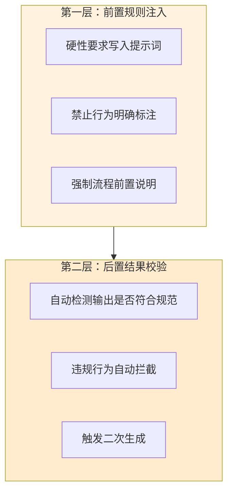

**效果**：智能体始终保持稳定统一的服务标准，不会因模型随机输出导致业务异常。

---

## 三、插件系统运行模式与核心价值

### 本章要点

| 特性 | 一句话说明 |
|-----|-----------|
| 原子化能力 | 通用型、无业务绑定，即插即用 |
| 全局共享 | 项目集层面安装，所有子项目可用 |
| 懒加载 | 未调用的插件不占用资源 |
| 权限管控 | 精细化控制每个工具的使用权限 |
| 分层隔离 | 底层插件更新不影响上层业务 |

### 3.1 插件：智能体的基础工具库

如果把智能体体系比作工作团队，**插件**就是团队里的通用基础工具库。

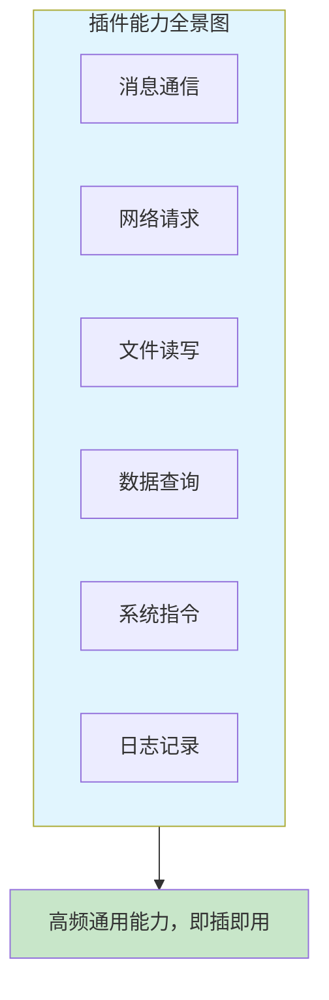

### 3.2 项目集级别的全局共享

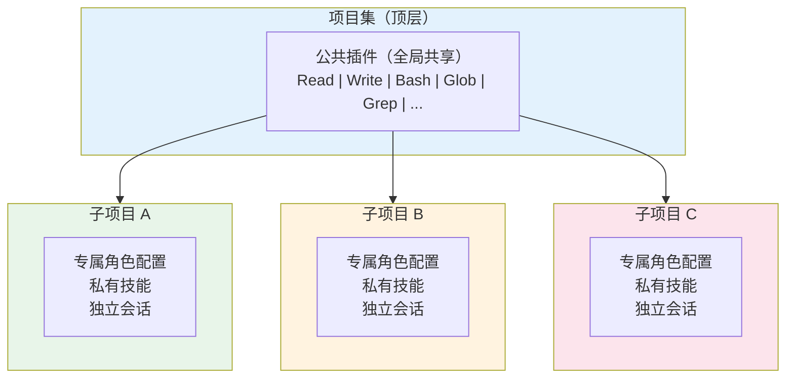

### 3.3 分层隔离设计

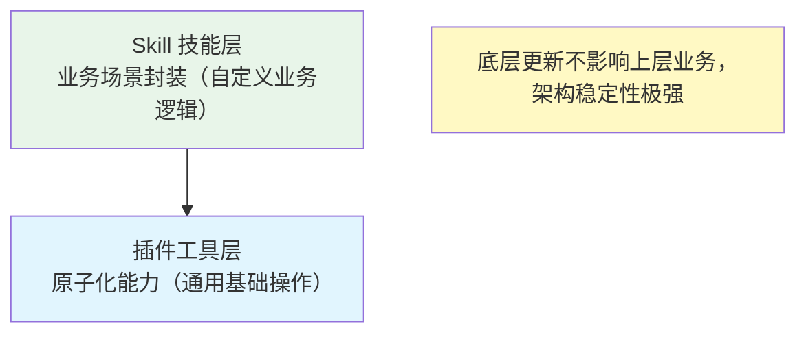

**核心原则**：插件只负责单一底层动作执行，不承载业务判断。所有复杂业务场景都通过上层 Skill 做二次封装。

### 3.4 权限精细化管控

管理者可以自主定义每个工具的使用权限：

| 权限级别 | 说明 | 适用场景 |
|---------|------|---------|
| 允许使用 | 正常调用 | 日常高效使用 |
| 禁止使用 | 完全禁用 | 高风险操作 |
| 二次确认 | 每次调用需确认 | 敏感操作 |

---

## 四、Skill 技能完整封装逻辑

### 本章要点

| 核心价值 | 一句话说明 |
|---------|-----------|
| 流程固化 | 把多步骤任务固定下来，引导模型按序执行 |
| 能力复用 | 一次编写，跨项目复用 |
| 文档驱动 | 低/零代码即可完成编写和修改 |
| 深度联动 | 与角色约束配合，边界清晰又灵活 |

### 4.1 技能 vs 插件：各司其职

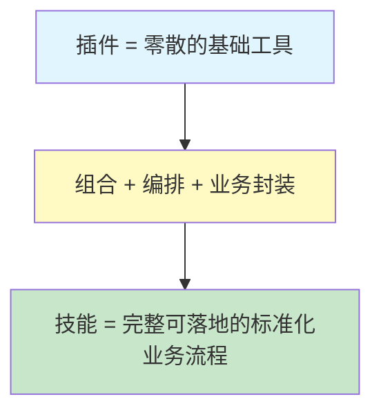

### 4.2 技能文档标准结构

每一项独立技能，都是一个**独立的标准化单元**：

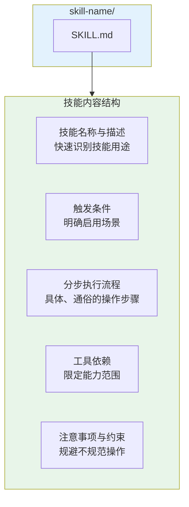

### 4.3 技能的核心价值

| 价值点 | 说明 |
|-------|------|
| **流程固化** | 引导模型严格按既定顺序推进，避免逻辑跳步、步骤遗漏 |
| **结果稳定** | 保证每一次执行流程统一、结果可预期 |
| **跨项目复用** | 成熟的业务技能可直接复制到多个场景 |
| **降低维护成本** | 不用重复梳理逻辑、重复编写规则 |
| **与角色联动** | 角色划定边界，技能细化流程，互相配合 |

---

## 五、普通人零基础编写自定义技能实操方法

### 本章要点

> **重要认知**：编写技能不需要代码基础，主打轻量化、文档化、通俗化。

### 5.1 技能编写四步法

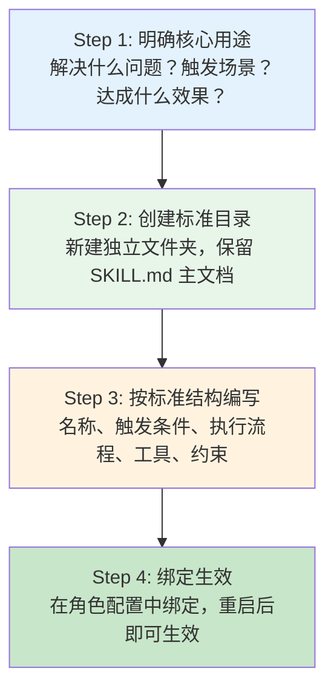

### 5.2 一个真实技能示例

假设要编写一个「日报总结」技能：

```markdown
# 日报总结技能

## 名称
daily-report-summary

## 描述
帮助用户整理和总结每日的关键工作内容，生成结构化的日报文档。

## 触发条件
当用户提到"写日报"、"日报总结"、"今天做了什么"等意图时启用。

## 执行流程
1. 读取用户提供的当日工作记录（若无记录，提示用户提供）
2. 识别关键事项：已完成任务、进行中任务、遇到的问题
3. 按标准格式整理：
   - 今日完成
   - 进行中
   - 明日计划
   - 问题与思考
4. 生成简洁有条理的日报内容
5. 询问用户是否需要调整格式或补充内容

## 所需工具
- Read（读取用户提供的内容）
- Write（生成日报文件）
- Edit（如需调整内容）

## 注意事项
- 日报内容保持简洁，每项不超过3行
- 避免流水账，突出重点成果
- 如用户未提供工作记录，先引导用户提供
```

### 5.3 编写技巧总结

| 技巧 | 说明 |
|-----|------|
| 语言通俗 | 不需要复杂语法，清晰自然的文字即可 |
| 步骤具体 | 每一步尽量明确，告诉模型「先做什么、后做什么」 |
| 工具限定 | 明确列出可用的工具，限定能力范围 |
| 异常处理 | 预判可能的问题，给出处理方式 |

---

## 六、项目集分层配置核心架构

### 本章要点

> 这是 OpenCode 最具优势、最容易被忽略、却在长期使用中至关重要的**高阶能力**。

### 6.1 单项目 vs 项目集：痛点对比

| 问题场景 | 单项目模式 | 项目集模式 |
|---------|----------|-----------|
| 新增业务线 | 所有配置混杂，需要仔细隔离 | 新建子项目，业务完全隔离 |
| 修改全局配置 | 可能影响现有业务 | 子项目按需覆盖，互不干扰 |
| 团队协作 | 配置冲突难以协调 | 各子项目独立，权限清晰 |
| 长期维护 | 配置膨胀，难以追溯 | 分层管理，结构清晰 |

### 6.2 项目集双层架构

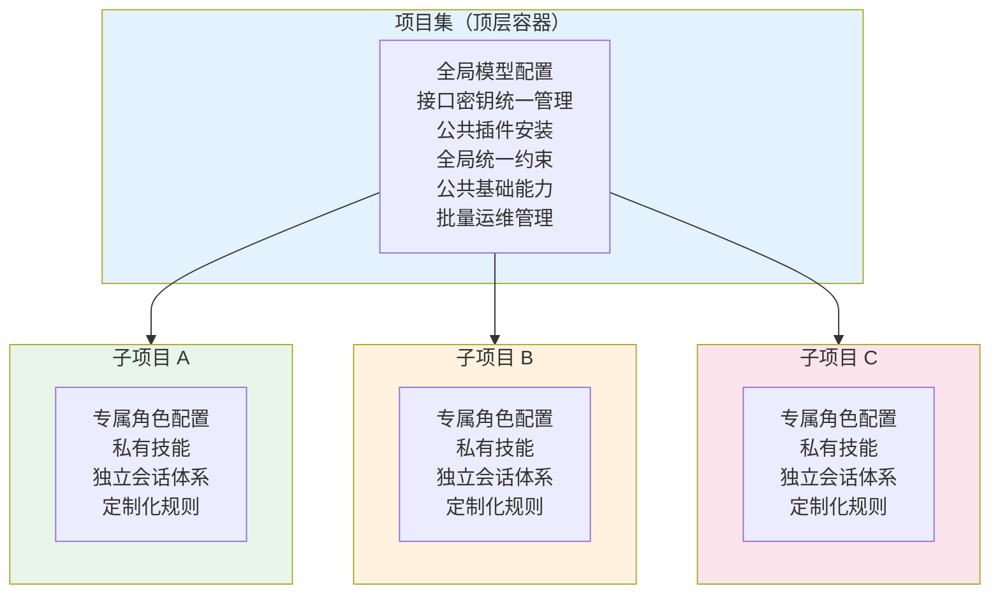

### 6.3 配置优先级设计

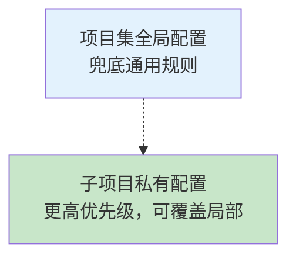

**示例**：
- 项目集：允许使用 Read、Write、Bash 工具
- 子项目A：禁用 Bash（覆盖为禁止）
- 子项目B：保持默认（继承项目集）

**优势**：既保证统一管控，又能满足个性化定制需求。

### 6.4 项目集的核心优势总结

| 优势维度 | 具体表现 |
|---------|---------|
| **资源统一管理** | 全局配置一次维护，减少重复操作 |
| **业务完全隔离** | 子项目独立运行，互不干扰 |
| **灵活配置覆盖** | 兜底规则 + 按需定制 |
| **高效批量运维** | 统一插件更新、服务启停、日志管理 |
| **轻松横向扩容** | 新建子项目即可，无需改动底层 |

---

## 七、普通人从零搭建完整智能体全流程

### 本章要点

> 整套流程以**配置、文档、组合式搭建**为主，没有复杂操作，循序渐进。

### 7.1 六步搭建流程

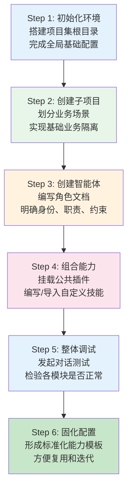

---

## 八、全场景部署与稳定发布方案

### 本章要点

> 三种部署方案，覆盖从个人使用到企业级部署的全部需求。

### 8.1 三种部署方案对比

| 维度 | 本地部署 | 服务器常驻 | 容器化私有部署 |
|-----|---------|-----------|--------------|
| **复杂度** | ⭐ 最简单 | ⭐⭐ 中等 | ⭐⭐⭐ 较高 |
| **适用场景** | 个人日常、功能测试 | 长期在线服务 | 团队协作、企业内网 |
| **维护成本** | 低 | 中 | 中高 |
| **迁移便捷性** | 一般 | 一般 | ⭐⭐⭐ 高 |
| **隐私安全性** | ⭐⭐⭐ 最高 | ⭐⭐ 中 | ⭐⭐⭐ 高 |
| **批量部署** | 不支持 | 手动管理 | ⭐⭐⭐ 支持 |

### 8.2 各方案适用场景

| 部署方式 | 适用场景 |
|---------|---------|
| 📱 **本地部署** | 个人日常使用、功能测试、快速验证、小范围体验 |
| ☁️ **服务器常驻** | 需要长期在线持续服务、断电自启、异常重启保障 |
| 🐳 **容器化部署** | 团队协作、企业内网、大规模批量部署、统一管理 |

### 8.3 统一优势

三种部署方式共享以下特性：

- ✅ 底层逻辑一致
- ✅ 完美兼容项目集架构
- ✅ 支持单一智能体部署
- ✅ 支持多项目集群部署

---

## 总结：OpenCode 全体系全景图

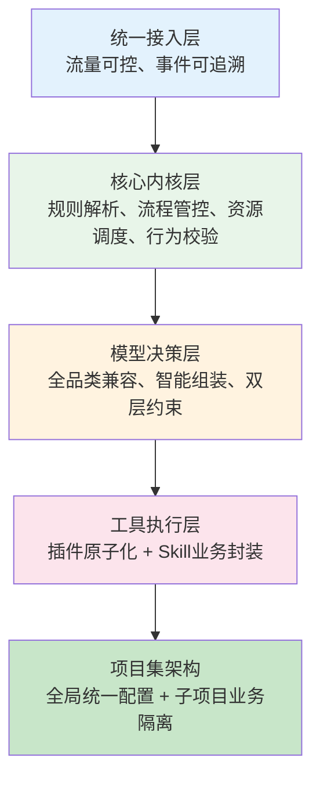

### 核心优势对比

| 目标用户 | 核心能力 |
|---------|---------|
| 🎯 **普通用户** | 零代码定制技能、5分钟搭建专属智能体、文档化配置易维护、个性化自动需求 |
| 🚀 **规模化用户** | 多智能体协同支撑、多业务并行运行、企业级长期稳定运维、横向扩容轻松 |

> **核心特质**：简单易懂的上手门槛 + 可控规范的运行逻辑 + 自由灵活的扩展能力

---

## 附录：相关资源

| 资源类型 | 说明 |
|---------|------|
| 官方文档 | OpenCode 完整使用文档 |
| GitHub | 源码仓库和示例项目 |
| 社区论坛 | 经验交流和问题解答 |
| 技能市场 | 社区共享的 Skill 技能 |

---

> **阅读结束**：如果本文对你有帮助，欢迎收藏和转发。如有问题，欢迎在评论区交流。