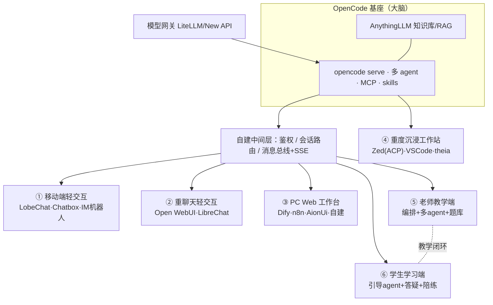
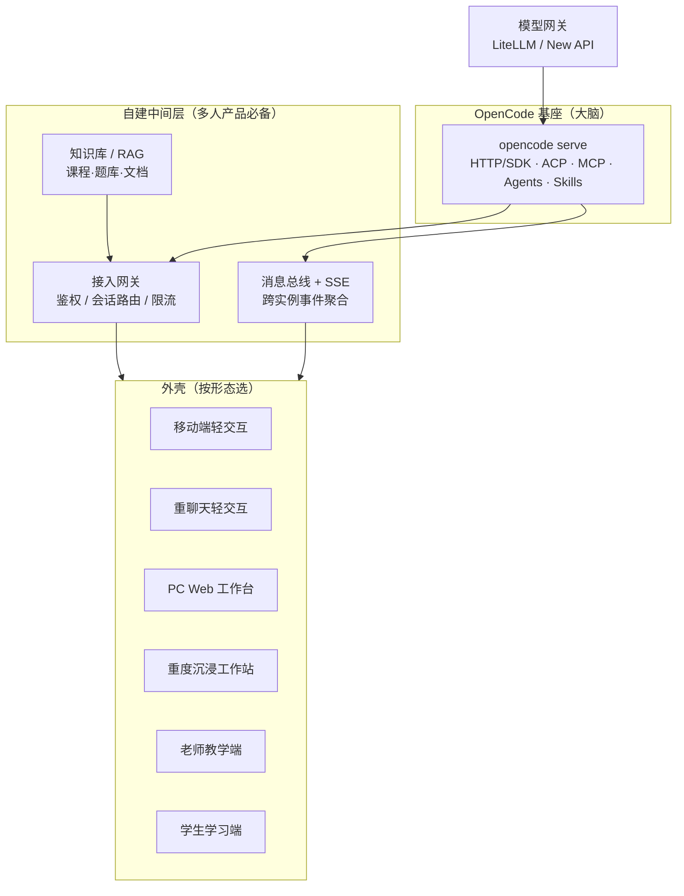
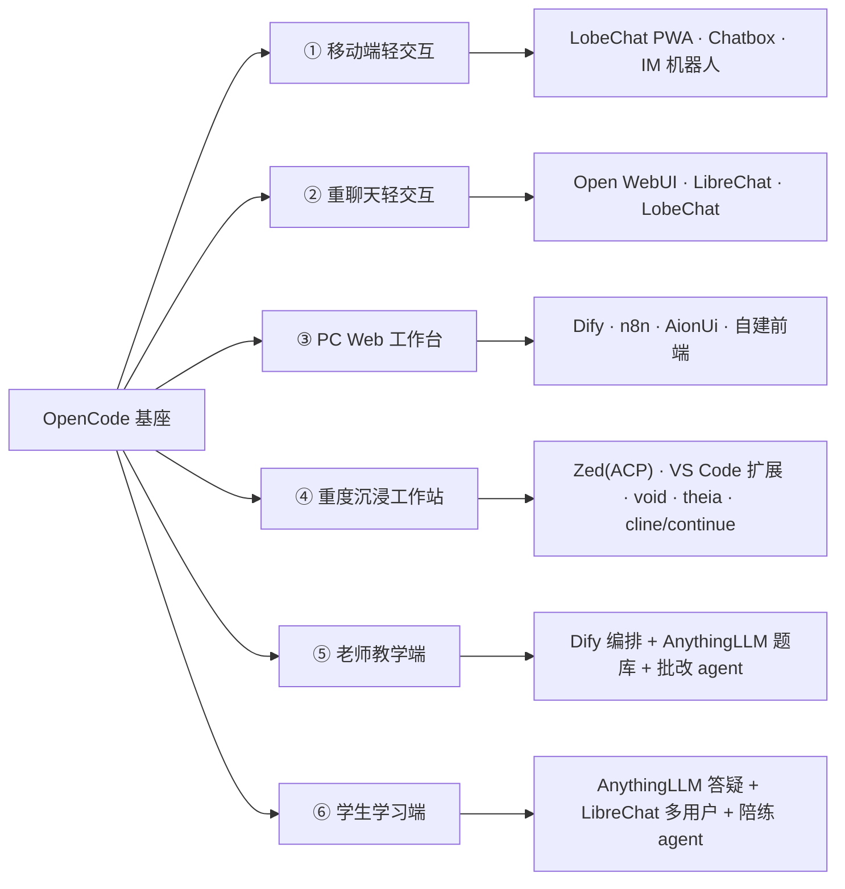
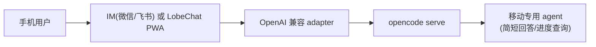
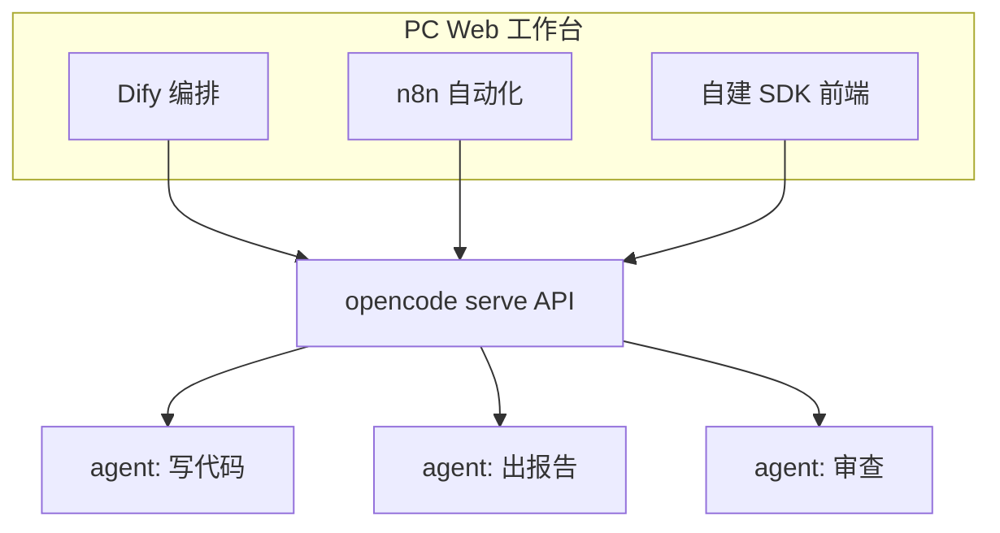
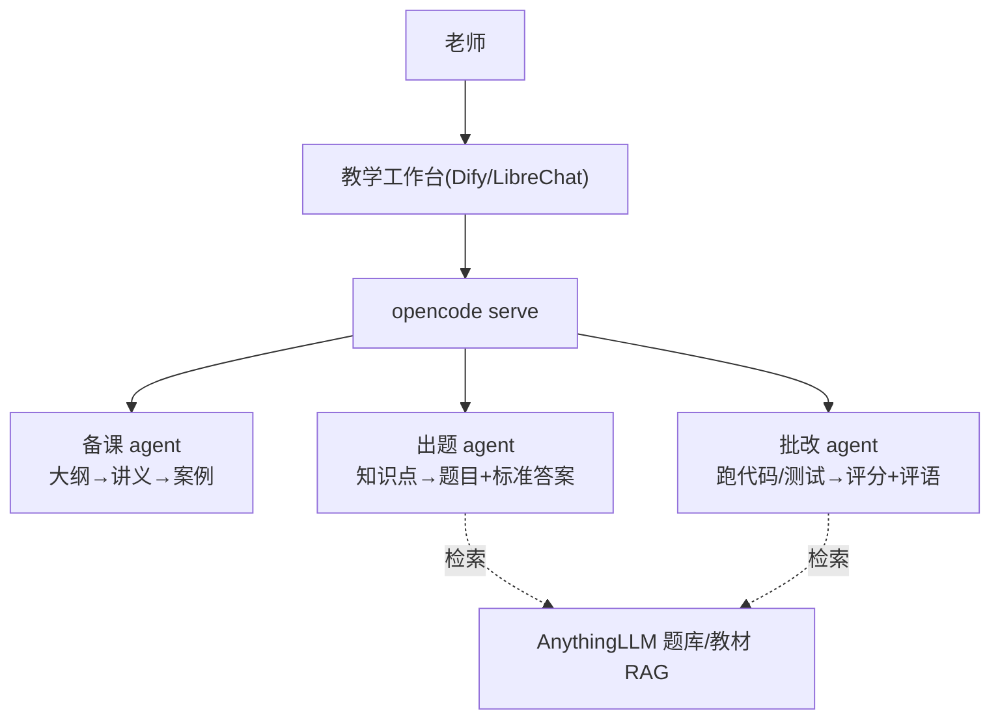
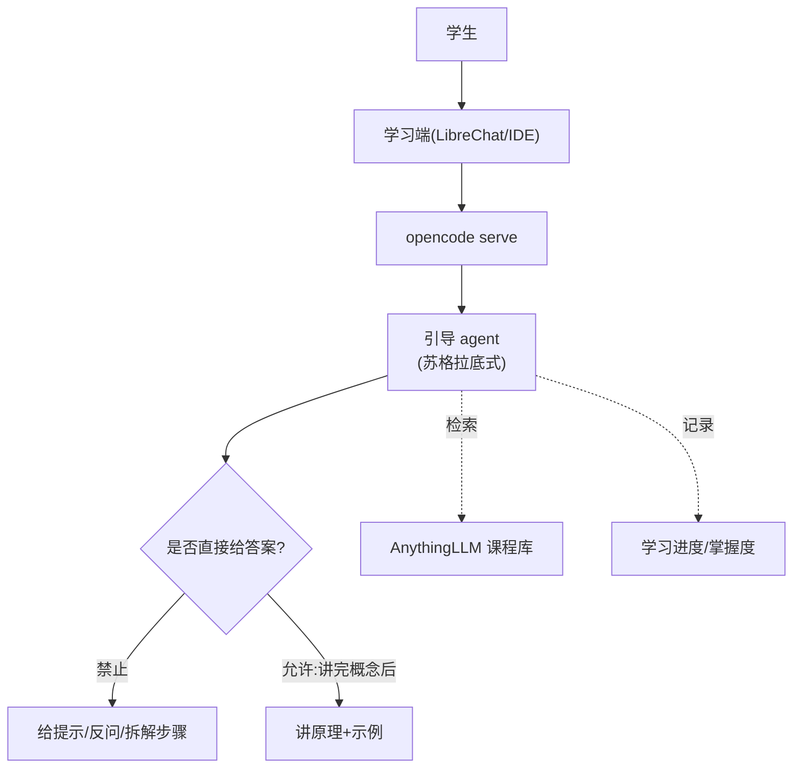
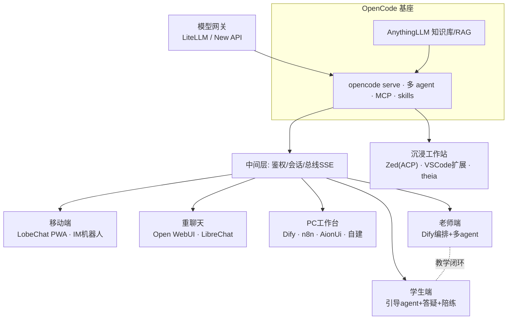

# 以 OpenCode 为基座的 AI 产品组合选型蓝图

> 一句话目标：不从 0 自研，而是把 **OpenCode 当作「AI 大脑/基座」**，按「受众 × 业务场景 × 交互形态」选配开源「外壳」，组合出覆盖移动端、重聊天、PC Web 工作台、重度沉浸工作站，以及**老师教学 / 学生学习**的多形态 AI 产品矩阵。
>
> 核心立场：**技术选型反哺产品**。先用开源生态把产品形态撑开，再回看每种形态怎么接 OpenCode，而不是用「能不能接」去阉割产品想象。

---

## 0. 调研说明

- 数据来源：GitHub REST API 逐仓核实，采集时间 2026-06；star 为采集时点量级（约数），会随时间变化。
- OpenCode 基座能力来源：官方文档 `opencode.ai/docs`（server / sdk / ide / acp / mcp）+ 本工作区已有实战文档（K8S 集群部署、模型网关选型、技能与 MCP 工程实践）。
- 选型口径：**放开「必须直接接 OpenCode」的硬约束**。每个项目标注与 OpenCode 的结合方式（直接接 / 适配接 / 形态参考），目标是形态丰满，而非筛项目。
- 链接：所有项目均给出 `https://github.com/owner/repo` 可点击地址。

---

## 1. 基座：OpenCode 暴露了什么，决定了能接什么

OpenCode（`https://github.com/anomalyco/opencode`，~177k★，TypeScript，MIT）不是「一个 CLI」，而是 **client/server 架构的 AI 运行底座**。它对外的四条集成通道，决定了所有「外壳」怎么挂上来：

| 通道 | 机制 | 谁来消费 | 适配的产品形态 |
|---|---|---|---|
| **HTTP / SDK API** | `opencode serve` 启动 headless server，OpenAPI 3.1，含 session / message / event(SSE) / agent / file 等接口 | 自建 Web 前端、移动端、IM 机器人、工作台 | 移动端、重聊天、PC Web 工作台 |
| **ACP（Agent Client Protocol）** | OpenCode 支持 ACP，可被支持该协议的编辑器直接驱动 | Zed、Neovim 等 ACP 客户端 | 重度沉浸工作站 |
| **IDE 扩展** | 在 VS Code / Cursor / Windsurf / VSCodium 集成终端内一键挂载 TUI，支持选区/文件上下文透传 | 主流 IDE | 重度沉浸工作站 |
| **OpenAI 兼容网关** | 经 LiteLLM / New API 等把模型调用统一为 OpenAI 兼容接口；亦可反向把通用聊天客户端的后端指向自建 adapter | 通用聊天客户端 | 重聊天、移动端 |

关键事实（来自官方 server 文档）：

- `opencode serve --port 4096 --hostname 0.0.0.0 --cors <origin>`：可对外提供服务、可配 CORS 给浏览器前端、可用 `OPENCODE_SERVER_PASSWORD` 加 Basic Auth。
- 会话与消息：`POST /session` 建会话、`POST /session/:id/message`（同步）/ `prompt_async`（异步）发消息、`GET /event` 拿 SSE 事件流——**这就是所有自建前端的数据接口**。
- 多 agent：`GET /agent` 列出 agent，发消息时可指定 `agent`——**可按「老师/学生/答疑/批改」分角色挂不同 agent**。
- 远程驱动 TUI：`/tui/*` 端点可注入 prompt、执行命令——IDE 插件即用此。

> 工作区已验证的实战补充（见《OpenCode K8S 集群部署指南》）：`opencode serve` 模式下只有**全局插件**生效；原生 `/event` 是单进程事件流、不跨 Pod，多实例需自研消息总线 + SSE 给前端；多用户/多端共享时要在 server 前自建会话与鉴权层。这是做「多人产品」时必须补的中间层。

### 1.1 通用参考架构

---

## 2. 形态总览矩阵

| 形态 | 典型受众 | 交互特征 | 首选开源壳 | 与 OpenCode 结合 |
|---|---|---|---|---|
| ① 移动端轻交互 | 老板 / 产品 / 碎片化用户 | 手机、对话、随时问 | LobeChat(PWA)、Chatbox、IM 机器人 | API / OpenAI 兼容 |
| ② 重聊天轻交互 | 大众 / 咨询 / 客服 | 对话窗 + 少量操作 | Open WebUI、LibreChat、LobeChat | API / OpenAI 兼容 |
| ③ PC Web 工作台 | 团队 / 运营 / 协作 | 浏览器、多面板、编排 | Dify、n8n、AionUi、自建前端 | SDK / API / 编排平台 |
| ④ 重度沉浸工作站 | 工程师 / 深度用户 | 桌面 IDE、长任务、全功能 | Zed、VS Code 扩展、void、theia、cline/continue | ACP / IDE 扩展 |
| ⑤ 老师教学端 | 教师 / 助教 / 教研 | 备课、出题、讲解、批改 | Dify + AnythingLLM + 自建 + 教学 agent | API + RAG + 多 agent |
| ⑥ 学生学习端 | 学生 / 自学者 | 答疑、陪练、项目实训 | AnythingLLM、LibreChat、IDE 扩展 + 学习 agent | API + RAG + 护栏 |

---

## 3. 形态① 移动端轻交互

**产品画面**：手机上一个对话框，老板路上问「项目进度」、产品随手问「这个需求怎么拆」，背后是 OpenCode agent 在跑。

| 项目 | 链接 | Star | 语言 | License | 结合方式 | 说明 |
|---|---|---|---|---|---|---|
| LobeChat | https://github.com/lobehub/lobe-chat | ~79k | TS | 自定义 | OpenAI 兼容 / API | PWA 可装到手机桌面，多模型、插件、语音；移动体验最好的开源壳之一 |
| Chatbox | https://github.com/chatboxai/chatbox | ~41k | TS | GPL-3.0 | OpenAI 兼容 | 跨平台客户端（iOS/Android/桌面），配置简单，适合个人轻量入口 |
| CowAgent（原 chatgpt-on-wechat） | https://github.com/zhayujie/CowAgent | ~46k | Python | MIT | API / 工具透传 | 接微信 / 企微 / 飞书 / 钉钉，把 IM 变成 AI 入口，移动端「零安装」 |

**组合范式**：`opencode serve` → 自建 OpenAI 兼容 adapter（把 `/session/message` 包成 `/v1/chat/completions`）→ LobeChat/Chatbox 指过来；或 CowAgent 直接把 IM 消息转发给 OpenCode session。

---

## 4. 形态② 重聊天轻交互

**产品画面**：一个像 ChatGPT 的网页，多用户登录、会话历史、知识库问答，少量按钮操作。面向大众咨询、内部客服、知识助手。

| 项目 | 链接 | Star | 语言 | License | 结合方式 | 说明 |
|---|---|---|---|---|---|---|
| Open WebUI | https://github.com/open-webui/open-webui | ~143k | Python | 自定义 | OpenAI 兼容 | 多用户、权限、RAG、模型管理最成熟的自托管聊天前端；企业内部首选 |
| LibreChat | https://github.com/danny-avila/LibreChat | ~40k | TS | MIT | OpenAI 兼容 / MCP | 多用户、Agents、MCP、Skills，license 友好(MIT)，可深度二开 |
| LobeChat | https://github.com/lobehub/lobe-chat | ~79k | TS | 自定义 | OpenAI 兼容 | 也可作 Web 端，知识库 + 插件 + 多模型 |

**组合范式**：OpenCode 作为「一个模型/一个 agent」挂到 Open WebUI / LibreChat 的模型列表里（经 OpenAI 兼容网关），用户在熟悉的聊天 UI 里就用上了 OpenCode 的工具与 agent 能力。多用户鉴权、会话存储由聊天壳负责，OpenCode 专注执行。

---

## 5. 形态③ PC Web 工作台

**产品画面**：浏览器里的「AI 工作台」，多面板、任务编排、多 agent 看板、流程自动化。面向团队协作、运营、内容生产线。

| 项目 | 链接 | Star | 语言 | License | 结合方式 | 说明 |
|---|---|---|---|---|---|---|
| Dify | https://github.com/langgenius/dify | ~146k | TS | 自定义 | API / 工作流节点 | 可视化 agent 工作流编排平台，把 OpenCode 作为工具/HTTP 节点编入流程，搭多 agent 业务 |
| n8n | https://github.com/n8n-io/n8n | ~194k | TS | 自定义 | HTTP 节点 | 通用自动化平台，原生 AI 能力，可把 OpenCode API 编进自动化链路（定时跑、触发跑） |
| AionUi | https://github.com/iOfficeAI/AionUi | ~29k | TS | Apache-2.0 | CLI 聚合 | 桌面/本地 Cowork 应用，原生聚合 Claude Code/Codex/Gemini CLI/**OpenCode** 等多 CLI，多任务并行界面 |
| 自建前端 | （消费 OpenCode SDK） | — | — | — | SDK / API | 用 `@opencode-ai/sdk` + SSE 自建专属工作台，定制度最高 |

**关键洞察**：AionUi 是「**多 CLI 聚合 GUI**」这一形态的代表——它不替换 OpenCode，而是给 OpenCode（及其他 CLI agent）套一个统一桌面工作台，适合「我已经在用多个 CLI agent，想要一个界面统一管」的场景。Dify/n8n 则是「编排层」，把 OpenCode 当能力节点。

---

## 6. 形态④ 重度沉浸工作站

**产品画面**：工程师的桌面，IDE 里 AI 全程在场，长任务、多文件、代码图谱、终端、调试一体。这是 OpenCode 的「主场」。

| 项目 | 链接 | Star | 语言 | License | 结合方式 | 说明 |
|---|---|---|---|---|---|---|
| Zed | https://github.com/zed-industries/zed | ~86k | Rust | 自定义 | **ACP 原生** | 高性能多人协作编辑器，原生支持 Agent Client Protocol，可直接驱动 OpenCode，沉浸体验最佳 |
| VS Code / Cursor / Windsurf | （官方扩展） | — | — | — | IDE 扩展 | `opencode` 在集成终端一键挂载 TUI，选区/文件上下文透传，零成本融入现有工作流 |
| void | https://github.com/voideditor/void | ~29k | TS | Apache-2.0 | 参考 / 改造 | 开源 Cursor 替代，自带 agent；可作自建 IDE 底座参考 |
| theia | https://github.com/eclipse-theia/theia | ~22k | TS | EPL-2.0 | 框架自建 | IDE 框架，做**自有品牌 AI IDE** 的最佳脚手架，可嵌自有 agent 与 OpenCode 后端 |
| cline / continue | https://github.com/cline/cline · https://github.com/continuedev/continue | ~64k / ~34k | TS | Apache-2.0 | 形态参考 / 共存 | 成熟 IDE 内编码 agent，可与 OpenCode 共存或借鉴其 UX |

**组合范式**：日常工程师用 Zed(ACP) 或 VS Code 扩展直接驱动 OpenCode；要做「自有品牌沉浸式 IDE」就用 theia 当框架、OpenCode 当后端大脑。

---

## 7. 形态⑤ 老师教学端（重点）

**产品画面**：老师的 AI 助教。备课时让 AI 按课程大纲生成讲义和案例；出题时按知识点批量生成题目与标准答案；上课时实时讲解；课后批量批改作业并给个性化评语。

**受众差异**：老师要的是**生产力 + 可控 + 可审计**，不是「AI 替我做主」。所以教学端的核心不是聊天，而是**编排 + 知识库 + 多 agent 分工 + 护栏**。

| 能力 | 推荐开源壳 | 链接 | 与 OpenCode 结合 |
|---|---|---|---|
| 流程编排（备课/出题/批改流水线） | Dify | https://github.com/langgenius/dify | OpenCode 作为「讲义生成 / 代码题生成 / 批改」节点编入工作流 |
| 课程知识库 / 题库 RAG | AnythingLLM | https://github.com/Mintplex-Labs/anything-llm | 教材、课件、题库灌入，OpenCode 答题/出题时检索增强 |
| 多用户教学平台 | LibreChat | https://github.com/danny-avila/LibreChat | 老师与班级账号体系、会话留存、MCP 接题库工具 |
| 代码作业批改 | OpenCode 自身 | https://github.com/anomalyco/opencode | 用专属「批改 agent」跑学生代码、运行测试、生成评语 |

**多 agent 教学分工（OpenCode `/agent` 能力直接落地）**：

**教学护栏（必须设计，写进 AGENTS.md 与 agent prompt + permission）**：

- 出题 agent 与「给学生答案」严格隔离：标准答案只回老师端，不进学生通道。
- 批改 agent 只读学生提交目录，禁止写学生仓库以外路径（用 OpenCode permission 限制）。
- 所有生成内容标注「AI 生成，待老师复核」，保留可审计记录（`POST /log` + 会话留存）。

---

## 8. 形态⑥ 学生学习端（重点）

**产品画面**：学生的 AI 学伴。问概念给讲解，做题时给提示而非直接答案，写代码时陪练、纠错、引导，做项目实训时全程带着走。

**受众差异**：学生端最大的风险是**「AI 直接给答案 → 学生不学」**。所以学习端的核心是**苏格拉底式引导 + 能力分级 + 进度可见**，护栏比功能更重要。

| 能力 | 推荐开源壳 | 链接 | 与 OpenCode 结合 |
|---|---|---|---|
| 答疑 / 讲解（重聊天） | LibreChat / Open WebUI | https://github.com/danny-avila/LibreChat | 学生账号体系，挂「引导式答疑 agent」 |
| 个性化知识库答疑 | AnythingLLM | https://github.com/Mintplex-Labs/anything-llm | 按课程检索，回答锚定教材，减少幻觉 |
| 移动端碎片学习 | LobeChat PWA / Chatbox | https://github.com/lobehub/lobe-chat | 手机随时问，背单词式轻交互 |
| 编程实训陪练 | VS Code 扩展 / Zed + OpenCode | https://github.com/anomalyco/opencode | 学生在 IDE 写代码，陪练 agent 给提示、不代写 |

**引导式学习 agent 设计（学生端灵魂）**：

**学习护栏**：

- 引导 agent 默认「不直接给作业答案」，改为给思路、反问、分步提示（写进 agent prompt 的强约束）。
- 能力分级：新手多引导，进阶可看完整解法——按学生 level 切换 agent。
- 进度沉淀：每次答疑写入掌握度记录，可回流到老师端形成「教学闭环」。

> 师生闭环：学生端的答疑数据 → 汇总薄弱知识点 → 反哺老师端出题/备课。这是「教学端 + 学习端」组合出来的、单一聊天产品给不了的产品价值。

---

## 9. 三条组合落地方案（从小到大）

**方案 A · 单人/小团队最小可用（1~2 周）**
- Zed(ACP) 或 VS Code 扩展 + `opencode`，先把「重度沉浸工作站」跑通。
- 价值：自己先用爽，验证 agent/skill/MCP 体系。

**方案 B · 团队 Web 工作台（1~2 月）**
- `opencode serve`（K8S 多副本，参考工作区《OpenCode K8S 集群部署指南》）+ 自建会话/鉴权中间层 + 消息总线 SSE。
- 前端：Open WebUI（快速）或 Dify（要编排）或自建 SDK 前端（要定制）。
- 移动端：LobeChat PWA / IM 机器人（CowAgent）共用同一后端。

**方案 C · 师生教育产品（季度级）**
- 后端：`opencode serve` 多 agent（备课/出题/批改/引导）+ AnythingLLM 知识库 + 模型网关（LiteLLM/New API 控成本与配额）。
- 老师端：Dify 编排 + LibreChat 多用户。
- 学生端：LibreChat / AnythingLLM 答疑 + IDE 扩展实训 + LobeChat 移动陪练。
- 护栏：AGENTS.md + agent permission + 答案隔离 + 审计日志。

---

## 10. 总装配蓝图

---

## 11. 数据可信度与免责声明

- 本文 star / 语言 / license / 更新时间均来自 GitHub API 逐仓核实，采集于 2026-06；star 为动态量级（约数）。
- OpenCode 接入能力以官方文档当前版本为准（server / sdk / ide / acp / mcp），二开前请复核接口与版本。
- license 标注「自定义/NOASSERTION」的项目（Open WebUI、Dify、n8n、LobeChat、Zed 等）商用前**必须逐一核对授权条款**，部分含商用限制或需署名。
- 本调研为产品形态与选型参考，不构成对任一项目的安全、合规、商用授权背书；接入第三方代码前自行评估 license、供应链与数据安全。
- 多人/对外产品场景下，OpenCode `serve` 需自建鉴权、会话隔离与事件总线中间层（见《OpenCode K8S 集群部署指南》），不可直接裸暴露。
