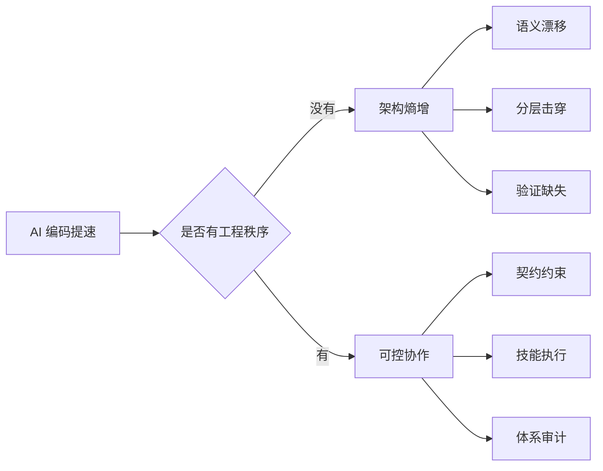
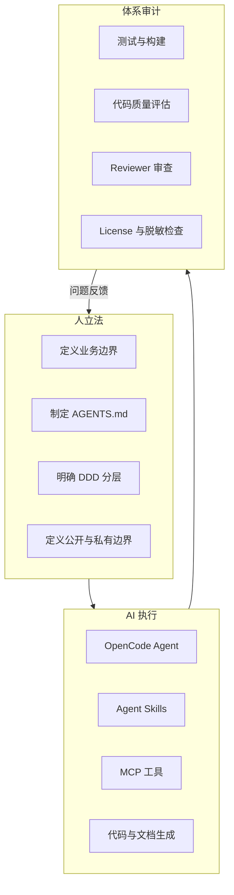
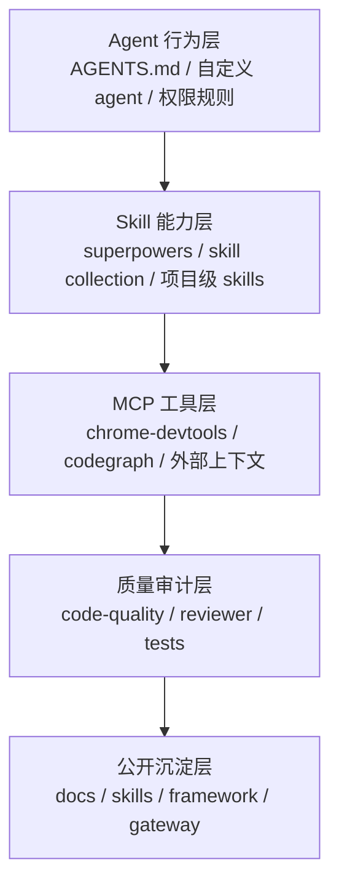
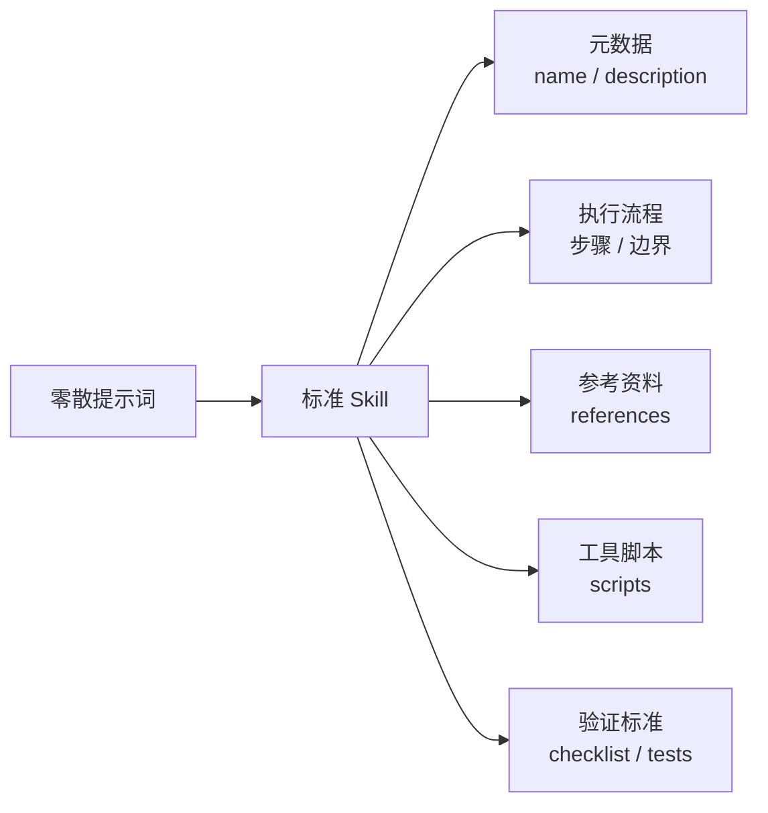
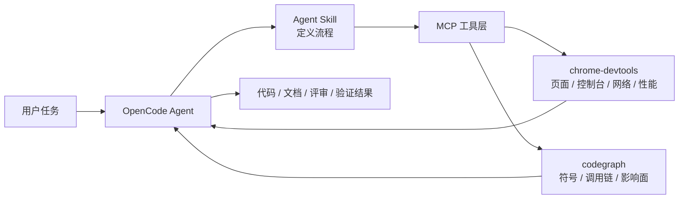
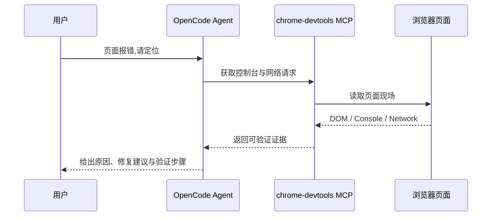
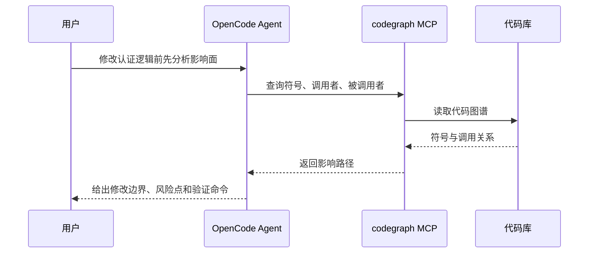
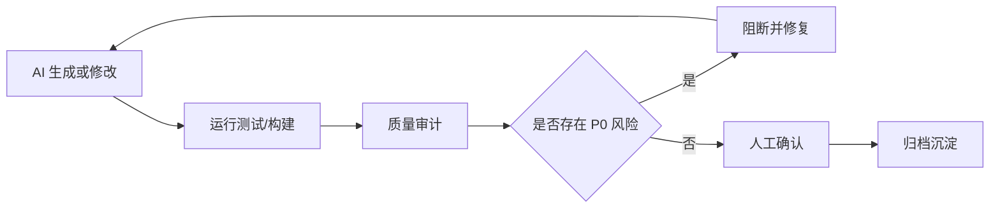
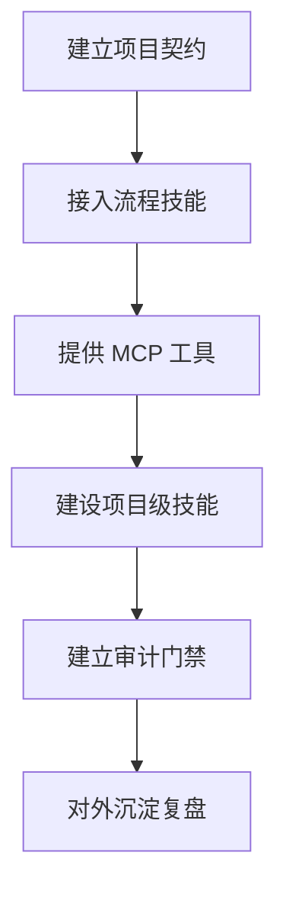

# OpenCode 开源技能与 MCP 工程实践

> **阅读对象**:架构师、技术负责人、AI Agent 工程化实践者、开源社区读者
> **关联阅读**:[OpenCode 全体系深度解析](./OpenCode全体系深度解析.md) · [Agent Skills 实践指南](./AgentSkills实践指南.md) · [人机协同开发流程](../0xA0_实践方法/人机协同开发流程.md)
>
> 本文回答一个问题:如何把 OpenCode、开源 Skills、MCP 工具和项目工程契约组织成一套可约束、可执行、可审计的 AI 工程环境。


## 1. 问题:AI 编码不是慢,而是容易失控

AI 编码已经足够快。真正的问题不是“能不能生成”,而是“生成是否仍在系统边界内”。

当团队只追求提效,却没有给 AI 明确架构边界、行为约束和验证链路时,AI 会把速度变成新的熵增来源。

| 风险 | 表现 | 后果 |
| --- | --- | --- |
| 领域语义丢失 | 用通用名词覆盖业务语言 | 限界上下文被抹平,代码能跑但不可维护 |
| 架构纪律失守 | 绕过分层、依赖和模块边界 | 短期交付变快,长期改动成本上升 |
| 审计链路断裂 | 只给结果,不留约束、来源和验证证据 | 问题难复盘,责任难归因,团队难复制 |



因此,AI 工程化的核心不是“多装几个工具”,而是建立一套能让工具、技能和模型都服从工程秩序的协作体系。

> 开源技能解决的是“AI 能做什么”,工程治理解决的是“AI 应该在什么边界内做”。


## 2. 原则:人立法,AI 执行,体系审计

ArchAIHarness 的基本立场是:

```text
人立法  →  AI 执行  →  体系审计
```

这不是口号,而是工程分工。



人负责定义秩序。这里的“法”不是抽象原则,而是可被 AI 读取和执行的工程契约:README 说明项目目标、模块结构和验证命令;`AGENTS.md` 说明 AI 的角色、边界、分层规则、禁止事项和输出格式;质量门禁定义 P0 风险、测试要求和验收条件。

AI 负责在边界内执行。OpenCode 提供 agent、skill、tool、MCP 的组织方式,让 AI 不只是“聊天生成”,而是能读取项目契约、加载匹配技能、调用 MCP 获取上下文,再按步骤输出代码、文档、评审意见或验证结果。

体系负责审计。审计不是事后挑错,而是让每次 AI 产物都有来源、有约束、有验证、有归因。没有审计,AI 只是“看似完成”;有审计,AI 才能进入团队研发体系。


## 3. 方案:OpenCode 环境的五层能力结构

一套可落地的 OpenCode AI 工程环境,可以拆成五层。



| 层级 | 解决的问题 | 典型能力 |
| --- | --- | --- |
| Agent 行为层 | AI 应该按什么身份和边界工作 | `AGENTS.md`、自定义 agent、权限规则 |
| Skill 能力层 | AI 应该按什么流程完成任务 | `superpowers`、开源技能集合、项目级 skills |
| MCP 工具层 | AI 如何读取真实上下文 | `chrome-devtools-mcp`、`codegraph`、外部工具 |
| 质量审计层 | AI 产物如何被验证 | 测试、构建、code-quality、reviewer |
| 公开沉淀层 | 经验如何复用和传播 | docs、skills、framework、gateway |

这五层是递进关系:没有行为层,AI 没有边界;没有技能层,AI 缺少稳定流程;没有 MCP 层,AI 只能猜上下文;没有审计层,AI 产物不可托底;没有沉淀层,团队经验无法复制。


## 4. 技能层:把提示词升级为工程能力

很多人把 Skill 理解成“提示词集合”。这不够。Agent Skill 更像一个可安装、可版本管理、可审查的能力单元。它把触发条件、执行流程、参考资料和验证方式封装起来,让 AI 在复杂任务中少跳步、少臆断、少自由发挥。



建议先引入通用过程技能,再建设项目级技能。

| 技能方向 | 解决的问题 |
| --- | --- |
| 需求澄清 | 避免需求不清时直接实现 |
| 系统化调试 | 避免猜测式修 Bug |
| 写计划 / 执行计划 | 把复杂任务拆成可验证步骤 |
| 完成前验证 | 避免未验证就声称完成 |
| 代码审查 | 把反馈处理和质量门禁制度化 |
| 代码质量评估 | 把项目契约转为可执行审计流程 |


## 5. MCP 层:让 AI 从猜上下文变成读上下文

MCP 的价值是把外部工具和上下文标准化接入 AI 工作流。在工程实践中,建议优先提供两个 MCP 能力:

1. `chrome-devtools-mcp`:让 AI 读取浏览器现场。
2. `codegraph`:让 AI 读取代码结构和调用关系。



`chrome-devtools-mcp` 适合前端页面调试、控制台错误分析、网络请求检查、页面截图和交互验收。它让“页面有问题”从口述变成证据。



`codegraph` 适合理解陌生代码库、变更前做影响面分析、查找符号和调用链、重构前检查依赖方向。它让“AI 看代码”从局部文件阅读变成结构化理解。



MCP 不是越多越好。每接入一个 MCP,都要回答:它解决什么问题、能访问什么资源、是否允许写入、输出如何验证。MCP 是上下文与工具协议层,不是业务规则层。业务规则仍然必须由 `AGENTS.md`、设计文档和质量门禁定义。


## 6. 审计层:让 AI 产物进入可检查链路

质量审计不是“最后打个分”,而是把工程契约转化为可执行检查流程。



一个有效的 AI 质量审计流程至少读取项目 README、`AGENTS.md`、代码配置、测试和构建结果。审计输出应明确架构边界是否被破坏、认证/租户/权限是否被绕过、是否泄露敏感信息、是否缺少验证证据、是否存在 P0 风险。


## 7. 实践步骤:从零搭建一套可审计 OpenCode 环境

下面是一条最小可落地路径。



### 7.1 建立项目工程契约

每个项目至少准备 `README.md` 和 `AGENTS.md`。前者面向人,说明项目目标、模块结构、启动方式和验证命令;后者面向 AI,说明角色、边界、分层规则、禁止事项、测试要求和输出格式。

### 7.2 接入通用过程技能

先接入能约束流程的技能,例如需求澄清、系统化调试、写计划、执行计划、完成前验证和代码审查。目标不是增加“花活”,而是减少 AI 跳步和臆断。

### 7.3 提供 MCP 工具

优先提供浏览器现场读取和代码结构读取两个能力。前者服务前端调试和验收,后者服务代码理解、影响分析和重构审查。

### 7.4 建设项目级 skills

把团队高频任务沉淀为项目级 skills,例如代码质量评估、架构评审、接口评审、发布验收。项目级 skill 应该放在仓库内,接受版本管理和评审。

### 7.5 建立审计门禁

建立固定闭环:

```text
AI 修改 → 测试验证 → 质量审计 → 人工确认 → 归档沉淀
```

没有验证结果,不声称完成。没有来源证据,不输出结论。涉及安全、认证、租户、权限的修改必须重点审查。


## 8. 总结:把开源能力组织成工程秩序

OpenCode、MCP 与 Agent Skills 解决的是不同层面的问题。OpenCode 提供运行环境,Skills 提供任务流程,MCP 提供现场上下文。但这些能力本身不会自动形成工程体系。

真正的分水岭在于:团队是否把它们放进一套稳定秩序中。

这套秩序至少包含四个动作:

1. **先定义边界**:用 README、`AGENTS.md`、DDD 分层和权限规则说明 AI 能做什么、不能做什么。
2. **再组织能力**:用开源 skills 承载通用流程,用项目级 skills 固化团队规则,用 MCP 读取浏览器和代码现场。
3. **再要求证据**:让 AI 在修改前读取上下文,在输出时说明依据,在完成前给出验证结果。
4. **最后形成沉淀**:把有效流程写进 docs,把高频任务沉淀为 skills,把质量问题反哺到工程契约。

因此,这篇文档的结论不是“推荐安装哪些插件”,而是:

> 架构师要做的不是追逐更多 AI 能力,而是把可用能力编排成可执行、可验证、可审计的工程秩序。

当这条链路闭合后,AI 才不只是个人效率工具,而会成为团队工程能力的一部分:

```text
工程契约定义边界
开源技能承载流程
MCP 工具提供证据
质量审计形成闭环
文档沉淀推动演进
```
