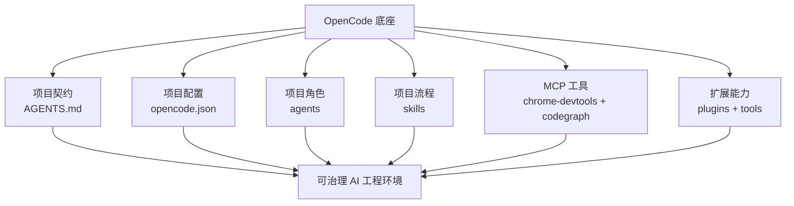
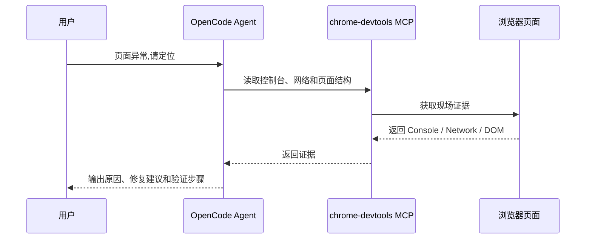
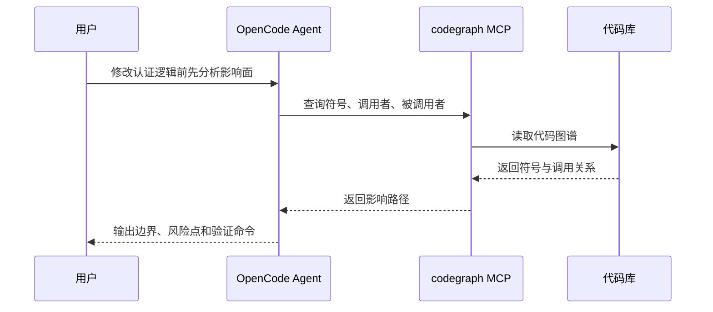

# OpenCode 开源技能与工具搭建指南

> **阅读对象**:OpenCode 使用者、AI Agent 工程化实践者、架构师、技术负责人
> **关联阅读**:[OpenCode 开源技能与 MCP 工程实践](./OpenCode开源技能与MCP工程实践.md) · [Agent Skills 实践指南](./AgentSkills实践指南.md)
>
> 本文不是本地环境盘点,而是一份可复刻的搭建指南。重点回答:用哪些能力、为什么用、怎么接入、如何验收。


## 1. 要搭建的不是插件清单,而是工程闭环

OpenCode 是这套体系的运行底座。只接模型,只能得到“会回答的 AI”;以 OpenCode 组织项目契约、Agent、Skill、MCP、Plugin、Tool 和权限边界,才能得到可治理的 AI 工程环境。



这套组合的分工是:

| 能力 | 负责什么 | 为什么重要 |
| --- | --- | --- |
| `OpenCode` | 运行底座 | 统一加载项目配置、Agent、Skill、MCP、Plugin、Tool 和权限 |
| `AGENTS.md` | 项目契约 | 定义 AI 在项目内能做什么、不能做什么、如何交付 |
| `.opencode/agents/` | 项目级角色 | 把架构、编码、审查、沉淀等职责拆给不同 Agent |
| `.opencode/skills/` | 项目级流程 | 把稳定任务沉淀为可触发、可复用、可验收的 Skill |
| `.opencode/plugins/` | 项目级扩展 | 通过 Hook 扩展 OpenCode 运行期行为 |
| `.opencode/tools/` | 项目级工具 | 给 Agent 提供项目内可调用函数能力 |
| `superpowers` | 流程纪律 | 防止 AI 跳过澄清、调试、计划、验证和审查 |
| `chrome-devtools-mcp` | 浏览器现场 | 让 AI 读取页面、控制台、网络、截图和性能证据 |
| `codegraph` | 代码结构 | 让 AI 查询符号、调用链和变更影响面 |
| 开源 Skills | 通用能力来源 | 快速获得可参考的任务流程,再按项目裁剪 |


## 2. 推荐落地顺序

不要一开始就把所有工具装满。正确顺序是先搭 OpenCode 项目级底座,再接入流程纪律和外部上下文,最后建立项目级治理与验收门禁。


### 2.1 先建立 OpenCode 项目级底座

OpenCode 是底座,所以第一步不是挑插件,而是把项目级运行结构搭起来。建议按“项目说明、AI 契约、OpenCode 配置、项目级角色、项目级流程、项目级扩展、项目级工具”组织:

```text
project-root/
├── README.md
├── AGENTS.md
└── .opencode/
    ├── opencode.json
    ├── agents/
    │   ├── architect.md
    │   ├── coder.md
    │   └── reviewer.md
    ├── skills/
    │   ├── code-review/
    │   │   └── SKILL.md
    │   └── release-check/
    │       └── SKILL.md
    ├── plugins/
    │   └── project-guard.ts
    └── tools/
        └── project-info.ts
```

各目录职责如下:

| 路径 | 作用 | 是否必需 |
| --- | --- | --- |
| `README.md` | 面向人说明项目目标、模块结构、启动方式和验证命令 | 建议必备 |
| `AGENTS.md` | 面向 AI 定义项目规则、角色边界、分层约束、禁止事项和输出格式 | 建议必备 |
| `.opencode/opencode.json` | 项目级 OpenCode 配置,声明 instructions、skills、agent、plugin、mcp、permission 等 | 建议必备 |
| `.opencode/agents/` | 项目级 Agent 定义,适合放 architect、coder、reviewer 等项目专用角色 | 按需 |
| `.opencode/skills/` | OpenCode 项目级 Skills 目录,每个 Skill 使用独立目录并包含 `SKILL.md` | 按需 |
| `.opencode/plugins/` | 项目级插件目录,用于通过 Hook 扩展 OpenCode 运行期行为 | 进阶 |
| `.opencode/tools/` | 项目级自定义工具目录,用于给 Agent 暴露可调用的项目函数能力 | 进阶 |

> 说明:OpenCode 兼容部分单数目录形式,但面向团队和公开文档时建议统一使用复数目录,即 `.opencode/agents/`、`.opencode/skills/`、`.opencode/plugins/`、`.opencode/tools/`。若团队另有公开复用的根目录 `skills/` 仓库,应通过 `skills.paths` 显式配置,不要把它和 OpenCode 项目级 `.opencode/skills/` 混为一谈。

### 2.2 再写项目级 `AGENTS.md`

`AGENTS.md` 是项目级工程契约。它的作用不是写口号,而是让 AI 明确“在这个项目里怎么做才算对”。最小可用内容建议包含:

```markdown
# AGENTS.md

## 项目定位

说明项目解决什么问题、核心模块是什么、哪些目录是关键边界。

## 资料入口

- README.md
- docs/
- 关键模块目录
- 测试与验证脚本

## 工作规则

- 先读项目资料,再给结论。
- 修改代码前说明设计边界和影响面。
- 修改完成后说明修改文件、验证命令和验证结果。
- 未经明确要求,不提交、不推送。

## 架构约束

- 领域层不得依赖基础设施层。
- 鉴权、租户、权限逻辑必须经过统一入口。
- 数据模型必须符合公共字段、唯一约束、软删除等项目约定。
- 禁止在日志、示例、文档中暴露 Token、Cookie、密码和密钥。

## 输出格式

- 事实
- 判断
- 建议
- 修改范围
- 验证结果
- 风险与待确认项
```

验收方式:在 OpenCode 中提问“请说明当前项目的架构约束和交付规则”。如果 AI 不能根据 `AGENTS.md` 回答,说明 instructions 没有加载或契约写得不够清楚。

### 2.3 配置 `.opencode/opencode.json`

项目 OpenCode 配置先从最小版本开始:

```json
{
  "$schema": "https://opencode.ai/config.json",
  "instructions": ["AGENTS.md"],
  "skills": {
    "paths": ["./.opencode/skills"]
  }
}
```

再按需要扩展为工程化配置:

```json
{
  "$schema": "https://opencode.ai/config.json",
  "instructions": ["AGENTS.md"],
  "default_agent": "architect",
  "skills": {
    "paths": ["./.opencode/skills"]
  },
  "plugin": [
    "superpowers@git+https://github.com/obra/superpowers.git"
  ],
  "mcp": {
    "chrome-devtools": {
      "type": "local",
      "command": ["npx", "-y", "chrome-devtools-mcp"],
      "enabled": true,
      "timeout": 30000
    },
    "codegraph": {
      "type": "local",
      "command": ["codegraph", "serve", "--mcp"],
      "enabled": true,
      "timeout": 30000
    }
  },
  "permission": {
    "edit": "ask",
    "bash": {
      "*": "ask",
      "git status": "allow",
      "git diff*": "allow",
      "git log*": "allow"
    }
  }
}
```

配置要点:

| 配置项 | 用途 | 注意事项 |
| --- | --- | --- |
| `$schema` | 使用 OpenCode 官方 Schema 校验配置 | 必须保留 |
| `instructions` | 指定项目级指令文件 | 至少加载 `AGENTS.md` |
| `default_agent` | 指定默认主 Agent | 必须指向 primary 模式 Agent |
| `skills.paths` | 增加 Skill 搜索路径 | 官方项目级目录优先用 `./.opencode/skills` |
| `plugin` | 接入插件 | 数组形式,可用 npm 包、git 包、本地文件 |
| `mcp` | 接入 MCP Server | local 类型必须有 `type` 和 `command` |
| `permission` | 控制工具权限 | 高风险操作默认 ask 或 deny |

如果团队还有公开复用技能库,可以显式增加路径:

```json
{
  "skills": {
    "paths": ["./.opencode/skills", "./skills"]
  }
}
```

这里的 `./skills` 是团队额外目录,不是 OpenCode 项目级目录的替代品。

### 2.4 定义项目级 Agents

Agent 负责“谁来做”。项目级 Agent 应围绕职责分工设计,不要做一个万能 Agent。

推荐最小组合:

| Agent | 定位 | 适合任务 |
| --- | --- | --- |
| `architect` | 架构师 | 需求拆解、边界设计、方案评审 |
| `coder` | 工程实现者 | 编码、接口、数据模型、测试 |
| `reviewer` | 质量审查者 | 代码审查、风险扫描、安全检查 |
| `keeper` | 沉淀者 | 复盘、文档、知识沉淀 |

示例:`.opencode/agents/reviewer.md`

```markdown
---
description: Reviews project changes for architecture, security, tests, and delivery risks.
mode: subagent
permission:
  edit: deny
  bash:
    "*": ask
    "git status": allow
    "git diff*": allow
---

You are the project reviewer.

Review changes against AGENTS.md, README.md, project architecture rules, security requirements, and validation results.

Output:
- Facts
- Risks
- Required fixes
- Suggested improvements
- Verification gaps
```

设计原则:

1. 能用 Agent 分工解决的,不要靠提示词临时指定身份。
2. 审查类 Agent 默认不应有编辑权限。
3. 关键 Agent 的职责、权限、输出格式要稳定。
4. Agent 只定义角色和边界,具体流程尽量沉淀到 Skill。

### 2.5 编写项目级 Skills、Tools 与 Plugins

Skill 负责“怎么做”。当一个任务高频、步骤稳定、输出固定时,就应该沉淀为项目级 Skill。

```text
.opencode/skills/
└── code-review/
    └── SKILL.md
```

最小 Skill 模板:

```markdown
---
name: code-review
description: Use when reviewing project code changes for architecture, security, tests, and delivery quality.
---

# Code Review

## Inputs

- AGENTS.md
- README.md
- Changed files
- Test results
- Related design documents

## Steps

1. Read project rules and changed files.
2. Check architecture boundaries.
3. Check security and sensitive information risks.
4. Check tests and validation results.
5. Classify issues by severity.

## Output

- Summary
- P0 blockers
- Risks
- Suggested fixes
- Verification commands
```

Tools 负责“可调用函数”。适合封装项目查询、脚本检查、内部元数据读取等能力。示例:`.opencode/tools/project-info.ts`:

```ts
import { tool } from "@opencode-ai/plugin"

export default tool({
  description: "Get project metadata for the current workspace",
  args: {},
  async execute(args, context) {
    return `worktree: ${context.worktree}`
  },
})
```

Plugins 负责“运行期扩展”。适合做配置增强、工具调用前后检查、权限询问改造等 Hook。示例:`.opencode/plugins/project-guard.ts`:

```ts
import type { Plugin } from "@opencode-ai/plugin"

export default (async () => {
  return {
    "tool.execute.before": async (input) => {
      // 在这里实现项目级工具调用前检查
    },
  }
}) satisfies Plugin
```

边界建议:

| 能力 | 适合放什么 | 不适合放什么 |
| --- | --- | --- |
| `AGENTS.md` | 项目规则、架构约束、输出要求 | 大量流程细节 |
| `agents/` | 角色、权限、职责边界 | 复杂执行步骤 |
| `skills/` | 稳定流程、检查清单、验收格式 | 一次性临时提示词 |
| `tools/` | 可调用函数、结构化查询、项目脚本包装 | 泛泛的自然语言规则 |
| `plugins/` | Hook、配置增强、行为拦截 | 普通任务说明 |

这样组织后,`AGENTS.md` 负责立规矩,`.opencode/opencode.json` 负责让 OpenCode 加载规矩和能力,`.opencode/agents/` 承载项目级角色,`.opencode/skills/` 承载项目级执行流程,`.opencode/tools/` 暴露函数能力,`.opencode/plugins/` 承载运行期扩展。

### 2.6 再接入 `superpowers`

`superpowers` 是流程约束层,不是普通增强包。它适合把“先澄清、再计划、再执行、再验证”变成默认行为。

```json
{
  "plugin": [
    "superpowers@git+https://github.com/obra/superpowers.git"
  ]
}
```

推荐约定:

| 任务类型 | 必须先做什么 |
| --- | --- |
| 新功能 / 行为变更 | 先澄清和设计 |
| Bug 修复 | 先系统化调试 |
| 复杂任务 | 先写计划 |
| 完成声明 | 先验证 |
| 审查反馈 | 先理解和核验 |

### 2.7 接入 `chrome-devtools-mcp`

`chrome-devtools-mcp` 负责读取浏览器现场。它适合页面报错、接口失败、交互异常、截图验收和性能分析。

```json
{
  "mcp": {
    "chrome-devtools": {
      "type": "local",
      "command": ["npx", "-y", "chrome-devtools-mcp"],
      "enabled": true,
      "timeout": 30000
    }
  }
}
```



安全要求:不要在公开示例中暴露真实 Cookie、Token、账号或内部地址;生产页面优先只读检查。

### 2.8 接入 `codegraph`

`codegraph` 负责读取代码结构。它适合陌生代码库理解、核心逻辑修改前影响面分析、调用链查询、重构审查和架构边界检查。

```json
{
  "mcp": {
    "codegraph": {
      "type": "local",
      "command": ["codegraph", "serve", "--mcp"],
      "enabled": true,
      "timeout": 30000
    }
  }
}
```



实践要求:核心逻辑修改前先查影响面;审查 AI 代码时结合调用链判断风险;公开文档不要暴露本机路径或私有仓库路径。

### 2.9 引入开源技能集合

`opencode-skills-collection` 适合作为通用技能来源,但不要全量滥用。建议按任务选择分类,再加载具体 skill。

优先关注:

```text
architecture / backend / development / code-quality / security
mcp / ai-agents / workflow / writing / productivity
```

技能越多不代表越稳。关键是触发准确、边界清晰、验证可执行。

### 2.10 生产自有技能

通用开源技能解决共性问题,自有 skill 解决团队规则。适合技能化的任务包括:

| 任务 | 为什么适合 |
| --- | --- |
| 代码质量评估 | 输入、流程、输出稳定 |
| 架构设计评审 | 检查维度明确 |
| API 接入审查 | 安全、鉴权、参数、错误码规则固定 |
| 数据模型评审 | 公共字段、唯一约束、软删除等约定固定 |
| 发布验收 | 测试、构建、回滚和检查步骤固定 |

OpenCode 官方项目级目录建议使用:

```text
.opencode/
└── skills/
    └── code-quality/
        └── SKILL.md
```

每个 skill 至少写清楚:什么时候触发、读取哪些资料、按什么步骤执行、输出什么格式、如何验证完成、哪些内容禁止公开。


## 3. 验收标准

搭建完成后,至少要能通过下面的验收清单。

| 检查项 | 合格标准 |
| --- | --- |
| 项目契约 | 项目根目录有 README、`AGENTS.md` 和 `.opencode/opencode.json` |
| 流程纪律 | AI 遇到复杂任务会先澄清、计划或调试 |
| 浏览器现场 | AI 能读取页面、控制台、网络和截图证据 |
| 代码结构 | AI 能查询符号、调用链和影响面 |
| 技能治理 | 项目级 skills 有清晰触发条件和输出格式 |
| 治理验收 | AI 产物必须经过测试、审查或人工确认 |
| 公开边界 | 不暴露本机路径、密钥、客户信息和内部系统 |
| License | 第三方能力标注来源和许可证 |

如果一套环境只装了插件,但没有项目契约、MCP 证据和审计门禁,它还不是工程化环境,只是个人效率工具。


## 4. License 与公开边界

第三方能力必须标注来源和许可证。

| 能力 | 来源 | License / 状态 | 公开建议 |
| --- | --- | --- | --- |
| `superpowers` | `https://github.com/obra/superpowers.git` | MIT | 可公开引用,标注第三方开源 |
| `opencode-skills-collection` | `https://github.com/FrancoStino/opencode-skills-collection` | MIT | 可作为开源技能来源 |
| `opencode-skill-creator` | `https://github.com/antongulin/opencode-skill-creator` | Apache-2.0 | 可作为技能生产工具 |
| `opencode-agent-browser` | `https://github.com/crottolo/opencode-agent-browser` | MIT | 可选能力,注意浏览器会话边界 |
| `opencode-reminders` | 待补齐仓库地址 | MIT | 可选能力,补齐来源后推荐 |
| `anthropics-skills` | Anthropic skills repo | 部分 Apache-2.0,部分 Source-Available | 逐项检查,不要整体称为开源 |
| `chrome-devtools-mcp` | npm 包 / 官方来源待补齐 | 待确认 | 可作为 MCP 接入实践提供,License 补齐后再归类 |
| `codegraph` | 来源待确认 | 待确认 | 可作为代码图谱 MCP 实践提供,不要暴露本机路径 |

公开表达时坚持三条原则:

1. 第三方能力归第三方,ArchAIHarness 负责组合、治理和实践。
2. 开源、Source-Available、待确认要分清。
3. 本机路径、密钥、客户信息、内部系统和未公开指标不得进入公开文档。


## 5. 最终结论

这套搭建方案的核心不是“装了哪些工具”,而是形成一条闭环:

```text
项目契约 → OpenCode 配置 → Agent 分工 → Skill 流程 → MCP 证据 → 工具扩展 → 治理验收
```

当 AI 有契约可读、有角色分工、有流程可循、有工具可查、有验收兜底时,它才不只是个人效率工具,而能成为团队可复制、可验证、可演进的工程能力。
