# Vibe Coding 实践指南

> **阅读对象**:开发者、技术负责人、AI 协作实践者
> **前置阅读**:[人机协同开发流程](../0xA0_实践方法/人机协同开发流程.md) · [团队协作开发指南](../0xA0_实践方法/团队协作开发指南.md)

## 一、核心定义
人与AI共创的编程实践方法论，核心是**AI增强人类**，而非替代人类。


## 二、核心目标

在 AI 辅助 Vibe Coding 中，我们聚焦三大核心：

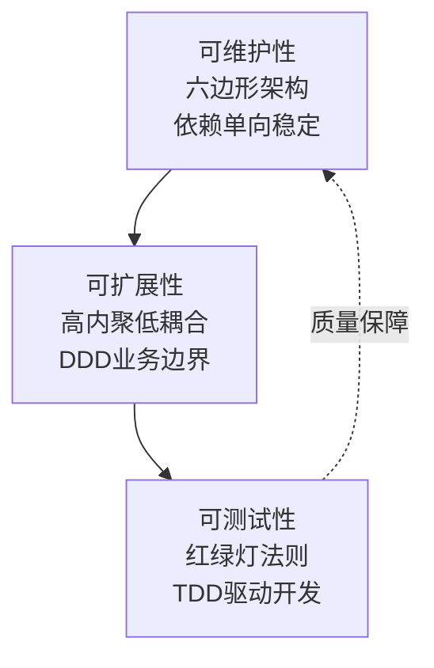
```mermaid
flowchart TB
    M[可维护性<br/>六边形架构<br/>依赖单向稳定]
    S[可扩展性<br/>高内聚低耦合<br/>DDD业务边界]
    T[可测试性<br/>红绿灯法则<br/>TDD驱动开发]
    
    M --> S
    S --> T
    T -.->|质量保障| M
```

### 1. 可维护性

统一代码结构与编码风格，落地六边形架构（Hexagonal Architecture）思想：

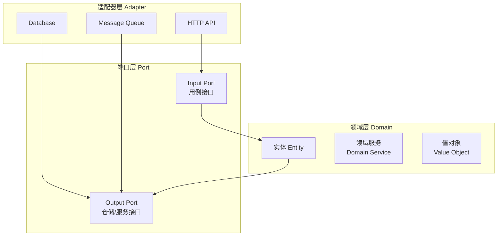
```mermaid
flowchart TB
    subgraph 适配器层 Adapter
        HTTP[HTTP API]
        DB[Database]
        MQ[Message Queue]
    end
    
    subgraph 端口层 Port
        IN[Input Port<br/>用例接口]
        OUT[Output Port<br/>仓储/服务接口]
    end
    
    subgraph 领域层 Domain
        ENT[实体 Entity]
        SERV[领域服务<br/>Domain Service]
        VO[值对象<br/>Value Object]
    end
    
    HTTP --> IN
    DB --> OUT
    MQ --> OUT
    IN --> ENT
    ENT --> OUT
    
    
```

**依赖规则：**
- 领域层（Domain）位于核心，**零框架依赖**
- 外层依赖内层，禁止逆向
- 端口（Port）是领域与外界的契约

> **书籍推荐**：《领域驱动设计》- Eric Evans、《实现领域驱动设计》- Vaughn Vernon

### 2. 可扩展性

遵循高内聚低耦合原则，以 DDD 领域驱动设计思想划分业务边界：

**bounded context 划分示例：**

| 领域 | 职责 | 边界 |
|---|---|---|
| 用户域 | 用户注册、认证、权限 | 用户数据 |
| 订单域 | 订单创建、支付、履约 | 订单生命周期 |
| 库存域 | 库存查询、锁定、扣减 | 库存数据 |
| 通知域 | 消息推送、邮件、短信 | 通知渠道 |

**聚合根设计原则：**
- 每个聚合有唯一聚合根
- 聚合内对象只通过聚合根修改
- 聚合间通过 ID 引用，不直接耦合

> **参考**：《整洁架构》- Robert C. Martin、《重构》- Martin Fowler

### 3. 可测试性

遵循红绿灯法则，以 TDD 测试驱动开发为导向：

**红绿灯验证标准：**

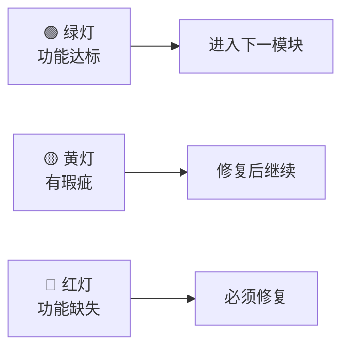
```mermaid
flowchart LR
    G["🟢 绿灯<br/>功能达标"] --> N[进入下一模块]
    Y["🟡 黄灯<br/>有瑕疵"] --> F[修复后继续]
    R["🔴 红灯<br/>功能缺失"] --> M[必须修复]
    
    
```

**测试分层策略：**

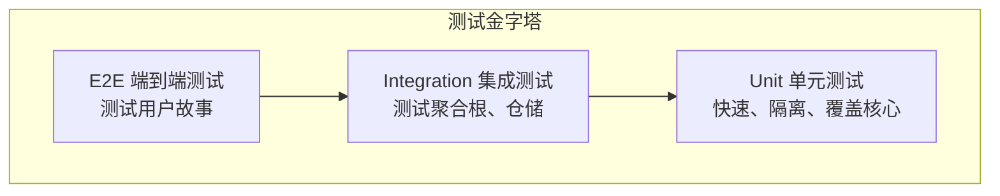
```mermaid
flowchart TB
    subgraph 测试金字塔
        E2E["E2E 端到端测试<br/>测试用户故事"]
        INT["Integration 集成测试<br/>测试聚合根、仓储"]
        UNIT["Unit 单元测试<br/>快速、隔离、覆盖核心"]
    end
    
    E2E --> INT --> UNIT
    
    
```

**测试命名规范：**
```typescript
// 格式：[场景] should [行为] when [条件]
describe('UserService', () => {
  it('should lock account when password is incorrect 3 times', () => { })
  it('should return token when credentials are valid', () => { })
})
```

> **推荐阅读**：《测试驱动开发》- Kent Beck、《修改代码的艺术》- Michael Feathers


## 三、核心三要素

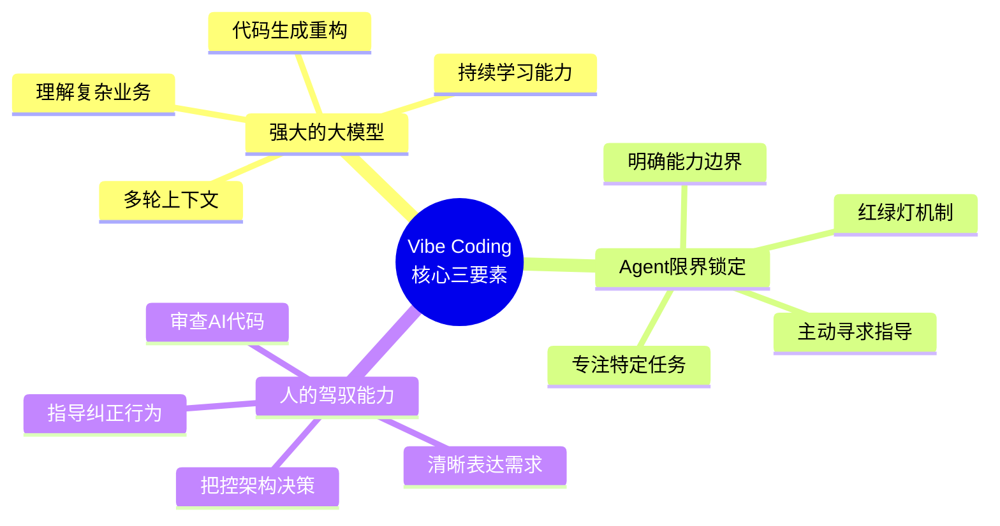
```mermaid
mindmap
  root((Vibe Coding
  核心三要素))
    强大的大模型
      理解复杂业务
      多轮上下文
      代码生成重构
      持续学习能力
    Agent限界锁定
      明确能力边界
      专注特定任务
      红绿灯机制
      主动寻求指导
    人的驾驭能力
      清晰表达需求
      审查AI代码
      指导纠正行为
      把控架构决策
```

### 1. 强大的大模型
- 重要性
  - 理解复杂业务需求与技术细节
  - 支持多轮对话与上下文理解
  - 可代码生成、重构、解释
  - 具备持续学习能力
- 实践要点
  - 选择适配模型（GPT‑4、Claude 等）
  - 充分利用上下文窗口，提供完整代码库背景
  - 迭代对话细化需求，避免一次性指令
  - 做好 Prompt 工程，提升理解准确度

### 2. Agent 限界锁定能力
- 定义
  - 明确自身能力边界
  - 专注特定任务范围
  - 适时寻求人类指导
  - 避免过度泛化与越界
- 实践要点
  - 清晰定义 Agent 职责边界
  - 用技能（Skills）系统组织行为
  - 建立"红绿灯"机制：自主执行 → 寻求确认 → 等待指令
  - 用 Todo List 追踪任务
- 示例
  - Domain 层零框架依赖，不引入框架注解
  - Agent 主动询问类归属层级

### 3. 人的驾驭能力
- 核心能力
  - 自然语言清晰表达需求
  - 理解与审查 AI 代码
  - 指导与纠正 AI 行为
  - 把控项目方向与架构决策
- 实践要点
  - 先描述需求，再让 AI 生成
  - 建立评审习惯，不盲目接受输出
  - 培养架构思维，指导技术选型
  - 用 Git、测试、Linter 验证输出


## 四、三大实践模式

### 模式一：需求驱动开发
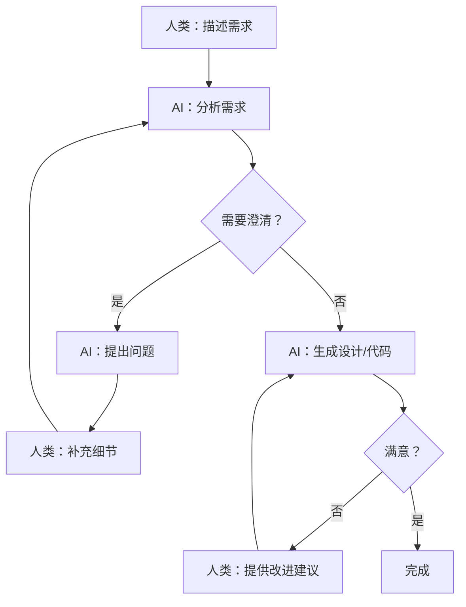
```mermaid
flowchart TD
    A[人类：描述需求] --> B[AI：分析需求]
    B --> C{需要澄清？}
    C -->|是| D[AI：提出问题]
    D --> E[人类：补充细节]
    E --> B
    C -->|否| F[AI：生成设计/代码]
    F --> G{满意？}
    G -->|否| H[人类：提供改进建议]
    H --> F
    G -->|是| I[完成]
```

### 模式二：代码协作模式
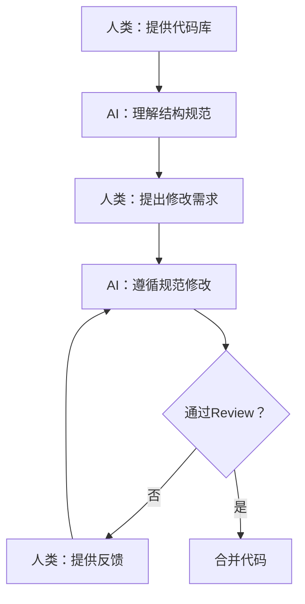
```mermaid
flowchart TD
    A[人类：提供代码库] --> B[AI：理解结构规范]
    B --> C[人类：提出修改需求]
    C --> D[AI：遵循规范修改]
    D --> E{通过Review？}
    E -->|否| F[人类：提供反馈]
    F --> D
    E -->|是| G[合并代码]
```

### 模式三：调试共创模式
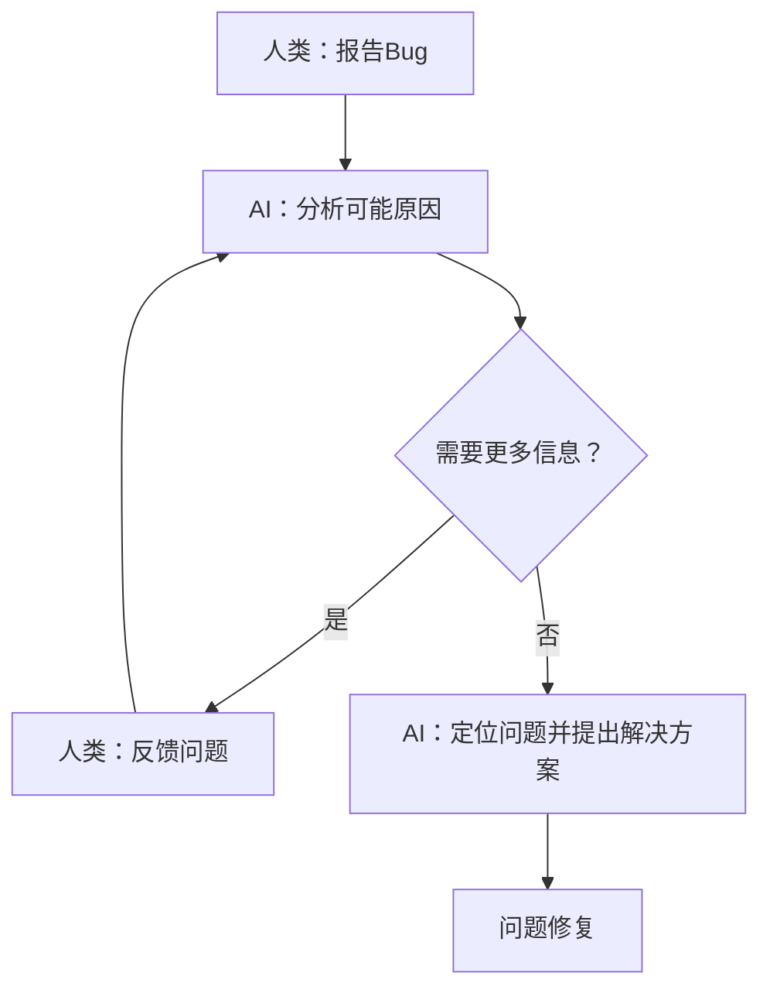
```mermaid
flowchart TD
    A[人类：报告Bug] --> B[AI：分析可能原因]
    B --> C{需要更多信息？}
    C -->|是| D[人类：反馈问题]
    D --> B
    C -->|否| E[AI：定位问题并提出解决方案]
    E --> F[问题修复]
```


## 五、四大工作原则

### 原则一：渐进式披露
不将复杂、模糊的需求一次性抛给AI，不幻想AI能从零到一完整理解并独立实现。

若从零到一搭建业务，可借助脑暴技能，与AI共同探索分析、挖掘业务需求，让AI梳理出需求文档，再做方案设计，然后定实施计划，逐步交由AI执行，由人去验证，直到成果符合预期、满意为止。

若是已有项目，建议先让AI梳理理解现有项目的业务规则、规范、约束等并形成文档，经人为确认后，再用自然语言描述新需求，与AI共同探索技术实现、制定方案，随后逐步交由AI执行实施，人负责验证，直至结果符合预期。

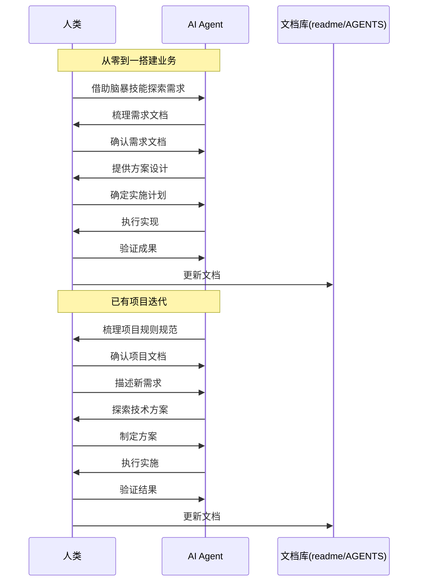
```mermaid
sequenceDiagram
    participant H as 人类
    participant AI as AI Agent
    participant BK as 文档库(readme/AGENTS)
    
    Note over H,AI: 从零到一搭建业务
    H->>AI: 借助脑暴技能探索需求
    AI->>H: 梳理需求文档
    H->>AI: 确认需求文档
    AI->>H: 提供方案设计
    H->>AI: 确定实施计划
    AI->>H: 执行实现
    H->>AI: 验证成果
    H->>BK: 更新文档
    
    Note over H,AI: 已有项目迭代
    AI->>H: 梳理项目规则规范
    H->>AI: 确认项目文档
    H->>AI: 描述新需求
    AI->>H: 探索技术方案
    H->>AI: 制定方案
    AI->>H: 执行实施
    H->>AI: 验证结果
    H->>BK: 更新文档
```

> **实践技巧**：过程中必须维护两份核心文档：一份是 `readme.md`，面向维护人员，清晰说明项目结构、功能、规范与代码风格，便于快速理解项目；另一份是 `AGENTS.md`，专门面向AI，明确业务内容、架构、模块设计，界定AI可做、不可做以及该如何做，形成强约束规范。同时在迭代过程中，持续让AI总结更新 `readme.md` 与 `AGENTS.md`，确保文档内容与项目实际代码状态始终保持一致。
>
> **注意事项**：在 `AGENTS.md` 构建上需严格控制文档体积，避免内容过度膨胀影响AI上下文长度与理解效率。合理做法是按结构化方式将AGENTS相关内容拆分为多份文档，在总文档中进行引用，让AI在实施过程中以渐进式披露的方式读取对应模块文档。

### 原则二：需求精准描述
不使用泛化、模糊的语言描述任务需求，避免AI因信息不足产生理解偏差，导致输出偏离预期。

推荐采用DDD领域驱动设计的思想进行需求拆解与梳理。

若为全新功能开发，需围绕业务领域划分清晰界限，明确系统包含哪些模块、各模块职责边界、核心业务流程、关键规则与约束，通过持续对话引导AI逐步挖掘细节，确保需求完整、清晰、无二义性。

若为现有功能迭代或问题修复，需先明确当前表现、期望结果、涉及范围、影响模块，再与AI共同分析原因、定位逻辑，逐步细化实现方式与验收标准，避免只提出笼统目标而缺少具体指向。

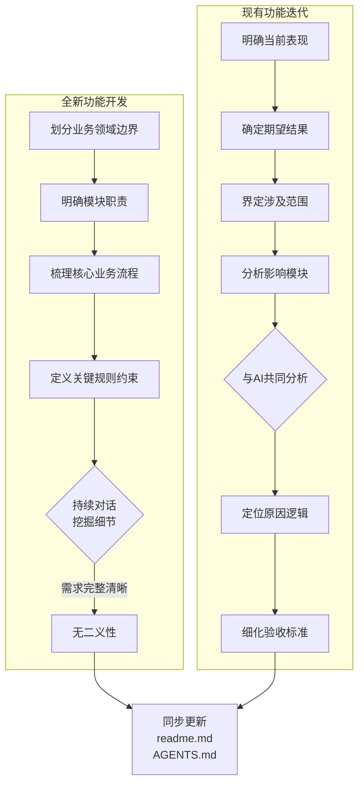
```mermaid
flowchart TD
    subgraph 全新功能开发
        A1[划分业务领域边界] --> A2[明确模块职责]
        A2 --> A3[梳理核心业务流程]
        A3 --> A4[定义关键规则约束]
        A4 --> A5{持续对话<br/>挖掘细节}
        A5 -->|需求完整清晰| A6[无二义性]
    end
    
    subgraph 现有功能迭代
        B1[明确当前表现] --> B2[确定期望结果]
        B2 --> B3[界定涉及范围]
        B3 --> B4[分析影响模块]
        B4 --> B5{与AI共同分析}
        B5 --> B6[定位原因逻辑]
        B6 --> B7[细化验收标准]
    end
    
    A6 --> UPDATE[同步更新<br/>readme.md<br/>AGENTS.md]
    B7 --> UPDATE
```

> **实践技巧**：在需求沟通过程中，持续将明确后的要点同步更新至 `readme.md` 与 `AGENTS.md`，形成可追溯、可复用的需求基线，避免反复沟通、反复返工。
>
> **注意事项**：需求描述要保持一致口径，避免前后矛盾、术语混乱；同时控制单次需求颗粒度，不一次性塞入过多无关场景，确保AI始终聚焦当前任务，不被冗余信息干扰理解。

### 原则三：人工主动验证
不盲目信任AI的直接输出，在整个Vibe Coding过程中，人必须始终承担最终验证、把关与纠偏的责任。

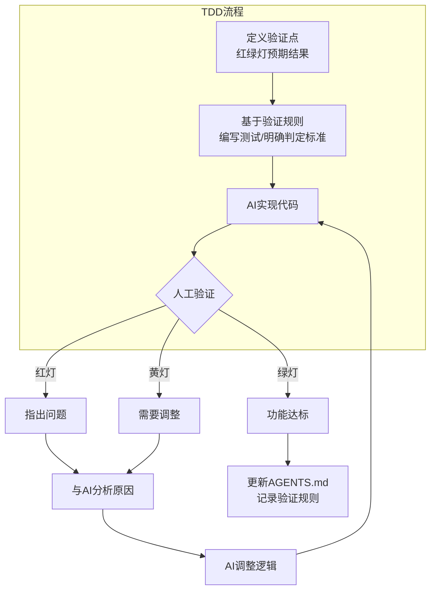
```mermaid
flowchart TD
    subgraph TDD流程
        A1[定义验证点<br/>红绿灯预期结果] --> A2[基于验证规则<br/>编写测试/明确判定标准]
        A2 --> A3[AI实现代码]
        A3 --> A4{人工验证}
    end
    
    A4 -->|绿灯| E[功能达标]
    A4 -->|红灯| F[指出问题]
    A4 -->|黄灯| G[需要调整]
    
    F --> H[与AI分析原因]
    G --> H
    H --> I[AI调整逻辑]
    I --> A3
    
    E --> J[更新AGENTS.md<br/>记录验证规则]
```

推荐采用红绿灯法则结合TDD测试驱动开发的思路：先引导AI梳理出当前任务的验证点、预期表现、判定标准，形成明确的"红绿灯"预期结果；再基于这套验证规则进行代码实现，避免无目标开发。

实现完成后，由人工对照红绿灯规则逐一验证执行结果，判断是否达标。对不通过的部分，明确指出问题并与AI调整逻辑、修正实现，反复迭代，直到最终功能完全符合预期。

> **实践技巧**：将验证用例、红绿灯判定标准同步沉淀到 `AGENTS.md` 中，作为AI后续迭代的统一校验依据，同时在 `readme.md` 中记录核心验证流程，方便团队协作与回溯。验证执行动作也可交由AI完成，人只需清晰描述校验规则，重点参与结果判断与最终决策。
>
> **注意事项**：验证需聚焦业务规则与边界场景，不局限于表面功能；避免只看运行结果而忽略代码规范、架构一致性与项目约束，确保AI产出既可用又合规。

### 原则四：善用 Agent 技能与版本管理
充分利用社区提供的各类 Agent skill 技能，借助成熟能力更高效地驾驭 AI 执行任务。同时结合 Git 管理项目迭代信息，通过提交记录留存变更历史，让 AI 清晰理解业务演进过程，也能有效减少上下文膨胀问题。

在 Vibe Coding 模式下，要清晰认知角色定位：传统开发侧重解决问题，而新时代人的核心职责是**发现问题、清晰描述问题，并完成最终验证与决策**。

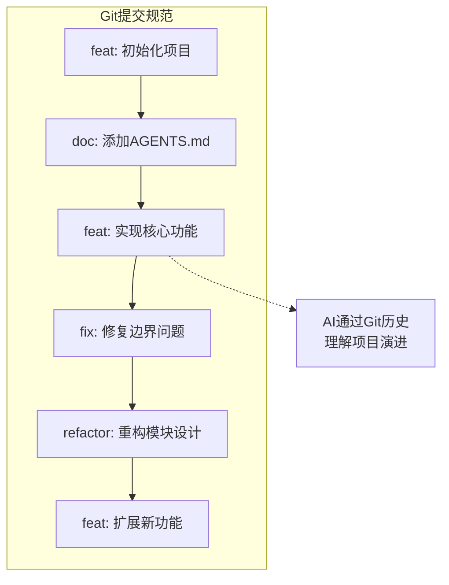
```mermaid
flowchart TD
    subgraph Git提交规范
        direction TB
        C1[feat: 初始化项目]
        C2[doc: 添加AGENTS.md]
        C3[feat: 实现核心功能]
        C4[fix: 修复边界问题]
        C5[refactor: 重构模块设计]
        C6[feat: 扩展新功能]
    end
    
    C1 --> C2 --> C3 --> C4 --> C5 --> C6
    
    N[AI通过Git历史<br/>理解项目演进]
    C3 -.-> N
```

> **使用技巧**：日常开发中养成高频、小步提交的习惯，把关键变更、需求调整、功能实现都记录在 Git 日志中。在与 AI 协作时，可直接让其通过版本历史理解项目变化，不再需要重复传递大量历史信息，既保证协作连贯性，又控制上下文长度，提升响应效率。
>
> **注意事项**：Git 提交信息建议交由 AI 按照规范统一撰写，而非人工手动总结。AI 对代码变更的细节理解更准确，能保证提交信息更规范、完整，避免因人为主观描述不准而影响后续协作与追溯。


## 六、工具与实践

### 1. OpenCode - AI 编程代理

> 官网：https://opencode.ai | GitHub：https://github.com/anomalyco/opencode

OpenCode 是一款开源 AI coding agent，作为 Vibe Coding 的核心工具平台：

| 特性 | 说明 |
|---|---|
| 多模型支持 | 支持 Claude、GPT、Gemini 及 75+ LLM 提供商 |
| 多会话并行 | 可在同一个项目启动多个 agent 并行工作 |
| 共享链接 | 分享会话链接便于协作与复现 |
| LSP 自动启用 | 自动加载项目对应的语言服务 |
| 隐私优先 | 不存储代码与上下文数据 |
| 多端支持 | 终端 / 桌面应用 / IDE 扩展 |

#### 快速上手

```bash
# 安装（Linux/macOS）
curl -fsSL https://opencode.ai/install | bash

# 或使用包管理器
npm install -g opencode
brew install opencode
```

```bash
# 进入项目目录，启动交互式对话
opencode

# 指定模型
opencode --model claude

# 查看帮助
opencode --help
```

> **使用建议**：在项目中创建 `AGENTS.md` 规范 AI 行为边界，OpenCode 会自动遵循。

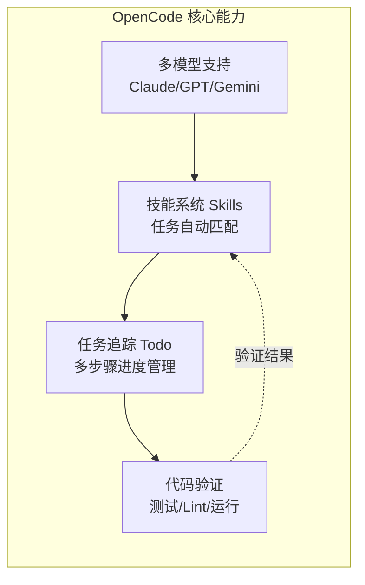
```mermaid
flowchart TB
    subgraph OpenCode 核心能力
        direction TB
        M[多模型支持<br/>Claude/GPT/Gemini]
        S[技能系统 Skills<br/>任务自动匹配]
        T[任务追踪 Todo<br/>多步骤进度管理]
        V[代码验证<br/>测试/Lint/运行]
    end
    
    M --> S
    S --> T
    T --> V
    V -.->|验证结果| S
```

> **使用建议**：在项目中创建 `AGENTS.md` 规范 AI 行为边界，OpenCode 会自动遵循。

### 2. AGENTS.md 模板

面向 AI 的行为规范文档，界定可做、不可做、如何做：

```markdown
# AGENTS.md

## 项目概述
[项目名称、技术栈、核心功能]

## 架构约束
- 遵循六边形架构，Domain 层零框架依赖
- 依赖方向：外层 → 内层，禁止逆向依赖

## 模块划分
| 模块 | 职责 | 边界 |
|---|---|---|
| domain | 核心业务逻辑 | 无框架代码 |
| application | 用例编排 | 调用 domain |
| infrastructure | 外部适配 | 实现 port 接口 |

## 代码规范
- 类命名：[类型] + [业务含义]
- 方法命名：动词 + 名词，清晰表达意图
- 禁止：魔法数字、未解释的硬编码

## 验证规则
[功能点1]：预期结果、验证方式
[功能点2]：预期结果、验证方式

## 禁止事项
- 不引入未讨论的依赖
- 不修改跨模块边界逻辑
- 不跳过代码审查直接提交
```

### 3. 技能（Skills）系统

强制 AI 遵循特定工作流程的机制，任务匹配时必须加载执行。

| 技能 | 用途 | 触发条件 |
|---|---|---|
| brainstorming | 需求探索 | 任务模糊、从零搭建、业务边界不清晰 |
| writing-plans | 方案规划 | 需求明确但实现路径复杂 |
| test-driven-development | 测试驱动 | 功能实现、重构、Bug修复 |
| systematic-debugging | 系统调试 | 遇到Bug、异常、测试失败 |
| verification-before-completion | 完成验证 | 代码实现后、提交前 |
| requesting-code-review | 审查协作 | 重要功能、多人协作 |

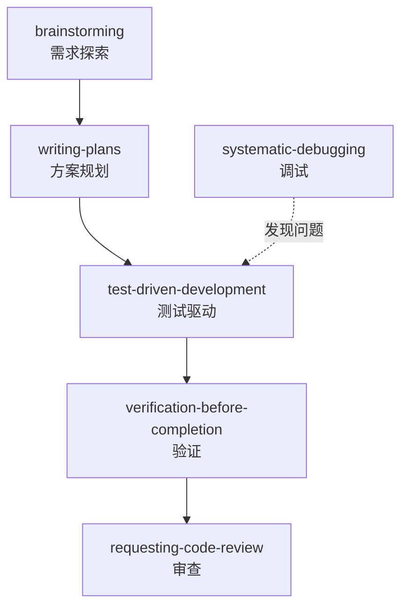
```mermaid
flowchart TD
    B[ brainstorming<br>需求探索 ] --> P[ writing-plans<br>方案规划 ]
    P --> T[ test-driven-development<br>测试驱动 ]
    T --> V[ verification-before-completion<br>验证 ]
    V --> R[ requesting-code-review<br>审查 ]
    
    D[ systematic-debugging<br>调试 ] -.->|发现问题| T
```

> **技能组合**：
> - 新功能：`brainstorming` → `writing-plans` → `test-driven-development` → `verification-before-completion`
> - Bug修复：`systematic-debugging` → `test-driven-development` → `verification-before-completion`

### 4. 常见陷阱

Vibe Coding 新手容易犯的错误：

| 陷阱 | 表现 | 后果 | 正确做法 |
|---|---|---|---|
| 一次性丢需求 | 把完整功能一次性描述给AI | AI理解偏差，输出偏离预期 | 渐进式披露，分步验证 |
| 盲目信任AI | 不审查直接接受输出 | 引入Bug、架构破坏 | 人工验证每个节点 |
| 跳过文档维护 | 不更新readme/AGENTS | 上下文膨胀，理解断层 | 每次迭代同步文档 |
| 模糊需求 | "优化一下这个功能" | AI自由发挥，结果不可控 | 明确具体指向 |
| 忽略Git提交 | 大功能一次性提交 | AI无法理解演进历史 | 小步高频提交 |
| 不使用技能 | 直接让AI写代码 | 流程混乱，质量不稳 | 匹配技能系统执行 |

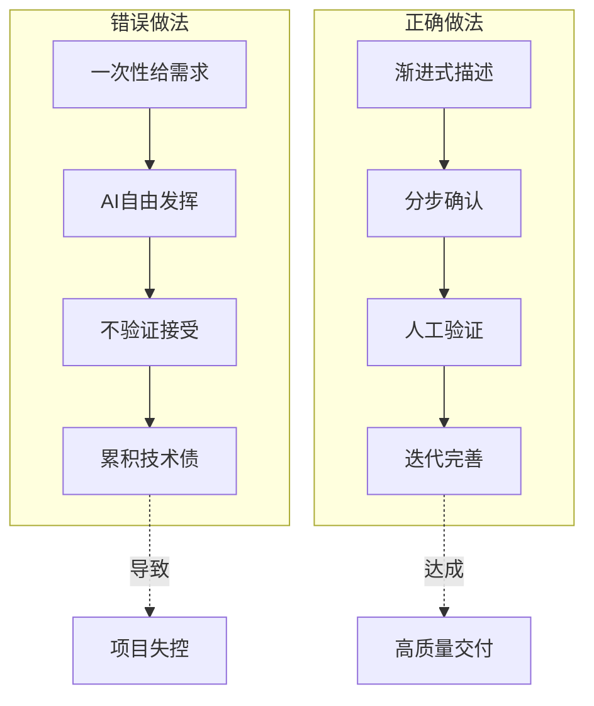
```mermaid
flowchart TD
    subgraph 错误做法
        A1[一次性给需求] --> A2[AI自由发挥]
        A2 --> A3[不验证接受]
        A3 --> A4[累积技术债]
    end
    
    subgraph 正确做法
        B1[渐进式描述] --> B2[分步确认]
        B2 --> B3[人工验证]
        B3 --> B4[迭代完善]
    end
    
    A4 -.->|导致| X[项目失控]
    B4 -.->|达成| Y[高质量交付]
```

**量化效果参考：**

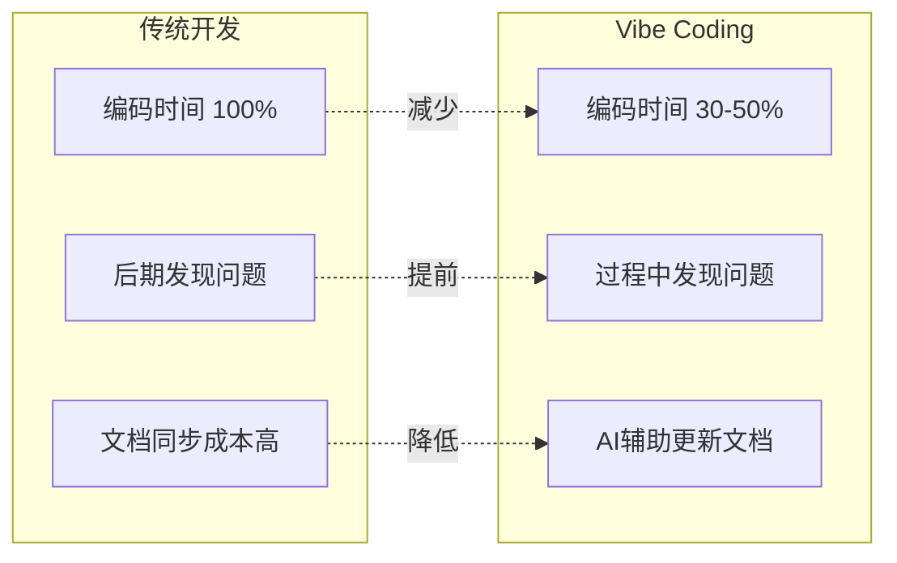
```mermaid
flowchart LR
    subgraph 传统开发
        T1[编码时间 100%]
        T2[后期发现问题]
        T3[文档同步成本高]
    end
    
    subgraph Vibe Coding
        V1[编码时间 30-50%]
        V2[过程中发现问题]
        V3[AI辅助更新文档]
    end
    
    T1 -.->|减少| V1
    T2 -.->|提前| V2
    T3 -.->|降低| V3
    
    
```

> **数据来源**：基于多个团队实践的定性总结，实际情况因项目复杂度、团队成熟度而异。

### 5. 任务追踪（Todo List）

使用 Todo List 跟踪多步骤任务进度，确保执行与验证不遗漏。

> **使用示例**：
> - 创建待办列表记录功能点
> - 标记完成状态
> - 在验证阶段逐项确认

### 6. 代码验证流程

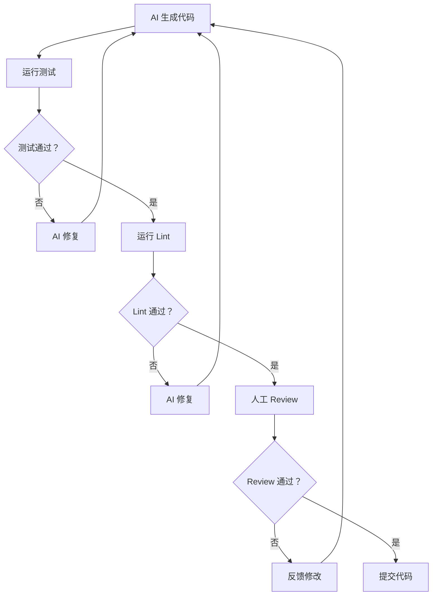
```mermaid
flowchart TD
    A[AI 生成代码] --> B[运行测试]
    B --> C{测试通过？}
    C -->|否| E[AI 修复]
    C -->|是| D[运行 Lint]
    E --> A
    D --> F{Lint 通过？}
    F -->|否| H[AI 修复]
    F -->|是| G[人工 Review]
    H --> A
    G --> I{Review 通过？}
    I -->|否| K[反馈修改]
    I -->|是| J[提交代码]
    K --> A
```


## 七、工作案例

以"实现用户登录功能"为例，演示完整的 Vibe Coding 工作流：

### 1. 项目初始化

```bash
# 创建项目
mkdir user-service && cd user-service
opencode

# 初始化 AGENTS.md
> 帮我初始化项目，使用六边形架构，TypeScript + NestJS
```

### 2. 需求探索（brainstorming）

```
> 我需要实现用户登录功能，包括：
> - 用户名密码登录
> - 登录失败锁定
> - 记住登录状态
>
> 帮我梳理需求，划分领域边界
```

AI 梳理后确认：用户领域、认证领域、会话领域。

### 3. 方案设计（writing-plans）

```
> 基于需求，帮我制定实现计划
```

AI 输出：
```markdown
## 实现计划

### Phase 1: 领域层
- [ ] User 实体（id, username, passwordHash, locked）
- [ ] UserRepository port 接口
- [ ] 登录验证领域服务

### Phase 2: 应用层
- [ ] LoginUseCase
- [ ] 登录失败锁定逻辑

### Phase 3: 基础设施
- [ ] PrismaUserRepository 实现
- [ ] JWT Token 生成

### 验证规则
- [ ] 正确密码 → 返回 Token
- [ ] 错误3次 → 账户锁定
- [ ] 锁定账户 → 拒绝登录
```

### 4. 测试驱动（test-driven-development）

```
> 从登录验证领域服务开始，先写测试
```

AI 生成测试 → 人工确认验证规则 → AI 实现代码 → 循环直到通过

### 5. 迭代验证

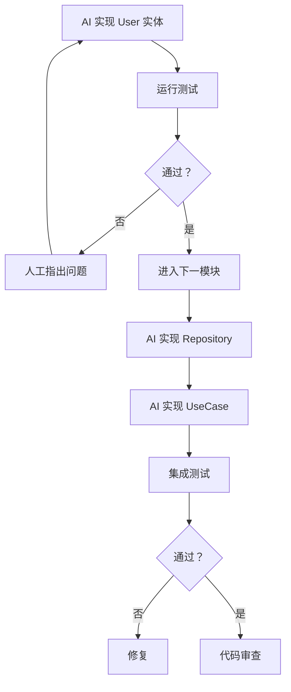
```mermaid
flowchart TD
    A[AI 实现 User 实体] --> B[运行测试]
    B --> C{通过？}
    C -->|否| D[人工指出问题]
    D --> A
    C -->|是| E[进入下一模块]
    E --> F[AI 实现 Repository]
    F --> G[AI 实现 UseCase]
    G --> H[集成测试]
    H --> I{通过？}
    I -->|否| J[修复]
    I -->|是| K[代码审查]
```

### 6. 文档同步

```
> 更新 readme.md 和 AGENTS.md，反映当前状态
```

---

## 八、Checklist

### 项目启动检查

- [ ] `opencode` 进入项目目录
- [ ] 创建 `AGENTS.md`，明确架构约束
- [ ] 创建 `readme.md`，说明项目结构
- [ ] 确认使用的模型和 Token 限制

### 需求沟通检查

- [ ] 需求已明确边界
- [ ] 已使用 brainstorming 探索
- [ ] 已使用 writing-plans 制定计划
- [ ] 验证规则已定义（红绿灯）

### 代码实现检查

- [ ] 先写测试，后实现
- [ ] 测试通过后再下一模块
- [ ] 遵循 AGENTS.md 中的架构约束
- [ ] 命名清晰，无魔法数字

### 提交前检查

- [ ] 所有测试通过
- [ ] Lint 检查通过
- [ ] 代码已审查
- [ ] 文档已更新
- [ ] Git 提交信息规范

---

## 九、FAQ


```mermaid
flowchart TD
    subgraph Q1["Q: AI 输出不符合预期"]
        A1[检查需求描述] --> A2[提供更多上下文]
        A2 --> A3[让AI先解释理解]
        A3 --> A4[分步骤引导]
    end
    
    subgraph Q2["Q: 如何控制 AI 质量"]
        B1[明确代码规范] --> B2[设定验证规则]
        B2 --> B3[强制使用技能]
        B3 --> B4[人工审查节点]
    end
    
    subgraph Q3["Q: AGENTS.md 太大"]
        C1[按模块拆分] --> C2[总文档引用子文档]
        C2 --> C3[渐进式披露]
    end
    
    subgraph Q4["Q: 处理复杂业务"]
        D1[使用brainstorming] --> D2[划分领域边界]
        D2 --> D3[分模块实现]
        D3 --> D4[保持依赖单向]
    end
    
    subgraph Q5["Q: Git 提交怎么写"]
        E1[交给AI自动生成]
    end
```

**AI 对代码变更理解更准确，生成的提交信息更规范。**

---

## 十、工具对比

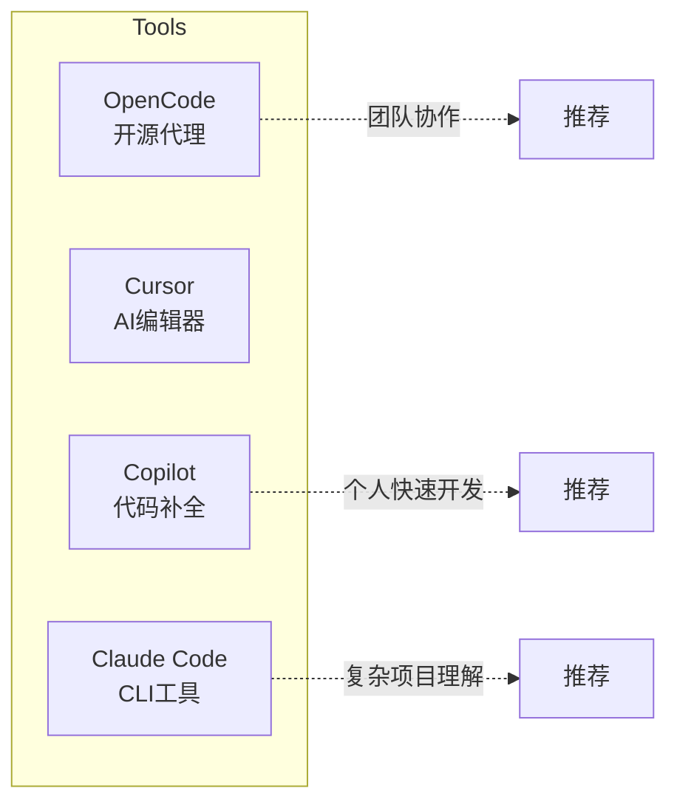
```mermaid
flowchart LR
    subgraph Tools
        OC[OpenCode<br/>开源代理]
        CU[Cursor<br/>AI编辑器]
        CP[Copilot<br/>代码补全]
        CC[Claude Code<br/>CLI工具]
    end
    
    OC -.->|"团队协作"| REC1[推荐]
    CP -.->|"个人快速开发"| REC2[推荐]
    CC -.->|"复杂项目理解"| REC3[推荐]
    
    
```

| 工具 | 定位 | 优势 | 适用场景 |
|---|---|---|---|
| **OpenCode** | 开源 AI 编程代理 | 免费、多模型、技能系统 | 追求可控性的团队 |
| **Cursor** | AI 代码编辑器 | 深度 IDE 集成 | 喜欢 IDE 体验的开发者 |
| **GitHub Copilot** | 代码补全插件 | 上下文感知、响应快 | 个人开发、快速原型 |
| **Claude Code** | Anthropic 官方 CLI | 长上下文、推理强 | 复杂任务、代码库理解 |

> **选择建议**：团队协作优先 OpenCode，个人快速开发可选 Copilot，复杂项目理解优先 Claude。

---

## 十一、推荐阅读

### 架构与设计

| 书籍 | 作者 | 价值 |
|---|---|---|
| 《领域驱动设计》 | Eric Evans | DDD 奠基之作，理解限界上下文 |
| 《实现领域驱动设计》 | Vaughn Vernon | 实践指导，聚合根、事件溯源 |
| 《整洁架构》 | Robert C. Martin | 分层架构、依赖规则 |
| 《 hexagonal architecture》 | Alistair Cockburn | 六边形架构原版 |

### 测试与质量

| 书籍 | 作者 | 价值 |
|---|---|---|
| 《测试驱动开发》 | Kent Beck | TDD 方法论 |
| 《修改代码的艺术》 | Michael Feathers | 遗留代码改造 |
| 《重构》 | Martin Fowler | 代码坏味道、重构手法 |

### AI 辅助开发

| 资源 | 说明 |
|---|---|
| [OpenCode GitHub](https://github.com/anomalyco/opencode) | 官方仓库，持续更新 |
| [Vibe Coding 讨论](https://news.ycombinator.com) | Hacker News 社区讨论 |

---

## 十二、总结

Vibe Coding 的核心价值：人类专注**架构设计与业务理解**，AI 承担**具体编码执行**，最终实现：

| 核心目标 | 达成方式 | 理论支撑 |
|---|---|---|
| **可维护性** | 六边形架构，依赖单向稳定 | Alistair Cockburn《六边形架构》 |
| **可扩展性** | DDD 划分业务边界，高内聚低耦合 | Eric Evans《领域驱动设计》 |
| **可测试性** | 红绿灯法则，TDD 驱动，质量可控 | Kent Beck《测试驱动开发》 |

**成功关键：**
- 人的主动引导：发现问题、清晰描述、验证决策
- AI 的规范执行：遵循技能系统、主动验证
- 工具的支撑：OpenCode + Git + 测试框架

**实践路线图：**
```mermaid
flowchart LR
    A[学习架构设计] --> B[掌握AI工具]
    B --> C[建立工作规范]
    C --> D[持续迭代优化]
    D -.-> A
```

> 持续学习，渐进式提升。让 AI 成为你的编码伙伴，而非替代者。