# 模型网关技术选型

> 本文围绕模型网关的技术选型展开，重点说明为什么需要模型网关，LiteLLM 和 New API 分别适合处理什么问题，以及接入 OpenCode 时应该怎么验证。

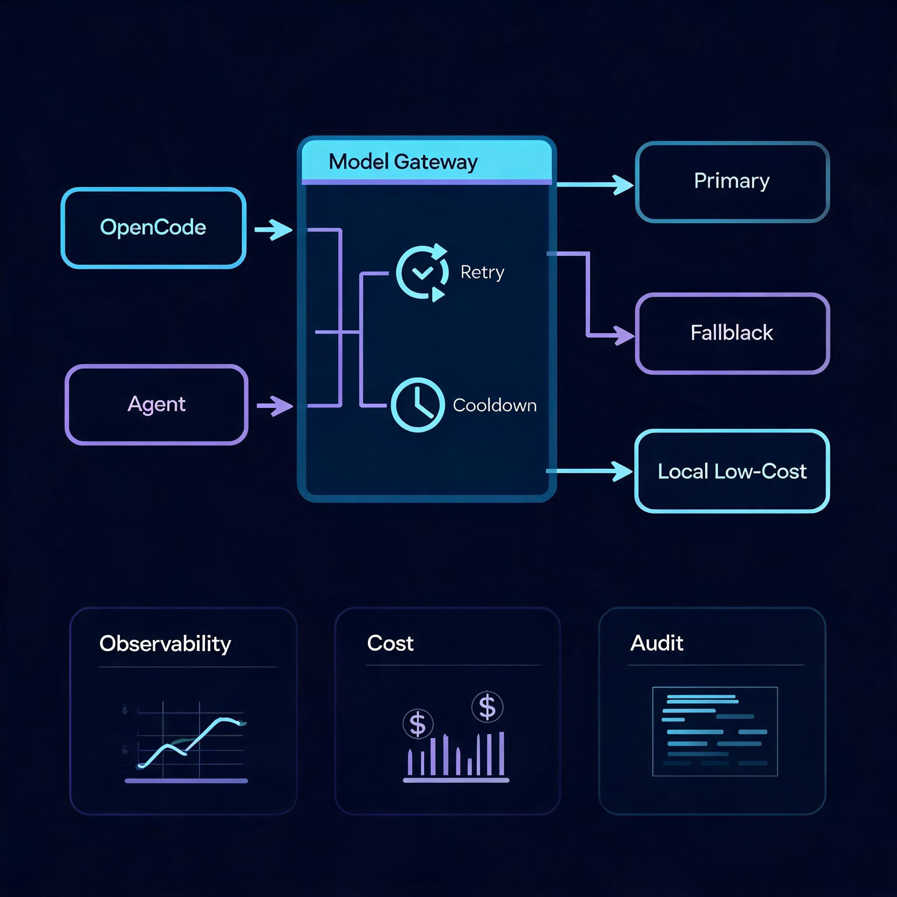

## 一、为什么需要模型网关

在个人试验阶段，应用直连一个模型服务商通常够用。但当 OpenCode、Agent Runtime、RAG 服务或企业内部 AI 应用进入长期使用阶段后，单点直连会逐渐暴露出工程问题。

常见问题包括：

1. 主服务商可能限流、超时、额度耗尽，或者某个区域临时不可用。
2. 不同任务适合不同模型，例如代码生成、长上下文分析、摘要、低成本批处理、本地隐私推理。
3. 上层应用不应该直接感知多个模型服务商的鉴权方式、接口细节和错误格式。
4. 团队需要统一观察模型调用的错误、成本、延迟、命中模型和失败原因。
5. 生产系统需要控制日志、密钥、访问权限和审计边界。

模型网关的作用，是把模型调用从“接一个 API”变成“可治理的模型调用入口”。

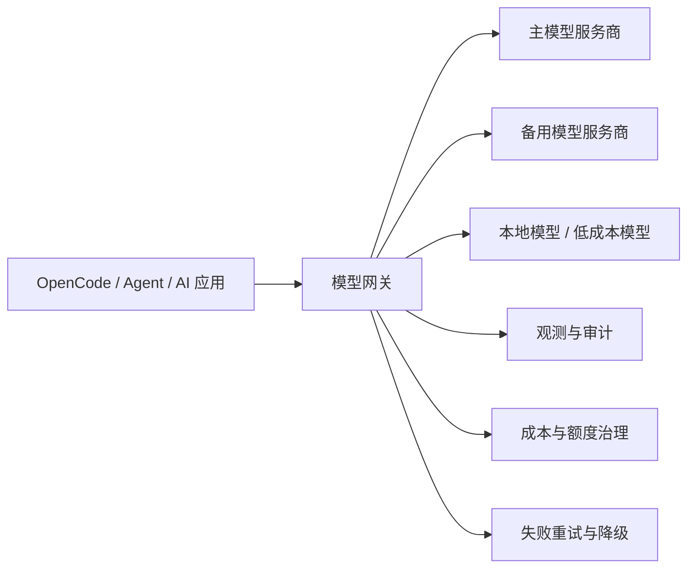

在 ArchAIHarness 的语境中，模型网关不是为了堆叠更多模型，而是为了把模型调用纳入工程秩序：人定义路由、边界和审计规则，AI 在边界内执行，体系记录每一次调用结果。

## 二、模型网关要承担哪些职责

选型之前，先不要急着比较工具。应该先确认模型网关需要承担哪些职责。

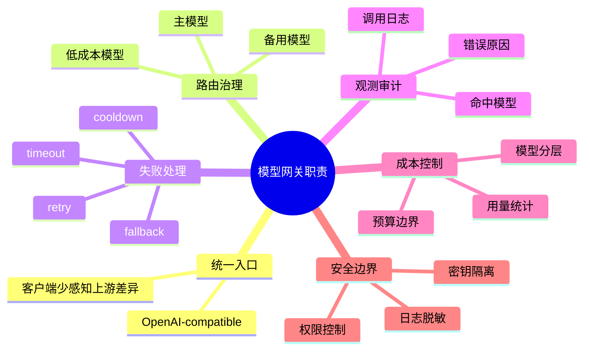

一个可长期维护的模型网关，至少要回答这些问题：

1. 客户端如何接入？是否兼容 OpenAI API？
2. 上游模型如何配置？是否支持多个 provider？
3. 主模型失败时如何处理？重试几次？是否进入冷却？是否切换备用模型？
4. 日志记录到什么粒度？是否会保存敏感 prompt、代码、内部地址或客户资料？
5. 是否能区分不同模型、不同用户、不同应用的成本？
6. 配置能否版本化、回滚和脱敏分享？

## 三、LiteLLM：更偏模型调用链路治理

LiteLLM 可以作为 SDK 使用，也可以作为独立 Proxy Server 部署，对外提供 OpenAI-compatible API。它的重点是统一模型调用入口，并在这个入口上处理模型路由、失败重试、fallback、load balancing、cost tracking、virtual key、budget 和日志治理等问题。具体能力范围应以官方文档和当前版本为准。

开源仓库：[`BerriAI/litellm`](https://github.com/BerriAI/litellm)

在 OpenCode 或 Agent 工程化场景中，可以把 LiteLLM 理解为“模型调用控制层”。

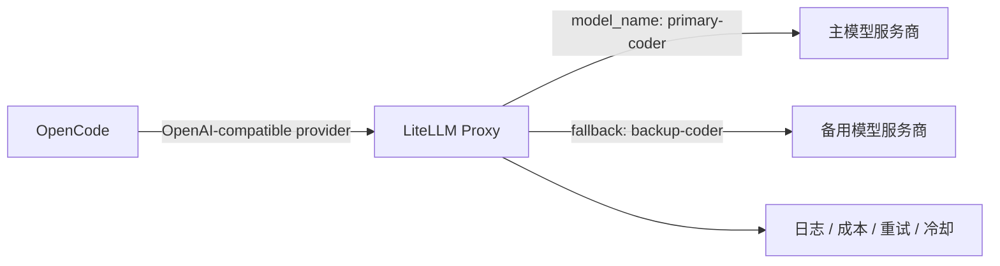

它更适合先处理这些问题：

1. OpenCode 只希望配置一个模型入口。
2. 主模型失败后，需要自动重试或切换备用模型。
3. 多个模型服务商需要通过统一接口接入。
4. 模型调用需要记录成本、错误、耗时和命中路径。
5. 模型路由逻辑希望独立于具体客户端，而不是散落在每个工具插件里。

简单说，LiteLLM 适合先把“调用链路”稳住：入口稳定、失败可处理、日志可观察、配置可回滚。

## 四、New API：更偏模型资源与渠道管理

New API 的项目定位偏向统一模型网关与模型资源管理，通常覆盖模型聚合、渠道分发、Web 管理后台、用户令牌、额度统计、分组权限和多格式转换等能力。具体能力和许可证边界应以官方仓库当前说明为准。

开源仓库：[`QuantumNous/new-api`](https://github.com/QuantumNous/new-api)

在团队或平台场景中，可以把 New API 理解为“模型 API 管理后台”。

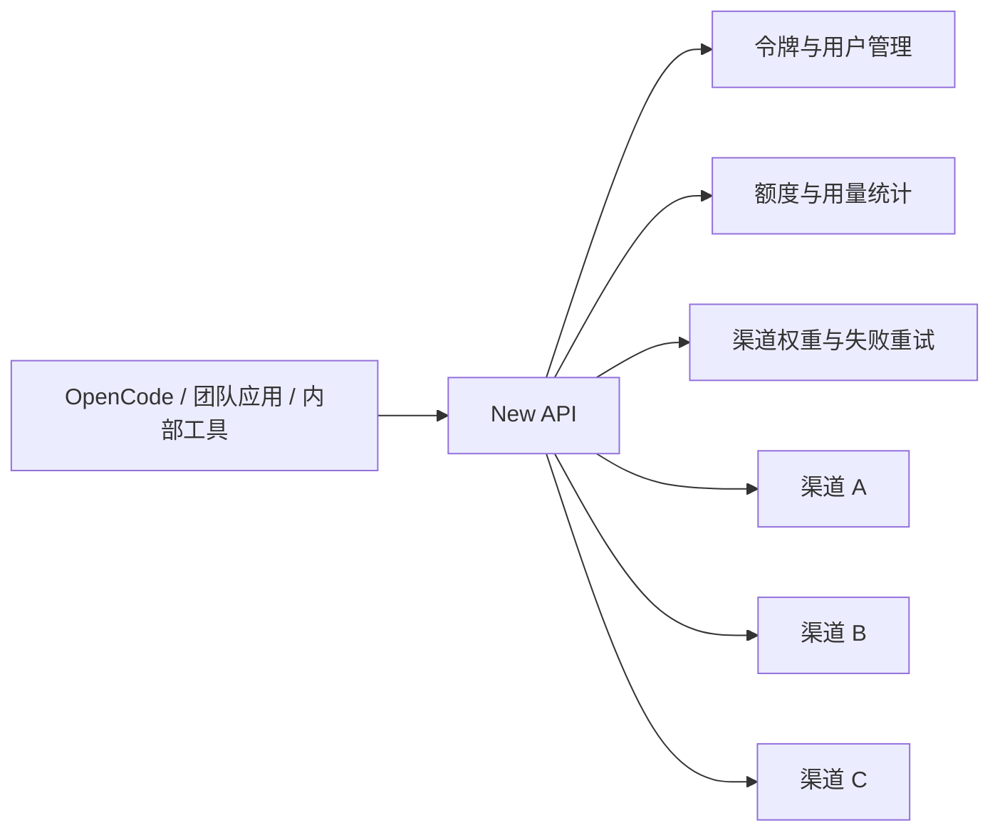

它更适合先处理这些问题：

1. 多个上游模型渠道需要统一管理。
2. 团队成员或多个应用需要分发不同访问令牌。
3. 需要额度、倍率、分组、统计和运营后台。
4. 需要把不同模型服务包装成统一 API 分发给内部系统。
5. 国内外模型渠道较多，需要一个集中管理入口。

简单说，New API 适合先把“模型资源”管起来：谁能用、能用多少、走哪个渠道、失败后如何重试、消耗如何统计。

## 五、如何看待二者差异

LiteLLM 和 New API 都可以被称为模型网关，它们不是非此即彼。更准确的理解是：二者能力有交集，但产品重心不同。

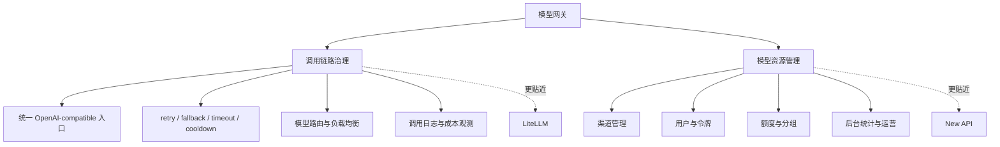

实际选择时，可以先看当前最需要解决的问题：

- 如果当前主要问题是 OpenCode 主模型失败后缺少可靠兜底，先验证调用链路治理能力。
- 如果当前主要问题是团队需要统一发放令牌、管理渠道和统计用量，先验证资源管理能力。
- 如果两类问题都存在，可以先把模型调用链路跑通，再逐步补齐管理后台。

## 六、OpenCode 接入方式

OpenCode 不需要直接理解多个上游模型服务商。更稳的方式是：OpenCode 只接一个 OpenAI-compatible endpoint，模型服务商差异交给网关处理。

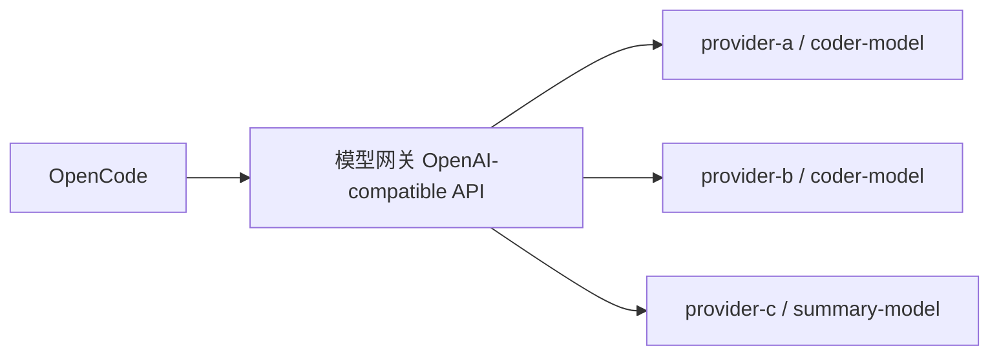

LiteLLM 的配置思想可以简化成这样：

```yaml
model_list:
  - model_name: primary-coder
    litellm_params:
      model: provider-a/coder-model
      api_base: os.environ/PRIMARY_MODEL_BASE_URL
      api_key: os.environ/PRIMARY_MODEL_API_KEY

  - model_name: backup-coder
    litellm_params:
      model: provider-b/coder-model
      api_base: os.environ/BACKUP_MODEL_BASE_URL
      api_key: os.environ/BACKUP_MODEL_API_KEY

litellm_settings:
  num_retries: 1
  request_timeout: 120
  fallbacks:
    - {"primary-coder": ["backup-coder"]}
  allowed_fails: 1
  cooldown_time: 3600
```

其中：

- `num_retries` 表示失败后的重试次数。
- `fallbacks` 表示当前模型组失败后可以切到哪个备用模型组。
- `allowed_fails` 是失败阈值，通常表示单位时间内失败次数超过阈值后进入 cooldown；它不应被简单理解为“第一次失败必然冷却”。
- `cooldown_time` 表示模型进入冷却后的避让时间。

OpenCode 侧只需要接模型网关：

```jsonc
{
  "$schema": "https://opencode.ai/config.json",
  "model": "litellm/primary-coder",
  "provider": {
    "litellm": {
      "npm": "@ai-sdk/openai-compatible",
      "name": "LiteLLM",
      "options": {
        "baseURL": "http://localhost:4000/v1",
        "apiKey": "{env:LITELLM_API_KEY}"
      },
      "models": {
        "primary-coder": {
          "name": "Primary Coder via LiteLLM"
        }
      }
    }
  }
}
```

这里的 `localhost` 只表示本地 POC 示例。生产或团队环境应使用私有网络、访问控制和独立密钥管理。

OpenCode 的 tool calling 是否稳定，不只取决于 OpenCode 和模型网关，也取决于上游模型是否支持 tool calls，以及网关是否完整透传 tool schema、tool call、streaming 等字段。因此 tool call 必须作为 POC 必测项。

## 七、fallback 不是简单切换模型

fallback 不是“一个模型挂了就无脑换另一个”。如果错误分类不清楚，fallback 反而会掩盖配置问题。

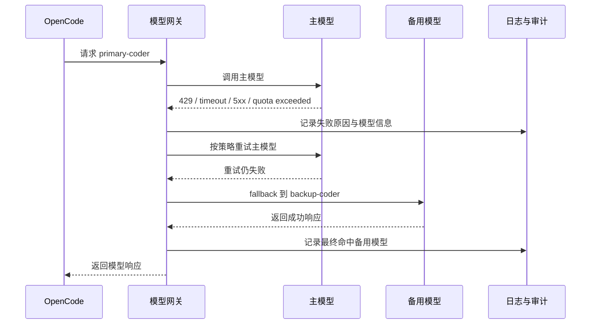

更适合触发 fallback 的错误包括：429、额度耗尽、5xx、服务不可用、请求超时或连接中断。

不建议直接 fallback 的错误包括：401 / 403 认证与权限错误、invalid model、tool schema 错误、请求体格式错误、明显由客户端配置导致的问题。若服务商将额度边界映射为 403，应通过明确错误码或错误类型单独白名单处理。

上面的错误分类是治理建议，不等同于任意网关默认行为。使用 LiteLLM 或 New API 时，需要结合当前版本文档确认 fallback 的触发条件，必要时通过策略、回调、插件或客户端错误分类来限制误兜底。

## 八、安全与公开边界

模型网关会经过完整 prompt、上下文、工具调用参数和部分响应内容，因此必须把安全边界放在设计前面。

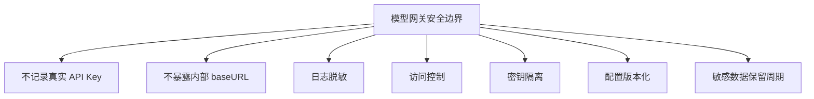

公开文档中只能出现抽象模型名、环境变量占位、本地示例地址、通用架构图和通用流程图。公开文档中不应出现真实 API Key、Token、Cookie、Authorization header、真实内部 baseURL、客户或公司私有模型账号、工作项目请求内容、未公开成本和业务指标。

如果后续要把私有工作场景转成公开案例，只能保留抽象模式，不能保留可反推出客户、公司、账号或内部系统的细节。

## 九、POC 应该怎么验证

模型网关 POC 不能只验证“能返回答案”。真正重要的是失败路径、兼容性和审计能力。

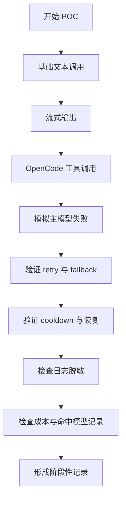

建议按下面顺序验证：

1. 普通文本对话是否成功。
2. 流式输出是否正常。
3. OpenCode tool call 是否能正常生成、透传和执行。
4. 主模型超时、限流、5xx、额度不足时是否按策略处理。
5. fallback 后是否能看到备用模型命中记录。
6. cooldown 到期后，主模型是否能恢复使用。
7. 日志中是否出现真实密钥、内部地址、敏感代码或私有业务内容。
8. 配置文件是否可以脱敏后进入公开文档。

## 十、逐步落地方式

模型网关可以分阶段落地，不需要一次性做成平台。

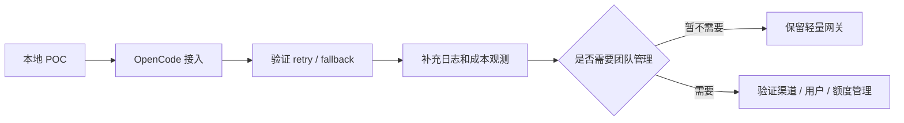

第一阶段先验证调用链路：OpenCode 能否稳定通过模型网关调用模型，主模型失败后是否能按策略处理。

第二阶段补齐治理能力：日志脱敏、密钥隔离、成本统计、配置回滚。

第三阶段再看团队管理：如果需要用户、令牌、额度、分组和渠道后台，再引入 New API 或同类平台能力。

整个过程的重点不是追求工具复杂度，而是让模型调用逐步进入可观察、可降级、可审计的工程秩序。
