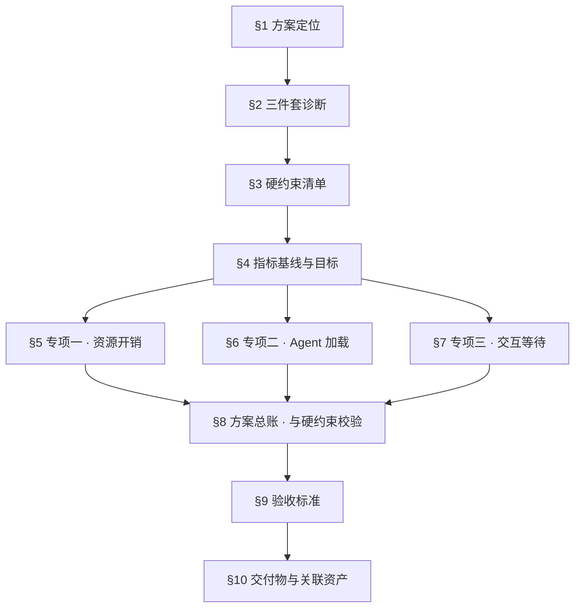
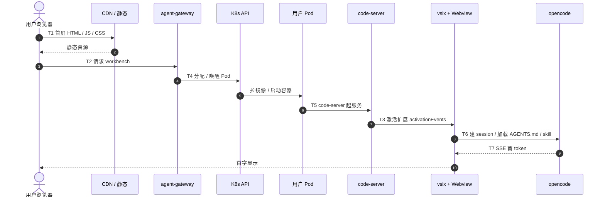
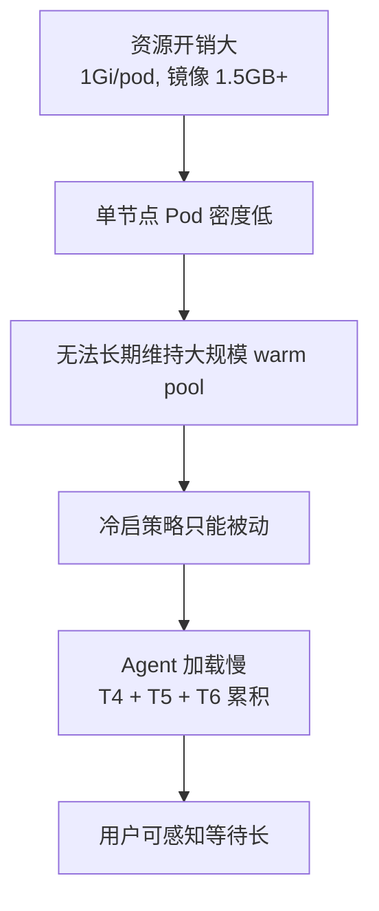

# C 端 Agent 基座 · 性能优化方案(中期启动前置)

> **文档性质**:方案稿,不是研究报告、不是选型对比、不是路线图。每一条方案都是可交付、可验收、可独立上线的终态,不留占位、不留补丁位。
>
> **上游对齐稿**:`2026-07-17-C端Agent基座-脑风暴对齐稿.md`。与本文冲突时以对齐稿的**硬约束**为准。
>
> **本方案的定位**:`03-开源资产/browser-runtime/` 的**中期启动前置**。中期的公式是 `opensumi + vsix → 浏览器 + opencode + plugin → k8s pod = agent`——IDE 渲染下沉浏览器,pod 侧只留 `opencode + plugin`。**pod 侧必须先压到中期能承接的水位**(内存 256Mi、镜像 300MB、冷启 5s+),否则:① 中期 OpenSumi 前端就绪时后端 pod 顶不住,②warm pool 起不来,③节点密度上不去,C 端商业模型接不住。
>
> **执行结果**:本方案在前期形态下做优化,但**优化的目标线锚定在中期指标上**——本方案落地之后,前期 pod 侧只需再拔掉 code-server 就能自然达到 `browser-runtime README §5.9` 的中期资源模型,中期上线只是"前端切 OpenSumi + 后端去 code-server",不需要再做任何服务端瘦身动作。
>
> **不做的事**:不换架构、不砍隔离、不换 agent 形态、不重设交互范式。不做后期(Web VM)相关的任何前置。触碰硬约束即否决。

---

## 一、方案定位与文档边界

### 1.1 方案要回答的三个问题

| 编号 | 问题 | 归属专项 |
|---|---|---|
| Q1 | 用户按下发送到看到第一个字反馈,端到端多久?压到什么区间? | 专项三 · 交互等待 |
| Q2 | 用户点击"进入工作台"到 agent 可用,总耗时多久?压到什么区间? | 专项二 · Agent 加载 |
| Q3 | 单个用户 pod 占多少内存/CPU/镜像磁盘?压到什么区间? | 专项一 · 资源开销 |

三个问题构成因果链——上游是资源开销(密度),中游是 agent 加载(冷启),下游是交互等待(用户可感知延迟)。**压下游必须先动上游**。

### 1.2 方案不回答的问题

| 问题 | 归属 |
|---|---|
| 换隔离方式(软隔离 / 多租共享) | 对齐稿 §3.2 判定为伪问题 |
| 单 agent 拆多 agent | 对齐稿 §3.3 判定为伪问题 |
| 新增场景路由层 | 对齐稿 §3.4 判定为伪问题 |
| 新场景接入再提速 | 人的能力问题,不是架构可优化空间 |
| C 端外壳形态 / vsix 交互布局 | 已通过 `beta.cloudlab.top/agent-runtime` + `settings.json` 编排解决 |
| 中期 / 后期演进(浏览器化、Web VM) | 归属 `03-开源资产/browser-runtime/README.md` |

### 1.3 文档结构

---

## 二、三件套问题的诊断

### 2.1 端到端延迟链路 T1–T7

从用户点击链接到看到第一个字符的完整链路,拆成七段:

| 段 | 名称 | 关键动作 | 归属专项 |
|---|---|---|---|
| T1 | 首屏静态 | 浏览器拉 HTML / JS / CSS | 专项三 |
| T2 | Workbench 加载 | code-server / Webview 初始化 | 专项二 |
| T3 | vsix 激活 | Extension activationEvents 触发 | 专项二 |
| T4 | Gateway 分配 | Redis 查会话 → Fabric8 建/找 Pod | 专项二 |
| T5 | Pod 冷启 | 镜像拉取 → entrypoint → 服务监听 | 专项一 + 专项二 |
| T6 | opencode 处理 | 加载 AGENTS.md / skill / MCP + 建 session | 专项二 |
| T7 | 首 token 返回 | LLM 首字延迟 + SSE 传输 | 专项三 |

### 2.2 三件套的因果链

三件套不是并列关系,是**同一条链的三个观测面**。要治下游 UX,必须先动上游资源模型;要维持 warm pool,必须先把单 pod 密度压下去。

### 2.3 三件套的性质

| 属性 | 判定 |
|---|---|
| 是否架构问题 | 不是。架构层不再重开评审 |
| 是否工程性能问题 | 是。走性能优化专项 |
| 是否允许触碰硬约束 | 不允许。触碰即否决 |
| 商业依赖 | 压下去之后,C 端消费级商业模型才成立;压不下去则商业模型不成立 |

---

## 三、硬约束清单

**任何方案条目在评审时先过这张表。任一项打叉,方案直接否决。**

| 编号 | 硬约束 | 来源 |
|---|---|---|
| H1 | 一人一 Pod 物理隔离,不动 | 对齐稿 §3.2 |
| H2 | NAS subPath 双挂载(`runtime/` + `global/`),不动 | `browser-runtime/README.md` §4.5 |
| H3 | 单 agent 通吃,场景靠 skill / MCP / vsix 插件生长 | 对齐稿 §3.3 |
| H4 | 三层胶水哲学(OpenCode / VSCode-OpenSumi / K8s Pod),各自不 fork、不改内核 | 对齐稿 §6.4 |
| H5 | question 追问模式解决意图识别,不加新路由组件 | 对齐稿 §3.4 |
| H6 | 24h 想法到玩具的编排范式(AGENTS.md + skill + MCP + 脚本),不加重流程 | 对齐稿 §2.3 |
| H7 | C 端外壳靠 vsix + `settings.json` 编排,不改 code-server / VSCode 内核 | 对齐稿 §3.1 |
| H8 | 数据敏感度按"混合型"设计,用户工作区仍走 NAS 权威 | 现状 |

**评审动作**:每个方案条目在 §8 的方案总账中标注"是否触碰 H1–H8",触碰即打叉,打叉即否决,不接受"部分触碰"或"弱触碰"表述。

---

## 四、指标基线与目标

**基线**取自 `browser-runtime/README.md §4.6`(前期形态)与生产观测。
**目标**锚定 `browser-runtime/README.md §5.9`(中期资源模型)——本方案要让前期 pod 提前达到中期水位,以便中期上线只做"前端切 OpenSumi + 后端去 code-server"两件事,不再需要服务端瘦身。

### 4.1 资源开销 · 基线与目标

| 指标 | 前期基线 | 本方案目标 | 中期承接线 |
|---|---|---|---|
| 单 Pod memory limit | 1 Gi | ≤ 384 Mi(常态,含 code-server)| ≤ 256 Mi(去 code-server 后) |
| 单 Pod CPU limit | 1000 m | ≤ 500 m(常态)可 burst 1000 m | ≤ 500 m |
| Runtime 镜像体积 | 1.5 GB+ | ≤ 500 MB(含 code-server) | ≤ 300 MB(去 code-server 后) |
| 单节点 Pod 密度 | ≈ 8 pod / 8Gi 节点 | ≥ 20 pod / 8Gi 节点 | ≥ 28 pod / 8Gi 节点 |
| NAS 挂载模式 | `runtime/` + `global/` subPath 双挂载 | 保持,不动 | 保持,不动 |

**读法**:本方案落地后,pod 内的 code-server 是唯一还没瘦下去的部分——中期上线时把 code-server 从镜像/进程/内存里整体拿掉,自然进入中期承接线。

### 4.2 Agent 加载 · 基线与目标

**三种场景分档**:

| 场景 | 定义 | 端到端目标 |
|---|---|---|
| 热连 | warm pool 命中,pod 已就绪、opencode 已监听 | 首字 P95 ≤ 5 s(3–5 s 理想区间) |
| 重连 | 用户离开后回来,原 pod 仍在或已被回收但会话可续 | 首字 ≤ 3 s |
| 冷启 | 完全没有可复用 pod,走建 pod → 冷启 → 建 session 全链路 | 首字 ≤ 8 s |

| 指标 | 前期基线 | 本方案目标 | 中期承接线 |
|---|---|---|---|
| Pod 冷启(拉镜像 + entrypoint + 服务监听) | 30 s+ | **热连 ≤ 1.5 s;冷启 ≤ 5.5 s** | 冷启 ≤ 4 s |
| opencode 起服务(端口可用) | 3–5 s | ≤ 800 ms | ≤ 800 ms |
| AGENTS.md / skill / MCP 加载 | 视场景包大小 | ≤ 500 ms(常见场景包) | ≤ 500 ms |
| **会话恢复(重连找回上次 Pod)** | 需重建 | **≤ 1.5 s(端到端 ≤ 3 s 首字)** | ≤ 1.5 s |
| **Warm pool 命中率(P95)** | 无 warm pool | **≥ 70%** | ≥ 70% |

**读法**:命中率不追 95%——因为**未命中的 30% 会走冷启,而冷启目标已放宽到 8 s**,业务可接受。命中率追高的经济学不划算(要按峰值 × 缓冲留大池),追 70% 即可用稳态预留。

### 4.3 交互等待 · 基线与目标

**用户硬指标(三档)**:

| 场景 | 端到端首字 | 说明 |
|---|---|---|
| **热连(warm pool 命中)** | **≤ 5 s(理想 3–5 s)** | C 端消费级默认体验 |
| **重连(会话续期)** | **≤ 3 s** | 用户离开后回来,该更快 |
| **冷启(warm pool 未命中)** | **≤ 8 s** | 少数派路径,可以接受 |

| 指标 | 前期基线 | 本方案目标 | 中期承接线 |
|---|---|---|---|
| 首屏 T1(CDN 命中) | 视网络 | ≤ 1.5 s(P75)| ≤ 1 s(OpenSumi dist 更薄)|
| **端到端首字 · 热连** | 未系统测量 | **P95 ≤ 5 s(3–5 s 理想区间)** | P75 ≤ 3 s |
| **端到端首字 · 重连** | 需重建 | **P95 ≤ 3 s** | P95 ≤ 3 s |
| **端到端首字 · 冷启** | ≥ 30 s | **P95 ≤ 8 s** | P95 ≤ 6 s |
| LLM 首 token(网关→客户端) | 视模型 | ≤ 1.2 s(P75)| ≤ 1.2 s(不变)|
| SSE 稳定性(30 min 会话不断) | 生产已达标 | 保持 | 保持 |

**分档反推的延迟预算**:

| 场景 | T1 首屏 | T2+T4 分配 | T5 pod 启 | T6 opencode 加载 | T7 首 token | 合计 |
|---|---|---|---|---|---|---|
| 热连 | 1.5 s | 0.3 s(命中池) | 0.5 s(pod 已就绪) | 0.5 s | 1.2 s | ≤ 4 s(留 1s buffer) |
| 重连 | 1.5 s(缓存)| 0.2 s(查会话)| — | 0.1 s(session 复用) | 1.2 s | ≤ 3 s |
| 冷启 | 1.5 s | 0.3 s | ≤ 4.5 s(建 pod + 起 opencode)| 0.5 s | 1.2 s | ≤ 8 s |

三档预算独立,不再互相反推。热连追理想体验,重连追极快,冷启追可接受。

---

## 五、专项一 · 资源开销

**要治的病**:单 pod 1 Gi 内存 + 1.5 GB 镜像 → 单节点密度低 → 无法维持 warm pool → 冷启常态化 → 用户等待长。

**要用的药**:五味方(镜像瘦身、进程瘦身、共享挂载、密度压测、QoS 调优),五味齐上、每味都要有量化指标。

### 5.1 药方 A · 镜像分层与瘦身

| 项 | 内容 |
|---|---|
| 目标 | 镜像 1.5 GB → ≤ 500 MB |
| 手段 | 多阶段构建;code-server 基础层复用;Node/Python/工具链按业务需要拆分成可选层;删掉 Python 3(前期用不到);删掉 build-tools/gcc/make(运行时不需要);opencode CLI 与 sst-dev.opencode vsix 打进 base 层带 hash;`.dockerignore` 严格 |
| 分层结构 | Layer 0:code-server + libc + tini;Layer 1:Node 20 runtime(non-dev);Layer 2:opencode CLI(带版本 tag);Layer 3:vsix + plugin 目录(build-time COPY);Layer 4:entrypoint + 配置 |
| 交付物 | `01-前期-k8s-pod-agent/runtime-image/Dockerfile`(多阶段);`build-image.sh`(带 hash 标签);镜像大小 CI 门禁 |
| 硬约束校验 | H1 ✓ / H2 ✓ / H3 ✓ / H4 ✓ / H7 ✓ 不触碰 code-server 内核 |
| 验收 | `docker images` 显示 ≤ 500 MB;层复用率 ≥ 70%;CI 大小门禁自动拒绝超标提交 |

### 5.2 药方 B · 进程与运行时瘦身

| 项 | 内容 |
|---|---|
| 目标 | 单 Pod memory limit 1 Gi → ≤ 384 Mi(常态) |
| 手段 | opencode 启动加 `--max-old-space-size=256`;code-server 启动关闭内建 telemetry;禁用扩展市场;`NODE_ENV=production`;去掉 Chromium(用户不需要浏览器扩展预览);entrypoint 内的 npm 全局装包动作全部下推到镜像构建期 |
| 关键配置 | code-server:`--disable-telemetry --disable-update-check --bind-addr 127.0.0.1:8080`;opencode:环境变量 `OPENCODE_HTTP_HOST=127.0.0.1 OPENCODE_HTTP_PORT=4096`;jemalloc 替换 glibc malloc(可选,视密度收益) |
| 交付物 | `runtime-image/entrypoint.sh` 精简版;`runtime-image/opencode-launcher.sh`(带 max-old-space);Pod 内存 limit 从 1 Gi 下调到 384 Mi 的 K8s manifest |
| 硬约束校验 | H1 ✓ / H2 ✓ / H4 ✓ 不动 opencode 内核,只调启动参数 |
| 验收 | 稳态 5 会话/Pod 下 RSS ≤ 320 Mi;OOMKilled 率 = 0(压测 P99) |

### 5.3 药方 C · 共享层与 Sidecar 化

| 项 | 内容 |
|---|---|
| 目标 | 把 per-pod 的常量类子系统外置,腾出 pod 内存 |
| 可外置项 | ① MCP 只读工具(如 `fetch`/`playwright` headless)→ 集群共享 Sidecar Deployment,pod 通过 HTTP/stdio 连;② embeddings / 向量库客户端本地缓存 → 走共享 Redis;③ AGENTS.md/skill 模板包 → NAS `global/` 目录只读挂载,不再进镜像 |
| 不能外置项 | opencode 主进程、用户会话状态、用户工作区(H1/H2 硬约束) |
| 交付物 | `mcp-shared/` Deployment(N 副本);`skill-registry/`(NAS `global/skills/` 目录 + 版本索引);Pod 侧 `.opencode/mcp-config.json` 指向共享 sidecar |
| 硬约束校验 | H1 ✓ 用户数据不外流 / H2 ✓ NAS 双挂载不变 / H3 ✓ skill 仍按插件生长 / H4 ✓ 不 fork opencode |
| 验收 | Pod 内 MCP 工具进程数 = 0;shared MCP QPS 承载 ≥ 50 rps/pod-share;skill 加载走 NAS 只读挂载 |

### 5.4 药方 D · 节点密度压测与 QoS 调优

| 项 | 内容 |
|---|---|
| 目标 | 单 8Gi 节点稳定承载 ≥ 20 pod(用户在线且低频交互) |
| 手段 | memory request 128 Mi / limit 384 Mi(过量申请但 request 低,让调度器塞得下);CPU request 100 m / limit 500 m,允许 burst;Pod QoS 为 Burstable;节点侧开启 kernel memory accounting;kube-scheduler 加 `MostAllocated` 策略把用户 pod 塞满节点后再开新节点 |
| 交付物 | `k8s/runtime-pod-template.yaml`(新 QoS);节点标签 `runtime-tier=hot`;HPA 按节点内存 65% 阈值扩容;压测脚本 `bench/density-test.sh` |
| 硬约束校验 | H1 ✓ / H2 ✓ 隔离仍是 Pod 边界,QoS 只影响调度密度 |
| 验收 | 8 Gi 节点承载 20 Pod × 30 min 交互压测,OOMKilled 率 = 0;P95 用户响应无退化 |

### 5.5 药方 E · 镜像预热与就近拉取

| 项 | 内容 |
|---|---|
| 目标 | 镜像拉取从冷启主要瓶颈中彻底剔除 |
| 手段 | 镜像 registry 走同集群内部 registry(或阿里云镜像加速地址);节点上开 `imagePullPolicy: IfNotPresent`;运维侧 DaemonSet 定期在所有 hot-tier 节点预拉最新 tag;镜像 tag 走不可变哈希,不再走 `latest` |
| 交付物 | `k8s/image-warmer-daemonset.yaml`;镜像 tag 规范文档;registry mirror 配置 |
| 硬约束校验 | H1 ✓ / H4 ✓ |
| 验收 | 节点冷启拉镜像耗时 P95 ≤ 2 s(命中 layer cache)|

### 5.6 专项一 · 效果预期

| 指标 | 基线 | 药方 A+B+C+D+E 之后 |
|---|---|---|
| 镜像 | 1.5 GB | ≤ 500 MB |
| Pod 内存 limit | 1 Gi | ≤ 384 Mi |
| 单节点密度 | ≈ 8 | ≥ 20 |
| 镜像拉取时间 P95 | 15 s+ | ≤ 2 s |

**结论**:密度提升 2.5×,单用户资源成本按内存计压到 38% 以下。密度上去之后,§6 的 warm pool 才有经济性。

---

## 六、专项二 · Agent 加载

**要治的病**:T4(gateway 分配)+ T5(pod 冷启)+ T6(opencode 起服务 + 加载场景包)加起来是用户"点了没反应"的元凶。

**要用的药**:五味方(warm pool、上下文预烘焙、opencode 服务化启动、会话粘性与续期、gateway 短路握手),核心思路是**把冷启动逻辑挪到用户请求之前**。

### 6.1 药方 F · Pod Warm Pool

| 项 | 内容 |
|---|---|
| 目标 | Pod 冷启从 30 s+ 压到热连 ≤ 1.5 s;命中率 ≥ 70% |
| 结构 | 每个节点池维持一个 warm pool(默认 N=5-10 个 idle pod),预启动 code-server + opencode,不挂用户 NAS,不加载任何 AGENTS.md/skill;用户请求到 gateway 时,从 pool 拿一个 pod → 挂载该用户 NAS subPath → 触发 opencode reload 加载用户场景包 → gateway 更新 Redis 双索引 |
| 池维护 | 一个 `warm-pool-controller` Deployment(自研,基于 Fabric8),按 HPA 曲线预测 warm pool 大小;pod 空转超时(如 15 min 未被认领)自动回收 |
| 用户绑定 | Pod 从 warm 转 hot 的动作原子化:① kubectl patch label + annotation 打上 userId;② 挂载 NAS(通过 CSI 的 VolumeAttachment 补挂或用 in-pod fusermount 挂载);③ 通知 opencode 切工作目录 + reload;④ Redis 写 hot 索引 |
| 交付物 | `warm-pool-controller/`(独立 Deployment);`runtime-image` 支持 `RUNTIME_MODE=warm\|hot` 双态启动;`agent-gateway` 新增 `POST /runtime/allocate` API,内部先问 warm-pool-controller |
| 硬约束校验 | H1 ✓ warm pod 不挂任何用户 NAS,认领时才挂,隔离性不损失 / H2 ✓ subPath 双挂载路径不变 / H4 ✓ opencode 只是 reload 不 fork |
| 验收 | Warm pool 命中率 P95 ≥ 70%;命中时 T4+T5 ≤ 1.5 s(P95);未命中时冷启 T4+T5 ≤ 5.5 s(P95),端到端首字 ≤ 8 s |

### 6.2 药方 G · 上下文预烘焙 · Base Image + NAS Skill Registry

| 项 | 内容 |
|---|---|
| 目标 | opencode 加载 AGENTS.md / skill / MCP 从"启动时全量拉"变成"启动时按需读" |
| 结构 | ① 通用 AGENTS.md 基座 + 通用 skills(全站共享)打进 base image 的 `/opt/opencode-preset/`;② 场景包按业务名分片存 NAS `global/skills/<scenario>/`,只读挂载;③ 用户级差异化仅走 `runtime/.opencode/` |
| 加载策略 | opencode 启动只加载 `preset` + 用户 `runtime/.opencode/AGENTS.md`(轻量);具体 skill/MCP 按需 lazy load(第一次 tool 调用触发) |
| 交付物 | `runtime-image` 的 `/opt/opencode-preset/` layer;`skill-registry` NAS 目录结构 + 版本索引文件 `manifest.json`;opencode 侧的 lazy load 通过标准 `.opencode/config.json` 声明式配置,不改 opencode 内核 |
| 硬约束校验 | H3 ✓ 场景仍靠 skill 生长 / H4 ✓ 靠 opencode 官方配置项实现,不改内核 / H6 ✓ 24h 编排范式不变,新场景丢 `global/skills/` 目录即生效 |
| 验收 | opencode 启动 → 端口可用 ≤ 800 ms;`AGENTS.md` + `.opencode/config.json` 加载 ≤ 500 ms;lazy load 单个 skill 首次触发 ≤ 300 ms |

### 6.3 药方 H · OpenCode 服务化启动优化

| 项 | 内容 |
|---|---|
| 目标 | opencode 从 "启动阻塞等所有 skill 就绪" 变成 "先起端口后台 warmup" |
| 手段 | 通过官方 `opencode serve` 参数与 `.opencode/config.json` 声明式配置实现:① 启动阶段仅解析 config,不初始化 MCP client;② 端口先监听,收到第一次请求时按需初始化对应 MCP;③ background warmup 通过后台 goroutine/worker 预建常用 MCP 连接。**如果 opencode 不支持,方案回落到:先起监听端口占位、真正 opencode 进程延后 1 秒启动、gateway 层做首字缓冲**——**任何情况下都不修改 opencode 内核**(H4)|
| 交付物 | `.opencode/config.json` 模板(声明式懒加载);`opencode-launcher.sh` 分阶段启动;gateway 首字缓冲逻辑 |
| 硬约束校验 | H4 ✓ 只用官方配置项;若回落方案也只是 launcher 层脚本 |
| 验收 | `opencode serve` 端口监听 ≤ 800 ms;首次请求 warmup 完成 ≤ 300 ms(命中缓存) |

### 6.4 药方 I · 会话粘性与续期

| 项 | 内容 |
|---|---|
| 目标 | 用户重连找回上次 Pod,不重新经历 T4/T5/T6;会话恢复 ≤ 1 s |
| 手段 | Redis 双索引扩展:`user:{userId} → {runtimeId, podName, lastAccess, ttl}`;gateway 收到用户请求先查该索引,pod 仍活着 → 直接透传;pod 已回收 → 走 warm pool 认领;所有 pod TTL 从 3600 s 保留(H1 不动),但每次交互心跳延长 TTL |
| 断线续传 | SSE 层加序号,断线后客户端带 last-event-id 重连,gateway 从 opencode 的会话缓存中续传(opencode 官方 session 机制) |
| 交付物 | `agent-gateway` Redis 索引结构升级;心跳续期策略;SSE resume 逻辑 |
| 硬约束校验 | H1 ✓ Pod 边界不变 / H2 ✓ NAS 挂载不变 / H5 ✓ 不新增路由组件,是 gateway 现有职责的扩展 |
| 验收 | 用户 30 min 内重连命中率 ≥ 90%;命中重连端到端首字 ≤ 3 s(P95);SSE 断线 5 s 内续传成功率 ≥ 95% |

### 6.5 药方 J · Gateway 握手短路

| 项 | 内容 |
|---|---|
| 目标 | T2 + T4 从"两次 HTTP 往返"压到"一次 HTTP + 一次 WS 升级" |
| 手段 | 用户首屏 HTML 里内嵌 warmup 探针,浏览器一拿到 HTML 就并行发起 `POST /runtime/allocate` 与静态资源拉取;`allocate` 命中 warm pool 时同步返回 `runtimeId + WS URL`;客户端在 workbench 就绪前 WS 连接已经建好 |
| 交付物 | 首屏 HTML 模板嵌入 warmup 脚本;`agent-gateway` `/runtime/allocate` 支持乐观返回;客户端 vsix 收到 workbench ready 事件后直接接管已有 WS |
| 硬约束校验 | H4 ✓ / H7 ✓ 只在 vsix + settings 编排层做,不改 code-server 内核 |
| 验收 | T2+T4 合并耗时 P75 ≤ 1 s(热连);Workbench ready 时 WS 已建立成功率 ≥ 85% |

### 6.6 专项二 · 效果预期

| 指标 | 基线 | 药方 F+G+H+I+J 之后 |
|---|---|---|
| Pod 冷启(未命中 warm pool) | 30 s+ | ≤ 5.5 s |
| Pod 热连(warm pool 命中) | 不存在 | ≤ 1.5 s |
| Warm pool 命中率 | 0 | ≥ 70% |
| opencode 端口可用 | 3–5 s | ≤ 800 ms |
| AGENTS.md/skill 加载 | 视场景包 | ≤ 500 ms |
| 会话重连端到端首字 | 需重建 | ≤ 3 s |

**结论**:T4+T5+T6 从"用户开始等 → 用户开始骂"压到"用户开始等 → 首字已到"。

---

## 七、专项三 · 交互等待

**要治的病**:即便 warm pool 命中 + 上下文预烘焙都做了,T1(首屏)+ T7(首字)仍是用户可感知的两个大坑。

**要用的药**:四味方(首屏关键路径瘦身、SSE 首字流式、LLM 网关侧短路、前置结果缓存),核心思路是**让"等"变成"边等边看"**。

### 7.1 药方 K · 首屏关键路径

| 项 | 内容 |
|---|---|
| 目标 | T1 首屏 P75 ≤ 1.5 s(命中 CDN 缓存) |
| 手段 | code-server 主 JS 拆 chunk 后走 CDN;`activityBar.location:hidden` / `statusBar.visible:false` 等 `settings.json` 编排项打进首屏 preload,不等 workbench 完全初始化就先把 IDE 骨架按掉;vsix + Webview 静态资源(卡片模板、图标、样式)走独立 CDN 而不是走 pod;首屏 CSS 内联 critical path,其余 async |
| 交付物 | vsix 打包脚本:资产走 CDN + hash 化;首屏 HTML 模板 + preload;`settings.json` 分层结构(全局默认 + 场景差异),差异部分走后置加载 |
| 硬约束校验 | H4 ✓ / H7 ✓ 只在 vsix + Webview + settings 编排层做,不改 code-server 内核 |
| 验收 | CDN 命中场景下首屏 LCP P75 ≤ 1.5 s;IDE 骨架("看不出是 IDE")在 P75 ≤ 1 s 内完成 |

### 7.2 药方 L · SSE 首字流式与前端渲染

| 项 | 内容 |
|---|---|
| 目标 | 用户看到"AI 已开始回答"的首字 ≤ 5 s(P95,热连,3–5 s 理想区间) |
| 手段 | Webview 收到第一 chunk 立刻渲染,不等完整响应;打字机效果由前端节流控制,不影响首字时机;首字前的 gateway → opencode → LLM 全链路走 HTTP/2 或 WebSocket,不走短连接 |
| 交付物 | Webview 侧的 SSE 消费器 + 增量渲染组件;gateway 侧 SSE 透传的 backpressure 策略;客户端 `.paper` 卡片"预骨架"(先渲染标题/骨架,内容 chunk 流入填充) |
| 硬约束校验 | H4 ✓ / H7 ✓ / H8 ✓ |
| 验收 | 首字前端渲染延迟(收到 chunk → 屏幕像素更新)≤ 50 ms;30 min 会话 SSE 稳定率 ≥ 99% |

### 7.3 药方 M · 模型网关侧短路 · 轻量意图与 CDN 化响应

| 项 | 内容 |
|---|---|
| 目标 | 常见轻量意图(问候、场景内导航、"能不能"、"是不是")不进 pod 也能秒回,压总体加权 T7 |
| 前置 | 硬约束 H5 已明确"不新增路由组件"。本方案在既有 agent-gateway 内做,不加新组件 |
| 手段 | agent-gateway 侧嵌轻量模型客户端(走独立小参数模型或规则库);进入 pod 之前先跑一次意图判定,命中"闲聊/导航/固定回复"直接返回并异步同步一份到 opencode 会话;命中"业务请求"照常透传 pod |
| 结合 question 追问 | 意图不明确时,gateway 侧直接生成一个 question 追问返回(仍走 H5 追问模式,不做业务决策) |
| 交付物 | `agent-gateway` 增加 `intent-shortcut` 过滤器(Spring Cloud Gateway Filter);轻量模型客户端(SDK 层)+ 规则库文件;会话同步 API |
| 硬约束校验 | H3 ✓ 单 agent 通吃仍成立(闲聊命中的回复也进入同一 session 记录) / H4 ✓ 不改 opencode / H5 ✓ 沿用 question 范式,不是新路由 |
| 验收 | 闲聊类请求 T7 ≤ 500 ms(P75);短路命中率 ≥ 20%(视用户行为);命中时会话记录完整同步到 opencode(可回放) |

### 7.4 药方 N · 前置结果缓存

| 项 | 内容 |
|---|---|
| 目标 | 相同 skill × 相同参数 × 相近上下文的输出走缓存,压 T6+T7 |
| 手段 | opencode 侧通过官方 `.opencode/config.json` 挂载共享缓存 MCP(自研)——对 tool call 结果做 kv 缓存,key = `hash(skill + tool + args + top-K context)`,存 Redis;命中率高的场景(资料检索、题库检索、模板生成)直接走缓存 |
| 交付物 | `mcp-cache` 服务(共享 Sidecar);`.opencode/config.json` 声明 mcp-cache 挂载;缓存策略文档(TTL、驱逐、命名空间隔离) |
| 硬约束校验 | H1 ✓ 缓存按 userId 命名空间隔离,不跨用户共享敏感数据 / H4 ✓ 走标准 MCP 接口,不改 opencode / H8 ✓ 混合型数据敏感度:私有数据不入缓存,公开数据可跨用户共享 key |
| 验收 | 缓存命中场景 T6+T7 ≤ 600 ms(P75);缓存穿透错误率 = 0(误命中会话) |

### 7.5 专项三 · 效果预期

| 指标 | 基线 | 药方 K+L+M+N 之后 |
|---|---|---|
| T1 首屏 P75 | 视网络 | ≤ 1.5 s |
| 端到端首字 T1→T7(热连,3–5 s 理想区间) | 未系统测量 | P95 ≤ 5 s |
| 端到端首字 T1→T7(重连) | 需重建 | P95 ≤ 3 s |
| 端到端首字 T1→T7(冷启) | ≥ 30 s | P95 ≤ 8 s |
| 闲聊类响应 P75 | 与业务同 | ≤ 500 ms |
| 缓存命中响应 P75 | 无缓存 | ≤ 600 ms |

**结论**:C 端用户主观感受从"点一下等半天"压到"点一下已经开始说话"。

---

## 八、方案总账 · 与硬约束校验

**十四味药一张表看清楚,每条都过一遍 H1–H8。任何后来者想加/减方案,就往这张表上加/减一行。**

| 药方 | 归属专项 | 一句话本质 | H1 隔离 | H2 NAS | H3 单 agent | H4 三层胶水 | H5 追问模式 | H6 24h 编排 | H7 vsix 外壳 | H8 混合敏感 | 结论 |
|---|---|---|---|---|---|---|---|---|---|---|---|
| A · 镜像分层瘦身 | 一 | 1.5GB → 500MB | ✓ | ✓ | ✓ | ✓ | — | ✓ | ✓ | — | 通过 |
| B · 进程运行时瘦身 | 一 | 1Gi → 384Mi | ✓ | ✓ | — | ✓ | — | — | ✓ | — | 通过 |
| C · 共享 Sidecar | 一 | 常量子系统外置 | ✓ | ✓ | ✓ | ✓ | — | ✓ | — | ✓ | 通过 |
| D · 节点密度 QoS | 一 | 8→20 pod/节点 | ✓ | ✓ | — | ✓ | — | — | — | ✓ | 通过 |
| E · 镜像预热 | 一 | Pull ≤ 2s | ✓ | ✓ | — | ✓ | — | — | — | — | 通过 |
| F · Warm Pool | 二 | 冷启 → 热连 | ✓ | ✓ | ✓ | ✓ | — | — | — | ✓ | 通过 |
| G · 预烘焙 | 二 | 场景包按需 | ✓ | ✓ | ✓ | ✓ | — | ✓ | — | ✓ | 通过 |
| H · opencode 服务化 | 二 | 端口先起 | ✓ | ✓ | ✓ | ✓ | — | — | — | — | 通过 |
| I · 会话粘性 | 二 | 找回上次 pod | ✓ | ✓ | ✓ | ✓ | ✓ | — | — | ✓ | 通过 |
| J · Gateway 短路握手 | 二 | 一次往返建 WS | ✓ | ✓ | — | ✓ | — | — | ✓ | — | 通过 |
| K · 首屏关键路径 | 三 | LCP ≤ 1.5s | ✓ | — | — | ✓ | — | — | ✓ | — | 通过 |
| L · SSE 首字流式 | 三 | 边收边渲染 | ✓ | — | ✓ | ✓ | — | — | ✓ | ✓ | 通过 |
| M · 网关意图短路 | 三 | 闲聊不进 pod | ✓ | ✓ | ✓ | ✓ | ✓ | — | — | ✓ | 通过 |
| N · MCP 结果缓存 | 三 | 相同调用走缓存 | ✓ | ✓ | ✓ | ✓ | — | ✓ | — | ✓ | 通过 |

**读法**:✓ = 严格不触碰;— = 不涉及。**十四条药方无一触碰硬约束**,可全部进入交付。

---

## 九、验收标准

**每一条都必须挂到 §4 的目标数字上,由压测/生产可回归验证。不接受"看起来更快"这种主观描述。**

### 9.1 专项一 · 资源开销验收

- [ ] `docker images` 显示镜像 ≤ 500 MB;CI 大小门禁生效
- [ ] Pod memory limit 384 Mi 下,稳态 5 会话 RSS ≤ 320 Mi
- [ ] 单 8 Gi 节点稳定承载 20 Pod × 30 min 压测,OOMKilled 率 = 0
- [ ] 节点镜像拉取耗时 P95 ≤ 2 s(命中 layer cache)
- [ ] Pod 内 MCP 工具进程数 = 0(全部走共享 Sidecar)

### 9.2 专项二 · Agent 加载验收

- [ ] Warm pool 命中率 P95 ≥ 70%
- [ ] 命中 warm pool 时 T4+T5 ≤ 1.5 s(P95)
- [ ] 未命中冷启时 T4+T5 ≤ 5.5 s(P95)
- [ ] `opencode serve` 端口监听 ≤ 800 ms
- [ ] `AGENTS.md` + `.opencode/config.json` 加载 ≤ 500 ms
- [ ] 30 min 内重连命中率 ≥ 90%,重连端到端首字 ≤ 3 s(P95)
- [ ] SSE 断线 5 s 内续传成功率 ≥ 95%
- [ ] Workbench ready 时 WS 已建立成功率 ≥ 85%

### 9.3 专项三 · 交互等待验收

- [ ] CDN 命中场景 LCP P75 ≤ 1.5 s
- [ ] IDE 骨架("看不出是 IDE")P75 ≤ 1 s 完成
- [ ] 首字端到端 T1→T7 P95 ≤ 5 s(热连,3–5 s 理想区间)
- [ ] 首字端到端 T1→T7 P95 ≤ 3 s(重连)
- [ ] 首字端到端 T1→T7 P95 ≤ 8 s(冷启)
- [ ] 首字前端渲染延迟 ≤ 50 ms(收 chunk → 像素更新)
- [ ] 闲聊类请求 T7 ≤ 500 ms(P75)
- [ ] 意图短路命中率 ≥ 20%(视用户行为)
- [ ] 缓存命中场景 T6+T7 ≤ 600 ms(P75)
- [ ] 30 min 会话 SSE 稳定率 ≥ 99%

### 9.4 硬约束校验(每次上线跑一遍)

- [ ] 一人一 Pod 边界未被打破(K8s 审计:任意 Pod 不承载多用户 NAS 挂载)
- [ ] NAS subPath 双挂载路径不变(自动化脚本 grep 挂载点)
- [ ] opencode / code-server / K8s 内核未 fork(依赖版本表 CI 校验)
- [ ] question 追问模式仍是唯一意图识别通路(gateway 短路只做闲聊命中,业务请求仍进 pod)
- [ ] 新场景接入仍是"丢 `global/skills/` 目录 + 声明式 config"的编排范式

---

## 十、交付物与关联资产

### 10.1 交付物清单

**每一项都是终态、可上线,不留 TODO、不留占位。**

| 编号 | 交付物 | 归属仓库 / 目录 | 状态 |
|---|---|---|---|
| D1 | `runtime-image` 多阶段 Dockerfile + `.dockerignore` + 大小 CI 门禁 | `03-开源资产/browser-runtime/01-前期-k8s-pod-agent/runtime-image/` | 未启动 |
| D2 | 精简版 `entrypoint.sh` + `opencode-launcher.sh`(带 max-old-space、分阶段启动) | 同上 | 未启动 |
| D3 | K8s `runtime-pod-template.yaml`(新 QoS,384Mi/500m,Burstable) | 同上 `k8s/` | 未启动 |
| D4 | `image-warmer-daemonset.yaml`(节点侧镜像预拉) | 同上 `k8s/` | 未启动 |
| D5 | `mcp-shared/` Deployment(共享 MCP Sidecar 集群) | 同上 `mcp-shared/` | 未启动 |
| D6 | `mcp-cache/` 服务(共享结果缓存 Sidecar) | 同上 `mcp-cache/` | 未启动 |
| D7 | NAS `global/skills/` 目录规范 + `manifest.json` 版本索引 | 同上 `skill-registry/` | 未启动 |
| D8 | `warm-pool-controller/`(基于 Fabric8 的 Pod 池维护 Deployment) | 同上 `warm-pool-controller/` | 未启动 |
| D9 | `agent-gateway` 增补:`POST /runtime/allocate`、Redis 双索引升级、`intent-shortcut` Filter、SSE resume、首字缓冲 | `03-开源资产/browser-runtime/01-前期-k8s-pod-agent/agent-gateway/` | 未启动 |
| D10 | vsix 打包脚本 + 首屏 HTML 模板 + `settings.json` 分层结构 | `03-开源资产/browser-runtime/01-前期-k8s-pod-agent/vscode-plugin/` | 未启动 |
| D11 | Webview SSE 消费器 + `.paper` 卡片预骨架组件 | 同 D10 | 未启动 |
| D12 | 压测脚本 `bench/density-test.sh` + `bench/latency-test.sh` | 同上 `bench/` | 未启动 |
| D13 | `docs/perf-baseline.md`(基线报告)+ `docs/perf-eval.md`(方案交付后评估报告) | 同上 `docs/` | 未启动 |

### 10.2 上线动作 · 分组独立可上线

**不用"阶段/里程碑"这种带时间意味的词。分组只按依赖关系排,每组交付即上线,组间不阻塞。**

| 分组 | 内容 | 依赖 |
|---|---|---|
| 组 α · 密度地基 | D1 + D2 + D3 + D4 | 无 |
| 组 β · 共享化 | D5 + D6 + D7 | α |
| 组 γ · 热连能力 | D8 + D9(热连相关部分)+ D12 | α |
| 组 δ · 前端骨架瘦身 | D10 + D11 | 无 |
| 组 ε · 交互短路 | D9(intent-shortcut / SSE / 首字缓冲)+ D6 联调 | β + γ |
| 组 ζ · 度量闭环 | D12 + D13 | 全部前置组已上线 |

每组交付上线后**直接对着 §9 验收**,不达标不进入下一组。

### 10.3 关联资产

| 资产 | 路径 | 关系 |
|---|---|---|
| 脑风暴对齐稿 | `2026-07-17-C端Agent基座-脑风暴对齐稿.md` | 本方案的输入,硬约束来源 |
| 现状生产 · 前期形态 | `03-开源资产/browser-runtime/01-前期-k8s-pod-agent/` | 本方案改造对象 |
| Browser Runtime 总设计 | `03-开源资产/browser-runtime/README.md` | 提供三阶段路线;本方案在其"前期"内做优化,不越界 |
| 分布式多用户 OpenCode 平台设计 | `99-知识沉淀/0xE0_设计方案/分布式多用户OpenCode智能体平台架构设计.md` | 现状架构参考 |
| Agent 产品体系架构 | `99-知识沉淀/0xE0_设计方案/Agent产品体系架构.md` | 仓库关系图 |
| OpenCode 基座选型蓝图 | `99-知识沉淀/0xD0_实践指南/OpenCode基座AI产品组合选型蓝图.md` | 大脑层集成通道参考 |
| AgentScope vs OpenCode 调研 | `99-知识沉淀/调研报告/260716-AgentScope与OpenCode架构对比调研.md` | 基座定位背书 |
| 多租户 SaaS 内核设计 | `99-知识沉淀/0xE0_设计方案/多租户SaaS内核设计方案.md` | 认证/配额/审计共用底座 |
| 生产实证截图 | `智能出题.jpeg` | C 端形态可落地的实证 |

### 10.4 变更纪律

- 本方案落地过程中如出现"必须触碰硬约束"的情况,不允许在本文件内修订放行,而是**先回到脑风暴对齐稿**发起校准,校准通过后再回来改本文。
- 本方案不接受补丁式追加。任何新增药方(如药方 O、药方 P),都要跟着 §8 方案总账扩表 + §9 验收扩条,一次改到位。
- 度量闭环(组 ζ)是长期动作,`docs/perf-eval.md` 生命周期与本方案同长,每次上线后回填数据。

---

**产出者**:魏祖潇 + AI(opencode ark-code-latest)
**产出日期**:2026-07-17
**上游对齐稿**:`2026-07-17-C端Agent基座-脑风暴对齐稿.md`
**方案定位**:`browser-runtime/` 中期启动的**前置**——前期 pod 侧先压到中期承接水位,中期上线只做"前端切 OpenSumi + 后端去 code-server"
**下一步**:老大扫读本方案,校准无偏差后按组 α → ζ 顺序驱动交付;交付完成即触发中期启动。
