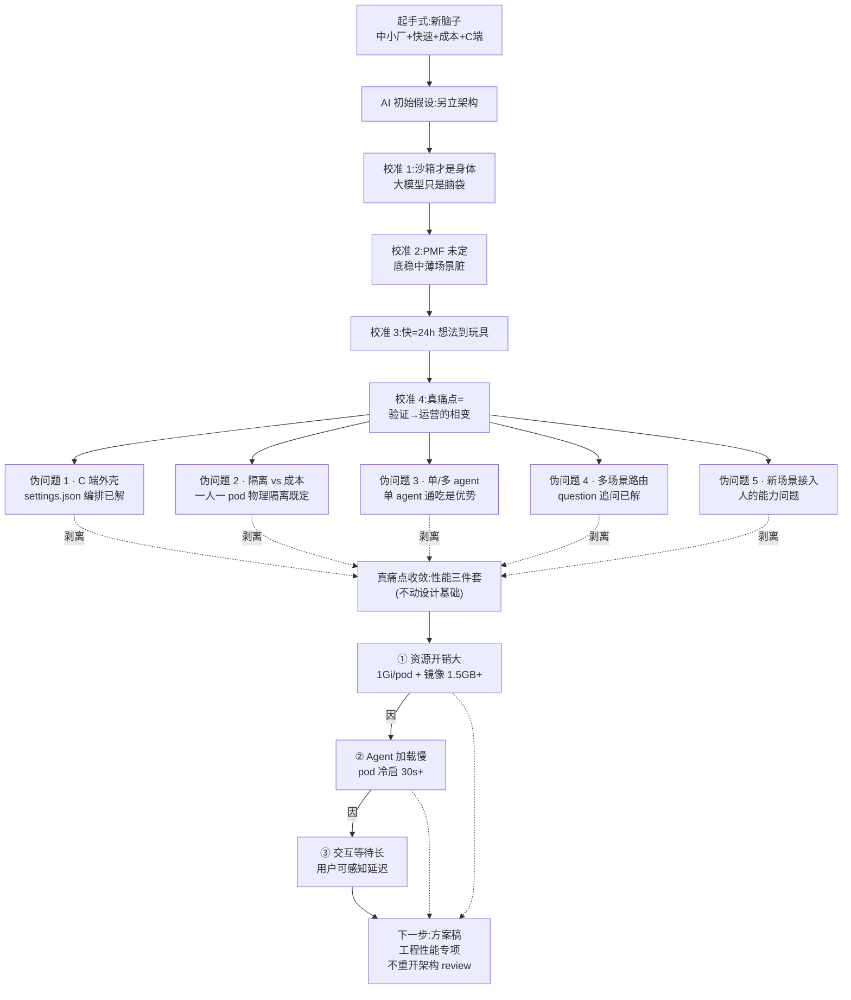

# C 端 Agent 基座 · 脑风暴对齐稿

> **文档性质**:这不是方案稿,是**脑风暴过程稿**。
>
> **产出场景**:2026-07-17,魏祖潇与 AI 就"新脑子"的一次结构化对谈,目的是把散在多个仓库、多份实践、多个隐性判断里的东西拉到一张纸上,先把问题定义清楚,再往下走。
>
> **阅读方式**:从上往下顺着读——上半段是"以为要解决的问题",中段是被逐次校准掉的伪问题,下半段才是真痛点与真约束。**校准过程本身比结论更重要**。
>
> **不是**:架构决策书、技术选型报告、实施计划。方案稿在这份对齐拍板后另立。

---

## 一、起手式:一句模糊的需求

**用户原话**:

> 我想要有个新脑子,去中小厂也能快速搭建起来,成本 hold 得住的,能够面向 C 端消费级的 agent 产品。

**AI 拿到这句话的直觉解读**:

- 中小厂 → 资源约束
- 快速搭建 → 开发效率
- 成本 hold 得住 → 边际成本可控
- C 端消费级 → 用户量级 + 交互门槛
- Agent 产品 → 具备大模型 + 上下文 + 工具的智能体形态

**第一反应的假设**——用户想要一份"新架构方案",在现有的 `0xE0_设计方案/` 下另立山头,不属于 `Agent产品体系架构`、也不属于 `browser-runtime` 三阶段,是第 N 条路。

**这个假设很快被打脸——**这不是要"从零起个新架构",是要"把现有资产从验证态过渡到运营态"。往下走的每一步都在纠正这个初始偏差。

---

## 二、心智模型的四次校准

### 校准第一次:agent 是什么

**AI 起初的分层解读**:LLM 无状态,沙箱是身体,MCP 是手脚,会话是记忆。

**用户当场纠正**:

> 沙箱是 agent 的身体,大模型只是脑袋,MCP 或工具是手脚。跟用户对话是服务,以会话方式记忆过程和内容。

**校准结果**:

| 组件 | 角色 | 特性 |
|---|---|---|
| **大模型** | 脑袋 | 无状态、按 API 调用、认知不持久化 |
| **沙箱** | 身体 | 有状态执行体、持有工作目录、进程、MCP 连接 |
| **MCP / Tool** | 手脚 | 通过标准协议给身体接上外部世界的操作能力 |
| **会话服务** | 记忆 | 服务层维护对话上下文与过程内容 |

**关键判断**:agent 的"身体"这个词是核心。没身体的 LLM 只是聊天机器人,有身体才成 agent。**身体怎么分配**这件事,决定了成本和隔离的所有取舍。

---

### 校准第二次:业务场景是怎么被定义的

**AI 起初的假设**:一个业务场景 = 一份 AGENTS.md + 若干 skill + 若干 MCP + 若干前端 view,打包成"场景包",基座启动时加载。业务方只写场景包不碰基座。

**用户当场纠正**:

> 本质现在业务是模糊的,想法是要快速验证的。所以我们也不知道基座是如何被使用的。

**校准结果**:

- 目标不是"交付一套定义好的场景规范",目标是 **PMF 未定阶段的快速验证**
- 底层要稳,中层要薄,场景层可以脏
- 不要过早锁定业务契约,给场景层留最大灵活性

**关键判断**:PMF 未定阶段的架构目标 ≠ 生产阶段的架构目标。前者要**支持一切可能**,后者要**收敛所有确定**。这两种状态需要不同的设计取舍。

---

### 校准第三次:什么叫"快速"

**AI 起初的假设**:快速 = 月级出 MVP、周级迭代、季度级判断商业化。

**用户当场纠正**:

> 天级——想法到玩具 24h。

**校准结果**:

- 快速的锚点是 24 小时内从想法到玩具
- 基座必须**开发者体验优先**,任何一步流程超过半天都算失败
- 牌面能阿拉二就阿拉二,不追求形式主义

**关键判断**:这个"24h"锚点直接排除了任何"重架构"的候选路线——凡是新增业务需要动到基座内核、需要跨仓改动、需要走多轮评审的方案,都不满足这个锤子。

---

### 校准第四次:真正的痛点在哪

这是**分水岭级的一次校准**。AI 一直在按"快速验证"这个方向组织问题,给了三条候选路线(Serverless 冷/热两级沙箱、常驻多租户集群、双基座 SDK),让用户选一个。

**用户没选,直接跳出这个问题空间**:

> 你理解下我现在的做法,事实上对验证交付是能够高效的,但运营是不好 hold 的。
>
> 我采用了模块化思想,用的是 MIT 开源产品,我只是编排角色和指令或者技能封装,按需写一些脚本就能快速验证业务场景可行性和价值的。
>
> 但交付的成本和收益就无法产生更大收益,因为交付的成本和收益是线性上升的。

**AI 复述真痛点**:

> 真正的痛点不是"怎么快速验证"——那你现在编排 AGENTS.md + skill + MCP + 脚本已经解决了,天级验证是够用的。
>
> 真正的痛点是**"从验证态切到运营态"这一步**——现在的编排式做法一旦要交付/服务真实用户,交付成本和收益是线性的:每加一个业务就要独立部署一套、每加 100 个用户就要多一份基础设施钱,收益也是线性甚至次线性,永远做不出规模效应。
>
> 所以这套新方案不是重造验证工具,而是要提供**"验证 → 运营"的相变通道**——同一份业务描述(AGENTS.md/skill/MCP 编排),验证时轻,运营时能承接多租户 C 端流量,但运营态的边际成本必须是次线性的(1 万用户 ≠ 100 × 100 用户的钱)。

**用户回应**:

> 对,你提炼到位了。

**关键判断**:痛点从"效率"转到"规模化"。这是完全不同性质的问题——效率是"更快",规模化是"多了不成正比涨"。前者靠工具链,后者靠架构。


---

## 三、被否掉的伪问题(记录一遍,防止未来又走一遍弯路)

这一节留档不是罗嗦,是**防止未来某天又有人来问一遍同样的问题、又走一遍同样的弯路**。已经想清楚不选的东西,写下来备份。

### 伪问题 1:C 端外壳到底怎么切

AI 一度纠结:C 端用户面前那一层要怎么切?给了四条路(裁剪 IDE、编译成独立 Web、双态 SDK、vsix 只管大脑 UI 另搭)。

**用户已经回答了,而且用作品回答**:

`beta.cloudlab.top/agent-runtime` 已经跑起来了,一张截图说明一切——用户看到的就是一个正常的 Web SaaS 页面,左边"开启新对话/智能出题"、中间对话流、右边业务预览(.paper 文件的题目卡片),**没有任何"我在用 IDE"的感知**。

技术上是靠一份 `settings.json` 达成的:

```json
{
  "workbench.activityBar.location": "hidden",
  "workbench.statusBar.visible": false,
  "workbench.layoutControl.enabled": false,
  "workbench.editor.limit.value": 1,
  "workbench.editor.limit.perEditorGroup": true,
  "workbench.editorAssociations": {
    "**/*.md": "vscode.markdown.preview.editor"
  },
  "autoHide.autoHideSideBar": true,
  "autoHide.autoHidePanel": true,
  "yunyan.openWebviewOnStartup": true,
  "files.exclude": {
    "**/.opencode": true,
    ".env": true
  }
}
```

**没有一行改内核**。全部是 VSCode 标准 API(settings / editorAssociations / Webview / Extension API)。所以"C 端外壳"这个问题已经解决,不是新方案需要再想的。

### 伪问题 2:数据隔离和成本的两难

AI 一度以为数据隔离和成本是核心矛盾,想拉分级隔离方案(硬隔离 vs 软隔离)。

**用户直接给答案**:

> 隔离现在是一人一 pod nas 挂载数据,物理直接隔离了。

一人一 pod 已经决定了物理隔离,不用再讨论"要不要软隔离"、"哪些数据能共享实例"。**这是既定事实,不是待选方案**。

代价是成本上不去,这才是真问题——但问题不在"隔离方式",在"pod 太重"。

### 伪问题 3:一个 agent 还是 N 个 agent

AI 一度以为"多场景要不要多 agent"是设计问题。

**用户直接给答案**:

> agent 只有一个,业务只是安装不同的 agent 插件和交互插件,这不是问题是优势。

这是**核心设计不动的部分**。就像 VSCode 只有一个二进制、场景靠插件生长,agent 也应该只有一个内核,业务场景靠 skill/MCP/vsix 插件生长。

一个 agent 通吃是设计原则,不是限制。**任何后续讨论不能触碰这个原则**,谁挑战这条谁被打回。

### 伪问题 4:多场景共存与路由

AI 一度以为多场景并存需要引入"场景 router"、"场景注册中心"这类新组件。

**用户直接给答案**:

> 我们设计了 question 追问确认模式,只要意图清晰自然按规则和流程设计执行。

意图识别不是技术问题,是业务问题(agent 追问用户 → 用户明确意图 → agent 按流程走)。**不需要架构层新组件**。

### 伪问题 5:新场景接入成本

AI 一度以为"新场景接入需要更薄的 SDK"。

**用户直接给答案**:

> A(新场景接入成本高)要靠业务 + 时间作为解药的,不是关键,新场景要开发是人的能力问题不是技术问题。

新场景接入慢是**人的能力问题**,是团队能力增长的自然过程,**不是架构可以再压缩的空间**。技术上给到"编排式验证"已经是极限。

---

## 四、真痛点收敛(第四次校准之后剩下的东西)

前三节把伪问题剥掉之后,剩下的**必须解决的、只靠工程手段能解决的真痛点**如下:

### 真痛点(现有架构不动,重压性能三件套)

**约束**:不动现有设计基础——不换架构、不砍隔离、不换 agent 形态、不重设交互范式。

**要解决的三件事**:

1. **交互等待时间长**——用户按下发送到看到第一个字反馈的端到端延迟太高
2. **Agent 加载慢**——pod 冷启 + opencode 起服务 + 上下文准备的总时间
3. **资源开销大**——单 pod 内存/CPU 占用高,并发上得去但边际成本仍然重

**用户对痛点的确认**:

> 对,完全提炼到位。

### 三件套之间的因果链

这三件事不是并列关系,是因果链:

```
资源开销大
  ↓ 影响
单节点能塞多少 pod(密度)
  ↓ 影响
是否能池化、能否预热、能否复用
  ↓ 影响
冷启动策略
  ↓ 影响
Agent 加载时间
  ↓ 影响
交互等待时间(用户可感知)
```

**上游是资源开销,最下游是用户可感知的等待**。压下游延迟,必须先动上游成本。

### 三件套之间的关系澄清

- **它们是工程性能问题,不是架构问题**——不会重新拉架构 review,只会拉性能优化专项
- **必须在"不动现有设计基础"的约束下解**——这条是硬约束,别的都是软的
- **压下去之后,C 端商业模型才能成立**——现在的成本模型是"服务不起 C 端 + 无法规模化",压下去之后**才有资格谈 C 端消费级**

---

## 五、脑图:整个对话的最终结构




---

## 六、既有资产的自我盘点(校准过程中拉通的现状)

对话过程中,AI 从工作区读了下列现有资产,校准后的资产地图如下——**这不是要新造什么,是要看清手里已经有什么**。

### 6.1 大脑层(已成型,不动)

| 资产 | 状态 | 定位 |
|---|---|---|
| OpenCode server | 生产在跑 | agent 运行时基座 |
| 模型网关(LiteLLM / New API 选型) | 已选型,`模型网关技术选型.md` | 统一 OpenAI 兼容接口,便于多模型路由 |
| AGENTS.md / skill / MCP / agent 定义 | 已成范式 | 业务编排的胶水层 |

### 6.2 身体层(已实现前期,后期存在演进路径)

对应 `03-开源资产/browser-runtime/` 的三阶段:

| 阶段 | 公式 | 状态 |
|---|---|---|
| **前期**(现有生产) | `code-server + opencode + vsix + plugin → k8s pod = agent` | 已交付,一人一 pod,NAS 挂载,1Gi 内存 30s+ 冷启 |
| **中期** | `opensumi + vsix → 浏览器 + opencode + plugin → k8s pod = agent` | 未启动,IDE 渲染下沉浏览器,单 pod 降至 256Mi |
| **后期** | `opensumi + vsix + qemu-wasm + opencode + plugin → 浏览器 = web vm = agent` | 未启动,agent 整体进浏览器,服务端 ≤64Mi |

**当前对话认知**:后期(Web VM = agent)是**长期演进方向**,不在本次讨论范围。**本次讨论的核心是:中期启动的前置问题**——中期的公式是 `opensumi + vsix → 浏览器 + opencode + plugin → k8s pod = agent`,IDE 渲染下沉浏览器之后,**pod 侧留下的 opencode + plugin 必须先压到中期能承接的水位**(内存 256Mi、镜像 300MB、冷启 5s+),否则中期上线不成立、warm pool 起不来、密度上不去,C 端商业模型接不住。

所以性能三件套的解决,不是"在前期形态内做工程优化",而是**给中期铺前置**:让方案落地之后,pod 侧只需再拔掉 code-server 就能自然达到 browser-runtime README §5.9 的中期资源模型。

### 6.3 手脚层

| 资产 | 状态 |
|---|---|
| `agent-plugin` | OpenCode 场景化插件集合,生产在用 |
| `vscode-plugin`(桥接) | 用户界面桥接层,生产在用 |
| MCP 工具集 | 按业务场景增长中 |

### 6.4 交互层(校准之后的关键发现)

**用户已经跑通了 C 端交互**——`beta.cloudlab.top/agent-runtime` 是活的产品,不是设想。

三层平台的定位在用户口中被讲清楚了:

> 关于 opensumi 或 vscode,在我看来它们的本质对我而言跟 opencode 一样,是一个平台,是产品形态的基础设施!
>
> 我不要从 0 到 1 去做产品设计和底层的功能实现,而是在这个平台的基础上去生长业务。
>
> 为啥能这么干呢?原因它们是开源的,有插件生态,既是行业的标准又具备多平台的迁移能力。
>
> 这样我就可以推着我的团队在上面快速搭建我们自己的业务交互,验证产品价值了。
>
> 所以我并不是直接把这些作为产品能力给用户,而是**借着这个平台造功能做交付**。

这段话把整套哲学讲清楚了——**胶水哲学**:

| 平台 | 团队的胶水动作 | 团队短板被谁吸收 |
|---|---|---|
| **OpenCode 大脑** | AGENTS.md / skill / MCP / agent 定义 | 开源生态吸收 agent 内核开发能力 |
| **VSCode/OpenSumi 交互** | vsix 插件(标准 API 内) | 开源生态吸收 IDE/前端开发能力 |
| **容器 身体** | Dockerfile / K8s manifest / rootfs | 开源生态吸收运行时开发能力 |

**团队只写各自平台的插件/编排/配置**,不改任何平台内核。这样才能:

1. 交互友好——抄 VSCode 的 UI/UX 范式,不需要自己练
2. 低代码——vsix 开发范式是行业标准,新人上手快
3. 相变——同一份 vsix 从验证到运营都能跑

---

## 七、给下一步(方案稿)的输入

这份对齐稿的产出**不是方案**,而是给方案稿的输入。下一步方案稿要遵循以下约束:

### 7.1 硬约束(不动)

- ✅ 现有 K8s Pod + NAS 一人一 pod 架构不动
- ✅ 单 agent 通吃 + 场景靠插件生长不动
- ✅ 三层胶水哲学(OpenCode/VSCode/容器)不动
- ✅ question 追问模式已解意图识别,不新增路由层
- ✅ 24h 想法到玩具的编排范式不动

### 7.2 待攻的问题域(压性能三件套)

- 🎯 **交互等待时间**:目标是压到什么区间?端到端首字延迟目标?
- 🎯 **Agent 加载时间**:pod 冷启 30s+ → ? 秒;pod 热连的定义与命中率?
- 🎯 **单用户资源开销**:1Gi 内存 → ? Mi;能否池化、共享内核、分层加载?

### 7.3 待深挖的技术方向(候选,方案稿再排优先级)

不做承诺,只列**方案稿要展开评估的候选面**:

**面向"资源开销大"**:

- Pod 密度优化:JVM / Node 冷启压制、镜像瘦身、多阶段构建
- 分层文件系统:common rootfs + per-user overlay,避免全量拷贝
- Sidecar 池化:某些子系统(向量库、缓存代理)从 per-pod 拆到共享
- Namespace 级 QoS:CPU limits 弹性化、内存 request/limit 比调优

**面向"Agent 加载慢"**:

- Pod 预热池(warm pool):按业务场景预留 N 个空 pod,请求来了绑用户
- OpenCode server 启动时间优化:先启监听端口,后台异步 warmup
- 上下文预加载:AGENTS.md/skill 通过 base image 预烘焙
- Session 复用:用户重连时找回上次 pod 而不是新起

**面向"交互等待时间"**:

- 首字流式:LLM 首 token 前端就开始渲染,不等完整响应
- 前置缓存:同一 prompt / 同一 skill 组合的 embeddings / MCP 结果做缓存
- 网关层短路:轻量意图(问候、闲聊)不进 pod,由网关侧微模型直接回

**方案稿要做的事**是把上面这些候选**拉成一张性能优化路线图**,每条都要有:预期收益、改造成本、副作用、破坏面(是否触碰硬约束)、里程碑判定。

### 7.4 方案稿的写法建议

- 落位:`0xE0_设计方案/` 下另立 `C端Agent基座性能优化方案.md` 或类似
- 不写"新架构",写"现有架构下的性能治理"
- 三件套(等待/加载/资源)作为三个专项,每个专项独立评估
- 每个专项标注是否触碰 §7.1 的硬约束——**触碰即否决**
- 用度量数据说话:目标区间、当前基线、改造后预期,像 `browser-runtime` 三阶段表那样

---

## 八、附录:对话过程的关键节点回放

留档节点,便于日后对照初心:

| 节点 | AI 假设 | 用户校准 | 结论 |
|---|---|---|---|
| N1 | LLM 是脑袋 | 沙箱才是身体,身体分配是核心 | agent 四件套定位钉死 |
| N2 | 场景包声明式定义 | 业务是模糊的,PMF 未定 | 底稳中薄场景脏 |
| N3 | 快速 = 月/季度锚点 | 24h 想法到玩具 | 排除一切重架构 |
| N4 | 隔离 vs 成本二选一 | 一人一 pod 已解,只剩成本 | 隔离出局,成本入局 |
| N5 | 单 agent vs 多 agent | 单 agent 通吃是设计原则 | 场景靠插件生长 |
| N6 | 需要新场景路由层 | question 追问已解意图 | 不加新组件 |
| N7 | 三条候选架构路线 A/B/C | 都不选,真痛点是相变通道 | 从架构问题转到性能问题 |
| N8 | vsix 是 C 端分发载体 | vsix 只是插件标准,是胶水 | 平台是基础设施不是产品 |
| N9 | 需要新架构方案 | 不动设计基础,重压性能三件套 | 本文最终定稿 |

---

## 九、这份稿子的用法

- **今天的用法**:回来之后你先扫一遍,看有没有校准偏差、有没有伪问题被误判成真问题、有没有真痛点漏了。
- **明天的用法**:如果你确认脉络对了,我们再进方案稿——只针对性能三件套,不碰其他。
- **一个月后的用法**:如果有新同事进来问"我们为什么不做 A/B/C 方案",给他看这份稿的第三节,让他知道那些问题已经在 2026-07-17 想过了、为什么被排除。
- **一年后的用法**:如果哪天 C 端商业模型撑起来了,回头看这份稿——**当年真正卡住我们的不是想法,是把想法定义清楚**。

---

**产出者**:魏祖潇 + AI(opencode ark-code-latest)
**产出日期**:2026-07-17
**下一步**:待用户回来对齐后,启动方案稿撰写。
