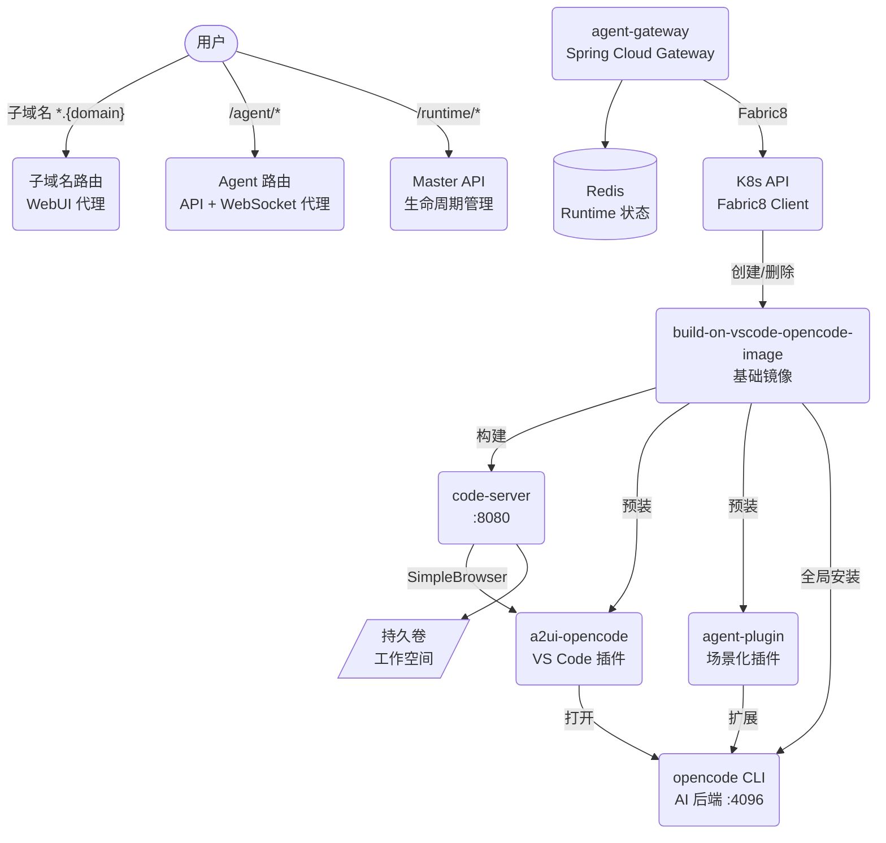
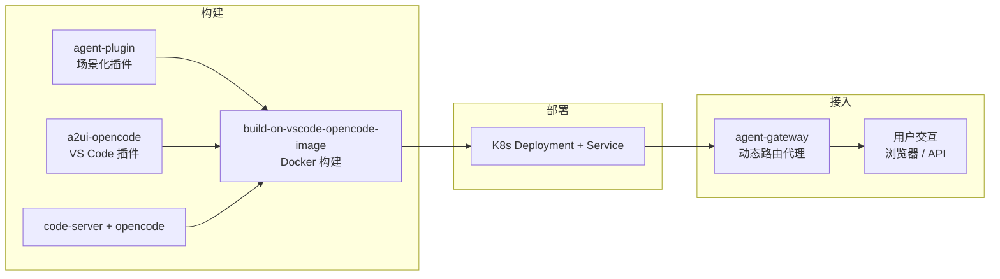
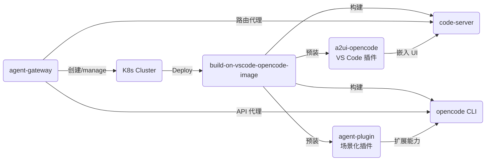
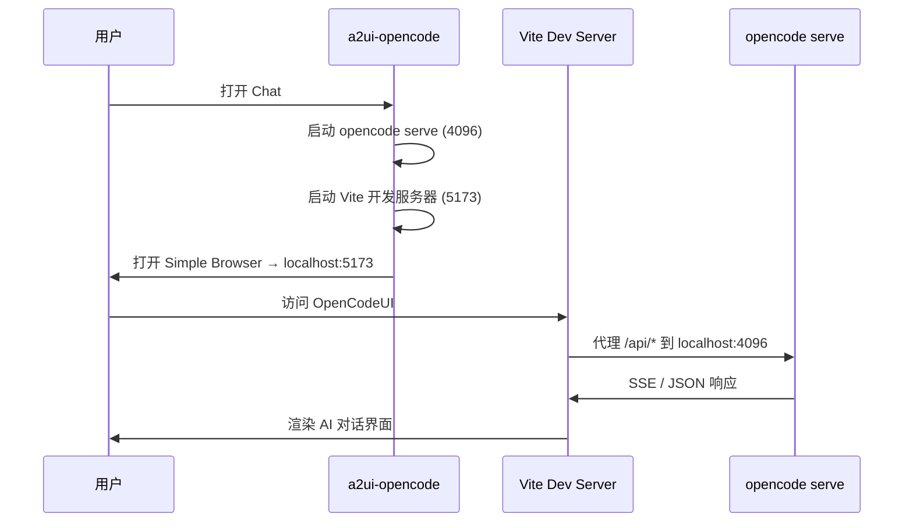
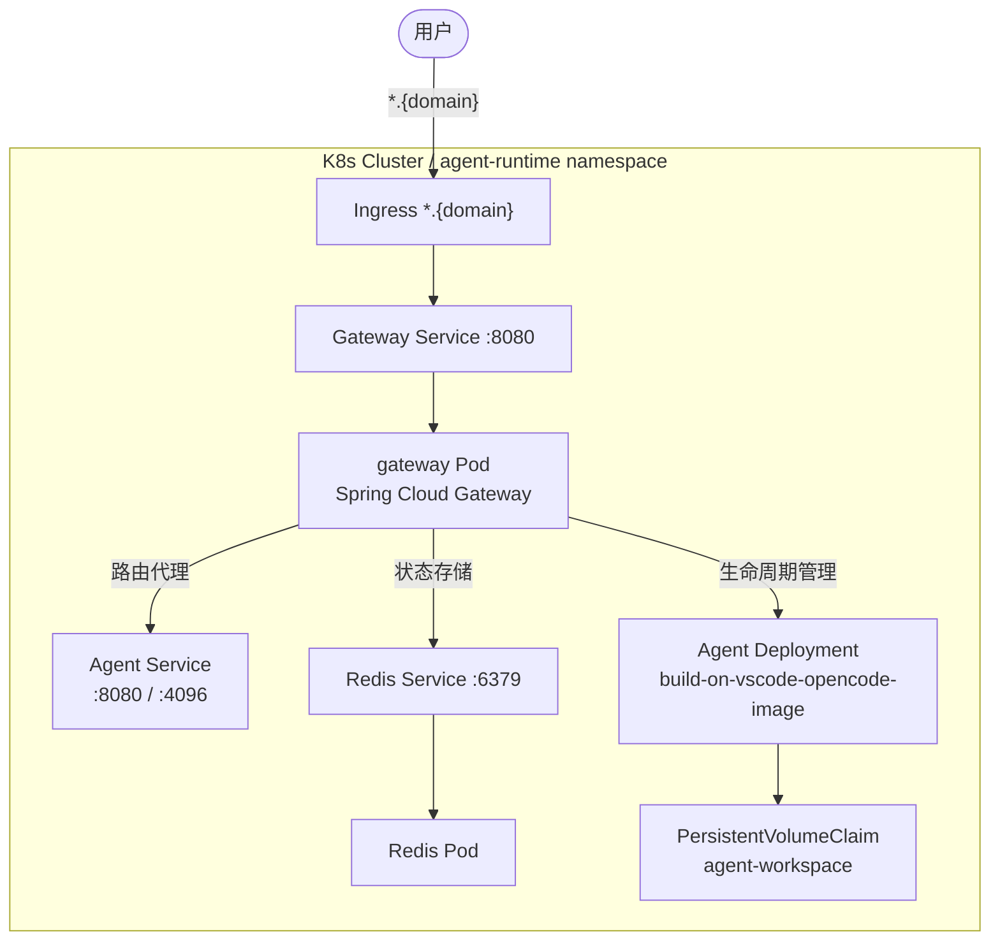
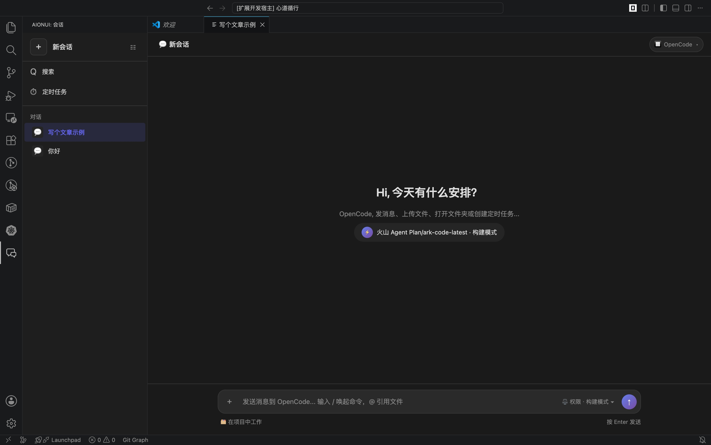

# Agent 产品体系架构

## 产品构成

Agent 产品由 4 个核心项目构成，按职责分层：

| 项目 | 角色 | 技术栈 | 仓库地址 |
|------|------|--------|---------|
| **agent-gateway** | 控制面 + 流量入口 | Java 17, Spring Cloud Gateway, K8s Fabric8, Redis Reactive | `https://github.com/ArchAIHarness/agent-gateway.git` |
| **build-on-vscode-opencode-image** | 运行时基础镜像 | Docker, code-server, OpenCode CLI, Node.js 20, Python3 | `https://github.com/ArchAIHarness/build-on-vscode-opencode-image.git` |
| **a2ui-opencode** | VS Code 插件（用户界面） | TypeScript, VS Code Extension, OpenCodeUI, Vite | `https://github.com/ArchAIHarness/a2ui-opencode.git` |
| **agent-plugin** | 场景化能力插件集合 | OpenCode Plugin 格式, Agent 定义, Skill, Tool | `https://github.com/ArchAIHarness/agent-plugin.git` |

---

## 架构总览

---

## 设计流程

---

## 组件关系

---

## 各项目详情

### 1. agent-gateway（智能网关）

**定位**：Agent 产品的中枢控制面 + 流量入口。

职责：
- **生命周期管理**：通过 K8s Fabric8 客户端在集群上创建/删除/重启 Agent 实例
- **子域名路由**：`{runtimeId}.{domain}` → Agent WebUI（`:8080`）
- **Agent API 代理**：`{domain}/agent/**` → OpenCode API（`:4096`）
- **WebSocket 透传**：二进制零修改，支持 Terminal / LSP / DAP
- **状态存储**：Redis 双索引（runtimeId / userId），TTL 自动过期回收

**技术栈**：Java 17 + Spring Cloud Gateway + WebFlux（全反应式）+ Fabric8 + Redis Reactive

### 2. build-on-vscode-opencode-image（基础镜像）

**定位**：每个 Agent 实例运行时的容器底座。

组成：
- **code-server**：VS Code 网页版编辑器，监听 `:8080`
- **OpenCode CLI**：全局安装的 AI 后端
- **a2ui-opencode**：预装的 VS Code 插件
- **agent-plugin**：预装的 OpenCode 场景化插件
- **运行时**：Node.js 20 + Python3 + git + curl

关键设计：
- 扩展与用户数据固定在 `/opt`，不受工作目录挂载影响
- `seed-if-absent`：默认开箱即用，业务配置可完全接管
- 环境变量可覆盖：`BIND_ADDR`、`WORKSPACE_DIR`、`DISABLE_AUTH` 等

### 3. a2ui-opencode（VS Code 插件）

**定位**：在 VS Code 编辑器内嵌入 OpenCodeUI 前端界面。

工作方式：
- 插件激活 → 启动 `opencode serve --port 4096`
- 同时启动 OpenCodeUI Vite 开发服务器 `:5173`
- Vite 代理 `/api/*` → `localhost:4096`
- VS Code Simple Browser 或系统浏览器打开 OpenCodeUI

**通信链路**：

### 4. agent-plugin（场景化插件集合）

**定位**：为 Agent 提供可插拔的场景化能力扩展。

格式：OpenCode 官方插件格式，通过 `opencode.json` 的 `plugin` 配置动态加载。

内容：
- `agents/*.md`：场景化 Agent 角色定义
- `skills/**/SKILL.md`：场景化 Skill 技能包
- `tools/**`：自定义工具脚本

不修改 `agent-gateway` 或 `build-on-vscode-opencode-image` 核心代码，完全解耦。

---

## 部署架构

---

## 运行效果

在 code-server 中通过 a2ui-opencode 插件打开 OpenCodeUI，与 AI Agent 对话：

---

## 相关文档

- `05-工程研发/INDEX.md` — 研发仓库索引
- `05-工程研发/agent-gateway/README.md` — 网关详细文档
- `05-工程研发/build-on-vscode-opencode-image/README.md` — 镜像构建文档
- `05-工程研发/a2ui-opencode/README.md` — VS Code 插件文档
- `05-工程研发/agent-plugin/README.md` — 插件系统文档
