# Web Studio 个人工作台设计方案

> **阅读对象**:产品设计者、前端架构师、AI 工作台构建者
> **前置阅读**:[OpenCode 全体系深度解析](../0xD0_实践指南/OpenCode全体系深度解析.md)

## 一、产品定位与核心价值
### 1.1 产品定位
Web Studio 是一款面向个人、以浏览器为载体的线上工作台。无需安装客户端，打开浏览器就能完成文档创作、代码编写、程序运行、文件管理、AI 辅助等全链路工作，形成一套完整的线上工作闭环。

它和常见的在线编辑器、云笔记、云端开发工具不同，核心不是某一类功能工具，而是围绕个人完整工作流打造的专属线上工作空间。不管是日常写文档、做笔记，还是写代码、跑程序、管理个人项目，全部在一个页面内完成。

很多人会把它和在线IDE、云笔记弄混，但本质上有很大区别。在线IDE核心只解决写代码、跑代码的问题；云笔记主打文档记录；而Web Studio是把个人工作需要的所有能力整合在一起，不偏向某一个单一场景，而是覆盖从想法记录、内容创作、代码开发、任务执行到文件沉淀的全流程，真正做到一个平台搞定所有事。

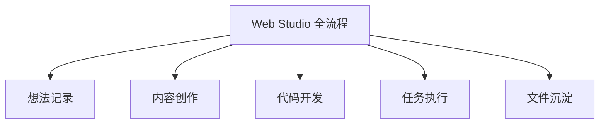

### 1.2 核心用户群体
1. **个人开发者**
很多独立开发者、学生开发者，平时写一些小项目、脚本工具，不想在本地开发。换一台电脑就要重新配置环境，非常麻烦。Web Studio刚好解决这个痛点，打开浏览器就能写代码、调代码、跑代码，前端、后端、脚本开发都能覆盖，不用再折腾本地环境。

2. **内容创作者、学习者**
做内容的人经常要写笔记、整理资料、写教程，有时候还需要插入代码片段、运行结果。传统笔记软件要么不支持，要么需要来回切换编辑器、运行工具。学习者平时整理课程资料、做练习、写作业，需要一个统一的地方存放、查看、修改，Web Studio可以把资料、练习、运行结果放在一起，方便后续复习、复盘。

3. **科研、学生群体**
做科研、理工科学习的人，经常需要运行实验代码、处理数据、查看结果。本地电脑配置不够，跑复杂实验容易卡顿；换设备之后实验环境又要重新搭。Web Studio可以把实验代码、数据文件、运行日志统一保存，云端算力跑实验，随时随地都能接着之前的工作往下做，不用被设备和环境限制。

4. **职场办公人群**
很多职场人日常工作需要写文档、整理资料、处理一些简单脚本、统计文件。传统办公软件都在本地，.外出、出差的时候没法打开自己的工作文件。Web Studio可以把日常工作文档、文件统一存放在云端，跨设备随时打开，随时修改，不用带着电脑到处跑，轻量办公更灵活。

### 1.3 解决的核心问题
1. **工具分散，切换成本高**
几乎所有人工作都会遇到这个问题：写文档用一个软件，写代码用另一个软件，运行代码又要打开终端，文件存在不同文件夹里。做一件事就要来回切换好几个软件，光是打开、关闭、切换界面就要浪费很多时间。Web Studio把所有功能整合在一个页面，不用切换软件，所有操作都在一个界面里完成，大大节省操作时间。

2. **本地环境配置繁琐，跨设备难复用**
不管是写代码还是做实验，本地环境配置都是最麻烦的一步。安装软件、配置依赖、设置环境变量，一套流程下来要花很久。更麻烦的是，换一台电脑、重装系统之后，所有配置都要重新来一遍。Web Studio把所有运行环境放在云端，用户不用管配置，打开就能用，换设备也不用重新设置，环境跟着账号走。

3. **工作资产分散，版本混乱易丢失**
很多人文件管理习惯不好，文档、代码、资料随便存，有时候存在桌面，有时候存在D盘，有时候放在U盘里。时间久了，自己都找不到文件在哪里。修改文件的时候，经常复制多个版本，"最终版""最终最终版"，越改越乱，想回到之前的版本根本找不到。Web Studio统一管理所有文件，自带版本记录，每一次修改都有痕迹，随时可以找回历史版本，再也不怕文件乱、文件丢。

4. **本地算力不足，复杂任务跑不动**
普通办公电脑、笔记本配置有限，跑大型代码、数据处理、仿真实验的时候，经常出现卡顿、死机、崩溃的情况。想升级电脑又要花钱，而且外出的时候没法用高性能电脑。Web Studio提供云端算力，复杂任务放到云端运行，不受本地设备性能限制，随时随地都能跑大任务。

5. **上手门槛高，普通用户不会用专业工具**
很多版本管理、环境管理工具，比如Git、Docker，专业开发者用起来都需要学习，普通用户根本搞不懂。大家只想简单写东西、跑东西，不想花时间学复杂工具。Web Studio简化了很多专业操作，不用懂命令行，不用学复杂配置，普通用户也能轻松上手。

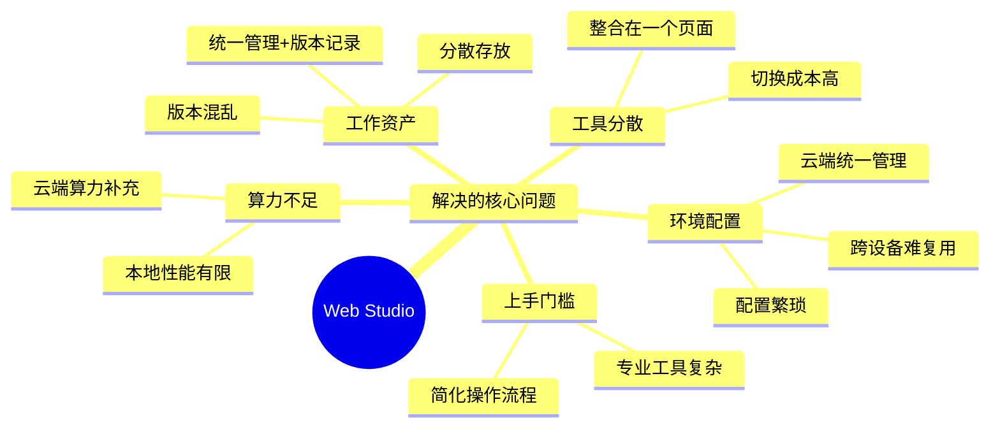

### 1.4 产品核心价值
1. **统一工作入口，简化操作流程**
一个浏览器页面，覆盖文档、代码、运行、文件、AI所有工作场景。用户不用再记忆不同软件的打开方式、保存位置，所有工作都在同一个入口完成，操作更简单，流程更顺畅，专注于内容本身，而不是操作工具。

2. **零配置上手，随时随地开展工作**
不用下载软件、不用安装插件、不用配置环境，打开浏览器登录账号就能用。不管是家里电脑、公司电脑、平板，只要能打开浏览器，就能进入自己的工作空间，跨设备无缝衔接工作，不用被地点和设备限制。

3. **双模式运行，兼顾效率与算力**
简单的小脚本、小代码，直接在浏览器里本地运行，不用上传云端，秒出结果，响应速度快；复杂的代码、大型任务，切换到云端运行，利用云端算力，不用担心本地电脑跑不动，两种模式灵活切换，适配不同工作场景。

4. **统一资产管理，安全可控可追溯**
所有文档、代码、文件、运行记录都保存在云端，不会因为电脑故障、误操作丢失。系统自动记录每一次修改，用户可以随时查看修改历史、对比内容差异、恢复旧版本。个人工作资产长期沉淀，方便后续复盘、复用。

5. **AI全流程辅助，降低工作难度**
AI不是单独的功能，而是嵌入整个工作流程里。写文档的时候，AI帮忙润色、写大纲；写代码的时候，AI帮忙补全、解释代码；代码报错的时候，AI帮忙排查问题；遇到不懂的知识点，直接和AI对话。不用切换到其他AI工具，全程在工作台内完成，提升工作效率。

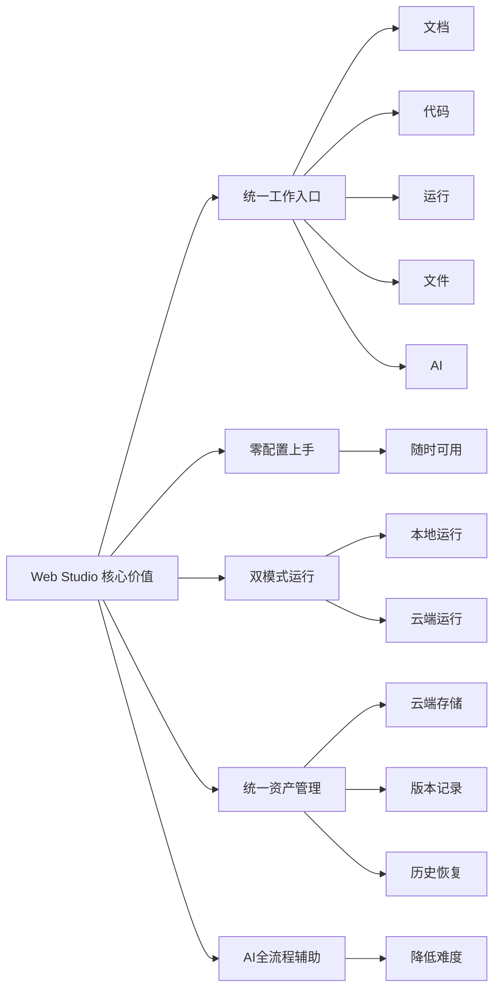

## 二、整体技术架构
Web Studio 整体分为四层，从上到下依次是交互层、平台层、数据层、运行时层。四层之间分工明确、相互配合，同时保持独立，后续新增功能、优化性能时，能单独调整某一层，不会影响整体系统稳定。

常规设计里，运行相关的环境不会直接对接存储，所有数据都要经过中间层转发。本产品的核心设计之一，就是运行环境可以直接访问存储，不用层层转发，数据流转更快，整个工作流程也更顺畅。

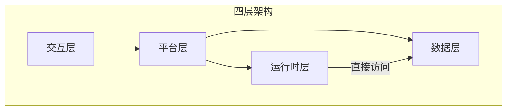

1. **交互层**：用户直接看到、直接操作的前端页面，是整个产品的使用入口。所有编辑、查看、操作都在这里完成。
2. **平台层**：接收前端所有请求，做统一处理、权限管控、资源调度，是系统的核心中枢，协调各个模块工作。
3. **数据层**：负责存储所有用户、项目、运行相关数据，是整个系统的存储底座，保证数据安全、稳定、可查。
4. **运行时层**：云端专门用来执行代码、运行任务的环境，承接各类运行需求，保障任务安全稳定执行。

四层架构的好处非常明显。如果所有功能都揉在一起，后续想改一个小功能，可能会影响整个系统。分层之后，每一层只负责自己的事，前端页面怎么改、后端调度怎么优化、存储怎么扩容、运行环境怎么升级，都可以独立调整，互不干扰，系统更稳定，迭代更灵活。

## 三、交互层
### 3.1 定位
交互层是用户直接接触的前端页面，用户所有的操作行为、结果查看，都集中在这一层。页面的流畅度、功能布局、操作逻辑，直接决定用户的使用感受。

对用户来说，交互层就是整个产品。用户不会关心后端怎么调度、数据怎么存、环境怎么跑，只关心自己点了之后有没有反应、操作顺不顺手、页面好不好看。所以交互层的设计，核心就是贴近用户日常使用习惯，简单、直观、好上手。

### 3.2 核心功能
1. **文档编辑**
支持富文本、Markdown 两种常用编辑方式，覆盖绝大多数人写东西的习惯。可以插入图片、表格、代码块、运行结果，内容排版灵活。不管是写日常笔记、工作文档、学习报告，还是写技术教程、项目说明，都能直接完成。编辑过程中内容实时保存，不用担心突然关闭页面、浏览器崩溃导致内容丢失。

很多人用传统笔记软件，插入代码会格式错乱，复制过来的运行结果没法直接放进去。Web Studio的文档功能解决了这个问题，代码、运行结果可以和文字、图片放在一起，整个文档内容更完整，逻辑更连贯。

2. **代码编辑**
适配前端、后端、脚本等主流编程语言，自带语法高亮、代码提示、格式化、折叠等常用功能。操作习惯和大家平时常用的编辑器保持一致，不用重新学习操作方式。多人写代码的时候，经常会遇到缩进不对、格式混乱的问题，这里可以一键格式化，让代码看起来更整洁。

代码编辑界面可以多文件同时打开，标签页切换，同一个项目里的多个文件可以快速切换查看，不用来回打开、关闭文件，操作更方便。

3. **本地运行**
很多时候用户只是想简单验证一段小代码、小脚本，比如写个小工具、测试一个小逻辑，没必要上传到云端。本地运行功能就是为这种场景设计的，代码写好之后，直接在浏览器里执行，不用经过后端、不用消耗云端资源，秒出结果，适合快速试错、快速验证。

运行结果、报错信息会直接展示在页面下方，不用切换界面，一边看代码一边看结果，调试起来更直观。

4. **文件管理**
以树形结构展示所有文件、文件夹，和大家电脑里的文件夹结构一样，上手不用适应。支持新建、删除、重命名、移动、归类文件，整个项目结构清晰明了。用户可以按照自己的习惯创建文件夹，比如"工作文档""学习资料""项目代码"，把不同类型的文件分开存放，找文件的时候一目了然。

文件支持在线预览，不用下载到本地，图片、文档、代码文件都可以直接打开查看，节省时间。

5. **AI 辅助**
AI功能不是单独的弹窗、单独的页面，而是直接嵌入在编辑、运行的各个环节。写文档的时候，选中一段文字可以让AI润色、扩写、写摘要；写代码的时候，选中代码可以让AI解释、优化、查错；代码运行报错的时候，直接把报错信息发给AI，让AI帮忙分析原因、给出解决方案；遇到不懂的知识点，随时可以打开AI对话窗口提问。

全程不用跳出工作台，所有辅助操作都在当前页面完成，不用切换软件，工作节奏不会被打断。

6. **结果展示**
不管是本地运行还是云端运行，日志、输出内容、报错信息都会统一展示在页面里。云端运行Web服务、接口服务时，会生成专属访问地址，用户可以直接点击链接测试、预览，不用自己配置复杂的访问方式。运行记录会保存下来，后续可以随时查看之前的运行结果、日志，复盘问题。

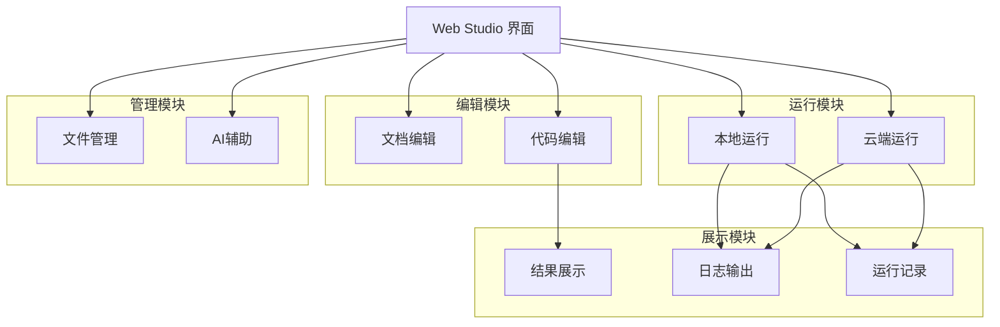

### 3.3 技术实现
1. **文档编辑**
基于 Tiptap 框架搭建，这个框架扩展性很强，可以灵活自定义各种格式和功能，刚好满足文档里插入代码、运行结果、图片的需求。同时它性能稳定，大篇幅文档编辑也不会卡顿，保证用户长时间写东西的时候流畅不中断。

2. **代码编辑**
使用 Monaco Editor，和VS Code编辑器是同一个内核。VS Code是绝大多数开发者、学习者都在用的工具，大家操作习惯已经很熟悉，用同一个内核可以保证操作体验一致，不用重新适应。而且这个编辑器对各种编程语言支持完善，语法检测、智能提示能力强，专业又好用。

3. **本地运行**
依托 WebContainer 技术，在浏览器内搭建一个轻量级的Linux运行环境。这个环境是隔离的，不会影响用户本地电脑，也不用后端服务器参与，完全在前端完成代码执行。启动速度快，占用资源少，完美适配小代码、小脚本快速运行的场景。

4. **前端整体**
采用成熟前端框架，组件化开发，把页面拆分成一个个独立模块，比如文档模块、代码模块、文件模块，后续修改、优化某个功能的时候，不会影响其他部分。页面加载做了优化，静态资源加速分发，保证打开速度快，操作响应及时，同时兼容Chrome、Edge等主流浏览器，不管用户用哪个浏览器都能正常使用。

5. **前后端通信**
封装统一的请求方式，所有前端操作请求都会标准化处理。网络不好的时候会自动重试，遇到异常情况会友好提示用户，保证前后端数据传输稳定，不会出现点击没反应、数据丢失的情况。

## 四、平台层
### 4.1 定位
平台层是整个系统的业务中枢，接收交互层发来的所有请求，负责权限校验、业务处理、资源调度，向上支撑前端使用，向下对接数据、运行环境，是连接前后端的核心。

如果把整个系统比作一个工厂，交互层是工厂的前台，用户在这里操作；平台层就是工厂的中控室，接收前台的所有指令，然后指挥仓库（数据层）存取东西、指挥车间（运行时层）生产，同时把控安全、分配资源，保证整个工厂有序运转。

### 4.2 核心功能
1. **用户管理**
负责账号注册、登录、信息修改、密码重置等基础操作。每个用户都是独立的，有自己专属的工作空间，别人看不到你的文件、运行环境、使用记录。用户可以设置自己的个人资料、偏好设置，比如页面主题、默认编辑器格式，打造符合自己习惯的工作台。

同时会记录用户的使用数据，比如注册时间、使用时长、常用功能，方便后续优化产品，贴合用户使用习惯。

2. **权限管控**
每个用户能做什么、能访问什么、能用多少资源，都有明确的权限限制。比如普通用户和付费用户的云端算力额度不一样，每个用户只能修改、删除自己的文件，不能访问别人的内容。

权限管控的核心是安全，防止越权操作、数据泄露。同时权限是细粒度的，不会一刀切，保证用户在自己的空间里有足够的操作自由。

3. **算力调度**
当用户发起云端运行请求时，平台层会根据用户的资源额度、任务类型、优先级，指挥运行时层创建对应的运行环境。任务启动、暂停、停止、销毁，都由平台层统一管控。

比如同一时间有很多用户发起云端运行，平台层会合理分配算力，优先保障紧急任务、付费用户的任务，保证大家都能正常使用，不会出现部分用户任务一直排队的情况。

4. **用量管理**
统计用户的文件存储大小、云端算力使用时长、AI调用次数等数据。结合用户的套餐规则，实时监控用量，快达到额度上限的时候会提醒用户，超出额度会限制部分功能，避免资源滥用。

这些用量数据也是商业化的基础，为不同套餐、付费模式提供依据，平衡免费用户体验和平台运营成本。

5. **请求处理**
所有前端发来的请求，都会先经过平台层过滤。非法请求、恶意请求、异常请求会直接拦截，比如频繁提交请求、违规操作，保证系统不被攻击、不卡顿。合法的请求会根据类型，分发到对应的服务处理，保证业务流程顺畅。

6. **异常处理**
系统运行过程中难免会出现各种异常，比如网络波动、数据读取失败、运行环境启动失败。平台层会实时捕获这些异常，简单异常会自动处理，复杂异常会给用户明确的提示，比如"环境启动失败，请稍后再试"，同时记录异常日志，方便后续排查问题、优化系统。

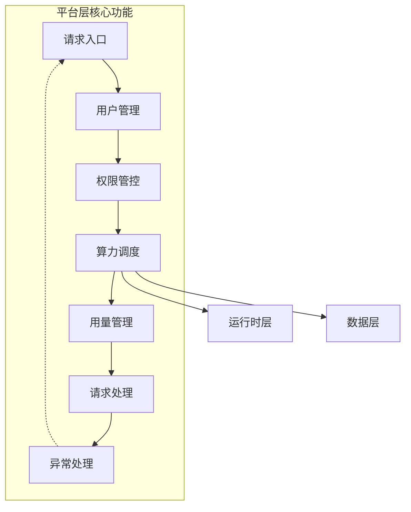

### 4.3 技术实现
1. **网关服务**
使用 Spring Cloud Gateway，作为所有请求的统一入口。它可以统一处理路由、鉴权、限流、日志记录，所有前端请求都先经过网关，安全又高效。网关把不同类型的请求分发到对应的业务服务，分工明确，处理更专业。

2. **业务服务**
基于 Spring Boot 拆分多个独立服务，用户服务、权限服务、调度服务、计费服务分开开发、分开部署。如果后续要优化用户登录逻辑，只需要修改用户服务，不会影响算力调度、计费等其他功能，系统更稳定，迭代更快。

3. **算力调度**
直接对接K8s原生接口，平台层可以直接指挥云端运行环境的创建、启动、销毁。不用自己开发复杂的调度逻辑，复用成熟的云原生能力，开发成本低，稳定性强。

4. **监控告警**
集成监控工具，实时查看每个服务的运行状态、资源使用情况、请求数量。如果某个服务异常、资源占用过高，会及时告警，运维人员可以快速排查处理，保证系统24小时稳定运行。

## 五、数据层
### 5.1 定位
数据层是系统的存储底座，负责保存用户、项目、运行相关的所有数据，同时为云端运行环境提供文件读写支持，保障数据安全、高效流转。

用户在平台上产生的所有东西——账号信息、写的文档、写的代码、运行日志、版本记录，最终都会落到数据层。数据层就像一个巨大、安全的仓库，把所有数据分类存放，保证需要的时候能快速找到、安全使用。

### 5.2 核心功能
1. **业务数据存储**
保存用户账号信息、权限配置、项目基础信息、用量记录、系统配置等结构化数据。这些数据格式固定、查询频繁，比如用户登录的时候要查账号、权限，发起云端运行的时候要查剩余算力额度。

数据存储的时候会做优化，常用的查询会建立索引，保证查询速度快，不会出现登录卡顿、请求响应慢的情况。同时会保证数据准确，不会出现重复、丢失的问题。

2. **缓存加速**
把登录状态、常用配置、权限信息、热门项目元数据这些高频访问的数据缓存起来。用户每次操作不用都去查数据库，直接从缓存里读取，速度更快，也能减轻数据库压力。

缓存会设置有效期，定期更新，保证缓存里的数据和数据库里的一致，不会出现用户已经修改了设置，页面还是显示旧内容的情况。

3. **异步处理**
沙箱启停、日志上报、用量统计、计费结算这些操作，不用用户实时等待。平台层发起指令之后，数据层通过消息队列异步处理，处理完成之后再更新状态。

这样做的好处是，用户操作完可以直接做下一件事，不用等系统处理完，前端响应更流畅；同时大量耗时操作不会集中在一起，避免系统卡顿、崩溃。

4. **文件存储与版本**
用户所有文档、代码、运行产物、图片等文件，都会统一保存。系统会记录每一次文件修改，包括修改时间、修改内容、修改人。用户可以随时查看历史版本，对比不同版本的差异，遇到误删、改错的情况，可以一键恢复到之前的版本。

很多人之前用云盘、本地文件夹，根本没有版本概念，改错了就只能重写。这里的版本功能，就是帮用户把每一次修改都保存好，给工作加一道安全锁。

5. **静态资源分发**
平台的图片、图标、页面样式、脚本等静态资源，统一存放在对象存储里，通过加速网络分发。用户打开页面的时候，这些资源会从离自己最近的节点加载，页面打开更快，不会出现图片加载慢、页面空白的情况。

6. **对接运行环境**
云端运行环境启动的时候，会自动挂载用户的个人文件目录。运行的时候，环境可以直接读取用户写的代码、配置文件；运行产生的新文件、日志、结果，会自动保存到数据层的个人目录里。

这个功能是整个产品的核心，打通了"写代码—跑代码—存结果"的全流程。用户在前端写好代码，云端直接读取；云端跑出来的结果，直接保存到用户文件里，不用手动上传、下载，流程连贯。

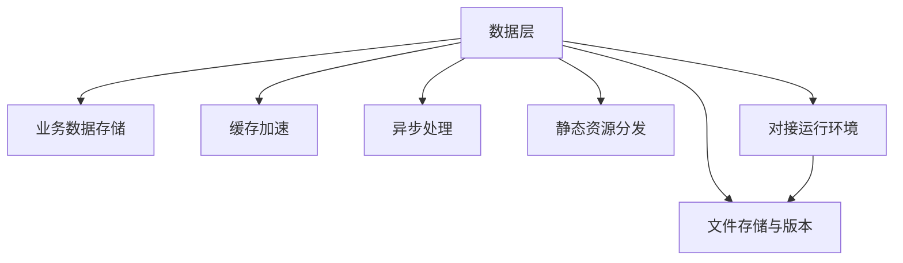

### 5.3 技术实现
1. **结构化数据**
使用关系型数据库，支持事务、复杂查询，保证数据准确、稳定。用户信息、权限配置这些核心数据，会做备份，防止数据丢失。

2. **缓存**
采用 Redis 分布式缓存，读写速度快，适合高频访问数据。可以设置过期时间、分布式锁，解决多用户同时操作导致的数据不一致问题。

3. **异步处理**
使用 Kafka 消息队列，吞吐量大、稳定性强，能处理大量异步任务。任务会持久化保存，就算系统临时重启，任务也不会丢失，后续可以继续处理。

4. **文件存储**
采用 NAS 存储，适合大量小文件、大容量存储，支持远程挂载访问。**NAS底层会按用户账号做目录隔离，每个用户只拥有自己目录的读写权限，跨用户之间完全隔离。** 哪怕运行时层直接挂载NAS，也只能访问当前用户的专属目录，绝对不会出现A用户的代码读取到B用户文件的情况，从存储底层锁死数据边界。

5. **静态资源**
使用对象存储，成本低、扩展性强，搭配CDN加速分发，覆盖全国节点，不管用户在哪个地区，都能快速加载资源。

6. **数据对接**
通过K8s存储挂载机制，把NAS目录挂载到云端运行容器里。挂载逻辑会严格绑定用户身份，平台层下发挂载指令时，会带上当前用户的唯一标识，数据层只返回该用户的专属目录。容器读写文件的时候，只能操作这个目录，无法越界访问其他用户数据，做到“运行环境有权限、存储底层有隔离、身份链路可追溯”三重保障。

## 六、运行时层
### 6.1 定位
运行时层是云端专门用来执行任务的环境，承接各类云端运行需求，保障任务安全、稳定执行，同时直接对接存储，和用户个人文件打通。

如果说平台层是中控室，数据层是仓库，那运行时层就是工厂的生产车间。用户提交的任务，最终都在这里执行，这里是整个产品算力能力的核心。

### 6.2 核心功能
1. **环境管理**
云端运行环境是按需创建的，用户发起云端运行请求，就会创建一个专属环境；任务结束、闲置一段时间之后，环境会自动销毁，释放算力资源。

这样做既可以保证每个用户都有独立的环境，又不会浪费资源。高峰期用户多的时候，系统可以快速创建环境；低峰期自动回收，提高资源利用率。

2. **任务执行**
安全运行用户提交的代码、脚本、Web服务、数据处理任务。**每个运行环境从网络、进程、文件三个维度做完全隔离：网络层面不同环境之间默认不通，进程层面互不干扰，文件层面只绑定当前用户目录。** 一个用户的任务不会影响另一个用户，就算某个任务出现异常、崩溃，也不会波及其他环境和整个系统。

环境里会预装常用的编程语言、工具、依赖包，用户不用自己配置，直接写代码、跑任务就行。

3. **资源管控**
每个运行环境都会设置资源上限，包括CPU、内存、存储、网络。比如免费用户每个环境最多使用1核CPU、2G内存，付费用户可以享受更高配置。

这样做可以防止个别用户滥用资源，占用过多算力，保证所有用户都能公平使用，系统整体稳定。当任务资源快达到上限时，会及时提醒用户，避免任务中途崩溃。

4. **网络访问**
用户运行Web服务、接口服务的时候，可以把端口暴露出来，生成专属访问地址。其他人可以通过这个地址访问服务，用户可以用来测试、预览、分享项目。

网络访问会做安全管控，限制访问频率、来源，防止恶意攻击、非法访问，保证服务安全。

5. **数据读写**
环境启动之后，自动挂载用户的个人文件目录。用户写的代码、配置文件，环境可以直接读取；运行过程中产生的日志、结果文件、数据文件，会直接保存到用户目录里。

用户不用手动上传代码、下载结果，整个读写过程全自动完成，操作更简单，流程更连贯。**整个读写链路全程和用户身份绑定：平台层校验身份→调度运行环境→数据层分配专属目录→运行环境挂载目录→操作完成后记录日志，任何一步都能追溯到具体用户，全程闭环。**

6. **结果采集**
实时收集任务运行日志、输出内容、报错信息、资源使用情况，同步给平台层，最终展示在前端页面。用户可以实时查看任务运行状态，不用一直等待，出现报错可以及时排查。

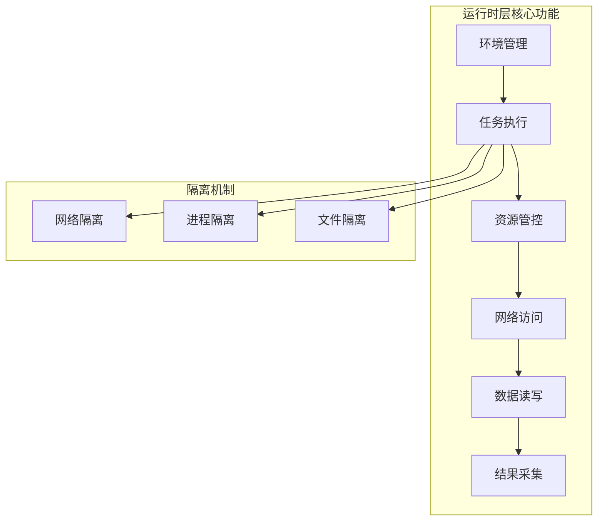

### 6.3 技术实现
1. **环境编排**
基于K8s搭建，K8s是行业里成熟的容器编排工具，专门用来管理大量容器、调度算力。通过K8s可以快速创建、启动、销毁容器，管理资源，不用自己开发复杂逻辑。

2. **资源隔离**
通过K8s的命名空间、资源配额功能，实现用户、环境之间的隔离。每个用户的环境在独立的命名空间里，资源配额独立设置，保证互不干扰。**同时开启容器文件系统隔离，每个容器都是独立文件系统，即便容器内代码有恶意行为，也只能影响当前容器，无法突破环境边界。**

3. **存储对接**
通过K8s的PV/PVC存储卷机制，把NAS存储目录挂载到容器里。PVC会绑定用户唯一标识，只匹配该用户的NAS目录权限。容器读写文件的时候，NAS会校验权限，只放行当前用户目录的操作请求，从运行环境、存储权限、身份校验三个层面，彻底杜绝跨用户数据访问。

4. **网络管理**
通过K8s的Service、Ingress功能，实现端口映射、服务暴露、访问路由。同时配置网络策略，限制容器之间、外部网络的访问，保证安全。

5. **日志采集**
集成日志采集工具，实时收集容器内的运行日志、资源指标，汇总之后上报给平台层。日志会做结构化处理，方便平台层展示、排查问题。**日志会包含用户身份、环境ID、操作行为，后续如果出现安全问题，可以快速定位溯源。**

## 七、整体运行逻辑
1. 用户打开浏览器，登录账号进入工作台，在交互层进行文档编辑、代码编写、文件管理，完成内容创作和准备工作。

2. 编辑、文件操作类请求，前端会直接发送到平台层。平台层校验用户身份、权限，确认合法之后，调用数据层接口，完成文件保存、修改、删除、版本记录等操作，操作完成之后，结果实时返回前端展示。

3. 本地运行请求，不会经过后端，直接在前端通过WebContainer执行。代码运行过程中，日志、输出实时展示在页面，运行结束后，结果可以直接插入文档，整个过程完全在前端完成，响应速度最快。**本地运行环境同样做隔离，只访问当前浏览器会话下的用户临时文件，不会触碰云端其他用户数据。**

4. 云端运行请求，前端发送到平台层。平台层先校验用户剩余算力额度、权限，校验通过之后，向运行时层下发创建环境、执行任务的指令。指令里会带上用户唯一身份标识，作为后续所有操作的身份依据。

5. 运行时层收到指令后，创建独立运行容器，配置资源上限、网络策略，同时根据身份标识，向数据层申请该用户的NAS目录挂载权限。数据层校验身份后，只开放该用户目录，完成挂载。

6. 容器启动后，执行用户任务，运行过程中只读写当前挂载的用户目录文件，日志、结果直接写入NAS，同时实时上报运行状态、日志到平台层。

7. 任务运行完成、用户手动停止、闲置超时后，平台层下发销毁指令，运行时层销毁容器，释放算力资源。销毁后挂载目录自动解绑，临时运行文件清理，不留任何跨用户访问痕迹。

8. 平台层汇总运行结果、日志、资源使用数据，返回前端页面展示。用户可以查看运行结果、下载文件、恢复历史版本，或者继续编辑、发起新任务。

9. 用户退出工作台、关闭浏览器时，所有已保存的内容都会留在云端。下次登录、换设备登录时，直接加载之前的文件、环境，无缝衔接工作。

整个流程下来，用户从写内容、跑任务到存结果，全程不用关心后端、存储、环境，所有复杂操作都由系统自动完成，用户只需要专注于自己的工作本身。同时在看不见的底层，身份校验、环境隔离、存储隔离、日志溯源全程在线，从用户登录、环境创建、文件读写、任务执行、环境销毁，每一步都做了安全隔离和权限管控，既保证使用流畅，也守住数据安全底线。

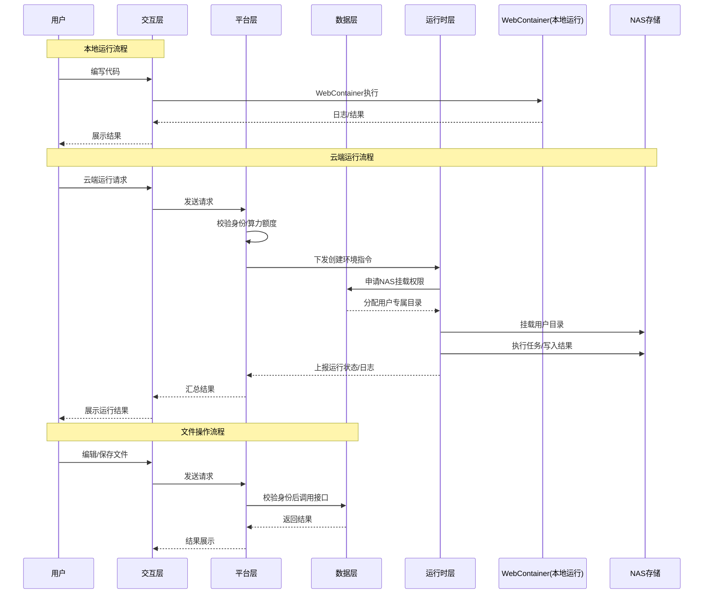

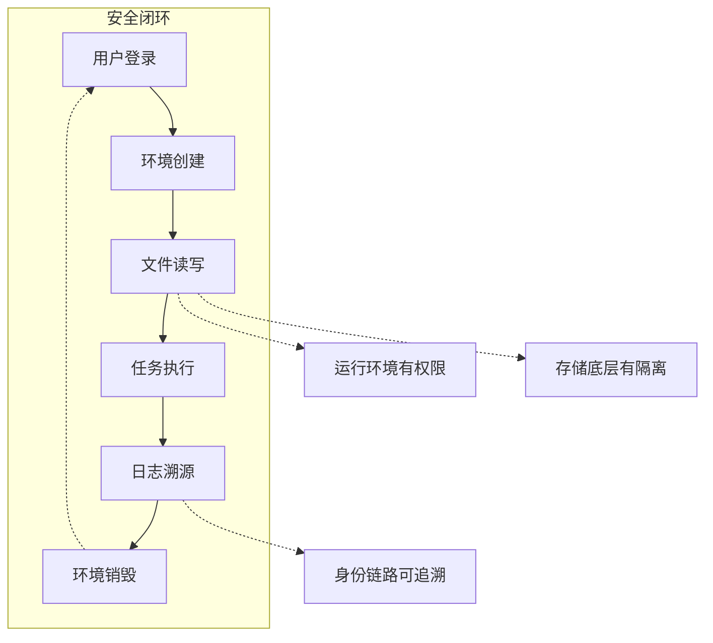

## 八、技术选型整体考量
### 8.1 选型原则
1. **成熟稳定优先**
所有技术选型，都优先选择行业里经过大规模验证、使用广泛的技术。成熟技术有完善的文档、社区支持，遇到问题可以快速找到解决方案，开发、维护成本更低，系统更稳定。

2. **分层独立解耦**
四层架构之间技术互不绑定，交互层、平台层、数据层、运行时层各自使用适合自己的技术。后续如果某一层技术需要升级、替换，不会影响其他层，系统灵活性更强。

3. **以用户体验为核心**
前端优先选择操作流畅、上手简单的技术，保证用户使用感受；后端优先选择稳定、安全、高效的技术，保证系统可靠。一切技术选型，最终都要服务于用户体验。

4. **适配长期迭代**
选型的时候不局限于当前需求，还要考虑后续用户量增长、功能拓展。预留足够的扩展空间，保证后续可以平滑升级，不用推翻现有架构重新开发。

### 8.2 各层选型优势
1. **前端**
Tiptap、Monaco Editor、WebContainer都是前端领域针对编辑、运行场景的成熟方案，开发成本低，上手体验好。组件化开发模式，方便后续新增功能、优化页面。

2. **平台层**
Spring Cloud Gateway、Spring Boot微服务架构，是后端主流技术，高并发、高可用，适合用户量不断增长的场景。对接K8s原生接口，不用重复造轮子，快速实现算力调度能力。

3. **数据层**
关系型数据库、Redis、Kafka、NAS、对象存储的组合，覆盖了结构化数据、缓存、异步任务、文件存储、静态资源分发所有场景。尤其是NAS按用户目录隔离、权限精准控制，刚好匹配产品对数据安全隔离的核心需求，兼顾性能、安全、成本。

4. **运行时层**
基于K8s搭建运行环境，是云原生领域的标准做法。K8s本身自带命名空间隔离、资源配额、网络策略、PV/PVC权限绑定能力，能快速实现环境管理、资源管控、网络暴露。依托K8s成熟的安全能力，不用从零开发隔离机制，开发和运维成本都更低，安全可靠性更强。

## 九、产品落地与迭代方向
### 9.1 初期落地
优先打通核心工作流程，保证文档编辑、代码编辑、本地运行、云端基础运行、文件管理、基础AI辅助功能稳定可用。

重点打磨四层之间的配合，尤其是运行时层和数据层的文件读写流畅度，以及身份校验、目录隔离、环境隔离的安全机制，保证用户写代码、跑代码、存结果的全流程顺畅，同时数据安全不出问题。优化页面加载速度、操作响应速度，让用户第一时间感受到便捷。

初期不追求功能多，而是追求核心功能稳定、好用、安全，先让用户能完整、顺畅地完成自己的工作，验证产品核心价值。

### 9.2 中期迭代
在核心流程稳定的基础上，丰富功能细节。增加更多编程语言、运行环境支持；优化版本管理功能，增加批量操作、版本对比等细节；升级AI辅助能力，增加更多场景化辅助功能；优化跨设备同步，保证不同浏览器、不同设备体验一致。

重点优化云端运行速度、文件读写速度，解决用户使用过程中反馈的卡顿、等待问题。同时持续强化安全管控，细化权限粒度、优化隔离策略、完善日志溯源，定期做安全巡检，守住数据安全底线。

### 9.3 长期拓展
基于现有四层架构，拓展更多延伸功能。比如简单的项目协作、插件生态、第三方工具集成、高级算力套餐、自定义环境配置等。

优化算力调度算法，提升资源利用率；完善商业化体系，设计更灵活的套餐模式；打造专属生态，围绕个人工作台，拓展更多实用功能。同时持续投入安全建设，定期升级隔离机制、做安全攻防测试，让用户可以放心把个人工作资产存放在平台，让Web Studio从单纯的工作工具，变成个人数字资产沉淀、成长的安全平台。

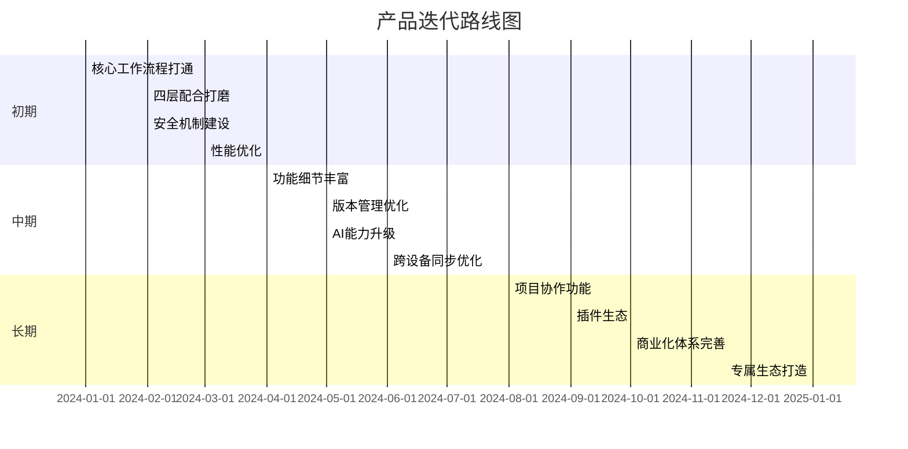

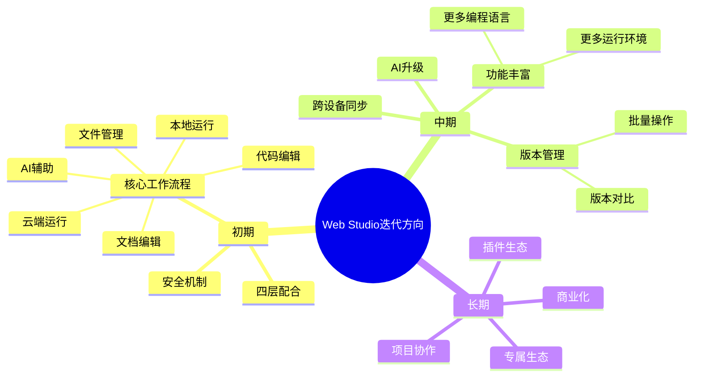

## 十、总结
Web Studio 个人专属线上工作台，核心是围绕个人完整工作流，把分散的编辑、运行、管理、存储、辅助能力整合在一起，通过四层架构实现分工协作，打造一个简单、高效、安全、随时随地可用的线上工作空间。

四层架构分工清晰、相互配合，运行时层直接对接数据层，打通了整个工作全流程，是产品最核心的设计亮点。同时从身份校验、存储目录、运行环境、网络隔离、日志溯源多个维度，搭建了一套完整的安全隔离和数据访问管控体系，解决用户最关心的数据安全问题。整体技术选型成熟务实，既满足当前用户核心需求，又为后续迭代、拓展预留了足够空间。

不管是开发者、学习者、创作者还是职场人，都可以在这里摆脱工具、环境、设备的限制，专注于自己的工作本身。Web Studio最终要实现的，是让个人线上工作更简单、更高效、更安全，成为每个人都离不开的随身工作台。