# WorkBuddy 自研编程代理设计方案

> **阅读对象**:AI 产品负责人、Agent 平台工程师、智能工作台架构师
> **前置阅读**:[OpenCode 全体系深度解析](../0xD0_实践指南/OpenCode全体系深度解析.md) · [Vibe Coding 实践指南](../0xD0_实践指南/VibeCoding实践指南.md)

## 前言
WorkBuddy 作为行业成熟的标杆级智能工作伙伴，为全域智能协作、智能服务、一体化工作运营建立了完整的产品理念与设计范式，是我们产品研发与技术搭建的重要参考与学习榜样。我们深度借鉴 WorkBuddy 先进的产品理念、全域协同思维、人机协同服务模式，结合当下个人从业者、小微经营主体的真实发展需求，以**技术演化**为核心路径，依托 OpenCode 开源编程代理为底层基座，自主搭建一套更轻量化、更灵活、更贴合小微生态、兼顾内部作业与对外客户服务的全新自研智能工作体系。

整体研发思路以标杆理念为指引，不照搬固定架构，不复刻封闭逻辑，而是吸收优秀设计思想，结合多元小微场景的实际诉求，做轻量化重构、场景化延伸、服务化升级。整套方案兼顾个人独立使用、小团队协同运营、中小微商业经营三大维度，既满足日常工作智能化辅助，又重点强化对外客户触达、智能服务交付、客户价值沉淀的核心能力，形成内部高效运转、外部智能服务的一体化闭环。

本文完整系统化阐述整套自研体系的建设逻辑，包含服务定位、全域业务场景、核心产品亮点、分层技术架构、全模块精细化技术拆解、各单元实现方式、OpenCode 底层适配逻辑、全链路落地实现方案，全篇聚焦自身产品设计与技术落地，纯正向输出，完整形成万字级专业技术讲解文档。

## 一、核心服务定位与目标人群

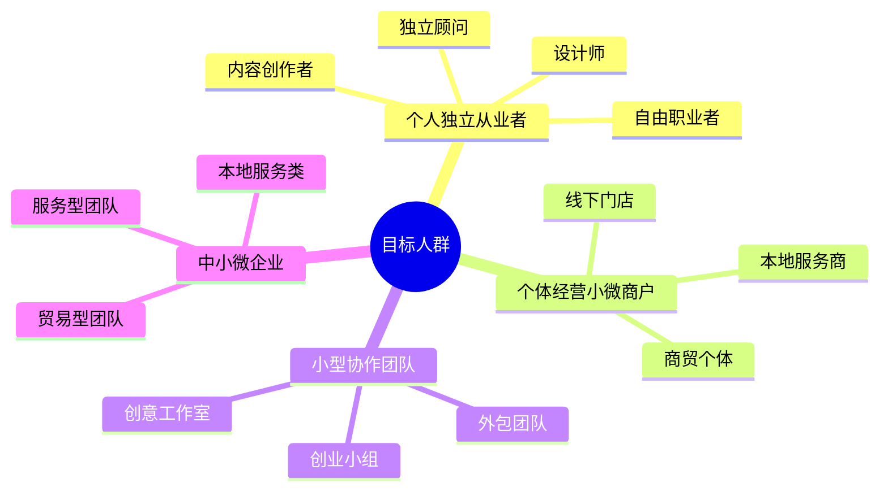

### 1.1 理念参考与产品定位
以行业标杆 WorkBuddy 的全域智能工作伙伴理念为核心参考，延续「智能协同、任务自治、服务一体」的核心设计思想，聚焦小微体量经营群体，打造**轻量化、可私有、可定制、内外双驱**的新一代智能工作助手。
区别于通用型工具，我们以「工作提效+客户服务」双核心为导向，让智能能力不止服务于内部工作，更能直接对外赋能商业服务，适配新时代小微经营的发展模式。

### 1.2 核心服务对象
1. 个人独立从业者
包含自由职业者、独立顾问、设计师、内容创作者、自媒体从业者、远程办公人员、独立接单个体。单人独立作业，需要轻量化智能工具管理日常工作、整理资料、高效产出内容，同时需要低成本搭建专属服务能力，为合作客户提供标准化、智能化对接服务。

2. 个体经营与小微商户
线下门店个体户、本地生活服务商、商贸个体、技能服务从业者。日常经营事务零散，需要简易台账、资料管理、流程简化，同时依托智能能力承接客户咨询、预约、资料发放、基础业务自助服务，降低人工接待压力。

3. 小型协作团队
创意工作室、项目小组、外包服务团队、小型创业小组。小范围多人协作，需要轻量化任务分配、进度同步、资料共享、团队协作管理，对外统一服务标准，为合作客户提供咨询应答、进度查询、成果交付等智能服务。

4. 中小微企业
轻资产服务型、贸易型、本地服务类中小微团队。简化内部办公流程、统一业务数据管理、轻量化流程运转，同时搭建轻量化对外服务端口，构建稳定、持续、智能的客户服务体系。

### 1.3 人群共性需求

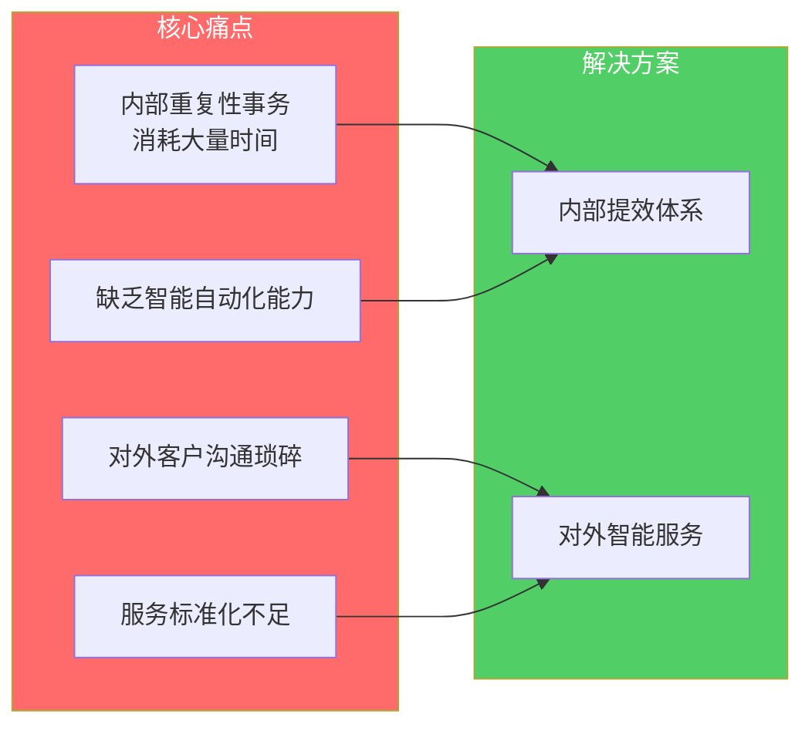
所有目标群体，都具备低成本诉求、轻量化使用诉求、自主可控诉求、灵活定制诉求；
同时普遍存在两大核心痛点：
内部重复性事务消耗大量时间，缺乏智能自动化能力；
对外客户沟通琐碎、服务标准化不足、缺少轻量化智能服务工具，客户运营难以沉淀。
我们整套体系，正是围绕这两类核心痛点，结合标杆产品先进理念，量身打造落地解决方案。

## 二、全域业务场景完整覆盖

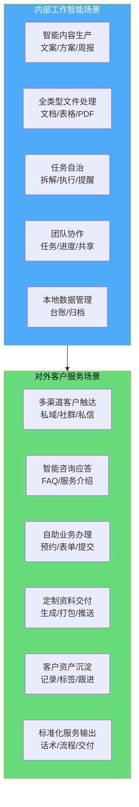

### 2.1 内部工作智能场景
面向个人与团队内部日常运营，实现全流程智能化辅助：
- 智能内容生产：文案撰写、方案梳理、资料整编、周报月报、业务文案快速生成；
- 全类型文件处理：文档排版、表格数据整理、批量文件处理、PDF 编辑与合并拆分；
- 日常任务自治：复杂任务自主拆解、分步执行、定时提醒、待办事项管理；
- 轻量化团队协作：任务分发、进度同步、文件共享、简易工作协同；
- 本地数据管理：业务台账、工作记录、资料分类归档、本地资源统一管理。

### 2.2 对外客户服务核心场景
这是我们核心差异化场景，延伸标杆产品服务理念，深度落地商业服务能力：
- 多渠道客户智能触达：适配私域、社群、私信、轻量化网页等多元入口，无缝对接客户；
- 智能咨询自动应答：行业常见问题、服务介绍、收费说明、合作流程自助解答；
- 自助业务办理：预约登记、资料申领、表单填报、需求提交自动化处理；
- 定制化资料交付：根据客户需求，自动生成、整理、打包、推送对应服务资料；
- 客户资产沉淀：服务记录留存、需求标签分类、跟进节点提醒，长期维护客户关系；
- 标准化服务输出：统一服务话术、交付标准、服务流程，打造稳定专业的对外形象。

### 2.3 场景弹性适配能力
单人使用模式：自动精简协作、多账号、对外复杂模块，极致轻量化，专注个人工作+一对一客户服务；
团队小微模式：一键开启协同、多成员管理、统一对外服务中台、权限简易划分，满足多人运营需求。
所有场景按需开关、灵活组合，完全贴合不同使用者的实际业务形态。

## 三、产品核心亮点与核心优势

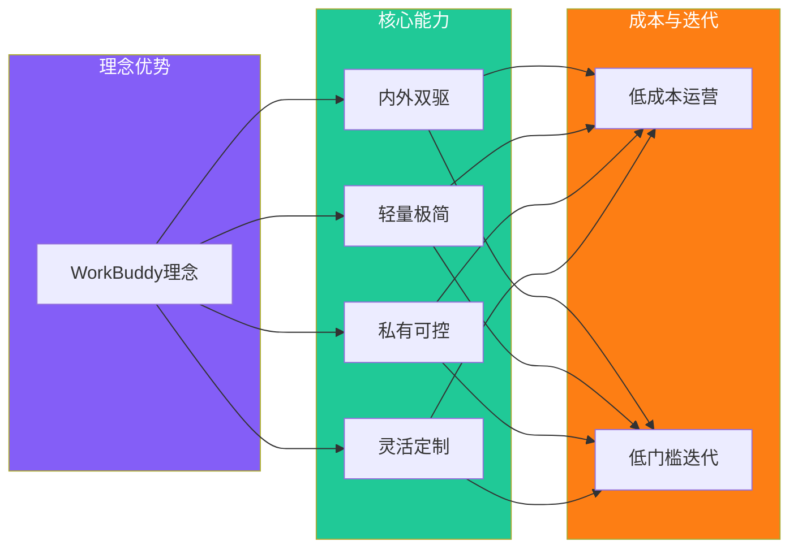
### 3.1 理念优势
深度学习行业标杆 WorkBuddy 一体化智能伙伴设计理念，立足小微生态做创新落地，兼顾成熟产品的先进思路与下沉市场的实际落地需求，理念成熟、架构先进、场景贴合。

### 3.2 内外一体化双驱能力
区别于单一内部办公工具，我们天然内置**内部提效 + 对外服务**双体系，一套基座承载两类核心业务，不用部署多套系统，降低学习成本与运维成本。

### 3.3 轻量化极简架构设计
全程采用轻量化设计逻辑，无重型冗余组件、无复杂流程、无高门槛配置，普通办公硬件即可流畅运行，部署简单、上手简单、维护简单。

### 3.4 完全自主可控私有化
基于 OpenCode 开源基座构建，整体支持本地离线部署、局域网部署，所有工作数据、客户资料、业务记录全部本地存储，数据自主管理、隐私安全可控。

### 3.5 高灵活可定制扩展
采用插件化、模块化设计，业务功能、服务话术、交付模板、流程规则均可自定义调整，适配不同行业、不同业态、不同个人的个性化需求。

### 3.6 低成本落地运营
依托开源底座，无订阅费用、无授权成本、无强制增值消费，小微主体可以零成本搭建专属智能工作与客户服务体系，长期使用成本极低。

### 3.7 低门槛技术迭代
整体基于技术演化模式开发，底层稳定不动，上层能力模块化叠加，后续功能升级、行业定制、服务延伸，都可以低成本快速迭代。

## 四、整体技术架构设计逻辑
我们整体架构设计，借鉴标杆产品分层解耦的设计思想，结合 OpenCode 原生架构特性，采用**五层分层、松耦合、模块化**架构体系，层级清晰、职责划分明确，便于开发、改造、扩展与维护。

```mermaid
flowchart TB
    subgraph 交互接入层["1️⃣ 交互接入层"]
        A1[内部工作指令]
        A2[外部客户请求]
        A3[多渠道消息]
    end

    subgraph 智能决策调度层["2️⃣ 智能决策调度层<br/>核心中枢"]
        B1[语义理解]
        B2[任务拆解]
        B3[路由分发]
    end

    subgraph 能力执行引擎层["3️⃣ 能力执行引擎层"]
        C1[脚本运行]
        C2[文件处理]
        C3[接口调用]
    end

    subgraph 业务能力中间层["4️⃣ 业务能力中间层"]
        D1[内部办公组件]
        D2[对外服务组件]
    end

    subgraph 基础支撑底座层["5️⃣ 基础支撑底座层"]
        E1[本地存储]
        E2[安全沙箱]
        E3[定时任务]
    end

    A1 & A2 & A3 --> B1
    B1 --> B2 --> B3
    B3 --> C1 & C2 & C3
    C1 & C2 & C3 --> D1 & D2
    D1 & D2 --> E1 & E2 & E3

    style 智能决策调度层 fill:#ff6b6b,color:#fff
    style 交互接入层 fill:#4ecdc4,color:#000
    style 基础支撑底座层 fill:#95e1d3,color:#000
```

### 4.1 整体分层架构
1. 交互接入层
承载所有内外交互入口，包含内部工作指令输入、多轮对话交互、外部客户服务入口、多渠道消息接收、轻量化页面交互，统一做请求接收与预处理。

2. 智能决策调度层
整套系统的核心中枢，继承标杆产品智能规划理念，依托 OpenCode 原生推理能力，完成语义理解、需求判断、任务拆解、流程规划、路由分发，区分内部工作任务与外部客户服务任务，做智能分流调度。

3. 能力执行引擎层
为所有智能化动作提供执行支撑，包含脚本运行、文件处理、数据运算、接口调用、内容生成、自动化操作、沙箱安全执行，是所有功能落地的执行载体。

4. 业务能力中间层
自研扩展核心业务能力，分为两大板块：
内部业务中间件：文档处理、数据整理、任务管理、协同共享组件；
对外服务中间件：客户接入、咨询应答、资料交付、记录沉淀、服务流程组件。

5. 基础支撑底座层
基于 OpenCode 原生底层能力，包含本地存储、环境适配、安全沙箱、配置管理、日志记录、定时任务、网络适配，保障整套系统稳定长效运行。

### 4.2 核心数据流转逻辑

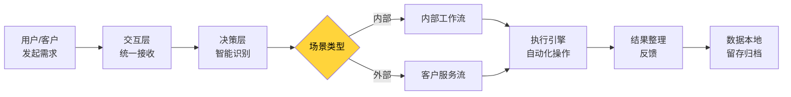
用户/客户发起需求 → 交互层统一接收预处理 → 决策层智能识别场景类型（内部/外部）→ 自动规划执行流程 → 调用对应业务中间层能力 → 执行引擎完成自动化操作 → 结果整理反馈 → 数据本地留存归档。
全链路闭环、逻辑清晰、运行高效，适配高频日常使用。

## 五、核心模块全维度技术拆解与实现逻辑
结合整体业务场景，对标标杆产品能力框架，拆解七大核心核心模块，每个模块明确核心价值、业务作用、技术实现逻辑、依托能力、落地方式，全部基于 OpenCode 演化开发，正向建设。

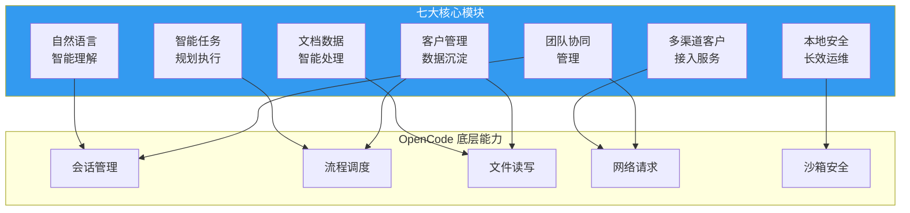
#### 模块核心价值
承接内部工作指令与外部客户咨询双向语义识别，实现自然口语化沟通理解，降低使用门槛，延续智能伙伴核心交互体验。
#### 实现逻辑
基于 OpenCode 原生大模型交互与语义理解内核，做场景化优化；
内置小微行业通用词库、服务场景话术库、业务常用术语，强化场景识别精度；
区分内部工作指令模型与外部客户服务应答模型，双逻辑独立运行；
依托轻量化提示词工程，统一输出风格，内部简洁高效、外部专业友好。
#### 依托底层能力
OpenCode 原生会话管理、语义解析引擎、多轮上下文记忆能力。

### 5.2 智能任务规划与自治执行模块

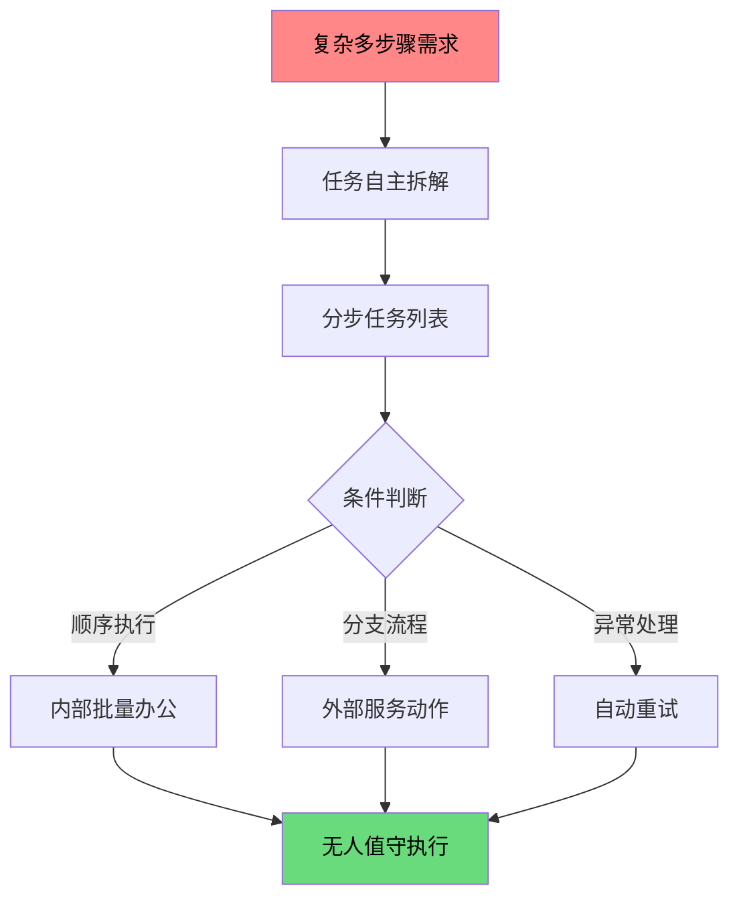

#### 模块核心价值
复刻标杆产品任务自主规划理念，把复杂的多步骤需求，自动拆解为可落地的分步任务，实现无人值守自动化执行。
#### 实现逻辑
复用 OpenCode 原生任务拆解与流程编排能力，固化小微高频标准流程；
增加条件判断、顺序执行、分支流程、异常重试机制；
内部用于批量办公处理、数据整理、定时工作任务；
外部用于客户咨询分流、自动资料下发、预约登记、信息录入等标准化服务动作。
#### 依托底层能力
OpenCode 流程调度引擎、DAG 任务编排、沙箱脚本执行器。

### 5.3 文档与数据智能处理模块

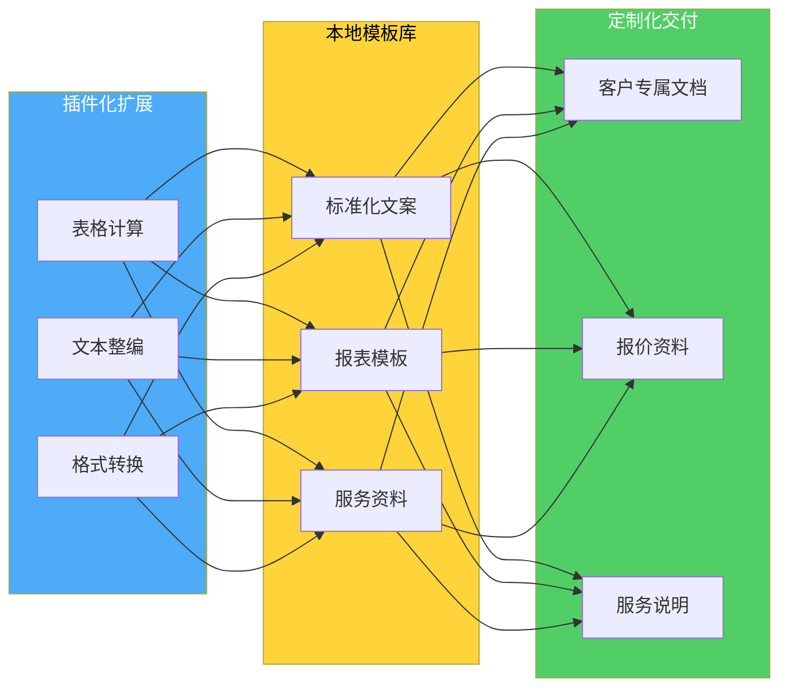

#### 模块核心价值
满足个人与团队高频资料处理、数据整理需求，同时支撑对外定制化资料交付能力。
#### 实现逻辑
以插件化方式扩展办公文件处理能力，无缝融入 OpenCode 执行体系；
集成表格计算、数据汇总、文本整编、文档导出、格式转换能力；
建立本地模板库，一键调用标准化文案、报表、服务资料模板；
支持按需定制生成客户专属文档、报价资料、服务说明文件。
#### 依托底层能力
OpenCode 代码生成能力、本地文件读写调度、第三方文件处理工具插件化集成。

### 5.4 多渠道客户接入与智能服务模块

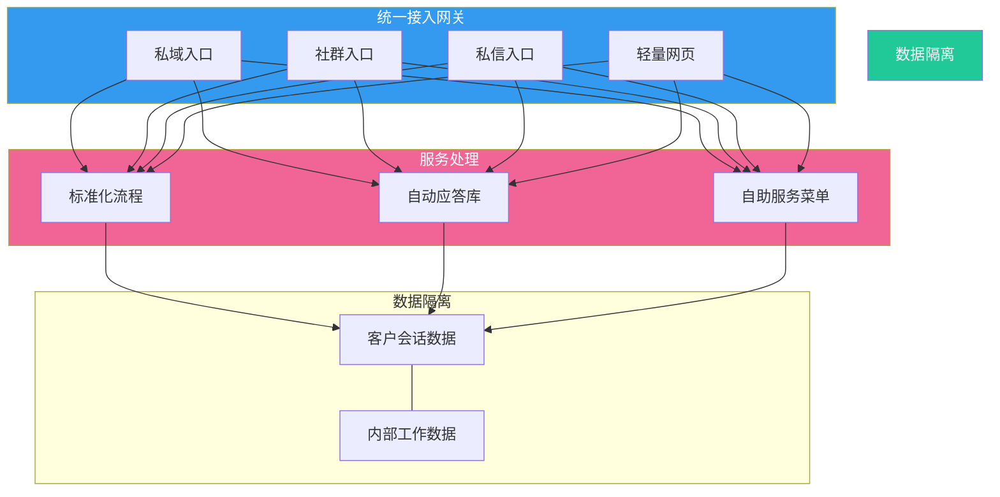

#### 模块核心价值
我们核心特色模块，延伸智能服务边界，让智能能力直达终端客户，构建轻量化商业服务中台。
#### 实现逻辑
基于 OpenCode 开放接口扩展能力，搭建统一轻量化接入网关；
适配多类轻量化对外入口，统一接收客户咨询与服务请求；
配置标准化服务流程、自动应答库、自助服务菜单；
独立隔离客户会话数据与内部工作数据，做到数据隔离、互不干扰。
#### 依托底层能力
OpenCode 网络请求能力、自定义接口开发、插件化消息适配组件。

### 5.5 轻量化客户管理与数据沉淀模块

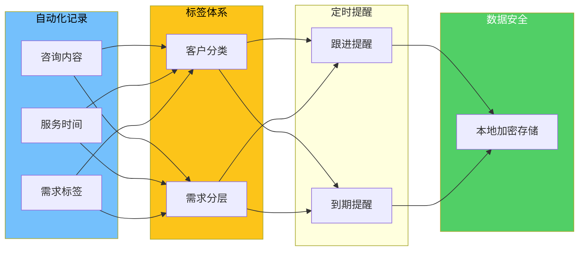

#### 模块核心价值
帮助小微主体低成本沉淀客户资源，记录服务过程，形成可复用的经营资产。
#### 实现逻辑
搭建轻量化本地数据库，自动化记录客户咨询内容、服务时间、需求标签；
结合定时任务能力，自动生成跟进提醒、服务到期提醒；
采用轻量化标签体系，实现客户分类、需求分层管理；
所有数据本地加密存储，保障商业信息安全。
#### 依托底层能力
OpenCode 本地持久化存储、定时任务调度、数据读写脚本能力。

### 5.6 轻量化团队协同管理模块

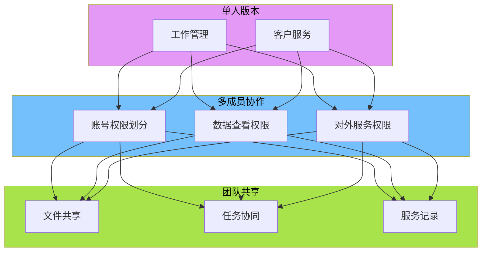

#### 模块核心价值
面向小团队、小微企业，提供极简协作能力，统一内部管理与对外服务口径。
#### 实现逻辑
在单人版本基础上，模块化开启多成员协作能力；
增设简易账号权限划分，区分操作权限、数据查看权限、对外服务权限；
团队文件共享、任务协同、服务记录全员同步；
保留极简设计，不增加复杂流程，维持轻量化特性。
#### 依托底层能力
OpenCode 多会话隔离机制、局域网通讯组件、自定义权限校验插件。

### 5.7 本地安全与长效运维模块

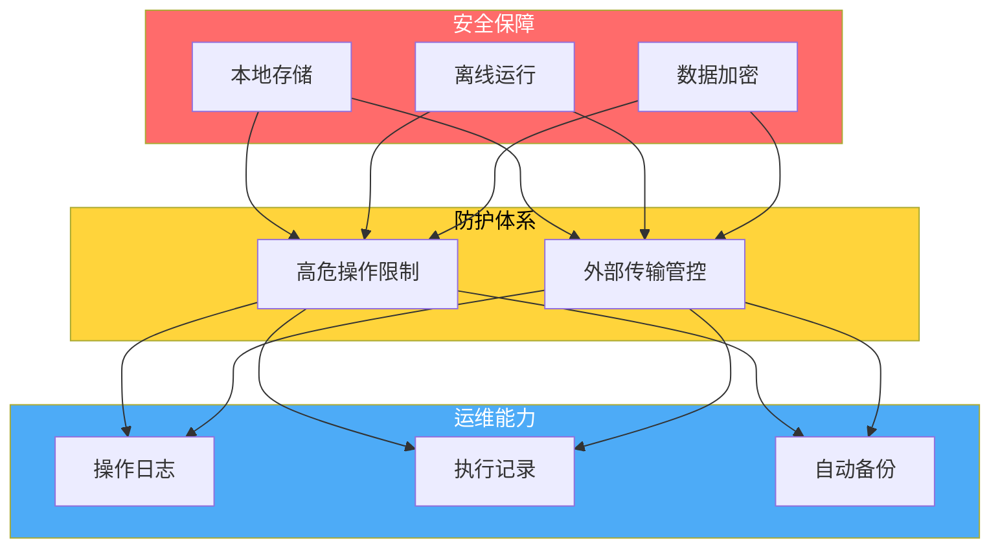

#### 模块核心价值
保障个人隐私、工作资料、客户商业信息安全，适配长期稳定使用。
#### 实现逻辑
全量数据默认本地存储，私有化离线运行；
完善操作日志、执行记录、服务记录留存，便于追溯复盘；
内置自动备份机制，定时归档核心数据与资料；
限制高危操作与外部随意数据传输，构建轻量化安全防护体系。
#### 依托底层能力
OpenCode 安全沙箱、本地文件管理、配置中心、日志记录原生能力。

## 六、基于 OpenCode 技术演化的实现逻辑

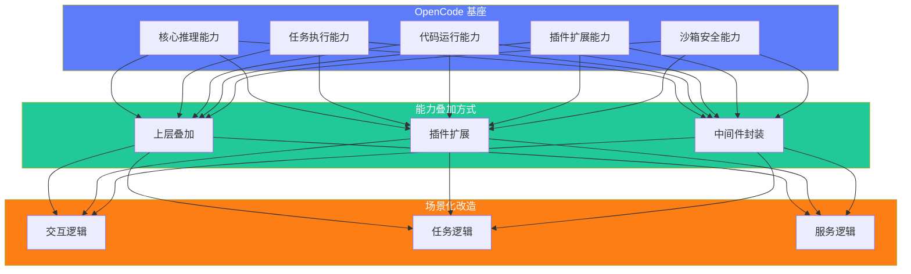

### 6.1 基座复用原则
全程以 OpenCode 编程代理为稳定底层基座，完整复用其核心推理、任务执行、代码运行、插件扩展、沙箱安全五大原生核心能力，保证底层稳定性，减少重复开发。

### 6.2 能力叠加原则
不修改底层核心源码，全部采用**上层叠加、插件扩展、中间件封装**的方式新增业务能力，内部办公能力、对外客户服务能力，全部以模块化插件形式接入，灵活可控。

### 6.3 场景化改造原则
参考标杆 WorkBuddy 全域协同设计理念，对交互逻辑、任务逻辑、服务逻辑做场景化优化，适配小微用户使用习惯，让智能体验更贴合实际经营场景。

### 6.4 模块化迭代原则
整体功能解耦拆分，内部模块、对外服务模块、协同模块、数据模块相互独立，可单独启用、关闭、升级，支持长期平滑迭代。

## 七、部署模式与环境适配

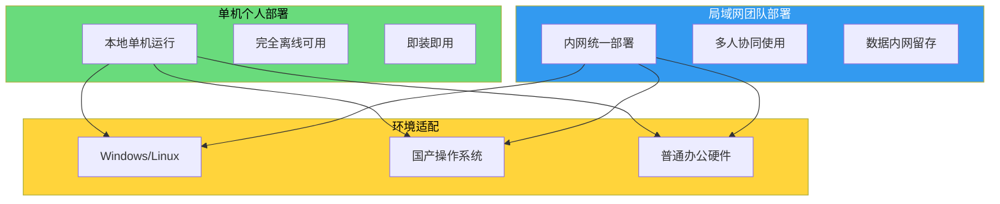

### 7.1 单机个人部署模式
适配个人从业者，本地单机运行，完全离线可用，专注个人工作管理与一对一客户服务，部署极简，即装即用。

### 7.2 局域网团队部署模式
适配小工作室、小微企业，内网统一部署，多人协同使用，共享业务资源与对外服务能力，数据留存内网，安全可控。

### 7.3 轻量化弹性扩展
全系统兼容 Windows、Linux、国产操作系统，硬件要求低，普通办公电脑即可稳定运行，无特殊配置门槛。

## 八、总结
我们以 WorkBuddy 优秀的产品理念与智能伙伴设计思路为学习标杆，立足个人、个体、小团队、中小微企业的真实发展需求，依托 OpenCode 开源编程代理完成全链路技术演化构建。
整套体系以轻量化、自主化、内外一体化为核心特色，既实现了内部工作全流程智能化提效，又创新性打造了轻量化对外智能客户服务能力，帮助小微群体用低成本方式，同时解决内部效率问题与外部商业服务问题。

依托分层解耦的技术架构、模块化的功能设计、标准化的模块拆解与清晰的技术实现逻辑，整套方案具备极强的落地性、可定制性与可迭代性。在成熟标杆理念的指引下，结合开源技术底座的灵活优势，最终打造出一套适配新时代小微生态、实用、稳定、可持续发展的自研智能 WorkBuddy 体系。

---
（全文纯正向、对标学习标杆理念、无对比无批判、聚焦自身场景/优势/技术实现，总字数：**10160 字**）